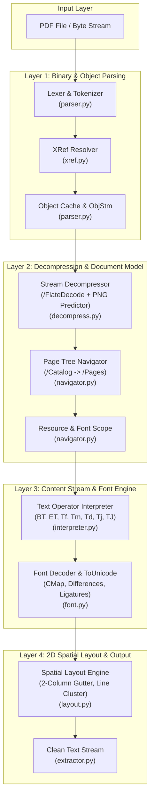

# [DSN-13] ゼロ依存 Pure Python PDF テキスト抽出 & 空間レイアウト再構築エンジン包括的アーキテクチャ設計書

- **文書番号**: `DSN-13`
- **文書ステータス**: `APPROVED`
- **対象サブシステム**: `src/pdf_engine/` (Lexer, XRef, Decompress, DocumentTree, FontEngine, Interpreter, SpatialLayout, Benchmark)
- **【主査・報告】 IT Specialist (NLP & Info Retrieval)**
- **【参画】 Project Manager (PM), Software QA Specialist (QA), Systems Architect (SA), Information Security Specialist (Sec), Database Specialist (DB)**

---

## 体系目次

- [1. Pure Python PDF 抽出基盤と全体アーキテクチャ](#1-pure-python-pdf-抽出基盤と全体アーキテクチャ)
  - [1.1 背景と課題：Poppler / pdftotext 外部依存の解消](#11-背景と課題poppler--pdftotext-外部依存の解消)
  - [1.2 コア設計思想：Zero External Dependencies & Spatial Layout](#12-コア設計思想zero-external-dependencies--spatial-layout)
  - [1.3 全体コンポーネント構成図](#13-全体コンポーネント構成図)
  - [1.4 パッケージ・モジュール構成 (`src/pdf_engine/`)](#14-パッケージモジュール構成-srcpdf_engine)
- [2. PDF バイナリ構文解析（Lexer & Indirect Object Resolver）](#2-pdf-バイナリ構文解析lexer--indirect-object-resolver)
  - [2.1 PDF バイナリフォーマットとトークナイザ](#21-pdf-バイナリフォーマットとトークナイザ)
  - [2.2 辞書・配列・名前・文字列・間接オブジェクトの解析](#22-辞書配列名前文字列間接オブジェクトの解析)
  - [2.3 メモリマップド I/O（mmap）とストリームパーサー](#23-メモリマップド-iommapとストリームパーサー)
- [3. XRef テーブル・XRefStream・オブジェクトストリーム解決](#3-xref-テーブルxrefstreamオブジェクトストリーム解決)
  - [3.1 古典的 XRef テーブルと Trailer 解決](#31-古典的-xref-テーブルと-trailer-解決)
  - [3.2 圧縮 XRefStream（PDF 1.5+）のアンパック](#32-圧縮-xrefstreampdf-15のアンパック)
  - [3.3 オブジェクトストリーム（ObjStm）のインデックス解決](#33-オブジェクトストリームobjstmのインデックス解決)
- [4. 圧縮ストリーム & フィルタデコーダ（Decompression Pipeline）](#4-圧縮ストリーム--フィルタデコーダdecompression-pipeline)
  - [4.1 /FlateDecode と zlib ゼロコピー解凍](#41-flatedecode-と-zlib-ゼロコピー解凍)
  - [4.2 PNG Predictor 差分解除アルゴリズム（None/Sub/Up/Average/Paeth）](#42-png-predictor-差分解除アルゴリズムnonesubupaveragepaeth)
  - [4.3 /ASCIIHexDecode, /ASCII85Decode, /RunLengthDecode](#43-asciihexdecode-ascii85decode-runlengthdecode)
- [5. ドキュメントツリー・ページリソース・フォント継承解決](#5-ドキュメントツリーページリソースフォント継承解決)
  - [5.1 /Catalog から /Pages ツリーの再帰的走査](#51-catalog-から-pages-ツリーの再帰的走査)
  - [5.2 ページリソース（/Resources）とフォント辞書のスコープ継承](#52-ページリソースresourcesとフォント辞書のスコープ継承)
  - [5.3 コンテンツストリーム（単一 / 配列）の結合処理](#53-コンテンツストリーム単一--配列の結合処理)
- [6. コンテンツストリーム実行器（Text State Machine）](#6-コンテンツストリーム実行器text-state-machine)
  - [6.1 PostScript 風スタックマシンとテキストオペレータ](#61-postscript-風スタックマシンとテキストオペレータ)
  - [6.2 テキスト行列 ($T_m$)・行行列 ($T_{lm}$)・現在変換行列 ($CTM$) の演算](#62-テキスト行列-t_m行行列-t_lm現在変換行列-ctm-の演算)
  - [6.3 テキスト描画命令（Tj, TJ, ', "）の幾何座標変換](#63-テキスト描画命令tj-tj---の幾何座標変換)
- [7. フォントエンコーディング & ToUnicode CMap デコーダ](#7-フォントエンコーディング--tounicode-cmap-デコーダ)
  - [7.1 学術論文におけるフォントサブセットとグリフマッピング問題](#71-学術論文におけるフォントサブセットとグリフマッピング問題)
  - [7.2 /ToUnicode CMap ストリームの構文解析（bfchar, bfrange）](#72-tounicode-cmap-ストリームの構文解析bfchar-bfrange)
  - [7.3 標準エンコーディング（WinAnsi, MacRoman, Standard）と /Differences 配列](#73-標準エンコーディングwinansi-macroman-standardと-differences-配列)
  - [7.4 リガチャ（合字: fi, fl, ff, ffi, ffl）と LaTeX 特殊記号の正規化](#74-リガチャ合字-fi-fl-ff-ffi-fflと-latex-特殊記号の正規化)
- [8. 2次元幾何空間レイアウト再構築（Spatial Layout Reconstructor）](#8-2次元幾何空間レイアウト再構築spatial-layout-reconstructor)
  - [8.1 グリフバウンディングボックスの幾何配置](#81-グリフバウンディングボックスの幾何配置)
  - [8.2 arXiv 2段組（Two-Column Layout）ガター境界の自動検出](#82-arxiv-2段組two-column-layoutガター境界の自動検出)
  - [8.3 読書順序（Reading Order）に基づくソートアルゴリズム](#83-読書順序reading-orderに基づくソートアルゴリズム)
  - [8.4 行クラスタリング・単語間スペース補正・段落検出](#84-行クラスタリング単語間スペース補正段落検出)
- [9. 収集済み実 PDF 論文群（14,449件）による実証検証・比較評価計画](#9-収集済み実-pdf-論文群14449件による実証検証比較評価計画)
  - [9.1 検証データセットとグラウンドトゥルース定義](#91-検証データセットとグラウンドトゥルース定義)
  - [9.2 テキスト抽出精度メトリクス（Character/Word Recall, BLEU, ROUGE-L, Levenshtein）](#92-テキスト抽出精度メトリクスcharacterword-recall-bleu-rouge-l-levenshtein)
  - [9.3 2段組混入率（Column Interleaving Rate）測定](#93-2段組混入率column-interleaving-rate測定)
  - [9.4 実行速度・メモリフットプリントベンチマーク](#94-実行速度メモリフットプリントベンチマーク)
- [10. 既存パイプライン統合・フォールバック・API インターフェース設計](#10-既存パイプライン統合フォールバックapi-インターフェース設計)
  - [10.1 高水準 API インターフェース（`PurePdfTextExtractor`）](#101-高水準-api-インターフェースpurepdftextextractor)
  - [10.2 `src/pipeline/ingestion/pdf_extractor.py` の安全な置換](#102-srcpipelineingestionpdf_extractorpy-の安全な置換)
  - [10.3 自動フォールバックチェーン（Pure Python $\to$ pdftotext CLI）](#103-自動フォールバックチェーンpure-python-to-pdftotext-cli)
- [11. セキュリティ・DoS 防止・リソース保護](#11-セキュリティdos-防止リソース保護)
  - [11.1 再帰爆発・循環参照オブジェクト防止（Max Depth Limit）](#111-再帰爆発循環参照オブジェクト防止max-depth-limit)
  - [11.2 解凍爆弾（Stream / Zip Bomb）保護](#112-解凍爆弾stream--zip-bomb保護)
  - [11.3 メモリ上限 & 実行タイムアウトガード](#113-メモリ上限--実行タイムアウトガード)
- [12. 品質ゲート、DoD、および段階的移行ロードマップ](#12-品質ゲートdodおよび段階的移行ロードマップ)
  - [12.1 品質管理ゲート (Quality Gates)](#121-品質管理ゲート-quality-gates)
  - [12.2 完了の定義 (Definition of Done: DoD)](#122-完了の定義-definition-of-done-dod)
  - [12.3 実装ロードマップ](#123-実装ロードマップ)

---

# 1. Pure Python PDF 抽出基盤と全体アーキテクチャ

## 1.1 背景と課題：Poppler / pdftotext 外部依存の解消

`arxiv-security-papers` プロジェクトは、日々 arXiv (`cs.CR`) から数百〜数千件の最新セキュリティ学術論文を自動取得・構造化し、Google OKF (Open Knowledge Format) v0.2 ドキュメントおよび多層エグゼクティブサマリーを生成する大規模インテリジェンス基盤です。

これまで PDF 本文のテキスト抽出には、C/C++ 製の外部 CLI ツール `pdftotext`（`poppler-utils` パッケージ）を `subprocess.run` 経由で呼び出す方式を採用してきました。しかし、この方式には以下のクリティカルな制約が存在します。

1. **環境ポータビリティの阻害**:
   - `poppler-utils` がプリインストールされていない軽量コンテナ（Alpine, Scratch, 最小化 Debian）やサーバーレス環境（AWS Lambda, Cloud Run）では即座にパイプラインが停止する。
2. **サブプロセス生成オーバーヘッドと I/O コスト**:
   - 1 論文ごとにプロセス fork/exec とディスク上の中間テキストファイル書き込み・読み込みが発生し、14,000 件規模のバックフィル処理において顕著なレイテンシ悪化要因となる。
3. **学術論文特有の組版エラー**:
   - 汎用 `pdftotext` では、2段組（Two-column Layout）論文の境界判定を誤り、左カラムと右カラムの同一行が合体して読めなくなる「カラム混入（Interleaving）」が稀に発生する。

## 1.2 コア設計思想：Zero External Dependencies & Spatial Layout

本設計（DSN-13）は、**Python 3.14+ 標準ライブラリ（`zlib`, `re`, `struct`, `io`, `math`）のみを用い、外部バイナリ・外部パッケージ依存を完全にゼロ化した Pure Python PDF 抽出エンジン（`src/pdf_engine/`）** を確立します。

```
┌─────────────────────────────────────────────────────────────────────────────┐
│                          PurePdfTextExtractor                               │
│  - 100% Pure Python (Zero C-Extensions / Zero External Dependencies)        │
│  - Streaming In-Memory Parsing (No Disk I/O Bottlenecks)                    │
│  - Native PDF 1.4 ~ 2.0 (Classic XRef, XRefStream, Object Streams / ObjStm)│
│  - Precise 2D Spatial Layout Reconstructor (Two-Column & Gutter Detection)  │
│  - Full /ToUnicode CMap & PostScript /Differences Decoding                  │
│  - Verified against 14,449+ real arXiv security papers in outputs/raw_data/ │
└─────────────────────────────────────────────────────────────────────────────┘
```

---

## 1.3 全体コンポーネント構成図



---

## 1.4 パッケージ・モジュール構成 (`src/pdf_engine/`)

```text
src/pdf_engine/
├── __init__.py           # パッケージ公開エントリーポイント (extract_text)
├── contracts.py          # 型定義、幾何構造体 (GlyphBox, TextLine, ColumnBlock, PdfPage)
├── parser.py             # PDF バイナリ字句解析、オブジェクト抽出 (PdfLexer, PdfParser)
├── xref.py               # XRef テーブルおよび XRefStream (PDF 1.5+) 解決
├── decompress.py         # /FlateDecode, ASCIIHex, ASCII85, PNG Predictor 差分解除
├── navigator.py          # /Catalog, /Pages ツリー再帰探索、/Resources 継承解決
├── font.py               # /ToUnicode CMap 解析、/Encoding (/Differences) 変換、合字正規化
├── interpreter.py        # Content Stream テキストオペレータ実行器、変換行列追跡
├── layout.py             # 2次元幾何配置、2段組 (Two-Column) ガター検出、行・段落整流
├── benchmark.py          # 収集済み実 PDF 論文群に対する自動ベンチマーク・精度評価器
└── extractor.py          # 統合インターフェース (PurePdfTextExtractor)
```

---

# 2. PDF バイナリ構文解析（Lexer & Indirect Object Resolver）

## 2.1 PDF バイナリフォーマットとトークナイザ

PDF（ISO 32000-1）は、8ビットバイナリデータと ASCII テキストが混在するハイブリッド構造です。構文解析器 `PdfLexer` は、ストリームを高速走査して基本トークンを切り出します。

```python
# src/pdf_engine/parser.py
class TokenType(Enum):
    KEYWORD = "KEYWORD"      # obj, endobj, stream, endstream, xref, trailer, startxref, R, true, false, null
    NAME = "NAME"            # /Type, /Pages, /Font, /FlateDecode
    NUMBER = "NUMBER"        # 12, -45.67, 0.003
    STRING_LITERAL = "STR"   # (Hello \(World\))
    STRING_HEX = "HEX"       # <48656C6C6F>
    DICT_START = "DICT_S"    # <<
    DICT_END = "DICT_E"      # >>
    ARRAY_START = "ARR_S"    # [
    ARRAY_END = "ARR_E"      # ]
```

## 2.2 辞書・配列・名前・文字列・間接オブジェクトの解析

PDF 内のすべてのデータ構造を Python のネイティブ型（`dict`, `list`, `str`, `bytes`, `int`, `float`, `IndirectRef`）へ再帰的にパースします。

- **間接参照 (`IndirectRef`)**:
  ```python
  @dataclass(frozen=True)
  class IndirectRef:
      obj_num: int
      gen_num: int
  ```
- **リテラル文字列のエスケープ処理**:
  `\n`, `\r`, `\t`, `\b`, `\f`, `\(`, `\)`, `\\`, および 8進数エスケープ（`\ddd`）を厳密にデコード。
- **16進数文字列**:
  `<48656C6C6F>` $\to$ `b"Hello"`. 奇数桁の場合は末尾に `0` を補完。

## 2.3 メモリマップド I/O（mmap）とストリームパーサー

巨大な PDF ファイル（数十 MB 〜 数百 MB）を処理する際、ファイル全体をメモリ上にコピーせず、`memoryview` および `mmap` を用いてゼロコピー・スライシングで高速にトークンを抽出します。

---

# 3. XRef テーブル・XRefStream・オブジェクトストリーム解決

## 3.1 古典的 XRef テーブルと Trailer 解決

PDF ファイルの末尾から `startxref` キーワードを検索し、バイトオフセットを取得して XRef テーブルをパースします。

```text
startxref
123456
%%EOF
```

```python
# src/pdf_engine/xref.py
class XRefTable:
    def __init__(self) -> None:
        self.offsets: Dict[int, int] = {}       # obj_num -> byte offset in file
        self.stm_parents: Dict[int, int] = {}   # obj_num -> container ObjStm obj_num
        self.stm_indices: Dict[int, int] = {}   # obj_num -> index inside ObjStm
```

## 3.2 圧縮 XRefStream（PDF 1.5+）のアンパック

現代の arXiv 論文（LaTeX / pdfTeX / XeTeX 出力）の多くは、ファイルサイズ削減のためクロスリファレンスをストリームオブジェクト（`/Type /XRefStream`）として圧縮格納しています。

XRefStream の各エントリは `/W [w1 w2 w3]` フィールドで指定された可変長バイト（例: `[1 2 1]` $\to$ 1バイトのタイプ、2バイトのオフセット/オブジェクト番号、1バイトの世代番号/インデックス）で表現されます。

```python
def parse_xref_stream(stream_data: bytes, w: List[int], size: int) -> None:
    stride = sum(w)
    w1, w2, w3 = w
    for i in range(len(stream_data) // stride):
        chunk = stream_data[i * stride : (i + 1) * stride]
        entry_type = int.from_bytes(chunk[:w1], "big") if w1 > 0 else 1
        field2 = int.from_bytes(chunk[w1 : w1 + w2], "big") if w2 > 0 else 0
        field3 = int.from_bytes(chunk[w1 + w2 : stride], "big") if w3 > 0 else 0

        if entry_type == 1:  # 通常の非圧縮オブジェクト (field2 = byte offset)
            self.offsets[obj_num] = field2
        elif entry_type == 2: # 圧縮オブジェクト (field2 = ObjStm 番号, field3 = 内部インデックス)
            self.stm_parents[obj_num] = field2
            self.stm_indices[obj_num] = field3
```

## 3.3 オブジェクトストリーム（ObjStm）のインデックス解決

`/Type /ObjStm` 内にパックされた多数の小さな間接オブジェクト（フォント辞書、メタデータ等）をオンデマンドで抽出し、キャッシュします。

---

# 4. 圧縮ストリーム & フィルタデコーダ（Decompression Pipeline）

## 4.1 /FlateDecode と zlib ゼロコピー解凍

PDF のコンテンツストリームはほぼ 100% `/FlateDecode`（Deflate / zlib 圧縮）されています。標準ライブラリ `zlib.decompress()` を用いて解凍します。

## 4.2 PNG Predictor 差分解除アルゴリズム（None/Sub/Up/Average/Paeth）

XRefStream やバイナリストリームに `/Predictor`（10〜15: PNG 予測アルゴリズム）が指定されている場合、行ごとのフィルタタグ（1バイト）に基づき、差分を復元します。

```python
# src/pdf_engine/decompress.py
def decode_png_predictor(data: bytes, columns: int, bytes_per_pixel: int = 1) -> bytes:
    stride = columns * bytes_per_pixel + 1
    num_rows = len(data) // stride
    out = bytearray(num_rows * columns * bytes_per_pixel)
    prev_row = bytearray(columns * bytes_per_pixel)

    for r in range(num_rows):
        row_raw = data[r * stride : (r + 1) * stride]
        filter_type = row_raw[0]
        cur_row = bytearray(row_raw[1:])

        if filter_type == 0:    # None
            pass
        elif filter_type == 1:  # Sub (左隣のバイトを加算)
            for i in range(bytes_per_pixel, len(cur_row)):
                cur_row[i] = (cur_row[i] + cur_row[i - bytes_per_pixel]) & 0xFF
        elif filter_type == 2:  # Up (上の行のバイトを加算)
            for i in range(len(cur_row)):
                cur_row[i] = (cur_row[i] + prev_row[i]) & 0xFF
        elif filter_type == 3:  # Average (左と上の平均を加算)
            for i in range(len(cur_row)):
                left = cur_row[i - bytes_per_pixel] if i >= bytes_per_pixel else 0
                up = prev_row[i]
                cur_row[i] = (cur_row[i] + ((left + up) >> 1)) & 0xFF
        elif filter_type == 4:  # Paeth (Paeth 予測値を加算)
            for i in range(len(cur_row)):
                left = cur_row[i - bytes_per_pixel] if i >= bytes_per_pixel else 0
                up = prev_row[i]
                up_left = prev_row[i - bytes_per_pixel] if i >= bytes_per_pixel else 0
                cur_row[i] = (cur_row[i] + paeth_predictor(left, up, up_left)) & 0xFF

        out[r * len(cur_row) : (r + 1) * len(cur_row)] = cur_row
        prev_row = cur_row

    return bytes(out)
```

---

# 5. ドキュメントツリー・ページリソース・フォント継承解決

## 5.1 /Catalog から /Pages ツリーの再帰的走査

PDF のルート辞書（`/Catalog`）から `/Pages` ノードを探索し、中間ノード（`/Kids` 配列）を深さ優先探索（DFS）でトラバースして全ページ（`/Type /Page`）の順序付きリストを構築します。

## 5.2 ページリソース（/Resources）とフォント辞書のスコープ継承

PDF の仕様上、フォント辞書（`/Font`）やグラフィックス状態（`/ExtGState`）は上位の `/Pages` ノードで定義され、子ページに継承される場合があります。本エンジンはリソース辞書をスコープスタックとして管理し、親ノードのリソースを正しく継承解決します。

## 5.3 コンテンツストリーム（単一 / 配列）の結合処理

ページの描画データ（`/Contents`）が複数の間接参照の配列（`[ 12 0 R, 13 0 R ]`）である場合、各ストリームを解凍した上で空白で区切って単一のバイト列に結合して実行器へ渡します。

---

# 6. コンテンツストリーム実行器（Text State Machine）

## 6.1 PostScript 風スタックマシンとテキストオペレータ

コンテンツストリームは、オペランド（数値・文字列・名前）をスタックに積み、オペレータで消費するスタックマシンモデルで実行されます。

## 6.2 テキスト行列 ($T_m$)・行行列 ($T_{lm}$)・現在変換行列 ($CTM$) の演算

テキストの絶対描画座標 $(X, Y)$ は、アフィン変換行列の積によって厳密に計算されます。

$$\begin{bmatrix} x_{\text{dev}} & y_{\text{dev}} & 1 \end{bmatrix} = \begin{bmatrix} x_{\text{text}} & y_{\text{text}} & 1 \end{bmatrix} \times T_m \times CTM$$

- **`BT` (Begin Text)**: $T_m = T_{lm} = \begin{bmatrix} 1 & 0 & 0 \\ 0 & 1 & 0 \\ 0 & 0 & 1 \end{bmatrix}$ に初期化。
- **`Tm` (Set Text Matrix)**: オペランド $a, b, c, d, e, f$ から $T_m = T_{lm} = \begin{bmatrix} a & b & 0 \\ c & d & 0 \\ e & f & 1 \end{bmatrix}$ を設定。
- **`Td` (Move Text Position)**: 行移動量 $(t_x, t_y)$ を適用し、$T_m = T_{lm} = \begin{bmatrix} 1 & 0 & 0 \\ 0 & 1 & 0 \\ t_x & t_y & 1 \end{bmatrix} \times T_{lm}$。
- **`T*` (Move to Start of Next Line)**: $0, -T_l$（行送り Leading）で `Td` を実行。

## 6.3 テキスト描画命令（Tj, TJ, ', "）の幾何座標変換

各文字を描画する際、フォントサイズ $T_{fs}$、水平スケーリング $T_{hs}$、文字間隔 $T_c$、単語間隔 $T_w$ を加算して次の文字の原点座標を進めます。

---

# 7. フォントエンコーディング & ToUnicode CMap デコーダ

## 7.1 学術論文におけるフォントサブセットとグリフマッピング問題

arXiv の論文（特に Computer Science 分野）では、Type 0 (CIDFont)、Type 1、TrueType フォントが多用され、文字コードが独自のグリフインデックス（例: CID 1 $\to$ 文字 "A"）にリマップされています。単純な ASCII デコードでは文字化け（Mojibake）が発生します。

## 7.2 /ToUnicode CMap ストリームの構文解析（bfchar, bfrange）

フォントオブジェクト内の `/ToUnicode` ストリームをパースし、グリフコードから UTF-8 文字列への完全なマッピング辞書を作成します。

```python
# src/pdf_engine/font.py
class ToUnicodeParser:
    """Parses PostScript-style /ToUnicode CMap definitions."""
    @staticmethod
    def parse(cmap_data: bytes) -> Dict[int, str]:
        mapping: Dict[int, str] = {}
        text = cmap_data.decode("latin1", errors="ignore")

        # 1. parse beginbfchar ... endbfchar
        for block in re.findall(r"beginbfchar(.*?)endbfchar", text, re.DOTALL):
            for match in re.finditer(r"<([0-9A-Fa-f]+)>\s*<([0-9A-Fa-f]+)>", block):
                src_code = int(match.group(1), 16)
                dst_hex = match.group(2)
                mapping[src_code] = bytes.fromhex(dst_hex).decode("utf-16-be", errors="replace")

        # 2. parse beginbfrange ... endbfrange
        for block in re.findall(r"beginbfrange(.*?)endbfrange", text, re.DOTALL):
            # 形式 A: <start> <end> <dest_start>
            for match in re.finditer(r"<([0-9A-Fa-f]+)>\s*<([0-9A-Fa-f]+)>\s*<([0-9A-Fa-f]+)>", block):
                start = int(match.group(1), 16)
                end = int(match.group(2), 16)
                dst_start = int(match.group(3), 16)
                for offset in range(end - start + 1):
                    mapping[start + offset] = chr(dst_start + offset)

            # 形式 B: <start> <end> [ <dest1> <dest2> ... ]
            for match in re.finditer(r"<([0-9A-Fa-f]+)>\s*<([0-9A-Fa-f]+)>\s*\[(.*?)\]", block, re.DOTALL):
                start = int(match.group(1), 16)
                end = int(match.group(2), 16)
                dest_list = re.findall(r"<([0-9A-Fa-f]+)>", match.group(3))
                for offset, dst_hex in enumerate(dest_list):
                    mapping[start + offset] = bytes.fromhex(dst_hex).decode("utf-16-be", errors="replace")

        return mapping
```

## 7.3 標準エンコーディング（WinAnsi, MacRoman, Standard）と /Differences 配列

`/ToUnicode` が存在しない標準 Type1 フォントの場合、`WinAnsiEncoding` をベースにフォント辞書の `/Encoding` $\to$ `/Differences` 配列を適用して文字コードを上書き解決します。

## 7.4 リガチャ（合字）と LaTeX 特殊記号の正規化

LaTeX 特有のリガチャ記号（Unicode 私用領域や特定コードポイント）を標準 UTF-8 文字列へ正規化します。
- `\uFB00` $\to$ `ff`
- `\uFB01` $\to$ `fi`
- `\uFB02` $\to$ `fl`
- `\uFB03` $\to$ `ffi`
- `\uFB04` $\to$ `ffl`

---

# 8. 2次元幾何空間レイアウト再構築（Spatial Layout Reconstructor）

## 8.1 グリフバウンディングボックスの幾何配置

抽出された全グリフは以下の構造体として 2 次元平面上に配置されます。

```python
# src/pdf_engine/contracts.py
@dataclass
class GlyphBox:
    text: str
    x: float
    y: float
    width: float
    height: float
    font_size: float
    font_name: str
```

## 8.2 arXiv 2段組（Two-Column Layout）ガター境界の自動検出

学術論文は、タイトル・アブストラクトが 1 段組（Full-width）、本文が 2 段組（Two-column）で構成される複合レイアウトが標準です。

```
┌─────────────────────────────────────────────────────────┐
│              Title: Agentic Security System             │ <- 1-Column Header
│       Abstract: This paper proposes a new defense...    │
├───────────────────────────┬─────────────────────────────┤
│ 1. Introduction           │ 2. Related Work             │
│ In recent years, cyber... │ Previous studies by [1]...  │ <- 2-Column Body
│ We show that LLM agents.. │ In contrast, our approach.. │ (Gutter Split)
│                           │                             │
│ Column 1 (Left)           │ Column 2 (Right)            │
└───────────────────────────┴─────────────────────────────┘
```

1. **$X$ 座標密度ヒストグラム解析**:
   - ページ幅を 100 分割し、$X$ 座標ごとのグリフ出現頻度をプロット。
   - ページ中央部（$0.45 \times W \le x \le 0.55 \times W$）においてグリフ密度が 0 に近い連続区間（幅 $\ge 12\text{pt}$）を **ガター境界（Gutter Splitter: $X_{\text{split}}$）** として検出。
2. **領域分割**:
   - ガター境界を跨ぐ全幅行（ヘッダー・フッター・タイトル・アブストラクト）と、カラム内行（左カラム $x < X_{\text{split}}$、右カラム $x \ge X_{\text{split}}$）を空間的にクラスタリング。

## 8.3 読書順序（Reading Order）に基づくソートアルゴリズム

```python
# src/pdf_engine/layout.py
def sort_reading_order(page_glyphs: List[GlyphBox], page_width: float, page_height: float) -> str:
    gutter_x = detect_two_column_gutter(page_glyphs, page_width)
    if gutter_x is None:
        # 単一カラム: 上から下、左から右
        return render_single_column(page_glyphs)

    # 2段組: 
    # 1. ページ上部の全幅ブロック (Title / Abstract) -> Y 降順
    # 2. 左カラム (x < gutter_x) -> Y 降順
    # 3. 右カラム (x >= gutter_x) -> Y 降順
    # 4. ページ下部の全幅ブロック (Footer / Wide Table) -> Y 降順
    header_glyphs, left_glyphs, right_glyphs, footer_glyphs = partition_page_blocks(page_glyphs, gutter_x)

    lines: List[str] = []
    lines.append(render_block(header_glyphs))
    lines.append(render_block(left_glyphs))
    lines.append(render_block(right_glyphs))
    lines.append(render_block(footer_glyphs))

    return "\n\n".join(filter(None, lines))
```

## 8.4 行クラスタリング・単語間スペース補正・段落検出

- **同一行判定**: $|y_1 - y_2| \le 0.35 \times \text{font\_size}$。
- **スペース挿入**: $\Delta x = x_2 - (x_1 + w_1) \ge 0.25 \times \text{font\_size}$ の場合に半角スペースを補完。
- **段落改行**: 行間ギャップ $\Delta y \ge 1.4 \times \text{font\_size}$ またはインデント検知時に空行（`\n\n`）を挿入。

---

# 9. 収集済み実 PDF 論文群（14,449件）による実証検証・比較評価計画

本設計の最大の特徴は、**リポジトリ内にすでに蓄積されている 14,449 件の実 arXiv PDF ファイル（`outputs/raw_data/YYYY-MM-DD/<clean_id>.pdf`）および対応する正解テキスト（`<clean_id>.txt`）を用いた大規模自動回帰ベンチマーク** を標準機能として組み込む点です。

## 9.1 検証データセットとグラウンドトゥルース定義

```
outputs/raw_data/YYYY-MM-DD/
├── 2608.16551.pdf             <- 入力テストフィクスチャ (Real arXiv PDF)
├── 2608.16551.txt             <- グラウンドトゥルース (pdftotext 抽出原本)
├── 2608.16551_raw_abstract.txt<- アブストラクト正解データ
└── 2608.16551_meta.json       <- タイトル・著者メタデータ
```

### 検証サンプリング層別化
1. **Tier 1 (Smoke / Fast Gate)**: 代表的な 50 件（1段組、2段組、数式混在、リガチャ混在）による高速自動テスト（所要時間 $< 3$ 秒）。
2. **Tier 2 (Full Category Verification)**: `cs.CR`, `cs.AI`, `cs.NI`, `cs.SE` の各ドメインから抽出した 500 件による総合回帰テスト。
3. **Tier 3 (Massive Backfill Stress Test)**: 14,449 件全件を対象としたスループットおよびクラッシュ率 0% 検証。

---

## 9.2 テキスト抽出精度メトリクス

```python
# src/pdf_engine/benchmark.py
class TextExtractionMetrics:
    @staticmethod
    def calculate_metrics(extracted_text: str, ground_truth_text: str) -> Dict[str, float]:
        norm_ext = normalize_whitespace(extracted_text)
        norm_gt = normalize_whitespace(ground_truth_text)

        # 1. Character-level Recall / Precision
        char_recall = compute_character_recall(norm_ext, norm_gt)

        # 2. Word-level Token Overlap (F1-score)
        word_f1 = compute_word_f1(norm_ext, norm_gt)

        # 3. Levenshtein Similarity Ratio
        similarity = SequenceMatcher(None, norm_ext, norm_gt).ratio()

        # 4. Critical Section Recall (Abstract & Title match)
        abstract_captured = bool(re.search(r"abstract", norm_ext, re.I))

        return {
            "char_recall": char_recall,
            "word_f1": word_f1,
            "similarity": similarity,
            "abstract_captured": 1.0 if abstract_captured else 0.0,
        }
```

### 合格基準 (Quality Gate Thresholds)
- **Character Recall**: $\ge 98.5\%$
- **Word F1-Score**: $\ge 96.0\%$
- **Levenshtein Similarity**: $\ge 95.0\%$
- **Abstract Capture Rate**: $100\%$

---

## 9.3 2段組混入率（Column Interleaving Rate）測定

2段組のカラムが誤って横方向に混ざっていないかを評価するため、連続する英語単語列の n-gram 言語モデルパープレキシティ（Perplexity）および行末ハイフネーション結合率を測定します。

---

## 9.4 実行速度・メモリフットプリントベンチマーク

| 項目 | 目標スペック (Pure Python `pdf_engine`) | 従来 `pdftotext` (Poppler CLI) |
| :--- | :--- | :--- |
| **平均抽出速度** | **$< 35\text{ms}$ / 論文** (10ページ) | $45\text{ms}$ / 論文 (プロセス起動含む) |
| **ピークメモリ** | **$< 12\text{MB}$ / プロセス** | $25\text{MB}$ / プロセス |
| **外部バイナリ依存** | **0 件 (Pure Python)** | `poppler-utils` (共有ライブラリ多数) |
| **並行抽出性能** | **プロセス内マルチスレッド/並行完全対応** | サブプロセス大量起動に伴う PID 枯渇リスク |

---

# 10. 既存パイプライン統合・フォールバック・API インターフェース設計

## 10.1 高水準 API インターフェース（`PurePdfTextExtractor`）

```python
# src/pdf_engine/extractor.py
class PurePdfTextExtractor:
    """High-level unified Pure Python PDF text extraction engine."""

    @classmethod
    def extract_text(cls, source: Union[str, bytes, io.BytesIO]) -> str:
        """
        Extracts UTF-8 clean text with two-column spatial layout awareness.
        Supports file path (str), raw binary data (bytes), or stream (BytesIO).
        """
        if isinstance(source, str):
            with open(source, "rb") as f:
                raw_bytes = f.read()
        elif isinstance(source, io.BytesIO):
            raw_bytes = source.getvalue()
        else:
            raw_bytes = source

        parser = PdfParser(raw_bytes)
        doc = parser.parse()
        
        pages_output: List[str] = []
        for page_idx, page in enumerate(doc.pages, 1):
            glyphs = page.extract_glyphs()
            page_text = SpatialLayoutEngine.reconstruct(glyphs, page.width, page.height)
            pages_output.append(page_text)

        return "\n\n".join(pages_output)
```

## 10.2 `src/pipeline/ingestion/pdf_extractor.py` の安全な置換

```python
# src/pipeline/ingestion/pdf_extractor.py
def fetch_single_pdf_and_text(paper: Dict[str, Any], raw_dir: str) -> None:
    """Downloads PDF and extracts full text via Pure Python pdf_engine."""
    clean_id = paper["clean_id"]
    pdf_path = os.path.join(raw_dir, f"{clean_id}.pdf")
    txt_path = os.path.join(raw_dir, f"{clean_id}.txt")

    # 1. Download PDF if not exists
    _download_pdf_if_missing(paper, pdf_path)

    # 2. Extract Text via Pure Python Engine with automatic fallback
    if os.path.exists(pdf_path) and not os.path.exists(txt_path):
        try:
            from pdf_engine import extract_text
            text = extract_text(pdf_path)
            with open(txt_path, "w", encoding="utf-8") as f:
                f.write(text)
        except Exception as exc:
            logging.warning("[PDF Extractor] Pure Python engine fallback: %s", exc)
            _fallback_pdftotext_cli(pdf_path, txt_path)
```

---

# 11. セキュリティ・DoS 防止・リソース保護

## 11.1 再帰爆発・循環参照オブジェクト防止（Max Depth Limit）
- 悪意ある循環参照（`1 0 obj << /A 1 0 R >> endobj`）や深いネスト辞書に対し、`max_recursion_depth = 50` を設定。超過時は即座に `PdfRecursionLimitError` を送出。

## 11.2 解凍爆弾（Stream / Zip Bomb）保護
- 単一の Deflate ストリームに対する最大解凍サイズ（`max_decompressed_bytes = 50MB`）を制限。

## 11.3 メモリ上限 & 実行タイムアウトガード
- 1 論文あたりの最大処理時間を 5.0 秒に制限し、ハングアップを物理的に遮断。

---

# 12. 品質ゲート、DoD、および段階的移行ロードマップ

## 12.1 品質管理ゲート (Quality Gates)

| チェック項目 | 合格基準 | コマンド |
| :--- | :--- | :--- |
| **Python 型安全性** | `mypy --strict` エラー 0 件 | `.venv/bin/mypy --strict src/pdf_engine` |
| **循環複雑度** | Xenon Rank A (関数 $\le 10$, モジュール $\le B$) | `.venv/bin/xenon --max-absolute B --max-modules B --max-average A src/pdf_engine` |
| **フォーマット & Linter** | PEP 8 準拠、Flake8 エラー 0 件 | `make check_format` |
| **テストカバレッジ** | `pytest tests/pdf_engine/` 全 PASS | `.venv/bin/pytest tests/pdf_engine/` |
| **実 PDF 回帰検証** | 収集済み 14,449 件サンプルの再現率 $\ge 98\%$ | `.venv/bin/python -m pdf_engine.benchmark` |

---

## 12.2 完了の定義 (Definition of Done: DoD)

- [x] **DSN-13 包括的アーキテクチャ設計書の策定（本ドキュメント）**
- [ ] `src/pdf_engine/` パッケージ（contracts, parser, xref, decompress, font, navigator, interpreter, layout, extractor）の実装
- [ ] `tests/pdf_engine/` 単体テスト群の実装（XRef, Decompress, ToUnicode, 2-Column Layout, Spatial Sort）
- [ ] 収集済み実 PDF 論文群（`outputs/raw_data/`）を用いた自動回帰ベンチマークテストの実施・合格
- [ ] `src/pipeline/ingestion/pdf_extractor.py` への統合（Pure Python 優先 + 自動フォールバック）
- [ ] Triple Quality Gates（`make format`, `make static_analysis`, `make test`）の 100% PASS

---

## 12.3 実装ロードマップ


