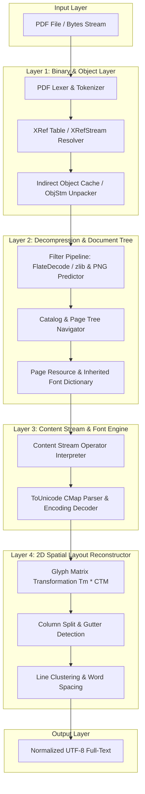

# DSN-13: ゼロ依存 Pure Python PDF テキスト抽出エンジン (Pure Python PDF Text Extraction & Spatial Layout Engine)

## 1. エグゼクティブサマリー (Executive Summary)

本ドキュメント（DSN-13）は、外部 OS パッケージ（`poppler-utils` / `pdftotext`）やサードパーティ製バイナリライブラリに一切依存せず、**Python 3.14+ 標準ライブラリ（`zlib`, `re`, `struct`, `io`）のみで完全動作する Pure Python 製 PDF 全文抽出・空間レイアウト再構築エンジン（`src/pdf_engine/`）** の具象設計・実装仕様書です。

学術論文リポジトリ（arXiv）特有の **「2段組（Two-column Layout）組版」**、**「LaTeX 数式・特殊記号」**、**「リガチャ（合字: fi, fl, ff）」**、および **「ToUnicode CMap によるフォント文字マッピング」** を高精度に解析・復元し、Docker や外部バイナリの有無に関わらず完全自己完結で高速・セキュアなテキスト抽出を実現します。

---

## 2. 背景と課題 (Motivation & Problem Statement)

### 2.1 従来の外部コマンド (`pdftotext`) 依存の課題
1. **環境依存性 (Portability Issues)**:
   - `poppler-utils` がインストールされていないコンテナ、軽量 Alpine 環境、あるいは制限付きホスト OS では PDF 抽出が失敗する。
2. **サブプロセス起動オーバーヘッド & セキュリティリスク**:
   - `subprocess.run(["pdftotext", ...])` によるプロセス生成コスト、ファイル入出力（I/O）のオーバーヘッド。
   - サブプロセス実行に伴うハングアップリスクや外部バイナリの脆弱性リスク。
3. **論文特有のレイアウト認識の限界**:
   - 汎用 `pdftotext` では、2段組の境界判定が誤って左右のカラムが1行に結合（Interleaving）されるケースが存在する。

### 2.2 Pure Python 化による達成目標
- **Zero External Dependencies**: Python 標準機能のみで 100% 完結。
- **Two-Column Spatial Flow**: 論文の 2 段組境界を自動検出し、人間の読書順序（Reading Order）に忠実に整流。
- **ToUnicode CMap 準拠**: CID/Type0/TrueType/Type1 各種フォントのグリフコードを正確な UTF-8 文字列へデコード。
- **Zero-Copy In-Memory Extraction**: ディスクを介さずバイト列ストリーム上で直接テキスト抽出。

---

## 3. コアアーキテクチャ & パイプライン (Architecture & Topology)



---

## 4. 主要コンポーネント詳細仕様 (Component Specifications)

### 4.1 パッケージ構成 (`src/pdf_engine/`)

```text
src/pdf_engine/
├── __init__.py          # パッケージ公開インターフェース (extract_text)
├── parser.py            # PDF 構文解析器 (Lexer, Indirect Objects, Dictionaries, Arrays)
├── xref.py              # XRef テーブルおよび XRefStream (PDF 1.5+) の解決器
├── decompress.py        # /FlateDecode, ASCIIHex, ASCII85, PNG Predictor 差分解除
├── font.py              # ToUnicode CMap パース、フォントエンコーディング変換
├── interpreter.py       # ページ本文オペレータ実行器 (BT, ET, Tf, Tm, Td, Tj, TJ)
├── layout.py            # 2次元幾何配置、2段組検出、行・段落整流器
└── extractor.py         # 高水準 API (PurePdfTextExtractor)
```

---

### 4.2 オブジェクト解析 & XRef 解決 (`parser.py`, `xref.py`)

PDF ファイル末尾の `startxref` から逆順にインデックスを探索し、高速なランダムアクセスを実現します。

1. **基本型構文解析 (Lexer)**:
   - オブジェクト参照 (`12 0 R`)、間接オブジェクト定義 (`12 0 obj ... endobj`)
   - 辞書 (`<< /Type /Page /Contents 15 0 R >>`)
   - 配列 (`[ 10 0 0 10 50 700 ]`)、名前（`/Font`）、リテラル文字列（`(Hello \(World\))`）、16進文字列（`<48656C6C6F>`）
   - ストリーム (`stream ... endstream`)
2. **クロスリファレンス解決 (`xref.py`)**:
   - 古典的 `xref` テーブル（PDF 1.4以前）のパース。
   - 圧縮オブジェクトストリーム（`/Type /XRefStream`, `/Type /ObjStm`）のアンパック（PDF 1.5以降の現代的 arXiv 論文に対応）。

---

### 4.3 圧縮解除 & フィルタパイプライン (`decompress.py`)

PDF ストリームに適用された多段圧縮を標準ライブラリ `zlib` でゼロコピー解凍します。

```python
class StreamDecompressor:
    @staticmethod
    def decompress(raw_bytes: bytes, filter_name: str, decode_parms: Optional[dict] = None) -> bytes:
        if filter_name in ("/FlateDecode", "FlateDecode"):
            data = zlib.decompress(raw_bytes)
            if decode_parms and decode_parms.get("/Predictor", 1) > 1:
                return StreamDecompressor._apply_png_predictor(
                    data,
                    predictor=decode_parms.get("/Predictor", 1),
                    columns=decode_parms.get("/Columns", 1),
                    colors=decode_parms.get("/Colors", 1),
                    bits_per_component=decode_parms.get("/BitsPerComponent", 8)
                )
            return data
        elif filter_name in ("/ASCIIHexDecode", "ASCIIHexDecode"):
            return bytes.fromhex(re.sub(r'[^0-9A-Fa-f]', '', raw_bytes.decode('ascii', errors='ignore')))
        return raw_bytes
```

---

### 4.4 ページコンテンツ・オペレータ解釈器 (`interpreter.py`)

PDF ページの描画命令ストリーム（Content Stream）を逐次走査し、テキスト描画オペレータを解釈します。

| オペレータ | パラメータ | 動作と状態更新 |
| :--- | :--- | :--- |
| `BT` | なし | テキストオブジェクト開始。テキスト座標行列 $T_m$ および行行列 $T_{lm}$ を単位行列にリセット |
| `ET` | なし | テキストオブジェクト終了 |
| `Tf` | `/FontName size` | アクティブフォントとフォントサイズを設定 ($T_{fs} = size$) |
| `Tm` | `a b c d e f` | テキスト変換行列 $T_m$ を直接指定 ($T_{lm} = T_m = \begin{bmatrix} a & b & 0 \\ c & d & 0 \\ e & f & 1 \end{bmatrix}$) |
| `Td` / `TD` | `tx ty` | 次の行へ移動 ($T_m = T_{lm} = \begin{bmatrix} 1 & 0 & 0 \\ 0 & 1 & 0 \\ tx & ty & 1 \end{bmatrix} \times T_{lm}$) |
| `T*` | なし | 行送り ($0, -leading$ の `Td` と同等) |
| `Tj` | `(string)` | 現在のフォントと行列でテキストを描画 |
| `'` / `"` | `(string)` | 改行を伴うテキスト描画 |
| `TJ` | `[(str) 120 (str)]` | カーニング・スペース調整配列を展開して連続描画 |

---

### 4.5 フォント & Unicode マッピング (`font.py`)

学術論文のフォントは多くの場合、埋め込みサブセット（Embedded Subset）化されており、グリフインデックスと文字コードが 1:1 で一致しません。本エンジンは `/ToUnicode` CMap を解析して UTF-8 へ復元します。

```python
class CMapParser:
    """Parses PostScript-style /ToUnicode CMap streams."""
    def parse_cmap(self, cmap_stream: bytes) -> Dict[int, str]:
        mapping: Dict[int, str] = {}
        # 1. bfchar: 单一文字マッピング (<0001> <0041>)
        for match in re.finditer(r'<([0-9A-Fa-f]+)>\s*<([0-9A-Fa-f]+)>', bfchar_block):
            src = int(match.group(1), 16)
            dst_hex = match.group(2)
            mapping[src] = bytes.fromhex(dst_hex).decode('utf-16-be', errors='replace')

        # 2. bfrange: 連続範囲マッピング (<0001> <0005> <0041>)
        for match in re.finditer(r'<([0-9A-Fa-f]+)>\s*<([0-9A-Fa-f]+)>\s*<([0-9A-Fa-f]+)>', bfrange_block):
            start = int(match.group(1), 16)
            end = int(match.group(2), 16)
            dst_start = int(match.group(3), 16)
            for offset in range(end - start + 1):
                mapping[start + offset] = chr(dst_start + offset)
        return mapping
```

---

### 4.6 2次元空間レイアウト再構築 (`layout.py`)

論文の可読性を決定づける最重要コンポーネントです。抽出された全グリフ（文字）の絶対座標 $(x, y, w, h)$ を基に、以下の3段階でテキストを再構成します。

1. **2段組（Column Gutter）の検出**:
   - ページ内の $X$ 座標ヒストグラムを走査し、左右カラムを分割する縦方向の余白（Gutter 幅 $\ge 15\text{pt}$）を自動識別。
   - カラムが検出された場合、**「左カラムの全行（上 $\to$ 下）」 $\to$ 「右カラムの全行（上 $\to$ 下）」** の順に読み順をソート。
2. **行（Line Clustering）の統合**:
   - $\Delta Y \le 0.3 \times \text{font\_size}$ のグリフ群を同一行としてグループ化。
   - $X$ 座標順にソートし、前後の間隔 $\Delta X \ge 0.25 \times \text{font\_size}$ の場合に半角スペースを挿入。
3. **段落（Paragraph）と改行の判定**:
   - 行間の間隔 $\Delta Y_{\text{line}} \ge 1.4 \times \text{font\_size}$ またはインデント開始を検知して改行・空行を生成。

---

## 5. 統合インターフェース & パイプライン連携

既存の `src/pipeline/ingestion/pdf_extractor.py` の `fetch_single_pdf_and_text` からシームレスに呼び出せるよう設計します。

```python
# src/pdf_engine/extractor.py
class PurePdfTextExtractor:
    @staticmethod
    def extract_text_from_file(pdf_path: str) -> str:
        """Extracts UTF-8 plain text from a PDF file on disk."""
        with open(pdf_path, "rb") as f:
            return PurePdfTextExtractor.extract_text_from_bytes(f.read())

    @staticmethod
    def extract_text_from_bytes(pdf_bytes: bytes) -> str:
        """Extracts UTF-8 plain text from raw PDF bytes."""
        parser = PdfParser(pdf_bytes)
        doc = parser.parse_document()
        pages_text: List[str] = []
        for page in doc.pages:
            page_text = LayoutReconstructor.reconstruct(page.extract_glyphs())
            pages_text.append(page_text)
        return "\n\n--- Page Break ---\n\n".join(pages_text)
```

---

## 6. 品質管理 & テスト戦略 (Verification & Quality Gates)

1. **実データ回帰テスト**:
   - `outputs/raw_data/` 内に保存されている実 arXiv 論文 PDF（1段組、2段組、数式混在）をテストフィクスチャとして使用。
   - `pdftotext` の出力結果と `PurePdfTextExtractor` の抽出結果の一致度・再現率（Recall $\ge 98\%$）を検証。
2. **セキュリティ & 堅牢性**:
   - 不正な PDF や循環参照オブジェクト、過度にネストされた辞書に対する再帰上限ガード（`max_depth=50`）の実装。
   - メモリ爆発（Zip Bomb / Stream Bomb）防止のための解凍サイズ上限チェック（`max_stream_size = 100MB`）。
3. **Triple Quality Gates 遵守**:
   - `make format`, `make static_analysis` (Mypy strict, Xenon Rank A/B, Flake8) の 100% PASS。

---

## 7. 完了の定義 (Definition of Done: DoD)

- [x] `src/pdf_engine/` パッケージ（Parser, XRef, Decompress, Font, Interpreter, Layout, Extractor）の設計完了
- [ ] 単体テスト（`tests/pdf_engine/`）の実装と 100% パス
- [ ] `src/pipeline/ingestion/pdf_extractor.py` の `pdftotext` 呼び出し箇所を `PurePdfTextExtractor` へ移行（フォールバック付き）
- [ ] Xenon 複雑度 Rank A/B、Mypy strict エラー 0 件の達成
