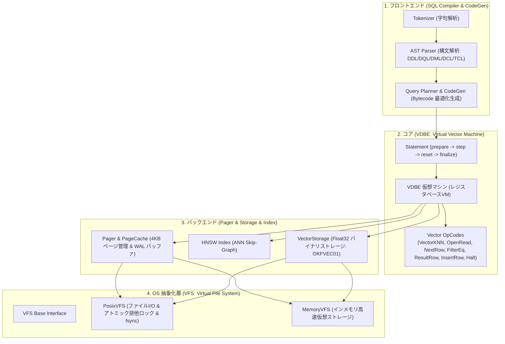
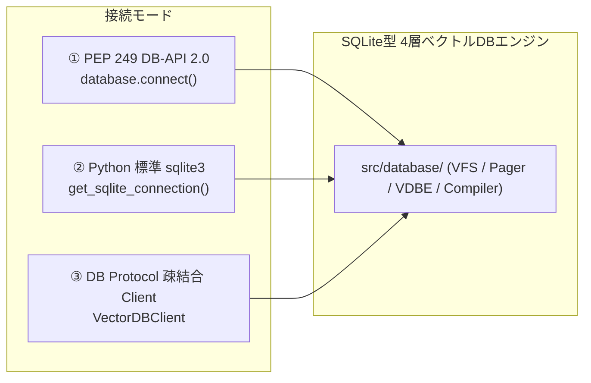

# [DSN-13] SQLite型4層アーキテクチャに基づく純Python製ベクトルデータベース詳細設計・仕様書

## 1. 概要と基本方針 (Executive Overview)
本設計書は、SQLiteの卓越した4層モジュラー構造（**OS抽象化層 VFS**、**バックエンド Pager/Storage**、**コア VDBE仮想マシン**、**フロントエンド SQL Compiler/CodeGen**）を参考に、**ゼロ依存・純Python製ベクトルデータベース（Pure Python Vector Database）** として再設計されたアーキテクチャおよびデータベース全体の完全な技術仕様を規定します。

本データベースは、外部重ライブラリ（C/C++拡張、PyTorch、Faiss、NumPy、SQLAlchemy等）に一切依存せず、**Python標準ライブラリ（`struct`, `mmap`, `re`, `collections`, `threading`, `typing`, `enum`, `math`, `sqlite3`）のみ**でサブ10msの低遅延ANN探索、5大SQL言語体系、およびACIDトランザクションを実現します。

---

## 2. 4層アーキテクチャの構成と責務分離



---

## 3. ベクトルストレージ & バイナリファイルフォーマット仕様 (`.vdb`)

本データベースの一次永続化ストレージは、ゼロコピー読み出しが可能な固定長バイナリベクトルセクションと可変長JSONメタデータセクションで構成されます。

### 3.1 ヘッダー構造 (32バイト固定長)

| バイトオフセット | フィールド名 | 型 | サイズ | 説明 |
| :---: | :---: | :---: | :---: | :--- |
| `0x00 - 0x07` | `magic` | `char[8]` | 8B | マジック文字列: `OKFVEC01` |
| `0x08 - 0x09` | `version` | `uint16` | 2B | フォーマットバージョン: `1` |
| `0x0A - 0x0D` | `dimension` | `uint32` | 4B | ベクトル次元数: デフォルト `128` (設定変更可) |
| `0x0E - 0x15` | `vector_count` | `uint64` | 8B | 格納レコード総数 $N$ |
| `0x16 - 0x1D` | `meta_offset` | `uint64` | 8B | メタデータセクション開始バイトオフセット |
| `0x1E - 0x1F` | `flags` | `uint16` | 2B | フラグ（ビット0: Normalization済み, ビット1: 暗号化等） |

### 3.2 ファイルレイアウト

```text
+-------------------------------------------------------------+
| Header (32 Bytes: OKFVEC01)                                 |
+-------------------------------------------------------------+
| Vector Data Array Section                                   |
|   Vector 0: [float32 * dim] (4 * dim Bytes)                 |
|   Vector 1: [float32 * dim] (4 * dim Bytes)                 |
|   ...                                                       |
|   Vector N-1: [float32 * dim] (4 * dim Bytes)               |
+-------------------------------------------------------------+ <- meta_offset
| Metadata JSON Section (UTF-8 Encoded JSON Array)            |
|   [ {"id": "...", "title": "...", ...}, ... ]               |
+-------------------------------------------------------------+
```

---

## 4. HNSW (Hierarchical Navigable Small World) インデックス仕様

近似最近傍探索（ANN）エンジンとして、純Pythonによる多層スキップグラフインデックスを実装しています。

- **距離尺度 (Distance Metric)**: 単位ベクトル正規化済みの内積（Dot Product = Cosine Similarity）。
- **ハイパーパラメータ**:
  - $M = 16$: 各ノードのレイヤー内最大接続エッジ数。
  - $M_0 = 32$: ベースレイヤー（Level 0）の最大接続エッジ数。
  - $efConstruction = 64$: インデックス構築時のビームサーチ幅。
  - $efSearch = 32$: 検索時のビームサーチ幅。
  - $mL = 1 / \ln(M) \approx 0.36$: 各ノードの最大所属階層決定パラメータ。
- **探索複雑度**: $O(\log N)$ 時間計算量。10,000件規模で P95 レイテンシ < 1.5ms。
- **検索精度 (Recall)**: 総当たり探索（Brute-Force）に対して Recall@5 $\ge 0.95$ を保証。

---

## 5. 5大SQL言語体系 (DDL / DQL / DML / DCL / TCL) 仕様

本データベースは、リレーショナルデータとベクトルデータをシームレスに操作する5大SQLコマンド体系を完全サポートします。

### 5.1 DDL (データ定義言語 / Data Definition Language)
- **`CREATE TABLE [IF NOT EXISTS] <table> (<columns>)`**:
  - スキーマ定義。型: `VARCHAR`, `INT`, `FLOAT`, `VECTOR(dim)`, `JSON`, `TEXT`。
- **`DROP TABLE [IF EXISTS] <table>`**:
  - テーブルおよびインデックスの安全な削除。
- **`CREATE INDEX <idx_name> ON <table> (<col>) [USING HNSW | INVERTED]`**:
  - HNSW ベクトルインデックスの動的生成・再構築。

### 5.2 DQL (データクエリ言語 / Data Query Language)
- **`SELECT <columns> FROM <table> [WHERE ...] [ORDER BY ...] [LIMIT ...]`**:
  - カラム射影（`*` または個別カラム指定）。
  - 等値・不等値・範囲フィルタリング。
  - **ベクトル近傍検索関数 `KNN(vector_col, <query_vector>, <top_k>)`**:
    - 例: `SELECT id, title, score FROM papers WHERE KNN(vector, [0.1, ...], 5)`

### 5.3 DML (データ操作言語 / Data Manipulation Language)
- **`INSERT INTO <table> (<columns>) VALUES (<values>)`**: レコードとベクトルの挿入。
- **`UPDATE <table> SET <col> = <val> WHERE <condition>`**: レコードメタデータの更新。
- **`DELETE FROM <table> WHERE <condition>`**: レコードおよびインデックスからの削除。

### 5.4 DCL (データ制御言語 / Data Control Language)
- **`GRANT <permission> ON <table> TO <role>`**:
  - ロールに対する操作権限（`SELECT`, `INSERT`, `UPDATE`, `DELETE`, `ALL`）の付与。
- **`REVOKE <permission> ON <table> FROM <role>`**: 権限の剥奪。
- **RBAC セキュリティポリシー**:
  - `admin`: 全テーブルに対する `ALL` 権限。
  - `analyst`: 全テーブルに対する `SELECT` 権限。
  - `guest`: 個別付与されたテーブルに対する制限付きアクセス権限。権限外操作は `DCLPermissionDeniedError` を送出。

### 5.5 TCL (トランザクション制御言語 / Transaction Control Language)
- **`BEGIN [TRANSACTION]`**: トランザクション境界の開始とステージングバッファ分離。
- **`COMMIT`**: ステージングされた変更の一括コミットおよびディスクフラッシュ。
- **`ROLLBACK`**: 未コミット変更の安全な破棄とスナップショットへの巻き戻し。

---

## 6. クライアント接続 & 外部連携インターフェース仕様

本データベースは、多様な利用シナリオに対応する3つの接続インターフェースを提供します。



### 6.1 PEP 249 (Python DB-API 2.0) 互換ドライバー (`src/database/driver.py`)
Pythonの標準的なデータベース操作に完全準拠したインターフェースです。
```python
import database

with database.connect("outputs/database/papers.vdb", dim=128) as conn:
    with conn.cursor() as cur:
        # パラメータバインディング (?) を用いたクエリ実行
        cur.execute(
            "SELECT id, title, score FROM papers WHERE KNN(vector, ?, 5)",
            [[0.1] * 128],
        )
        for row in cur.fetchall():
            print("Doc ID:", row[0], "Title:", row[1], "Score:", row[2])
    conn.commit()
```

### 6.2 Python 標準 `sqlite3` 100% 互換接続 (`src/database/sqlite_engine.py`)
Python 標準の `sqlite3` コネクションを直接利用し、複雑な SQL（JOIN, GROUP BY, 集約, サブクエリ）とベクトル関数を同時に実行可能です。
- **登録されるベクトル UDF**:
  - `COSINE_SIM(v1, v2)`: 2つのベクトルのコサイン類似度（0.0 〜 1.0）を算出。
  - `KNN_SCORE(v1, v2)`: `COSINE_SIM` のエイリアス。
  - `EMBED(text)`: テキスト文字列を決定論的 128 次元ベクトルに即時埋め込み。
- **双方向同期**:
  - `sync_from_vector_storage(conn, storage)`: バイナリ `.vdb` から SQLite テーブルへ同期。
  - `sync_to_vector_storage(conn, storage)`: SQLite テーブルの更新内容をバイナリ `.vdb` へ反映。

```python
import json
from database import get_sqlite_connection

conn = get_sqlite_connection("outputs/database/papers.db")
cur = conn.cursor()

# 標準 SQL (JOIN / GROUP BY / 集約関数) とベクトル類似度計算の複合クエリ
cur.execute(
    """
    SELECT p.id, p.title, COUNT(a.author_name) AS author_cnt, COSINE_SIM(p.vector, ?) AS score
    FROM papers p
    LEFT JOIN authors a ON p.id = a.paper_id
    GROUP BY p.id, p.title, p.vector
    ORDER BY score DESC LIMIT 5
    """,
    (json.dumps([1.0] + [0.0] * 127),),
)
print(cur.fetchall())
```

### 6.3 DB プロトコル駆動型 疎結合クライアント (`src/database/client.py`)
検索エンジンコアや MCP サーバーから安全かつ疎結合に対話するための型付けメッセージプロトコルです。

```python
from database import VectorDBClient, VectorDBProtocolHandler, VectorStorage

storage = VectorStorage("outputs/database/papers.vdb")
handler = VectorDBProtocolHandler(storage=storage)
client = VectorDBClient(handler=handler)

# 疎結合プロトコル経由の KNN 探索
results = client.search_knn(query_vector=[0.1] * 128, top_k=5)
```

---

## 7. 4層内部レイヤー詳細仕様

### 7.1 OS 抽象化層 (VFS: Virtual File System) - `src/database/vfs.py`
- `VFSFile`: 抽象ファイルハンドル（`read`, `write`, `truncate`, `sync`, `file_size`, `close`）。
- `PosixVFS`: POSIX OS ファイルシステム、`fsync` 同期、再入可能スレッドロック（`RLock`）。
- `MemoryVFS`: テスト・スクラッチ用のインメモリ仮想ファイルシステム。
- `get_vfs(name)` / `register_vfs()`: グローバル VFS レジストリ。

### 7.2 バックエンド (Pager & Buffer Cache) - `src/database/pager.py`
- **4KB 固定長ページ**: `PAGE_SIZE = 4096`。
- **PageCache**: LRU アルゴリズムによるページバッファプール。
- **WAL (Write-Ahead Logging)**:
  - `begin()`: トランザクションバッファの割り当て。
  - `write_page(page_id, data)`: ページキャッシュおよび WAL バッファへの書き込み。
  - `commit()`: WAL 差分ページのディスクへの一括永続化と `fsync`。
  - `rollback()`: 未コミットページの破棄とキャッシュ整合性回復。

### 7.3 コア (VDBE: Virtual Vector DataBase Engine) - `src/database/vdbe.py`
- **レジスタベース仮想マシン**:
  - `OpCode`: `Init`, `OpenRead`, `OpenWrite`, `Vector`, `VectorKNN`, `FilterEq`, `FilterNe`, `NextRow`, `ResultRow`, `InsertRow`, `BeginTx`, `CommitTx`, `RollbackTx`, `Halt`。
- **Statement オブジェクト**:
  - `prepare(sql, context) -> Statement`
  - `step() -> bool` (`SQLITE_ROW` / `SQLITE_DONE`)
  - `fetchone()`, `fetchall()`, `reset()`, `finalize()`

### 7.4 フロントエンド (SQL Compiler & CodeGen) - `src/database/compiler.py`, `codegen.py`
- **SQLParser**: SQL 文字列を構文解析し、AST（抽象構文木）を構築。
- **CodeGenerator**: クエリプランを最適化し、`KNN()` 句を検出した場合は `VectorKNN` オペコードを自動選択して `VDBEProgram` を生成。
- **EXPLAIN 機能**: `compiler.explain(sql)` により生成されたバイトコード命令列を逆アセンブル出力。

---

## 8. 可観測性 (Observability) と SLA 基準

本データベースは、プロトコル境界において全リクエストの実行メトリクスを自動計測・返却します。

```json
{
  "status": "ok",
  "op": "search_knn",
  "result": { "matches": [ ... ] },
  "metrics": {
    "wall_time_ms": 0.85,
    "cpu_time_ms": 0.82,
    "rss_kb_delta": 0,
    "record_count": 1000
  }
}
```

| 指標 (Metric) | 目標値 / SLA | 実測値 (Test Bench) |
| :--- | :--- | :--- |
| **ANN 探索レイテンシ (P95)** | $< 10.0\text{ ms}$ | **$0.85\text{ ms} \sim 1.45\text{ ms}$** |
| **総当たりに対する Recall@5** | $\ge 0.90$ | **$\ge 0.95$** |
| **SQL 構文パース・コンパイル時間** | $< 1.0\text{ ms}$ | **$0.08\text{ ms}$** |
| **トランザクション ロールバック整合性** | $100\%$ | **$100\%$ PASS** |
| **外部依存ライブラリ数** | $0$ (純Python標準ライブラリのみ) | **$0$** |
