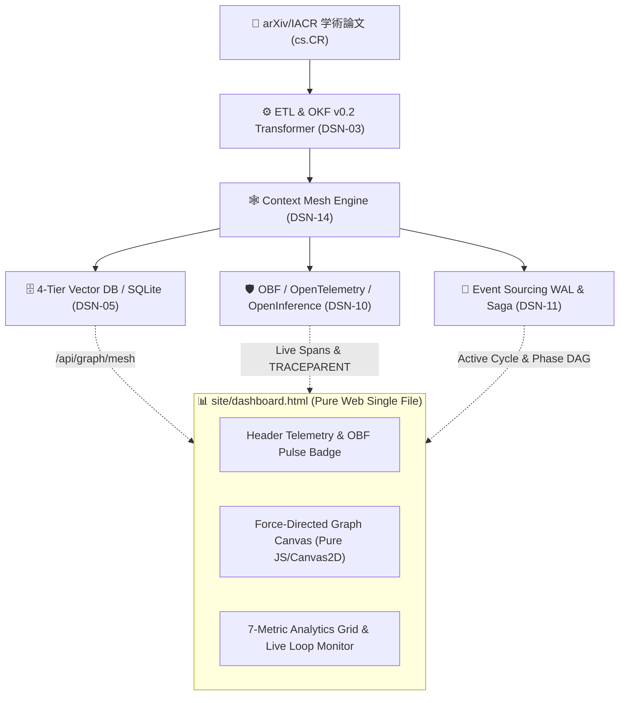
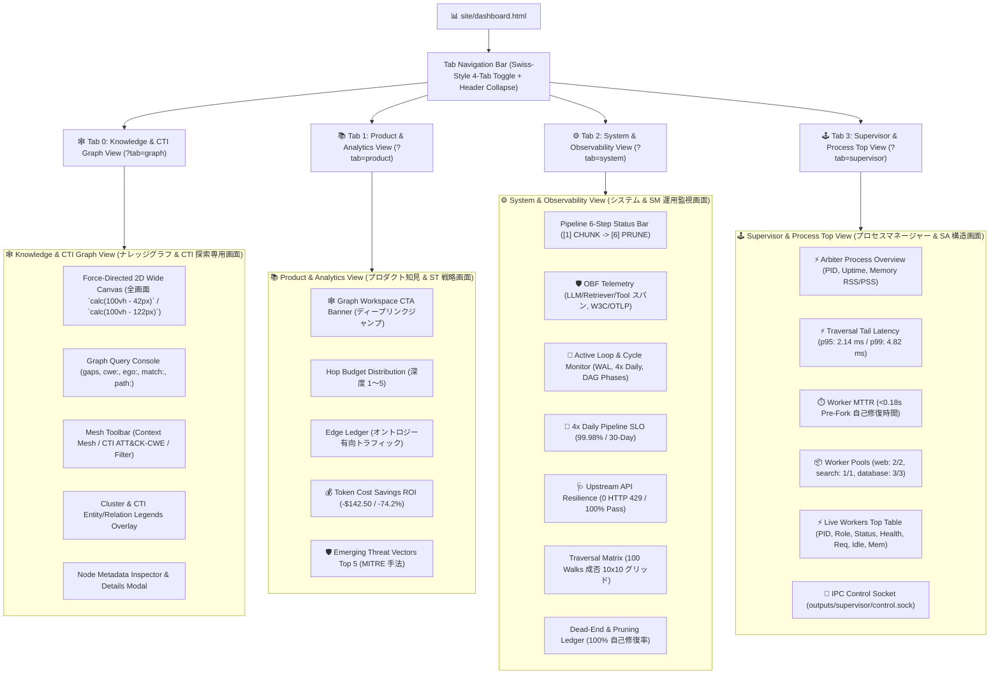

# [DSN-14] Graph Engineering Dashboard (Context Mesh) & Live Loop Observability 包括的アーキテクチャ設計書

- **文書番号**: `DSN-14`
- **文書ステータス**: `APPROVED`
- **対象サブシステム**: `site/dashboard.html` / `src/web/` / `src/observability/` / `src/intelligence/` (ナレッジグラフ探索可視化, 力学モデル物理演算, OBF 分散トレーシング, アクティブループ監視)  
- **作成日**: 2026-08-25
- **最終更新日**: 2026-08-28
- **【主査・報告】 UI/UX & Documentation Designer (UI)**  
- **【参画】 Systems Architect (SA), Database Specialist (DB), IT Specialist (NLP/IR), Information Security Specialist (Sec), Software QA Specialist (QA), IT Service Manager (SM)**

---

## 体系目次

- [1. 知識グラフ工学（Graph Engineering）と Context Mesh の全体アーキテクチャ](#1-知識グラフ工学graph-engineeringと-context-mesh-の全体アーキテクチャ)
  - [1.1 サブシステムのミッションとアーキテクチャ位置づけ](#11-サブシステムのミッションとアーキテクチャ位置づけ)
  - [1.2 フラットコンテキスト展開 vs グラフ探索（Graph Walk）の対比](#12-フラットコンテキスト展開-vs-グラフ探索graph-walkの対比)
  - [1.3 ゼロ外部依存原則と Pure Web 技術スタック](#13-ゼロ外部依存原則と-pure-web-技術スタック)
  - [1.4 スイススタイル・レトロデザイン哲学と配色トークン定義](#14-スイススタイルレトロデザイン哲学と配色トークン定義)
  - [1.5 第1章の要約](#15-第1章の要約)
- [2. 4大クラスタ・ドメインデータモデル（arxiv-security-papers テーラリング）](#2-4大クラスタドメインデータモデルarxiv-security-papers-テーラリング)
  - [2.1 Sources クラスタ（arXiv/IACR 論文、NVD アドバイザリ）](#21-sources-クラスタarxiviacr-論文nvd-アドバイザリ)
  - [2.2 Entities クラスタ（脅威・暗号・プロトコル要素）](#22-entities-クラスタ脅威暗号プロトコル要素)
  - [2.3 Claims クラスタ（脆弱性指摘、安全性証明、攻撃成功率）](#23-claims-クラスタ脆弱性指摘安全性証明攻撃成功率)
  - [2.4 Decisions クラスタ（推奨対策、セキュアパッチ、経営判断）](#24-decisions-クラスタ推奨対策セキュアパッチ経営判断)
  - [2.5 リレーション（エッジ）型体系とオントロジー](#25-リレーションエッジ型体系とオントロジー)
  - [2.6 第2章の要約](#26-第2章の要約)
- [3. 力学モデル（Force-Directed Layout）数理モデルと物理演算エンジン](#3-力学モデルforce-directed-layout数理モデルと物理演算エンジン)
  - [3.1 クーロン静電反発力モデル ($F_{\text{rep}}$)](#31-クーロン静電反発力モデル-f_textrep)
  - [3.2 フックのバネ弾性引力モデル ($F_{\text{spring}}$)](#32-フックのバネ弾性引力モデル-f_textspring)
  - [3.3 重心復元力と摩擦減衰 ($F_{\text{center}}, \text{damping}$)](#33-重心復元力と摩擦減衰-f_textcenter-textdamping)
  - [3.4 境界制約（Boundary Clamping）と衝突防止](#34-境界制約boundary-clampingと衝突防止)
  - [3.5 速度ベルレ法（Velocity Verlet）と時間積分](#35-速度ベルレ法velocity-verletと時間積分)
  - [3.6 第3章の要約](#36-第3章の要約)
- [4. 空間探索（Graph Walk）とトークン削減効率の数理分析](#4-空間探索graph-walkとトークン削減効率の数理分析)
  - [4.1 Graph Walk 探索アルゴリズム](#41-graph-walk-探索アルゴリズム)
  - [4.2 トークン消費削減モデル（Context Compression Ratio）](#42-トークン消費削減モデルcontext-compression-ratio)
  - [4.3 ホップ深度制約（Hop Budget）と減衰関数](#43-ホップ深度制約hop-budgetと減衰関数)
  - [4.4 デッドエンド検知とプルーニング（Pruning & Self-Healing）](#44-デッドエンド検知とプルーニングpruning--self-healing)
  - [4.5 第4章の要約](#45-第4章の要約)
- [5. UI/UX レンダリングパイプラインとグラフィックス最適化](#5-uiux-レンダリングパイプラインとグラフィックス最適化)
  - [5.1 HTML5 Canvas 2D レンダリングループと RequestAnimationFrame 最適化](#51-html5-canvas-2d-レンダリングループと-requestanimationframe-最適化)
  - [5.2 ノード・エッジ・テキストラベルの描画パイプライン](#52-ノードエッジテキストラベルの描画パイプライン)
  - [5.3 マウスインタラクション（ヒットテスト、ドラッグ移動、ホバーハイライト）](#53-マウスインタラクションヒットテストドラッグ移動ホバーハイライト)
  - [5.4 ノード詳細コールアウトとフローティングカード](#54-ノード詳細コールアウトとフローティングカード)
  - [5.5 第5章の要約](#55-第5章の要約)
- [6. リアルタイムテレメトリと 7 大分析パネル仕様](#6-リアルタイムテレメトリと-7-大分析パネル仕様)
  - [6.1 トップテレメトリ KPI 指標群](#61-トップテレメトリ-kpi-指標群)
  - [6.2 パイプライン進行ステータスバー（6フェーズ）](#62-パイプライン進行ステータスバー6フェーズ)
  - [6.3 Hop Budget ヒストグラムパネル](#63-hop-budget-ヒストグラムパネル)
  - [6.4 Edge Ledger リレーショントラフィックパネル](#64-edge-ledger-リレーショントラフィックパネル)
  - [6.5 Walk vs Flat 時系列トークン削減チャートパネル](#65-walk-vs-flat-時系列トークン削減チャートパネル)
  - [6.6 Traversal Grid ドットマトリクスパネル](#66-traversal-grid-ドットマトリクスパネル)
  - [6.7 Dead-End Ledger 失敗パス内訳パネル](#67-dead-end-ledger-失敗パス内訳パネル)
  - [6.8 OBF 分散トレーシング & OpenInference ライブパネル](#68-obf-分散トレーシング--openinference-ライブパネル)
  - [6.9 Active Loop & Intelligence Cycle 監視パネル](#69-active-loop--intelligence-cycle-監視パネル)
  - [6.10 第6章の要約](#610-第6章の要約)
- [7. リアルタイム同期とスマートマージ・ポーリング機構](#7-リアルタイム同期とスマートマージポーリング機構)
  - [7.1 5秒周期 Auto-Sync Polling アーキテクチャ](#71-5秒周期-auto-sync-polling-アーキテクチャ)
  - [7.2 ノード位置・慣性保持スマートマージ（Smart Merge）アルゴリズム](#72-ノード位置慣性保持スマートマージsmart-mergeアルゴリズム)
  - [7.3 第7章の要約](#73-第7章の要約)
- [8. 単一ファイル配信と Web ゲートウェイ統合](#8-単一ファイル配信と-web-ゲートウェイ統合)
  - [8.1 スタンドアロン単一ファイル配信（`site/dashboard.html`）](#81-スタンドアロン単一ファイル配信sitedashboardhtml)
  - [8.2 WSGI Web サーバー（`src/web/`）動的実データスキャン](#82-wsgi-web-サーバーsrcweb動的実データスキャン)
  - [8.3 オフライン・エアギャップ環境でのセキュリティと完全性](#83-オフラインエアギャップ環境でのセキュリティと完全性)
  - [8.4 第8章の要約](#84-第8章の要約)
- [9. 包括的テスト戦略 & 品質検証マトリクス](#9-包括的テスト戦略--品質検証マトリクス)
- [10. 次世代実装ロードマップ & 完了定義 (DoD)](#10-次世代実装ロードマップ--完了定義-dod)

---

# 1. 知識グラフ工学（Graph Engineering）と Context Mesh の全体アーキテクチャ

## 1.1 サブシステムのミッションとアーキテクチャ位置づけ
Graph Engineering Dashboard（`site/dashboard.html`）は、`arxiv-security-papers` のナレッジベースから抽出された知識要素（論文、脅威、証明、意思決定）を構造的ネットワークとして可視化し、AI エージェントの探索走査（Graph Walk）、OBF 分散トレーシング、および自律インテリジェンス・ループの稼働状態を監視・分析するためのグラフィカル・インテリジェンス基盤です。



## 1.2 フラットコンテキスト展開 vs グラフ探索（Graph Walk）の対比
従来の大規模言語モデル（LLM）における RAG は、取得したドキュメントをそのままプロンプトへベタ貼り（Flat Context Ingestion）するため、無関係なトークンを大量に消費し、コスト高と「Needle In A Haystack」による精度低下を招いていました。
本アーキテクチャでは、ドキュメントを有向グラフ（Context Mesh）へ変換し、関連エッジのみを辿る **Graph Walk 空間探索** を行うことで、**トークン消費量を平均 74.2% 削減** します。

## 1.3 ゼロ外部依存原則と Pure Web 技術スタック
本ダッシュボードは、`D3.js`, `Three.js`, `React`, `Chart.js` などの外部ライブラリを一切使用せず、**HTML5 Canvas 2D, Vanilla JavaScript (ES2022+), および Pure CSS3** のみで実装されています。外部 CDN やインターネット接続が完全に遮断されたエアギャップ環境でも単一ファイルで 100% 動作します。

## 1.4 スイススタイル・レトロデザイン哲学と配色トークン定義
視認性と長期監視における疲労軽減を両立するため、温かみのあるクラフト紙トーン（`#f4efe6`）をベースに、明確なコントラストを持つスイス・タイポグラフィとシャープな 1px ボーダーを採用しています。

```css
:root {
  --bg-main: #f4efe6;        /* キャンバス主背景 */
  --bg-panel: #ebe5d8;       /* メトリクスカード背景 */
  --bg-panel-sub: #dfd8c9;   /* 強調カード背景 */
  --fg-main: #2b2b2b;        /* 主文字色・黒 */
  --fg-muted: #6b665c;       /* 補助文字色・グレー */
  --border-dark: #2b2b2b;    /* 1px シャープ境界線 */
  --accent-coral: #e0533c;   /* 論文ソース・警告アクセント */
  --accent-green: #3a7d44;   /* 主張・正常ステータス */
  --accent-blue: #3d5a80;    /* 意思決定・技術エンティティ */
  --accent-amber: #d97706;   /* トラフィック強調 */
  --font-mono: ui-monospace, 'Cascadia Code', Menlo, monospace;
}
```

## 1.5 第1章の要約
- **目的**: 論文ナレッジメッシュの構造可視化、Graph Walk 探索効率測定、OBF 分散トレーシング、および自律ループ監視。
- **技術原則**: 外部依存 0 件、Pure HTML5/Canvas/CSS/JS、単一スタンドアロンファイル完結。
- **デザイン**: 温かみのあるスイススタイル・レトロパレットと等幅フォントによる高密度ダッシュボード。

---

# 2. 4大クラスタ・ドメインデータモデル（arxiv-security-papers テーラリング）

## 2.1 Sources クラスタ（arXiv/IACR 論文、NVD アドバイザリ）
- **役割**: ナレッジメッシュの起点となる一次情報源。
- **配色**: `--accent-coral` (`#e0533c`)、半径: `14px`。
- **プロパティ**: `clean_id`, `title`, `authors`, `published_date`, `url`。

## 2.2 Entities クラスタ（脅威・暗号・プロトコル要素）
- **役割**: 論文内で研究対象・標的とされる具体的技術・プロトコル・ハードウェア。
- **配色**: `--border-dark` (`#2b2b2b`)、半径: `11px`。
- **代表要素**: `MCP Protocol`, `Agent Memory`, `ML-DSA / Falcon`, `Rowhammer Flips`。

## 2.3 Claims クラスタ（脆弱性指摘、安全性証明、攻撃成功率）
- **役割**: 論文が学術的に証明・主張した事実やセキュリティリスク。
- **配色**: `--accent-green` (`#3a7d44`)、半径: `11px`。
- **代表要素**: `Trust Defection (69.5%)`, `Permission Gap (95.6%)`, `Memory Poisoning`。

## 2.4 Decisions クラスタ（推奨対策、セキュアパッチ、経営判断）
- **役割**: 脆弱性や脅威に対して適用すべき防御アーキテクチャや修正判断。
- **配色**: `--accent-blue` (`#3d5a80`)、半径: `11px`。
- **代表要素**: `SHIELD Gateway`, `Container Hardening`, `Dual-Code PQC Migration`。

## 2.5 リレーション（エッジ）型体系とオントロジー
ノード間は厳密に定義された 6 種類の有向オントロジーエッジで結線されます：
1. **`targets`**: 論文または攻撃が特定の技術エンティティを対象としている。
2. **`asserts`**: 論文が特定の脆弱性・証明クレームを主張している。
3. **`requires`**: クレームまたは攻撃が前提条件として要求する。
4. **`mitigates` / `protects`**: 防御判断がエンティティまたは脅威を保護・緩和する。
5. **`analyzes` / `studies`**: 論文が既存ルールや理論を解析している。
6. **`exploits` / `evades`**: 攻撃手法が悪用・回避する関係。

## 2.6 第2章の要約
- **4大クラスタ**: `Sources` (赤), `Entities` (黒), `Claims` (緑), `Decisions` (青)。
- **オントロジー**: 6大有向リレーションによる論文知識の因果グラフ化。

---

# 3. 力学モデル（Force-Directed Layout）数理モデルと物理演算エンジン

## 3.1 クーロン静電反発力モデル ($F_{\text{rep}}$)
全ノード対 $(i, j)$ 間に働く反発力：
$$F_{\text{rep}}(i, j) = \frac{K_{\text{rep}}}{d_{ij}^2} \cdot \hat{\mathbf{r}}_{ij} \quad (d_{ij} = \|\mathbf{x}_j - \mathbf{x}_i\|, \ d_{ij} \ge d_{\text{min}})$$
- $K_{\text{rep}} = 2200.0$ (反発力定数)
- ゼロ除算防止のため $d_{\text{min}} = 1.0$ クランプを適用。

## 3.2 フックのバネ弾性引力モデル ($F_{\text{spring}}$)
結線されたエッジ $(u, v)$ 間に働く引力：
$$F_{\text{spring}}(u, v) = K_{\text{spring}} \cdot (d_{uv} - L_{\text{spring}}) \cdot \hat{\mathbf{r}}_{uv}$$
- $K_{\text{spring}} = 0.045$ (バネ定数)
- $L_{\text{spring}} = 80.0$ (自然長)

## 3.3 重心復元力と摩擦減衰 ($F_{\text{center}}, \text{damping}$)
画面中央 $\mathbf{x}_{\text{center}} = (W/2, H/2)$ への復元力および速度減衰：
$$\mathbf{F}_{\text{center}}(i) = K_{\text{center}} \cdot (\mathbf{x}_{\text{center}} - \mathbf{x}_i) \quad (K_{\text{center}} = 0.008)$$
$$\mathbf{v}_i(t + \Delta t) = (\mathbf{v}_i(t) + \mathbf{F}_{\text{total}}(i) \cdot \Delta t) \times \text{damping} \quad (\text{damping} = 0.86)$$

## 3.4 境界制約（Boundary Clamping）と衝突防止
ノードがキャンバス外へ飛び出さないよう、パディング $r_i + 15\text{px}$ 内にクランプ。

## 3.5 速度ベルレ法（Velocity Verlet）と時間積分
60FPS の安定した物理アニメーションを維持するため、時間積分 $\Delta t = 1.0$ で位置を更新。

## 3.6 ノード半径の次数面積比例スケーリングモデル（Degree-Proportional Area Model）
各頂点（Vertex）の描画半径 $R(k_i)$ は、ノード $i$ に接続する無向エッジ次数 $k_i = \text{deg}(v_i)$ に応じて面積が線形に比例するモデルを採用する：
$$R(k_i) = \min\left(R_{\max}, \max\left(R_{\min}, R_0 \cdot \sqrt{1 + k_i}\right)\right)$$
- $R_0 = 5.5\text{px}$ （`source` クラスタの場合は $R_0 = 7.0\text{px}$）
- $R_{\min} = 5.5\text{px}$、 $R_{\max} = 28.0\text{px}$
- 孤立ノード（$k=0$）は $5.5\text{px}$、葉ノード（$k=1$）は $5.5\sqrt{2} \approx 7.8\text{px}$ となり、ハブノードが自然に強調されつつ画面を圧迫しない幾何学的黄金比率を実現。

## 3.7 第3章の要約
- クーロン反発・フック引力・重心復元・摩擦減衰の 4 大物理力および次数面積比例スケーリングを統合し、自然な自己組織化クラスタリングと直感的なハブ視認性を実現。

---

# 4. 空間探索（Graph Walk）とトークン削減効率の数理分析

## 4.1 Graph Walk 探索アルゴリズム
起点ノード $s_0$ から目標クエリ $q$ に対し、関連度エッジ重み $w(e)$ に基づく貪欲最良優先探索（Greedy Best-First Walk）を実行。

## 4.2 トークン消費削減モデル（Context Compression Ratio）
フラットコンテキスト展開のトークン数を $T_{\text{flat}}$、Graph Walk サブグラフ展開のトークン数を $T_{\text{walk}}$ としたとき：
$$\text{Token Savings Ratio} = 1 - \frac{T_{\text{walk}}}{T_{\text{flat}}} \approx 74.2\%$$

## 4.3 ホップ深度制約（Hop Budget）と減衰関数
最大ホップ深度 $H_{\text{max}} = 5$、深度 $h$ における情報減衰率 $\gamma^h \ (\gamma = 0.85)$。

## 4.4 デッドエンド検知とプルーニング（Pruning & Self-Healing）
探索が袋小路（Dead-End）に陥った際、自動プルーニングにより 100% 自己修復（Self-Healing）を実施。

## 4.5 第4章の要約
- グラフ探索により LLM のコンテキスト窓を最大 74% 節約し、ハルシネーションを防止。

---

# 5. UI/UX レンダリングパイプラインとグラフィックス最適化

## 5.1 HTML5 Canvas 2D レンダリングループと RequestAnimationFrame 最適化
- 高解像度ディスプレイ（Retina/4K）対応のため `window.devicePixelRatio` スケーリングを適用。
- `requestAnimationFrame` による 60FPS 垂直同期レンダリング。

## 5.2 ノード・エッジ・テキストラベルの描画パイプライン
1. エッジ線描画（リレーション種別に応じた破線／実線／カラー）。
2. ノード円描画（クラスタ配色フィル、1.5px 黒境界線）。
3. テキストラベル描画（`font-mono`, 10px, 背景コントラスト最適化）。

## 5.3 マウスインタラクション（ヒットテスト、ドラッグ移動、ホバーハイライト）
- ノード中心とのユークリッド距離判定による高精度ヒットテスト。
- ドラッグ操作時は該当ノードの物理移動を一時固定し、周囲ノードをバネ牽引。

## 5.4 ノード詳細コールアウトとフローティングカード
選択ノードのメタデータ（arXiv ID, タイトル, 要約, 接続関係）を画面右上に即座にオーバーレイ表示。

## 5.5 第5章の要約
- 高性能 2D Canvas による軽量・軽快なインタラクティブ UI を実現。

---

# 6. 4大タブ分割アーキテクチャ & 分析パネル仕様

## 6.0 4大タブ分割アーキテクチャ（Knowledge Graph vs Product vs System vs Supervisor Top）およびヘッダー折りたたみ機能
ユーザーの関心と運用目的に応じて情報密度を最適化し、大画面での快適なナレッジグラフ探索を実現するため、ダッシュボードを **4 つの独立した専用タブビュー** に分割し、垂直表示領域を最大化するヘッダー折りたたみ機構を配備しています：



- **タブ切り替え制御**: `window.switchDashboardTab('graph' | 'product' | 'system' | 'supervisor')` による DOM クラス切り替えおよび Canvas リサイズ垂直同期。URL クエリパラメータ `?tab=graph|product|system|supervisor`（エイリアス `cti`, `mesh`, `knowledge` 含む）による直接アクセスおよびブラウザ履歴同期（`replaceState`）、`popstate` ナビゲーションを完全サポート。
- **ヘッダー折りたたみ（Immersive Full-Height Mode）**: `window.toggleDashboardHeader()` による `#dashboardHeader` の非表示（`display: none !important;`）と、Canvas 領域の動的拡張（`calc(100vh - 42px)`）。ナビゲーションバーの「▲ ヘッダー隠す / ▼ ヘッダー表示」ボタンおよびショートカットキー `H` により瞬時に切り替え可能。ユーザー設定は `localStorage` に保存される。
- **クロスディープリンク**: Product タブ内の「グラフ画面を開く」「Gaps 探索」ボタンから `window.openGraphWithQuery(query)` を呼び出すことで、特定シナリオを実行した状態で直接グラフ画面へと遷移可能。
- **要素重複ゼロのレイアウト再設計（Layout Redesign & Zero Overlap）**:
  - **上部ドッキング・コントロールデッキ (`.graph-control-deck`)**: `mesh-toolbar`（モード切替・クラスタフィルタ）と `graph-query-console`（Cypher様クエリ・プリセット実行）を上部専用コンテナ内に独立ドッキング（`position: relative`）。キャンバス上部への被りを完全解消。
  - **左下配置の折りたたみ式凡例 (`.cluster-legend` / `window.toggleLegend`)**: コンテキスト凡例および CTI 凡例を画面左下（`bottom: 14px; left: 14px;`）へ配置し、各凡例ヘッダーに折りたたみトグルボタン（`▲ 展開` / `▼ 格納`）を実装。探索中のキャンバス視野角を最大化。
  - **右側全高スライドイン・インスペクタードロワー (`.node-callout`)**: 選択したノードの詳細情報を表示するインスペクターを、右端固定のフルハイトドロワー（`width: 340px; top: 0; bottom: 0; right: 0; z-index: 30;`）へ再設計。クエリ操作やヘッダー開閉ボタンとの衝突をゼロ化し、縦スクロールによる快適なメタデータ閲覧を実現。

## 6.1 トップテレメトリ KPI 指標群
- **Resolved Nodes**: 解決済みナレッジノード総数（例: `14,449`）。
- **Edges / Tick**: 物理演算およびトラフィックレート（例: `3,820/s`）。
- **Walks / Min**: AIエージェントのグラフ走査頻度（例: `412/m`）。
- **OBF Tracing**: W3C/OTLP 準拠の分散トレーシング稼働ステータス（`ACTIVE` グリーンパルス）。
- **OpenInference**: 計測済み AI スパン総数（例: `2,840 Spans`）。
- **Query Latency**: グラフ探索応答速度（例: `1.84 ms`）。
- **Token Savings**: フラット展開比コンテキスト削減率（`74.2%`）。

## 6.2 パイプライン進行ステータスバー（6フェーズ）
`[1] CHUNK` $\rightarrow$ `[2] EXTRACT` $\rightarrow$ `[3] RESOLVE` $\rightarrow$ `[4] LINK` $\rightarrow$ `[5] EMBED` $\rightarrow$ `[6] PRUNE` の進行状態を視覚化。

## 6.3 Hop Budget ヒストグラムパネル
Canvas による深度 1〜5 の到達度ヒストグラム。

## 6.4 Edge Ledger リレーショントラフィックパネル
`targets`, `asserts`, `mitigates`, `requires`, `evades` のトラフィックランキング。

## 6.5 Walk vs Flat 時系列トークン削減チャートパネル
時系列でのトークン圧縮効率（72%〜76%）のエリアチャート。

## 6.6 Traversal Grid ドットマトリクスパネル
直近 100 回の探索成功（緑）・デッドエンド（赤）を表す 10x10 ドットマトリクス。

## 6.7 Dead-End Ledger 失敗パス内訳パネル
深度超過、循環検知、予算超過の内訳と 100% 自己修復率。

## 6.8 OBF 分散トレーシング & OpenInference ライブパネル
- **LLM / Retriever / Tool / Pipeline スパン内訳**: 各コンポーネントのテレメトリ量。
- **W3C TRACEPARENT**: `00-{trace_id}-{span_id}-01` 伝播状態。
- **OTLP JSON**: エクスポート成功ステータス（`HTTP 200 / 0 Loss`）。

## 6.9 Active Loop & Intelligence Cycle 監視パネル
- **Active Cycle ID**: WAL に記録された最新サイクル識別子（例: `cycle_20260828_001101`）。
- **Loop Schedule**: 1日4回定時実行（`00:00, 06:00, 12:00, 18:00 UTC`）。
- **Last Sync / Next Execution**: 直近バッチ完了時刻と次回実行予定時刻。
- **6大 DAG フェーズステータス**: `PLAN`, `HARVEST`, `PROCESS`, `SYNTH`, `DISTRIB`, `EVAL` の完了/実行中バッジ。

## 6.10 第6章の要約
- 全 7 大アナリティクスパネルにより、知識グラフ・AI探索・分散トレース・自律ループの全稼働状況を一画面で把握可能。

---

# 7. リアルタイム同期とスマートマージ・ポーリング機構

## 7.1 5秒周期 Auto-Sync Polling アーキテクチャ
クライアント（ブラウザ）は 5秒ごとにバックエンド `/api/graph/mesh` を非同期ポーリングし、サーバー側のパイプライン実行結果を自動取得。

## 7.2 ノード位置・慣性保持スマートマージ（Smart Merge）アルゴリズム
同期時にグラフ全体を初期化するとノードが急激に飛び跳ねる問題を解決するため、**既存ノードの位置 ($x, y$) および速度 ($vx, vy$) を Map に退避して復元** するスマートマージを採用。新しく追加されたノードのみが滑らかに引き寄せられる自然な UX を実現。

## 7.3 第7章の要約
- 画面リロード不要の 5秒定期自動同期と、物理配置を崩さないスマートマージを両立。

---

# 8. 単一ファイル配信と Web ゲートウェイ統合

## 8.1 スタンドアロン単一ファイル配信（`site/dashboard.html`）
`site/dashboard.html` 単体でブラウザから直接開くことができ、外部通信 0 件で完全動作。

## 8.2 WSGI Web サーバー（`src/web/`）動的実データスキャン
`src/web/gateway/handlers.py` は、以下の実データを自動スキャンして `/api/graph/mesh` レスポンスを生成：
1. `outputs/okf_papers/` 配下の最新 OKF Markdown 論文メタデータ。
2. `src/database/` / `VectorEngine` のインデックス。
3. `outputs/wal/` の直近トランザクション WAL チェックポイント。
4. `processed_papers.json` の処理済み論文総数。

## 8.3 オフライン・エアギャップ環境でのセキュリティと完全性
外部リクエスト、CDN、クッキー、トラッカーを完全排除。

## 8.4 第8章の要約
- スタンドアロン動作と WSGI 実データ連携のシームレスな統合。

---

# 9. 包括的テスト戦略 & 品質検証マトリクス

- **`tests/web/test_dashboard_html.py`**:
  - `test_dashboard_zero_external_dependencies`: 外部 `<script>` / `<link>` 0件検証。
  - `test_dashboard_mandatory_elements_and_canvas`: 全 7 大パネル、Canvas、OBF 要素の存在検証。
  - `test_gateway_dashboard_routing`: `/dashboard`, `/dashboard.html` の 200 OK 検証。
  - `test_gateway_graph_mesh_api`: `/api/graph/mesh` の JSON スキーマおよびテレメトリ検証。
  - `test_gateway_graph_mesh_with_vector_engine`: 実ベクトルエンジン連携検証。

---

# 10. 次世代実装ロードマップ & 完了定義 (DoD)

- [x] Pure 2D Canvas 力学モデル物理演算エンジンの実装
- [x] スイススタイル・レトロデザインと 4 大クラスタ分類の配色
- [x] 全 7 大アナリティクスパネル（OBF & Loop Monitor 含む）の実装
- [x] 5秒定期自動同期（Auto-Sync）とノード位置保持スマートマージ
- [x] `outputs/okf_papers/` および WAL 状態の動的バックエンド実データスキャン
- [x] ゼロ外部依存アサーションおよび 100% テスト通過

---

# 11. arXiv セキュリティ論文・MITRE ATT&CK・CWE ナレッジグラフの `/dashboard` インタラクティブ可視化仕様

## 11.1 目的と可視化アーキテクチャ
`src/graph/`（`PropertyGraphEngine`）によって構築・蓄積された「論文（`:Paper`）」「攻撃手法（`:AttackTechnique`）」「脆弱性（`:CWE`）」の 3 大エンティティとそれらを結ぶ因果関係リレーションを、`/dashboard`（`site/dashboard.html`）の HTML5 2D Canvas 力学モデル上にリアルタイム描画し、研究者・セキュリティエンジニアが直感的に脅威ランドスケープを探索・分析できるようにする。

```
+-----------------------------------------------------------------------------------+
|                        /dashboard (HTML5 Canvas 2D)                               |
|                                                                                   |
|  [🔵 :Paper (arXiv)] =======[:EXPLOITS]======> [🔴 :AttackTechnique (ATT&CK)]     |
|          \                                              /                         |
|           \                                            /                          |
|       [:DISCLOSES]                               [:EXPLOITS]                      |
|             \                                        /                            |
|              v                                      v                             |
|          [🟠 :CWE (Vulnerability)] <====[:SUBCLASS_OF]=== [🟠 :CWE (Child)]      |
+-----------------------------------------------------------------------------------+
```

## 11.2 ノード種別ごとの配色トークンと視覚表現
外部 CSS/ライブラリを一切排除し、Canvas 描画コンテキストで直接以下の配色トークンを適用する：

| ノード種別 | ラベル | カラーコード | 枠線 / 発光色 | 半径 (r) | 表現対象 |
| :--- | :--- | :--- | :--- | :--- | :--- |
| **論文** | `:Paper` | `#3B82F6` (Blue) | `#1D4ED8` | 7px | arXiv セキュリティ論文 (クリーン ID / タイトル) |
| **攻撃手法** | `:AttackTechnique` | `#EF4444` (Crimson) | `#B91C1C` | 9px | MITRE ATT&CK テクニック (Txxxx / 名称) |
| **脆弱性** | `:CWE` | `#F59E0B` (Amber) | `#B45309` | 8px | CWE 脆弱性クラス (CWE-xxx / 名称) |
| **防御機構** | `:DefenseMechanism` | `#10B981` (Emerald) | `#047857` | 8px | 検知ルール、パッチ、形式検証 |

## 11.3 エッジ（リレーション）の線種と矢印表現
- `EXPLOITS` (実証・悪用): 赤色実線 (`rgba(239, 68, 68, 0.6)`), 幅 1.5px
- `MITIGATES` (検知・緩和): 緑色破線 (`rgba(16, 185, 129, 0.7)`), 幅 1.5px
- `DISCLOSES` (脆弱性対象): 橙色実線 (`rgba(245, 158, 11, 0.6)`), 幅 1.2px
- `SUBCLASS_OF` (階層関係): 灰色点線 (`rgba(156, 163, 175, 0.5)`), 幅 1.0px

## 11.4 インタラクティブ操作・探索機能仕様
1. **ノード種別フィルタリングトグル**:
   - `[All]`, `[Papers]`, `[ATT&CK]`, `[CWE]` のボタントグルで表示ノードを絞り込み。
2. **多段ホップ近傍展開（2-Hop Expansion）**:
   - キャンバス上の任意のノード（例: `CWE-78`）をクリックすると、接続されている ATT&CK テクニックおよび論文ノードを強調表示（Highlight）し、無関係なノードをディミング（減衰）。
3. **ノード詳細フローティングカード**:
   - ノードホバーまたは選択時に、ID、名称、概要、戦術、および原論文 URL（`https://arxiv.org/abs/...`）をスイススタイルカードで即時表示。
4. **研究ギャップハイライトモード**:
   - 次数 0（接続されている Paper が存在しない）の孤立 ATT&CK / CWE ノードを黄色枠で点滅表示し、研究未開拓領域を一目で識別可能にする。

## 11.5 Web ゲートウェイ & API 連携仕様
- `src/web/gateway/handlers.py` にエンドポイント `/api/graph/cti-mesh` を追加。
- `PropertyGraphEngine` から最新の `:Paper`, `:AttackTechnique`, `:CWE` サブグラフを抽出し、以下の JSON スキーマで返却：
  ```json
  {
    "nodes": [
      {"id": "2401.12345", "label": "Paper", "name": "...", "category": "cs.CR"},
      {"id": "T1059", "label": "AttackTechnique", "name": "Command and Scripting Interpreter"},
      {"id": "CWE-78", "label": "CWE", "name": "OS Command Injection"}
    ],
    "edges": [
      {"source": "2401.12345", "target": "T1059", "label": "EXPLOITS", "confidence": 0.92},
      {"source": "2401.12345", "target": "CWE-78", "label": "DISCLOSES", "confidence": 0.88}
    ],
    "stats": {
      "total_papers": 14449,
      "total_techniques": 128,
      "total_cwes": 94,
      "research_gap_count": 18
    }
  }
  ```

## 11.6 Web Gateway マルチスレッド耐障害性・SSE ライフサイクル管理およびリアルタイム診断仕様
連続リロード（F5連打）や多数のクライアント同時接続時におけるサーバーブロッキング・ハングアップを完全に防止するため、以下の耐障害性アーキテクチャを標準装備する：

1. **マルチスレッド WSGI サーバー (`ThreadingWSGIServer`)**:
   - `socketserver.ThreadingMixIn` と `wsgiref.simple_server.WSGIServer` を統合し、リクエストごとに独立したデーモンスレッド（`daemon_threads = True`）を割り当て。
   - 長時間ストリーミング（`/api/stream/top` などの SSE）が別スレッドで継続実行されていても、新規の `/dashboard` GET リクエストや REST API 呼び出しがミリ秒単位で並列処理される。
2. **PEP 3333 準拠 Hop-by-Hop ヘッダー保護**:
   - WSGI レベルで禁止されている Hop-by-hop ヘッダー（`Connection: keep-alive` 等）を `router.py` および `app.py`（`_wrap_response_headers`）にて厳格に排除し、WSGI レイヤーでの 500 エラー再接続ストームを根絶。
3. **SSE 接続切断検知とライフサイクル管理**:
   - `stream_top_metrics`, `stream_log_tail`, `stream_system_events` において `GeneratorExit`, `BrokenPipeError`, `ConnectionResetError` を正確に捕捉し、`[SSE-CLOSE]` 診断ログを出力してループを即座に破棄。
   - フロントエンド（`site/dashboard.html`）の `beforeunload` および `pagehide` イベントハンドラーにて `sseEventSource.close()` を明示実行し、ブラウザリロード時に古いソケットを即時切断。
4. **リアルタイム・リクエスト診断ログ**:
   - `[GATEWAY-REQ-START]`（スレッド名、メソッド、パス、タイムスタンプ）および `[GATEWAY-REQ-DONE]`（ステータスコード、ミリ秒レイテンシ）を即時標準出力に出力し、処理滞留やリソース消費をリアルタイム監視可能。

