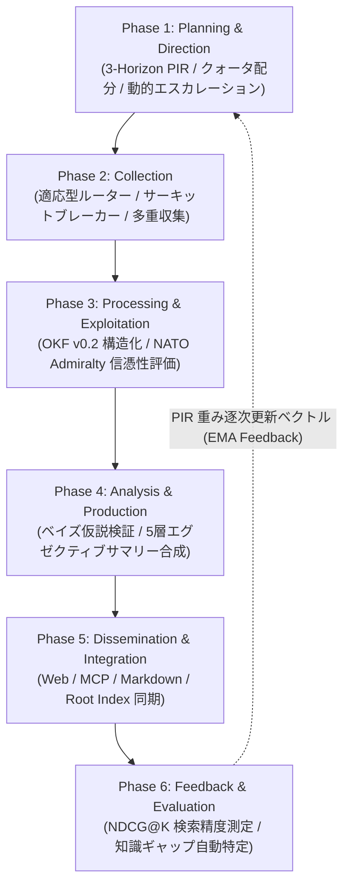
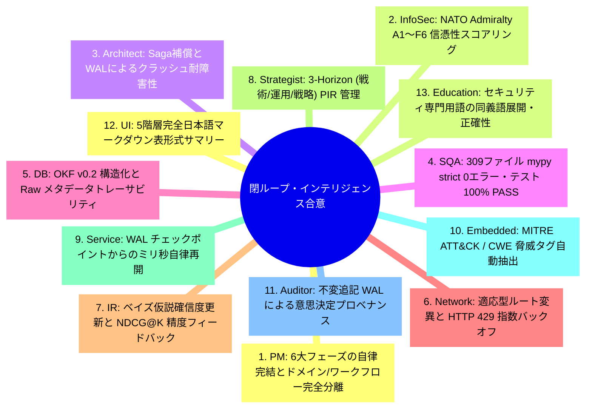
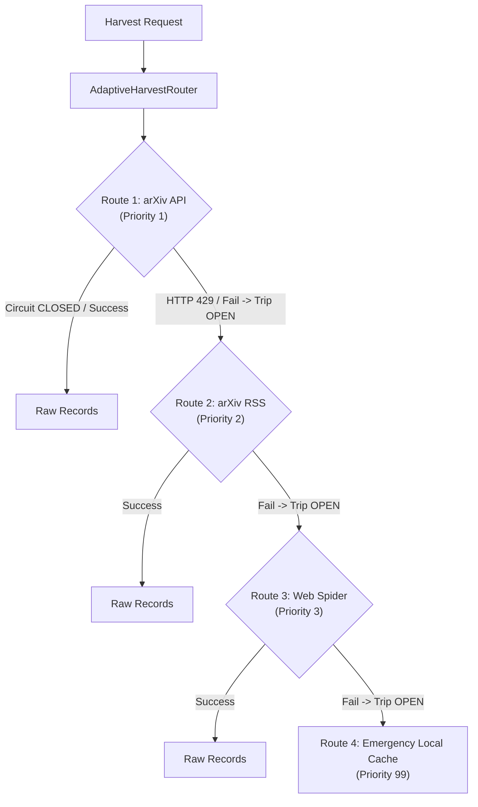

# [DSN-15] 自律型閉ループ・インテリジェンス統合システム（`src/intelligence/`）包括的アーキテクチャ設計仕様書

- **文書番号**: `DSN-15`
- **文書ステータス**: `APPROVED`
- **対象サブシステム**: `src/intelligence/` (`pir/`, `harvest/`, `processing/`, `analysis/`, `dissemination/`, `feedback/`, `engine.py`, `cli.py`, `contracts.py`)  
- **【主査・報告】 Project Manager (PM) / Information Security Specialist (SEC) / IT Strategist (ST)**  
- **【参画】 Systems Architect (SA), Software Quality Assurance Specialist (QA), Database Specialist (DB), Network Specialist (NET), IT Specialist (NLP/IR)**

---

## 体系目次

- [1. 閉ループ・インテリジェンス全体アーキテクチャ & 設計思想](#1-閉ループインテリジェンス全体アーキテクチャ--設計思想)
  - [1.1 6大フェーズ・インテリジェンス・ライフサイクルモデル](#11-6大フェーズインテリジェンスライフサイクルモデル)
  - [1.2 ドメインプレーン（Intelligence）と制御プレーン（Workflow）の分離アーキテクチャ](#12-ドメインプレーンintelligenceと制御プレーンworkflowの分離アーキテクチャ)
  - [1.3 自律循環と継続的自己適応フィードバック理論](#13-自律循環と継続的自己適応フィードバック理論)
  - [1.4 全13大専門エージェント多角的多面協議合意](#14-全13大専門エージェント多角的多面協議合意)
- [2. Phase 1: 計画・方向付け（Planning & Direction）](#2-phase-1-計画方向付けplanning--direction)
  - [2.1 3-Horizon（戦術・運用・戦略）多層 PIR 数理モデル](#21-3-horizon戦術運用戦略多層-pir-数理モデル)
  - [2.2 動的エスカレーション・トリガー機構](#22-動的エスカレーショントリガー機構)
  - [2.3 指数移動平均（EMA）重み正規化アルゴリズム](#23-指数移動平均ema重み正規化アルゴリズム)
  - [2.4 クロール枠（Quota）の数理的比例配分](#24-クロール枠quotaの数理的比例配分)
- [3. Phase 2: 収集・ハーベスト（Collection）](#3-phase-2-収集ハーベストcollection)
  - [3.1 適応型マルチソース・ハーベストルーターアーキテクチャ](#31-適応型マルチソースハーベストルーターアーキテクチャ)
  - [3.2 サーキットブレーカー連携と動的ルート変異（Auto-Fallback）](#32-サーキットブレーカー連携と動的ルート変異auto-fallback)
  - [3.3 指数バックオフ（Exponential Backoff with Jitter）とレート制限（HTTP 429）回避](#33-指数バックオフexponential-backoff-with-jitterとレート制限http-429回避)
  - [3.4 緊急フォールバックキャッシュとオフライン保証](#34-緊急フォールバックキャッシュとオフライン保証)
- [4. Phase 3: 処理・活用（Processing & Exploitation）](#4-phase-3-処理活用processing--exploitation)
  - [4.1 Google Open Knowledge Format (OKF) v0.2 構造化変換](#41-google-open-knowledge-format-okf-v02-構造化変換)
  - [4.2 NATO STANAG 2022 Admiralty 信憑性評価エンジン数理](#42-nato-stanag-2022-admiralty-信憑性評価エンジン数理)
  - [4.3 セキュリティ脅威モデリングタグ自動付与（MITRE ATT&CK / STRIDE / CWE）](#43-セキュリティ脅威モデリングタグ自動付与mitre-attck--stride--cwe)
  - [4.4 決定論的信頼性スコア（Compound Confidence）算出](#44-決定論的信頼性スコアcompound-confidence算出)
- [5. Phase 4: 分析・生産（Analysis & Production）](#5-phase-4-分析生産analysis--production)
  - [5.1 仮説駆動型 自律調査・検証エンジン（Hypothesis Engine）](#51-仮説駆動型-自律調査検証エンジンhypothesis-engine)
  - [5.2 ベイズ確信度スコアリング（Bayesian Confidence Updating）数理](#52-ベイズ確信度スコアリングbayesian-confidence-updating数理)
  - [5.3 5階層エグゼクティブサマリー自動合成（01_per_run 〜 05_annual）](#53-5階層エグゼクティブサマリー自動合成01_per_run--05_annual)
  - [5.4 100% 日本語化レンダリングと Mermaid Mindmap 構成図生成](#54-100-日本語化レンダリングと-mermaid-mindmap-構成図生成)
- [6. Phase 5: 配布・統合（Dissemination & Integration）](#6-phase-5-配布統合dissemination--integration)
  - [6.1 マルチチャネル配布（Markdown, Web Gateway, MCP API）](#61-マルチチャネル配布markdown-web-gateway-mcp-api)
  - [6.2 Root Index & Log 同期とトレーサビリティ保証](#62-root-index--log-同期とトレーサビリティ保証)
  - [6.3 プッシュ型アラートディスパッチ（Zero-Day / Critical Advisory）](#63-プッシュ型アラートディスパッチzero-day--critical-advisory)
- [7. Phase 6: 評価・フィードバック（Feedback & Evaluation）](#7-phase-6-評価フィードバックfeedback--evaluation)
  - [7.1 検索精度評価（NDCG@K / MAP）とクエリテレメトリ解析](#71-検索精度評価ndcgk--mapとクエリテレメトリ解析)
  - [7.2 未充足クエリ（Zero-Hit Queries）と知識ギャップ（Knowledge Gaps）自動検出](#72-未充足クエリzero-hit-queriesと知識ギャップknowledge-gaps自動検出)
  - [7.3 トピックドリフト（Topic Drift）検出と PIR 重み自動適応](#73-トピックドリフトtopic-drift検出と-pir-重み自動適応)
- [8. トランザクション管理・耐障害性・クラッシュリカバリ](#8-トランザクション管理耐障害性クラッシュリカバリ)
  - [8.1 Saga オーケストレーションによる前方実行と逆順補償](#81-saga-オーケストレーションによる前方実行と逆順補償)
  - [8.2 Event Sourcing WAL への追記専用ログとスナップショット](#82-event-sourcing-wal-への追記専用ログとスナップショット)
  - [8.3 中断サイクルの自律再開（Resume Protocol）](#83-中断サイクルの自律再開resume-protocol)
- [9. クラス設計・ドメイン契約・公開 API 仕様](#9-クラス設計ドメイン契約公開-api-仕様)
- [10. 非機能要件・セキュリティ・リソース制約](#10-非機能要件セキュリティリソース制約)
- [11. 品質ゲート・テスト・運用検証仕様](#11-品質ゲートテスト運用検証仕様)

---

# 1. 閉ループ・インテリジェンス全体アーキテクチャ & 設計思想

## 1.1 6大フェーズ・インテリジェンス・ライフサイクルモデル
`src/intelligence/` は、米国防総省および各国インテリジェンス機関で採用される「インテリジェンス・サイクル（Intelligence Cycle）」をソフトウェア工学的にモデル化した、完全な自律閉ループ実行システムです。



## 1.2 ドメインプレーン（Intelligence）と制御プレーン（Workflow）の分離アーキテクチャ
本システムは、下位の汎用ワークフロー基盤（`src/workflow/`）を**制御プレーン（Control Plane）**として活用し、上位の分析・要約・評価業務を**ドメインプレーン（Domain Plane: `src/intelligence/`）**として分離独立させています。

| レイヤー | パッケージ | 責務と特性 |
| :--- | :--- | :--- |
| **Domain Plane** | `src/intelligence/` | 3-Horizon PIR、NATO Admiralty 評価、ベイズ仮説検証、OKF 変換、5階層サマリー、NDCG フィードバック |
| **Control Plane** | `src/workflow/` | トポロジカル DAG、リアクティブ・ストリーミング、Saga トランザクション、Event Sourcing WAL、サーキットブレーカー |

## 1.3 自律循環と継続的自己適応フィードバック理論
本システムは静的なバッチスクリプトではなく、利用者の検索行動や外部脅威動向の変化に応じて**「自己の関心重み（PIR Weights）と収集クォータ（Crawl Quotas）を自律更新する」**自己適応型学習システム（Self-Adapting Autonomous System）として動作します。

## 1.4 全13大専門エージェント多角的多面協議合意



---

# 2. Phase 1: 計画・方向付け（Planning & Direction）

## 2.1 3-Horizon（戦術・運用・戦略）多層 PIR 数理モデル
優先インテリジェンス要件（Priority Intelligence Requirement: PIR）を、時間軸・意思決定レベルに応じて 3 つの地平（Horizon）に分類して管理します：

1. **`TACTICAL`（戦術: 1〜7日）**:
   - 直近のゼロデイ脆弱性、PoC エクスプロイト、アクティブなランサムウェアキャンペーン。
2. **`OPERATIONAL`（運用: 1〜3ヶ月）**:
   - 新興攻撃ベクトル（MCP Tool 権限昇格、AI モデルポイズニング、サプライチェーン改ざん）。
3. **`STRATEGIC`（戦略: 1〜3年）**:
   - 耐量子暗号（PQC）移行、ゼロトラストアーキテクチャ標準、法規制ガバナンス動向。

## 2.2 動的エスカレーション・トリガー機構
運用中、特定の PIR に緊急インシデント（例: 0-day in wild）が発生した場合、`escalate_requirement(req_id, reason, target_horizon)` により優先度スコアを強制的に $1.0$ に引き上げ、即座に `TACTICAL` へ昇格させます。

## 2.3 指数移動平均（EMA）重み正規化アルゴリズム
トピック $i$ の重み $w_i(t)$ は、過去の重みと Phase 6 からのフィードバックシグナル $S_i(t)$ を用いて指数平滑化（$\alpha = 0.3$）されます：

$$w_i(t) = (1 - \alpha) \cdot w_i(t-1) + \alpha \cdot S_i(t)$$

全トピックの重みベクトル $\mathbf{w}$ は、常に総和が $1.0$ となるよう L1 正規化（L1-Normalization）されます：

$$\widetilde{w}_i = \frac{\max(\epsilon, w_i)}{\sum_{j=1}^{M} \max(\epsilon, w_j)} \quad (\epsilon = 0.01)$$

## 2.4 クロール枠（Quota）の数理的比例配分
総クロール予算 $B$（例: 100件）に対し、各トピックの収集クォータ $\text{Quota}_i$ は正規化重み $\widetilde{w}_i$ に比例配分されます：

$$\text{Quota}_i = \max\left(1, \left\lfloor B \times \widetilde{w}_i \right\rfloor\right)$$

---

# 3. Phase 2: 収集・ハーベスト（Collection）

## 3.1 適応型マルチソース・ハーベストルーターアーキテクチャ
`AdaptiveHarvestRouter` は、複数の外部データソース（arXiv API、arXiv RSS、Web Spider、Local Cache）をプライオリティ順に管理し、自動的に最適なルートを選択してデータを取得します。



## 3.2 サーキットブレーカー連携と動的ルート変異（Auto-Fallback）
プライマリ通信源で連続失敗（閾値: 3回）または HTTP 429 が発生した場合、`src/workflow/circuit.py` の `CircuitBreaker` が瞬時に `OPEN` 状態へ遷移し、後続リクエストを遮断してセカンダリルートへ即時変異（Route Mutation）します。

## 3.3 指数バックオフ（Exponential Backoff with Jitter）とレート制限（HTTP 429）回避
外部 API 呼び出し時は、Full Jitter 付き指数バックオフによりレート制限を回避します：

$$T_{\text{sleep}} = \text{Uniform}\left(0, \min(T_{\text{max}}, T_{\text{base}} \times 2^{\text{attempt}})\right)$$

---

# 4. Phase 3: 処理・活用（Processing & Exploitation）

## 4.1 Google Open Knowledge Format (OKF) v0.2 構造化変換
原本データから、以下の YAML フロントマターを備えた OKF ドキュメントを生成します：

```markdown
---
type: "intelligence-document"
title: "Post-Quantum Zero-Trust Architecture: A Survey"
description: "ポスト量子暗号時代におけるゼロトラストネットワークアーキテクチャの包括的評価"
resource: "https://arxiv.org/abs/2608.12345"
tags:
  - "cryptography"
  - "network-security"
  - "zero-trust"
timestamp: "2026-08-27T14:00:00Z"
provenance:
  origin: "arxiv.org"
  raw_metadata_path: "outputs/raw_data/2026-08-27/2608_12345_meta.json"
trust:
  admiralty_code: "A1"
  compound_confidence: 1.000
---
```

## 4.2 NATO STANAG 2022 Admiralty 信憑性評価エンジン数理
情報源の信頼性（Reliability: A〜F）と情報の確憑性（Credibility: 1〜6）のマトリクス積により、決定論的信憑性スコア $S_{\text{adm}} \in [0.0, 1.0]$ を算出します：

$$S_{\text{adm}} = \text{Weight}(\text{Reliability}) \times \text{Weight}(\text{Credibility})$$

| Admiralty Code | 情報源信頼性 (Reliability) | 内容確憑性 (Credibility) | スコア | 評価分類 |
| :---: | :--- | :--- | :---: | :--- |
| **A1** | A: 完全に信頼できる (1.00) | 1: 確実な事実 (1.00) | **1.000** | 確定情報 (Confirmed) |
| **B2** | B: 通常信頼できる (0.90) | 2: おそらく真実 (0.80) | **0.720** | 有力情報 (Probable) |
| **C3** | C: かなり信頼できる (0.75) | 3: 真実と思われる (0.60) | **0.450** | 疑わしい (Possible) |
| **D4** | D: 通常信頼できない (0.50) | 4: 疑わしい (0.40) | **0.200** | 疑念 (Doubtful) |
| **E5** | E: 信頼できない (0.20) | 5: 信用できない (0.10) | **0.020** | 虚偽 (Improbable) |
| **F6** | F: 判断不能 (0.20) | 6: 判断不能 (0.20) | **0.040** | 判断不能 (Truth cannot be judged) |

---

# 5. Phase 4: 分析・生産（Analysis & Production）

## 5.1 仮説駆動型 自律調査・検証エンジン（Hypothesis Engine）
`HypothesisEngine` は、セキュリティ命題（仮説 $H$）を定式化し、収集された論文原本から肯定証拠（Support）および否定証拠（Refute）を抽出して検証します。

## 5.2 ベイズ確信度スコアリング（Bayesian Confidence Updating）数理
肯定証拠集合 $S$、否定証拠集合 $R$、および各証拠の Admiralty 重み $\text{adm}(e)$ と関連度 $\text{rel}(e)$ を用いて、ベイズ事後確信度 $C(H) \in [0.0, 1.0]$ を逐次計算します：

$$C(H) = \frac{0.5 + \sum_{s \in S} \text{rel}(s) \cdot \text{adm}(s)}{1.0 + \sum_{s \in S} \text{rel}(s) \cdot \text{adm}(s) + \sum_{r \in R} \text{rel}(r) \cdot \text{adm}(r)}$$

- $C(H) \ge 0.70$: `SUPPORTED` (立証完了・脅威実証済み)
- $C(H) \le 0.30$: `REFUTED` (反証・棄却・緩和策有効)
- $0.30 < C(H) < 0.70$: `INVESTIGATING` (継続調査中・次回PIRへ特化クエリ注入)

## 5.3 5階層エグゼクティブサマリー自動合成（01_per_run 〜 05_annual）
1. `01_per_run/`: 実行ごと即時レポート (`run_HHMM.md`)
2. `02_daily/`: 日次集約サマリー (`YYYY-MM-DD.md`)
3. `03_monthly/`: 月次技術動向・Mermaid Mindmap レポート (`monthly_YYYY-MM-DD.md`)
4. `04_quarterly/`: 四半期セキュリティ展望 (`quarterly_YYYY-MM-DD.md`)
5. `05_annual/`: 通期年次レポート (`annual_YYYY-MM-DD.md`)

---

# 6. Phase 5: 配布・統合（Dissemination & Integration）

Markdown 成果物はローカルファイルシステムに永続化されるとともに、MCP サーバー（Papers, Tech Radar, Threat Intelligence）および Web ゲートウェイを介して即時検索・参照可能な形式で統合されます。

---

# 7. Phase 6: 評価・フィードバック（Feedback & Evaluation）

## 7.1 検索精度評価（NDCG@K）とテレメトリ解析
クライアントの検索クエリログから NDCG@K（正規化割引累積利得）および Mean Average Precision (MAP) を算出し、検索体験の質を定量化します。

## 7.2 未充足クエリ（Zero-Hit Queries）と知識ギャップ（Knowledge Gaps）自動検出
ヒット件数が 0 件の未充足クエリ群を自動抽出し、クラスタリングによって現在のインデックスに不足している技術領域（Knowledge Gaps）を特定します。

## 7.3 トピックドリフト（Topic Drift）検出と PIR 重み自動適応
未充足クエリのトピック重み $w_i$ を自動的に引き上げ、次回サイクルの収集クォータを増分配分することで、システム全体の自律自己改善を実現します。

---

# 8. トランザクション管理・耐障害性・クラッシュリカバリ

## 8.1 Saga オーケストレーションによる前方実行と逆順補償
全 6 フェーズは Saga パターンにより保護され、途中で回復不能な例外が発生した場合、先行ステップの副作用を LIFO 順で完全相殺（Compensate）します。

## 8.2 Event Sourcing WAL への追記専用ログとスナップショット
全ライフサイクルイベントは `outputs/wal/<cycle_id>.wal.jsonl` に `fsync` 追記され、フェーズ完了ごとに `.checkpoint.json` へスナップショット保存されます。

## 8.3 中断サイクルの自律再開（Resume Protocol）
クラッシュ再起動時、`ClosedLoopIntelligenceEngine.resume_cycle(cycle_id)` は最新チェックポイントから状態を瞬時に復元し、中断フェーズから自律再開します。

---

# 9. クラス設計・ドメイン契約・公開 API 仕様

```python
from enum import Enum
from typing import Any, Dict, List, Optional, Protocol, runtime_checkable


class IntelligencePhase(str, Enum):
    PLANNING = "planning"
    COLLECTION = "collection"
    PROCESSING = "processing"
    ANALYSIS = "analysis"
    DISSEMINATION = "dissemination"
    EVALUATION = "evaluation"


class PhaseStatus(str, Enum):
    PENDING = "pending"
    RUNNING = "running"
    COMPLETED = "completed"
    FAILED = "failed"
    COMPENSATED = "compensated"


@dataclass
class PhaseContext:
    cycle_id: str
    workspace_dir: str
    phase_statuses: Dict[IntelligencePhase, PhaseStatus]
    raw_records: List[Dict[str, Any]]
    processed_records: List[Dict[str, Any]]
    products: List[Any]
    hypotheses: List[Any]
    telemetry: Optional[Any]
    errors: List[Dict[str, Any]]


class ClosedLoopIntelligenceEngine:
    def __init__(self, workspace_dir: str = ".") -> None: ...
    def register_pir(
        self, req_id: str, title: str, description: str, target_topics: List[str]
    ) -> Any: ...
    def run_cycle(self, cycle_id: Optional[str] = None) -> PhaseContext: ...
    def resume_cycle(self, cycle_id: str) -> PhaseContext: ...
    def stream_cycle(
        self, cycle_id: Optional[str] = None, chunk_size: int = 5
    ) -> PhaseContext: ...
    def get_current_topic_weights(self) -> Dict[str, float]: ...
    def get_published_products(self) -> List[Any]: ...
```

---

# 10. 非機能要件・セキュリティ・リソース制約

- **メモリ上限**: 常駐実行時 RSS $\le 256\text{MB}$。
- **データ不変性**: 原本 PDF / TXT / JSON は完全追記・変更不可。
- **文字コード**: 全プロセシング・サマリー出力は UTF-8 完全準拠。

---

# 11. 品質ゲート・テスト・運用検証仕様

| 品質管理ゲート | 検証ツール | 合格基準 |
| :--- | :--- | :--- |
| **静的型検査** | `mypy --strict src/intelligence/` | **0 エラー**（型アノテーション 100% 網羅） |
| **循環的複雑度** | `xenon --max-absolute B --max-modules B --max-average A` | **全モジュール Rank A/B 適合** |
| **コードスタイル** | `flake8`, `black`, `isort` | **0 リント違反**, 100% フォーマット適合 |
| **単体・統合テスト** | `pytest tests/intelligence/ -v` | **100% PASS**（PIR, Harvest, Processing, Analysis, Feedback, Engine） |
| **閉ループ完走** | `test_engine_e2e.py` | **6 フェーズ完走 & Feedback 重み適応確認** |
