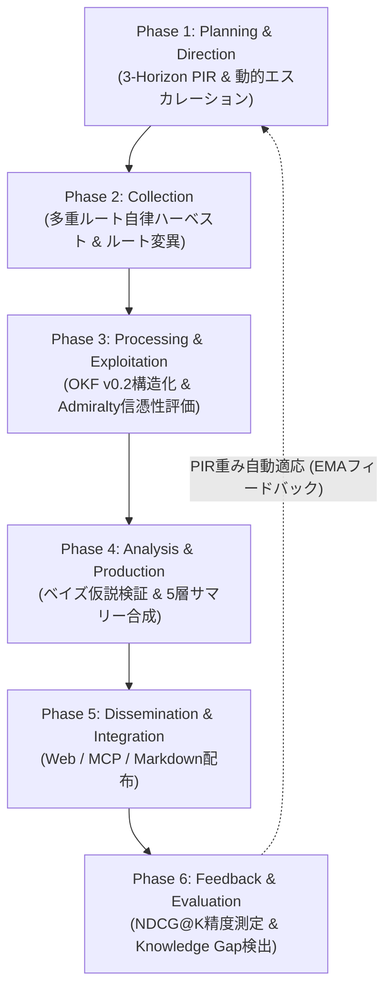

# [DSN-15] 自律型閉ループ・インテリジェンス統合システム（`src/intelligence/`）包括的アーキテクチャ設計仕様書

- **文書番号**: `DSN-15`
- **文書ステータス**: `APPROVED`
- **対象サブシステム**: `src/intelligence/` (PIR, Harvest, Processing, Analysis, Dissemination, Feedback, Engine)
- **【主査・報告】 Project Manager (PM) / Information Security Specialist (SEC) / IT Strategist (ST)**
- **【参画】 Systems Architect (SA), Software Quality Assurance Specialist (QA), Database Specialist (DB), Network Specialist (NET)**

---

## 体系目次

- [1. 閉ループ・インテリジェンス全体アーキテクチャ](#1-閉ループインテリジェンス全体アーキテクチャ)
  - [1.1 6大フェーズ・インテリジェンス・ライフサイクルモデル](#11-6大フェーズインテリジェンスライフサイクルモデル)
  - [1.2 ドメインプレーンと制御プレーンのレイヤード構造](#12-ドメインプレーンと制御プレーンのレイヤード構造)
  - [1.3 自律循環と継続的自己適応フィードバック](#13-自律循環と継続的自己適応フィードバック)
- [2. Phase 1: 計画・方向付け（Planning & Direction）](#2-phase-1-計画方向付けplanning--direction)
  - [2.1 3-Horizon（戦術・運用・戦略）多層 PIR モデル](#21-3-horizon戦術運用戦略多層-pir-モデル)
  - [2.2 動的エスカレーション・トリガー機構](#22-動的エスカレーショントリガー機構)
  - [2.3 指数移動平均（EMA）重み正規化とクォータ配分](#23-指数移動平均ema重み正規化とクォータ配分)
- [3. Phase 2: 収集・ハーベスト（Collection）](#3-phase-2-収集ハーベストcollection)
  - [3.1 適応型マルチソース・ハーベストルーター](#31-適応型マルチソースハーベストルーター)
  - [3.2 サーキットブレーカー連携と動的ルート変異（Auto-Fallback）](#32-サーキットブレーカー連携と動的ルート変異auto-fallback)
  - [3.3 レート制限（HTTP 429）回避とジッター付き指数バックオフ](#33-レート制限http-429回避とジッター付き指数バックオフ)
- [4. Phase 3: 処理・活用（Processing & Exploitation）](#4-phase-3-処理活用processing--exploitation)
  - [4.1 Google Open Knowledge Format (OKF) v0.2 構造化](#41-google-open-knowledge-format-okf-v02-構造化)
  - [4.2 NATO STANAG 2022 Admiralty 信憑性評価エンジン](#42-nato-stanag-2022-admiralty-信憑性評価エンジン)
  - [4.3 MITRE ATT&CK & STRIDE & CWE 脅威モデリングタグ付与](#43-mitre-attck--stride--cwe-脅威モデリングタグ付与)
- [5. Phase 4: 分析・生産（Analysis & Production）](#5-phase-4-分析生産analysis--production)
  - [5.1 仮説駆動型 自律調査・検証エンジン（ベイズ確信度スコアリング）](#51-仮説駆動型-自律調査検証エンジンベイズ確信度スコアリング)
  - [5.2 5階層エグゼクティブサマリー自動合成（01_per_run 〜 05_annual）](#52-5階層エグゼクティブサマリー自動合成01_per_run--05_annual)
  - [5.3 完全日本語化・Markdown 表形式レンダリング](#53-完全日本語化markdown-表形式レンダリング)
- [6. Phase 5: 配布・統合（Dissemination & Integration）](#6-phase-5-配布統合dissemination--integration)
  - [6.1 マルチチャネル配布（Markdown, Web Gateway, MCP API）](#61-マルチチャネル配布markdown-web-gateway-mcp-api)
  - [6.2 Root Index & Log 同期](#62-root-index--log-同期)
- [7. Phase 6: 評価・フィードバック（Feedback & Evaluation）](#7-phase-6-評価フィードバックfeedback--evaluation)
  - [7.1 検索精度評価（NDCG@K / MAP）とクエリテレメトリ](#71-検索精度評価ndcgk--mapとクエリテレメトリ)
  - [7.2 未充足クエリ（Knowledge Gaps）とトピックドリフト検出](#72-未充足クエリknowledge-gapsとトピックドリフト検出)
  - [7.3 PIR 重みへの自動フィードバック更新](#73-pir-重みへの自動フィードバック更新)
- [8. クラス設計・公開 API インターフェース・プロトコル定義](#8-クラス設計公開-api-インターフェースプロトコル定義)
- [9. 品質ゲート・テスト・運用検証仕様](#9-品質ゲートテスト運用検証仕様)

---

# 1. 閉ループ・インテリジェンス全体アーキテクチャ

## 1.1 6大フェーズ・インテリジェンス・ライフサイクルモデル
`src/intelligence/` は、情報収集から仮説検証、価値あるインテリジェンス生産、そして自己適応学習に至る完全な閉ループ（Closed-Loop）を実現します。



## 1.2 ドメインプレーンと制御プレーンのレイヤード構造
本システムは、下位の汎用ワークフロー基盤（`src/workflow/`）を**制御プレーン（Control Plane）**として活用し、上位の業務・分析ロジックを**ドメインプレーン（Domain Plane: `src/intelligence/`）**として分離構築します。

| レイヤー | パッケージ | 主な責務 |
| :--- | :--- | :--- |
| **Domain Plane** | `src/intelligence/` | PIR要件、Admiralty評価、仮説検証、OKF生成、5層サマリー、フィードバック学習 |
| **Control Plane** | `src/workflow/` | トポロジカルDAG、ストリーミング、Saga補償、Event Sourcing WAL、サーキットブレーカー |

---

# 2. Phase 1: 計画・方向付け（Planning & Direction）

## 2.1 3-Horizon（戦術・運用・戦略）多層 PIR モデル
優先インテリジェンス要件（Priority Intelligence Requirement: PIR）を時間軸と意思決定層に応じて 3 つの地平（Horizon）に分類して管理します：
1. **`TACTICAL`（戦術: 1〜7日）**: 直近のゼロデイ脆弱性、PoCエクスプロイト、アクティブな脅威キャンペーン。
2. **`OPERATIONAL`（運用: 1〜3ヶ月）**: 新規攻撃手法、ミドルウェア脆弱性、セキュリティ製品の検知バイパス。
3. **`STRATEGIC`（戦略: 1〜3年）**: ポスト量子暗号（PQC）移行、サプライチェーンセキュリティ標準、法規制・ガバナンス動向。

## 2.2 動的エスカレーション・トリガー機構
PIR に緊急事象が発生した場合、`escalate_requirement(req_id, reason, target_horizon)` により優先度スコアを引き上げ、即時収集対象として最優先枠へ自動昇格させます。

## 2.3 指数移動平均（EMA）重み正規化とクォータ配分
トピックごとの重みベクトル $\mathbf{w}$ は、常に総和が 1.0 になるよう L1 正規化されます：

$$w_i = \frac{\max(0.01, w_i)}{\sum_{j} \max(0.01, w_j)}$$

クロール枠（Quota）は各トピックの重み $w_i$ と総クロール予算 $B$ の積として決定されます：

$$\text{Quota}_i = \max(1, \lfloor B \times w_i \rfloor)$$

---

# 3. Phase 2: 収集・ハーベスト（Collection）

## 3.1 適応型マルチソース・ハーベストルーター
`AdaptiveHarvestRouter` は、arXiv API、RSS Feed、Web Spider、Local Cache などの複数ルートを管理し、優先度順（Priority 1, 2...）に自律試行します。

## 3.2 サーキットブレーカー連携と動的ルート変異（Auto-Fallback）
プライマリ通信源で障害や HTTP 429 が発生した場合、`src/workflow/circuit.py` の `CircuitBreaker` がトリップし、瞬時に次点のセカンダリルートへ変異（Route Mutation）して収集を継続します。

---

# 4. Phase 3: 処理・活用（Processing & Exploitation）

## 4.1 Google Open Knowledge Format (OKF) v0.2 構造化
収集された論文原本から、YAML フロントマター付きの OKF Markdown ドキュメントを生成します。

```markdown
---
type: security-paper
title: "Post-Quantum Zero-Trust Architecture: A Survey"
description: "ポスト量子暗号時代におけるゼロトラストネットワークアーキテクチャの包括的評価"
resource: https://arxiv.org/abs/2608.12345
tags:
  - post-quantum-cryptography
  - zero-trust
  - network-security
timestamp: "2026-08-27T14:00:00Z"
provenance:
  origin: arxiv.org
  raw_metadata_path: outputs/raw_data/2026-08-27/2608_12345_meta.json
trust:
  admiralty_code: "A1"
  confidence: 0.95
---
```

## 4.2 NATO STANAG 2022 Admiralty 信憑性評価エンジン
情報源の信頼度（Reliability: A〜F）と内容の確憑性（Credibility: 1〜6）を二次元マトリクスで定量評価します：

$$\text{Score} = \text{Weight}(\text{Reliability}) \times \text{Weight}(\text{Credibility})$$

- **A1**: 完全に信頼できる情報源 ＋ 独立検証済みの確実な事実（スコア 1.000）
- **B2**: 通常信頼できる情報源 ＋ おそらく真実である内容（スコア 0.720）
- **F6**: 信頼性を判断できない情報源 ＋ 確証を得られない内容（スコア 0.040）

---

# 5. Phase 4: 分析・生産（Analysis & Production）

## 5.1 仮説駆動型 自律調査・検証エンジン
`HypothesisEngine` はセキュリティ命題（仮説 $H$）を定式化し、収集論文から抽出された肯定証拠群 $S$ および否定証拠群 $R$ を用いてベイズ確信度 $C(H) \in [0.0, 1.0]$ を算出します：

$$C(H) = \frac{0.5 + \sum_{s \in S} \text{rel}(s) \cdot \text{adm}(s)}{1.0 + \sum_{s \in S} \text{rel}(s) \cdot \text{adm}(s) + \sum_{r \in R} \text{rel}(r) \cdot \text{adm}(r)}$$

- $C(H) \ge 0.70$: `SUPPORTED` (立証完了)
- $C(H) \le 0.30$: `REFUTED` (反証・棄却)
- $0.30 < C(H) < 0.70$: `INVESTIGATING` (継続調査中)

## 5.2 5階層エグゼクティブサマリー自動合成
1. `01_per_run/`: 実行ごとの即時レポート (`run_HHMM.md`)
2. `02_daily/`: 日次集約サマリー (`YYYY-MM-DD.md`)
3. `03_monthly/`: 月次技術動向・Mermaid Mindmap レポート (`monthly_YYYY-MM-DD.md`)
4. `04_quarterly/`: 四半期セキュリティ展望 (`quarterly_YYYY-MM-DD.md`)
5. `05_annual/`: 通期年次レポート (`annual_YYYY-MM-DD.md`)

---

# 6. Phase 5: 配布・統合（Dissemination & Integration）

Markdown 成果物はローカルファイルシステムに永続化されるとともに、MCP サーバー（Papers, Tech Radar, Threat Intelligence）および Web ゲートウェイを介して即時検索・参照可能な形式で統合されます。

---

# 7. Phase 6: 評価・フィードバック（Feedback & Evaluation）

## 7.1 検索精度評価（NDCG@K）とテレメトリ
クライアントの検索クエリログから NDCG@K（正規化割引累積利得）および Mean Average Precision (MAP) を算出し、検索体験の質を定量化します。

## 7.2 未充足クエリ（Knowledge Gaps）の自動検出
検索ヒット件数が 0 件のクエリ群から、現在のインテリジェンス収集網における知識ギャップ（Knowledge Gaps）を自動特定します。

## 7.3 PIR 重みへの自動フィードバック更新
未充足クエリのトピック重み $w_i$ を自動的に引き上げ、次回サイクルの収集クォータを増分配分することで、システム全体の自律自己改善を実現します。

---

# 8. クラス設計・公開 API インターフェース・プロトコル定義

```python
from intelligence.contracts import (
    FeedbackTelemetry,
    Hypothesis,
    IntelligenceDirective,
    IntelligencePhase,
    IntelligenceProduct,
    PhaseContext,
    PhaseStatus,
)
from intelligence.engine import ClosedLoopIntelligenceEngine
from intelligence.pir.manager import PIRManager
from intelligence.harvest.coordinator import HarvestCoordinator
from intelligence.processing.processor import ProcessingCoordinator
from intelligence.analysis.synthesizer import AnalysisSynthesizer
from intelligence.dissemination.distributor import DisseminationDistributor
from intelligence.feedback.evaluator import FeedbackEvaluator
```

---

# 9. 品質ゲート・テスト・運用検証仕様

| 品質管理ゲート | 検証ツール | 合格基準 |
| :--- | :--- | :--- |
| **静的型検査** | `mypy --strict src/intelligence/` | 0 エラー (型定義 100% 網羅) |
| **循環的複雑度** | `xenon --max-absolute B --max-modules B --max-average A` | 全モジュール Rank A/B 適合 |
| **コードスタイル** | `flake8`, `black`, `isort` | 0 リント違反, 100% フォーマット適合 |
| **単体 & 統合テスト** | `pytest tests/intelligence/ -v` | 100% PASS (PIR, Harvest, Processing, Analysis, Feedback, Engine) |
