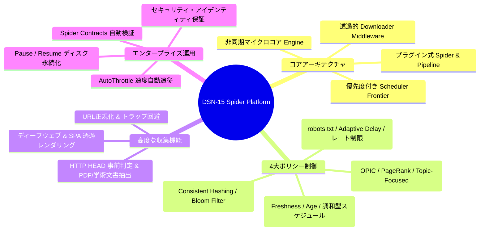
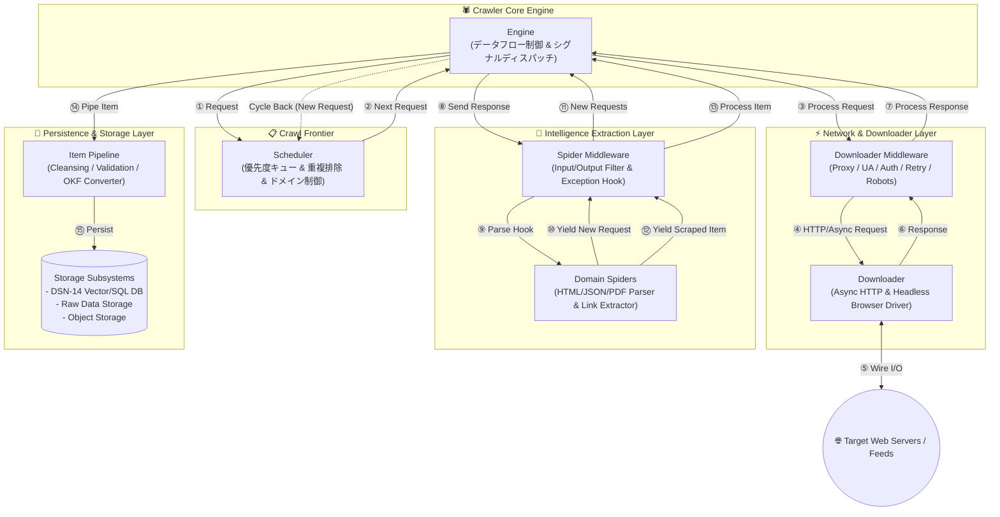
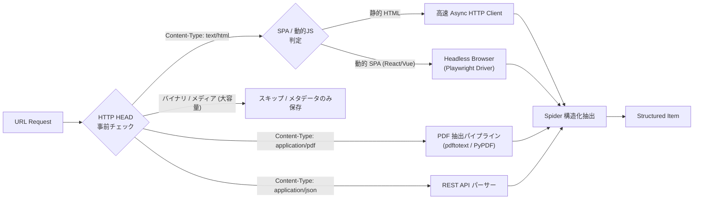
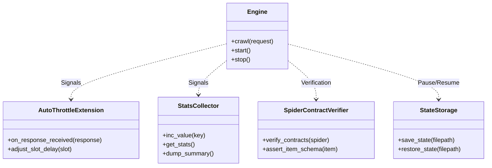
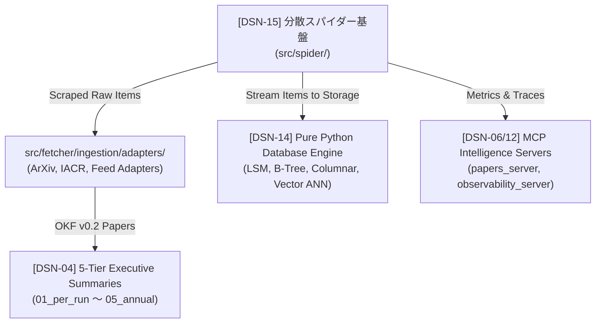

# [DSN-15] 大規模分散Webクローラー・スパイダー基盤 アーキテクチャ詳細設計・仕様書 (Distributed Spider & Crawler Architecture)

---

## 1. システム概要と基本設計思想 (Executive Overview & Principles)

本基盤は、Scrapy のイベント駆動・コンポーネント指向アーキテクチャの優れた分離性を踏襲しつつ、大規模 Web クローリングにおける 4 大課題である **効率性 (Efficiency)**、**新鮮度 (Freshness)**、**マナー (Politeness)**、および **スケーラビリティ (Scalability)** を高次元で統合した次世代の分散型 Web クローリング＆インテリジェンス収集プラットフォームです。

外部の重厚なクローラーフレームワークに過度に依存せず、Python 標準の非同期 I/O (`asyncio`, `urllib`, `ssl`, `dataclasses`, `collections`, `heapq`) をベースとした拡張可能なマイクロコア構成を採用し、単一ノードでの超高速非同期クロールから、分散ハッシュリング（Consistent Hashing）によるマルチノード協調クロールまでをシームレスにサポートします。



---

## 2. コア・アーキテクチャ & データフロー (Core Architecture & Dataflow)

システムは非同期イベントループを中心とするパイプライン構造を取り、各コンポーネントはシグナルとメッセージパッシングにより疎結合に連携します。



### コンポーネント定義と責務仕様

| コンポーネント | 責務と要求仕様 |
| :--- | :--- |
| **Engine** | 全体データフローのオーケストレーション、イベントループ制御、ライフサイクルシグナル（`spider_opened`, `request_scheduled`, `response_received`, `item_scraped`, `spider_closed`）の発火・伝播。 |
| **Scheduler (Crawl Frontier)** | クロール対象 URL の優先度付きキュー管理（Heap / FIFO / LIFO）、URL 重複排除（Bloom Filter / Set）、ドメイン単位のスロットルキューイング。 |
| **Downloader** | 非同期 HTTP/HTTPS リクエスト処理（Connection Pooling, Keep-Alive）、HTTP HEAD 事前検証、動的 JavaScript レンダリング（Playwright / Headless Browser）の透過的呼び出し。 |
| **Downloader Middleware** | ダウンロード処理前後のフック。robots.txt 遵守判定、User-Agent ローテーション、Proxy 切替、自動リトライ、HTTP キャッシュ。 |
| **Spider** | ドメイン固有のレスポンス解析、XPath / CSS / 正規表現による構造化データ（Items）抽出、および新規巡回 URL（Requests）の発行。 |
| **Spider Middleware** | Spider の入出力フック。不正レスポンスの事前フィルタリング、コールバック例外ハンドリング、出力 Request / Item のサニタイズ。 |
| **Item Pipeline** | 抽出データのバリデーション、テキストクレンジング、重複検知、Google OKF v0.2 Markdown 生成、DSN-14 ベクトル DB / SQL エンジンへの保存。 |

---

## 3. クローリング・ポリシー制御仕様 (Crawling Policies)

### 3.1 選択ポリシー (Selection Policy: URL優先度決定)

膨大な Web 空間から価値の高い情報を最優先で取得するため、以下のスコアリングアルゴリズムを Frontier に組み込みます。

1. **Breadth-First Search (幅優先探索)**:
   - ルートページから浅い階層にあるハブページを先行探索。初期発見リンクを安定して巡回。
2. **Partial PageRank / In-link Popularity**:
   - クロール済みグラフの被リンク数を動的集計し、参照数の多いノードへのリンクをキューの上位に自動昇格。
3. **OPIC (On-line Page Importance Computation)**:
   - 各ページに初期 Cash $C_0$ を付与。ページ $p$ の訪問時に、保有 Cash を外向きリンク $L(p)$ に等分配 ($C_p / |L(p)|$)。累積 Cash 量 $\sum C$ に応じて優先度をリアルタイム更新（高コストな大域的 PageRank 行列計算を不要化）。
4. **トピック指向 / フォーカスド・クロール (Topic-Focused Crawling)**:
   - アンカーテキストおよび祖先ノードのベクトル類似度（Cosine Similarity）とセキュリティ・オントロジー適合度を算出し、閾値 $\theta$ を超える特定ドメインリンクのみを選択的に巡回。

### 3.2 再訪問ポリシー (Re-visit Policy: 新鮮度最大化)

Web ページの更新頻度と情報の鮮度を数学的にモデル化し、限られた帯域で最大の「情報の新鮮度」を維持します。

- **新鮮度関数 (Freshness)**:
  $$F_p(t) = \begin{cases} 1 & \text{ローカルコピーが時刻 } t \text{ の実体と完全に一致} \\ 0 & \text{実体側で更新が発生し未取得} \end{cases}$$
- **経過時間関数 (Age)**:
  $$A_p(t) = \begin{cases} 0 & \text{実体側で更新されていない} \\ t - \tau_{\text{mod}} & \text{実体側が時刻 } \tau_{\text{mod}} \text{ で更新されてからの経過時間} \end{cases}$$

```mermaid
gantt
    title クロール再訪問スケジュール比較 (Harmonic Proportional vs Uniform)
    dateFormat X
    axisFormat %d日
    section 高更新ページ (日次ニュース/Advisory)
    Harmonic Proportional :active, hp1, 0, 1
    Harmonic Proportional :active, hp2, 1, 2
    Harmonic Proportional :active, hp3, 2, 3
    Uniform Schedule      :crit, u1, 0, 2
    Uniform Schedule      :crit, u2, 2, 4
    section 低更新ページ (学術論文アーカイブ)
    Harmonic Proportional :hp4, 0, 4
    Uniform Schedule      :crit, u3, 0, 2
    Uniform Schedule      :crit, u4, 2, 4
```



- **調和型比例スケジュール (Harmonic Proportional Policy)**:
  - 過去の変更履歴（`Last-Modified`, `ETag`, Content Hash 変化率 $\lambda_p$）から更新頻度をポアソン過程として推定。
  - 極端な頻回クロールによる過負荷を防ぐため、ペナルティ関数を導入した調和型周期 $T_p \propto \frac{1}{\sqrt{\lambda_p}}$ に基づき次回巡回時刻を算出。

### 3.3 マナー・負荷制御ポリシー (Politeness Policy)

対象サーバーに過剰な負荷を与えないための厳格なアクセス制御を強制します。

1. **Robots Exclusion Protocol (RFC 9309 準拠)**:
   - `robots.txt` を自動取得・解析し、`Disallow` パスへのアクセスを物理遮断。
   - `Crawl-delay` ディレクティブが存在する場合、ドメインの最小リクエスト間隔として強制適用。
2. **動的適応遅延 (Adaptive Delays / AutoThrottle)**:
   - 直前リクエストの往復レイテンシ $t_{\text{download}}$ に基づき、次期待機時間 $w$ を動的調整：
     $$w = \max(w_{\text{min}}, \min(w_{\text{max}}, \alpha \cdot t_{\text{download}})) \quad (\text{デフォルト } \alpha = 5.0)$$
   - HTTP 429 (Too Many Requests) / 503 受信時は即座に Exponential Backoff を発動。
3. **ドメイン単位並行数制御 (Per-Domain Concurrency Limit)**:
   - 同一ホストに対する同時接続数を `CONCURRENT_REQUESTS_PER_DOMAIN`（デフォルト: 2〜4）に厳格制限。

### 3.4 並行・分散制御ポリシー (Parallelization Policy)

マルチノード環境における競合・重複を排除し、線形スケーラビリティを担保します。

- **Consistent Hashing Frontier**:
  - URL のホスト名ハッシュ $\text{MD5}(\text{hostname})$ をリング状に配置し、特定ホストの全リクエストを同一ワーカーにルーティング（Politeness 制御の局所完結化）。
- **分散型 Bloom Filter 重複排除**:
  - メモリ効率に優れた Scalable Bloom Filter（誤検知率 $P_e < 10^{-6}$）により、数億規模の URL 訪問履歴を高速判定。

---

## 4. URL処理・トラップ回避機構 (URL Processing & Trap Defense)

### 4.1 URL 正規化・標準化 (Canonicalization Pipeline)

同一リソースに対する表記ゆれを完全統一し、冗長リクエストを 100% 排除します。

```
[生の抽出URL] https://Example.COM:443/research/./papers/../papers/index.html?utm_source=rss&b=2&a=1#section
                                 │
                                 ▼ (URL Normalizer)
 1. スキーム & ホスト名小文字化  : https://example.com:443/...
 2. デフォルトポート除去        : https://example.com/...
 3. 相対パス . / .. の正規化      : https://example.com/research/papers/index.html...
 4. ディレクトリ末尾 / 統一     : https://example.com/research/papers/
 5. 不要パラメータ除去 (utm_*)  : ?b=2&a=1
 6. クエリパラメータのソート    : ?a=1&b=2
 7. フラグメント (#...) の除去  : (除去完了)
                                 │
                                 ▼
[正規化URL] https://example.com/research/papers/?a=1&b=2
```

### 4.2 クローラー・トラップ (Spider Trap) の多層防御

- **ディレクトリ深度リミッター**: パスセグメント深度が閾値（例: 8階層）を超える URL をスキップ。
- **反復パターン検知**: `/calendar/2026/08/calendar/2026/09/...` のような同一ディレクトリ名のループ構造を検知して遮断。
- **クエリパラメータ爆発防止**: 類似パラメータの順列組み合わせを検知し、同一ドメイン・同一パスでのクエリバリエーション上限（例: 20件）を適用。
- **Path-Ascending Crawling (パス上昇探索)**: 孤立した親階層・インデックスを発見するため、段階的に親パスへ遡る探索モードを提供。

---

## 5. ディープウェブ・動的コンテンツ・学術メディア対応



### 5.1 動的レンダリング & フォーム自動化
- **透過的 Headless ハンドラ**: ページ内に `<div id="root"></div>` や特定の JS レンダリングシグナルを検知した場合、自動的に Headless ブラウザインスタンスに切り替えて DOM 確定後の HTML を抽出。
- **検索フォーム自動投入**: 学術ポータルや脆弱性データベースの検索フォームに対し、指定キーワードリスト（`query_params`）を自動バッチ投入。

### 5.2 メディア & 学術ドキュメント抽出パイプライン
- **HTTP HEAD 事前検証**: 大容量ファイルのダウンロード前に `Content-Type` と `Content-Length` を取得し、帯域制限（例: 最大 50MB）を超過するリソースを遮断。
- **マルチフォーマット テキスト抽出**: PDF, PostScript, DOCX, TXT 等を自動判別し、テキスト抽出エンジンを経て OKF v0.2 ドキュメントへ正規化。

---

## 6. セキュリティ・アイデンティティ・コンプライアンス

### 6.1 クローラー識別 (User-Agent Identification)
- クローラーの身元を明記した RFC 準拠の User-Agent 文字列を標準設定：
  ```
  User-Agent: ArXivSecuritySpider/1.0 (+https://github.com/rokujyouhitoma/arxiv-security-papers; bot@example.com)
  ```
- **緊急停止スイッチ (Emergency Kill Switch)**: Web サイト管理者からの停止要請やローカル障害発生時、シグナル受信または管理 API 経由で即座に特定ドメインまたは全クロールを安全停止。

### 6.2 機密データ保護と Google Hacking 対策
- **保護領域の自動除外**: ログイン画面、決済フロー、管理画面、アカウント設定等のパスを正規表現パターンで事前除外：
  ```python
  SENSITIVE_PATTERNS = [
      r"/(login|signin|signup|register|auth)",
      r"/(cart|checkout|payment|billing)",
      r"/(admin|wp-admin|dashboard|cpanel)",
      r"/(password|reset-password|token)",
  ]
  ```
- **クレデンシャル自動マスキング**: URL クエリやレスポンス内に含まれる `api_key`, `access_token`, `bearer`, `secret`, `password` 等を検知し、永続化前に `[REDACTED]` に自動置換。

---

## 7. 拡張機能・運用サービス層 (Extensions & Production Services)



1. **AutoThrottle Extension**: サーバー負荷・レイテンシを監視し、スループットとサーバー負荷の最適バランスを自律維持。
2. **Stats Collector**: リクエスト成功率、秒間処理 Item 数 (Items/sec)、帯域使用量、HTTP ステータス内訳（200/301/404/429/500）のリアルタイム集計。
3. **Spider Contracts (契約駆動テスト)**:
   - Spider の docstring 内に `@url`, `@returns items`, `@returns requests`, `@scrapes title, abstract` を定義し、CI/CD で Spider の抽出精度を単体テスト可能にするフレームワーク。
4. **Pause / Resume State Storage**:
   - 予期せぬ中断時、Frontier の未処理キューおよび Bloom Filter 状態をローカルディスクまたは Redis にアトミック保存し、完全な中間状態から再開。

---

## 8. コア・クラス設計とインターフェース仕様 (Python Interfaces)

```python
"""
Core Interfaces for Distributed Spider & Crawler Platform (DSN-15)
"""
from abc import ABC, abstractmethod
from dataclasses import dataclass, field
from datetime import datetime, timezone
from typing import Any, Callable, Dict, List, Optional, Set, AsyncIterator


@dataclass
class Request:
    url: str
    callback: Optional[str] = "parse"
    method: str = "GET"
    headers: Dict[str, str] = field(default_factory=dict)
    body: Optional[bytes] = None
    priority: int = 0
    dont_filter: bool = False
    meta: Dict[str, Any] = field(default_factory=dict)


@dataclass
class Response:
    url: str
    status_code: int
    headers: Dict[str, str]
    body: bytes
    request: Request
    download_latency: float = 0.0

    @property
    def text(self) -> str:
        return self.body.decode("utf-8", errors="replace")


@dataclass
class ScrapedItem:
    item_id: str
    source_url: str
    title: str
    payload: Dict[str, Any]
    scraped_at: str = field(default_factory=lambda: datetime.now(timezone.utc).isoformat())


class BaseSpider(ABC):
    name: str = "base_spider"
    start_urls: List[str] = []
    allowed_domains: Set[str] = set()

    @abstractmethod
    async def parse(self, response: Response) -> AsyncIterator[Request | ScrapedItem]:
        """Parses the response and yields either child Requests or ScrapedItems."""
        pass


class BaseScheduler(ABC):
    @abstractmethod
    def enqueue_request(self, request: Request) -> bool:
        """Enqueues a request if not duplicate and within limits."""
        pass

    @abstractmethod
    def next_request(self) -> Optional[Request]:
        """Pulls the next highest priority request respecting domain slots."""
        pass

    @abstractmethod
    def has_pending_requests(self) -> bool:
        pass


class BaseDownloaderMiddleware(ABC):
    async def process_request(self, request: Request, spider: BaseSpider) -> Optional[Response]:
        return None

    async def process_response(self, request: Request, response: Response, spider: BaseSpider) -> Response:
        return response


class BaseItemPipeline(ABC):
    @abstractmethod
    async def process_item(self, item: ScrapedItem, spider: BaseSpider) -> ScrapedItem:
        """Validates, enriches, and persists the extracted item."""
        pass
```

---

## 9. プロジェクト統合ロードマップ & トレーサビリティ

本 DSN-15 は、既存の `arxiv-security-papers` エコシステム（ETL パイプライン、DSN-14 ベクトル・SQL データベース、MCP サーバー群）と完全に統合されます。



| 実装フェーズ | 対象モジュール | 主要デリバラブル |
| :--- | :--- | :--- |
| **Phase 1: マイクロコア & スケジューラ** | `src/spider/core/` | `Request`, `Response`, `Engine`, `PriorityQueueScheduler`, `BloomFilterDeduplicator` |
| **Phase 2: ポリシー & ミドルウェア** | `src/spider/policies/` | `RobotsTxtMiddleware`, `AutoThrottleExtension`, `UrlNormalizer`, `OpicRanker` |
| **Phase 3: 専門 Spider & パイプライン** | `src/spider/spiders/` | `ArxivSpider`, `IacrEprintSpider`, `CveAdvisorySpider`, `OkfPipeline` |
| **Phase 4: 分散化 & 運用統合** | `src/spider/distributed/` | `ConsistentHashRouter`, `PauseResumeStorage`, `StatsMcpServer` |
