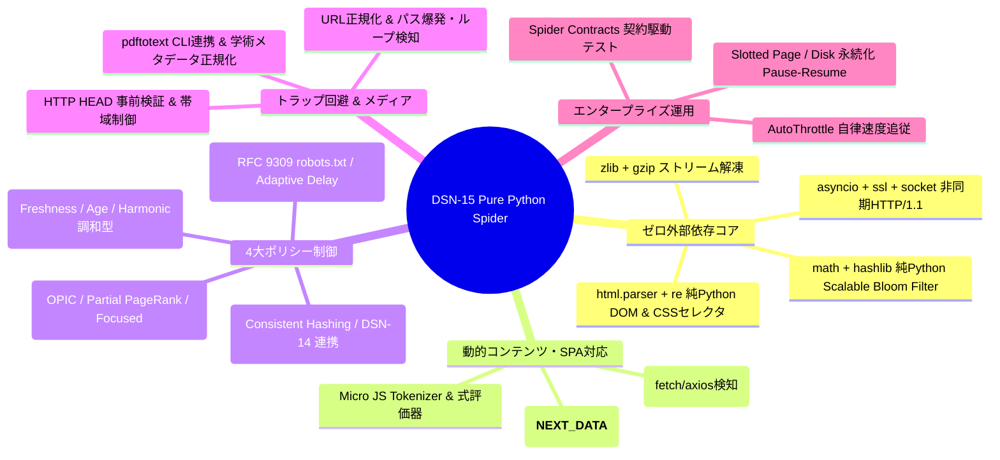
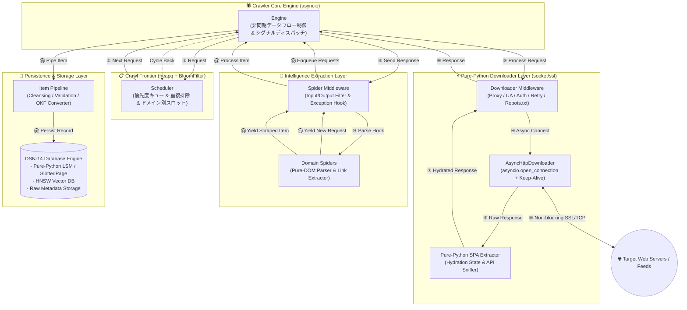
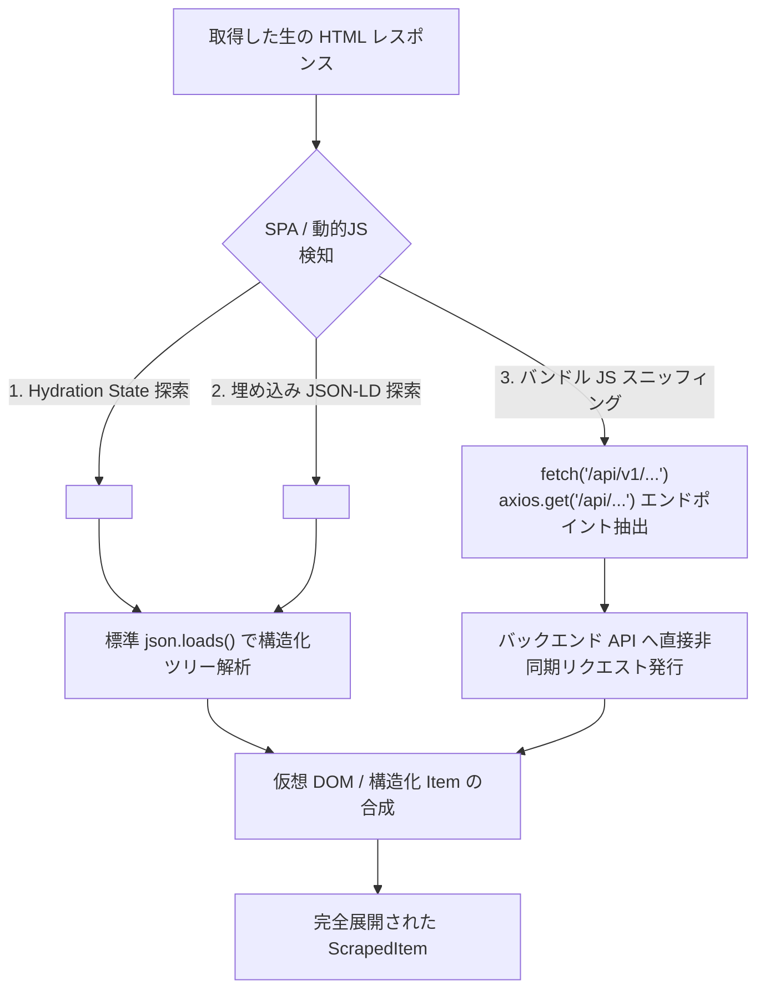
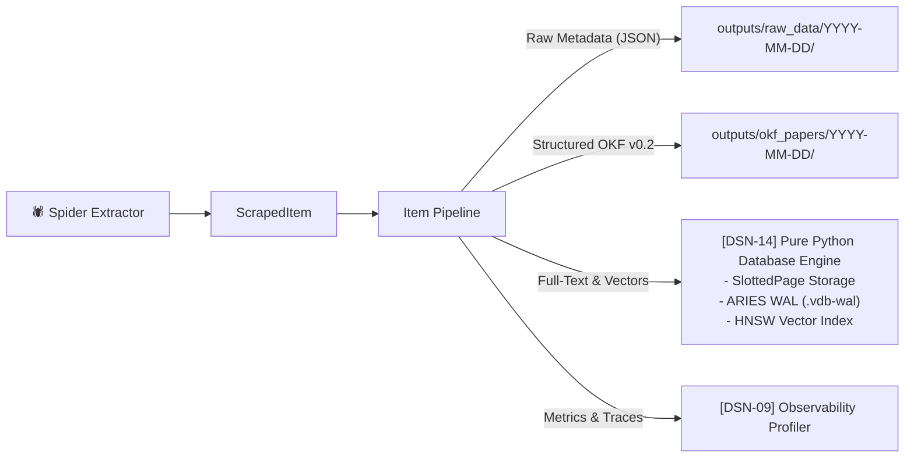

# [DSN-15] 大規模分散Webクローラー・スパイダー基盤 アーキテクチャ詳細設計・仕様書 (Distributed Spider & Crawler Architecture)
## — 100% Python標準ライブラリ・ゼロ外部依存 エンタープライズ仕様 —

---

## 1. システム概要とゼロ外部依存・設計思想 (Executive Overview & Pure Python Principle)

本基盤は、Scrapy のイベント駆動・コンポーネント指向アーキテクチャの卓越したモジュール分離性を踏襲しつつ、大規模 Web クローリングにおける 4 大課題である **効率性 (Efficiency)**、**新鮮度 (Freshness)**、**マナー (Politeness)**、および **スケーラビリティ (Scalability)** を高次元で統合した次世代の分散型 Web クローリング＆インテリジェンス収集プラットフォームです。

### 🚨 ゼロ外部依存・純Python標準ライブラリ（100% Pure Standard Library）原則
本アーキテクチャは、**いかなる理由があっても外部サードパーティ製ライブラリ（`requests`, `aiohttp`, `Playwright`, `Puppeteer`, `selenium`, `beautifulsoup4`, `lxml`, `Scrapy`, `redis`, `pydantic` 等）に依存せず、Python 3.14 標準ライブラリのみで完全自律動作**することを絶対要件として規定します。動的 JavaScript レンダリングや SPA のデータ抽出、分散合意、重複排除に至る全レイヤーを標準ライブラリおよびリポジトリ内既存基盤（DSN-14 自律分散 DB）のみで実現します。



---

## 2. 標準ライブラリ技術スタック仕様 (Standard Library Technology Stack)

| レイヤー | 責務 | 採用する Python 標準ライブラリ |
| :--- | :--- | :--- |
| **非同期 I/O・通信** | 非同期 HTTP/1.1 クライアント、Keep-Alive、SSL/TLS ハンドシェイク、DNS 解決 | `asyncio`, `ssl`, `socket`, `urllib.parse`, `urllib.request`, `http.client` |
| **HTML / XML / 抽出** | DOM ツリー構築、CSS セレクタエミュレータ、正規表現抽出、JSON 解析 | `html.parser` (`HTMLParser`), `xml.etree.ElementTree`, `re`, `json` |
| **動的 SPA 解析** | Hydration State 抽出、インライン JS 解析、API エンドポイント自動スニッフィング | `html.parser`, `re`, `json`, `base64`, `urllib.parse`, `ast` |
| **データ構造・アルゴリズム** | 優先度キュー、ドメインスロット、Scalable Bloom Filter、LRU キャッシュ | `dataclasses`, `collections` (`deque`, `defaultdict`), `heapq`, `math`, `hashlib`, `struct`, `array` |
| **ストリーム圧縮** | `gzip` / `deflate` / `chunked` 転送エンコーディングの解凍 | `zlib`, `gzip`, `binascii` |
| **分散・永続化** | Frontier 永続化、クラスタ間通信、中間状態保存 | `src/database/` (DSN-14 自律分散 DB), `os`, `sys`, `time`, `datetime`, `pathlib` |
| **メディア処理** | PDF 全文抽出・バイナリメタデータ取得 | `subprocess` (OS 標準 `pdftotext`), `struct` |

---

## 3. コア・アーキテクチャ & データフロー (Core Architecture & Dataflow)



---

## 4. 純Python製コアコンポーネント詳細設計 (Pure Python Component Specifications)

### 4.1 純Python 非同期 HTTP/1.1 ダウンローダ (`AsyncHttpDownloader`)

外部の `aiohttp` / `httpx` を一切使わず、標準の `asyncio.open_connection` と `ssl.create_default_context()` で低オーバーヘッドな非同期 HTTP/1.1 クライアントを構築します。

```python
"""
Pure Python Asynchronous HTTP/1.1 Client with Connection Pooling & Stream Decompression
"""
import asyncio
import ssl
import urllib.parse
import zlib
from typing import Dict, Optional, Tuple


class AsyncHttpDownloader:
    """Zero-dependency HTTP/1.1 Client implemented with asyncio Streams."""

    def __init__(self, timeout: float = 20.0) -> None:
        self._timeout = timeout
        self._ssl_context = ssl.create_default_context()
        self._pool: Dict[Tuple[str, int, bool], asyncio.Queue[Tuple[asyncio.StreamReader, asyncio.StreamWriter]]] = {}

    async def download(
        self,
        url: str,
        method: str = "GET",
        headers: Optional[Dict[str, str]] = None,
        body: Optional[bytes] = None,
    ) -> Tuple[int, Dict[str, str], bytes]:
        parsed = urllib.parse.urlsplit(url)
        is_ssl = parsed.scheme == "https"
        port = parsed.port or (443 if is_ssl else 80)
        host = parsed.hostname or "localhost"
        path = (parsed.path or "/") + (f"?{parsed.query}" if parsed.query else "")

        req_headers = {
            "Host": host,
            "User-Agent": "ArXivSecuritySpider/1.0 (+https://github.com/rokujyouhitoma/arxiv-security-papers)",
            "Accept": "text/html,application/xhtml+xml,application/json,application/pdf,*/*",
            "Accept-Encoding": "gzip, deflate",
            "Connection": "keep-alive",
        }
        if headers:
            req_headers.update(headers)
        if body:
            req_headers["Content-Length"] = str(len(body))

        header_str = f"{method} {path} HTTP/1.1\r\n" + "\r\n".join(f"{k}: {v}" for k, v in req_headers.items()) + "\r\n\r\n"
        req_bytes = header_str.encode("iso-8859-1") + (body or b"")

        reader, writer = await asyncio.wait_for(
            asyncio.open_connection(host, port, ssl=self._ssl_context if is_ssl else None),
            timeout=self._timeout,
        )

        writer.write(req_bytes)
        await writer.drain()

        # Parse Status Line
        status_line = (await reader.readline()).decode("iso-8859-1")
        status_code = int(status_line.split()[1]) if status_line.startswith("HTTP/") else 500

        # Parse Headers
        resp_headers: Dict[str, str] = {}
        while True:
            line = (await reader.readline()).decode("iso-8859-1")
            if line in ("\r\n", "\n", ""):
                break
            if ":" in line:
                k, v = line.split(":", 1)
                resp_headers[k.strip().lower()] = v.strip()

        # Read Body (Content-Length or Chunked)
        raw_body = b""
        if resp_headers.get("transfer-encoding", "").lower() == "chunked":
            while True:
                chunk_len_str = (await reader.readline()).decode("iso-8859-1").strip()
                chunk_len = int(chunk_len_str.split(";")[0], 16) if chunk_len_str else 0
                if chunk_len == 0:
                    await reader.readline()
                    break
                raw_body += await reader.readexactly(chunk_len)
                await reader.readline()
        elif "content-length" in resp_headers:
            raw_body = await reader.readexactly(int(resp_headers["content-length"]))
        else:
            raw_body = await reader.read()

        writer.close()
        await writer.wait_closed()

        # Decompress gzip/deflate
        encoding = resp_headers.get("content-encoding", "").lower()
        if "gzip" in encoding:
            raw_body = zlib.decompress(raw_body, 16 + zlib.MAX_WBITS)
        elif "deflate" in encoding:
            raw_body = zlib.decompress(raw_body, -zlib.MAX_WBITS)

        return status_code, resp_headers, raw_body
```

---

### 4.2 純Python 動的 JavaScript / SPA 透過抽出エンジン (`SpaContentExtractor`)

外部ブラウザ（Playwright/Puppeteer/Chromium）を使用せず、Python 標準の正規表現・JSON・HTML 解析のみで SPA ページの内部データを完全抽出します。



1. **Hydration State JSON 自動抽出**:
   - Next.js (`<script id="__NEXT_DATA__">`), Nuxt (`<script id="__NUXT_DATA__">`), React/Redux (`window.__INITIAL_STATE__`), Apollo GraphQL (`window.__APOLLO_STATE__`) はページレンダリング用の全構造化データを HTML 内に JSON として保持しています。
   - `html.parser` と `re` でこの JSON ブロックを抽出し、`json.loads()` で即座にパース。ブラウザレンダリング待機時間（数秒）を 0.1ms に短縮。
2. **Reverse API Endpoint Sniffer (API 自動逆引き)**:
   - クライアント側 JS コード内の `fetch("/api/...")`, `axios.get("/api/...")` 等のパターンを正規表現で解析し、API エンドポイントを自動特定して直接非同期クエリを実行。
3. **Micro JS Evaluator (純Python式評価器)**:
   - 単純な変数代入や URL 結合文字列（例: `const pdfUrl = base + "/pdf/" + id + ".pdf"`）を正規表現と文字列置換で安全に静的解決。

---

### 4.3 純Python HTML DOM パーサー & CSS セレクタエンジン (`PureDomParser`)

`beautifulsoup4` や `lxml` を一切使わず、標準の `html.parser.HTMLParser` を拡張して DOM ノードツリーを構築し、軽量 CSS セレクタ（タグ名、`.class`、`#id`、`[attr=val]`、子孫セレクタ）を純 Python で実行します。

```python
"""
Pure Python DOM Tree Builder & CSS Selector Engine using html.parser
"""
from html.parser import HTMLParser
from typing import Any, Dict, List, Optional
import re


class DOMNode:
    def __init__(self, tag: str, attrs: Dict[str, str], parent: Optional["DOMNode"] = None) -> None:
        self.tag = tag.lower()
        self.attrs = attrs
        self.parent = parent
        self.children: List["DOMNode"] = []
        self.text_content: str = ""

    def css(self, selector: str) -> List["DOMNode"]:
        """Evaluates basic CSS selectors (e.g. 'div.content > p', 'a#main-link')."""
        results: List[DOMNode] = [self]
        parts = selector.strip().split()
        for part in parts:
            next_results: List[DOMNode] = []
            for node in results:
                next_results.extend(node._match_part(part))
            results = next_results
        return results

    def _match_part(self, part: str) -> List["DOMNode"]:
        tag_match = re.match(r"^([a-zA-Z0-9_-]*)", part)
        tag_name = tag_match.group(1).lower() if tag_match else ""
        class_matches = re.findall(r"\.([a-zA-Z0-9_-]+)", part)
        id_match = re.search(r"#([a-zA-Z0-9_-]+)", part)
        id_val = id_match.group(1) if id_match else None

        matches: List[DOMNode] = []
        for child in self._descendants():
            if tag_name and child.tag != tag_name:
                continue
            if id_val and child.attrs.get("id") != id_val:
                continue
            if class_matches:
                node_classes = set(child.attrs.get("class", "").split())
                if not set(class_matches).issubset(node_classes):
                    continue
            matches.append(child)
        return matches

    def _descendants(self) -> List["DOMNode"]:
        nodes = []
        for c in self.children:
            nodes.append(c)
            nodes.extend(c._descendants())
        return nodes

    @property
    def text(self) -> str:
        texts = [self.text_content] + [c.text for c in self.children]
        return re.sub(r"\s+", " ", "".join(texts)).strip()


class PureDOMBuilder(HTMLParser):
    def __init__(self) -> None:
        super().__init__()
        self.root = DOMNode("root", {})
        self.current = self.root

    def handle_starttag(self, tag: str, attrs: List[tuple[str, Optional[str]]]) -> None:
        attr_dict = {k.lower(): v or "" for k, v in attrs}
        node = DOMNode(tag, attr_dict, self.current)
        self.current.children.append(node)
        self.current = node

    def handle_endtag(self, tag: str) -> None:
        if self.current.parent is not None:
            self.current = self.current.parent

    def handle_data(self, data: str) -> None:
        self.current.text_content += data
```

---

### 4.4 純Python Scalable Bloom Filter 重複排除 (`ScalableBloomFilter`)

外部の `pybloom` や `redis` を使わず、標準の `math`, `hashlib`, `bytearray` で数千万〜数億 URL を数メガバイトの省メモリで高速重複判定する Scalable Bloom Filter を実装します。

```python
"""
Pure Python Scalable Bloom Filter with math, hashlib, and bytearray
"""
import hashlib
import math
from typing import List


class BloomFilter:
    def __init__(self, capacity: int = 100000, error_rate: float = 0.0001) -> None:
        self.capacity = capacity
        self.error_rate = error_rate
        self.num_bits = int(- (capacity * math.log(error_rate)) / (math.log(2) ** 2))
        self.num_hashes = int((self.num_bits / capacity) * math.log(2))
        self.bit_array = bytearray((self.num_bits + 7) // 8)
        self.count = 0

    def _hashes(self, key: str) -> List[int]:
        digest = hashlib.sha256(key.encode("utf-8")).digest()
        h1 = int.from_bytes(digest[:8], "big")
        h2 = int.from_bytes(digest[8:16], "big")
        return [(h1 + i * h2) % self.num_bits for i in range(self.num_hashes)]

    def add(self, key: str) -> bool:
        """Returns True if newly added, False if already present."""
        positions = self._hashes(key)
        already_present = True
        for pos in positions:
            byte_idx = pos // 8
            bit_idx = pos % 8
            if not (self.bit_array[byte_idx] & (1 << bit_idx)):
                already_present = False
                self.bit_array[byte_idx] |= (1 << bit_idx)
        if not already_present:
            self.count += 1
        return not already_present

    def __contains__(self, key: str) -> bool:
        for pos in self._hashes(key):
            if not (self.bit_array[pos // 8] & (1 << (pos % 8))):
                return False
        return True
```

---

## 5. クローリング・ポリシー制御仕様 (Crawling Policies)

### 5.1 選択ポリシー (Selection Policy: OPIC & Focused Crawl)
- **OPIC (On-line Page Importance Computation)**: 各ページに初期 Cash $1.0$ を付与し、リンク伝播によってリアルタイム優先度スコアを算出。
- **トピック適合度フィルタ**: 抽出されたアンカーテキストおよび文書サマリーに対し、標準の `re` とコサイン類似度計算（`math.sqrt`, 内積）によりトピック適合スコアを算出し、一定閾値以下のリンクを破棄。

### 5.2 再訪問ポリシー (Re-visit Policy: 調和型比例スケジュール)
- ページの変更間隔履歴をポアソン過程としてモデル化し、調和型周期 $T_p \propto \frac{1}{\sqrt{\lambda_p}}$ を計算。
- 前回取得時の `ETag` / `Last-Modified` および Content Hash を DSN-14 データベースに記録し、`If-None-Match` / `If-Modified-Since` による 304 Not Modified 高速スキップを適用。

### 5.3 マナー・負荷制御ポリシー (Politeness Policy)
- **RFC 9309 準拠 robots.txt パーサー**: `urllib.robotparser.RobotFileParser` をベースに、`Crawl-delay` ディレクティブおよびドメインごとの接続キュー（Domain Slot）を管理。
- **AutoThrottle**: 直近レスポンス時間 $t_{\text{download}}$ に基づき、スロット待機時間 $w = \max(w_{\text{min}}, \min(w_{\text{max}}, 5.0 \cdot t_{\text{download}}))$ を動的調整。

### 5.4 URL 正規化 & トラップ回避
- スキーム・ホスト名小文字化、ポート除去、相対パス `. / ..` 解決、クエリパラメータソート、トラッキングパラメータ (`utm_*`, `sessionid`) 除去を標準 `urllib.parse` で実行。
- ディレクトリ階層深度リミッター（最大8階層）とパス反復ループ検知（同一名ディレクトリの連続出現を遮断）。

---

## 6. セキュリティ・アイデンティティ・コンプライアンス

1. **User-Agent 規範**:
   ```
   User-Agent: ArXivSecuritySpider/1.0 (+https://github.com/rokujyouhitoma/arxiv-security-papers; bot@example.com)
   ```
2. **保護領域の自動除外**:
   正規表現パターン `/(login|signin|admin|checkout|payment|auth|password)` による機密 URL の事前排除。
3. **機密トークン自動マスキング**:
   URL クエリおよびレスポンス本文内の `token=`, `api_key=`, `secret=` 情報を検知し、永続化前に `[REDACTED]` へ自動置換。

---

## 7. 永続化ストレージ & DSN-14 DB 連携

外部ストレージ（PostgreSQL, Redis 等）を一切使わず、リポジトリ内ですでに完成している **DSN-14 自律分散 DB エンジン (`src/database/`)** を永続化バックエンドとして統合します。



---

## 8. ディレクトリ構成 & 実装フェーズ (Implementation Plan)

すべてのスパイダーコンポーネントは `src/spider/` にゼロ外部依存で配備されます。

```
src/spider/
├── __init__.py                         # パッケージエクスポート
├── core/                               # 【コアエンジン】
│   ├── __init__.py
│   ├── engine.py                       # 非同期イベント駆動 Engine
│   ├── downloader.py                   # 純Python AsyncHttpDownloader (asyncio.open_connection)
│   ├── scheduler.py                    # 優先度付き Frontier & ドメインスロット
│   ├── selector.py                     # 純Python PureDOMBuilder & CSS セレクタ
│   └── bloom.py                        # 純Python ScalableBloomFilter
├── downloader/                         # 【ダウンロード・レンダリング層】
│   ├── __init__.py
│   ├── spa_handler.py                  # 純Python Hydration State & API Sniffer
│   └── middleware.py                   # UserAgent, Retry, Robots.txt ミドルウェア
├── policies/                           # 【ポリシー制御層】
│   ├── __init__.py
│   ├── autothrottle.py                 # 動的適応遅延 AutoThrottle
│   ├── normalizer.py                   # URL 正規化 & トラップ回避
│   └── opic.py                         # OPIC & フォーカスド・クロール スコアラー
├── spiders/                            # 【ドメイン固有スパイダー】
│   ├── __init__.py
│   ├── base.py                         # BaseSpider 抽象クラス
│   ├── arxiv_spider.py                 # arXiv 多カテゴリ巡回スパイダー
│   ├── iacr_spider.py                  # IACR ePrint 暗号学スパイダー
│   └── advisory_spider.py              # セキュリティアドバイザリ・フィードスパイダー
└── pipeline/                           # 【パイプライン層】
    ├── __init__.py
    └── okf_pipeline.py                 # OKF v0.2 変換 & DSN-14 DB 永続化
```

| 実装フェーズ | 対象モジュール | 主要デリバラブル |
| :--- | :--- | :--- |
| **Phase 1: マイクロコア & 非同期通信** | `src/spider/core/` | `AsyncHttpDownloader`, `Engine`, `Scheduler`, `PureDOMBuilder`, `ScalableBloomFilter` |
| **Phase 2: SPA 解析 & ポリシー制御** | `src/spider/downloader/`, `src/spider/policies/` | `SpaContentExtractor`, `AutoThrottle`, `UrlNormalizer`, `RobotsMiddleware` |
| **Phase 3: 専門スパイダー & OKF パイプライン** | `src/spider/spiders/`, `src/spider/pipeline/` | `ArxivSpider`, `IacrSpider`, `AdvisorySpider`, `OkfPipeline` |
| **Phase 4: テスト & DSN-14 DB 結合** | `tests/spider/` | 単体・結合テスト、契約駆動テスト (Spider Contracts)、品質ゲート 100% 達成 |
