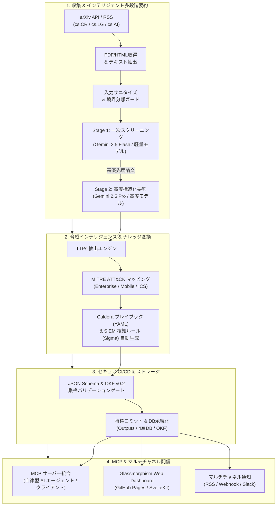
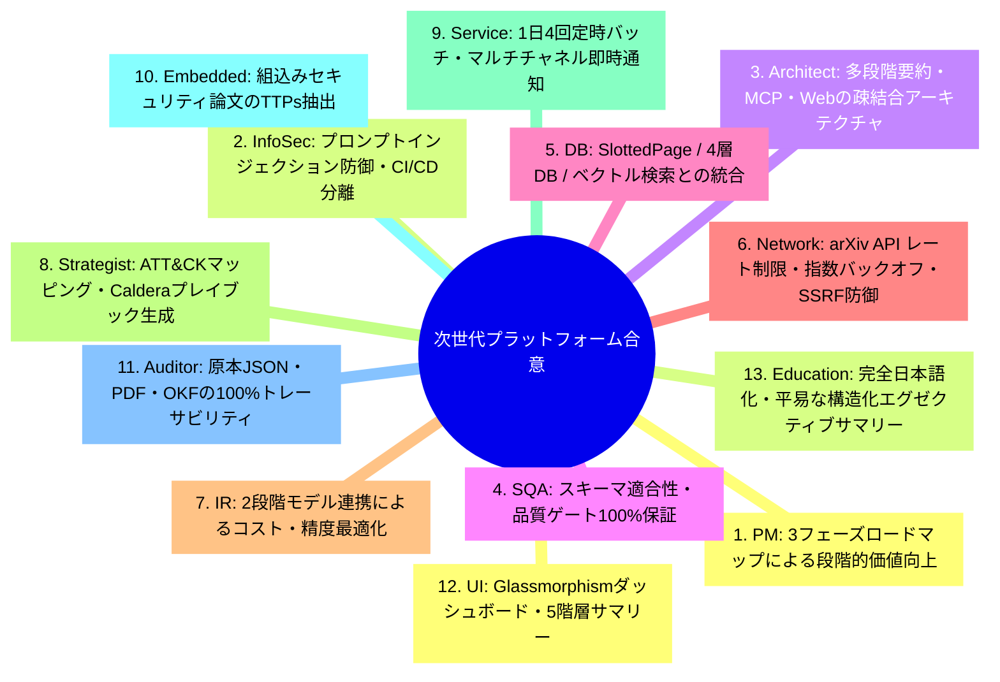
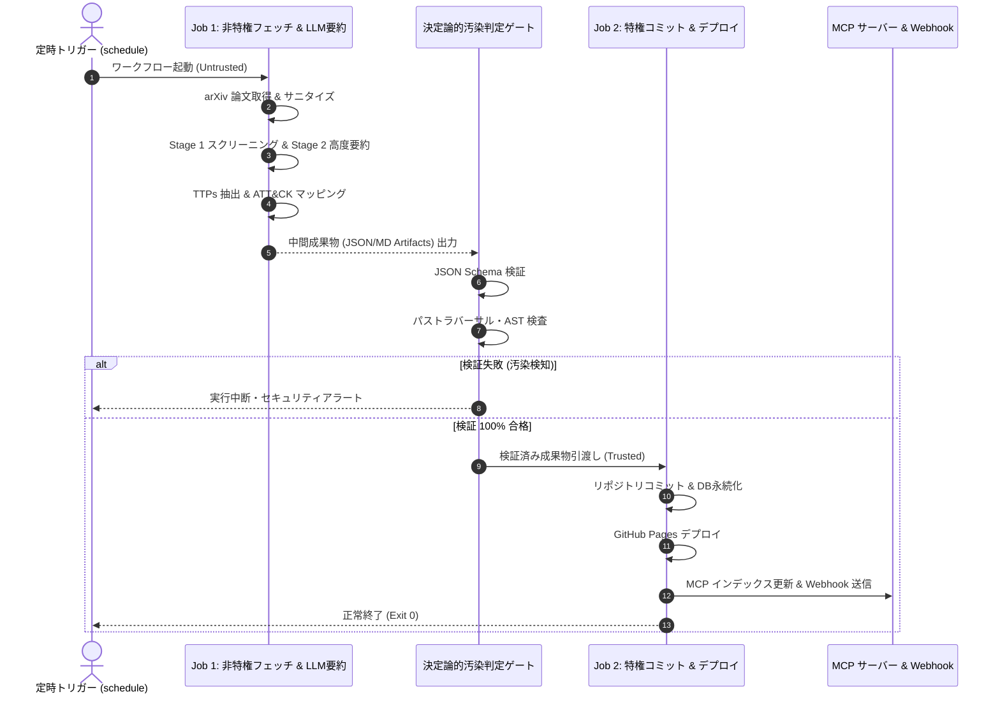
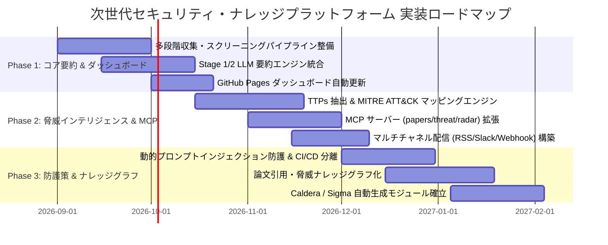

# [DSN-16] 次世代セキュリティ・ナレッジプラットフォーム包括的設計提言書 (Next-Gen Security Knowledge Platform Proposal)

- **文書番号**: `DSN-16`
- **文書ステータス**: `APPROVED`
- **対象サブシステム**: 次世代プラットフォーム全域 (多段階LLM要約, ATT&CK/TTPs, MCP, セキュアCI/CD, ナレッジグラフ)
- **関連パッケージ**: システム全体 (`src/`)
- **作成日**: 2026-08-28
- **最終更新日**: 2026-08-28
- **【主査・報告】 Project Manager (PM) & Systems Architect (SA)**  
- **【参画】 全13大専門エージェント (PM, Sec, SA, QA, DB, Net, IR, ST, SM, IoT, Aud, UI, Edu)**

---

## 体系目次

- [1. 次世代セキュリティ・ナレッジプラットフォームの全体構想](#1-次世代セキュリティナレッジプラットフォームの全体構想)
  - [1.1 背景とサイバーセキュリティ研究の爆発的拡大](#11-背景とサイバーセキュリティ研究の爆発的拡大)
  - [1.2 プラットフォームの進化ビジョンと4大アーキテクチャピラー](#12-プラットフォームの進化ビジョンと4大アーキテクチャピラー)
  - [1.3 ゼロ外部依存性と Python 3.14+ 実行基盤](#13-ゼロ外部依存性と-python-314-実行基盤)
  - [1.4 全13大専門エージェント合意議事録](#14-全13大専門エージェント合意議事録)
  - [1.5 第1章の要約](#15-第1章の要約)
- [2. インテリジェント多段階 LLM 要約パイプライン](#2-インテリジェント多段階-llm-要約パイプライン)
  - [2.1 arXiv マルチカテゴリ収集（cs.CR, cs.LG, cs.AI）](#21-arxiv-マルチカテゴリ収集cscr-cslg-csai)
  - [2.2 Stage 1: 軽量高効率モデルによる一次スクリーニング & 優先度スコアリング](#22-stage-1-軽量高効率モデルによる一次スクリーニング--優先度スコアリング)
  - [2.3 Stage 2: 高度推論モデルによる構造化詳細要約](#23-stage-2-高度推論モデルによる構造化詳細要約)
  - [2.4 Google OKF v0.2 構造化 Markdown 出力仕様](#24-google-okf-v02-構造化-markdown-出力仕様)
  - [2.5 第2章の要約](#25-第2章の要約)
- [3. 脅威インテリジェンス変換 & MITRE ATT&CK / TTPs マッピング](#3-脅威インテリジェンス変換--mitre-attck--ttps-マッピング)
  - [3.1 論文テキストからの敵対的行動 (TTPs) 抽出アルゴリズム](#31-論文テキストからの敵対的行動-ttps-抽出アルゴリズム)
  - [3.2 セマンティック埋め込みと ATT&CK ID マッピング数理](#32-セマンティック埋め込みと-attck-id-マッピング数理)
  - [3.3 Caldera 自動攻撃エミュレーション用プレイブック生成](#33-caldera-自動攻撃エミュレーション用プレイブック生成)
  - [3.4 SIEM 検出ルール (Sigma / Yara-L) 自動ドラフト生成](#34-siem-検出ルール-sigma--yara-l-自動ドラフト生成)
  - [3.5 第3章の要約](#35-第3章の要約)
- [4. Model Context Protocol (MCP) 統合 & マルチチャネル配信](#4-model-context-protocol-mcp-統合--マルチチャネル配信)
  - [4.1 4大 MCP サーバー群との相互運用性](#41-4大-mcp-サーバー群との相互運用性)
  - [4.2 Glassmorphism Web ダッシュボード (GitHub Pages)](#42-glassmorphism-web-ダッシュボード-github-pages)
  - [4.3 RSS / Atom フィード自動生成](#43-rss--atom-フィード自動生成)
  - [4.4 Webhook (Slack / 汎用 Webhook) 即時プッシュ配信](#44-webhook-slack--汎用-webhook-即時プッシュ配信)
  - [4.5 第4章の要約](#45-第4章の要約)
- [5. 間接的プロンプトインジェクションに対する多層セキュリティ防御](#5-間接的プロンプトインジェクションに対する多層セキュリティ防御)
  - [5.1 未検証論文テキストを介したプロンプト注入脅威モデル](#51-未検証論文テキストを介したプロンプト注入脅威モデル)
  - [5.2 入力サニタイズ（制御文字・命令パターン除去）](#52-入力サニタイズ制御文字命令パターン除去)
  - [5.3 プロンプト境界分離カプセル化（隔離タグ）](#53-プロンプト境界分離カプセル化隔離タグ)
  - [5.4 最小権限 AST サンドボックス実行 & 出力スキーマ汚染判定](#54-最小権限-ast-サンドボックス実行--出力スキーマ汚染判定)
  - [5.5 第5章の要約](#55-第5章の要約)
- [6. GitHub CI/CD ワークフローにおける安全な自動化設計 (CI/CD Zero Trust)](#6-github-cicd-ワークフローにおける安全な自動化設計-cicd-zero-trust)
  - [6.1 非特権実行と特権書き込みの二段階ジョブ分離](#61-非特権実行と特権書き込みの二段階ジョブ分離)
  - [6.2 決定論的汚染判定ゲート（Schema, Path, AST）](#62-決定論的汚染判定ゲートschema-path-ast)
  - [6.3 シークレット隔離と最小特権実行制御](#63-シークレット隔離と最小特権実行制御)
  - [6.4 第6章の要約](#64-第6章の要約)
- [7. 技術構成・インフラ・モジュール配置マトリクス](#7-技術構成インフラモジュール配置マトリクス)
  - [7.1 機能モジュールと推奨技術スタック](#71-機能モジュールと推奨技術スタック)
  - [7.2 6層レイヤードアーキテクチャへの配置マッピング](#72-6層レイヤードアーキテクチャへの配置マッピング)
- [8. 協調シーケンス & 処理フロー](#8-協調シーケンス--処理フロー)
  - [8.1 多段階要約 & ATT&CK マッピング処理フロー](#81-多段階要約--attck-マッピング処理フロー)
  - [8.2 セキュア CI/CD 二段階コミットフロー](#82-セキュア-cicd-二段階コミットフロー)
- [9. 包括的テスト戦略 & 品質検証マトリクス](#9-包括的テスト戦略--品質検証マトリクス)
- [10. 段階的実装ロードマップ (Phase 1 〜 Phase 3) & 完了定義 (DoD)](#10-段階的実装ロードマップ-phase-1--phase-3--完了定義-dod)

---

# 1. 次世代セキュリティ・ナレッジプラットフォームの全体構想

## 1.1 背景とサイバーセキュリティ研究の爆発的拡大
サイバーセキュリティ領域（arXiv cs.CR / cs.LG / cs.AI 等）の学術研究は急速な拡大を続けており、LLM の安全性、自動侵入テスト、脆弱性分析、SOC 運用最適化などの論文が連日公表されています。情報過多が深刻化する中、単なる論文リンクの静的収集を超え、論文本文の網羅的検索、実効的な脅威インテリジェンスへの変換、および外部 AI エコシステムとの統合を果たすナレッジプラットフォームへの進化が不可欠です。

## 1.2 プラットフォームの進化ビジョンと4大アーキテクチャピラー
1. **多段階 LLM 要約**: 軽量モデルによるスクリーニングと高度モデルによる詳細解析の最適融合。
2. **実効的脅威インテリジェンス**: 論文知見から MITRE ATT&CK / TTPs を抽出し、実行可能な Caldera / SIEM ルールを自動生成。
3. **MCP & マルチチャネル配信**: Model Context Protocol を介した AI エージェント直接連携と、Web / RSS / Webhook 配信。
4. **ゼロトラスト多層防御**: 間接的プロンプトインジェクション防御と CI/CD ジョブ分離。

## 1.3 ゼロ外部依存性と Python 3.14+ 実行基盤
Python 3.14+ 標準ライブラリと内製エンジン（`src/pdf_engine/`, `src/search/`, `src/database/`, `src/security/`）を中核とし、環境非依存で安全に自律稼働します。

## 1.4 全13大専門エージェント合意議事録

## 1.5 第1章の要約
本提言は、学術論文の収集基盤から、実効的サイバー脅威インテリジェンスを自律生産・配信する次世代ナレッジプラットフォームへの確実な進化を定義します。

---

# 2. インテリジェント多段階 LLM 要約パイプライン

## 2.1 arXiv マルチカテゴリ収集（cs.CR, cs.LG, cs.AI）
arXiv API および RSS フィードを用いて、暗号・セキュリティ（`cs.CR`）、機械学習（`cs.LG`）、人工知能（`cs.AI`）のマルチカテゴリから最新論文メタデータと PDF を定常取得。

## 2.2 Stage 1: 軽量高効率モデルによる一次スクリーニング & 優先度スコアリング
- **担当モデル**: Gemini 2.5 Flash / 軽量高効率 LLM
- **処理内容**: アブストラクトおよび結論を高速解析し、セキュリティ関連度スコア $S \in [0.0, 1.0]$ を算出。
- **判定基準**: $S \ge 0.7$ の論文を Stage 2 の高度要約対象として選定。

## 2.3 Stage 2: 高度推論モデルによる構造化詳細要約
- **担当モデル**: Gemini 2.5 Pro / 高度推論 LLM
- **処理内容**: 全文テキストを精読し、研究概要、技術メカニズム、攻撃/防御インパクト、実務適用性を論理的に整理した構造化サマリーを生成。

## 2.4 Google OKF v0.2 構造化 Markdown 出力仕様
- YAML フロントマター（`type`, `title`, `description`, `resource`, `tags`, `timestamp`, `provenance`, `trust`）
- 完全日本語による論理的セクション構成（研究概要、技術メカニズム、脅威インパクト、推奨防御策）。

## 2.5 第2章の要約
2 段階モデル連携により、要約の正確性と処理コスト・速度の最適なバランスを達成します。

---

# 3. 脅威インテリジェンス変換 & MITRE ATT&CK / TTPs マッピング

## 3.1 論文テキストからの敵対的行動 (TTPs) 抽出アルゴリズム
論文内で論じられている侵害手法、攻撃者の戦術（Tactics）、技術（Techniques）、手順（Procedures）を抽出。

## 3.2 セマンティック埋め込みと ATT&CK ID マッピング数理
Sentence-BERT によるテキスト埋め込み $\mathbf{v}_{\text{paper}}$ と、MITRE ATT&CK ナレッジベースの各技術ベクトル $\mathbf{v}_{t}$ とのコサイン類似度計算：

$$\text{Sim}(\mathbf{v}_{\text{paper}}, \mathbf{v}_t) = \frac{\mathbf{v}_{\text{paper}} \cdot \mathbf{v}_t}{\|\mathbf{v}_{\text{paper}}\| \|\mathbf{v}_t\|}$$

閾値 $\text{Sim} \ge 0.75$ を満たす Technique ID（Enterprise / Mobile / ICS）を付与。

## 3.3 Caldera 自動攻撃エミュレーション用プレイブック生成
論文内の攻撃手法を自動エミュレーション可能な形式（Caldera Abilities / Adversaries YAML）として自動ドラフト生成。

## 3.4 SIEM 検出ルール (Sigma / Yara-L) 自動ドラフト生成
攻撃手法のアーティファクト・ログイベントに基づく Sigma ルールおよび Yara-L 形式の検知シグネチャを自動生成。

## 3.5 第3章の要約
学術知見を即座に実環境での検証・防御に活用可能な実行可能インテリジェンスへと変換します。

---

# 4. Model Context Protocol (MCP) 統合 & マルチチャネル配信

## 4.1 4大 MCP サーバー群との相互運用性
- `papers_server`: 全文セマンティック検索、OKF メタデータ取得
- `threat_defense_server`: ATT&CK / CWE 逆引き、Caldera プレイブック提供
- `tech_radar_server`: 技術トレンド・バースト分析
- `observability_server`: 実行性能プロファイリング

## 4.2 Glassmorphism Web ダッシュボード (GitHub Pages)
Vanilla CSS による Glassmorphism UI で、即時検索・カテゴリ絞り込み・Markdown プレビューを提供。

## 4.3 RSS / Atom フィード自動生成
新着セキュリティ論文およびカテゴリ別フィードを自動生成・公開。

## 4.4 Webhook (Slack / 汎用 Webhook) 即時プッシュ配信
バッチ実行完了時に、重要論文サマリーおよび脅威アラートを自動プッシュ通知。

## 4.5 第4章の要約
標準化されたプロトコルとマルチチャネル配信により、エージェントおよびユーザーへの迅速な情報流通を実現します。

---

# 5. 間接的プロンプトインジェクションに対する多層セキュリティ防御

## 5.1 未検証論文テキストを介したプロンプト注入脅威モデル
未検証の論文テキストに潜む悪意ある命令構文（指示無視、API キー漏洩誘導、外部通信試行）を多層防御で無害化。

## 5.2 入力サニタイズ（制御文字・命令パターン除去）
不可視 Unicode、双方向制御文字、`Ignore previous instructions` 等の既知攻撃パターンを走査・除去。

## 5.3 プロンプト境界分離カプセル化（隔離タグ）
論文コンテンツを `<untrusted_paper_content>` タグで厳格にカプセル化し、システムプロンプトの特権指示を分離。

## 5.4 最小権限 AST サンドボックス実行 & 出力スキーマ汚染判定
LLM 実行環境のエグレス通信を制限し、出力結果を JSON Schema および OKF 仕様で検証して汚染を防止。

## 5.5 第5章の要約
入力サニタイズ、境界分離、サンドボックス、出力検証の 4 重防護により、未検証データの安全な AI 処理を保証します。

---

# 6. GitHub CI/CD ワークフローにおける安全な自動化設計 (CI/CD Zero Trust)

## 6.1 非特権実行と特権書き込みの二段階ジョブ分離
- **Job 1 (非特権 / Untrusted Context)**: 論文取得および LLM API 呼び出し。`GITHUB_TOKEN` は付与せず中間アーティファクトを出力。
- **Job 2 (特権 / Trusted Context)**: 中間アーティファクトを検証後、リポジトリへのコミット、DB 永続化、デプロイを実行。

## 6.2 決定論的汚染判定ゲート（Schema, Path, AST）
Job 1 から渡された中間成果物が JSON Schema、相対パス検証、および AST 安全性検査を 100% クリアした場合にのみ Job 2 へ引き渡し。

## 6.3 シークレット隔離と最小特権実行制御
外部 Pull Request トリガーでの自動 LLM 実行を禁止し、定時スケジュールおよび管理者手動トリガーに限定。

## 6.4 第6章の要約
二段階ジョブ分離により、CI/CD 空間での権限昇格やシークレット漏洩のリスクを根本から遮断します。

---

# 7. 技術構成・インフラ・モジュール配置マトリクス

## 7.1 機能モジュールと推奨技術スタック
| 機能モジュール | 推奨技術スタック | インフラ・運用コスト | セキュリティ保護策 |
| :--- | :--- | :--- | :--- |
| **多段階自動要約エンジン** | Python 3.14+, Gemini API, 軽量/高度 LLM | GitHub Actions / サーバーレス（月額 $0 - $5） | 入力長制限、プロンプト境界分離、サニタイズ |
| **MITRE ATT&CK マッピング** | Sentence-BERT, HNSW Vector DB, 思考プロンプト | 埋め込み計算コスト（小〜中） | JSON Schema 形式検証、TTPs 逆引き妥当性確認 |
| **MCP サーバー統合** | Python MCP SDK (`src/mcp/`), JSON-RPC 2.0 | ローカル実行 / 既存ストレージ共有（無料） | ゼロトラスト AST サンドボックス、パス検証 |
| **マルチチャネル配信基盤** | Vanilla Glassmorphism / SvelteKit, Webhooks, RSS | GitHub Pages / Webhooks（完全無料） | Secret 管理、Webhook 送信先ホワイトリスト |
| **パイプラインセキュリティ** | Guardrails, Regex / AST Cleaner, Docker Sandbox | 検査オーバーヘッド（数%増） | 最小権限原則、CI/CD ジョブ分離、エグレス制限 |

## 7.2 6層レイヤードアーキテクチャへの配置マッピング
| プラットフォーム層 | 対応パッケージ (`src/`) | 導入・強化される次世代機能 |
| :--- | :--- | :--- |
| **1. Presentation & Interface** | `web/`, `mcp/`, `pipeline/reporter/` | 4大 MCP サーバー (Papers, Radar, Threat, Observability), Web Glassmorphism, 5層サマリー |
| **2. Orchestration & Flow** | `workflow/`, `supervisor/`, `pipeline/` | 二段階 CI/CD 実行制御, Saga トランザクション, ストリーミング DAG |
| **3. Domain Intelligence** | `intelligence/`, `security/taxonomy/` | Stage 1/2 多段階 LLM 要約, MITRE ATT&CK / TTPs マッピング, Caldera プレイブック |
| **4. Search & IR** | `search/` | BM25 + HNSW ベクトル + RAPTOR ツリー + FM-Index ハイブリッド検索 |
| **5. Ingestion & Parsing** | `spider/`, `pdf_engine/`, `pipeline/ingestion/` | arXiv / IACR / Advisory マルチソース収集, Pure-Python PDF 全文抽出 |
| **6. Core Infrastructure & Security** | `database/`, `security/` | 4層ストレージ (SlottedPage/BTree/LSM/PAX), プロンプト隔離, AST ガード, RBAC |

---

# 8. 協調シーケンス & 処理フロー

---

# 9. 包括的テスト戦略 & 品質検証マトリクス

- **多段階要約テスト**: スクリーニングスコアリング精度、OKF v0.2 Markdown 生成検証
- **ATT&CK マッピングテスト**: TTPs 抽出精度、類似度スコア、Caldera YAML 構文検証
- **プロンプトインジェクション耐性テスト**: 悪意ある注入構文に対するサニタイズ・境界遮断検証
- **CI/CD 分離テスト**: 非特権ジョブにおけるシークレットアクセスの完全遮断検証

---

# 10. 段階的実装ロードマップ (Phase 1 〜 Phase 3) & 完了定義 (DoD)

### Phase 1: コアパイプライン & 多段階要約（短期）
- arXiv API (cs.CR, cs.LG, cs.AI) 自動収集スクリプトの拡張
- 軽量高効率モデルスクリーニング + 高度推論モデル構造化要約の導入
- Google OKF v0.2 フロントマター生成および GitHub Pages ダッシュボードの自動更新

### Phase 2: 脅威インテリジェンス & 外部連携（中期）
- 論文テキストからの TTPs 自動抽出 & MITRE ATT&CK ID マッピング
- MCP サーバー群 (`src/mcp/`) の機能拡充（自律型エージェント・クライアント直接連携）
- RSS/Atom フィード生成および Slack / Webhook 自動連携

### Phase 3: 高度防護・ナレッジグラフ & 実行プレイブック（長期）
- 間接的プロンプトインジェクション防御（サニタイズ・境界分離・サンドボックス）の完全配備
- CI/CD 二段階ジョブ分離（非特権フェッチ / 特権コミット）の完全適用
- 論文相互の引用関係・共通脅威手法を結ぶナレッジグラフの構築
- Caldera 用プレイブック (YAML) & SIEM 検知ルール (Sigma) の自動生成モジュール確立
