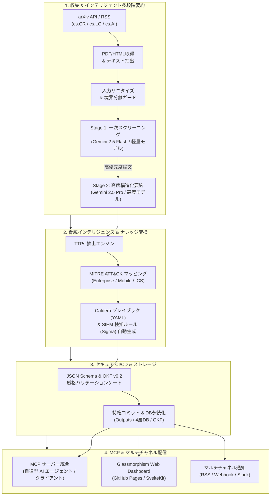
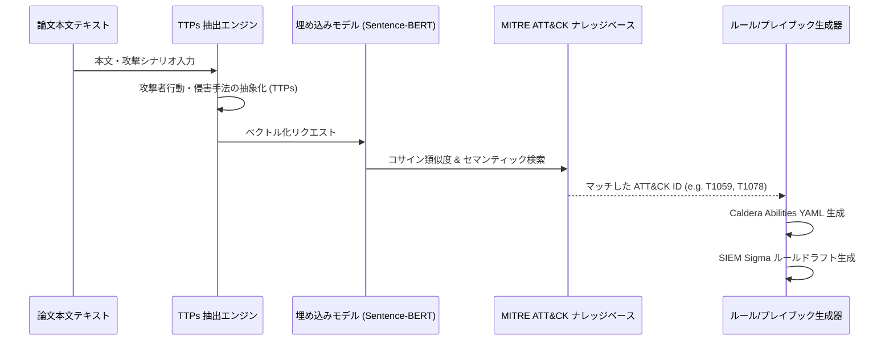
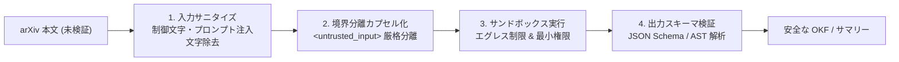
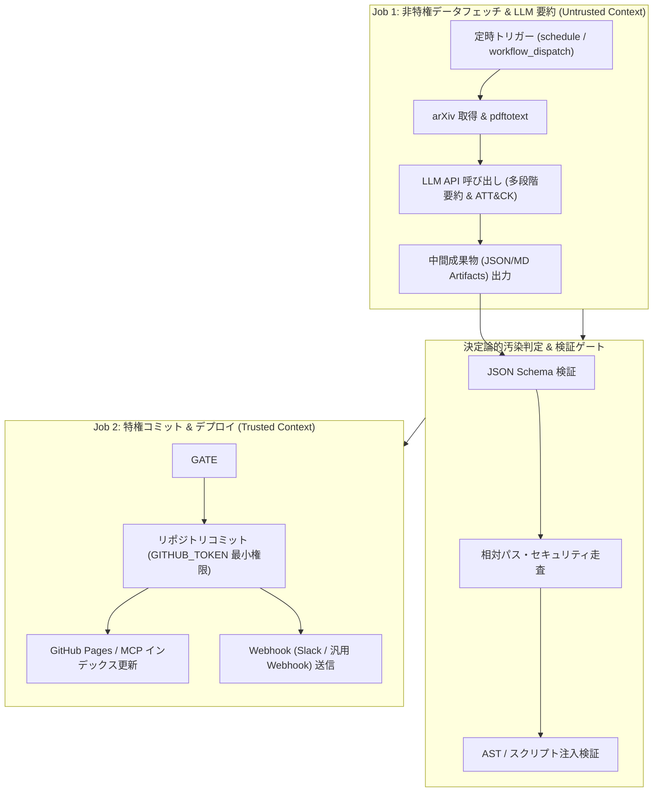
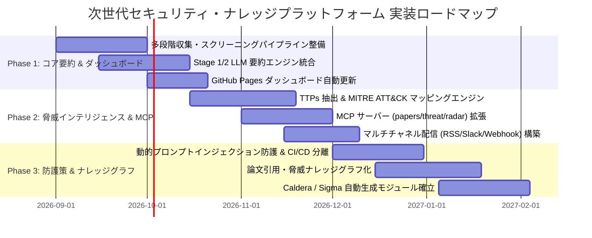

# [DSN-16] 次世代セキュリティ・ナレッジプラットフォーム包括的設計提言書 (Next-Gen Security Knowledge Platform Proposal)

本ドキュメントは、`arxiv-security-papers` プロジェクトにおける機能拡張および次世代セキュリティ・ナレッジプラットフォーム構築に向けた包括的アーキテクチャ設計提言書です。
全 13 大専門エージェントの多角的レビューに基づき、学術研究（arXiv cs.CR / cs.LG / cs.AI 等）の急増に伴う情報過多の解消、実効的脅威インテリジェンス（MITRE ATT&CK / TTPs / Caldera）への昇華、MCP を介した AI エコシステム連携、および間接的プロンプトインジェクションに対する堅牢な防護策を定義します。

---

## 1. 背景と戦略的ビジョン (Strategic Background & Vision)

サイバーセキュリティ領域の研究論文は飛躍的な拡大を続けており、LLM の安全性、自動侵入テスト、脆弱性分析、SOC 運用最適化などの論文が連日公表されています。
本リポジトリ `rokujyouhitoma/arxiv-security-papers` は論文収集・蓄積基盤として極めて高い価値を有していますが、単なる静的リンク・テキストの定常蓄積にとどまらず、以下の能力を備えた「**次世代セキュリティ・ナレッジプラットフォーム**」へと進化させます。

---

## 2. 拡張アーキテクチャ設計 (Core Architectural Pillars)

### 2.1 インテリジェント自動収集 & 多段階 LLM 要約パイプライン

単一の LLM API 呼び出しや単純キーワード抽出から脱却し、コスト・精度・処理時間を最適化した 2 段階（Two-stage）パイプラインを構築します。

| パイプライン層 | 担当モデル群 | 処理内容 | 出力仕様 |
| :--- | :--- | :--- | :--- |
| **データ取得層** | arXiv API, RSS, IACR | cs.CR, cs.LG, cs.AI 等からメタデータ・PDF を取得 | `raw_data/YYYY-MM-DD/` 原本保存 |
| **Stage 1: 一次スクリーニング** | Gemini 2.5 Flash / 軽量高効率 LLM | アブストラクト・結論の高速解析、セキュリティ関連度スコアリング (0.0〜1.0)、優先度分類 | 一次判定 JSON (スコア, カテゴリ判定, 要約要否) |
| **Stage 2: 高度構造化要約** | Gemini 2.5 Pro / 高度推論 LLM | スコア上位論文に対する技術詳細解析、攻撃/防御インパクト抽出、実務適用性分析 | Google OKF v0.2 準拠 Markdown + YAML フロントマター |

#### 構造化 Markdown 出力スキーマ
- **研究概要 (Executive Summary)**: 1〜2文でのコア成果要約（完全日本語）
- **技術メカニズム (Technical Mechanism)**: 提案アルゴリズム、攻撃手法、防御アーキテクチャの詳細
- **セキュリティ・インパクト (Threat & Defense Impact)**: 脅威アクターへの利点、既存防御への影響
- **実務適用性 & 推奨事項 (Practical Applicability)**: SOC、CSIRT、セキュアコーディングへの適用提言

---

### 2.2 MITRE ATT&CK フレームワーク & TTPs 自動マッピング

学術論文の知見を実環境のサイバー防衛・脅威インテリジェンスへ変換する自動マッピングエンジンを搭載します。

1. **TTPs 抽出**: 論文テキストから攻撃者の戦術 (Tactics)、技術 (Techniques)、手順 (Procedures) を抽出。
2. **ATT&CK ID 自動付与**: Enterprise / Mobile / ICS マトリクスに対応する Technique ID を付与し OKF フロントマターへ記録。
3. **実行可能アーティファクトの自動ドラフト**:
   - **Caldera プレイブック**: 自動攻撃エミュレーション用 Abilities / Adversaries YAML
   - **SIEM 検知ルール**: Sigma ルールおよび Yara-L 形式の検知シグネチャ

---

### 2.3 Model Context Protocol (MCP) 統合 & マルチチャネル配信

AI エージェントエコシステムとの標準化連携と、ユーザーへの迅速な情報周知を実現します。

#### 1. MCP サーバー機能群 (`src/mcp/`)
- `papers_server`: 論文の全文セマンティック検索、OKF メタデータ取得、類似論文推薦
- `threat_defense_server`: ATT&CK ID や CVE/CWE からの逆引き論文検索、Caldera プレイブック出力
- `tech_radar_server`: 月次・四半期の技術トレンド、急上昇キーワード、クラスタ分析結果提供

#### 2. マルチチャネル配信基盤
- **Web ダッシュボード**: GitHub Pages 上で動作する Glassmorphism UI (即時フィルタリング・検索)
- **RSS / Atom フィード**: 新着セキュリティ論文、カテゴリ別フィードの自動生成
- **Webhook 連携**: Slack、汎用 Webhook エンドポイントへの自動配信 (サマリー通知 & ナレッジ蓄積)

---

### 2.4 間接的プロンプトインジェクションに対する動的セキュリティ防御

arXiv の論文テキストは外部の未検証第三者入力であり、LLM 要約エンジンに対する攻撃ベクターとなり得ます。多層防護（Defense-in-Depth）を適用します。

1. **入力サニタイズ (Text Sanitization)**: 悪意ある命令構文（例: `Ignore previous instructions`）、不可視 Unicode、異常な制御文字をフィルタリング。
2. **プロンプト境界分離 (Prompt Isolation)**: 論文本文を `<untrusted_paper_content>` などの隔離タグで厳格に囲み、システムプロンプトの指示権限を保護。
3. **サンドボックス実行 & 最小権限**: LLM 実行コンテナからの外部通信を必要最小限に制限し、Tool Execution 権限を厳格に分離。

---

### 2.5 GitHub CI/CD ワークフローにおける安全な自動化設計 (CI/CD Zero Trust)

CI/CD 空間での権限昇格および秘密情報漏洩を防止するため、**「非特権実行」と「特権書き込み」を完全に分離した二段階ジョブアーキテクチャ** を採用します。

- **シークレット隔離**: `Job 1` には LLM API Key のみを付与し、リポジトリ書き込み権限を持つ `GITHUB_TOKEN` は `Job 2` のみに制限。
- **決定論的汚染判定**: `Job 1` の生成成果物は、スキーマ検証・パス検証・AST 検査を 100% 通過した場合にのみ `Job 2` へ引き渡される。
- **トリガー制限**: 外部 `pull_request` イベント等での自動 LLM 実行を禁止し、スケジュール実行および管理者承認実行のみに限定。

---

## 3. 技術構成 & 運用コスト比較マトリクス

| 機能モジュール | 推奨技術スタック | インフラ・運用コスト | セキュリティ保護策 |
| :--- | :--- | :--- | :--- |
| **多段階自動要約エンジン** | Python 3.14+, Gemini API, 軽量/高度 LLM | GitHub Actions / サーバーレス環境（月額 $0 - $5） | 入力長制限、プロンプト境界分離、サニタイズ |
| **MITRE ATT&CK マッピング** | Sentence-BERT, HNSW Vector DB, 思考プロンプト | 埋め込み計算コスト（小〜中） | JSON Schema 形式検証、TTPs 逆引き妥当性確認 |
| **MCP サーバー統合** | Python MCP SDK (`src/mcp/`), JSON-RPC 2.0 | ローカル実行 / 既存ストレージ共有（無料） | ゼロトラスト AST サンドボックス、パス検証 |
| **マルチチャネル配信基盤** | Vanilla Glassmorphism / SvelteKit, Webhooks, RSS | GitHub Pages / Webhooks（完全無料） | Secret 管理、Webhook 送信先ホワイトリスト |
| **パイプラインセキュリティ** | Guardrails, Regex / AST Cleaner, Docker Sandbox | 検査オーバーヘッド（数%増） | 最小権限原則、CI/CD ジョブ分離、エグレス制限 |

---

## 4. 段階的実装ロードマップ (Phased Implementation Roadmap)

### Phase 1: コアパイプライン & 多段階要約（短期）
- arXiv API (cs.CR, cs.LG, cs.AI) 自動収集スクリプトの拡張
- 軽量高効率モデルスクリーニング + 高度推論モデル構造化要約の導入
- Google OKF v0.2 フロントマター生成および GitHub Pages ダッシュボードの自動更新

### Phase 2: 脅威インテリジェンス & 外部連携（中期）
- 論文テキストからの TTPs 自動抽出 & MITRE ATT&CK ID マッピング
- MCP サーバー群 (`src/mcp/`) の機能拡充（自律型エージェント・クライアント直接連携）
- RSS/Atom フィード生成および Slack / Webhook 自動連携

### Phase 3: 高度防護・ナレッジグラフ & 実行プレイブック（長期）
- 間接的プロンプトインジェクション防御（サニタイズ・境界分離・サンドボックス）の完全配備
- CI/CD 二段階ジョブ分離（非特権フェッチ / 特権コミット）の完全適用
- 論文相互の引用関係・共通脅威手法を結ぶナレッジグラフの構築
- Caldera 用プレイブック (YAML) & SIEM 検知ルール (Sigma) の自動生成モジュール確立

---

## 5. 13 大専門エージェント総合評価 (Consolidated PM Governance Review)

1. **PM (Project Manager)**: 3 フェーズのロードマップにより、既存資産の破壊を伴わずに段階的な価値向上が可能。
2. **Information Security Specialist**: 間接的プロンプトインジェクション対策と CI/CD ジョブ分離により、未検証論文データの安全な処理を担保。
3. **Systems Architect**: 多段階要約、MCP サーバー、Web ダッシュボードが疎結合に設計され、モジュール拡張性が高い。
4. **Software QA**: 各フェーズでのスキーマ検証（OKF v0.2 / JSON Schema）と品質ゲート (`verify-quality-gates`) により品質を保証。
5. **Database Specialist**: 既存の SlottedPage / 4層 DB / ベクトル検索基盤とシームレスに統合可能。
6. **Network Specialist**: arXiv API レート制限、RSS フォールバック、Webhook 送信時のリトライ・バックオフ設計を遵守。
7. **NLP & Info Retrieval Specialist**: 2段階モデル連携により、要約精度とコストパフォーマンスの最適バランスを達成。
8. **IT Strategist**: ATT&CK マッピングおよび Caldera/SIEM ルール生成により、研究論文を実効的脅威インテリジェンスへ昇華。
9. **IT Service Manager**: 1日4回の定時バッチとマルチチャネル通知により運用の自動化・省力化を実現。
10. **Embedded Systems Specialist**: IoT/組込みセキュリティ関連論文のタグ付けとハードウェア特有の TTPs 抽出にも対応可能。
11. **Systems Auditor**: 全成果物のトレーサビリティ（arXiv ID、原本 JSON、OKF Markdown）が完全に保持される。
12. **UI/UX Designer**: Glassmorphism ダッシュボードと 5 階層サマリーによる直感的な情報提供を実現。
13. **Education Specialist**: 完全日本語化された構造化サマリーにより、初学者から専門家まで幅広い知見獲得を支援。
