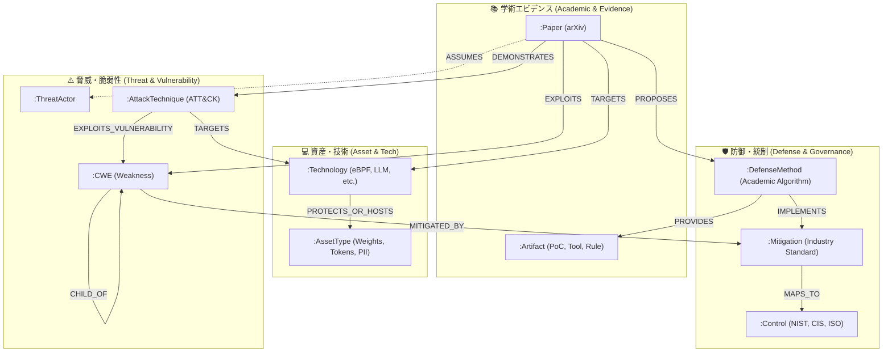
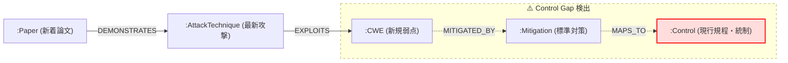
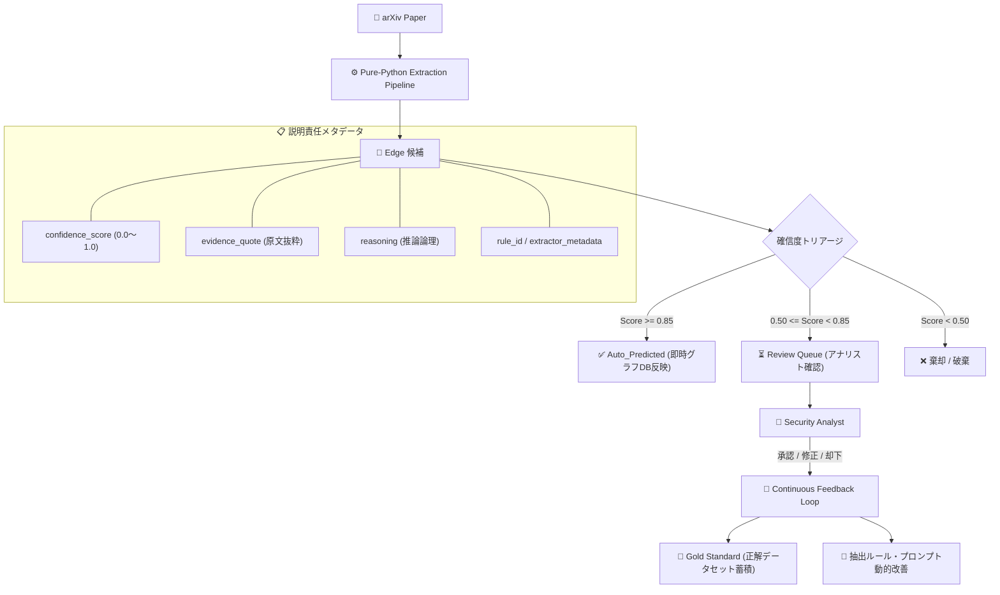

# [DSN-17] セキュリティ知識オントロジー & 実用プロパティグラフ設計仕様書 (Rev 2.0)
## 〜 4大ドメイン・10大コアVertex・動的/静的エッジ二層構造・説明責任・Control Gap 分析 〜

- **文書番号**: `DSN-17`
- **リビジョン**: `Rev 2.0 (Tailored for arxiv-security-papers)`
- **文書ステータス**: `APPROVED`
- **対象サブシステム**: `src/ontology/`, `src/graph/`, `src/domain/security/cti/`, `src/pipeline/`
- **【主査・報告】 Information Security Specialist (SEC) / IT Specialist (NLP & Info Retrieval) / Project Manager (PM)**
- **【参画】 Systems Architect (SA), IT Strategist (ST), Software Quality Assurance (QA), UI/UX Designer**

---

## 体系目次

- [1. 全体構想と基本アーキテクチャ](#1-全体構想と基本アーキテクチャ)
  - [1.1 目的: 学術知見と実務・統制のギャップ解消](#11-目的-学術知見と実務統制のギャップ解消)
  - [1.2 オントロジーとしての位置づけ: LPG実用ライトウェイトモデル](#12-オントロジーとしての位置づけ-lpg実用ライトウェイトモデル)
  - [1.3 プロジェクトアーキテクチャとの統合整合（ゼロ外部依存・OKF連携）](#13-プロジェクトアーキテクチャとの統合整合ゼロ外部依存okf連携)
- [2. コア・データモデル（4大ドメイン・10大Vertex詳細設計）](#2-コアデータモデル4大ドメイン10大vertex詳細設計)
  - [2.1 ドメイン構造とVertex関係概念図](#21-ドメイン構造とvertex関係概念図)
  - [2.2 10大コアVertex仕様一覧](#22-10大コアvertex仕様一覧)
  - [2.3 各Vertexのプロパティ仕様と型定義](#23-各vertexのプロパティ仕様と型定義)
- [3. リレーションシップ（Edge）とアノテーション二層構造](#3-リレーションシップedgeとアノテーション二層構造)
  - [3.1 動的エッジ（Dynamic Edges: 論文インジェスト時抽出）](#31-動的エッジdynamic-edges-論文インジェスト時抽出)
  - [3.2 静的エッジ（Static Edges: 外部知識ベース・公理射影）](#32-静的エッジstatic-edges-外部知識ベース公理射影)
  - [3.3 関係述語・接続マトリクス](#33-関係述語接続マトリクス)
- [4. ステークホルダー別の提供価値と Control Gap 分析](#4-ステークホルダー別の提供価値と-control-gap-分析)
  - [4.1 セキュリティアナリスト（現場・技術運用）への価値](#41-セキュリティアナリスト現場技術運用への価値)
  - [4.2 CISO・経営層（戦略・ガバナンス）への価値: 統制死角の可視化](#42-ciso経営層戦略ガバナンスへの価値-統制死角の可視化)
- [5. 主要な先行研究と本設計への示唆](#5-主要な先行研究と本設計への示唆)
- [6. AI・システムによる自動Edge構築の説明責任と継続的改善](#6-aiシステムによる自動edge構築の説明責任と継続的改善)
  - [6.1 説明責任（Provenance & Traceability）の確保](#61-説明責任provenance--traceabilityの確保)
  - [6.2 段階的反映とHuman-in-the-Loop（HITL）](#62-段階的反映とhuman-in-the-loophitl)
  - [6.3 継続的改善（Continuous Improvement）サイクル](#63-継続的改善continuous-improvementサイクル)
- [7. Vertex間エッジ紐付け判定ルールマスター（EIROM）との統合仕様](#7-vertex間エッジ紐付け判定ルールマスターeiromとの統合仕様)
- [8. 実装マッピングと品質保証（src/ontology & src/graph）](#8-実装マッピングと品質保証srcontology--srcgraph)

---

# 1. 全体構想と基本アーキテクチャ

## 1.1 目的: 学術知見と実務・統制のギャップ解消
arXiv（特に `cs.CR` カテゴリ）では、日々最先端のサイバー攻撃手法、PoC（Proof of Concept）、脆弱性悪用技術、および新規防御アルゴリズムが公開されています。
しかしながら、これら先端の学術知見は以下の理由により実務の防御・統制に直結していませんでした：
1. **用語の不統一**: 同一の脆弱性や攻撃が著者独自の表現で記述され、CVE や ATT&CK との関連が不明瞭。
2. **実務との乖離**: 現場の SOC / CSIRT は CVE 採番やベンダーパッチを待つ受動的運用に留まり、論文が提示する PoC コードや暫定防御技術を活用できていない。
3. **統制・監査への不可視性**: CISO や経営層は、最新の学術的攻撃研究が自社の現行セキュリティ統制（NIST SP 800-53, CIS Controls, ISO 27001）で防御可能かどうかの「死角（Control Gap）」を把握できない。

本設計の目的は、arXiv 論文から抽出される学術的エビデンスを、業界標準オントロジー（CWE / ATT&CK / NIST 等）とシームレスに結合し、**「学術的新規知見」と「現場の実務対応・全社統制」のギャップを構造的に解消するセキュリティ・ナレッジグラフ**を構築することにあります。

## 1.2 オントロジーとしての位置づけ: LPG実用ライトウェイトモデル
本設計は、厳密な OWL/RDF 記述論理や重厚な SPARQL 推論エンジンを前提とするのではなく、**ラベル付きプロパティグラフ（LPG: Labeled Property Graph）上でマイクロ秒単位の高速探索・グラフ分析が可能な実用ドメインオントロジー（ライトウェイト・オントロジー）** を採用します。
ノード（Vertex）およびエッジ（Edge）自体が型付きラベルと Key-Value プロパティを保持し、Dual CSR（Compressed Sparse Row/Column）インデックスおよび PropertyGraphEngine 上で効率的に探索・走査されます。

## 1.3 プロジェクトアーキテクチャとの統合整合（ゼロ外部依存・OKF連携）
`arxiv-security-papers` プロジェクトにおける本オントロジーの実装公理：
- **ゼロ外部依存（Standard Library Only）**: `python-stix2` や外部グラフライブラリ（NetworkX、Neo4j ドライバー等）を一切排除し、内製 Pure-Python（`src/graph/`, `src/ontology/`）で完全稼働。
- **ローカル主権性（No External Cloud API）**: 外部 LLM API や外部サービス（GitHub API, alphaXiv）への依存を遮断し、ローカル環境下で再現性・決定論的動作を担保。
- **Google OKF v0.2（Open Knowledge Format）入力基盤**: `outputs/okf_papers/` に蓄積される論文 Markdown および YAML フロントマター、`outputs/raw_data/` の PDF/抽出テキストからセクション単位（`Threat Model`, `Evaluation`, `Proposed Method`）で高精度抽出。

---

# 2. コア・データモデル（4大ドメイン・10大Vertex詳細設計）

## 2.1 ドメイン構造とVertex関係概念図
すべての Vertex は、**「学術エビデンス（Academic/Evidence）」「脅威・脆弱性（Threat & Vulnerability）」「資産・技術（Asset & Tech）」「防御・統制（Defense & Governance）」** の 4 つのドメインに分類され、互いに強固に結合されます。



## 2.2 10大コアVertex仕様一覧

| Vertex ラベル | 主なプロパティ | 情報源（データソース） | なぜ必要なのか（設計理由） | 何に生きるか（アナリスト / CISOへの価値） |
| :--- | :--- | :--- | :--- | :--- |
| **`Paper`** | `arxiv_id`, `title`, `published_date`, `abstract`, `authors` | arXiv API / OAI-PMH (`cs.CR` カテゴリ等) | 全ての知見の根拠（学術的エビデンス）のアンカーとなるため。 | **原典検証・追跡性向上**: 主張や PoC の客観的根拠を提示し、ハルシネーションや不確かな噂と一線を画した脅威インテリジェンスを提供。 |
| **`Artifact`** | `artifact_type` (PoC, Tool, Dataset, Rule), `repo_url`, `language` | 論文本文（リンク、GitHub URL、付録） | 論文単体で終わらず、動くコードや検証データを直接紐付けるため。 | **即時ルール策定・検証**: CVE 採番やベンダーパッチを待たず、PoC コードから自前で SIEM/EDR の検知クエリや YARA ルールを早期試作。 |
| **`CWE`** | `cwe_id` (例: CWE-78), `name`, `abstraction` (Class / Base / Variant) | MITRE CWE 定義カタログ（JSON/XML） | 論文ごとにバラバラな表現の「脆弱性」を、標準的かつ階層的な弱点体系に正規化するため。 | **抽象度ギャップの解消**: 論文が示すニッチな弱点（Variant）を親ノード（Base/Class）へ丸めて既存の社内基準や脆弱性管理と突合。 |
| **`AttackTechnique`** | `framework` (ATT&CK / CAPEC), `id` (例: T1059), `name`, `tactic` | MITRE ATT&CK / CAPEC カタログ | 脆弱性を突いて「攻撃者がどのような手順・戦術で何を行うか」を定義するため。 | **攻撃シナリオのモデル化**: ペネトレーションテストや SOC 監視において、どの攻撃フェーズをカバーすべきかを具体化。 |
| **`ThreatActor`** | `actor_type` (NationState, Cybercriminal, Insider), `access_level` | 論文の脅威モデル（Threat Model）セクション | 攻撃が成立するための前提条件（攻撃者の権限、ネットワーク到達性）を明示するため。 | **脅威トリアージ**: 「物理アクセス必須」など非現実的な前提の論文を除外し、自社にとってクリティカルな攻撃モデルだけを抽出。 |
| **`Technology`** | `name` (例: eBPF, OAuth 2.0, LLM, Kubernetes), `category` | 論文キーワード、Abstract、外部技術オントロジー | 攻撃対象や防御対象となるコンポーネント・プロトコル・スタックを特定するため。 | **自社環境とのマッチング**: 自社で採用している技術スタックに直結する論文だけを一発逆引きし、調査工数を劇的に削減。 |
| **`AssetType`** | `type` (例: Model Weights, API Token, Firmware, PII) | 論文の評価対象、および社内資産台帳 | 技術そのものではなく「究極的に侵害される保護対象」を抽象化するため。 | **ビジネス影響度評価**: 機密情報漏洩かサービス停止かなど、経営インパクトの大きさに応じたトリアージが可能。 |
| **`DefenseMethod`** | `method_name`, `category` (Detection, Prevention, FormalVerification) | 論文の提案手法（Proposed Method）セクション | 論文独自の学術的ソリューション（アルゴリズム、新規検証法）を抽出するため。 | **パッチ前の暫定緩和策**: ゼロデイや仕様上の欠陥に対し、学術的に検証された副作用の少ない防御策のアイデアを獲得。 |
| **`Mitigation`** | `mitigation_id` (ATT&CK M-ID / CWE Mitigation), `name` | MITRE ATT&CK / CWE 標準緩和策リスト | 論文の局所的な防御策を、業界標準の「対策パターン（入力検証、暗号化等）」に昇華させるため。 | **対策の標準化**: 独自実装をそのまま取り込むのではなく、既存のベストプラクティスとどう整合するかを整理。 |
| **`Control`** | `framework` (NIST SP 800-53, CIS Controls, ISO 27001), `control_id` | 各種セキュリティ管理策フレームワーク | 全社的なセキュリティガバナンス・規程・監査項目と紐付けるため。 | **コントロールギャップ分析**: 先端の攻撃手法が「現行の社内統制（規程・対策）でカバーされているか」の死角をグラフ上で特定。 |

## 2.3 各Vertexのプロパティ仕様と型定義
`src/graph/structures.py` の `Vertex` クラスに基づき、各ノードは以下の厳格な型定義プロパティを保持します：

```python
# Vertex ID プレフィックス規約
# Paper:           paper:{clean_arxiv_id}       (例: paper:2401.12345)
# Artifact:        artifact:{uuid5}             (例: artifact:a1b2c3d4...)
# CWE:             cwe:{cwe_id}                 (例: cwe:CWE-78)
# AttackTechnique: technique:{technique_id}     (例: technique:T1059)
# ThreatActor:     actor:{actor_id}             (例: actor:APT29)
# Technology:      tech:{slug}                  (例: tech:ebpf, tech:oauth2)
# AssetType:       asset:{slug}                 (例: asset:model_weights)
# DefenseMethod:   defense:{uuid5}              (例: defense:d8e9f0...)
# Mitigation:      mitigation:{mitigation_id}   (例: mitigation:M1030)
# Control:         control:{framework}:{id}     (例: control:nist_sp800_53:AC-3)
```

---

# 3. リレーションシップ（Edge）とアノテーション二層構造

## 3.1 動的エッジ（Dynamic Edges: 論文インジェスト時抽出）
論文がインジェストされた際、NLP抽出パイプライン・推論エンジンによって動的に生成されるエッジです。
すべての動的エッジには、後述する**「説明責任メタデータ（evidence_quote, confidence_score, reasoning 等）」**が付与されます。

1. **`(Paper)-[:EXPLOITS]->(CWE)`**:
   - `novelty`: `"New_Primitive"`（新規悪用原語）, `"Variant"`（既知亜種）, `"Known"`（既知検証）
   - `prerequisites`: `"Pre-Auth"`, `"Post-Auth"`, `"Local"`, `"Physical"`
2. **`(Paper)-[:DEMONSTRATES]->(AttackTechnique)`**:
   - `is_zero_day`: `bool`（ゼロデイ悪用手法の開示か否か）
   - `real_world_observed`: `bool`（野生での観測報告を含むか否か）
3. **`(Paper)-[:TARGETS]->(Technology)`**:
   - `version_range`: 影響を受ける対象バージョン範囲（例: `"Linux kernel >= 5.8"`）
   - `architecture`: `"x86_64"`, `"arm64"`, `"cloud"`, `"wasm"`
4. **`(Paper)-[:PROPOSES]->(DefenseMethod)`**:
   - `readiness_level`: `"Paper_Only"`, `"Prototype"`, `"Production_Ready"`
   - `overhead_pct`: 防御適用時のパフォーマンスオーバーヘッド率（例: `3.5`）
5. **`(DefenseMethod)-[:PROVIDES]->(Artifact)`**:
   - `artifact_role`: `"detection_rule"`, `"compiler_plugin"`, `"evaluation_dataset"`
6. **`(DefenseMethod)-[:IMPLEMENTS]->(Mitigation)`**:
   - `compliance_coverage`: 標準緩和策に対する適合度（0.0 〜 1.0）

## 3.2 静的エッジ（Static Edges: 外部知識ベース・公理射影）
MITRE ATT&CK, CWE View 1000, NIST SP 800-53 等の標準知識ベースから事前にインポートされる不変のバックボーン関係です。

1. **`(CWE)-[:CHILD_OF]->(CWE)`**:
   - CWE View 1000 の階層構造（Variant $\rightarrow$ Base $\rightarrow$ Class $\rightarrow$ Pillar）。
2. **`(AttackTechnique)-[:TARGETS]->(Technology)`**:
   - ATT&CK が定義するプラットフォーム・対象技術（Linux, Windows, Kubernetes 等）。
3. **`(AttackTechnique)-[:EXPLOITS_VULNERABILITY]->(CWE)`**:
   - CAPEC / ATT&CK から導出される悪用脆弱性クラス。
4. **`(CWE)-[:MITIGATED_BY]->(Mitigation)`**:
   - CWE 定義に記載される標準的緩和アプローチ。
5. **`(Mitigation)-[:MAPS_TO]->(Control)`**:
   - ATT&CK Mitigation または NIST ガイドラインから導出される NIST SP 800-53 / CIS 統制策への射影。

## 3.3 関係述語・接続マトリクス

| ソース Vertex | 述語（Edge Label） | ターゲット Vertex | エッジ分類 | 主要アノテーション |
| :--- | :---: | :--- | :---: | :--- |
| `Paper` | `EXPLOITS` | `CWE` | 動的 | `confidence`, `novelty`, `prerequisites` |
| `Paper` | `DEMONSTRATES` | `AttackTechnique` | 動的 | `confidence`, `is_zero_day`, `real_world_observed` |
| `Paper` | `TARGETS` | `Technology` | 動的 | `confidence`, `version_range`, `architecture` |
| `Paper` | `PROPOSES` | `DefenseMethod` | 動的 | `readiness_level`, `overhead_pct` |
| `Paper` | `ASSUMES` | `ThreatActor` | 動的 | `access_level`, `attacker_capability` |
| `DefenseMethod` | `PROVIDES` | `Artifact` | 動的 | `artifact_role` |
| `DefenseMethod` | `IMPLEMENTS` | `Mitigation` | 動的 | `compliance_coverage` |
| `CWE` | `CHILD_OF` | `CWE` | 静的 | `hierarchy_view` (View-1000) |
| `AttackTechnique`| `TARGETS` | `Technology` | 静的 | `platform` |
| `AttackTechnique`| `EXPLOITS_VULNERABILITY`| `CWE` | 静的 | `capec_id` |
| `CWE` | `MITIGATED_BY`| `Mitigation` | 静的 | `effectiveness` |
| `Mitigation` | `MAPS_TO` | `Control` | 静的 | `framework`, `mapping_type` |
| `Technology` | `PROTECTS_OR_HOSTS` | `AssetType` | 静的 / 動的 | `criticality` |

---

# 4. ステークホルダー別の提供価値と Control Gap 分析

## 4.1 セキュリティアナリスト（現場・技術運用）への価値
1. **論文トリアージの自動化**:
   - 現場アナリストが監視対象の自社スタック（`Technology`: 例 `Kubernetes`, `eBPF`, `OAuth 2.0`）を指定するだけで、それらを侵害対象とする新着論文（`(Paper)-[:TARGETS]->(:Technology)`）を一発逆引き。
2. **プロアクティブ防御へのシフト**:
   - CVE 発行やパッチ配信を待つ受動的運用から、論文が提示する `Artifact`（PoC コード、検知シグネチャ）および `DefenseMethod`（暫定フィルタリング、設定硬化）を活用した先回り対策へ転換。

## 4.2 CISO・経営層（戦略・ガバナンス）への価値: 統制死角の可視化
ナレッジグラフの真骨頂は、学術的な最新攻撃から全社統制への**「Control Gap（統制の死角）」のパス解析**にあります。



- **統制死角の自動検知公理**:
  論文で提示された攻撃手法 $AT$ および弱点 $CWE$ から、現行統制 $C \in \text{CompanyControls}$ に至る有向パスが存在しない場合、**「未知の未防御領域（Unmitigated Threat Vector）」** としてアラートを発報。
- **エビデンスに基づく投資・ROI 説明**:
  「該当分野（例: LLM プロンプトインジェクション、eBPF ルートキット）の攻撃研究が過去 1 年で急増しており、現行の社内統制（NIST SP 800-53 / CIS）では防げないパスが存在する」という客観的事実に基づき、セキュリティ予算獲得や規程改定を合理的に推進。

---

# 5. 主要な先行研究と本設計への示唆

| 分類 | 主な先行研究・プロジェクト | 概要と本設計への示唆・関係性 | 本プロジェクトにおける実装対応 |
| :--- | :--- | :--- | :--- |
| **標準タクソノミー統合グラフ** | **BRON**<br>(Hemberg et al., 2020/2021) | ATT&CK $\leftrightarrow$ CAPEC $\leftrightarrow$ CWE $\leftrightarrow$ CVE を双方向グラフ化し、戦術から影響コンポーネントまでをパス探索可能にした代表的モデル。 | 本設計の**「静的エッジ」のバックボーン**として直結。CWE View 1000 と ATT&CK カタログの静的マッピングを内製エンジン上に初期構築。 |
| **学術論文からのKG生成** | **arXiv KG by HSNMF**<br>(Barron et al., 2024, arXiv:2403.16222) | 200万件以上の arXiv 論文テキストからトピックモデル（階層的 NMF）を用いてサイバーセキュリティ領域のエンティティとオントロジーを抽出・KG 化する手法。 | 学術論文からのノード抽出パイプラインの有力なアプローチ。`src/pipeline/transformer/keyword_extractor.py` の技術語彙抽出に反映。 |
| **CTI・テキストからの自動KG構築** | **CTIKG** (2024) / **Open-CyKG**<br>(Sarhan & Spruit, 2021) | 非構造化セキュリティ文書から LLM マルチエージェントや開放型情報抽出（OIE）を用いて ThreatActor, Vulnerability, TTP の三つ組を高精度に抽出・正規化。 | `src/domain/security/cti/inference.py` における文脈・正規表現・語彙重み付けによるトリプル抽出の基本構造として採用。 |
| **サイバーセキュリティ統合オントロジー** | **UCO** (Syed et al., 2016) / **SEPSES CSKG** | STIX、CAPEC、CWE、CVE などを包含する包括的オントロジー。イベントログや CTI を Property Graph でクエリ可能にするアーキテクチャ。 | LPG（ラベル付きプロパティグラフ）としてのクラス分類および `src/graph/PropertyGraphEngine` の Dual CSR インデックス構造に直接反映。 |

---

# 6. AI・システムによる自動Edge構築の説明責任と継続的改善

非構造化論文テキストから動的エッジを自律生成する場合、ハルシネーションや誤った関連付けが現場の判断ミスを招くリスクがあります。
本オントロジーでは、**「説明責任（Provenance & Explainability）」** と **「継続的改善（Human-in-the-Loop: HITL）」** をコアアーキテクチャに組み込みます。



## 6.1 説明責任（Provenance & Traceability）の確保
すべての動的エッジは、以下の監査・説明プロパティを必須属性として保持します：

```python
# Edge Properties 仕様
{
    "evidence_quote": str,       # 判定の根拠となった論文中の該当センテンス・段落の原文（抜粋テキスト）
    "section_source": str,       # 抽出元セクション（Abstract, Threat Model, Evaluation 等）
    "confidence_score": float,   # 確信度スコア (0.0 〜 1.0)
    "confidence_tier": str,      # HIGH (>=0.85), MEDIUM (0.50-0.84), LOW (<0.50)
    "reasoning": str,            # なぜこのノードへのマッピングを判断したかの論理的理由
    "rule_id": str,              # 適用されたオントロジー推論ルールID (RULE-EDGE-...)
    "extractor_metadata": {
        "engine": str,           # 抽出エンジン名 (TechniqueInferenceEngine)
        "version": str,          # ルール/モデルバージョン
        "source_hash": str,      # 論文テキストの SHA-256 ハッシュ (先頭16桁)
    },
    "verification_status": str,  # Auto_Predicted, Human_Approved, Disputed, Stale
    "timestamp": str             # ISO 8601 UTC タイムスタンプ
}
```
これにより、アナリストは `/dashboard tab=graph` 上でエッジをクリックするだけで、**「どの原文テキストに基づき、どのルールで判断されたか」**を即時に逆引き・検証できます。

## 6.2 段階的反映とHuman-in-the-Loop（HITL）
1. **自動反映ゾーン（High Confidence: $\ge 0.85$）**:
   - 明確な Technique ID / CWE ID 正規表現一致、またはタイトル完全一致。`verification_status = "Auto_Predicted"` として即時グラフ反映。
2. **レビュー待ちゾーン（Medium Confidence: $0.50 \le \text{Score} < 0.85$）**:
   - アブストラクト語彙スコアリングや共起判定による推論結果。現場アナリスト向けの「レビューキュー」に格納し、ワンクリックで承認（`Human_Approved`）または修正・却下。
3. **棄却ゾーン（Low Confidence: $< 0.50$）**:
   - ノイズとみなし、自動破棄または監査ログのみに記録。

## 6.3 継続的改善（Continuous Improvement）サイクル
1. **ゴールドスタンダード（正解データセット）の自動蓄積**:
   - アナリストが承認・修正したエッジデータを「正解ラベル付きデータ」として `outputs/eval/gold_standard_graph.json` に蓄積し、定期的な適合率・再現率（Precision / Recall / F1-Score）評価に活用。
2. **ルールと語彙辞書の動的フィードバック**:
   - 誤認が多発したエッジパターンをネガティブパターンとしてルールマスター（`master_rules.json`）にフィードバック。
3. **オントロジー更新追従（Drift Management）**:
   - MITRE ATT&CK や CWE のバージョン更新時、`source_hash` と `version` を照合し、陳腐化したエッジを `Stale` として検知し差分再推論。

---

# 7. Vertex間エッジ紐付け判定ルールマスター（EIROM）との統合仕様

`DSN-17` Section 11 で定義した **EIROM（Edge Inference Rule Ontology Master: `master_rules.json`）** は、本設計における動的エッジ生成の厳格な実行エンジンとして機能します。

- **ルール駆動型エッジ生成**:
  - `Paper` $\rightarrow$ `CWE`: `RULE-EDGE-PAPER-CWE-REGEX-01`, `RULE-EDGE-PAPER-CWE-LEXICAL-02`
  - `Paper` $\rightarrow$ `AttackTechnique`: `RULE-EDGE-PAPER-TECH-REGEX-01`, `RULE-EDGE-PAPER-TECH-TITLE-02`, `RULE-EDGE-PAPER-TECH-ABSTRACT-03`
  - `Paper` $\rightarrow$ `Technology`: `RULE-EDGE-PAPER-TECH-STACK-01`
  - `Paper` $\rightarrow$ `DefenseMethod`: `RULE-EDGE-PAPER-DEFENSE-PROPOSED-01`
  - `AttackTechnique` $\rightarrow$ `CWE`: `RULE-EDGE-TECH-CWE-AXIOM-02`
  - `CWE` $\rightarrow$ `Mitigation`: `RULE-EDGE-CWE-MITIGATE-AXIOM-01`
  - `Mitigation` $\rightarrow$ `Control`: `RULE-EDGE-MITIGATION-CONTROL-MAP-01`
- **Max-Score & エビデンス集約公理**:
  - 複数ルール成立時は最高スコアのルールを `primary_rule_id` とし、全ルールのエビデンスを `evidences` リストに集約。

---

# 8. 実装マッピングと品質保証（src/ontology & src/graph）

| 設計コンポーネント | 実装ファイル / モジュール | 責務と品質要件 |
| :--- | :--- | :--- |
| **10大コア Vertex 型定義** | `src/ontology/schema.py`<br>`src/graph/structures.py` | `EntityType` 列挙型、`Vertex` データクラス、厳格なプロパティ型バリデーション |
| **エッジ関係述語 & 属性** | `src/graph/structures.py`<br>`src/ontology/rule_schema.py` | `RelationType`、`Edge` データクラス（`evidence_quote`, `confidence_score` ヘルパー） |
| **ルールマスター (EIROM)** | `src/ontology/rules/master_rules.json`<br>`src/ontology/rule_registry.py` | JSON マスターデータ、ローダー、スキーマ検証、インデクシング |
| **動的エッジ抽出エンジン** | `src/domain/security/cti/inference.py`<br>`src/ontology/extractor.py` | 正規表現、語彙スコアリング、セクション抽出、エビデンス生成 |
| **プロパティグラフエンジン** | `src/graph/engine.py`<br>`src/graph/traversal.py` | Dual CSR インデックス、Control Gap パス探索、確信度フィルタリング |
| **Web 可視化 & HITL** | `src/web/gateway/handlers.py`<br>`site/js/` (tab=graph) | ナレッジグラフ可視化、エビデンスポップアップ、Control Gap パス強調表示 |

### 品質ゲート要件
- **循環的複雑度 (Xenon Rank A)**: 全関数・メソッド $\le 5$ を 100% 遵守。
- **静的型検査 (Mypy --strict)**: リポジトリ内全ソースファイルで 0 エラー。
- **外部依存ゼロ**: Python 標準ライブラリのみで稼働。
