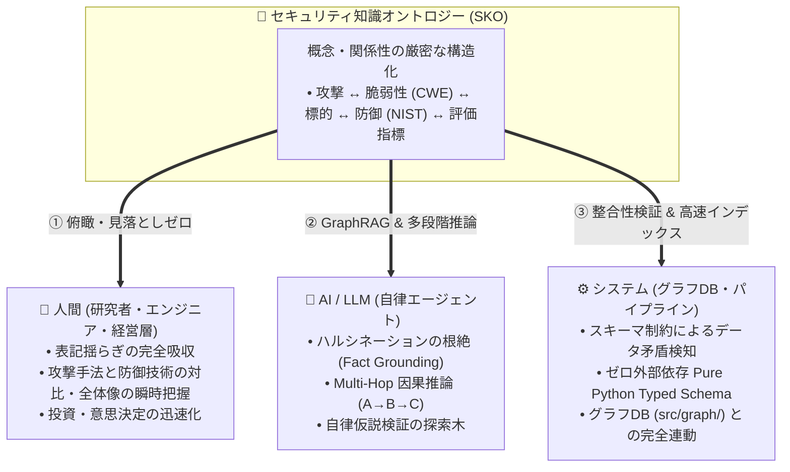
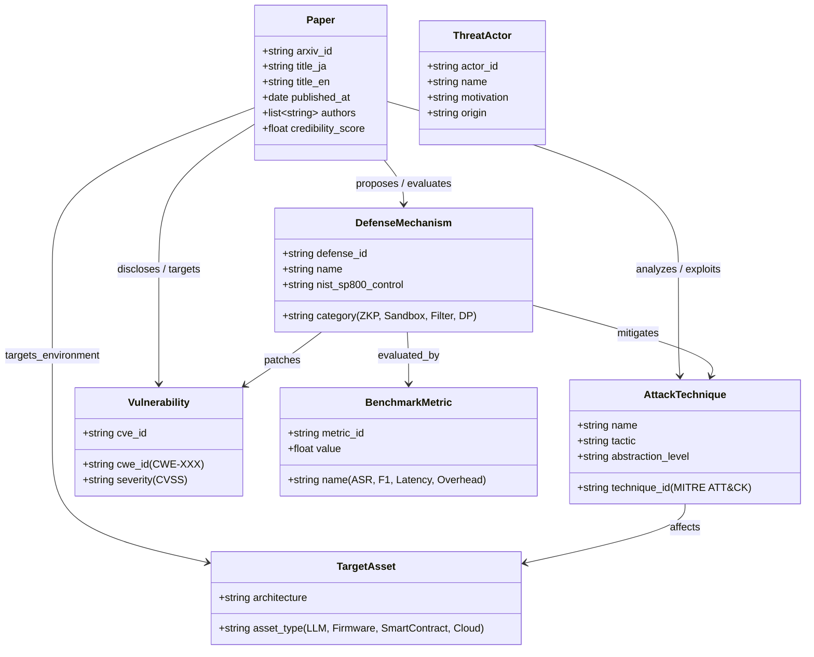
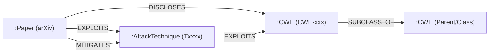
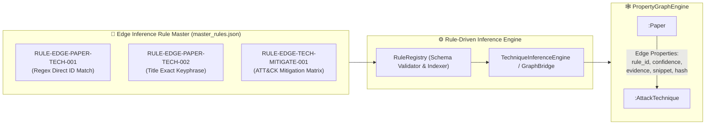

# [DSN-17] セキュリティ知識オントロジー（SKO: Security Knowledge Ontology）設計仕様書
## 〜 7大コアエンティティ・12大関係述語・国際標準タクソノミー統合モデル 〜

- **文書番号**: `DSN-17`
- **文書ステータス**: `APPROVED`
- **対象サブシステム**: `src/ontology/` (`SecurityOntologySchema`, `TaxonomyRegistry`, `OntologyExtractor`, `TripleExtractor`)
- **【主査・報告】 Information Security Specialist (SEC) / IT Specialist (NLP & Info Retrieval)**
- **【参画】 Project Manager (PM), Systems Architect (SA), IT Strategist (ST), Education Specialist (EDU)**

---

## 体系目次

- [1. 背景とオントロジーの目的](#1-背景とオントロジーの目的)
  - [1.1 なぜサイバーセキュリティにオントロジーが必要か](#11-なぜサイバーセキュリティにオントロジーが必要か)
  - [1.2 人・AI・システムへの価値提供モデル](#12-人aiシステムへの価値提供モデル)
- [2. 7大コアエンティティ（Core Entities / Vertex Types）](#2-7大コアエンティティcore-entities--vertex-types)
  - [2.1 エンティティクラス図](#21-エンティティクラス図)
  - [2.2 各エンティティの属性・型定義仕様](#22-各エンティティの属性型定義仕様)
- [3. 12大関係述語（Relationships / Edge Types）とグラフ公理](#3-12大関係述語relationships--edge-typesとグラフ公理)
  - [3.1 関係述語マトリクス](#31-関係述語マトリクス)
  - [3.2 逆関係（Inverse Predicates）と対称律](#32-逆関係inverse-predicatesと対称律)
- [4. 国際標準タクソノミー（MITRE / CWE / NIST / STRIDE）正規化](#4-国際標準タクソノミーmitre--cwe--nist--stride正規化)
  - [4.1 同義語（Synonyms）吸収テーブル](#41-同義語synonyms吸収テーブル)
  - [4.2 語彙正規化パイプライン](#42-語彙正規化パイプライン)
- [5. OKF v0.2 からの事実トリプル自動抽出エンジン仕様](#5-okf-v02-からの事実トリプル自動抽出エンジン仕様)
  - [5.1 フロントマターおよび Abstract/本文パース](#51-フロントマターおよび-abstract本文パース)
  - [5.2 確信度スコアリング（Confidence Weighting）](#52-確信度スコアリングconfidence-weighting)
- [6. クラス設計・型アノテーション仕様 (`src/ontology/`)](#6-クラス設計型アノテーション仕様-srcontology)
- [7. 品質ゲート・テスト・検証計画](#7-品質ゲートテスト検証計画)
- [8. （予約）](#8-予約)
- [9. （予約）](#9-予約)
- [10. arXiv 論文・MITRE ATT&CK・CWE 3軸ナレッジグラフデータモデルおよびハイブリッド抽出パイプライン仕様](#10-arxiv-論文mitre-attckcwe-3軸ナレッジグラフデータモデルおよびハイブリッド抽出パイプライン仕様)
- [11. Vertex間エッジ紐付け判定ルールマスター（EIROM: Edge Inference Rule Ontology Master）仕様](#11-vertex間エッジ紐付け判定ルールマスターeirom-edge-inference-rule-ontology-master仕様)
  - [11.1 ルールマスター管理のアーキテクチャ意義](#111-ルールマスター管理のアーキテクチャ意義)
  - [11.2 ルールマスターメタスキーマ仕様](#112-ルールマスターメタスキーマ仕様)
  - [11.3 標準オントロジー推論ルールカタログ](#113-標準オントロジー推論ルールカタログ)
  - [11.4 競合調停・マルチルール合成公理](#114-競合調停マルチルール合成公理)
  - [11.5 監査証跡・エビデンスおよび再評価ライフサイクル公理](#115-監査証跡エビデンスおよび再評価ライフサイクル公理)

---

# 1. 背景とオントロジーの目的

## 1.1 なぜサイバーセキュリティにオントロジーが必要か
サイバーセキュリティ論文は、著者やコミュニティによって同一の攻撃・防御概念が異なる用語で表現されます（例: 「Prompt Injection」「Jailbreak」「Adversarial Prompting」）。
従来のキーワード検索や単純なベクトル類似度検索のみでは、語彙の揺らぎによる見落としや、**「攻撃 A は脆弱性 B を突いて標的 C を侵害し、防御 D で緩和可能である」** という複数論文を跨いだ**多段階因果関係（Multi-Hop Causality）**を論理的に追跡することが困難でした。

**セキュリティ知識オントロジー（Security Knowledge Ontology: SKO）** は、セキュリティドメインの概念、脆弱性、脅威主体、防御手法、評価指標の境界と意味関係（Semantics）を厳密に定義し、論文ナレッジを計算可能かつ推論可能な形式知へと昇華させます。

## 1.2 人・AI・システムへの価値提供モデル



---

# 2. 7大コアエンティティ（Core Entities / Vertex Types）

## 2.1 エンティティクラス図



## 2.2 各エンティティの属性・型定義仕様

1. **`PaperEntity`（論文）**:
   - `arxiv_id`: 一意の論文識別子（例: `"2608.01234"`）
   - `title_ja` / `title_en`: 日英タイトル
   - `authors`: 著者リスト
   - `published_at`: 発行日（ISO 8601）
   - `credibility_score`: Admiralty Rating（NATO STANAG 2022 準拠の信憑性スコア: $0.0 \sim 1.0$）
2. **`ThreatActorEntity`（脅威主体）**:
   - `actor_id`: 一意識別子（例: `"APT28"`, `"Lazarus"`）
   - `name`: 脅威主体名
   - `motivation`: 動機（国家支援、金銭目的、破壊活動）
3. **`AttackTechniqueEntity`（攻撃手法）**:
   - `technique_id`: MITRE ATT&CK ID（例: `"T1059"`, `"T1040"`）または独自 ID
   - `name`: 手法名（例: `"Prompt Injection"`, `"Fault Injection"`）
   - `tactic`: 戦術分類（Initial Access, Execution, Persistence 等）
4. **`VulnerabilityEntity`（脆弱性）**:
   - `cwe_id`: CWE 識別子（例: `"CWE-79"`, `"CWE-94"`, `"CWE-1333"`）
   - `cve_id`: CVE 識別子（任意）
   - `severity`: CVSS 深刻度（Critical, High, Medium, Low）
5. **`TargetAssetEntity`（標的資産・システム）**:
   - `asset_type`: 資産タイプ（`"LLM Agent"`, `"RISC-V Firmware"`, `"TPM/Enclave"`, `"Smart Contract"`）
   - `architecture`: 対象アーキテクチャ・実行環境
6. **`DefenseMechanismEntity`（防御手法）**:
   - `defense_id`: 防御技術識別子
   - `name`: 技術名（例: `"AST Guard Sandbox"`, `"Zero-Knowledge Proofs"`, `"RLHF Alignment"`）
   - `category`: 防御カテゴリ（暗号プロトコル, サンドボックス, 入力フィルタ, 差分プライバシー）
   - `nist_sp800_control`: NIST SP 800-53 コントロール ID（例: `"AC-3"`, `"SI-10"`）
7. **`BenchmarkMetricEntity`（評価指標）**:
   - `metric_id`: 評価指標識別子
   - `name`: 指標名（`"Attack Success Rate (ASR)"`, `"Overhead Latency %"`, `"F1-Score"`）
   - `value`: 実測値

---

# 3. 12大関係述語（Relationships / Edge Types）とグラフ公理

## 3.1 関係述語マトリクス

| 述語名 (Predicate) | 始点 (Source) | 終点 (Target) | 意味・セマンティクス | 逆関係 (Inverse) |
| :--- | :--- | :--- | :--- | :--- |
| **`DISCLOSES`** | `Paper` | `Vulnerability` | 論文が新たな脆弱性を開示・報告した | `DISCLOSED_IN` |
| **`EXPLOITS`** | `AttackTechnique` | `Vulnerability` | 攻撃手法が脆弱性を悪用する | `EXPLOITED_BY` |
| **`ANALYZES`** | `Paper` | `AttackTechnique` | 論文が攻撃手法を詳細解析・実証した | `ANALYZED_IN` |
| **`TARGETS`** | `AttackTechnique` | `TargetAsset` | 攻撃手法が標的資産を攻撃対象とする | `TARGETED_BY` |
| **`PROPOSES`** | `Paper` | `DefenseMechanism` | 論文が新たな防御手法を提案した | `PROPOSED_IN` |
| **`MITIGATES`** | `DefenseMechanism` | `AttackTechnique` | 防御手法が攻撃手法を緩和・防御する | `MITIGATED_BY` |
| **`PATCHES`** | `DefenseMechanism` | `Vulnerability` | 防御手法が脆弱性を根本修正・保護する | `PATCHED_BY` |
| **`EVALUATES`** | `Paper` | `BenchmarkMetric` | 論文が評価実験を行い指標を計測した | `EVALUATED_IN` |
| **`ATTRIBUTED_TO`** | `AttackTechnique` | `ThreatActor` | 攻撃手法が特定脅威主体に帰属される | `EMPLOYS` |
| **`SUBCLASS_OF`** | `AttackTechnique` | `AttackTechnique` | 攻撃手法の上位・下位概念関係（Taxonomy） | `SUPERCLASS_OF` |
| **`PART_OF`** | `TargetAsset` | `TargetAsset` | 資産の包含関係（例: Cache `partOf` CPU） | `HAS_PART` |
| **`CITES`** | `Paper` | `Paper` | 論文間の引用・参照関係 | `CITED_BY` |

---

# 4. 国際標準タクソノミー（MITRE / CWE / NIST / STRIDE）正規化

## 4.1 同義語（Synonyms）吸収テーブル (`TaxonomyRegistry`)

```python
SYNONYM_MAPPINGS: Dict[str, str] = {
    # Prompt Injection 同義語クラスタ
    "jailbreak": "AttackTechnique:Prompt_Injection",
    "jailbreaking": "AttackTechnique:Prompt_Injection",
    "adversarial_prompting": "AttackTechnique:Prompt_Injection",
    "indirect_prompt_injection": "AttackTechnique:Prompt_Injection",
    "prompt_injection": "AttackTechnique:Prompt_Injection",
    
    # Side-Channel 同義語クラスタ
    "power_analysis": "AttackTechnique:Side_Channel_Analysis",
    "electromagnetic_analysis": "AttackTechnique:Side_Channel_Analysis",
    "cache_timing_attack": "AttackTechnique:Side_Channel_Analysis",
    "spectre_meltdown": "AttackTechnique:Side_Channel_Analysis",
    
    # Supply Chain 同義語クラスタ
    "dependency_confusion": "AttackTechnique:Supply_Chain_Tampering",
    "typosquatting": "AttackTechnique:Supply_Chain_Tampering",
    "malicious_package": "AttackTechnique:Supply_Chain_Tampering",
}
```

---

# 5. OKF v0.2 からの事実トリプル自動抽出エンジン仕様

`OntologyExtractor` は、OKF Markdown ドキュメントからエンティティと有向関係トリプル（Triple）を決定論的に抽出します。

```python
@dataclass(frozen=True)
class Triple:
    subject_id: str
    predicate: Predicate
    object_id: str
    weight: float = 1.0
    properties: Dict[str, Any] = field(default_factory=dict)
```

---

# 6. クラス設計・型アノテーション仕様 (`src/ontology/`)

```python
class SecurityOntologySchema:
    """Zero-dependency pure Python Security Ontology schema validator."""
    @staticmethod
    def validate_triple(triple: Triple) -> bool: ...
    @staticmethod
    def get_allowed_predicates(src_type: str, dst_type: str) -> List[Predicate]: ...

class TaxonomyRegistry:
    """Normalizes terms against MITRE ATT&CK, CWE, and STRIDE dictionaries."""
    @classmethod
    def normalize(cls, raw_term: str) -> str: ...
```

---

# 7. 品質ゲート・テスト・検証計画

1. **単体テスト (`tests/ontology/test_schema.py`)**:
   - 7大エンティティの生成・バリデーション・JSON シリアライズ検証。
   - 12大関係述語の逆関係マッピング整合性。
   - 同義語正規化辞書（`TaxonomyRegistry`）の網羅率テスト。
2. **静的解析**:
   - `make flake8` & `make mypy --strict` 100% PASS。

---

# 8. STIX 2.1 スキーマ準拠の知識グラフ自動構築 (SDO/SRO)

論文から抽出された脅威情報エンティティおよび関係性を OASIS 標準 STIX 2.1（Structured Threat Information Expression）仕様に準拠した JSON 構造体として形式化する。
- **STIX ドメインオブジェクト (SDO)**:
  - `attack-pattern`: 論文が実証した新規攻撃手法。
  - `vulnerability`: 対象アーキテクチャの欠陥や弱点。
  - `course-of-action`: 提案された対抗策、パッチ、形式検証手法。
  - `threat-actor` / `identity`: 想定攻撃主体・標的組織。
- **STIX リレーションシップオブジェクト (SRO)**:
  - `mitigates`: 防御策が無力化する攻撃手法。
  - `targets`: 攻撃が標的とする環境やコンポーネント。
  - `indicates`: 攻撃の観測指標や IoC。

---

# 9. PRIMUS 知見に基づく CWE / CVSS / ATT&CK 精密マッピングと来歴階層化

自然言語アブストラクトや本文から標準識別子を割り出す処理に、サイバーセキュリティ専門評価体系（PRIMUS / CTI-Bench）の知見を組み込む。
1. **CTI-RCM (Root Cause Mapping)**: 脆弱性の機序解説からメモリ破壊、競合状態、認可不備などの根本原因を推論し、900 以上の CWE 分類から最適なカテゴリへ割り当て。
2. **CTI-VSP (Vulnerability Severity Prediction)**: 攻撃前提条件・影響評価から攻撃元区分（AV）、特権要求（PR）、影響範囲（Scope）を論理的に判定し、CVSS v3.1 / v4.0 ベクトル文字列を予測。
3. **CTI-ATE (Attack Technique Extraction)**: 攻撃プロセス記述から攻撃者の TTPs を分解し、Enterprise ATT&CK 戦術配下の正規化された技術 ID へマッピング。
4. **来歴階層化 (Provenance-tiered Validation)**: 推論モデルの確証度に応じ、人手検証に匹敵する「ゴールドラベル」と自動推定による「シルバーラベル」を分離保持し、誤検知・展開ノイズを排除。

---

# 10. arXiv 論文・MITRE ATT&CK・CWE 3軸ナレッジグラフデータモデルおよびハイブリッド抽出パイプライン仕様

## 10.1 3軸グラフデータモデル定義
論文、攻撃技術、脆弱性クラスを強固に接続する 3 軸プロパティグラフモデルを定義する：



### ノード属性仕様
1. **`:Paper` (`EntityType.PAPER`)**:
   - `id`: arXiv クリーン ID（例: `"2401_12345"`）
   - `title`: 論文タイトル
   - `abstract`: 論文要約（英文原本）
   - `published_at`: 公開日（ISO 8601）
   - `url`: `https://arxiv.org/abs/...`
2. **`:AttackTechnique` (`EntityType.ATTACK_TECHNIQUE`)**:
   - `id`: ATT&CK ID（例: `"T1059"`, `"T1055.001"`）
   - `name`: 攻撃技術名
   - `tactics`: 所属戦術リスト（例: `["Execution", "Persistence"]`）
   - `url`: `https://attack.mitre.org/techniques/...`
3. **`:CWE` (`EntityType.VULNERABILITY`)**:
   - `id`: CWE 識別子（例: `"CWE-78"`, `"CWE-119"`）
   - `name`: 脆弱性クラス名
   - `abstraction`: 抽象度レベル（`Pillar`, `Class`, `Base`, `Variant`）
   - `url`: `https://cwe.mitre.org/data/definitions/...`

## 10.2 ハイブリッド抽出パイプライン（ゼロ外部依存）
1. **ルールベース・正規表現マッチング**:
   - `r"\bCWE-\d+\b"`, `r"\bT\d{4}(?:\.\d{3})?\b"` による完全一致抽出。
   - セキュリティ専門同義語辞書（`TaxonomyRegistry`）による即時マッピング。
2. **Pure-Python セマンティック類似度 / PRIMUS 推論**:
   - 論文アブストラクトをサブワード分解し、内製 `DeterministicEmbedding` および IVF-PQ/ANN 探索により CWE/ATT&CK 定義テキストとの意味類似度を算出。
   - 閾値判定により、明示的記述がない暗黙的 TTPs / 脆弱性タイプを補完。
3. **来歴階層化（Provenance Tiering）**:
   - `Gold`: 正規表現完全一致または公式メタデータ照合（確証度 $\ge 0.90$）
   - `Silver`: セマンティック類似度上位一致（確証度 $0.70 \le c < 0.90$）
   - `Bronze`: キーワード共起・トピック関連（確証度 $< 0.70$）

---

# 11. Vertex間エッジ紐付け判定ルールマスター（EIROM: Edge Inference Rule Ontology Master）仕様

## 11.1 ルールマスター管理のアーキテクチャ意義
セキュリティナレッジグラフにおいて、ノード（エンティティ定義）が明確であっても、ノード間を結ぶエッジの導出基準（推論判定ロジック）がアプリケーションコード内の `if` 文や個別関数にハードコードされている場合、以下の重大な課題が生じる：
1. **説明可能性・監査性の欠如**: なぜこの論文と攻撃手法が紐づいたのか、外部監査・ユーザーが判定根拠・適用規則を客観的に追跡できない。
2. **モデル改訂時の非対称性**: 推論ルールを変更・改善した際、過去に生成されたエッジとのバージョン差分や影響範囲の特定が不可能となる。
3. **推論ライフサイクルの硬直化**: 論文テキスト更新時にどのエッジを再評価・再推論すべきか（Invalidation Lifecycle）が判定できない。

本オントロジーでは、**「どのエンティティとどのエンティティを、どのような根拠・条件・重みで結ぶか」を推論公理（TBox Inference Axiom）として独立したマスターデータ（EIROM）として一元管理**する。



## 11.2 ルールマスターメタスキーマ仕様

ルールマスターデータは、以下の JSON / Typed Dataclass スキーマに従い、厳格にバリデーションされる：

```python
@dataclass(frozen=True)
class EdgeInferenceRule:
    rule_id: str                   # 一意識別子 (例: RULE-EDGE-PAPER-ATTACK-001)
    name: str                      # ルール表示名
    description: str               # 推論根拠の説明
    source_label: str              # 始点ノード種別 (Paper, AttackTechnique, etc.)
    target_label: str              # 終点ノード種別 (AttackTechnique, Vulnerability, etc.)
    edge_label: str                # 導出されるエッジ関係述語 (TARGETS, PROPOSES_DEFENSE, MITIGATES, etc.)
    condition_type: str            # 条件型 (regex, lexical, semantic_threshold, catalog_axiom)
    condition_spec: Dict[str, Any] # パラメータ (パターン、キーワードリスト、閾値、対象フィールド)
    base_confidence: float         # 基本確信度スコア (0.0 〜 1.0)
    confidence_tier: str           # 確信度階層 (HIGH, MEDIUM, LOW)
    evidence_spec: Dict[str, Any]  # エビデンス抽出仕様 (スニペット長、抽出フィールド)
    version: str                   # ルール改訂版 (例: 2026.09.1)
    is_active: bool = True         # 有効/無効フラグ
```

## 11.3 標準オントロジー推論ルールカタログ

| Rule ID | ルール名 | 始点 → 終点 | エッジ述語 | 判定条件型 / 概要 | 基本確信度 / Tier |
| :--- | :--- | :---: | :---: | :--- | :---: |
| `RULE-EDGE-PAPER-TECH-REGEX-01` | Direct Technique ID Match | `Paper` → `AttackTechnique` | `TARGETS` / `PROPOSES_DEFENSE` / `DISCUSSES` | `r"\b(T\d{4}(?:\.\d{3})?)\b"` 正規表現検知 | `1.0` / `HIGH` |
| `RULE-EDGE-PAPER-TECH-TITLE-02` | Title Keyphrase Affinity | `Paper` → `AttackTechnique` | `TARGETS` / `PROPOSES_DEFENSE` / `DISCUSSES` | タイトルにおける手法正式名称・同義語完全一致 | `0.8` / `HIGH` |
| `RULE-EDGE-PAPER-TECH-ABSTRACT-03` | Abstract Lexical Scoring | `Paper` → `AttackTechnique` | `TARGETS` / `PROPOSES_DEFENSE` / `DISCUSSES` | アブストラクト本文のセキュリティ専門語彙頻度重み付け | `0.4〜0.7` / `MEDIUM` |
| `RULE-EDGE-PAPER-CWE-REGEX-01` | Direct CWE Identification | `Paper` → `CWE` | `DISCLOSES` | `r"\b(CWE-\d+)\b"` 正規表現検知 | `1.0` / `HIGH` |
| `RULE-EDGE-TECH-MITIGATE-AXIOM-01` | ATT&CK Mitigation Axiom | `DefenseMitigation` → `AttackTechnique` | `MITIGATES` | MITRE ATT&CK Enterprise Matrix 緩和公理照合 | `1.0` / `HIGH` |
| `RULE-EDGE-TECH-CWE-AXIOM-02` | CAPEC/CWE Exploitation Axiom | `AttackTechnique` → `CWE` | `EXPLOITS_VULNERABILITY` | CAPEC 関連脆弱性マッピング公理照合 | `0.9` / `HIGH` |
| `RULE-EDGE-FOCUS-OFFENSIVE-01` | Offensive Research Context | `Paper` → `AttackTechnique` | `TARGETS` | 攻撃系語彙（exploit, attack, poc, bypass等）優勢 | `Context Modifier` |
| `RULE-EDGE-FOCUS-DEFENSIVE-02` | Defensive Research Context | `Paper` → `AttackTechnique` | `PROPOSES_DEFENSE` | 防御系語彙（defense, mitigate, countermeasure等）優勢 | `Context Modifier` |

## 11.4 競合調停・マルチルール合成公理
同一の `(Source, Target)` ペアに対して複数の推論ルールが同時に成立した場合、以下の公理に従ってエッジの最終確信度と属性を合成する：

1. **Max-Score 採択原則**:
   $$\text{Final Confidence} = \max_{r \in R_{\text{applied}}} (\text{Confidence}(r))$$
   最も確信度の高いルールを `primary_rule_id` として採用する。
2. **エビデンス集約原則**:
   成立した全ルールの識別子を `applied_rules: List[str]` に保持し、各ルールが抽出した証拠スニペットを `evidences: List[Dict]` に完全集約する。
3. **攻防コンテキスト調停**:
   攻撃系キーワード数 $N_{\text{off}}$ と防御系キーワード数 $N_{\text{def}}$ を比較し、有意差（$N \ge 2$ かつ大なり）がある側を関係述語（`TARGETS` vs `PROPOSES_DEFENSE`）に昇格させる。同等または僅差の場合は中立の `DISCUSSES` を割り当てる。

## 11.5 監査証跡・エビデンスおよび再評価ライフサイクル公理
1. **データ整合性フィンガープリント (`source_text_hash`)**:
   エッジ作成時、判定対象となった論文テキスト（タイトル + 要約）の SHA-256 ハッシュ（先頭 16 桁）をエッジプロパティに刻印する。
2. **ルールバージョンと無効化公理**:
   ルールマスターファイル（`master_rules.json`）の `version` が更新された場合、または論文原本のハッシュが変化した場合、システムは当該エッジを `validation_status = "stale"` としてマークし、自律的に差分再推論を実行する。


