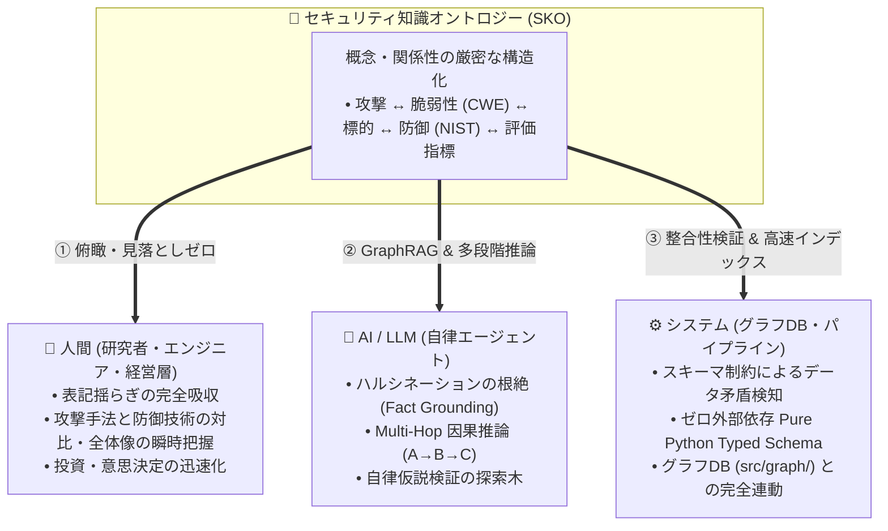
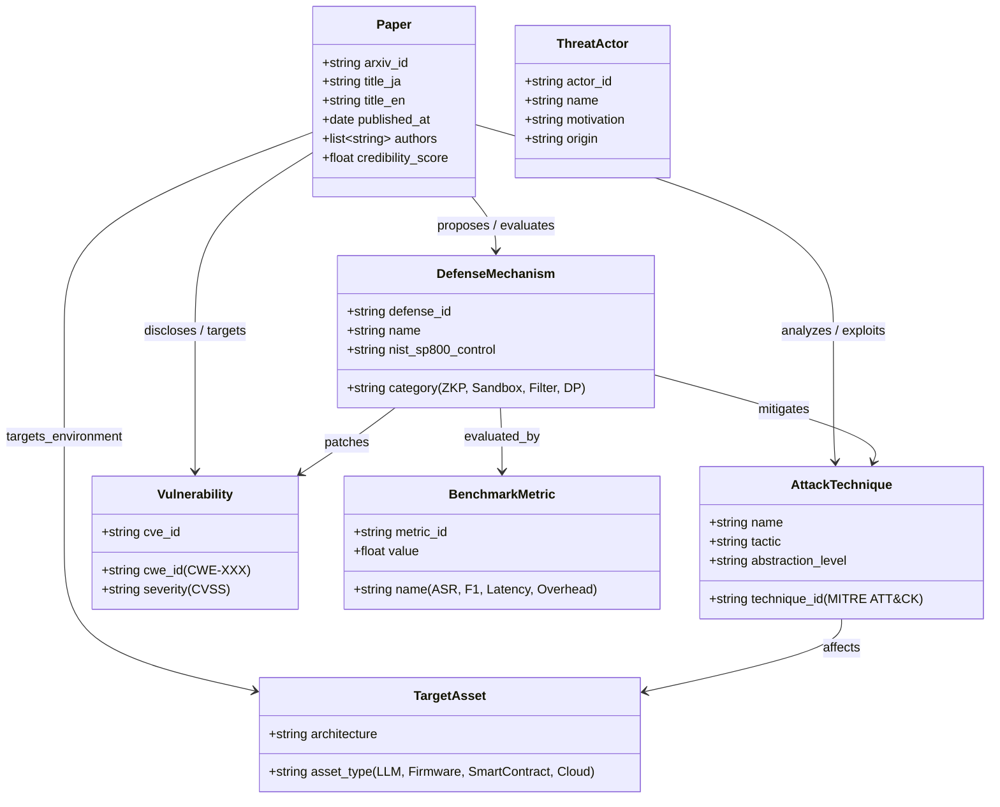

# [DSN-17] セキュリティ知識オントロジー（SKO: Security Knowledge Ontology）設計仕様書
## 〜 7大コアエンティティ・12大関係述語・国際標準タクソノミー統合モデル 〜

- **文書番号**: `DSN-17`
- **文書ステータス**: `APPROVED`
- **対象サブシステム**: `src/ontology/` (`SecurityOntologySchema`, `TaxonomyRegistry`, `OntologyExtractor`, `TripleExtractor`)
- **【主査・報告】 Information Security Specialist (SEC) / IT Specialist (NLP & Info Retrieval)**
- **【参画】 Project Manager (PM), Systems Architect (SA), IT Strategist (ST), Education Specialist (EDU)**

---

## 体系目次

- [1. 背景とオントロジーの目的](#1-背景とオントロジーの目的)
  - [1.1 なぜサイバーセキュリティにオントロジーが必要か](#11-なぜサイバーセキュリティにオントロジーが必要か)
  - [1.2 人・AI・システムへの価値提供モデル](#12-人aiシステムへの価値提供モデル)
- [2. 7大コアエンティティ（Core Entities / Vertex Types）](#2-7大コアエンティティcore-entities--vertex-types)
  - [2.1 エンティティクラス図](#21-エンティティクラス図)
  - [2.2 各エンティティの属性・型定義仕様](#22-各エンティティの属性型定義仕様)
- [3. 12大関係述語（Relationships / Edge Types）とグラフ公理](#3-12大関係述語relationships--edge-typesとグラフ公理)
  - [3.1 関係述語マトリクス](#31-関係述語マトリクス)
  - [3.2 逆関係（Inverse Predicates）と対称律](#32-逆関係inverse-predicatesと対称律)
- [4. 国際標準タクソノミー（MITRE / CWE / NIST / STRIDE）正規化](#4-国際標準タクソノミーmitre--cwe--nist--stride正規化)
  - [4.1 同義語（Synonyms）吸収テーブル](#41-同義語synonyms吸収テーブル)
  - [4.2 語彙正規化パイプライン](#42-語彙正規化パイプライン)
- [5. OKF v0.2 からの事実トリプル自動抽出エンジン仕様](#5-okf-v02-からの事実トリプル自動抽出エンジン仕様)
  - [5.1 フロントマターおよび Abstract/本文パース](#51-フロントマターおよび-abstract本文パース)
  - [5.2 確信度スコアリング（Confidence Weighting）](#52-確信度スコアリングconfidence-weighting)
- [6. クラス設計・型アノテーション仕様 (`src/ontology/`)](#6-クラス設計型アノテーション仕様-srcontology)
- [7. 品質ゲート・テスト・検証計画](#7-品質ゲートテスト検証計画)

---

# 1. 背景とオントロジーの目的

## 1.1 なぜサイバーセキュリティにオントロジーが必要か
サイバーセキュリティ論文は、著者やコミュニティによって同一の攻撃・防御概念が異なる用語で表現されます（例: 「Prompt Injection」「Jailbreak」「Adversarial Prompting」）。
従来のキーワード検索や単純なベクトル類似度検索のみでは、語彙の揺らぎによる見落としや、**「攻撃 A は脆弱性 B を突いて標的 C を侵害し、防御 D で緩和可能である」** という複数論文を跨いだ**多段階因果関係（Multi-Hop Causality）**を論理的に追跡することが困難でした。

**セキュリティ知識オントロジー（Security Knowledge Ontology: SKO）** は、セキュリティドメインの概念、脆弱性、脅威主体、防御手法、評価指標の境界と意味関係（Semantics）を厳密に定義し、論文ナレッジを計算可能かつ推論可能な形式知へと昇華させます。

## 1.2 人・AI・システムへの価値提供モデル



---

# 2. 7大コアエンティティ（Core Entities / Vertex Types）

## 2.1 エンティティクラス図



## 2.2 各エンティティの属性・型定義仕様

1. **`PaperEntity`（論文）**:
   - `arxiv_id`: 一意の論文識別子（例: `"2608.01234"`）
   - `title_ja` / `title_en`: 日英タイトル
   - `authors`: 著者リスト
   - `published_at`: 発行日（ISO 8601）
   - `credibility_score`: Admiralty Rating（NATO STANAG 2022 準拠の信憑性スコア: $0.0 \sim 1.0$）
2. **`ThreatActorEntity`（脅威主体）**:
   - `actor_id`: 一意識別子（例: `"APT28"`, `"Lazarus"`）
   - `name`: 脅威主体名
   - `motivation`: 動機（国家支援、金銭目的、破壊活動）
3. **`AttackTechniqueEntity`（攻撃手法）**:
   - `technique_id`: MITRE ATT&CK ID（例: `"T1059"`, `"T1040"`）または独自 ID
   - `name`: 手法名（例: `"Prompt Injection"`, `"Fault Injection"`）
   - `tactic`: 戦術分類（Initial Access, Execution, Persistence 等）
4. **`VulnerabilityEntity`（脆弱性）**:
   - `cwe_id`: CWE 識別子（例: `"CWE-79"`, `"CWE-94"`, `"CWE-1333"`）
   - `cve_id`: CVE 識別子（任意）
   - `severity`: CVSS 深刻度（Critical, High, Medium, Low）
5. **`TargetAssetEntity`（標的資産・システム）**:
   - `asset_type`: 資産タイプ（`"LLM Agent"`, `"RISC-V Firmware"`, `"TPM/Enclave"`, `"Smart Contract"`）
   - `architecture`: 対象アーキテクチャ・実行環境
6. **`DefenseMechanismEntity`（防御手法）**:
   - `defense_id`: 防御技術識別子
   - `name`: 技術名（例: `"AST Guard Sandbox"`, `"Zero-Knowledge Proofs"`, `"RLHF Alignment"`）
   - `category`: 防御カテゴリ（暗号プロトコル, サンドボックス, 入力フィルタ, 差分プライバシー）
   - `nist_sp800_control`: NIST SP 800-53 コントロール ID（例: `"AC-3"`, `"SI-10"`）
7. **`BenchmarkMetricEntity`（評価指標）**:
   - `metric_id`: 評価指標識別子
   - `name`: 指標名（`"Attack Success Rate (ASR)"`, `"Overhead Latency %"`, `"F1-Score"`）
   - `value`: 実測値

---

# 3. 12大関係述語（Relationships / Edge Types）とグラフ公理

## 3.1 関係述語マトリクス

| 述語名 (Predicate) | 始点 (Source) | 終点 (Target) | 意味・セマンティクス | 逆関係 (Inverse) |
| :--- | :--- | :--- | :--- | :--- |
| **`DISCLOSES`** | `Paper` | `Vulnerability` | 論文が新たな脆弱性を開示・報告した | `DISCLOSED_IN` |
| **`EXPLOITS`** | `AttackTechnique` | `Vulnerability` | 攻撃手法が脆弱性を悪用する | `EXPLOITED_BY` |
| **`ANALYZES`** | `Paper` | `AttackTechnique` | 論文が攻撃手法を詳細解析・実証した | `ANALYZED_IN` |
| **`TARGETS`** | `AttackTechnique` | `TargetAsset` | 攻撃手法が標的資産を攻撃対象とする | `TARGETED_BY` |
| **`PROPOSES`** | `Paper` | `DefenseMechanism` | 論文が新たな防御手法を提案した | `PROPOSED_IN` |
| **`MITIGATES`** | `DefenseMechanism` | `AttackTechnique` | 防御手法が攻撃手法を緩和・防御する | `MITIGATED_BY` |
| **`PATCHES`** | `DefenseMechanism` | `Vulnerability` | 防御手法が脆弱性を根本修正・保護する | `PATCHED_BY` |
| **`EVALUATES`** | `Paper` | `BenchmarkMetric` | 論文が評価実験を行い指標を計測した | `EVALUATED_IN` |
| **`ATTRIBUTED_TO`** | `AttackTechnique` | `ThreatActor` | 攻撃手法が特定脅威主体に帰属される | `EMPLOYS` |
| **`SUBCLASS_OF`** | `AttackTechnique` | `AttackTechnique` | 攻撃手法の上位・下位概念関係（Taxonomy） | `SUPERCLASS_OF` |
| **`PART_OF`** | `TargetAsset` | `TargetAsset` | 資産の包含関係（例: Cache `partOf` CPU） | `HAS_PART` |
| **`CITES`** | `Paper` | `Paper` | 論文間の引用・参照関係 | `CITED_BY` |

---

# 4. 国際標準タクソノミー（MITRE / CWE / NIST / STRIDE）正規化

## 4.1 同義語（Synonyms）吸収テーブル (`TaxonomyRegistry`)

```python
SYNONYM_MAPPINGS: Dict[str, str] = {
    # Prompt Injection 同義語クラスタ
    "jailbreak": "AttackTechnique:Prompt_Injection",
    "jailbreaking": "AttackTechnique:Prompt_Injection",
    "adversarial_prompting": "AttackTechnique:Prompt_Injection",
    "indirect_prompt_injection": "AttackTechnique:Prompt_Injection",
    "prompt_injection": "AttackTechnique:Prompt_Injection",
    
    # Side-Channel 同義語クラスタ
    "power_analysis": "AttackTechnique:Side_Channel_Analysis",
    "electromagnetic_analysis": "AttackTechnique:Side_Channel_Analysis",
    "cache_timing_attack": "AttackTechnique:Side_Channel_Analysis",
    "spectre_meltdown": "AttackTechnique:Side_Channel_Analysis",
    
    # Supply Chain 同義語クラスタ
    "dependency_confusion": "AttackTechnique:Supply_Chain_Tampering",
    "typosquatting": "AttackTechnique:Supply_Chain_Tampering",
    "malicious_package": "AttackTechnique:Supply_Chain_Tampering",
}
```

---

# 5. OKF v0.2 からの事実トリプル自動抽出エンジン仕様

`OntologyExtractor` は、OKF Markdown ドキュメントからエンティティと有向関係トリプル（Triple）を決定論的に抽出します。

```python
@dataclass(frozen=True)
class Triple:
    subject_id: str
    predicate: Predicate
    object_id: str
    weight: float = 1.0
    properties: Dict[str, Any] = field(default_factory=dict)
```

---

# 6. クラス設計・型アノテーション仕様 (`src/ontology/`)

```python
class SecurityOntologySchema:
    """Zero-dependency pure Python Security Ontology schema validator."""
    @staticmethod
    def validate_triple(triple: Triple) -> bool: ...
    @staticmethod
    def get_allowed_predicates(src_type: str, dst_type: str) -> List[Predicate]: ...

class TaxonomyRegistry:
    """Normalizes terms against MITRE ATT&CK, CWE, and STRIDE dictionaries."""
    @classmethod
    def normalize(cls, raw_term: str) -> str: ...
```

---

# 7. 品質ゲート・テスト・検証計画

1. **単体テスト (`tests/ontology/test_schema.py`)**:
   - 7大エンティティの生成・バリデーション・JSON シリアライズ検証。
   - 12大関係述語の逆関係マッピング整合性。
   - 同義語正規化辞書（`TaxonomyRegistry`）の網羅率テスト。
2. **静的解析**:
   - `make flake8` & `make mypy --strict` 100% PASS。
