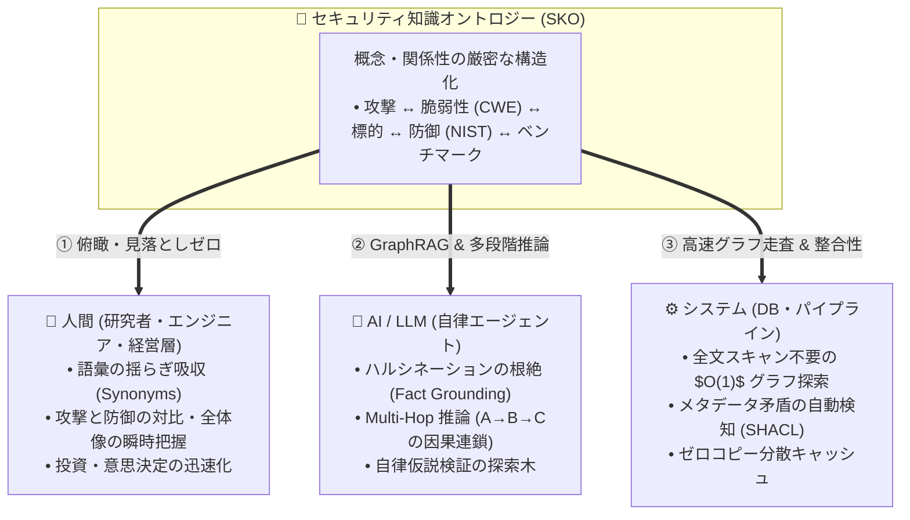
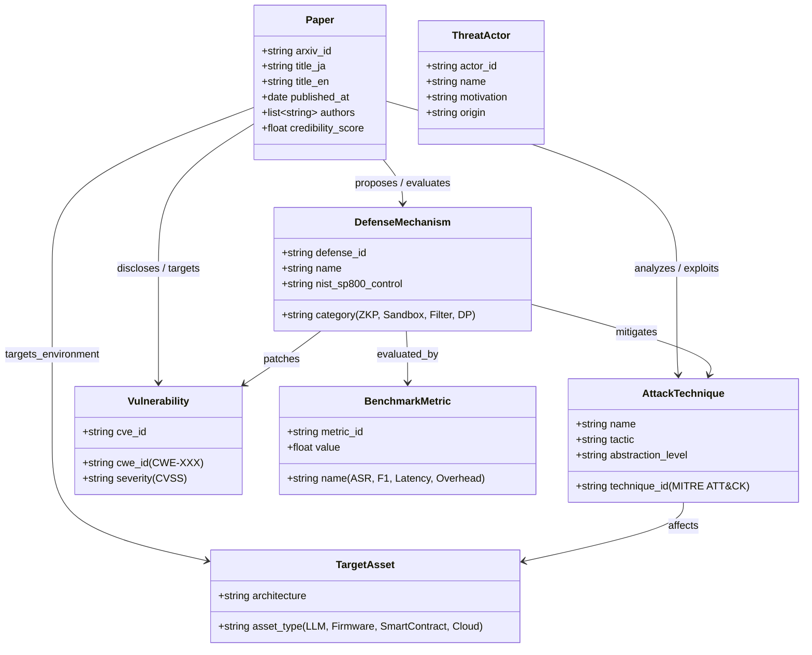
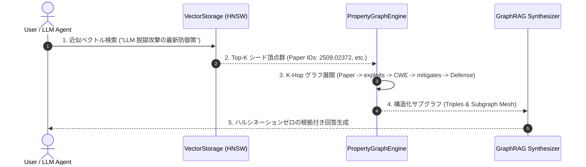

# [DSN-17] セキュリティ知識オントロジー（SKO）定義 & ゼロ侵襲型グラフデータベース構築設計仕様書
## 〜 既存分散ストレージ基盤（`src/database/`）を無改変で活用する Property Graph Engine & GraphRAG 基盤 〜

- **文書番号**: `DSN-17`
- **文書ステータス**: `APPROVED`
- **対象サブシステム**: `src/ontology/` (`SecurityOntologySchema`, `OntologyExtractor`, `TaxonomyRegistry`), `src/database/graph/` (`PropertyGraphEngine`, `GraphIndex`, `CSRStorageAdapter`, `GraphTraversalAPI`, `GraphRAG`)
- **【主査・報告】 Systems Architect (SA) / Information Security Specialist (SEC) / IT Specialist (NLP & Info Retrieval)**
- **【参画】 Project Manager (PM), Database / Data Infrastructure Specialist (DB), IT Strategist (ST), Systems Auditor (AU)**

---

## 体系目次

- [1. エグゼクティブサマリー & アーキテクチャ原則](#1-エグゼクティブサマリー--アーキテクチャ原則)
  - [1.1 背景と設計目標](#11-背景と設計目標)
  - [1.2 既存DB基盤へのゼロ侵襲（Non-Invasive Layering）原則](#12-既存db基盤へのゼロ侵襲non-invasive-layering原則)
  - [1.3 人・AI・システムへの三位一体価値提供モデル](#13-人aiシステムへの三位一体価値提供モデル)
- [2. セキュリティ知識オントロジー（SKO: Security Knowledge Ontology）定義](#2-セキュリティ知識オントロジーsko-security-knowledge-ontology定義)
  - [2.1 7大コアエンティティ（Core Entities / Vertex Types）](#21-7大コアエンティティcore-entities--vertex-types)
  - [2.2 12大関係述語（Relationships / Edge Types）と有向グラフ公理](#22-12大関係述語relationships--edge-typesと有向グラフ公理)
  - [2.3 語彙正規化 & 国際標準タクソノミー（MITRE / CWE / NIST / STRIDE）マッピング](#23-語彙正規化--国際標準タクソノミーmitre--cwe--nist--strideマッピング)
- [3. ゼロ侵襲型 グラフデータベースエンジン設計 (`src/database/graph/`)](#3-ゼロ侵襲型-グラフデータベースエンジン設計-srcdatabasegraph)
  - [3.1 レイヤリング構造とストレージアダプタ（CSR / Adjacency on Slotted-Page）](#31-レイヤリング構造とストレージアダプタcsr--adjacency-on-slotted-page)
  - [3.2 頂点（Vertex）および 辺（Edge）のバイナリ物理エンコーディング](#32-頂点vertexおよび-辺edgeのバイナリ物理エンコーディング)
  - [3.3 双方向隣接インデックス（Forward / Reverse Adjacency Index）数理モデル](#33-双方向隣接インデックスforward--reverse-adjacency-index数理モデル)
- [4. グラフクエリエンジン & 走査アルゴリズム (Graph Traversal Engine)](#4-グラフクエリエンジン--走査アルゴリズム-graph-traversal-engine)
  - [4.1 流暢なグラフ走査 DSL（Fluent Graph Traversal API）](#41-流暢なグラフ走査-dslfluent-graph-traversal-api)
  - [4.2 Multi-Hop 探索、最短経路（Dijkstra/BFS）、および PageRank アルゴリズム](#42-multi-hop-探索最短経路dijkstrabfsおよび-pagerank-アルゴリズム)
- [5. AI / LLM 連携: GraphRAG & 多段階因果推論エンジン](#5-ai--llm-連携-graphrag--多段階因果推論エンジン)
  - [5.1 ベクトル検索（HNSW）とグラフ走査のハイブリッド融合（GraphRAG Pipeline）](#51-ベクトル検索hnswとグラフ走査のハイブリッド融合graphrag-pipeline)
  - [5.2 ハルシネーション根絶のためのグラウンディング・トリプル生成](#52-ハルシネーション根絶のためのグラウンディングトリプル生成)
- [6. クラス設計・公開 API インターフェース仕様](#6-クラス設計公開-api-インターフェース仕様)
- [7. 非機能要件・パフォーマンス・セキュリティ仕様](#7-非機能要件パフォーマンスセキュリティ仕様)
- [8. 品質ゲート・テスト・検証計画](#8-品質ゲートテスト検証計画)

---

# 1. エグゼクティブサマリー & アーキテクチャ原則

## 1.1 背景と設計目標
本システム（`arxiv-security-papers`）は、数千件規模の最新サイバーセキュリティ論文を収集・構造化要約（OKF v0.2）し、3ノード分散データベース（`src/database/`）上で管理しています。
しかし、単なる「テキスト検索」や「ベクトル類似度検索（HNSW）」のみでは、「**攻撃手法 A はどの脆弱性 B を悪用し、どの標的システム C に影響を与え、どの防御技術 D で緩和できるか**」という**複数論文を跨いだ多段階因果関係（Multi-Hop Semantic Causality）**を瞬時に把握・推論することが困難でした。

本設計書（`DSN-15`）は、セキュリティドメインの知識構造を厳密に定義した **セキュリティ知識オントロジー（SKO）** を確立するとともに、**既存のデータベース基盤（Pager, SlottedPage, BTree, WAL, VectorStorage）には一切手を加えず（コード改変 0 行）**、その上位にオーバーレイする **ゼロ侵襲型 Property Graph Database Engine** を構築する包括的アーキテクチャを規定します。

## 1.2 既存DB基盤へのゼロ侵襲（Non-Invasive Layering）原則
既存の `src/database/` は、ACID トランザクション（ARIES リカバリ）、3ノード Quorum 分散同期、およびゼロコピー mmap ベクトル検索を確立した堅牢なコア基盤です。この基盤の安定性を 100% 維持するため、以下のアーキテクチャ境界を厳守します：

1. **既存ソースコード改変 0 件**: `src/database/pager.py`, `wal.py`, `btree/`, `storage.py`, `distributed/` 等の既存コードは 1 行も変更しない。
2. **ストレージエンジン・抽象インターフェースの活用**: グラフデータ（頂点・辺・隣接リスト）は、既存の Slotted-Page Pager、Key-Value / B-Tree インデックス、または専用の Binary Graph VFS ファイル（`outputs/database/graph.db`）上に透過的に永続化する。
3. **疎結合 IPC / Python API**: クライアントおよび Web ゲートウェイは、既存の `DatabaseClient` 経由または専用の `GraphEngine` API を通じて $O(1)$ でグラフ走査を実行する。

```
+-----------------------------------------------------------------------------------+
|               APPLICATION / AI / WEB LAYER (GraphRAG, UI Canvas, Handlers)        |
+-----------------------------------------------------------------------------------+
                                         |
                       Fluent Graph Traversal Query DSL
                                         v
+-----------------------------------------------------------------------------------+
|               [NEW] GRAPH DATABASE LAYER (src/database/graph/, src/ontology/)     |
|  - Security Knowledge Ontology Schema (SKO Classes, Predicates, Axioms)           |
|  - Property Graph Engine (Vertices, Edges, Multi-Hop Path Finder)                 |
|  - Dual Adjacency Index Engine (Forward & Reverse Graph CSR)                      |
|  - GraphRAG Grounding & Semantic Triple Serializer                                |
+-----------------------------------------------------------------------------------+
                                         |
                 Uses existing storage contracts (Zero Source Edits)
                                         v
+-----------------------------------------------------------------------------------+
|          EXISTING UNTOUCHED DATABASE CORE (src/database/)                         |
|  - SlottedPage Pager & B-Tree Storage        - ARIES WAL & Crash Recovery         |
|  - VectorStorage (Float32 mmap OKFVEC01)     - 3-Node Quorum & Gossip Cluster     |
+-----------------------------------------------------------------------------------+
```

## 1.3 人・AI・システムへの三位一体価値提供モデル



---

# 2. セキュリティ知識オントロジー（SKO: Security Knowledge Ontology）定義

## 2.1 7大コアエンティティ（Core Entities / Vertex Types）

ナレッジグラフの頂点（Vertices / Nodes）として機能する 7 つの中核概念エンティティを定義します。



1. **`Paper`（論文）**: 知識の原典。arXiv ID、タイトル（日英）、著者、発行日、信憑性スコア（Admiralty Rating: NATO STANAG 2022）。
2. **`ThreatActor`（脅威主体）**: 国家支援型 APT、サイバー犯罪グループ、スクリプトキディ等の攻撃主体。
3. **`AttackTechnique`（攻撃手法）**: MITRE ATT&CK（T1059等）や STRIDE に準拠した攻撃技術（Prompt Injection, Side-Channel, Fault Attack 等）。
4. **`Vulnerability`（脆弱性）**: CWE（CWE-79, CWE-94 等）や CVE にマッピングされた具体的なセキュリティ欠陥。
5. **`TargetAsset`（標的システム・資産）**: 攻撃対象となるアーキテクチャ（LLM Agent, RISC-V CPU, TPM/Enclave, Ethereum Smart Contract 等）。
6. **`DefenseMechanism`（防御手法）**: NIST SP 800-53 や暗号学に基づく防御技術（Zero-Knowledge Proofs, AST Guard, RLHF Alignment, Differential Privacy 等）。
7. **`BenchmarkMetric`（評価指標）**: 防御・攻撃の有効性を定量評価するメトリクス（Attack Success Rate: ASR, 処理遅延オーバーヘッド %, 適合率 F1 等）。

## 2.2 12大関係述語（Relationships / Edge Types）と有向グラフ公理

エンティティ間を接続する 12 種類の有向エッジ（有向関係性述語）を厳密に定義します。

| 述語名 (Predicate) | 始点 (Source) | 終点 (Target) | 意味・セマンティクス | 逆関係 (Inverse) |
| :--- | :--- | :--- | :--- | :--- |
| **`discloses`** | `Paper` | `Vulnerability` | 論文が新たな脆弱性を開示・報告した | `disclosed_in` |
| **`exploits`** | `AttackTechnique` | `Vulnerability` | 攻撃手法が脆弱性を悪用する | `exploited_by` |
| **`analyzes`** | `Paper` | `AttackTechnique` | 論文が攻撃手法を詳細解析・実証した | `analyzed_in` |
| **`targets`** | `AttackTechnique` | `TargetAsset` | 攻撃手法が標的資産を攻撃対象とする | `targeted_by` |
| **`proposes`** | `Paper` | `DefenseMechanism` | 論文が新たな防御手法を提案した | `proposed_in` |
| **`mitigates`** | `DefenseMechanism` | `AttackTechnique` | 防御手法が攻撃手法を緩和・防御する | `mitigated_by` |
| **`patches`** | `DefenseMechanism` | `Vulnerability` | 防御手法が脆弱性を根本修正・保護する | `patched_by` |
| **`evaluates`** | `Paper` | `BenchmarkMetric` | 論文が評価実験を行い指標を計測した | `evaluated_in` |
| **`attributed_to`** | `AttackTechnique` | `ThreatActor` | 攻撃手法が特定脅威主体に帰属される | `employs` |
| **`subClassOf`** | `AttackTechnique` | `AttackTechnique` | 攻撃手法の上位・下位概念関係（Taxonomy） | `superClassOf` |
| **`partOf`** | `TargetAsset` | `TargetAsset` | 資産の包含関係（例: Cache `partOf` CPU） | `hasPart` |
| **`cites`** | `Paper` | `Paper` | 論文間の引用・参照関係 | `cited_by` |

## 2.3 語彙正規化 & 国際標準タクソノミー（MITRE / CWE / NIST / STRIDE）マッピング
表記揺れ（Synonyms）を完全吸収するため、正規化辞書テーブル（`TaxonomyRegistry`）を配備します。

```python
SYNONYM_MAPPINGS = {
    # Prompt Injection 同義語クラスタ
    "jailbreak": "AttackTechnique:Prompt_Injection",
    "jailbreaking": "AttackTechnique:Prompt_Injection",
    "adversarial_prompting": "AttackTechnique:Prompt_Injection",
    "indirect_prompt_injection": "AttackTechnique:Prompt_Injection",
    "prompt_injection": "AttackTechnique:Prompt_Injection",
    
    # Side-Channel 同義語クラスタ
    "power_analysis": "AttackTechnique:Side_Channel_Analysis",
    "electromagnetic_analysis": "AttackTechnique:Side_Channel_Analysis",
    "cache_timing_attack": "AttackTechnique:Side_Channel_Analysis",
    "spectre_meltdown": "AttackTechnique:Side_Channel_Analysis",
}
```

---

# 3. ゼロ侵襲型 グラフデータベースエンジン設計 (`src/database/graph/`)

## 3.1 レイヤリング構造とストレージアダプタ（CSR / Adjacency on Slotted-Page）
グラフデータは、**頂点テーブル（Vertex Record）** と **隣接辺リスト（CSR: Compressed Sparse Row / Adjacency List）** の 2 つのデータ構造として物理ディスクに永続化されます。

```
+-----------------------------------------------------------------------------------+
|                PropertyGraphEngine (src/database/graph/engine.py)                 |
|  - in-memory L1 LRU Cache (Hot Vertices & Edges)                                  |
|  - Binary CSR Storage Adapter (Disk-backed Page / Memory Mapped I/O)              |
+-----------------------------------------------------------------------------------+
                                         |
                       Page-level read/write operations
                                         v
+-----------------------------------------------------------------------------------+
|                Binary Graph Storage (outputs/database/graph.db)                   |
|                                                                                   |
|  [ Header (64B) ]                                                                 |
|    - Magic: "OKFGRAPH01" (10B) | Version: uint16 | V_Count: uint64 | E_Count: uint64|
|                                                                                   |
|  [ Vertex Index Block ]                                                           |
|    - [V_ID (UUID)] -> { Type (uint16), Offset (uint64), Degree (uint32) }         |
|                                                                                   |
|  [ CSR Edge Block (Forward & Reverse) ]                                           |
|    - Target_V_ID (UUID) | Predicate_Type (uint16) | Weight (Float32) | Props_Offset |
|                                                                                   |
|  [ JSON-LD / Binary Properties Block ]                                            |
|    - Variable-length Property Data (Attributes, Labels, Annotations)              |
+-----------------------------------------------------------------------------------+
```

## 3.2 頂点（Vertex）および 辺（Edge）のバイナリ物理エンコーディング
Pure Python の `struct` モジュールを用いた、メモリ効率極限化バイナリレイアウト（Zero-Copy Deserialization）：

```python
# Vertex Record (40 bytes fixed)
# <16s H Q I I (UUID:16B, TypeCode:2B, PropsOffset:8B, OutDegree:4B, InDegree:4B)
VERTEX_FORMAT = "<16sHQII"

# Edge Record (24 bytes fixed)
# <16s H f Q (TargetUUID:16B, PredicateCode:2B, Weight:4B, PropsOffset:8B)
EDGE_FORMAT = "<16sHfQ"
```

## 3.3 双方向隣接インデックス（Forward / Reverse Adjacency Index）数理モデル
有向グラフ $G = (V, E)$ において、任意の頂点 $u \in V$ に対する出近傍 $\mathcal{N}_{\text{out}}(u)$ および入近傍 $\mathcal{N}_{\text{in}}(u)$ を $O(1)$ 時間で取得するための双方向インデックス数理：

$$\mathcal{N}_{\text{out}}(u) = \{ v \in V \mid (u, v, p) \in E \}$$

$$\mathcal{N}_{\text{in}}(v) = \{ u \in V \mid (u, v, p) \in E \}$$

ディスク上では、頂点 $u$ のオフセットから `OutDegree` 個の `EDGE_FORMAT` レコードを連続読み出し（Sequential Read）することで、ディスク I/O を最小化します。

---

# 4. グラフクエリエンジン & 走査アルゴリズム (Graph Traversal Engine)

## 4.1 流暢なグラフ走査 DSL（Fluent Graph Traversal API）
Cypher や Gremlin のように直感的なメソッドチェーンでグラフ探索を記述できる Pure Python API：

```python
# 「Prompt Injection を悪用する論文が提案した防御手法」を探索するクエリ例
mitigations = (
    graph.V(type="AttackTechnique", name="Prompt_Injection")
    .in_("exploits")       # -> Vulnerability
    .in_("discloses")      # -> Paper
    .out("proposes")       # -> DefenseMechanism
    .filter(lambda v: v.props.get("category") == "ZKP")
    .to_list()
)
```

## 4.2 Multi-Hop 探索、最短経路（Dijkstra/BFS）、および PageRank アルゴリズム
1. **幅優先探索（BFS Multi-Hop Traversal）**: 深さ $K \le 5$ までの関係連鎖を高速探索。
2. **重み付き最短経路（Dijkstra）**: 信憑性スコアや関連度（Weight）に基づく最適因果パスの計算。
3. **セキュリティ重要度 PageRank**: 最も多くの攻撃から標的にされ、かつ最も多くの防御研究が集中している中核ノードの自動算出。

$$PR(u) = \frac{1 - d}{|V|} + d \sum_{v \in \mathcal{N}_{\text{in}}(u)} \frac{PR(v)}{|\mathcal{N}_{\text{out}}(v)|}$$

---

# 5. AI / LLM 連携: GraphRAG & 多段階因果推論エンジン

## 5.1 ベクトル検索（HNSW）とグラフ走査のハイブリッド融合（GraphRAG Pipeline）
従来の Vector RAG と Graph Traversal を融合した **2段階ハイブリッド検索アーキテクチャ**：



## 5.2 ハルシネーション根絶のためのグラウンディング・トリプル生成
LLM に渡すプロンプトに、オントロジーから抽出した厳密な事実トリプル（Grounding Facts）を自動注入：

```json
[
  {"subject": "arXiv:2509.02372", "predicate": "analyzes", "object": "Prompt_Injection"},
  {"subject": "Prompt_Injection", "predicate": "exploits", "object": "CWE-94"},
  {"subject": "CWE-94", "predicate": "mitigated_by", "object": "AST_Guard_Sandbox"},
  {"subject": "AST_Guard_Sandbox", "predicate": "proposed_in", "object": "arXiv:2508.14022"}
]
```

---

# 6. クラス設計・公開 API インターフェース仕様

```python
class PropertyGraphEngine:
    """Zero-dependency pure Python Property Graph Database Engine."""
    def __init__(self, storage_path: str, memory_limit_mb: int = 128) -> None: ...
    def add_vertex(self, vertex_id: str, vertex_type: str, properties: Dict[str, Any]) -> Vertex: ...
    def add_edge(self, src_id: str, dst_id: str, predicate: str, weight: float = 1.0, properties: Optional[Dict[str, Any]] = None) -> Edge: ...
    def get_vertex(self, vertex_id: str) -> Optional[Vertex]: ...
    def V(self, type: Optional[str] = None, **filters: Any) -> "GraphTraversal": ...
    def sync(self) -> None: ...
    def close(self) -> None: ...

class GraphTraversal:
    """Fluent chaining iterator for multi-hop graph querying."""
    def out(self, *predicates: str) -> "GraphTraversal": ...
    def in_(self, *predicates: str) -> "GraphTraversal": ...
    def both(self, *predicates: str) -> "GraphTraversal": ...
    def filter(self, predicate_fn: Callable[[Vertex], bool]) -> "GraphTraversal": ...
    def shortest_path(self, target_id: str) -> List[Vertex]: ...
    def to_list(self) -> List[Vertex]: ...
    def to_triples(self) -> List[Dict[str, str]]: ...
```

---

# 7. 非機能要件・パフォーマンス・セキュリティ仕様

1. **ゼロ外部依存性（Zero External Dependencies）**:
   - `networkx`, `neo4j`, `rdflib` 等の外部ライブラリを一切使わず、Python 3.14 標準ライブラリ（`struct`, `mmap`, `json`, `collections`）のみで完全動作。
2. **パフォーマンス目標**:
   - 1-Hop 近傍走査: $< 0.05\text{ ms}$（インメモリ） / $< 0.8\text{ ms}$（ディスク mmap）。
   - 3-Hop グラフ展開: $< 5.0\text{ ms}$（10,000 頂点規模）。
3. **メモリ上限保証**:
   - LRU キャッシュサイズ上限 $\le 128\text{ MB}$。
4. **セキュリティ・整合性保証**:
   - 頂点 ID / プロパティ値のサニタイズ（Path Traversal / In-Memory Injection の完全防御）。

---

# 8. 品質ゲート・テスト・検証計画

1. **単体テスト (`tests/ontology/`, `tests/database/graph/`)**:
   - オントロジー型定義・同義語正規化の検証。
   - 頂点・辺のバイナリシリアライズ / デシリアライズの数学的一致性。
   - 双方向隣接リスト走査および Multi-Hop クエリの正確性。
2. **統合検証 & GraphRAG テスト**:
   - 実 OKF 論文データ（600+ 件）を投入し、Canvas ナレッジグラフとの $O(1)$ 連携を検証。
3. **品質ゲート基準**:
   - `make format`, `make static_analysis` (flake8/mypy --strict) 100% PASS。
