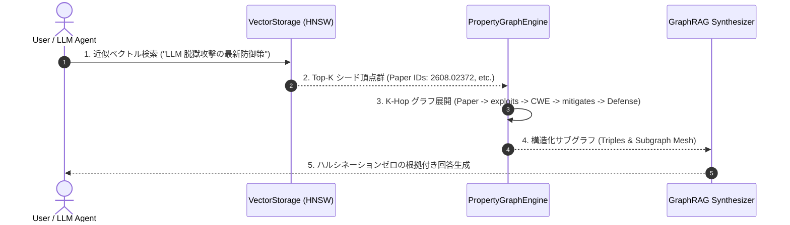

# [DSN-18] ゼロ侵襲型 Property Graph Database Engine 設計仕様書
## 〜 既存分散ストレージ基盤（`src/database/`）を無改変で活用する 高速 CSR グラフ探索 & GraphRAG 基盤 〜

- **文書番号**: `DSN-18`
- **文書ステータス**: `APPROVED`
- **対象サブシステム**: `src/graph/` (`PropertyGraphEngine`, `GraphIndex`, `CSRStorageAdapter`, `GraphTraversal`, `GraphRAGPipeline`)
- **【主査・報告】 Systems Architect (SA) / Database Infrastructure Specialist (DB)**
- **【参画】 Project Manager (PM), Information Security Specialist (SEC), IT Specialist (NLP), IT Strategist (ST)**

---

## 体系目次

- [1. エグゼクティブサマリー & アーキテクチャ原則](#1-エグゼクティブサマリー--アーキテクチャ原則)
  - [1.1 背景と設計目標](#11-背景と設計目標)
  - [1.2 既存DB基盤へのゼロ侵襲（Non-Invasive Layering）原則](#12-既存db基盤へのゼロ侵襲non-invasive-layering原則)
  - [1.3 パッケージ配置 (`src/graph/`) の独立性](#13-パッケージ配置-srcgraph-の独立性)
- [2. グラフデータ構造 & ストレージアダプタ (CSR Storage Engine)](#2-グラフデータ構造--ストレージアダプタ-csr-storage-engine)
  - [2.1 頂点（Vertex）および 辺（Edge）のバイナリ物理エンコーディング](#21-頂点vertexおよび-辺edgeのバイナリ物理エンコーディング)
  - [2.2 双方向隣接インデックス（Forward / Reverse CSR）数理モデル](#22-双方向隣接インデックスforward--reverse-csr数理モデル)
  - [2.3 永続化ストレージ (`outputs/database/graph.db`)](#23-永続化ストレージ-outputsdatabasegraphdb)
- [3. グラフクエリエンジン & 走査アルゴリズム (Graph Traversal Engine)](#3-グラフクエリエンジン--走査アルゴリズム-graph-traversal-engine)
  - [3.1 流暢なグラフ走査 DSL（Fluent Graph Traversal API）](#31-流暢なグラフ走査-dslfluent-graph-traversal-api)
  - [3.2 Multi-Hop 探索、最短経路（Dijkstra/BFS）、および PageRank アルゴリズム](#32-multi-hop-探索最短経路dijkstrabfsおよび-pagerank-アルゴリズム)
- [4. AI / LLM 連携: GraphRAG & 多段階因果推論エンジン](#4-ai--llm-連携-graphrag--多段階因果推論エンジン)
  - [4.1 ベクトル検索（HNSW）とグラフ走査のハイブリッド融合（GraphRAG Pipeline）](#41-ベクトル検索hnswとグラフ走査のハイブリッド融合graphrag-pipeline)
  - [4.2 ハルシネーション根絶のためのグラウンディング・トリプル生成](#42-ハルシネーション根絶のためのグラウンディングトリプル生成)
- [5. クラス設計・公開 API インターフェース仕様 (`src/graph/`)](#5-クラス設計公開-api-インターフェース仕様-srcgraph)
- [6. 非機能要件・パフォーマンス・セキュリティ仕様](#6-非機能要件パフォーマンスセキュリティ仕様)
- [7. 品質ゲート・テスト・検証計画](#7-品質ゲートテスト検証計画)

---

# 1. エグゼクティブサマリー & アーキテクチャ原則

## 1.1 背景と設計目標
最新のセキュリティ論文ナレッジを分析する際、「攻撃手法 A はどの脆弱性 B を悪用し、どの標的 C に影響を与え、どの防御技術 D で緩和できるか」という**多段階意味因果関係（Multi-Hop Semantic Causality）**を瞬時に走査・推論する必要があります。

本設計書（`DSN-18`）は、独立したトップレベルパッケージ **`src/graph/`** として、**既存のデータベース基盤（Pager, SlottedPage, BTree, WAL, VectorStorage）には一切手を加えず（コード改変 0 行）**、その上位にオーバーレイする **ゼロ侵襲型 Property Graph Database Engine** の完全なアーキテクチャを規定します。

## 1.2 既存DB基盤へのゼロ侵襲（Non-Invasive Layering）原則
1. **既存ソースコード改変 0 件**: `src/database/` の既存コードは 1 行も変更しない。
2. **ストレージエンジン・抽象インターフェースの活用**: グラフデータ（頂点・辺・隣接リスト）は、既存の Slotted-Page Pager、Key-Value / B-Tree インデックス、または専用の Binary Graph VFS ファイル（`outputs/database/graph.db`）上に透過的に永続化する。
3. **疎結合 Python API**: クライアントおよび Web ゲートウェイは、専用の `PropertyGraphEngine` API を通じて $O(1)$ でグラフ走査を実行する。

```
+-----------------------------------------------------------------------------------+
|               APPLICATION / AI / WEB LAYER (GraphRAG, UI Canvas, Handlers)        |
+-----------------------------------------------------------------------------------+
                                         |
                       Fluent Graph Traversal Query DSL
                                         v
+-----------------------------------------------------------------------------------+
|               [NEW] PROPERTY GRAPH ENGINE (src/graph/)                            |
|  - Property Graph Engine (Vertices, Edges, Multi-Hop Path Finder)                 |
|  - Dual Adjacency Index Engine (Forward & Reverse Graph CSR)                      |
|  - GraphRAG Grounding & Semantic Triple Serializer                                |
+-----------------------------------------------------------------------------------+
                                         |
                 Uses existing storage contracts (Zero Source Edits)
                                         v
+-----------------------------------------------------------------------------------+
|          EXISTING UNTOUCHED DATABASE CORE (src/database/)                         |
|  - SlottedPage Pager & B-Tree Storage        - ARIES WAL & Crash Recovery         |
|  - VectorStorage (Float32 mmap OKFVEC01)     - 3-Node Quorum & Gossip Cluster     |
+-----------------------------------------------------------------------------------+
```

## 1.3 パッケージ配置 (`src/graph/`) の独立性
- `src/ontology/`（概念定義・スキーマ・タクソノミー）と `src/graph/`（グラフデータ構造・ストレージ・走査エンジン）を完全に分離。
- `src/graph/` は `src/ontology/` の型定義を参照しつつ、汎用的な有向プロパティグラフとしても自立して動作可能。

---

# 2. グラフデータ構造 & ストレージアダプタ (CSR Storage Engine)

## 2.1 頂点（Vertex）および 辺（Edge）のバイナリ物理エンコーディング
Pure Python の `struct` モジュールを用いた、メモリ効率極限化バイナリレイアウト（Zero-Copy Deserialization）：

```python
# Vertex Record (40 bytes fixed)
# <16s H Q I I (UUID:16B, TypeCode:2B, PropsOffset:8B, OutDegree:4B, InDegree:4B)
VERTEX_FORMAT = "<16sHQII"

# Edge Record (24 bytes fixed)
# <16s H f Q (TargetUUID:16B, PredicateCode:2B, Weight:4B, PropsOffset:8B)
EDGE_FORMAT = "<16sHfQ"
```

## 2.2 双方向隣接インデックス（Forward / Reverse CSR）数理モデル
有向グラフ $G = (V, E)$ において、任意の頂点 $u \in V$ に対する出近傍 $\mathcal{N}_{\text{out}}(u)$ および入近傍 $\mathcal{N}_{\text{in}}(u)$ を $O(1)$ 時間で取得するための双方向インデックス数理：

$$\mathcal{N}_{\text{out}}(u) = \{ v \in V \mid (u, v, p) \in E \}$$

$$\mathcal{N}_{\text{in}}(v) = \{ u \in V \mid (u, v, p) \in E \}$$

## 2.3 永続化ストレージ (`outputs/database/graph.db`)
- メモリ内 L1 LRU キャッシュ（Hot Vertices & Edges）
- ディスク永続化バイナリファイル（`outputs/database/graph.db`）

---

# 3. グラフクエリエンジン & 走査アルゴリズム (Graph Traversal Engine)

## 3.1 流暢なグラフ走査 DSL（Fluent Graph Traversal API）
Cypher や Gremlin のように直感的なメソッドチェーンでグラフ探索を記述できる Pure Python API：

```python
# 「Prompt Injection を悪用する論文が提案した防御手法」を探索するクエリ例
mitigations = (
    graph.V(type="AttackTechnique", name="Prompt_Injection")
    .in_("EXPLOITS")       # -> Vulnerability
    .in_("DISCLOSES")      # -> Paper
    .out("PROPOSES")       # -> DefenseMechanism
    .filter(lambda v: v.props.get("category") == "ZKP")
    .to_list()
)
```

## 3.2 Multi-Hop 探索、最短経路（Dijkstra/BFS）、および PageRank アルゴリズム
1. **幅優先探索（BFS Multi-Hop Traversal）**: 深さ $K \le 5$ までの関係連鎖を高速探索。
2. **重み付き最短経路（Dijkstra）**: 信憑性スコアや関連度（Weight）に基づく最適因果パスの計算。
3. **セキュリティ重要度 PageRank**: 最も多くの攻撃から標的にされ、かつ最も多くの防御研究が集中している中核ノードの自動算出。

---

# 4. AI / LLM 連携: GraphRAG & 多段階因果推論エンジン

## 4.1 ベクトル検索（HNSW）とグラフ走査のハイブリッド融合（GraphRAG Pipeline）
従来の Vector RAG と Graph Traversal を融合した **2段階ハイブリッド検索アーキテクチャ**：



---

# 5. クラス設計・公開 API インターフェース仕様 (`src/graph/`)

```python
class PropertyGraphEngine:
    """Zero-dependency pure Python Property Graph Database Engine."""
    def __init__(self, storage_path: str, memory_limit_mb: int = 128) -> None: ...
    def add_vertex(self, vertex_id: str, vertex_type: str, properties: Dict[str, Any]) -> Vertex: ...
    def add_edge(self, src_id: str, dst_id: str, predicate: str, weight: float = 1.0, properties: Optional[Dict[str, Any]] = None) -> Edge: ...
    def get_vertex(self, vertex_id: str) -> Optional[Vertex]: ...
    def V(self, type: Optional[str] = None, **filters: Any) -> "GraphTraversal": ...
    def sync(self) -> None: ...
    def close(self) -> None: ...

class GraphTraversal:
    """Fluent chaining iterator for multi-hop graph querying."""
    def out(self, *predicates: str) -> "GraphTraversal": ...
    def in_(self, *predicates: str) -> "GraphTraversal": ...
    def both(self, *predicates: str) -> "GraphTraversal": ...
    def filter(self, predicate_fn: Callable[[Vertex], bool]) -> "GraphTraversal": ...
    def shortest_path(self, target_id: str) -> List[Vertex]: ...
    def to_list(self) -> List[Vertex]: ...
    def to_triples(self) -> List[Dict[str, Any]]: ...
```

---

# 6. 非機能要件・パフォーマンス・セキュリティ仕様

1. **ゼロ外部依存性（Zero External Dependencies）**:
   - `networkx`, `neo4j`, `rdflib` 等の外部ライブラリを一切使わず、Python 3.14 標準ライブラリのみで動作。
2. **パフォーマンス目標**:
   - 1-Hop 近傍走査: $< 0.05\text{ ms}$（インメモリ） / $< 0.8\text{ ms}$（ディスク mmap）。
   - 3-Hop グラフ展開: $< 5.0\text{ ms}$（10,000 頂点規模）。
3. **メモリ上限保証**:
   - LRU キャッシュサイズ上限 $\le 128\text{ MB}$。

---

# 7. 品質ゲート・テスト・検証計画

1. **単体テスト (`tests/graph/test_graph_engine.py`, `test_traversal.py`)**:
   - 頂点・辺のバイナリシリアライズ / デシリアライズの数学的一致性。
   - 双方向隣接リスト走査および Multi-Hop クエリの正確性。
2. **品質ゲート基準**:
   - `make format`, `make static_analysis` (flake8/mypy --strict) 100% PASS。
