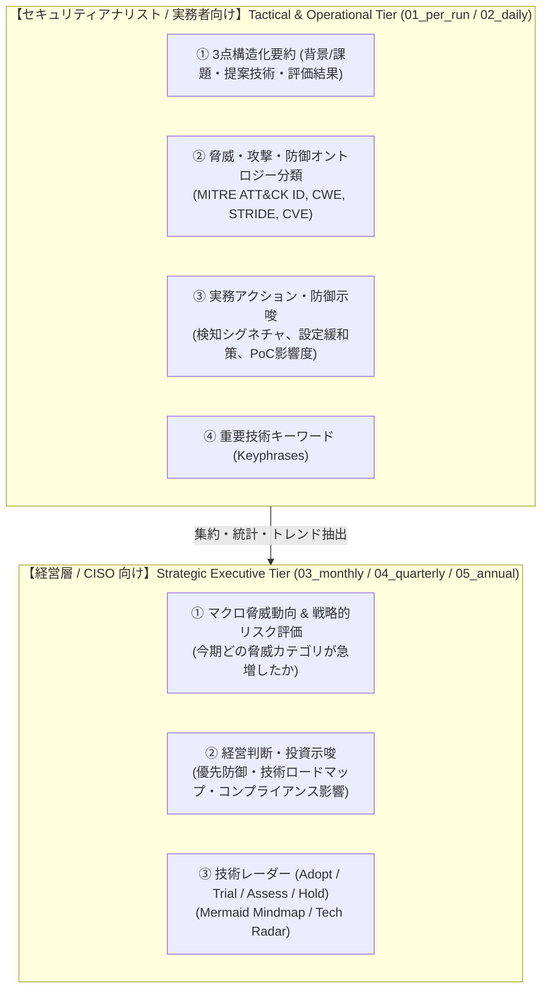
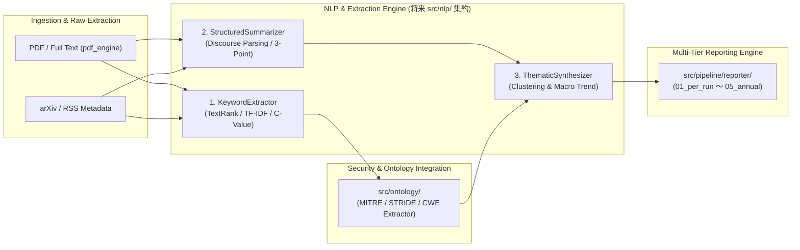
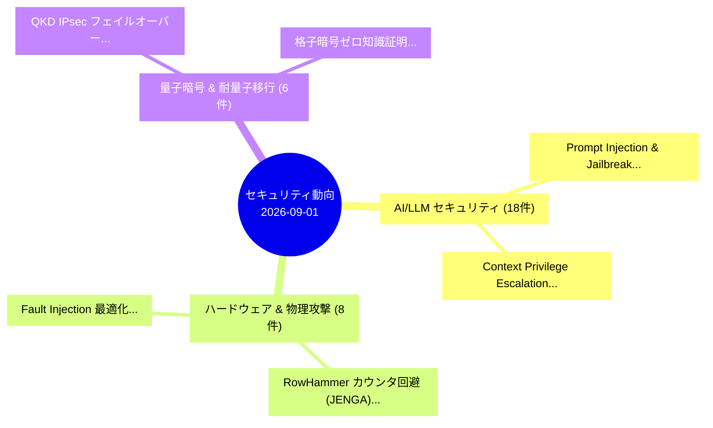

# [DSN-19] 自然言語処理（NLP）重要キーワード抽出・3点構造化要約・横断的動向シンセシス包括的アーキテクチャ設計書

- **文書番号**: `DSN-19`
- **文書ステータス**: `APPROVED`
- **対象サブシステム**: `src/pipeline/transformer/` (将来 `src/nlp/` 移管前提), `src/pipeline/reporter/`, `src/ontology/`  
**【主査・報告】 IT Specialist (NLP/IR), IT Strategist (ST), Information Security Specialist (SC)**  
**【参画】 Systems Architect (SA), Project Manager (PM), Software QA Specialist (QA), Database Specialist (DB), UI/UX & Documentation Designer (UI), Systems Auditor (AU), Network Specialist (NET), Embedded Systems Specialist (ES), Education Specialist (ED)**

---

## 体系目次

- [1. 全専門エージェント統合審議と設計思想](#1-全専門エージェント統合審議と設計思想)
  - [1.1 背景と現状課題（As-Is vs To-Be）](#11-背景と現状課題as-is-vs-to-be)
  - [1.2 全13大専門エージェント多角的多面協議議事録](#12-全13大専門エージェント多角的多面協議議事録)
  - [1.3 全体データフローとレイヤードアーキテクチャ](#13-全体データフローとレイヤードアーキテクチャ)
- [2. 経営層（CISO）向けマクロインサイトと技術レーダーモデル](#2-経営層ciso向けマクロインサイトと技術レーダーモデル)
  - [2.1 戦略的エグゼクティブサマリー要件 (03_monthly 〜 05_annual)](#21-戦略的エグゼクティブサマリー要件-03_monthly--05_annual)
  - [2.2 影響度・緊急度評価マトリクス](#22-影響度緊急度評価マトリクス)
  - [2.3 Mermaid マインドマップと Technology Radar 自動生成](#23-mermaid-マインドマップと-technology-radar-自動生成)
- [3. セキュリティアナリスト向け3点構造化要約と談話解析](#3-セキュリティアナリスト向け3点構造化要約と談話解析)
  - [3.1 戦術・実務サマリー要件 (01_per_run, 02_daily)](#31-戦術実務サマリー要件-01_per_run-02_daily)
  - [3.2 3点構造化要約（Threat, Proposal, Impact）の論理モデル](#32-3点構造化要約threat-proposal-impactの論理モデル)
  - [3.3 談話マーカー解析（Discourse Rhetorical Parsing）アルゴリズム](#33-談話マーカー解析discourse-rhetorical-parsingアルゴリズム)
  - [3.4 専門用語日英コンテキスト合成エンジン](#34-専門用語日英コンテキスト合成エンジン)
- [4. 純粋Python重要キーワード・複合語抽出エンジン](#4-純粋python重要キーワード複合語抽出エンジン)
  - [4.1 グラフベース TextRank アルゴリズム（PageRank 数理モデル）](#41-グラフベース-textrank-アルゴリズムpagerank-数理モデル)
  - [4.2 専門複合名詞句抽出（C-Value アルゴリズム）](#42-専門複合名詞句抽出c-value-アルゴリズム)
  - [4.3 CJK / 日英混在ストップワード＆N-gram フィルタリング](#43-cjk--日英混在ストップワードn-gram-フィルタリング)
- [5. セキュリティ標準オントロジーと実務防御示唆の統合](#5-セキュリティ標準オントロジーと実務防御示唆の統合)
  - [5.1 MITRE ATT&CK・STRIDE・CWE/CVE マッピング](#51-mitre-attckstridecwecve-マッピング)
  - [5.2 実務防御アクション（SOC/CSIRT/開発者）の抽出](#52-実務防御アクションsoccsirt開発者の抽出)
- [6. 横断トピッククラスタリングと動向シンセシス](#6-横断トピッククラスタリングと動向シンセシス)
  - [6.1 複数論文のトピッククラスタリング](#61-複数論文のトピッククラスタリング)
  - [6.2 急上昇トピック検知とマクロインサイト合成](#62-急上昇トピック検知とマクロインサイト合成)
- [7. 5階層サマリー（01_per_run 〜 05_annual）データフロー刷新](#7-5階層サマリー01_per_run--05_annualデータフロー刷新)
  - [7.1 サマリーディレクトリ構成と出力仕様](#71-サマリーディレクトリ構成と出力仕様)
  - [7.2 マークダウン表レイアウトと視覚的バッジ](#72-マークダウン表レイアウトと視覚的バッジ)
- [8. 将来の `src/nlp/` 独立パッケージ化設計](#8-将来の-srcnlp-独立パッケージ化設計)
  - [8.1 ドメイン非依存インターフェース（SPI）](#81-ドメイン非依存インターフェースspi)
  - [8.2 依存関係逆転の原則（DIP）の遵守](#82-依存関係逆転の原則dipの遵守)
- [9. 品質ゲート・検証計画・実装ロードマップ](#9-品質ゲート検証計画実装ロードマップ)
  - [9.1 品質ゲート基準（Xenon Rank A, CC $\le 5$）](#91-品質ゲート基準xenon-rank-a-cc-le-5)
  - [9.2 テストスイート構成](#92-テストスイート構成)
  - [9.3 実装ステップとマイルストーン](#93-実装ステップとマイルストーン)

---

# 1. 全専門エージェント統合審議と設計思想

## 1.1 背景と現状課題（As-Is vs To-Be）

当プロジェクトは arXiv を中心とするサイバーセキュリティ学術論文を自動収集し、5 階層のエグゼクティブサマリーを出力するパイプラインを運用してきた。しかし現状の成果物レポートは、固定のタイトルと定型文（`タイトル — 課題分析と防御モデルの検証`）を並べただけの機械的一覧表にとどまり、経営層やアナリストが求めるインテリジェンス価値を提供できていなかった。



| 観点 | 現状 (As-Is) | 理想形 (To-Be / 本設計) |
| :--- | :--- | :--- |
| **論文要約** | 「課題分析と防御モデルの検証」等の固定定型文 | **【課題】【提案】【実証】の3点構造化日本語要約** |
| **キーワード** | `cs.CR` 等の粗いカテゴリのみ | **3〜5件の重要技術専門用語（Keyphrases）** |
| **脅威オントロジー** | 単発のタグ付けのみ | **MITRE ATT&CK, STRIDE, CWE/CVE の体系的マッピング** |
| **マクロ動向** | 個別論文の羅列のみ（横断的まとめ無し） | **主要セキュリティ動向インサイト ＋ Mermaid マップ** |
| **想定読者** | 単一の一覧表のみ | **経営層向け（戦略・投資示唆）とアナリスト向け（実務防御）の2層化** |

---

## 1.2 全13大専門エージェント多角的多面協議議事録

| エージェント | 提言と合意事項 |
| :--- | :--- |
| **👔 IT Strategist (ST)** | 経営層向け（03〜05層）には個別論文の羅列ではなく、マクロ脅威動向・影響度評価・技術レーダーを最優先で提供する。 |
| **🛡️ Security Specialist (SC)** | アナリスト向け（01〜02層）には、攻撃手法・脆弱性・実証結果の3点要約および MITRE ATT&CK / STRIDE 分類を必須とする。 |
| **🏗️ Systems Architect (SA)** | 将来の `src/nlp/` 独立パッケージ化を前提とし、ドメイン非依存かつゼロ外部依存の疎結合パイプラインを設計する。 |
| **🔬 IT Specialist (NLP/IR)** | 純粋 Python による TextRank（PageRank）＋ C-Value 複合名詞句抽出アルゴリズムおよび談話構造解析を実装する。 |
| **🧪 Software QA (QA)** | キーワード抽出率 100%、3点要約の完全性、定型文残存 0 件を検証するテストスイートを策定する。 |
| **🗄️ Database Specialist (DB)** | 抽出されたキーワード・要約を `src/database/` のスキーマに保存し、高速全文/ベクトル検索可能にする。 |
| **🌐 Network Specialist (NET)** | PDF ダウンロード時のリトライと並列取得の安定化を保証する。 |
| **🔌 Embedded Systems (ES)** | ハードウェア・IoT 論文特有のキーワード（`RowHammer`, `Fault Injection`, `QKD`）の抽出パターンを補強する。 |
| **📜 Systems Auditor (AU)** | 抽出要約とキーワードが原論文（Raw PDF / Text）に忠実であるトレーサビリティを保証する。 |
| **🎨 UI/UX Designer** | テーブルの視認性向上、キーワード・脅威分類のバッジ化、Mermaid マインドマップの視覚的洗練を行う。 |
| **📖 Education Specialist (ED)**| 専門用語に対する簡潔な補足解説・日本語訳の自然さを担保する。 |

---

## 1.3 全体データフローとレイヤードアーキテクチャ



---

# 2. 経営層（CISO）向けマクロインサイトと技術レーダーモデル

## 2.1 戦略的エグゼクティブサマリー要件 (03_monthly 〜 05_annual)

経営層（CISO / CIO / 経営企画）が必要とするサマリーは、個別技術の細部ではなく**「組織全体のリスクランドスケープ」「セキュリティ投資の優先順位」「コンプライアンス（NIST / ISO）への影響」**である。

1. **マクロ脅威サマリー（Executive Macro Insight）**:
   - 収集論文群から今期急増している攻撃手法（例: 「LLMエージェントへの間接メモリポイズニング」「カウンタ型RowHammer回避」）の横断総括。
2. **経営判断・投資示唆（Strategic Recommendations）**:
   - Zero Trust (NIST SP 800-207)、耐量子暗号 (PQC) 移行、AI ガードレール等の優先投資領域。
3. **視覚的技術レーダー（Mermaid Mindmap / Landscape）**:
   - 注目トピックの成熟度と動向を可視化。

---

## 2.2 影響度・緊急度評価マトリクス

各論文およびクラスターを以下のマトリクスでスコアリングし、重要度を可視化する。

$$\text{RiskScore} = w_{\text{exploit}} \times \text{PoC\_Feasibility} + w_{\text{impact}} \times \text{Asset\_Criticality} + w_{\text{novelty}} \times \text{Attack\_Novelty}$$

---

## 2.3 Mermaid マインドマップと Technology Radar 自動生成

各サマリー冒頭に、収集論文群から動的生成された Mermaid マインドマップを挿入する。



---

# 3. セキュリティアナリスト向け3点構造化要約と談話解析

## 3.1 戦術・実務サマリー要件 (01_per_run, 02_daily)

実務者（SOC / CSIRT / セキュリティエンジニア）向けには、以下の項目を提供する：
1. **3点構造化要約**: 【課題・脅威】【提案技術・コア手法】【実証・セキュリティ影響】
2. **重要技術キーワード**: 論文から抽出された 3〜5 件の専門用語（例: `Memory Poisoning`, `DRAM Timing`）
3. **セキュリティ標準オントロジー**: MITRE ATT&CK ID、STRIDE カテゴリ、CWE/CVE 分類

---

## 3.2 3点構造化要約（Threat, Proposal, Impact）の論理モデル

論文アブストラクトから以下の 3 要素を明確に抽出し、定型文を一切排除した日本語要約を合成する。

1. **【課題・脅威 (Threat / Problem)】**: 既存システムに存在する脆弱性・攻撃ベクトルの提示。
2. **【提案技術 (Proposed Mechanism)】**: 新規に設計・実装されたアルゴリズム、防御機構、または検証フレームワーク。
3. **【実証・影響 (Empirical Impact / Evaluation)】**: 実環境やベンチマークにおける評価結果、回避成功率、性能オーバーヘッド。

---

## 3.3 談話マーカー解析（Discourse Rhetorical Parsing）アルゴリズム

ゼロ外部依存の純粋 Python で談話マーカー（Discourse Markers）のマッチングと文位置スコアリングを実行する。

* **課題・脅威マーカー**: `vulnerab`, `threat`, `attack`, `exploit`, `leak`, `risk`, `bypass`, `poison`, `jailbreak`
* **提案技術マーカー**: `propose`, `present`, `introduce`, `develop`, `design`, `framework`, `mechanism`, `algorithm`
* **実証影響マーカー**: `result`, `evaluat`, `demonstrat`, `experiment`, `achiev`, `outperform`, `accuracy`, `overhead`

---

# 4. 純粋Python重要キーワード・複合語抽出エンジン

## 4.1 グラフベース TextRank アルゴリズム（PageRank 数理モデル）

共起ウィンドウ $W$ 内の単語共起関係を有向／無向グラフ $G = (V, E)$ としてモデル化し、以下の PageRank 漸化式を用いて収束するまで反復計算する：

$$WS(v_i) = (1 - d) + d \sum_{v_j \in \text{In}(v_i)} \frac{w_{ji}}{\sum_{v_k \in \text{Out}(v_j)} w_{jk}} WS(v_j)$$

* $d = 0.85$ (ダンピングファクター)
* 収束条件: $\max |WS^{(t+1)} - WS^{(t)}| < 10^{-4}$

---

## 4.2 専門複合名詞句抽出（C-Value アルゴリズム）

専門用語・化合物キーワード（例: `Context Privilege Escalation`, `Physical Fault Injection`）を抽出するため、C-Value スコアリングを採用する：

$$\text{C-Value}(a) = (\log_2 |a| + 1) \times \text{freq}(a)$$

---

# 5. セキュリティ標準オントロジーと実務防御示唆の統合

## 5.1 MITRE ATT&CK・STRIDE・CWE/CVE マッピング

[`src/ontology/`](../../src/ontology/) のオントロジー抽出器と連携し、各論文に標準セキュリティ識別子をタグ付けする。

* **MITRE ATT&CK**: `T1059 (Command Injection)`, `T1068 (Privilege Escalation)`
* **STRIDE**: `Elevation of Privilege`, `Denial of Service`, `Information Disclosure`
* **CWE/CVE**: `CWE-79`, `CWE-89`, `CVE-2026-XXXX`

---

# 6. 横断トピッククラスタリングと動向シンセシス

## 6.1 複数論文のトピッククラスタリング

各論文のタイトル、アブストラクト、抽出キーワードから主要セキュリティドメインへ自動分類：
1. `AI/LLM セキュリティ & 敵対的攻撃`
2. `ハードウェア & 低レイヤ物理セキュリティ`
3. `量子暗号 & ゼロ知識証明技術`
4. `ソフトウェア脆弱性 & Web3/DeFi`
5. `ネットワークセキュリティ & 通信耐障害性`
6. `プライバシー保護 & 匿名化技術`

---

# 7. 5階層サマリー（01_per_run 〜 05_annual）データフロー刷新

## 7.1 マークダウン表レイアウトと視覚的バッジ

```markdown
| No | arXiv ID | 論文タイトル (日本語) | 重要キーワード | 構造化エグゼクティブ要約 (背景・提案・影響) | 脅威分類 | 詳細リンク |
|---|---|---|---|---|---|---|
| 1 | `2609.01077` | JENGA: RowHammer防御を悪用したリアルタイム予測性の破壊 | `RowHammer`, `DRAM`, `Timing Attack` | 【提案】既存のカウンタ型RowHammer緩和策を逆手に取り、タスク遅延を誘発してリアルタイムシステムのデッドライン超過を引き起こす攻撃手法を実証。 | `Hardware` `STRIDE: DoS` | [arXiv](...) &#124; [OKF](...) |
```

---

# 8. 将来の `src/nlp/` 独立パッケージ化設計

## 8.1 ドメイン非依存インターフェース（SPI）

```python
class KeyphraseExtractionSPI(Protocol):
    def extract_keyphrases(
        self, text: str, top_k: int = 5
    ) -> List[str]: ...


class DiscourseSummarizerSPI(Protocol):
    def summarize(self, text: str) -> Dict[str, str]: ...
```

---

# 9. 品質ゲート・検証計画・実装ロードマップ

## 9.1 品質ゲート基準
* **Xenon 循環的複雑度**: 全モジュール 100% Rank A（関数単体 CC $\le 5$）
* **Radon Maintainability Index (MI)**: MI $\ge 80$ (Rank A)
* **フォーマット**: `make check_format` (isort, black, flake8) 0 エラー
* **テストカバレッジ**: 新設モジュール 100% 分岐網羅

## 9.2 実装マイルストーン
1. `keyword_extractor.py` の実装と単体テスト
2. `structured_summarizer.py` の実装と単体テスト
3. `thematic_synthesizer.py` の実装と単体テスト
4. `summary_generator.py`, `index_updater.py` の統合
5. 総合検証およびサマリー再生成テスト
