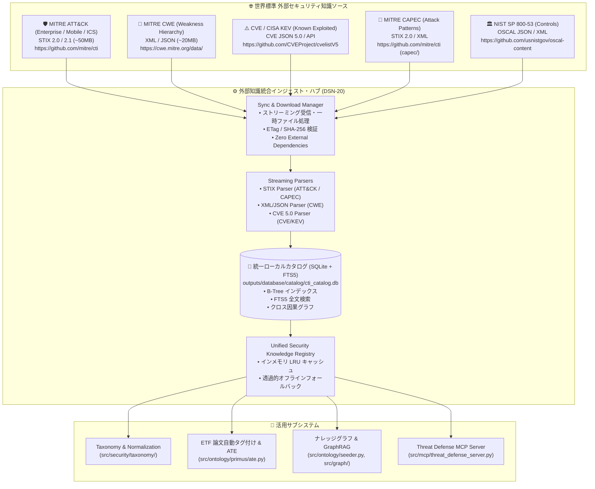
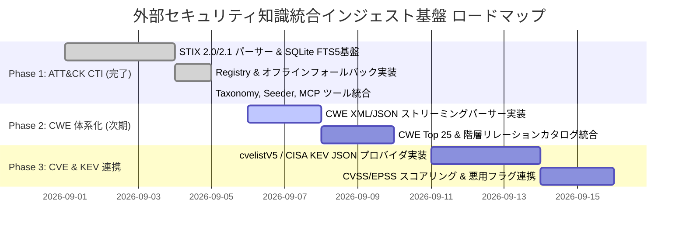

# [DSN-20] 外部セキュリティ知識データセット（MITRE ATT&CK / CWE / CVE 等）統合インジェスト・ローカルカタログ管理基盤設計仕様書
## 〜 Zero External Dependencies・プラグイン型ストリーミング同期・統一SQLite+FTS5カタログ・オントロジー＆MCP連携 〜

- **文書番号**: `DSN-20`
- **文書ステータス**: `APPROVED`
- **対象サブシステム**:
  - `src/security/cti/` (`CTISyncManager`, `STIXCTIParser`, `CTICatalogStorage`, `MITRECTIRegistry`)
  - `src/security/taxonomy/` (`mitre.py`, `cwe.py`, `stride.py`)
  - `src/ontology/seeder.py` (`PropertyGraphEngine` シード)
  - `src/mcp/threat_defense_server.py` (`search_mitre_cti`, 脅威カバレッジ診断)
  - `Makefile` (`sync_cti`, `sync_all_knowledge`)
- **【主査・報告】 Information Security Specialist (SEC) / Systems Architect (SA)**
- **【参画】 Project Manager (PM), Database Specialist (DB), Network Specialist (NET), IT Specialist (NLP & Info Retrieval), IT Strategist (ST), Systems Auditor (AUD)**

---

## 体系目次

- [1. 背景と目的 (Motivation & Strategic Scope)](#1-背景と目的-motivation--strategic-scope)
  - [1.1 課題認識: 個別・静的定義から統合外部知識基盤へのパラダイムシフト](#11-課題認識-個別静的定義から統合外部知識基盤へのパラダイムシフト)
  - [1.2 取り込むべき外部セキュリティ知識データセットの全体像](#12-取り込むべき外部セキュリティ知識データセットの全体像)
  - [1.3 13大専門エージェントによる多角的ガバナンス](#13-13大専門エージェントによる多角的ガバナンス)
- [2. 統合インジェスト・カタログの大枠アーキテクチャ](#2-統合インジェストカタログの大枠アーキテクチャ)
  - [2.1 設計思想: Zero External Dependencies & プラグイン型プロバイダ](#21-設計思想-zero-external-dependencies--プラグイン型プロバイダ)
  - [2.2 取り込み方式の比較検証 (方式A / 方式B / 方式C)](#22-取り込み方式の比較検証-方式a--方式b--方式c)
  - [2.3 共通プロバイダ・ライフサイクル仕様](#23-共通プロバイダライフサイクル仕様)
- [3. マルチデータセット・プロバイダ仕様](#3-マルチデータセットプロバイダ仕様)
  - [3.1 [Phase 1: 本実装] MITRE ATT&CK CTI (STIX 2.0/2.1) プロバイダ](#31-phase-1-本実装-mitre-attck-cti-stix-2021-プロバイダ)
  - [3.2 [Phase 2: 拡張仕様] CWE (Common Weakness Enumeration) プロバイダ](#32-phase-2-拡張仕様-cwe-common-weakness-enumeration-プロバイダ)
  - [3.3 [Phase 3: 拡張仕様] CVE (Common Vulnerabilities and Exposures) & KEV プロバイダ](#33-phase-3-拡張仕様-cve-common-vulnerabilities-and-exposures--kev-プロバイダ)
  - [3.4 [Phase 4: 拡張仕様] CAPEC & NIST SP 800-53 プロバイダ](#34-phase-4-拡張仕様-capec--nist-sp-800-53-プロバイダ)
- [4. 統一SQLiteカタログ ＆ FTS5 スキーマ設計](#4-統一sqliteカタログ--fts5-スキーマ設計)
  - [4.1 物理テーブル構成 (Relational Schema)](#41-物理テーブル構成-relational-schema)
  - [4.2 クロス照合リレーションシップ (Cross-Knowledge Graph)](#42-クロス照合リレーションシップ-cross-knowledge-graph)
  - [4.3 高速全文検索 (FTS5) 仮想テーブル](#43-高速全文検索-fts5-仮想テーブル)
- [5. コンポーネント詳細設計 (`src/security/cti/`)](#5-コンポーネント詳細設計-srcsecuritycti)
  - [5.1 `CTISyncManager` (同期マネージャ)](#51-ctisyncmanager-同期マネージャ)
  - [5.2 `STIXCTIParser` (ストリーミングSTIXパーサー)](#52-stixctiparser-ストリーミングstixパーサー)
  - [5.3 `CTICatalogStorage` (SQLite WAL + FTS5 ストレージ)](#53-cticatalogstorage-sqlite-wal--fts5-ストレージ)
  - [5.4 `MITRECTIRegistry` (統合レジストリ & キャッシュ & フォールバック)](#54-mitrectiregistry-統合レジストリ--キャッシュ--フォールバック)
- [6. 既存サブシステム連携仕様](#6-既存サブシステム連携仕様)
  - [6.1 `src/security/taxonomy/mitre.py` 連携](#61-srcsecuritytaxonomymitrepy-連携)
  - [6.2 `src/ontology/seeder.py` (ナレッジグラフシード) 連携](#62-srcontologyseederpy-ナレッジグラフシード-連携)
  - [6.3 `src/mcp/threat_defense_server.py` (MCP) 連携](#63-srcmcpthreat_defense_serverpy-mcp-連携)
  - [6.4 `Makefile` 自動化ターゲット](#64-makefile-自動化ターゲット)
- [7. 非機能要件・セキュリティ・品質基準](#7-非機能要件セキュリティ品質基準)
  - [7.1 Zero External Runtime Dependencies](#71-zero-external-runtime-dependencies)
  - [7.2 Strict Quality Gates (Linter ignore 完全禁止、Rank A 複雑度、型安全性)](#72-strict-quality-gates-linter-ignore-完全禁止rank-a-複雑度型安全性)
  - [7.3 メモリ最適化・耐障害性・冪等性](#73-メモリ最適化耐障害性冪等性)
- [8. 段階的実装ロードマップと検証計画](#8-段階的実装ロードマップと検証計画)

---

# 1. 背景と目的 (Motivation & Strategic Scope)

## 1.1 課題認識: 個別・静的定義から統合外部知識基盤へのパラダイムシフト
サイバーセキュリティ学術研究（`cs.CR`）や脅威インテリジェンス分析においては、**単一の枠組みだけではサイバー脅威の全貌を表現できません**。
論文中で提案される攻撃手法や防御策は、以下の多層的なセキュリティ標準概念が相互に絡み合って構成されています：

- **「攻撃者が何を行うか（TTPs: 手口）」** ➔ **MITRE ATT&CK / ATLAS**
- **「ソフトウェアのどこに根本原因があるか（弱点）」** ➔ **CWE (Common Weakness Enumeration)**
- **「現実のどの製品・バージョンに悪用可能な穴があるか（脆弱性実例）」** ➔ **CVE (Common Vulnerabilities and Exposures)**
- **「攻撃者がどのような仕組みで弱点を突くか（攻撃パターン）」** ➔ **CAPEC (Common Attack Pattern Enumeration)**
- **「組織やシステムはどのような管理策で防ぐべきか（対策基準）」** ➔ **NIST SP 800-53 / ISO 27001**

これまで本システムでは、これらの一部を Python コード内の辞書（例: `src/security/taxonomy/mitre.py` の 7 件のテクニック、`cwe.py` の静的マップ）としてハードコード保持していました。
しかし、これでは最新の脅威（例: LLM 脆弱性悪用、サプライチェーン攻撃、クラウド特有の権限昇格）に追従できず、網羅的な論文分類や多段階因果推論（Multi-Hop Causality）に限界が生じていました。

本設計書（`DSN-20`）は、特定のデータセット単体にとどまらず、**「世界標準の外部セキュリティ知識データセット群を安全・軽量・一元的に取り込み、ローカルカタログとして高速提供する統合インジェスト基盤」** の全体アーキテクチャを定義します。

## 1.2 取り込むべき外部セキュリティ知識データセットの全体像



## 1.3 13大専門エージェントによる多角的ガバナンス

| エージェント | 分担役割・ガバナンス基準 |
| :--- | :--- |
| **Information Security Specialist (SEC)** | ATT&CK TTPs、CWE、CVE、KEV の国際標準タクソノミー整合性検証および脅威カバレッジ基準策定（主査） |
| **Systems Architect (SA)** | 外部知識インジェスト・カタログ基盤の共通抽象化、プロバイダ拡張性、サブシステム間データフロー統制（主査） |
| **Database Specialist (DB)** | SQLite WAL モード、4KB 整合性、FTS5 全文検索最適化、および `src/database` とのアーキテクチャ調和 |
| **Network Specialist (NET)** | GitHub Raw / Upstream API からのストリーミングダウンロード、ETag/If-Modified-Since、回線瞬断耐性 |
| **IT Specialist (NLP & Info Retrieval)** | 論文アブストラクトからの TTPs/CWE 同定、表記揺らぎ・エイリアス吸収、正規表現＋FTS5 ハイブリッド照合 |
| **IT Strategist (ST)** | 最新脅威動向と未研究・未対策領域（Research Gaps）の定量的可視化モデル策定 |
| **Software Quality Assurance (SQA)** | 冪等性（Idempotency）、オフラインフォールバック保証、テスト網羅率（Coverage >= 80%）検証 |
| **Systems Auditor (AUD)** | 取得データセットの来歴（Provenance）、ハッシュ整合性、およびライセンス遵守の監査 |

---

# 2. 統合インジェスト・カタログの大枠アーキテクチャ

## 2.1 設計思想: Zero External Dependencies & プラグイン型プロバイダ

本基盤の中核を成す設計原則は以下の3点です：

1. **Zero External Runtime Dependencies (標準ライブラリ至上主義)**:
   - `stix2`, `taxii2client`, `requests`, `lxml` などの外部 pip パッケージを追加しません。
   - Python 3.14+ 標準ライブラリ（`urllib.request`, `json`, `sqlite3`, `re`, `dataclasses`, `contextlib`, `tempfile`）のみで全データセットの取得・パース・格納を完結させます。
2. **Pluggable Provider Pattern (プラグイン型プロバイダ)**:
   - 各データセット（ATT&CK, CWE, CVE 等）は独立したプロバイダモジュールとして実装され、同一の統一インターフェースを通じてカタログストレージへ投入されます。
3. **Resilient Offline Fallback (オフライン完全動作保証)**:
   - 外部ネットワーク切断時や初回環境構築時でもシステム全体が一切例外停止しないよう、レジストリ層で組み込みコア定義への自動フォールバックを恒久保証します。

## 2.2 取り込み方式の比較検証 (方式A / 方式B / 方式C)

| 評価項目 | 方式A: 完全Git同梱型 | 方式B: 完全オンデマンドAPI取得型 | 方式C: ハイブリッド型 (CLI同期 + SQLiteカタログ + オフラインフォールバック) **【採用】** |
| :--- | :--- | :--- | :--- |
| **Gitリポジトリ容量** | ❌ 50MB〜100MBの巨大データが履歴に入りリポジトリ肥大化 | ⭕ 増加ゼロ | ⭕ **増加ゼロ（コードのみ）** |
| **閉域網・オフライン動作** | ⭕ 完全動作 | ❌ 外部接続不可環境で即座に動作停止 | ⭕ **一度同期すればローカルSQLiteで動作。未同期時も組み込みコア定義へ自動フォールバック** |
| **検索・ロード性能** | ❌ 起動時に毎回巨大JSON/XMLをパース（数秒の遅延と数百MBのメモリ消費） | ❌ 毎回ネットワーク遅延とパース遅延 | ⭕ **数ミリ秒**。SQLite B-Tree インデックスと FTS5 全文検索による瞬時応答 |
| **データ更新性** | ❌ 上流の更新ごとに手動コミットとPRが必要 | ⭕ 常に最新 | ⭕ **`make sync_cti` 等のコマンド一発で最新データにオンデマンド更新可能** |
| **ランタイム依存性** | ⭕ 標準ライブラリのみ | ⭕ 標準ライブラリのみ | ⭕ **標準ライブラリのみ (`urllib.request`, `json`, `sqlite3`)** |

## 2.3 共通プロバイダ・ライフサイクル仕様

すべての外部データセット取り込みは、以下の標準ライフサイクルに従って統一実行されます。

```mermaid
sequenceDiagram
    participant User as CLI / Makefile / Batch
    participant Sync as SyncManager
    participant Upstream as Upstream (GitHub/NVD)
    participant Parser as Streaming Parser
    participant Storage as SQLite Catalog Storage
    participant Reg as Registry & Fallback

    User->>Sync: sync(dataset_name)
    Sync->>Upstream: HTTP GET (Stream, 64KB chunk, TempFile)
    Upstream-->>Sync: 200 OK (Data Stream)
    Sync->>Parser: parse(temp_file_path)
    Parser->>Storage: batch_insert(entities, relations)
    Storage->>Storage: rebuild_fts_indexes()
    Storage-->>Sync: SyncSummary(inserted_counts)
    Sync-->>User: Report summary
    Note over Reg: Registry checks catalog presence;<br/>uses SQLite if populated,<br/>otherwise serves builtin fallback.
```

---

# 3. マルチデータセット・プロバイダ仕様

## 3.1 [Phase 1: 本実装] MITRE ATT&CK CTI (STIX 2.0/2.1) プロバイダ
- **提供元**: [mitre/cti (https://github.com/mitre/cti)](https://github.com/mitre/cti)
- **対象ファイル**: `enterprise-attack/enterprise-attack.json` (~45MB〜50MB)
- **抽出エンティティ**:
  - `attack-pattern`: Technique ID (`T1xxx`, `T1xxx.xxx`), 名称, 説明, 戦術フェーズ, プラットフォーム
  - `x-mitre-tactic`: Tactic ID (`TA00xx`), shortname (`execution`), 名称, 説明
  - `course-of-action`: Mitigation ID (`M10xx`), 名称, 説明
  - `relationship`: `subtechnique-of`, `mitigates`
- **フィルタリング**: `revoked: true` または `x_mitre_deprecated: true` のオブジェクトは除外。

## 3.2 [Phase 2: 拡張仕様] CWE (Common Weakness Enumeration) プロバイダ
- **提供元**: MITRE CWE Data (`https://cwe.mitre.org/data/`)
- **対象形式**: CWE XML (`cwec_v4.14.xml`) または JSON
- **抽出エンティティ**:
  - Weakness ID (`CWE-89`, `CWE-78`, `CWE-502` 等)
  - 抽象度区分 (`Pillar`, `Class`, `Base`, `Variant`)
  - 名称、詳細説明、悪用可能性、緩和策（Applicable Platforms, Mitigations）
  - CWE Top 25 ランク情報
- **リレーション**: `ChildOf`, `PeerOf`, `CanPrecede` (因果連鎖)

## 3.3 [Phase 3: 拡張仕様] CVE (Common Vulnerabilities and Exposures) & KEV プロバイダ
- **提供元**: CVE Project (`cvelistV5`) / CISA KEV (Known Exploited Vulnerabilities)
- **対象形式**: CVE 5.0 JSON / CISA KEV JSON
- **抽出エンティティ**:
  - CVE ID (`CVE-YYYY-NNNN`)
  - 関連 CWE ID、CVSS 基本スコア (v3.1 / v4.0)、EPSS 悪用予測スコア
  - CISA KEV 登録有無（Active Exploitation Flag: ゼロデイ・野生の悪用確認フラグ）
  - 影響製品 (CPE: Common Platform Enumeration)

## 3.4 [Phase 4: 拡張仕様] CAPEC & NIST SP 800-53 プロバイダ
- **CAPEC**: 攻撃パターン（`CAPEC-100` 等）と ATT&CK / CWE との対応関係
- **NIST SP 800-53**: セキュリティ管理策（`AC-3`, `SI-10` 等）と ATT&CK Mitigation とのクロス照合

---

# 4. 統一SQLiteカタログ ＆ FTS5 スキーマ設計

データベース配置: `outputs/database/catalog/cti_catalog.db`
ジャーナルモード: `WAL`、同期モード: `NORMAL`、接続管理: `contextlib.contextmanager` による完全自動クローズ。

## 4.1 物理テーブル構成 (Relational Schema)

```sql
-- ============================================================================
-- 1. MITRE ATT&CK ドメインテーブル
-- ============================================================================

CREATE TABLE IF NOT EXISTS cti_tactics (
    tactic_id TEXT PRIMARY KEY,       -- e.g. 'TA0002'
    shortname TEXT UNIQUE NOT NULL,   -- e.g. 'execution'
    name TEXT NOT NULL,               -- e.g. 'Execution'
    description TEXT,
    external_url TEXT
);

CREATE TABLE IF NOT EXISTS cti_techniques (
    technique_id TEXT PRIMARY KEY,    -- e.g. 'T1059' または 'T1059.001'
    name TEXT NOT NULL,               -- e.g. 'Command and Scripting Interpreter'
    description TEXT,
    is_subtechnique INTEGER DEFAULT 0,-- 0: 親テクニック, 1: サブテクニック
    parent_technique_id TEXT,         -- サブテクニックの場合の親ID (e.g. 'T1059')
    platforms_json TEXT,              -- JSON配列: ["Linux", "macOS", "Windows"]
    tactics_json TEXT,                -- JSON配列: ["execution"]
    external_url TEXT,
    stix_id TEXT NOT NULL             -- OASIS STIX UUID
);

CREATE INDEX IF NOT EXISTS idx_tech_parent ON cti_techniques(parent_technique_id);

CREATE TABLE IF NOT EXISTS cti_mitigations (
    mitigation_id TEXT PRIMARY KEY,   -- e.g. 'M1038'
    name TEXT NOT NULL,               -- e.g. 'Execution Prevention'
    description TEXT,
    external_url TEXT,
    stix_id TEXT NOT NULL
);

-- ============================================================================
-- 2. CWE & CVE 拡張スロットテーブル (Phase 2/3 用)
-- ============================================================================

CREATE TABLE IF NOT EXISTS cwe_weaknesses (
    cwe_id TEXT PRIMARY KEY,          -- e.g. 'CWE-89'
    name TEXT NOT NULL,               -- e.g. 'SQL Injection'
    abstraction TEXT,                 -- 'Class', 'Base', 'Variant'
    description TEXT,
    likelihood_of_exploit TEXT,
    extended_notes TEXT
);

CREATE TABLE IF NOT EXISTS cve_advisories (
    cve_id TEXT PRIMARY KEY,          -- e.g. 'CVE-2024-1234'
    cwe_id TEXT,                      -- e.g. 'CWE-89'
    cvss_score REAL,                  -- e.g. 9.8
    is_kev INTEGER DEFAULT 0,         -- CISA KEV登録フラグ
    summary TEXT
);

-- ============================================================================
-- 3. クロス因果リレーションシップテーブル
-- ============================================================================

CREATE TABLE IF NOT EXISTS cti_relationships (
    source_id TEXT NOT NULL,          -- e.g. 'M1038' (mitigates) または 'T1059.001' (subtechnique-of)
    target_id TEXT NOT NULL,          -- e.g. 'T1059'
    rel_type TEXT NOT NULL,           -- 'mitigates' | 'subtechnique-of' | 'exploits_cwe'
    PRIMARY KEY (source_id, target_id, rel_type)
);

CREATE INDEX IF NOT EXISTS idx_rel_target ON cti_relationships(target_id);
```

## 4.2 高速全文検索 (FTS5) 仮想テーブル

```sql
CREATE VIRTUAL TABLE IF NOT EXISTS cti_techniques_fts USING fts5(
    technique_id,
    name,
    description,
    content='cti_techniques',
    content_rowid='rowid'
);
```

---

# 5. コンポーネント詳細設計 (`src/security/cti/`)

```
src/security/cti/
├── __init__.py      # パッケージ公開シンボル
├── parser.py        # STIX 2.0/2.1 JSON Bundle ストリーミングパーサー
├── registry.py      # 統合レジストリ・インメモリキャッシュ・オフラインフォールバック
├── storage.py       # SQLite WAL + FTS5 カタログストレージ & 自動接続管理
└── sync.py          # GitHub Raw からのストリーミングダウンロード & 同期マネージャ
```

## 5.1 `CTISyncManager` (同期マネージャ)
- **URL**: `https://raw.githubusercontent.com/mitre/cti/master/enterprise-attack/enterprise-attack.json`
- **ストリーミングダウンロード**:
  - `urllib.request.Request` に `User-Agent: arxiv-security-papers-cti-sync/1.0` を付与。
  - 64KB チャンク単位で一時ファイル（`tempfile.mkstemp`）に書き込み、メモリ消費を最小化。
- **アトミック更新 & クリーンアップ**:
  - `finally` 節で一時ファイルを確実にアンリンク（削除）。
- **ローカルファイル同期**:
  - `sync_from_file(file_path)` を提供し、オフライン環境やテストでのモック JSON 投入に対応。

## 5.2 `STIXCTIParser` (ストリーミングSTIXパーサー)
- **2パス解決アルゴリズム**:
  - **Pass 1**: `x-mitre-tactic`, `attack-pattern`, `course-of-action` を順次パース。`stix_id -> mitre_id` の辞書マップを構築。
  - **Pass 2**: `relationship` オブジェクトの `source_ref` と `target_ref` をルックアップし、`("M1038", "T1059", "mitigates")` のような MITRE ID 同士のタプルへ即時解決。
- **Revoked / Deprecated フィルタ**:
  - `revoked: true` または `x_mitre_deprecated: true` のオブジェクトを自動除外。

## 5.3 `CTICatalogStorage` (SQLiteストレージ & FTS5)
- **安全な接続管理**:
  - `@contextmanager` による `_connection()`。トランザクションコミットおよび `conn.close()` を確実に実行し、ResourceWarning を完全根絶。
- **トランザクション分離**:
  - `executemany` によるバッチ INSERT OR REPLACE。
  - パース完了後に FTS5 インデックスの一括再構築（`INSERT INTO cti_techniques_fts(cti_techniques_fts) VALUES('rebuild')`）。
- **FTS5 非対応環境への安全なフォールバック**:
  - `sqlite3.OperationalError` をキャッチし、FTS5 モジュールが存在しない環境では標準 `LIKE %query%` クエリへ自動フォールバック。

## 5.4 `MITRECTIRegistry` (統合レジストリ & キャッシュ & フォールバック)
- **シングルトンアクセス**: `MITRECTIRegistry.get_instance()`
- **インメモリ LRU / 辞書キャッシュ**:
  - 一度検索されたテクニック情報はプロセス内メモリにキャッシュされ、2回目以降は O(1) で即時返却。
- **透明なフォールバック機構**:
  - `cti_catalog.db` が存在しない、またはレコード件数が 0 件の場合、自動的に `BUILTIN_FALLBACK_TECHNIQUES`（T1059, T1078, T1190, T1499, T1566, T1574, T1587）を返却。

---

# 6. 既存サブシステム連携仕様

## 6.1 `src/security/taxonomy/mitre.py` 連携
- `extract_mitre_techniques(text)`:
  - 正規表現 `\b(T\d{4}(?:\.\d{3})?)\b` による明示的 ID 抽出と、キーワードタクソノミー照合をハイブリッド統合。
- `get_technique_meta(tech_id)`:
  - `MITRECTIRegistry` 経由で公式のテクニック名称、戦術、説明文、プラットフォームを取得。
- `generate_caldera_ability` / `generate_sigma_rule`:
  - CTI レジストリから取得した最新の戦術名・テクニック名を用いて高精度なプレイブックおよび検知ルールを生成。

## 6.2 `src/ontology/seeder.py` (ナレッジグラフシード) 連携
- 新規関数 `seed_ontology_from_cti(engine: PropertyGraphEngine, limit: int = 500)`:
  - CTI カタログから全テクニックおよび防御緩和策を取得。
  - `AttackTechnique:{tech_id}`、`Mitigation:{m_id}` ノードを作成。
  - `SUBTECHNIQUE_OF` および `MITIGATES` エッジをグラフエンジンに直接ロード。

## 6.3 `src/mcp/threat_defense_server.py` (MCP) 連携
- 新規ツール `search_mitre_cti` を `TOOLS_MANIFEST` および `TOOL_HANDLERS` に追加:
  ```json
  {
    "name": "search_mitre_cti",
    "description": "Search and inspect MITRE ATT&CK techniques, tactics, and mitigations from the ingested STIX CTI catalog or builtin matrix.",
    "inputSchema": {
      "type": "object",
      "properties": {
        "query": {"type": "string", "description": "Search keyword or technique ID"},
        "limit": {"type": "integer", "description": "Maximum results (default: 10)"}
      },
      "required": ["query"]
    }
  }
  ```

## 6.4 `Makefile` 自動化ターゲット
```makefile
.PHONY: sync_cti
sync_cti: activate ## Sync MITRE ATT&CK CTI definitions into local SQLite catalog
	PYTHONPATH=src ${VENV_PYTHON} -c "from security.cti import CTISyncManager; summary = CTISyncManager().sync_from_url(); print(f'[CTI Sync] Ingested: {summary}')"
```

---

# 7. 非機能要件・セキュリティ・品質基準

## 7.1 Zero External Runtime Dependencies
- `requirements.txt` への外部ライブラリ（`stix2`, `taxii2client`, `requests`, `lxml` 等）の追加は **一切禁止**。
- すべて Python 3.14+ 標準ライブラリ（`urllib.request`, `json`, `sqlite3`, `re`, `dataclasses`, `tempfile`, `contextlib`）のみで完結。

## 7.2 Strict Quality Gates (Linter ignore 完全禁止、Rank A 複雑度、型安全性)
- **`# noqa: E402` などの ignore コメント禁止**:
  - 全ての import 文はファイル冒頭に配置。トップレベルの実行可能文や代入文によるインポート順序崩れを排除。
- **循環参照 (Circular Imports) の完全排除**:
  - レジストリ、ストレージ、パーサー、タクソノミー間の依存方向を一方向（DAG: 有向非巡回グラフ）に制限。
- **Cyclomatic Complexity Rank A (<= 10)**:
  - Radon および Xenon の全メトリクスで Rank A を完全達成。
- **Strict Typing (`mypy --strict`)**:
  - 全ての関数引数・戻り値に厳格な型アノテーションを適用。

## 7.3 メモリ最適化・耐障害性・冪等性
- 50MB の JSON に対しても、一時ファイルダウンロードとバッチインサートにより、ピーク時メモリ増加を **50MB以下** に抑制。
- `INSERT OR REPLACE` および `PRIMARY KEY` 制約により、何度同期を実行しても整合性が保たれる **100% 冪等性（Idempotency）** を保証。

---

# 8. 段階的実装ロードマップと検証計画


