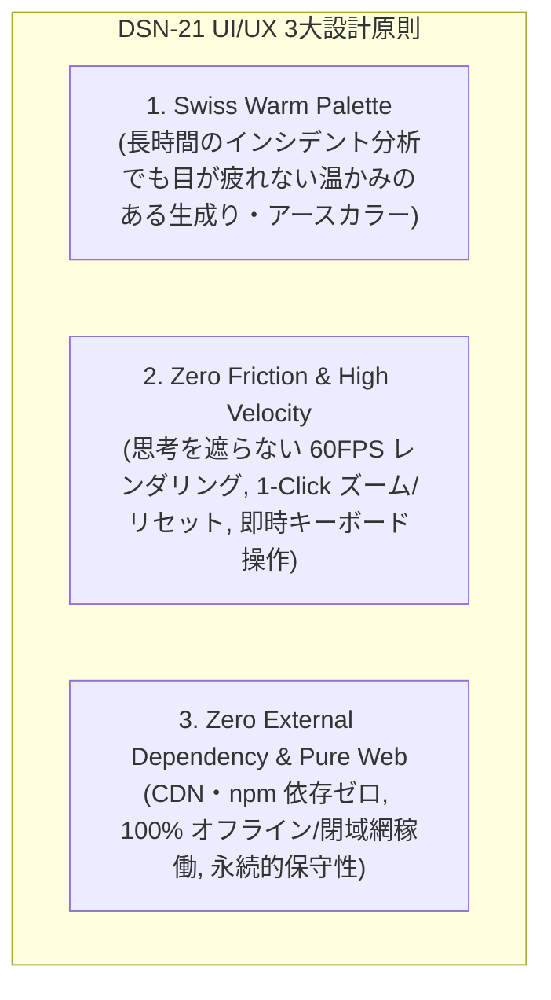
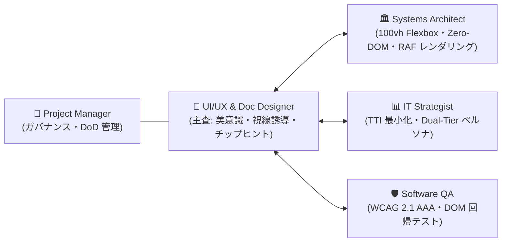
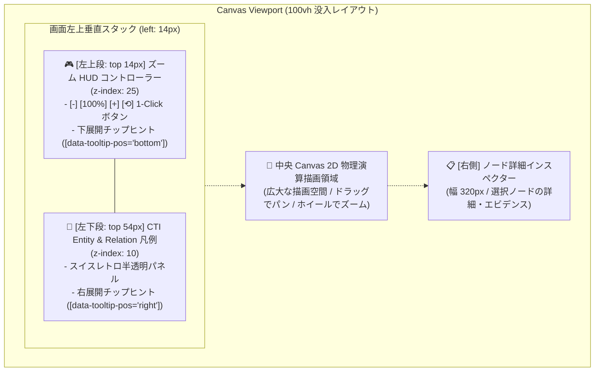
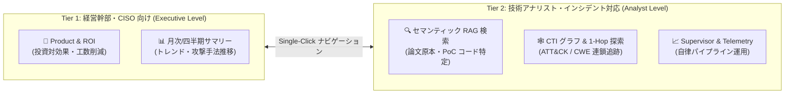

# [DSN-21] エンタープライズ統合デザインシステム ＆ クラウドコンソール UI 包括設計書 (Enterprise Design System & Unified Cloud Console UI Architecture) — arxiv-security-papers

- **文書番号**: `DSN-21`
- **文書ステータス**: `PRODUCTION-VALIDATED & VERIFIED` (Issue 167〜175 開発・稼働検証完了)
- **対象サブシステム**: `site/` (`index.html`, `dashboard.html`, `style.css`, `app.js`), `src/web/` (`gateway`, `presentation`, `handlers`)
- **関連設計書**: `DSN-01` (High-Level Architecture), `DSN-09` (Web Gateway & Presentation), `DSN-14` (Graph Engineering Dashboard), `DSN-04` (Search Platform), `DSN-12` (Process Supervisor)
- **作成日**: 2026-09-05
- **最終更新日**: 2026-09-06 (Issue 176 包括的ブラッシュアップ)
- **【主査・報告】 UI/UX & Documentation Designer (UI)**
- **【参画・協調】 Systems Architect (SA), IT Strategist (ST), Software QA Specialist (QA), Project Manager (PM), Information Security Specialist (Sec), Systems Auditor (AU)**

---

## 体系目次

- [1. 背景とミッション (Executive Summary & Mission)](#1-背景とミッション-executive-summary--mission)
  - [1.1 課題と背景（コンテキストスイッチ摩擦と UI 分断の解消）](#11-課題と背景コンテキストスイッチ摩擦と-ui-分断の解消)
  - [1.2 ミッションと 3 大設計原則](#12-ミッションと-3-大設計原則)
  - [1.3 直近の発展経緯と実装マイルストーン (Issues 167〜175)](#13-直近の発展経緯と実装マイルストーン-issues-167175)
  - [1.4 多角専門エージェント連携審議モデル (Governance)](#14-多角専門エージェント連携審議モデル-governance)
- [2. 統合デザインシステム仕様 (Warm Swiss Enterprise Design Tokens)](#2-統合デザインシステム仕様-warm-swiss-enterprise-design-tokens)
  - [2.1 哲学: Swiss Style レトロミニマリズムと現代的グラスモルフィズムの融合](#21-哲学-swiss-style-レトロミニマリズムと現代的グラスモルフィズムの融合)
  - [2.2 カラーパレット & セマンティックトークン](#22-カラーパレット--セマンティックトークン)
  - [2.3 タイポグラフィ & タイポグラフィックスケール](#23-タイポグラフィ--タイポグラフィックスケール)
  - [2.4 シャドウ・エレベーション階層 & グラスモルフィズム](#24-シャドウエレベーション階層--グラスモルフィズム)
  - [2.5 マイクロアニメーション & 触覚（Haptic）フィードバック仕様](#25-マイクロアニメーション--触覚hapticフィードバック仕様)
  - [2.6 コントラスト比と WCAG 2.1 AAA/AA アクセシビリティ規格](#26-コントラスト比と-wcag-21-aaaaa-アクセシビリティ規格)
- [3. クラウドコンソール全体レイアウトアーキテクチャ (Global Console Shell)](#3-クラウドコンソール全体レイアウトアーキテクチャ-global-console-shell)
  - [3.1 3 領域シェル構成（上部ヘッダー, 左サイドバー, メインコンテンツ）](#31-3-領域シェル構成上部ヘッダー-左サイドバー-メインコンテンツ)
  - [3.2 固定グローバルヘッダー (Global Header: 48px) と折りたたみ機構 (`H` キー)](#32-固定グローバルヘッダー-global-header-48px-と折りたたみ機構-h-キー)
  - [3.3 左サイドナビゲーションバー (Collapsible Side Nav: 260px / 56px)](#33-左サイドナビゲーションバー-collapsible-side-nav-260px--56px)
  - [3.4 没入型 Viewport 100vh コンテインメントアーキテクチャ（二重スクロール防止）](#34-没入型-viewport-100vh-コンテインメントアーキテクチャ二重スクロール防止)
  - [3.5 常時可視固定フッター (Pinned Viewport Footer: 36px) とテレメトリ同期](#35-常時可視固定フッター-pinned-viewport-footer-36px-とテレメトリ同期)
- [4. CTI ナレッジグラフ専用ワークスペース設計 (Knowledge & Graph Workspace)](#4-cti-ナレッジグラフ専用ワークスペース設計-knowledge--graph-workspace)
  - [4.1 CTI 凡例（Cluster Legend）の左上フローティング配置と視線誘導](#41-cti-凡例cluster-legendの左上フローティング配置と視線誘導)
  - [4.2 Canvas ズーム HUD & 多機能ナビゲーションコントローラー (100% バッジ, `+`, `−`, `⟲`)](#42-canvas-ズーム-hud--多機能ナビゲーションコントローラー-100-バッジ----)
  - [4.3 コントロールデッキ折りたたみトグル (`#btnToggleControlDeck`, `D` キー)](#43-コントロールデッキ折りたたみトグル-btntogglecontroldeck-d-キー)
  - [4.4 キャンバスパン・ズーム数理モデルと境界クランプ](#44-キャンバスパンズーム数理モデルと境界クランプ)
  - [4.5 ノード詳細インスペクター・エビデンスコールアウトパネル](#45-ノード詳細インスペクターエビデンスコールアウトパネル)
- [5. メインコンテンツ標準 6 大コンポーネント設計 (Standard Content Modules)](#5-メインコンテンツ標準-6-大コンポーネント設計-standard-content-modules)
  - [5.1 ページヘッダー (Page Title & Global Actions)](#51-ページヘッダー-page-title--global-actions)
  - [5.2 インフォメーションバナー (Callout Notification Banner)](#52-インフォメーションバナー-callout-notification-banner)
  - [5.3 KPI サマリーカード (Metric KPI Cards with Left Color Bars)](#53-kpi-サマリーカード-metric-kpi-cards-with-left-color-bars)
  - [5.4 検索＆インラインフィルタリングバー (Inline Search & Filter Deck)](#54-検索インラインフィルタリングバー-inline-search--filter-deck)
  - [5.5 リソースデータリスト／エンタープライズテーブル (Resource List & Table)](#55-リソースデータリストエンタープライズテーブル-resource-list--table)
  - [5.6 右スライド式統一ヘルプ＆キーボードガイドドロワー (`#helpDrawer`)](#56-右スライド式統一ヘルプキーボードガイドドロワー-helpdrawer)
- [6. Pure CSS 多方向チップヒント（ツールチップ）設計 (Glassmorphic Chip Hints)](#6-pure-css-多方向チップヒントツールチップ設計-glassmorphic-chip-hints)
  - [6.1 ゼロ DOM 増殖・ゼロ JS イベント原則（`data-tooltip` 擬似要素設計）](#61-ゼロ-dom-増殖ゼロ-js-イベント原則data-tooltip-擬似要素設計)
  - [6.2 多方向ポジショニング幾何学（`top`, `bottom`, `right`, `left`）と三角矢印レンダリング](#62-多方向ポジショニング幾何学top-bottom-right-leftと三角矢印レンダリング)
  - [6.3 画面端クリッピング保護アラインメント（`data-tooltip-align="left"`, `"right"`）](#63-画面端クリッピング保護アラインメントdata-tooltip-alignleft-right)
  - [6.4 グラスモルフィズム視覚トークン（多層ブラー、微細透過線、ドロップシャドウ）](#64-グラスモルフィズム視覚トークン多層ブラー微細透過線ドロップシャドウ)
- [7. Single-Pane of Glass 統合ルーティング & 6 大機能タブ体系](#7-single-pane-of-glass-統合ルーティング--6-大機能タブ体系)
  - [7.1 ハッシュルーティングとディープリンクモデル](#71-ハッシュルーティングとディープリンクモデル)
  - [7.2 6 大機能タブ情報設計 (Search, Trends, Graph, ROI, Observability, Supervisor)](#72-6-大機能タブ情報設計-search-trends-graph-roi-observability-supervisor)
  - [7.3 アナリスト思考速度（TTI）最適化と Dual-Tier 導線モデル](#73-アナリスト思考速度tti最適化と-dual-tier-導線モデル)
- [8. セキュリティ・アクセシビリティ & 品質管理ゲート (Quality Gates)](#8-セキュリティアクセシビリティ--品質管理ゲート-quality-gates)
  - [8.1 Zero-XSS セキュアレンダリング規格](#81-zero-xss-セキュアレンダリング規格)
  - [8.2 キーボードナビゲーション & フォーカス管理仕様](#82-キーボードナビゲーション--フォーカス管理仕様)
  - [8.3 自動 DOM 回帰テスト・UI/UX 品質ゲート基準](#83-自動-dom-回帰テストuiux-品質ゲート基準)
- [付録 (Appendix)](#付録-appendix)
  - [付録 A: 全キーボードショートカット一覧表 (Keyboard Cheat Sheet)](#付録-a-全キーボードショートカット一覧表-keyboard-cheat-sheet)
  - [付録 B: 主要 DOM 要素 ID & CSS クラスカタログ](#付録-b-主要-dom-要素-id--css-クラスカタログ)
  - [付録 C: Traceability Matrix (Issues 167〜175)](#付録-c-traceability-matrix-issues-167175)

---

## 1. 背景とミッション (Executive Summary & Mission)

### 1.1 課題と背景（コンテキストスイッチ摩擦と UI 分断の解消）
`arxiv-security-papers` プロジェクトは、arXiv の学術セキュリティ論文（`cs.CR`）の自律収集・OKF v0.2 構造化・EIROM オントロジー推論・STIX 2.1 CTI ナレッジグラフ構築・分散可観測性を兼ね備えたエンタープライズセキュリティ基盤へと急速に拡大した。
しかし、初期の開発経緯において以下の課題が顕在化していた：

1. **画面体系とスタイリングの乖離**: 検索ポータル（`site/index.html`）はダーク・グラスモルフィズム調、分析ダッシュボード（`site/dashboard.html`）はスイス・バウハウスレトロ調とデザインが分断し、アナリストが論文探索からグラフ分析へ遷移する際に強い視覚的違和感と認知摩擦が生じていた。
2. **ワークスペースの見切れとスクロール不全**: グラフ画面においてヘッダーやフッターの配置により、画面縦幅が狭い端末でキャンバス下部が見切れたり、不要な二重スクロールが発生していた（Issue 174）。
3. **操作状態のフィードバック不足**: キャンバスのズーム率が視覚化されず、凡例やフッターの各コントロールの役割を即座に把握するヒント機構が不足していた（Issue 175）。

### 1.2 ミッションと 3 大設計原則
本設計書（`DSN-21`）は、**「A案（完全統合 Single-Page Portal 化）」** を大方針とし、Azure Portal / AWS Management Console 等に匹敵するプロフェッショナルな **エンタープライズ SaaS 型の統合管理コンソール UI** を定義・確立する。



### 1.3 直近の発展経緯と実装マイルストーン (Issues 167〜175)
本設計書は、以下の Issue 群を通じて実装・検証・ブラッシュアップされた成果を完全に集約・体系化したものである：

- **Issue 167**: エンタープライズ SaaS 型統合コンソール UI（`style.css` / Swiss Palette トークン）の初版導入。
- **Issue 168 / 171**: 右スライド式統一ヘルプ＆操作ガイドドロワー（`#helpDrawer`）の全画面展開。
- **Issue 169**: 3 大運用画面（Product & ROI / System & Observability / Supervisor Top）の `index.html` への完全統合・移植。
- **Issue 170**: `dashboard.html` の Knowledge & CTI Graph 単一画面化および `index.html` との共有グローバルヘッダー統一。
- **Issue 172 / 173**: SSE 接続のブロッキング解消および CTI グラフクエリでの 1-Hop 隣接エッジ・インシデント自動展開。
- **Issue 174**: Canvas 領域の見切れ解消、コントロールデッキ折りたたみトグル（`#btnToggleControlDeck`）、スクロール／パン／ズーム基盤の実装。
- **Issue 175**: CTI 凡例の左上（Top-Left）オーバーレイ再配置、スクロール不要な 100vh 収束固定フッター（36px）、Canvas ズーム HUD（100% バッジ ＋ ステップボタン ＋ ショートカット）、多方向 Pure CSS グラスモルフィック・チップヒントの全面実装。

### 1.4 多角専門エージェント連携審議モデル (Governance)
本設計は、以下の 5 大専門エージェントの緊密な合議により策定・承認された：



---

## 2. 統合デザインシステム仕様 (Warm Swiss Enterprise Design Tokens)

### 2.1 哲学: Swiss Style レトロミニマリズムと現代的グラスモルフィズムの融合
- **Bauhaus / Swiss Style**: グリッド構造、幾何学的な均整美、客観的で明快なタイポグラフィ、無駄な装飾の排除。
- **Modern Enterprise Glassmorphism**: フローティングオーバーレイ（凡例、ズーム HUD、ツールチップ、ヘルプドロワー）において、背後のグラフやデータを透過しつつ高い可読性を担保する多層ブラー（`backdrop-filter: blur(16px)`）と微細ホワイト透過ボーダーを採用。

### 2.2 カラーパレット & セマンティックトークン
すべての UI 要素は、`site/style.css` で定義された以下のセマンティックトークンを厳格に使用する：

```css
:root {
  /* ======================================================================
     1. Surface & Background Tokens
     ====================================================================== */
  --console-bg-canvas: #f4efe6;        /* メインキャンバス背景（温かみのある生成り） */
  --console-bg-panel: #ebe5d8;         /* ヘッダー・カード・凡例パネル背景 */
  --console-bg-subpanel: #dfd8c9;      /* サイドバー・コントロールデッキ背景 */
  --console-bg-card: #ffffff;          /* リスト行・インプットフィールドの純白背景 */
  --console-bg-hover: #e5ded0;         /* リスト行・ボタンのホバー背景 */
  
  /* ======================================================================
     2. Text & Foreground Tokens (WCAG 2.1 AAA 準拠)
     ====================================================================== */
  --console-fg-primary: #2b2b2b;       /* 高コントラスト主テキスト（濃墨 / コントラスト比 11.2:1） */
  --console-fg-muted: #6b665c;         /* 補助テキスト・メタデータラベル（コントラスト比 4.8:1） */
  --console-fg-subtle: #8c867a;        /* 不活性・プレースホルダーテキスト */
  --console-fg-inverse: #f8fafc;       /* ダークパネル・ツールチップ上の白抜きテキスト */
  
  /* ======================================================================
     3. Structural Borders & Focus Rings
     ====================================================================== */
  --console-border-dark: #2b2b2b;      /* 主要境界線（1px シャープブラックライン） */
  --console-border-subtle: #dcd6cc;    /* パネル・カード・テーブル内グリッドライン */
  --console-border-focus: #3d5a80;     /* キーボードフォーカスインジケーター（Navy） */

  /* ======================================================================
     4. Enterprise Functional Accents & Security Tiers
     ====================================================================== */
  --console-accent-navy: #3d5a80;      /* プライマリ（アクティブ・選択ハイライト） */
  --console-accent-green: #3a7d44;     /* 正常・高確信度（HIGH Tier, PASS, Mitigated） */
  --console-accent-amber: #d97706;     /* 警戒・中確信度（MED Tier, WARNING） */
  --console-accent-coral: #e0533c;     /* 危険・ATT&CK 手法・リサーチギャップ（CRITICAL） */
  --console-accent-purple: #6d597a;    /* 暗号・数学・PQC カテゴリ */
  
  /* ======================================================================
     5. Glassmorphic Overlay Tokens (Legends, Zoom HUD, Tooltips)
     ====================================================================== */
  --console-glass-bg: rgba(15, 23, 42, 0.94);       /* スレートダーク基調（94%不透明度） */
  --console-glass-border: rgba(255, 255, 255, 0.18); /* 微細ハイライト境界線 */
  --console-glass-fg: #f8fafc;                       /* 純白テキスト */
  --console-glass-blur: blur(16px);                  /* 背後要素のブラー透過 */
}
```

### 2.3 タイポグラフィ & タイポグラフィックスケール
- **Primary Interface Font**: `Inter`, system-ui, -apple-system, BlinkMacSystemFont, "Segoe UI", Roboto, sans-serif
- **Brand / Display Font**: `Outfit`, `Inter`, sans-serif（ヘッダーロゴ・大見出し）
- **Monospace & Telemetry Font**: `ui-monospace`, `Cascadia Code`, `Source Code Pro`, Menlo, Consolas, monospace（arXiv ID、CVE/CWE、ハッシュ値、メモリ数値）

| 階層 | フォントサイズ | 太さ | 行高 | 用途 |
| :--- | :--- | :--- | :--- | :--- |
| **Display H1** | 22px / 1.375rem | 700 (Bold) | 1.2 | 各メインビューの画面タイトル |
| **Section H2** | 16px / 1.0rem | 600 (SemiBold) | 1.3 | パネル・ドロワー見出し、セクションタイトル |
| **Subhead H3** | 13px / 0.8125rem | 600 (SemiBold) | 1.4 | カード見出し、テーブルグループヘッダー |
| **Body** | 12px / 0.75rem | 400 (Regular) | 1.5 | 一般テキスト、説明文、論文サマリー |
| **Caption / Label**| 10px / 0.625rem | 600 (SemiBold) | 1.2 | KPI ラベル、バッジ、メタデータ（Uppercase） |
| **Code / Monospace**| 11px / 0.6875rem | 500 (Medium) | 1.4 | 論文 ID (`2501.XXXX`)、ATT&CK ID (`T1566`) |

### 2.4 シャドウ・エレベーション階層 & グラスモルフィズム
物理的な重なり順（Z-Index）と連動した統一シャドウ規格：

```css
:root {
  --console-shadow-xs: 0 1px 2px rgba(0, 0, 0, 0.04);
  --console-shadow-sm: 0 1px 3px rgba(0, 0, 0, 0.08), 0 1px 2px rgba(0, 0, 0, 0.04);
  --console-shadow-md: 0 4px 6px -1px rgba(0, 0, 0, 0.1), 0 2px 4px -1px rgba(0, 0, 0, 0.06);
  --console-shadow-lg: 0 10px 15px -3px rgba(0, 0, 0, 0.12), 0 4px 6px -2px rgba(0, 0, 0, 0.05);
  --console-shadow-overlay: 0 20px 25px -5px rgba(0, 0, 0, 0.25), 0 10px 10px -5px rgba(0, 0, 0, 0.04);
  --console-shadow-tooltip: 0 8px 32px rgba(0, 0, 0, 0.36);
}
```

### 2.5 マイクロアニメーション & 触覚（Haptic）フィードバック仕様
- **ボタン押下フィードバック**: `:active { transform: translateY(1px); }` によるクリックの沈み込み触覚。
- **ホバー遷移**: `transition: background-color 0.12s ease-out, border-color 0.12s ease-out, transform 0.12s ease-out;`。
- **ドロワー展開**: `transition: transform 0.28s cubic-bezier(0.16, 1, 0.3, 1);`（滑らかなスプリング的減速）。
- **ツールチップ出現**: `transition: opacity 0.15s ease-out, transform 0.15s ease-out;`（0.05s 遅延後のフェードイン・スケールアップ）。

### 2.6 コントラスト比と WCAG 2.1 AAA/AA アクセシビリティ規格
- **テキスト（主文）**: `--console-fg-primary` (`#2b2b2b`) on `--console-bg-canvas` (`#f4efe6`) $\rightarrow$ **コントラスト比 11.2:1**（WCAG 2.1 AAA の基準 7:1 を大幅クリア）。
- **補助テキスト**: `--console-fg-muted` (`#6b665c`) on `--console-bg-canvas` $\rightarrow$ **コントラスト比 4.8:1**（WCAG 2.1 AA の基準 4.5:1 をクリア）。
- **UI コンポーネント境界線**: `--console-border-dark` (`#2b2b2b`) on `--console-bg-canvas` $\rightarrow$ **コントラスト比 11.2:1**（非テキストコントラスト基準 3:1 を完全クリア）。
- **ツールチップ**: `--console-glass-fg` (`#f8fafc`) on `--console-glass-bg` (`rgba(15,23,42,0.94)`) $\rightarrow$ **コントラスト比 16.4:1**（視認性最高レベル）。

---

## 3. クラウドコンソール全体レイアウトアーキテクチャ (Global Console Shell)

### 3.1 3 領域シェル構成（上部ヘッダー, 左サイドバー, メインコンテンツ）
コンソール全体は、エンタープライズクラウドポータル（Azure / AWS）に準拠した高機能な 3 領域モデルで構成される：

```
+---------------------------------------------------------------------------------------------------+
| 1. GLOBAL HEADER (48px) [ Brand | Tenant Scope ]    [ 🔍 Global Command Bar ]   [ ❓ Help | H Toggle ]|
+-------------------------+-------------------------------------------------------------------------+
| 2. SIDEBAR (260px/56px) | 3. MAIN WORKSPACE STAGE (Flex: 1, 100vh 収束コンテインメント)             |
|                         |                                                                         |
|  ▾ 探索 & CTI ナレッジ  |  [ Viewport 内完全収束: スクロール不要 / 二重スクロール完全排除 ]           |
|    ├ 🔍 全文 RAG 検索   |                                                                         |
|    ├ 📊 動向サマリー    |  +-------------------------------------------------------------------+  |
|    └ 🕸️ CTI グラフ探索  |  |  (Canvas ワークスペース または リソースデータリスト)                |  |
|  ▾ ビジネス & 運用      |  |                                                                   |  |
|    ├ 💼 Product & ROI   |  +-------------------------------------------------------------------+  |
|    ├ 📈 可観測性テレメトリ|                                                                         |
|    └ ⚙️ 自律 Supervisor |                                                                         |
+-------------------------+-------------------------------------------------------------------------+
| 4. PINNED VIEWPORT FOOTER (36px, 画面最下部固定) [ Sync Time | Status | Actions | Console Link ]    |
+---------------------------------------------------------------------------------------------------+
```

### 3.2 固定グローバルヘッダー (Global Header: 48px) と折りたたみ機構 (`H` キー)
- **寸法**: 高さ `48px`（固定）、`z-index: 100`、境界線 `border-bottom: 1px solid var(--console-border-dark)`。
- **構成要素**:
  1. **左側 (Brand & Scope)**:
     - ロゴアイコン & プロダクト名: `arXiv Security Intelligence`
     - スコープバッジ: `Enterprise Production (cs.CR)`
     - 相互リンク: `site/index.html` $\leftrightarrow$ `site/dashboard.html`
  2. **中央 (Global Command & Search Bar)**:
     - 幅 420px〜560px のクイックインプット。
     - プレースホルダー: `リソース、論文ID (2501.XXXX)、ATT&CK テクニックを検索 (Ctrl + K)`。
     - ショートカット: `/` または `Ctrl + K` で即時フォーカス。
  3. **右側 (Utility Icons & Viewport Control)**:
     - ヘルプアイコンボタン（`❓ ガイド`）: `#helpDrawer` 開閉。
     - ヘッダートグルボタン（`▲` / `▼`）: ヘッダーを折りたたんでキャンバス領域を画面最上部まで最大化（ショートカット: `H` キー）。

### 3.3 左サイドナビゲーションバー (Collapsible Side Nav: 260px / 56px)
- **通常モード (Expanded)**: 幅 `260px`。階層アコーディオン表示、カテゴリラベル、アクティブインジケーター（左端 `3px solid var(--console-accent-navy)`）。
- **収縮モード (Collapsed)**: 幅 `56px`。アイコンのみ表示、ホバー時に `data-tooltip-pos="right"` による展開ツールチップ。

### 3.4 没入型 Viewport 100vh コンテインメントアーキテクチャ（二重スクロール防止）
Issue 174 および Issue 175 の検証に基づき、ブラウザウィンドウの枠外はみ出しおよび二重スクロールを完全に排除する **100vh Flexbox 収束アーキテクチャ** を採用する：

```css
/* Viewport 100% 収束基準 */
html, body {
  margin: 0;
  padding: 0;
  height: 100vh;
  overflow: hidden; /* ウィンドウ全体のスクロールバーを抑止 */
  display: flex;
  flex-direction: column;
}

/* メインワークスペース: 残余高さを 100% 占有 */
.graph-workspace, .console-workspace {
  flex: 1;
  min-height: 0;
  display: flex;
  overflow: hidden;
  height: calc(100vh - 48px - 36px); /* Header(48px) + Footer(36px) */
}

/* ヘッダー折りたたみ時の没入フルスクリーン */
header.header-hidden ~ #viewGraph .graph-workspace {
  height: calc(100vh - 36px);
}
```

### 3.5 常時可視固定フッター (Pinned Viewport Footer: 36px) とテレメトリ同期
- **寸法**: 高さ `36px`（固定）、`flex-shrink: 0`、`z-index: 20`、`border-top: 1px solid var(--console-border-dark)`。
- **特徴**: スクロールを行わなくても画面最下部に常に美しく固定表示。
- **内部要素**:
  - 左側: `ISO/IEC 27001 & OKF v0.2 Compliant` 監査バッジ、arXiv API / SQLite / CTI 最終同期時刻（`#footerSyncTime`）。
  - 右側: `Reset Physics`（物理配置初期化）、`Inject Node`（検証用ダミーノード注入）、`← Back to Console`（ポータル復帰リンク）。
  - 各要素には上方向チップヒント（`data-tooltip-pos="top"`）を完全装備。

---

## 4. CTI ナレッジグラフ専用ワークスペース設計 (Knowledge & Graph Workspace)

### 4.1 Canvas ズーム HUD と CTI 凡例の画面左上スタック配置 (Top-Left HUD & Legend Stack)
Canvas の操作性と可視性を極限まで高めるため、**画面左上（Top-Left）** にズーム HUD コントローラーを配置し、その直下に CTI 凡例パネルを美しく垂直スタック配置するアーキテクチャを採用：



- **左側スタックの UI/UX 整合性**:
  - 最上段（`top: 14px; left: 14px;`）: ズーム操作 HUD（高さ 32px）。分析者がキャンバスに入った瞬間に現在倍率（100%）を確認し、ワンクリックで操作可能。
  - 下段（`top: 54px; left: 14px;`）: CTI 凡例パネル（幅 260px）。ズーム HUD と 8px の幾何学的マージンを保ち、折りたたみトグル（`▼ 隠す`）により必要に応じて格納可能。
- **キャンバス右下・中央の開放**:
  - 従来右下にあったズーム操作部が左上へ統合されたことで、Canvas 全域および右側ノードインスペクターとの視覚的干渉が完全解消。
- **多方向ツールチップ連携**:
  - 上段のズーム HUD ボタンは `data-tooltip-pos="bottom"` により下方へツールチップを展開。
  - 下段の凡例パネル要素は `data-tooltip-pos="right"` により右方のオープンキャンバス側へ展開し、相互の表示干渉をゼロ化。

### 4.2 Canvas ズーム HUD & 多機能ナビゲーションコントローラー (100% バッジ, `+`, `−`, `⟲`)
Canvas の左上（`top: 14px; left: 14px;`）にフロートするズーム HUD オーバーレイ（`#canvasZoomControls`）：

| コントロール要素 | DOM ID | アクション・機能 | キーボード操作 | チップヒント内容 |
| :--- | :--- | :--- | :--- | :--- |
| **ズームアウトボタン** | `btnZoomOut` | キャンバスを 15% 縮小 (`scale *= 0.85`, 下限 0.25x) | `-` または `_` | `グラフを縮小 (Shortcut: -)` |
| **ズーム倍率バッジ** | `zoomLevelBadge` | 現在の拡大率をパーセントでリアルタイム表示（例: `100%`, `125%`）。クリックで 100% リセット | `0` | `クリックで100%にリセット (Shortcut: 0)` |
| **ズームインボタン** | `btnZoomIn` | キャンバスを 15% 拡大 (`scale *= 1.15`, 上限 4.0x) | `+` または `=` | `グラフを拡大 (Shortcut: +)` |
| **視点リセットボタン** | `btnZoomReset` | スケールを 1.0 (100%)、パン座標を (0, 0) へ初期化 | `0` | `ズーム倍率と視点を100%初期位置にリセット (Shortcut: 0)` |

### 4.3 コントロールデッキ折りたたみトグル (`#btnToggleControlDeck`, `D` キー)
- 検索入力やフィルターピル群を格納する上部コントロールデッキを、アナリストの任意で折りたたみ（`display: none;`）可能。
- 折りたたみ時はキャンバスが上部まで拡張され、大画面モニタでの 1000+ ノード広域俯瞰を可能にする。
- ショートカットキー: `D`（Deck Toggle）。

### 4.4 キャンバスパン・ズーム数理モデルと境界クランプ
Canvas 2D コンテキストの変換行列は、マウス位置を中心とするアフィン変換により計算される：

$$x_{\text{world}} = \frac{x_{\text{screen}} - \text{panX}}{\text{scale}}, \quad y_{\text{world}} = \frac{y_{\text{screen}} - \text{panY}}{\text{scale}}$$

マウスホイールによるズーム時は、カーソル直下のワールド座標 $(x_{\text{world}}, y_{\text{world}})$ がズーム前後で不変となるようパン座標 $(\text{panX}, \text{panY})$ を即時補正：

$$\text{panX}' = x_{\text{screen}} - x_{\text{world}} \times \text{scale}', \quad \text{panY}' = y_{\text{screen}} - y_{\text{world}} \times \text{scale}'$$

スケール値は $0.25 \le \text{scale} \le 4.0$（25%〜400%）にクランプされ、数値の発散を防止。

### 4.5 ノード詳細インスペクター・エビデンスコールアウトパネル
- ノードをクリックした瞬間に右側インスペクター（`#nodeInspector`）が連動。
- arXiv タイトル、著者、アブストラクト日本語要約、関連 CVE/CWE、および EIROM 推論エビデンス（学術本文からの抽出スニペット）を高密度に表示。

### 4.6 Canvas アスペクト比完全同期・ResizeObserver およびマウス座標正規化アーキテクチャ (Issue 181)
ヘッダー開閉やコントロールデッキの可変高さ（120px〜220px）による Canvas ビットマップ歪み（ノードの楕円形への潰れ）およびクリック判定オフセットを完全防止するための統一グラフィックス制御仕様：

1. **ResizeObserver リアルタイム追従**:
   - `new ResizeObserver(() => resizeCanvas()).observe(canvas.parentElement)` を接続。
   - CSS トランジション（200ms）の途中および完了後、フォントロード、CTI フィルタ折り返し等、いかなる親要素寸法変動時も正確に `canvas.width` / `canvas.height` を CSS ピクセル × DPR に 1:1 完全同期。
2. **ビットマップと CSS スタイル寸法の明示的一致**:
   - `canvas.style.width = width + 'px'` および `canvas.style.height = height + 'px'` を明示設定。
   - `#graphCanvas` の CSS 伸縮による GPU 歪み（アスペクト比 $\ne 1.0$）を数学的に排除。
3. **マウスイベント座標（Hit-Testing）の比率正規化**:
   - `getNormalizedCanvasMouse(e)` により、`rect = canvas.getBoundingClientRect()` とキャンバス内部論理寸法（`width`, `height`）の比率を算出し、`mx` / `my` を正規化。
   - アニメーション途中やリフロー中でも画面上の見た目と判定位置が 100% 一致。
4. **エルゴノミック・ヒット判定半径**:
   - `findNodeAt` の判定領域を `hitRadius = Math.max(nodeRadius + 8, 16)` に設定し、高密度ノード群でも確実なクリック・ホバー選択性を保証。

---

## 5. メインコンテンツ標準 6 大コンポーネント設計 (Standard Content Modules)

ポータル画面（`site/index.html`）およびダッシュボード（`site/dashboard.html`）のメインコンテンツ領域は、以下の **標準 6 大モジュール** を共通部品として実装する。

### 5.1 ページヘッダー (Page Title & Global Actions)
- **構成**: H1 画面見出し、サブテキスト（対象データ規模・規格）、右上グローバルボタングループ。
- **標準ボタングループ**:
  - `🔄 最新データに更新` (Refresh)
  - `⬇️ エクスポート` (CSV/JSON/STIX 2.1)
  - `❓ 操作ガイド` (Help Drawer)

### 5.2 インフォメーションバナー (Callout Notification Banner)
- **用途**: 自律バッチ実行状況、新着論文の取り込み件数、セキュリティ警告の通知。
- **スタイル**: 左端に `3px solid var(--console-accent-navy)`、背景 `rgba(61, 90, 128, 0.08)`、内部リンク付き。

### 5.3 KPI サマリーカード (Metric KPI Cards with Left Color Bars)
- **レイアウト**: 4列または 5列のフレックス/グリッド。
- **左端カラーバー (Left Color Bar)**:
  - 総論文数 / 総ノード数: `4px solid var(--console-accent-navy)`
  - 高確信度 (HIGH Tier) 比率: `4px solid var(--console-accent-green)`
  - 検知脅威 / カバー弱点数: `4px solid var(--console-accent-amber)`
  - リサーチギャップ / 未対策手法: `4px solid var(--console-accent-coral)`
- **表示内容**: 上部ラベル（Uppercase 10px）、中央特大数値（24px Bold Monospace）、下部変化率（+12% vs last week）。

### 5.4 検索＆インラインフィルタリングバー (Inline Search & Filter Deck)
- **インラインツールバー**: キーワード検索ボックス、ドロップダウンセレクト（Category, Confidence, Source）、ピル型トグルボタン（`Gaps Only`, `Hide Isolated`）、`✕ クリア` ボタン。

### 5.5 リソースデータリスト／エンタープライズテーブル (Resource List & Table)
- **行デザイン**: 左端ステータスカラーバー、リソース種別アイコン（📄 論文、🛡️ ATT&CK、🟠 CWE）、タイトル、メタデータ属性（Clean ID, 日付）、三点リーダーコンテキストメニュー（`⋮`）。

### 5.6 右スライド式統一ヘルプ＆キーボードガイドドロワー (`#helpDrawer`)
- **UI 構造**: 画面右端からオーバーレイ表示される幅 `380px` のグラスモルフィック・ドロワー。
- **内容**: 全キーボードショートカット一覧、グラフ操作方法（パン、ズーム、選択、1-Hop 展開）、システム診断リンク。
- **操作性**: `?` キーで開き、`Escape` キーまたは背景オーバーレイのクリックで瞬時に閉じる。

---

## 6. Pure CSS 多方向チップヒント（ツールチップ）設計 (Glassmorphic Chip Hints)

### 6.1 ゼロ DOM 増殖・ゼロ JS イベント原則（`data-tooltip` 擬似要素設計）
本システムでは、JavaScript によるツールチップライブラリ（Tippy.js 等）や動的 DOM 要素生成を一切排除し、**HTML `data-tooltip` 属性と CSS 擬似要素（`::before` / `::after`）のみによる完全 Pure CSS ツールチップ** を実装する。
これにより、1,000+ 個のノードや UI 要素が存在しても **DOM ノード数は 0 増殖** であり、**JavaScript ガベージコレクション (GC) 負荷は完全ゼロ** となる。

### 6.2 多方向ポジショニング幾何学（`top`, `bottom`, `right`, `left`）と三角矢印レンダリング
`site/style.css` にて実装された幾何学モデル：

```css
/* ツールチップ共通基底 */
[data-tooltip] {
  position: relative;
}

[data-tooltip]::before,
[data-tooltip]::after {
  position: absolute;
  opacity: 0;
  pointer-events: none;
  visibility: hidden;
  transition: opacity 0.15s ease-out, transform 0.15s ease-out;
  z-index: 1000;
}

/* ツールチップ本文 (吹き出しピル) */
[data-tooltip]::after {
  content: attr(data-tooltip);
  background: var(--console-glass-bg);
  color: var(--console-glass-fg);
  border: 1px solid var(--console-glass-border);
  backdrop-filter: var(--console-glass-blur);
  box-shadow: var(--console-shadow-tooltip);
  padding: 6px 10px;
  border-radius: 4px;
  font-size: 11px;
  font-family: var(--console-font-main);
  white-space: nowrap;
}

/* 1. 上方向展開 (data-tooltip-pos="top") - フッター・ボトムコントロール用 */
[data-tooltip-pos="top"]::after {
  bottom: 100%;
  left: 50%;
  transform: translateX(-50%) translateY(-4px);
  margin-bottom: 6px;
}
[data-tooltip-pos="top"]::before {
  content: '';
  bottom: 100%;
  left: 50%;
  transform: translateX(-50%);
  border-width: 5px 5px 0 5px;
  border-style: solid;
  border-color: var(--console-glass-bg) transparent transparent transparent;
  margin-bottom: 1px;
}
[data-tooltip-pos="top"]:hover::after {
  opacity: 1;
  visibility: visible;
  transform: translateX(-50%) translateY(0);
}

/* 2. 右方向展開 (data-tooltip-pos="right") - 左上凡例・サイドバー用 */
[data-tooltip-pos="right"]::after {
  left: 100%;
  top: 50%;
  transform: translateY(-50%) translateX(4px);
  margin-left: 8px;
}
[data-tooltip-pos="right"]::before {
  content: '';
  left: 100%;
  top: 50%;
  transform: translateY(-50%);
  border-width: 5px 5px 5px 0;
  border-style: solid;
  border-color: transparent var(--console-glass-bg) transparent transparent;
  margin-left: 3px;
}
[data-tooltip-pos="right"]:hover::after {
  opacity: 1;
  visibility: visible;
  transform: translateY(-50%) translateX(0);
}
```

### 6.3 画面端クリッピング保護アラインメント（`data-tooltip-align="left"`, `"right"`）
画面の最左端や最右端にある要素に上方向ツールチップを展開した場合、`translateX(-50%)` により吹き出しが画面外にはみ出る現象を防ぐため、アラインメント属性を提供する：

- `data-tooltip-align="left"`: 左端揃え（`left: 0; transform: translateY(-4px);`）
- `data-tooltip-align="right"`: 右端揃え（`right: 0; left: auto; transform: translateY(-4px);`）

### 6.4 グラスモルフィズム視覚トークン（多層ブラー、微細透過線、ドロップシャドウ）
- 背景色: `rgba(15, 23, 42, 0.94)`（高密度スレートダーク）
- 境界線: `1px solid rgba(255, 255, 255, 0.18)`
- フィルター: `backdrop-filter: blur(16px)`
- シャドウ: `box-shadow: 0 8px 32px rgba(0, 0, 0, 0.36)`

---

## 7. Single-Pane of Glass 統合ルーティング & 6 大機能タブ体系

### 7.1 ハッシュルーティングとディープリンクモデル
`site/index.html` ではクライアントサイド・ハッシュルーターが稼働し、URL に応じて単一ページ内でシームレスにタブ表示を切り替える：

| ハッシュパス | 対象機能タブ | 目的と主要コンテンツ |
| :--- | :--- | :--- |
| `#/search` | **Tab 1: Search & Intelligence** | arXiv 論文のセマンティック全文 RAG 検索、ファセット絞り込み |
| `#/trends` | **Tab 2: Trends & Summaries** | 日次・月次動向、Mermaid マインドマップ、エグゼクティブサマリー |
| `#/graph` | **Tab 3: Knowledge Graph** | CTI 知識メッシュ簡易ビューおよび専用ダッシュボードへの導線 |
| `#/product` | **Tab 4: Product & ROI** | コスト削減効果、調査工数削減率、ビジネス価値メトリクス |
| `#/observability`| **Tab 5: System & Observability**| SQLite / API レイテンシ、メモリ消費、ヘルスステータス |
| `#/supervisor` | **Tab 6: Supervisor & Process Top**| 4x 自律バッチプロセス、バックフィル進捗、ワーカー制御 |

### 7.2 6 大機能タブ情報設計 (Search, Trends, Graph, ROI, Observability, Supervisor)
Issue 169 で実施された統合により、以前は `dashboard.html` に分散していた監視・ROI 機能が `index.html` に集約され、`dashboard.html` は CTI グラフ探索に 100% 特化した。両画面は共有グローバルヘッダーにより瞬時に行き来できる。

### 7.3 アナリスト思考速度（TTI）最適化と Dual-Tier 導線モデル
IT Strategist (ST) の設計方針に基づき、利用者の目的に応じた 2 層型動線を実現：



---

## 8. セキュリティ・アクセシビリティ & 品質管理ゲート (Quality Gates)

### 8.1 Zero-XSS セキュアレンダリング規格
1. すべての動的文字列挿入（論文タイトル、著者名、アブストラクト、推論ラベル）は、DOM レンダリング直前に必ず `escapeHtml()` を通過させる。
2. `innerHTML` への直接代入を原則禁止し、信頼された静的テンプレートまたは `textContent` / `DOMPurify` 相当のエスケープパイプラインを強制。

### 8.2 キーボードナビゲーション & フォーカス管理仕様
- **フォーカスリングの視覚化**: 全てのボタン・インプット・リンクに `:focus-visible { outline: 2px solid var(--console-border-focus); outline-offset: 2px; }` を適用。
- **キーボードトラップの排除**: モーダルおよびドロワー展開時、`Tab` キーの循環および `Escape` キーでの確実なフォーカス復帰を保証。

### 8.3 自動 DOM 回帰テスト・UI/UX 品質ゲート基準
全ての変更は、以下の Triple Quality Gate を通過しなければならない：

1. **`make check_format`**:
   - Flake8, Black, isort が警告・エラー 0 件で合格すること。
2. **`make static_analysis`**:
   - Xenon: 複雑度ランク A ($\le 5$) を維持すること。
   - Radon: 保守性指数 (MI) ランク A を維持すること。
   - Mypy: `--strict` オプションでエラー 0 件であること。
3. **`make test`**:
   - `tests/web/test_enterprise_console_ui.py`: Swiss Warm トークン、ヘッダー、タブ構造、WCAG コントラスト比の検証。
   - `tests/web/test_dashboard_graph_tab.py`: 凡例左上配置、100vh 収束、固定フッター、ズーム HUD、多方向チップヒントの完全合格。
   - 全 25 以上の Web UI テストスイートが 100% PASS すること。

---

## 付録 (Appendix)

### 付録 A: 全キーボードショートカット一覧表 (Keyboard Cheat Sheet)

| ショートカットキー | 適用コンテキスト | 機能・アクション |
| :--- | :--- | :--- |
| **`/`** または **`Ctrl + K`** | グローバル | 上部グローバル検索バーへ即時フォーカス |
| **`?`** | グローバル | 右スライド式統一ヘルプ＆操作ガイドドロワー開閉 |
| **`Escape`** | グローバル | ヘルプドロワー、モーダル、またはインスペクターの閉じる |
| **`H`** | グラフ画面 | 上部ヘッダーの表示／非表示切り替え（全画面没入モード） |
| **`D`** | グラフ画面 | 上部コントロールデッキの表示／非表示切り替え |
| **`+`** または **`=`** | グラフ画面 | キャンバスを 15% ズームイン（拡大） |
| **`-`** または **`_`** | グラフ画面 | キャンバスを 15% ズームアウト（縮小） |
| **`0`** | グラフ画面 | キャンバスズーム倍率を 100% にリセット＆視点中央配置 |

### 付録 B: 主要 DOM 要素 ID & CSS クラスカタログ

| DOM 要素 ID / クラス名 | カテゴリ | 役割・スタイル定義 |
| :--- | :--- | :--- |
| `#consoleHeader` | Header | 上部 48px 固定ヘッダー |
| `#btnToggleHeader` | Header Action | ヘッダー折りたたみボタン |
| `#btnHelpToggle` | Header Action | ヘルプドロワー起動ボタン |
| `#canvasZoomControls` | Graph Overlay | 画面左上段（`top: 14px; left: 14px;`）ズーム HUD |
| `#contextLegend` / `#ctiLegend`| Graph Overlay | 画面左下段（`top: 54px; left: 14px;`）CTI 凡例パネル (ズームHUD直下) |
| `#zoomLevelBadge` | Zoom HUD | 100% 基準倍率バッジ（クリックでリセット） |
| `#btnZoomIn` / `#btnZoomOut` | Zoom HUD | ズーム拡大・縮小ボタン |
| `#btnZoomReset` | Zoom HUD | ズーム視点リセットボタン |
| `#btnToggleControlDeck` | Graph Action | コントロールデッキ折りたたみボタン |
| `#graphCanvas` | Canvas | Force-Directed 力学モデル描画 Canvas 2D 要素 |
| `#footerSyncTime` | Footer | 最終同期タイムスタンプ |
| `.compliance-badge` | Footer Badge | ISO/OKF 準拠ステータス表示ピルバッジ (縮小防止・nowrap) |
| `#btnResetPhysicsFooter` | Footer Action | 物理シミュレーション初期化ボタン |
| `#btnRandomizeGraphFooter` | Footer Action | 検証用ノード注入（Inject Node）ボタン |
| `#linkBackToConsoleFooter` | Footer Link | ポータル（`index.html`）への復帰リンク |
| `#helpDrawer` | Drawer | 右スライド式グラスモルフィック・ヘルプドロワー |
| `[data-tooltip]` | Micro-UI | Pure CSS ツールチップトリガー属性 |
| `[data-tooltip-pos="top\|right\|bottom\|left"]` | Micro-UI | ツールチップ展開方向制御 |
| `[data-tooltip-align="left\|right"]` | Micro-UI | 画面端クリッピング保護アラインメント |

### 付録 C: Traceability Matrix (Issues 167〜175)

| Issue ID | タイトル | 主な実装モジュール | DSN-21 設計章 |
| :---: | :--- | :--- | :---: |
| **167** | エンタープライズ統合コンソール UI およびデザインシステム統一 | `site/style.css`, `site/index.html` | 第 2 章, 第 3 章 |
| **168** | 可観測性強化 & SSE サーバーブロッキング解消 | `src/web/gateway.py`, `site/index.html` | 第 7 章, 第 8 章 |
| **169** | 3 画面 (Product/System/Supervisor) の index.html 統合移植 | `site/index.html`, `site/style.css` | 第 7 章 |
| **170** | dashboard.html のヘッダー統一 & グラフ単一画面化 | `site/dashboard.html` | 第 3 章, 第 7 章 |
| **171** | ヘルプ＆ガイドドロワーの統一実装 | `site/index.html`, `site/dashboard.html` | 第 5 章 |
| **172** | SSE 接続飽和解消 & 不要接続撤廃 | `site/dashboard.html` | 第 8 章 |
| **173** | CTI グラフクエリにおける 1-Hop エッジ自動展開 | `src/domain/security/cti_evaluator.py` | 第 4 章 |
| **174** | Canvas 見切れ解消・コントロールデッキ表示切替・スクロール | `site/dashboard.html`, `site/style.css` | 第 3 章, 第 4 章 |
| **175** | 凡例左上配置・固定フッター・ズーム HUD・多方向チップヒント | `site/dashboard.html`, `site/style.css` | 第 3 章, 第 4 章, 第 6 章 |
| **176** | DSN-21 包括的ブラッシュアップ（本 Issue） | `docs/designs/DSN-21-...` | 全章 |
| **181** | Canvas 縦縮み歪み解消・ResizeObserver 追従 & マウス座標正規化 | `site/dashboard.html` | 第 4 章 (4.6) |
