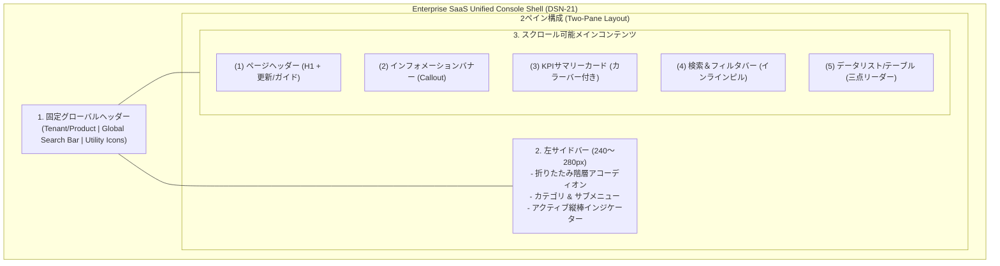
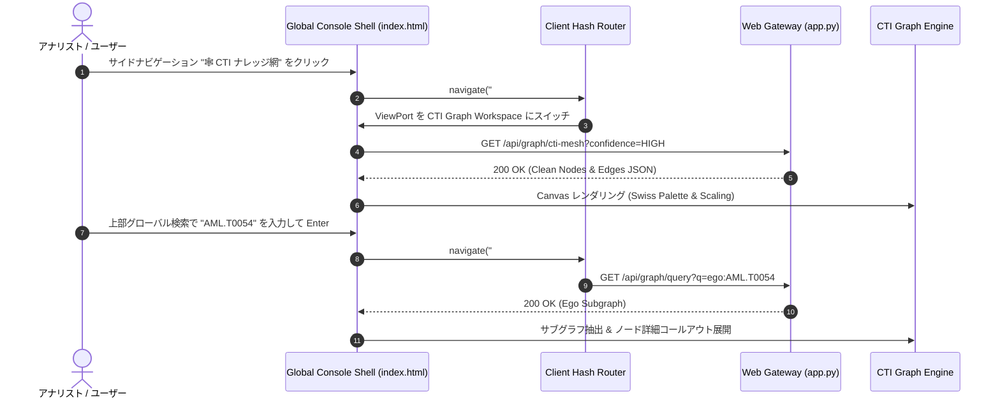

# [DSN-21] エンタープライズ統合デザインシステム ＆ クラウドコンソール UI 包括設計書 (Enterprise Design System & Unified Cloud Console UI Architecture) — arxiv-security-papers

- **文書番号**: `DSN-21`
- **文書ステータス**: `APPROVED`
- **対象サブシステム**: `site/` (`index.html`, `dashboard.html`, `style.css`, `app.js`), `src/web/` (`gateway`, `presentation`)
- **関連設計書**: `DSN-09` (Web Gateway & Presentation), `DSN-14` (Graph Engineering Dashboard), `DSN-04` (Search Platform)
- **作成日**: 2026-09-05
- **最終更新日**: 2026-09-05
- **【主査・報告】 UI/UX & Documentation Designer (UI) & Systems Architect (SA) & IT Strategist (ST)**
- **【参画】 Project Manager (PM), Information Security Specialist (Sec), Software QA Specialist (QA)**

---

## 体系目次

- [1. 背景とミッション (Executive Summary & Mission)](#1-背景とミッション-executive-summary--mission)
- [2. 統合デザインシステム仕様 (Warm Swiss Enterprise Design Tokens)](#2-統合デザインシステム仕様-warm-swiss-enterprise-design-tokens)
  - [2.1 カラーパレット & セマンティックトークン](#21-カラーパレット--セマンティックトークン)
  - [2.2 タイポグラフィ & スケール](#22-タイポグラフィ--スケール)
  - [2.3 境界線・シャドウ・グラスモーフィズム](#23-境界線シャドウグラスモーフィズム)
- [3. クラウドコンソール全体レイアウトアーキテクチャ (Global Console Shell)](#3-クラウドコンソール全体レイアウトアーキテクチャ-global-console-shell)
  - [3.1 上部固定グローバルヘッダー (Global Header)](#31-上部固定グローバルヘッダー-global-header)
  - [3.2 左サイドナビゲーションバー (Collapsible Side Nav)](#32-左サイドナビゲーションバー-collapsible-side-nav)
  - [3.3 メインコンテンツエリア (2-Pane Scrollable Main Stage)](#33-メインコンテンツエリア-2-pane-scrollable-main-stage)
- [4. メインコンテンツ標準 5 大コンポーネント設計 (Standard Content Modules)](#4-メインコンテンツ標準-5-大コンポーネント設計-standard-content-modules)
  - [4.1 ページヘッダー (Page Title & Global Actions)](#41-ページヘッダー-page-title--global-actions)
  - [4.2 インフォメーションバナー (Callout Notification Banner)](#42-インフォメーションバナー-callout-notification-banner)
  - [4.3 KPI サマリーカード (Metric KPI Cards with Left Color Bars)](#43-kpi-サマリーカード-metric-kpi-cards-with-left-color-bars)
  - [4.4 検索＆インラインフィルタリングバー (Inline Search & Filter Deck)](#44-検索インラインフィルタリングバー-inline-search--filter-deck)
  - [4.5 リソースデータリスト／エンタープライズテーブル (Resource List & Table)](#45-リソースデータリストエンタープライズテーブル-resource-list--table)
- [5. Single-Pane of Glass 統合ルーティング & ビュー遷移モデル](#5-single-pane-of-glass-統合ルーティング--ビュー遷移モデル)
- [6. セキュリティ・アクセシビリティ & 品質管理ゲート (Quality Gates)](#6-セキュリティアクセシビリティ--品質管理ゲート-quality-gates)

---

## 1. 背景とミッション (Executive Summary & Mission)

### 1.1 課題と背景
`arxiv-security-papers` においては、セマンティック全文検索・トレンド分析・MCP サンドボックスを担う **検索ポータル (`site/index.html`)** と、リアルタイム CTI ナレッジグラフ・システムテレメトリを担う **運用ダッシュボード (`site/dashboard.html`)** の 2 つの Web UI が並行して発展してきた。
しかしながら、両画面の間でデザイン体系（検索ポータル: ダーク・グラスモーフィズム vs ダッシュボード: スイス調レトロミニマリズム）が乖離しており、アナリストが論文検索から脅威グラフ探索・プロセス監査へと調査を進める際に激しいコンテキストスイッチ摩擦が生じていた。

### 1.2 ミッション
本設計書（`DSN-21`）は、**「A案（完全統合 Single-Page Portal 化）」** を大方針とし、Azure / AWS 等のクラウドコンソールに代表される **エンタープライズ SaaS 型の統合管理画面 UI** を定義する。
色合いについては、長時間の調査・監視業務において目への負担が少なく落ち着きのある **`dashboard.html` 側の Swiss / Warm Enterprise Palette** をベースにテーラリングし、プロフェッショナルな統一コンソールを実現する。



---

## 2. 統合デザインシステム仕様 (Warm Swiss Enterprise Design Tokens)

### 2.1 カラーパレット & セマンティックトークン
`dashboard.html` の持つ洗練された Bauhaus/Swiss レトロ調の落ち着いたアースカラーをベースに、エンタープライズ SaaS の機能性を融合したデザイン変数を定義する。

```css
:root {
  /* Surface & Background */
  --console-bg-canvas: #f4efe6;        /* メイン背景（温かみのある生成り） */
  --console-bg-panel: #ebe5d8;         /* ヘッダー・カード・パネル背景 */
  --console-bg-subpanel: #dfd8c9;      /* サイドバー・ネスト要素背景 */
  --console-bg-card: #ffffff;          /* リスト行・入力欄の白背景（視認性向上） */
  
  /* Text & Foreground */
  --console-fg-primary: #2b2b2b;       /* 高コントラスト主テキスト（濃墨） */
  --console-fg-muted: #6b665c;         /* 補足・ラベル・メタデータテキスト */
  --console-fg-subtle: #8c867a;        /* プレースホルダー・不活性テキスト */
  
  /* Structural Borders */
  --console-border-dark: #2b2b2b;      /* 主要境界線（1px シャープライン） */
  --console-border-subtle: #dcd6cc;    /* カード・テーブル内分割線 */
  --console-border-focus: #3d5a80;     /* フォーカスリング境界線 */

  /* Enterprise Functional Accents */
  --console-accent-navy: #3d5a80;      /* プライマリ（アクティブ・選択ハイライト） */
  --console-accent-green: #3a7d44;     /* 正常・高確信度（HIGH Tier, PASS） */
  --console-accent-amber: #d97706;     /* 注意・中確信度（MED Tier, WARNING） */
  --console-accent-coral: #e0533c;     /* 危険・ATT&CK 手法・リサーチギャップ */
  --console-accent-purple: #6d597a;    /* 暗号・数学・PQC カテゴリ */
  
  /* Glassmorphic Overlay Tokens (Tooltips & Drawers) */
  --console-glass-bg: rgba(15, 23, 42, 0.94);
  --console-glass-border: rgba(255, 255, 255, 0.18);
  --console-glass-fg: #f8fafc;
  --console-glass-blur: blur(16px);
}
```

### 2.2 タイポグラフィ & スケール
- **Primary Font**: `Inter`, system-ui, -apple-system, sans-serif（高い可読性とエンタープライズ感）
- **Display / Brand Font**: `Outfit`, `Inter`, sans-serif（グローバルヘッダー・ブランド表示）
- **Code / Monospace Font**: `ui-monospace`, `Cascadia Code`, `Source Code Pro`, Menlo, monospace（論文 ID、ATT&CK ID、CVE/CWE、JSON-RPC、テレメトリ数値）

### 2.3 境界線・シャドウ・グラスモーフィズム
- **シャープな 1px / 2px 境界線**: スイススタイル特有の幾何学的な整理感を維持し、無駄な余白を削減。
- **微細シャドウ**: `box-shadow: 0 1px 3px rgba(0, 0, 0, 0.05), 0 1px 2px rgba(0, 0, 0, 0.03)` による控えめな浮遊感。

---

## 3. クラウドコンソール全体レイアウトアーキテクチャ (Global Console Shell)

全体レイアウトは、クラウドベンダー（Azure Portal / AWS Management Console）で実証されている 3 領域構成を採用する。

```
+---------------------------------------------------------------------------------------------+
| 1. GLOBAL HEADER [ Product Name | Tenant ]      [ 🔍 Global Search ]      [ 🔔 ⚙️ ❓ Status ] |
+-----------------------+---------------------------------------------------------------------+
| 2. SIDEBAR (240~280px)| 3. MAIN CONTENT AREA (Scrollable 2-Pane Stage)                      |
|                       |                                                                     |
| ▾ 探索・分析          |  (1) Page Header: H1 Title + Action Buttons [Refresh] [Guide]       |
|   ├ 🔍 全文RAG検索    |  (2) Information Banner: Alert / System Message                     |
|   ├ 📊 トレンドサマリー |  (3) KPI Summary Cards: [Metric 1] [Metric 2] [Metric 3] [Metric 4] |
|   └ 🕸️ CTI ナレッジ網  |  (4) Search & Inline Filters: [Search Box] [Pill 1] [Pill 2]        |
| ▾ 脅威インテリジェンス |  (5) Data List / Enterprise Table:                                  |
|   ├ 🛡️ ATT&CK/CWE     |      [Status Bar | Icon | Resource Title | Attributes | Actions ⋯ ]  |
|   └ ⚡ リサーチギャップ |      [Status Bar | Icon | Resource Title | Attributes | Actions ⋯ ]  |
| ▾ 運用 & テレメトリ   |                                                                     |
|   ├ 📈 プロセス監視   |                                                                     |
|   └ 🔌 MCP ツール     |                                                                     |
+-----------------------+---------------------------------------------------------------------+
```

### 3.1 上部固定グローバルヘッダー (Global Header)
- **高さ**: 48px（固定）
- **構成**:
  - **左端 (Brand & Scope)**:
    - プロダクト名: `arXiv Security Intelligence`
    - セパレータ: `|`
    - テナント/スコープ名: `Enterprise Production (cs.CR)`
  - **中央 (Global Command & Search)**:
    - 横幅 400px〜600px の幅広検索バー。
    - プレースホルダー: `リソース、論文ID (e.g. 2501.12345)、ATT&CK テクニック、CWE をグローバル検索 (Ctrl + K)`
    - ショートカットキー (`/` または `Ctrl+K`) による即時フォーカス。
  - **右端 (Utilities)**:
    - 🔔 通知センター（新着論文、バックフィル完了通知）
    - ⚙️ ポータル/ビュー設定（密度切替、表示件数デフォルト）
    - ❓ ガイド & ヘルプ（クイックドロワー起動）
    - 🟢 システム稼働ステータスバッジ（Supervisor 正常稼働中、DB 健全）

### 3.2 左サイドナビゲーションバー (Collapsible Side Nav)
- **幅**: 260px（幅固定、折りたたみトグルによりアイコンのみの 56px モードへ収縮可能）
- **階層アコーディオン**:
  - **大カテゴリ 1: 探索・分析 (Exploration & Analytics)**
    - 🔍 セマンティック RAG 検索 (`/search`)
    - 📊 トレンド & エグゼクティブサマリー (`/trends`)
    - 🕸️ CTI ナレッジグラフ (`/graph`)
  - **大カテゴリ 2: 脅威インテリジェンス (Threat Intelligence)**
    - 🛡️ ATT&CK / CWE マトリクス (`/matrix`)
    - ⚡ リサーチギャップ分析 (`/gaps`)
    - 📜 推論ルールマスター (EIROM) (`/rules`)
  - **大カテゴリ 3: システム運用 & 監査 (Operations & Governance)**
    - 📈 プロセス監視 & テレメトリ (`/telemetry`)
    - 🔌 MCP ツールサンドボックス (`/mcp`)
    - 📑 システム監査ログ (`/logs`)
- **アクティブインジケーター**:
  - 選択中のメニューアイテムには、左端に **`3px solid var(--console-accent-navy)`** の縦棒インジケーターを表示し、背景色を `--console-bg-panel` で強調。

### 3.3 メインコンテンツエリア (2-Pane Scrollable Main Stage)
- ヘッダー・サイドバーの下部および右側に展開されるスクロール可能なメイン作業領域。
- パディング: `24px`、最大幅制限なし（大画面ディスプレイの解像度を最大限活用）。

---

## 4. メインコンテンツ標準 5 大コンポーネント設計 (Standard Content Modules)

各画面（検索、トレンド、グラフ、テレメトリ）のメインステージは、以下の **標準 5 大コンポーネント** を共通テンプレートとして実装する。

### 4.1 ページヘッダー (Page Title & Global Actions)
- **レイアウト**: フレックスボックス（タイトル群と右側アクションボタンの左右配置）。
- **要素**:
  - タイトル（`<h1>`）: 画面名（例: `セマンティック RAG 論文検索`、`CTI ナレッジグラフ探索`）
  - サブタイトル: 目的やデータ対象の簡潔な解説文（例: `Google OKF v0.2 準拠の 14,169 件のセキュリティ学術論文および ATT&CK 推論メタデータを横断探索`）
  - 右上ボタングループ:
    - `🔄 最新データに更新` (Refresh)
    - `⬇️ CSV/JSON エクスポート` (Export)
    - `❓ 操作ガイド` (Help Drawer Toggle)

### 4.2 インフォメーションバナー (Callout Notification Banner)
- **用途**: システムからのお知らせ、データ同期状態、推奨操作をユーザーに通知。
- **スタイリング**:
  - 背景: `rgba(61, 90, 128, 0.08)`（薄いネイビー）または `rgba(58, 125, 68, 0.08)`（薄いグリーン）
  - 枠線: `1px solid var(--console-border-subtle)`、左端に `3px solid var(--console-accent-navy)` のアクセントバー。
  - アイコン: `ℹ️` または `📢`
  - メッセージ: リンク付きテキスト（例: `2026-09-05 06:00 の定期バッチが完了しました。新着論文 24 件および EIROM 確信度エッジが更新されています。 [更新ログを確認 ↗]`）

### 4.3 KPI サマリーカード (Metric KPI Cards with Left Color Bars)
- **レイアウト**: 4列または 5列の横並びグリッド。
- **スタイリング**:
  - カード枠線: `1px solid var(--console-border-dark)`、背景 `--console-bg-panel`。
  - **左端カラーバー (Left Color Bar)**: 幅 4px のアクセント線。
    - カード 1 (総数): `--console-accent-navy` (インデックス済み総論文数: `14,169`)
    - カード 2 (健全性): `--console-accent-green` (推論確信度 HIGH 比率: `84.2%`)
    - カード 3 (警戒): `--console-accent-amber` (カバー済み CWE 弱点数: `68 件`)
    - カード 4 (ギャップ): `--console-accent-coral` (未研究リサーチギャップ: `12 件`)
  - 表示構成:
    - 上部: ラベル（大文字、9px、`var(--console-fg-muted)`）
    - 中央: 特大数値（24px、太字、等幅フォント）
    - 下部: 補助メトリクス（例: `前週比 +128 件`、`平均推論スコア 0.88`）

### 4.4 検索＆インラインフィルタリングバー (Inline Search & Filter Deck)
- **レイアウト**: 横一列のインラインツールバー（`display: flex; gap: 8px; align-items: center;`）。
- **構成**:
  - キーワード入力欄: テキストボックス（左端に `🔍` アイコン、`flex: 1` で伸縮）。
  - ドロップダウンフィルター:
    - カテゴリ: `[All Categories ▾]`
    - 確信度ティア: `[Confidence: HIGH+ ▾]`
    - ソース/プロバイダー: `[Source: arXiv cs.CR ▾]`
  - ピル型トグルボタン:
    - `[⚡ Gaps Only]`
    - `[🔗 孤立ノード除外]`
  - 右端: `✕ フィルタをクリア` ボタン

### 4.5 リソースデータリスト／エンタープライズテーブル (Resource List & Table)
- **表示形態**: クラウドコンソールのリソース一覧に準拠した高密度リスト表示。
- **行レイアウト**:
  - **左端**: ステータスカラーバー（1px〜3px: 青=論文、赤=ATT&CK、橙=CWE）。
  - **アイコン**: リソース種別アイコン（📄 論文、🛡️ テクニック、🟠 脆弱性）。
  - **タイトル ＆ サブテキスト**:
    - 主タイトル: 論文名 / 手法名（クリックで OKF モーダルまたはグラフノード展開）。
    - サブテキスト: 著者、arXiv Clean ID、公開日、プライマリ推論ルール。
  - **属性列 (Columns)**:
    - カテゴリバッジ（`cs.CR`, `crypto`, `llm`）
    - 確信度バッジ（`[HIGH 100%]`, `[MEDIUM 80%]`）
    - 次数・関連エッジ数（`Degree: 5`）
  - **右端アクションメニュー**:
    - 三点リーダーボタン (`⋮` / `Actions ▾`)
    - クリックでコンテキストメニュー（`OKF 詳細を表示`, `CTI グラフで中心表示`, `arXiv 原本を開く`, `JSON-RPC コピー`）。

---

## 5. Single-Pane of Glass 統合ルーティング & ビュー遷移モデル



- **ハッシュルーティング (`#/search`, `#/trends`, `#/graph`, `#/telemetry`, `#/mcp`)**:
  - ブラウザの「戻る/進む」履歴に対応。
  - ディープリンク URL（例: `http://localhost:8000/#/graph?query=gaps`）をサポート。

---

## 6. セキュリティ・アクセシビリティ & 品質管理ゲート (Quality Gates)

1. **Zero-XSS アーキテクチャ**:
   - リソース一覧、コールアウト、ツールチップの動的レンダリングにおいて `escapeHtml()` を徹底し、ユーザー入力および外部 arXiv メタデータの不安全な展開を完全排除。
2. **キーボードアクセシビリティ**:
   - `Tab` / `Shift+Tab` による全コントロール巡回。
   - グローバル検索ショートカット: `/` または `Ctrl + K`。
   - ガイドドロワー開閉: `?` キー / `Escape` キー。
   - ヘッダートグル: `H` キー。
3. **品質管理ゲート**:
   - `make check_format`: Flake8, Black, isort 100% 準拠。
   - `make static_analysis`: Xenon Rank A ($\le 5$), Mypy `--strict` 100% PASS。
   - `make test`: 全ユニットテストおよび DOM 構造テストの完全合格。
