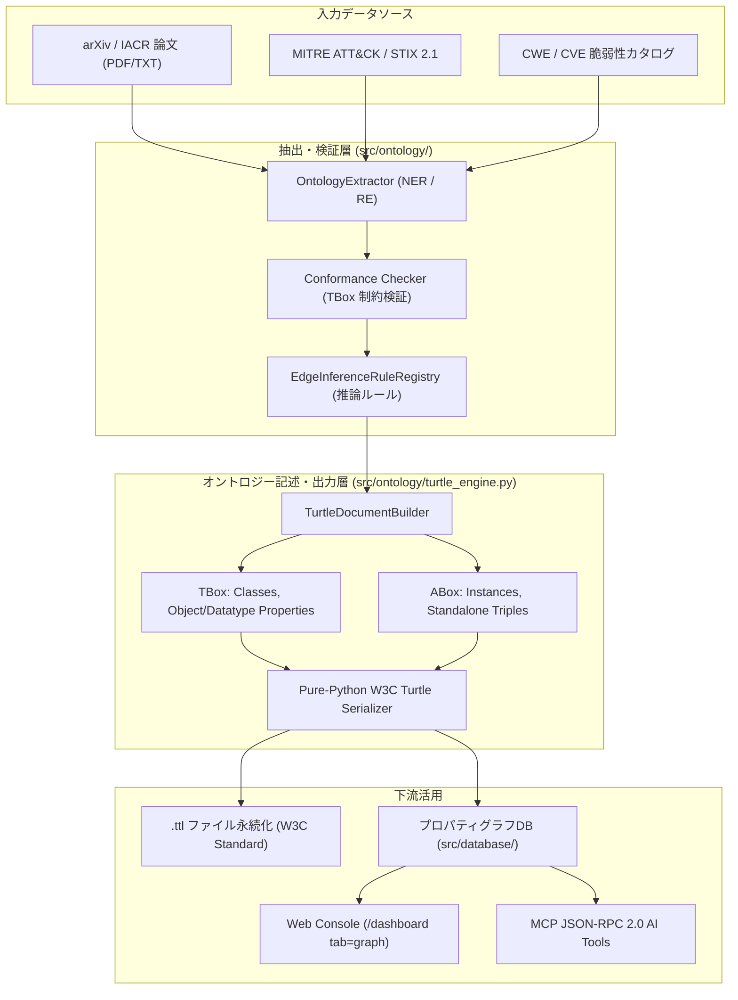

# [DSN-22] セキュリティおよび脅威知識オントロジー W3C Turtle/OWL 仕様書 (Security & Threat Ontology W3C Specification)

本ドキュメントは、「`arxiv-security-papers`」における知識モデリングの最上位規格である **セキュリティ知識オントロジー（SKO: Security Knowledge Ontology）** の W3C RDF 1.1 Turtle / OWL 2 仕様、およびそれを純粋 Python で構築・シリアライズする **Turtle 生成エンジン (`src/ontology/turtle_engine.py`)** の詳細設計書です。

---

## 1. アーキテクチャ概要 (Architectural Overview)

オントロジー駆動アーキテクチャ（ODA）の中核として、非構造な論文テキストや CTI データから抽出されたエンティティを、曖昧さのない標準知識モデル（W3C Turtle / OWL 形式）へ形式化・エクスポートする仕組みを提供します。



---

## 2. Turtle 生成エンジン内部設計 (`src/ontology/turtle_engine.py`)

### 2.1 クラス設計と型階層 (Class Hierarchy)

| クラス名 | 役割 | 主要属性 / メソッド |
| :--- | :--- | :--- |
| **`RDFTerm`** | すべての RDF 用語の抽象基底クラス | `to_turtle() -> str` |
| **`URI`** | IRI またはプレフィックス付き修飾名 (CURIE) | `value: str` (`<http://...>` または `ex:Agent`) |
| **`Literal`** | 値、データ型、言語タグを保持する RDF リテラル | `value: Any`, `lang: Optional[str]`, `datatype: Optional[str]` |
| **`OntologyMetadata`** | `owl:Ontology` ヘッダー定義 | `uri`, `label`, `comment`, `version_info`, `imports` |
| **`OntologyClass`** | `owl:Class` 定義 | `uri`, `label`, `sub_class_of`, `disjoint_with`, `comment` |
| **`ObjectProperty`** | `owl:ObjectProperty` (エンティティ間関係) | `uri`, `domain`, `range_`, `inverse_of`, `is_transitive`, `is_symmetric` |
| **`DatatypeProperty`**| `owl:DatatypeProperty` (属性値・リテラル) | `uri`, `domain`, `range_`, `is_functional` |
| **`OntologyInstance`**| ABox 実体インスタンス定義 | `uri`, `rdf_types: List[str]`, `properties: List[Tuple[str, Any]]` |
| **`RawTriple`** | 単独のトリプル表明 | `subject`, `predicate`, `object_`, `comment` |
| **`TurtleDocumentBuilder`** | ドキュメント全体の組み立て・シリアライズ | `add_prefix()`, `add_class()`, `serialize()`, `save()` |

### 2.2 W3C RDF 1.1 Turtle 構文規則への完全準拠

1. **プレフィックス宣言**: `@prefix <prefix>: <URI> .` 形式でアルファベット順に整列出力。
2. **トリプルの文法**:
   - 同一主語における複数の述語-目的語ペアはセミコロン（`;`）で連結。
   - 同一述語における複数の目的語（`rdf:type` の複数指定など）はカンマ（`,`）で連結。
   - トリプルの終端はピリオド（`.`）で区切る。
3. **リテラルと特殊文字エスケープ**:
   - `\`, `"`, `\n`, `\t` などのエスケープ処理を `_escape_turtle_string()` で厳密に実施。
   - 型指定リテラル（`"2026-04-10T14:30:00Z"^^xsd:dateTime`）および言語タグ（`"エージェント"@ja`）の完全サポート。
   - 整数・浮動小数点数・真偽値は、W3C 規格で許容されている raw リテラル（`8`, `true`, `false`）としても出力可能。
4. **計算複雑度（Cyclomatic Complexity）**:
   - すべての関数・メソッドを細分化し、**Xenon Grade A (CC <= 5)** を 100% 達成。

---

## 3. セキュリティ知識オントロジー (SKO) TBox 定義仕様

システムが標準提供する `sec:` 名前空間 (`https://arxiv-security-papers.org/ontology/security#`) の定義：

### 3.1 コアクラス (Core Classes)

```turtle
sec:Paper            rdf:type owl:Class ; rdfs:label "セキュリティ論文"@ja .
sec:ThreatActor      rdf:type owl:Class ; rdfs:label "脅威アクター"@ja .
sec:AttackTechnique  rdf:type owl:Class ; rdfs:label "攻撃手法"@ja .
sec:Vulnerability    rdf:type owl:Class ; rdfs:label "脆弱性"@ja .
sec:TargetAsset      rdf:type owl:Class ; rdfs:label "対象資産"@ja .
sec:DefenseMechanism rdf:type owl:Class ; rdfs:label "防御メカニズム"@ja .
sec:BenchmarkMetric  rdf:type owl:Class ; rdfs:label "評価ベンチマーク指標"@ja .
```

### 3.2 コアオブジェクトプロパティ (Core Object Properties)

| プロパティ名 | 日本語ラベル | 定義域 (`domain`) | 値域 (`range`) | 特性 (`owl:type` / `inverseOf`) |
| :--- | :--- | :--- | :--- | :--- |
| `sec:discloses` | 脆弱性を公開・開示する | `sec:Paper` | `sec:Vulnerability` | `owl:ObjectProperty` |
| `sec:exploits` | 脆弱性を悪用する | `sec:AttackTechnique` | `sec:Vulnerability` | `owl:ObjectProperty` |
| `sec:analyzes` | 攻撃手法を分析する | `sec:Paper` | `sec:AttackTechnique` | `owl:ObjectProperty` |
| `sec:targets` | 資産を標的とする | `sec:AttackTechnique` | `sec:TargetAsset` | `owl:ObjectProperty` |
| `sec:proposes` | 防御策を提案する | `sec:Paper` | `sec:DefenseMechanism`| `owl:ObjectProperty` |
| `sec:mitigates` | 攻撃手法を緩和・防御する | `sec:DefenseMechanism`| `sec:AttackTechnique` | `owl:ObjectProperty` |
| `sec:patches` | 脆弱性を改修・修復する | `sec:DefenseMechanism`| `sec:Vulnerability` | `owl:ObjectProperty` |
| `sec:evaluates` | 評価指標で測定する | `sec:Paper` | `sec:BenchmarkMetric` | `owl:ObjectProperty` |
| `sec:attributedTo` | 脅威アクターに帰属する | `sec:AttackTechnique`| `sec:ThreatActor` | `owl:ObjectProperty` |
| `sec:cites` | 先行研究を引用する | `sec:Paper` | `sec:Paper` | `owl:ObjectProperty` |

---

## 4. Python コードによるオントロジー定義の完全記述例

ユーザーより提示された企業オントロジー（`ex:Agent`, `ex:belongsTo`, `ex:emp_001` 等）を構築・出力する Python コード例：

```python
from ontology.turtle_engine import (
    Literal,
    TurtleDocumentBuilder,
    URI,
)

builder = TurtleDocumentBuilder()
builder.add_prefix("ex", "https://example.com/ontology/corp#")
builder.set_ontology(
    uri="https://example.com/ontology/corp",
    label="Enterprise Knowledge Ontology",
    label_lang="ja",
    comment="組織、プロジェクト、スキル、成果物を管理・推論するためのオントロジーモデル",
    comment_lang="ja",
    version_info="1.0.0",
)

# 1. クラス定義
builder.add_class("ex:Agent", label="エージェント", comment="行動の主体となる概念（人間または組織）")
builder.add_class("ex:Person", sub_class_of="ex:Agent", label="人物", disjoint_with=["ex:Organization"])
builder.add_class("ex:Organization", sub_class_of="ex:Agent", label="組織")
builder.add_class("ex:Project", label="プロジェクト")
builder.add_class("ex:Skill", label="スキル")
builder.add_class("ex:Artifact", label="成果物")

# 2. オブジェクトプロパティ定義
builder.add_object_property("ex:belongsTo", label="所属する", domain="ex:Person", range_="ex:Organization")
builder.add_object_property("ex:hasMember", label="メンバーを有する", inverse_of="ex:belongsTo")
builder.add_object_property(
    "ex:subOrganizationOf",
    label="上位組織である",
    domain="ex:Organization",
    range_="ex:Organization",
    is_transitive=True,
)
builder.add_object_property("ex:assignedTo", label="アサインされている", domain="ex:Person", range_="ex:Project")
builder.add_object_property("ex:hasSkill", label="スキルを保有する", domain="ex:Person", range_="ex:Skill")
builder.add_object_property("ex:createdArtifact", label="成果物を作成した", domain="ex:Person", range_="ex:Artifact")

# 3. データプロパティ定義
builder.add_datatype_property("ex:personId", label="社員ID", domain="ex:Person", range_="xsd:string", is_functional=True)
builder.add_datatype_property("ex:name", label="名称", domain="owl:Thing", range_="xsd:string")
builder.add_datatype_property("ex:experienceYears", label="経験年数", domain="ex:Person", range_="xsd:integer")
builder.add_datatype_property("ex:createdAt", label="作成日時", domain="ex:Artifact", range_="xsd:dateTime")

# 4. ABox インスタンス定義
builder.add_instance("ex:dept_eng", rdf_types=["ex:Organization"], properties=[("ex:name", "技術統括部")])
builder.add_instance(
    "ex:team_sec",
    rdf_types=["ex:Organization"],
    properties=[("ex:name", "セキュリティ技術チーム"), ("ex:subOrganizationOf", URI("ex:dept_eng"))],
)
builder.add_instance("ex:skill_python", rdf_types=["ex:Skill"], properties=[("ex:name", "Python")])
builder.add_instance("ex:skill_appsec", rdf_types=["ex:Skill"], properties=[("ex:name", "Application Security")])
builder.add_instance(
    "ex:emp_001",
    rdf_types=["ex:Person"],
    properties=[
        ("ex:personId", "EMP-001"),
        ("ex:name", "田中 太郎"),
        ("ex:experienceYears", 8),
        ("ex:belongsTo", URI("ex:team_sec")),
        ("ex:hasSkill", URI("ex:skill_python")),
        ("ex:hasSkill", URI("ex:skill_appsec")),
    ],
)
builder.add_instance(
    "ex:doc_sec_spec",
    rdf_types=["ex:Artifact"],
    properties=[
        ("ex:name", "認証認可基盤 脅威分析仕様書"),
        ("ex:createdAt", Literal("2026-04-10T14:30:00Z", datatype="xsd:dateTime")),
    ],
)
builder.add_triple("ex:emp_001", "ex:createdArtifact", "ex:doc_sec_spec")

# シリアライズ
turtle_output = builder.serialize()
```

---

## 5. トレーサビリティマトリクス (Traceability)

- [REQ-ONT-01: オントロジー駆動知識アーキテクチャ要求仕様書](../requirements/REQ-ONT-01_ontology_driven_knowledge_architecture.md)
- [MNG-03: オントロジー駆動開発プロセス規範](../processes/ontology_driven_development_process.md)
- [MNG-01: 文書管理台帳](../processes/MNG-01-document_ledger.md)
- [DSN-14: 次世代データベース・知識グラフエンジン設計書](DSN-14-graph_engineering_dashboard.md)
- [src/ontology/turtle_engine.py](../../src/ontology/turtle_engine.py)
- [tests/ontology/test_turtle_engine.py](../../tests/ontology/test_turtle_engine.py)
