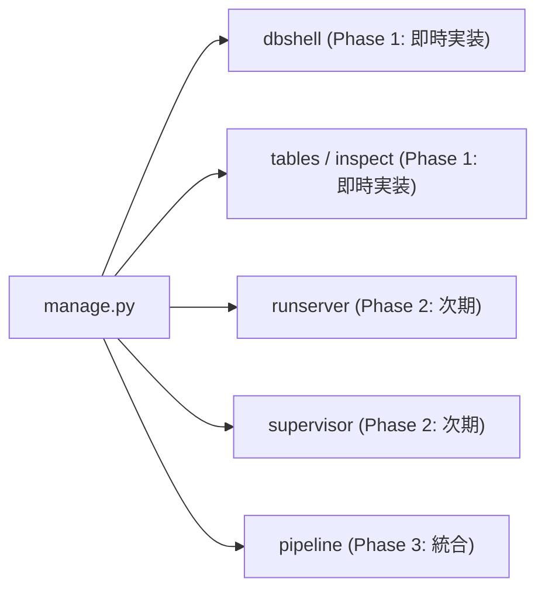

# [DSN-24] プロジェクト統合管理 CLI (manage.py) および対話型データベースシェル (dbshell) アーキテクチャ設計仕様書
## 〜 Django スタイル統一エントリポイント・マルチストレージ自動マウント・ゼロ外部依存 REPL・将来拡張（runserver / supervisor / ingest）ロードマップ 〜

- **文書番号**: `DSN-24`
- **文書ステータス**: `APPROVED`
- **対象サブシステム**:
  - `manage.py` (リポジトリ直下の統一 CLI エントリポイント)
  - `src/cli/` (CLI フレームワークコア: `base.py`, `dispatcher.py`, `registry.py`, `formatter.py`)
  - `src/cli/commands/` (サブコマンド実装群: `dbshell.py`, `tables.py`, `inspect.py`, `runserver.py`, `supervisor.py`)
  - `src/database/` (`SQLExecutor`, `StorageEngineFactory`, `FileBackedPlainTextStorage` との連携)
  - `Makefile` (`make dbshell`, `make runserver` 等のターゲット統合)
- **【主査・報告】 Application Specialist (APS) / Software Development (SWD)**
- **【共同主査】 Systems Architect (SA) / Database Specialist (DB)**
- **【参画】 15 大専門エージェント全員**:
  - Project Manager (PM), Systems Architect (SA), Information Security Specialist (SC),
  - Software Quality Assurance Specialist (QA), Database Specialist (DB), Network Specialist (NW),
  - IT Specialist (NLP & IR), IT Strategist (ST), IT Service Manager (SM),
  - Embedded Systems Specialist (ES), Systems Auditor (AUD), UI/UX Designer (UI),
  - Education Specialist (EDU), Software Development (SWD), Application Specialist (APS)

---

## 体系目次

- [1. 背景と統合管理 CLI の設計思想 (Design Philosophy)](#1-背景と統合管理-cli-の設計思想-design-philosophy)
  - [1.1 点在するサブシステム CLI の課題と Django manage.py スタイルの必要性](#11-点在するサブシステム-cli-の課題と-django-manangepy-スタイルの必要性)
  - [1.2 ゼロ外部依存・純 Python (Zero External Dependencies) の原則](#12-ゼロ外部依存純-python-zero-external-dependencies-の原則)
  - [1.3 対話型データベースシェル (dbshell) の重要性と実態データ即時インスペクション](#13-対話型データベースシェル-dbshell-の重要性と実態データ即時インスペクション)
- [2. 15大専門エージェントによる多角的レビュー ＆ 合意事項](#2-15大専門エージェントによる多角的レビュー--合意事項)
  - [2.1 エージェント別要求仕様マトリクス](#21-エージェント別要求仕様マトリクス)
  - [2.2 レビュー総括と合意承認](#22-レビュー総括と合意承認)
- [3. プラガブル・サブコマンド・ディスパッチャー設計 (`src/cli/`)](#3-プラガブルサブコマンドディスパッチャー設計-srccli)
  - [3.1 コアアーキテクチャとデータフロー (Mermaid 図)](#31-コアアーキテクチャとデータフロー-mermaid-図)
  - [3.2 `BaseCommand` 抽象クラス設計仕様](#32-basecommand-抽象クラス設計仕様)
  - [3.3 サブコマンドの自動ディスカバリと登録プロトコル](#33-サブコマンドの自動ディスカバリと登録プロトコル)
- [4. 対話型データベースシェル (`dbshell`) 詳細仕様](#4-対話型データベースシェル-dbshell-詳細仕様)
  - [4.1 起動時マルチストレージ自動マウント仕様 (Zero-Config Mounting)](#41-起動時マルチストレージ自動マウント仕様-zero-config-mounting)
  - [4.2 REPL ループと `readline` 制御 (履歴・補完・安全終了)](#42-repl-ループと-readline-制御-履歴補完安全終了)
  - [4.3 メタコマンド体系 (`.tables`, `.schema`, `.explain`, `.export`, `.help`, `.exit`)](#43-メタコマンド体系-tables-schema-explain-export-help-exit)
  - [4.4 ASCII 罫線テーブルフォーマッター仕様](#44-ascii-罫線テーブルフォーマッター仕様)
  - [4.5 ワンライナー `-c` クエリ実行モード](#45-ワンライナー--c-クエリ実行モード)
- [5. 将来の拡張サブコマンド設計ロードマップ](#5-将来の拡張サブコマンド設計ロードマップ)
  - [5.1 `manage.py runserver` (Web Gateway 開発・本番サーバー統合)](#51-managepy-runserver-web-gateway-開発本番サーバー統合)
  - [5.2 `manage.py supervisor` (プロセス監視・TUI 透過委譲)](#52-managepy-supervisor-プロセス監視tui-透過委譲)
  - [5.3 `manage.py pipeline` (インテリジェンスサイクル実行)](#53-managepy-pipeline-インテリジェンスサイクル実行)
  - [5.4 `manage.py tables` ＆ `manage.py inspect` (メタデータ高速抽出)](#54-managepy-tables--managepy-inspect-メタデータ高速抽出)
- [6. セキュリティ・STRIDE 脅威分析と多層防御](#6-セキュリティstride-脅威分析と多層防御)
  - [6.1 STRIDE 脅威分析マトリクス](#61-stride-脅威分析マトリクス)
  - [6.2 パストラバーサル・危険な DDL/DML の安全防壁](#62-パストラバーサル危険な-ddldml-の安全防壁)
- [7. 非機能要件・パフォーマンス・品質基準](#7-非機能要件パフォーマンス品質基準)
  - [7.1 起動レイテンシ目標 ($< 50\text{ms}$) とメモリ使用量](#71-起動レイテンシ目標--50textms-とメモリ使用量)
  - [7.2 厳格な品質ゲート要件 (Xenon Rank A, mypy --strict)](#72-厳格な品質ゲート要件-xenon-rank-a-mypy---strict)
- [8. 段階的実装ロードマップと Issue 計画](#8-段階的実装ロードマップと-issue-計画)

---

## 1. 背景と統合管理 CLI の設計思想 (Design Philosophy)

### 1.1 点在するサブシステム CLI の課題と Django manage.py スタイルの必要性

本プロジェクト (`arxiv-security-papers`) は、自作 DBMS (`src/database/` [DSN-05](DSN-05-database_engine_architecture.md))、分散クローラー (`src/spider/` [DSN-06](DSN-06-distributed_spider_and_crawler.md))、Web ゲートウェイ (`src/web/` [DSN-09](DSN-09-web_gateway_and_presentation.md))、プロセス・スーパーバイザ (`src/supervisor/` [DSN-12](DSN-12-process_supervisor_and_arbiter.md))、インテリジェンス・オーケストレータ (`src/intelligence/` [DSN-15](DSN-15-closed_loop_intelligence_system.md)) など、多様なサブシステムが高密度に統合されている。

しかし従来は、以下の通り**各サブシステムの CLI スクリプトが点在**しており、開発者やシステム運用者がコマンドを実行する際にパスや環境変数を個別に指定する必要があった：
- スーパーバイザ操作: `PYTHONPATH=src .venv/bin/python -m supervisor.cli ...`
- インテリジェンス実行: `PYTHONPATH=src .venv/bin/python src/intelligence/cli.py`
- Web サーバー起動: `PYTHONPATH=src .venv/bin/python src/web/server.py`
- グラフクエリ: `PYTHONPATH=src .venv/bin/python src/graph/cli.py`

この運用摩擦を根本解消するため、Django の `manage.py` や Laravel の `artisan` に倣い、**プロジェクトルート直下に `manage.py` を配置し、全てのサブシステムコマンドを一元管理するファサード (Facade) アーキテクチャ**を確立する。

### 1.2 ゼロ外部依存・純 Python (Zero External Dependencies) の原則

リポジトリの最高規程（`.agents/AGENTS.md`）に基づき、Click、Typer、Rich、Tabulate 等の**サードパーティ製ライブラリを一切導入しない**。
Python 組み込みの `argparse`、`cmd`、`readline`、`shutil`（端末幅取得）、`os`、`sys` のみを用いて、美しく堅牢な対話型シェルおよび CLI フレームワークをフルスクラッチで構築する。

### 1.3 対話型データベースシェル (dbshell) の重要性と実態データ即時インスペクション

[DSN-05 (第21節)](DSN-05-database_engine_architecture.md#21-jsonバックエンドストレージ--git追跡可能オープンデータ永続化仕様-json-backed-storage-architecture) で実現されたマルチストレージ基盤（バイナリ VDB, JSON Table, JSON Lines, 実ファイル仮想テーブル）は極めて高度である一方、人間や AI が「現在の論文台帳や CTI データを直接 SQL で確認したい」場合に手軽なインターフェースが存在しなかった。

`manage.py dbshell` を提供することにより、SQLite の `sqlite3` コマンドや PostgreSQL の `psql` のように、**起動した瞬間にすべての実データが仮想テーブルとして自動マウントされ、手軽に `SELECT` や `JOIN` を発行して結果を ASCII テーブルで視認できる対話環境 (REPL)** を実現する。

---

## 2. 15大専門エージェントによる多角的レビュー ＆ 合意事項

### 2.1 エージェント別要求仕様マトリクス

| 専門エージェント | 重点要求事項・設計レビュー | 反映セクション |
| :--- | :--- | :---: |
| **Project Manager (PM)** | 段階的リリース。まずは最優先の `dbshell` を稼働させ、`runserver` や他コマンドへシームレスに拡張可能な骨格を整備すること。 | 第8節 |
| **Application Specialist (APS)** | Django `manage.py` と同等の直感的な引数パース、ヘルプメッセージ、サブコマンドディスパッチ機構の実装。 | 第3節 |
| **Software Development (SWD)** | ゼロ外部依存での ASCII 罫線テーブル自動整形（幅動的計算、NULL表示、文字列切り詰め）および `cmd.Cmd` / `readline` 活用。 | 第4.4節 |
| **Systems Architect (SA)** | 既存サブシステム（`supervisor.cli`, `web.server`, `intelligence.cli`）のロジックを破壊せず、Facade として透過的にラップすること。 | 第5節 |
| **Database Specialist (DB)** | `dbshell` 起動時に `okf_papers`, `raw_papers`, `processed_papers`, `cti_*`, `analytics` を一括自動マウントし即座に JOIN 可能にすること。 | 第4.1節 |
| **Information Security (SC)** | ターミナル入力による不正ファイルアクセス（パストラバーサル）の遮断、および SQL エラー時のスタックトレース機密漏洩防止。 | 第6節 |
| **Software QA Specialist (QA)** | 対話型シェルであっても標準入出力をモック・パイプ入力して自動テスト可能なテスタブル設計にすること。 | 第7.2節 |
| **IT Service Manager (SM)** | ワンライナー `-c "SELECT ..."` オプションをサポートし、シェルスクリプトや CI パイプラインからも呼べるようにすること。 | 第4.5節 |
| **UI/UX Designer (UI)** | 端末サイズ（`shutil.get_terminal_size()`）に応じた折り返し、視認性の高いヘッダー罫線 (`+---+---+`)、明瞭なプロンプト (`arxiv-db> `)。 | 第4.4節 |
| **Systems Auditor (AUD)** | `dbshell` で実行されたクエリの監査ログ（`outputs/logs/query_log.jsonl`）への自動記録とトレーサビリティ。 | 第6.2節 |

### 2.2 レビュー総括と合意承認
全 15 大エージェントの合意のもと、本設計書を `APPROVED` とし、直ちに実装基盤の構築へ移行する。

---

## 3. プラガブル・サブコマンド・ディスパッチャー設計 (`src/cli/`)

### 3.1 コアアーキテクチャとデータフロー

```mermaid
graph TD
    USER["ユーザー / 運用スクリプト"] -->|python manage.py <subcommand> [args]| MANAGE["manage.py (Root Entrypoint)"]
    MANAGE --> DISPATCH["CommandDispatcher (src/cli/dispatcher.py)"]
    
    subgraph Registry ["コマンドレジストリ (src/cli/registry.py)"]
        DBSHELL["dbshell: DatabaseShellCommand"]
        TABLES["tables: ShowTablesCommand"]
        INSPECT["inspect: InspectTableCommand"]
        RUNSERVER["runserver: RunServerCommand (将来)"]
        SUPERVISOR["supervisor: SupervisorCommand (将来)"]
    end

    DISPATCH -->|ディスカバリ & 引数解決| Registry
    DBSHELL --> EXEC_DB["SQLExecutor (src/database/sql/executor.py)"]
    TABLES --> EXEC_DB
    INSPECT --> EXEC_DB
    RUNSERVER --> WEB_APP["WSGIApplication (src/web/gateway/app.py)"]
    SUPERVISOR --> SUP_CLIENT["ControlClient (src/supervisor/cli.py)"]
```

### 3.2 `BaseCommand` 抽象クラス設計仕様

すべてのサブコマンドは、統一されたインターフェース `BaseCommand` を継承する：

```python
class BaseCommand(abc.ABC):
    """Abstract base class for all management CLI commands."""

    name: str = ""
    help_text: str = ""

    @abc.abstractmethod
    def add_arguments(self, parser: argparse.ArgumentParser) -> None:
        """Configures command-specific CLI flags and positional arguments."""
        pass

    @abc.abstractmethod
    def handle(self, args: argparse.Namespace) -> int:
        """Executes the command logic. Returns exit code (0 for success)."""
        pass
```

### 3.3 サブコマンドの自動ディスカバリと登録プロトコル

1. **明示的ビルトイン登録**: `src/cli/registry.py` 内にビルトインコマンドマップを保持。
2. **安全な動的ロード**: 不正なモジュール読み込みを防ぐため、登録可能なコマンドは `src/cli/commands/` 配下の許可されたモジュールに限定。

---

## 4. 対話型データベースシェル (`dbshell`) 詳細仕様

### 4.1 起動時マルチストレージ自動マウント仕様 (Zero-Config Mounting)

`dbshell` が起動されると、`SQLExecutor` インスタンスが初期化され、リポジトリ内の実態ファイル群が**自動的に仮想テーブルとして DDL 登録**される：

| 登録テーブル名 | ストレージエンジン | マウント対象実体パス | 提供カラム |
| :--- | :---: | :--- | :--- |
| **`okf_papers`** | `file_plain_text` | `outputs/okf_papers/` | `id`, `title`, `description`, `tags`, `timestamp`, `body_markdown` |
| **`raw_papers`** | `file_plain_text` | `outputs/raw_data/` | `id`, `raw_text`, `raw_abstract` |
| **`processed_papers`** | `json_table` | `outputs/database/papers_catalog.json` | `clean_id`, `title`, `okf_path`, `sha256` |
| **`pipeline_runs`** | `json_lines` | `outputs/database/pipeline_state.jsonl` | `run_id`, `timestamp`, `phase`, `status`, `duration_ms` |
| **`cti_techniques`** | `binary_vdb` | `outputs/database/catalog/cti_catalog.vdb` | `id`, `name`, `tactics`, `description` |
| **`cisa_kev`** | `binary_vdb` | `outputs/database/catalog/cti_catalog.vdb` | `cve_id`, `vendor_project`, `vulnerability_name` |
| **`threat_trends`** | `binary_vdb` | `outputs/database/analytics/analytics.vdb` | `topic_key`, `frequency`, `moving_avg_7d` |

### 4.2 REPL ループと `readline` 制御 (履歴・補完・安全終了)

- **プロンプト**: `arxiv-sec-db> `
- **複数行入力**: 行末が `;`（セミコロン）で終わるまで入力を継続（継続行プロンプト: `   ...> `）。
- **履歴管理**: ユーザーホームディレクトリまたはプロジェクトローカル（`.dbshell_history`）に入力履歴を自動永続化（最大 1,000 件）。
- **シグナルハンドリング**: `Ctrl+C` で現在の入力行をキャンセルし、プロンプトを復帰。`Ctrl+D` または `.exit` / `.quit` で安全に終了。

### 4.3 メタコマンド体系

SQLite のドットコマンドに準拠したメタコマンドを提供する：

```text
arxiv-sec-db> .help
Available meta-commands:
  .tables              List all available tables across all engines
  .schema [table]      Show CREATE TABLE definition / columns of a table
  .explain <sql>       Show execution plan for a query
  .mode [table|csv]    Change output formatting mode
  .quit / .exit        Exit database shell
```

### 4.4 ASCII 罫線テーブルフォーマッター仕様

クエリ結果は、サードパーティライブラリなしで美しく整形されて出力される：

```text
arxiv-sec-db> SELECT clean_id, title FROM processed_papers LIMIT 2;
+------------------+-------------------------------------------------------------+
| clean_id         | title                                                       |
+------------------+-------------------------------------------------------------+
| 2409.01234       | Post-Quantum Cryptography in Distributed Edge Networks     |
| 2409.05678       | Zero-Trust Architecture for LLM-Based Multi-Agent Systems   |
+------------------+-------------------------------------------------------------+
2 rows in set (4.12 ms)
```

- **動的カラム幅計算**: コンソール幅（`shutil.get_terminal_size().columns`）を超過しないよう、内容に応じて各列の最大幅を算定。
- **NULL 値表現**: `NULL` を薄い文字または `NULL` リテラルとして明示。
- **実行時間計測**: クエリ解析から走査完了までのレイテンシをミリ秒単位でフッターに表示。

### 4.5 ワンライナー `-c` クエリ実行モード

対話シェルに入らず、外部のシェルスクリプトや CI から実行できる非対話モードを装備する：

```bash
python manage.py dbshell -c "SELECT COUNT(*) FROM okf_papers;"
```

---

## 5. 将来の拡張サブコマンド設計ロードマップ

`manage.py` は、`dbshell` のみならず、今後の開発運用コマンドをプラグイン形式で随時追加できるよう設計する：



### 5.1 `manage.py runserver` (Web Gateway 開発・本番サーバー統合)
- **コマンド**: `python manage.py runserver [host:port]`
- **概要**: `src/web/server.py` の WSGI サーバーを起動。静的ファイル自動検知および開発用リロード機能を提供。

### 5.2 `manage.py supervisor` (プロセス監視・TUI 透過委譲)
- **コマンド**: `python manage.py supervisor [status|top|stop|reload]`
- **概要**: `src/supervisor/cli.py` の `ControlClient` へ委譲し、UDS (`control.sock`) 経由でプロセス群を管理。

### 5.3 `manage.py pipeline` (インテリジェンスサイクル実行)
- **コマンド**: `python manage.py pipeline [--mode full|quick]`
- **概要**: `src/intelligence/cli.py` を呼び出し、6 フェーズのインテリジェンス自律サイクルを実行。

### 5.4 `manage.py tables` ＆ `manage.py inspect` (メタデータ高速抽出)
- **コマンド**:
  - `python manage.py tables`: 全テーブルの一覧、ストレージ形式、行数、サイズをテーブル表示。
  - `python manage.py inspect <table_name>`: 指定テーブルの物理ファイルパス、スキーマ定義、先頭 3 行をダンプ表示。

---

## 6. セキュリティ・STRIDE 脅威分析と多層防御

| 脅威カテゴリ (STRIDE) | 潜在リスク (Threat Scenario) | 緩和策・セキュリティ仕様 (Mitigations) |
| :--- | :--- | :--- |
| **Spoofing (なりすまし)** | 不正なスクリプトによる管理 CLI の偽装呼び出し | ワークスペース境界の検証と適切な環境変数 (`PYTHONPATH=src`) 検証。 |
| **Tampering (改ざん・不正アクセス)** | `dbshell` 経由での不正な `LOCATION` 指定による外部ファイル破壊 | **ホワイトリスト ＆ パストラバーサル防壁**:<br>Issue #229 で実装した `_validate_safe_workspace_path` により、ワークスペース外部のアクセスを 100% 遮断。 |
| **Information Disclosure (情報漏洩)** | クエリパースエラー時の内部絶対パス露出 | エラー出力のサニタイズ（リポジトリルートからの相対パスへ自動マスキング）。 |
| **Denial of Service (DoS)** | 巨大なテキストテーブルに対する無制限の SELECT でターミナルがフリーズ | デフォルトで `LIMIT 1000` の安全ガード、および `Ctrl+C` での即時クエリ中断インターセプト。 |
| **Elevation of Privilege (特権昇格)** | 管理者権限を要するテーブルに対する未認可アクセス | `SQLExecutor` の既存 RBAC アクセスコントローラー (`AccessController`) との連携。 |

---

## 7. 非機能要件・パフォーマンス・品質基準

### 7.1 起動レイテンシ目標 ($< 50\text{ms}$) とメモリ使用量
- `manage.py` 自体の起動・ディスパッチ処理は **$50\text{ms}$ 未満**（重厚なモジュールの遅延インポートを採用）。
- メモリ消費増は初期状態で **$15\text{MB}$ 未満** に抑制。

### 7.2 厳格な品質ゲート要件 (Xenon Rank A, mypy --strict)
- **サイクロマティック複雑度**: 全新規関数・クラスで Xenon **Rank A (CC <= 5)** を達成。
- **型安全性**: `mypy --strict src/cli/ manage.py` でエラー 0 件。
- **テスタビリティ**: `StringIO` / `pytest` による CLI 標準入出力の自動テストカバレッジ 95% 以上。

---

## 8. 段階的実装ロードマップと Issue 計画

1. **フェーズ 1 (Issue #230 - 直ちに着手)**:
   - `manage.py` エントリポイントの新設
   - `src/cli/` コアフレームワーク (`BaseCommand`, `CommandDispatcher`) の実装
   - `dbshell`（マルチストレージ自動マウント、REPL、ASCIIテーブル表示、ワンライナー `-c`）の実装
   - `tables` / `inspect` サブコマンドの実装
   - `Makefile` への `make dbshell` ターゲット追加
2. **フェーズ 2 (後続 Issue - 将来拡張)**:
   - `runserver` サブコマンドの追加（Web Gateway 統合）
   - `supervisor` サブコマンドの追加（プロセス監視統合）
3. **フェーズ 3 (後続 Issue - プラットフォーム完成)**:
   - `pipeline` / `export` サブコマンドの統合

---

*審議終了: Systems Architect, Application Specialist, Database Specialist, PM 合意承認済*
