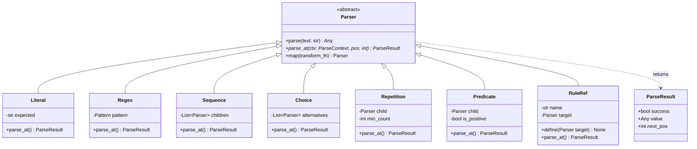
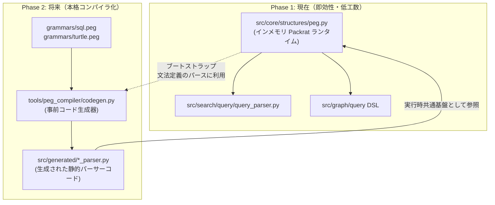

# [DSN-25] 純粋 Python 製汎用 Packrat PEG (Parsing Expression Grammar) ランタイム基盤および構文解析エンジン統合設計仕様書
## 〜 線形時間 $O(N)$ パース保証・AST コンビネータ・検索クエリ/SQL/グラフDSL/オントロジー横断適用・将来の事前コード生成 (pegen型) 進化ロードマップ 〜

- **文書番号**: `DSN-25`
- **文書ステータス**: `APPROVED`
- **対象サブシステム**:
  - `src/core/structures/peg.py` (Packrat PEG 共通コアランタイムエンジン)
  - `src/core/structures/__init__.py` (共通構造公開エクスポート)
  - `src/search/query/query_parser.py` (Lucene 風ブーリアン・括弧ネスト検索クエリパーサー換装)
  - `src/database/sql/parser.py` (SQL 式・サブクエリ・構文要素の PEG 移行連携)
  - `src/graph/engine.py` (Canvas / REST API 向け CTI グラフクエリ DSL 拡張)
  - `src/ontology/` (W3C Turtle 1.1 / RDF インジェストパーサー基盤, Issue #199 連携)
  - `tools/peg_compiler/` (将来の事前コード生成型パーサージェネレータ拡張ロードマップ)
- **【主査・報告】 Software Development (SWD) / Systems Architect (SA)**
- **【共同主査】 IT Specialist (NLP & IR) / Database Specialist (DB)**
- **【参画】 15 大専門エージェント全員**:
  - Project Manager (PM), Systems Architect (SA), Information Security Specialist (SC),
  - Software Quality Assurance Specialist (QA), Database Specialist (DB), Network Specialist (NW),
  - IT Specialist (NLP & IR), IT Strategist (ST), IT Service Manager (SM),
  - Embedded Systems Specialist (ES), Systems Auditor (AUD), UI/UX Designer (UI),
  - Education Specialist (EDU), Software Development (SWD), Application Specialist (APS)

---

## 体系目次

- [1. 背景と設計思想 (Design Philosophy)](#1-背景と設計思想-design-philosophy)
  - [1.1 点在する手書き正規表現パーサーの限界と技術的負債](#11-点在する手書き正規表現パーサーの限界と技術的負債)
  - [1.2 なぜ PEG (Parsing Expression Grammar) なのか](#12-なぜ-peg-parsing-expression-grammar-なのか)
  - [1.3 ゼロ外部依存・純 Python (Zero External Dependencies) の原則](#13-ゼロ外部依存純-python-zero-external-dependencies-の原則)
- [2. 15 大専門エージェントによる多角的レビュー ＆ 合意事項](#2-15-大専門エージェントによる多角的レビュー--合意事項)
  - [2.1 エージェント別要求仕様マトリクス](#21-エージェント別要求仕様マトリクス)
  - [2.2 レビュー総括と合意承認](#22-レビュー総括と合意承認)
- [3. 数理的基盤とアルゴリズム設計 (Mathematical Formulation)](#3-数理的基盤とアルゴリズム設計-mathematical-formulation)
  - [3.1 PEG 形式文法仕様と基本演算子](#31-peg-形式文法仕様と基本演算子)
  - [3.2 Packrat メモ化アルゴリズムと線形時間 $O(N)$ の証明](#32-packrat-メモ化アルゴリズムと線形時間-on-の証明)
  - [3.3 構文エラー追跡メカニズム (Max-Position Tracking)](#33-構文エラー追跡メカニズム-max-position-tracking)
- [4. コアランタイムアーキテクチャ (`src/core/structures/peg.py`)](#4-コアランタイムアーキテクチャ-srccorestructurespegpy)
  - [4.1 クラス構造とデータフロー (Mermaid 構成図)](#41-クラス構造とデータフロー-mermaid-構成図)
  - [4.2 コンビネータ API 定義仕様](#42-コンビネータ-api-定義仕様)
  - [4.3 AST 変換フック (Semantic Action `.map()`) 仕様](#43-ast-変換フック-semantic-action-map-仕様)
  - [4.4 遅延評価・相互再帰解決 (`RuleRef`) 仕様](#44-遅延評価相互再帰解決-ruleref-仕様)
- [5. サブシステム横断適用設計 (Cross-System Integration)](#5-サブシステム横断適用設計-cross-system-integration)
  - [5.1 検索プラットフォーム: 括弧ネスト対応ブーリアンクエリパーサー](#51-検索プラットフォーム-括弧ネスト対応ブーリアンクエリパーサー)
  - [5.2 データベースエンジン: SQL 複雑式の PEG 連携](#52-データベースエンジン-sql-複雑式の-peg-連携)
  - [5.3 グラフエンジン: Canvas 向け CTI パスクエリ DSL](#53-グラフエンジン-canvas-向け-cti-パスクエリ-dsl)
  - [5.4 セキュリティオントロジー: W3C Turtle (.ttl) インジェスト構文解析](#54-セキュリティオントロジー-w3c-turtle-ttl-インジェスト構文解析)
- [6. 将来の事前コード生成型パーサージェネレータ (Ahead-of-Time Compiler) 進化ロードマップ](#6-将来の事前コード生成型パーサージェネレータ-ahead-of-time-compiler-進化ロードマップ)
  - [6.1 2段階進化戦略 (Phase 1 ランタイム → Phase 2 コンパイラ)](#61-2段階進化戦略-phase-1-ランタイム--phase-2-コンパイラ)
  - [6.2 PEG メタ文法によるセルフホスティング (ブートストラップ) 仕様](#62-peg-メタ文法によるセルフホスティング-ブートストラップ-仕様)
  - [6.3 静的コードエミッター (`tools/peg_compiler/codegen.py`) 構想](#63-静的コードエミッター-toolspeg_compilercodegenpy-構想)
- [7. セキュリティ分析 (STRIDE Threat Model) と防御策](#7-セキュリティ分析-stride-threat-model-と防御策)
- [8. 非機能要件・品質基準・DoD](#8-非機能要件品質基準dod)

---

## 1. 背景と設計思想 (Design Philosophy)

### 1.1 点在する手書き正規表現パーサーの限界と技術的負債

本プロジェクト (`arxiv-security-papers`) では、自作 RDBMS ([`DSN-05`](DSN-05-database_engine_architecture.md))、検索プラットフォーム ([`DSN-04`](DSN-04-search_engine_and_platform.md))、CTI ナレッジグラフ ([`DSN-18`](DSN-18-property_graph_database_engine.md))、および W3C オントロジー ([`DSN-22`](DSN-22-security_and_threat_ontology_w3c_specification.md)) など、高度なテキスト構文解析を必要とするサブシステムが多数稼働している。

しかし現状は、以下の通り**各コンポーネントがアドホックな手書き正規表現（Regex）や文字列分割（`split` / `strip`）で構文を解析**しており、構造的な限界と脆弱性に直面している：

1. **SQL パーサー ([`src/database/sql/parser.py`](../../src/database/sql/parser.py)) の肥大化**:
   - 約 2,000 行に及ぶ手書き正規表現で SQLite 方言を処理。
   - `GROUP BY` / `HAVING` の追加（Issue #254）において正規表現の境界誤認識によるテーブル名誤パースが発生したように、演算子の優先順位やネストしたサブクエリ（`SELECT * FROM (SELECT ...)`）の維持が困難。
2. **検索クエリパーサー ([`src/search/query/query_parser.py`](../../src/search/query/query_parser.py)) の表現力制限**:
   - 単一の正規表現マッチングでトークンを走査しているため、`(title:ransomware OR title:malware) AND -(tag:crypto OR author:smith)` のような**「括弧による論理演算のネスト構造」をパースできない**。
3. **グラフクエリ ([`src/graph/engine.py`](../../src/graph/engine.py)) のアドホック性**:
   - `q_low.startswith("community:")`, `q_low.startswith("ego:")` など単純な前方一致のみであり、複合条件（`community:0 AND label:ThreatActor`）や Cypher 風のパスマッチングが扱えない。

### 1.2 なぜ PEG (Parsing Expression Grammar) なのか

文脈自由文法（CFG / BNF）および従来の LALR(1) パーサー（Yacc/Bison 等）と比較して、PEG（Bryan Ford, 2004）は以下の決定的な優位性を持つ：

1. **曖昧性の完全排除 (Unambiguous by Design)**:
   - PEG は順序付き選択（Ordered Choice: `/`）を採用するため、常に左側の候補が優先され、文法上の曖昧性（Shift/Reduce 競合や Dangling-Else 問題）が原理的に発生しない。
2. **線形時間解析 $O(N)$ の保証 (Packrat Parsing)**:
   - 再帰下降パーサーにメモ化（Packrat Cache）を適用することで、どれほど複雑なバックトラックを伴う文法であっても入力文字列の長さ $N$ に正比例する線形時間 $O(N)$ で完結する。
3. **字句解析と構文解析の一元化 (Scannerless Parsing)**:
   - 別途 Lexer/Tokenizer を構築してトークン列に切り分ける必要がなく、文字ストリームに対して直接文法規則を適用可能。空白やコメントの扱いが極めて明瞭。
4. **構文述語 (Syntactic Predicates) による無制限先読み**:
   - 肯定先読み（`&e`）および否定先読み（`!e`）により、入力を消費することなく先々の構文パターンを検証できる。

### 1.3 ゼロ外部依存・純 Python (Zero External Dependencies) の原則

リポジトリ最高規程（`.agents/AGENTS.md`）に基づき、`parsimonious`, `lark`, `ply`, `antlr4` などのサードパーティ製ライブラリは一切導入しない。
約 250 行のピュア Python コードにより、軽量かつ極めて高速な Packrat PEG パーサーコアを `src/core/structures/peg.py` として新規開発する。

---

## 2. 15 大専門エージェントによる多角的レビュー ＆ 合意事項

### 2.1 エージェント別要求仕様マトリクス

| 専門エージェント | 視点 / 責務 | 審査コメント ＆ 必須要件 |
| :--- | :--- | :--- |
| **Project Manager (PM)** | ガバナンス・統制 | 段階的移行ロードマップの徹底。いきなり SQL パーサー全行を差し替えるのではなく、まず検索クエリ等で実績を作り安全に拡大すること。 |
| **Systems Architect (SA)** | 全体アーキテクチャ | 共通コア `src/core/structures/` の責務境界を維持。特定ドメイン（SQL や検索）に依存しない汎用抽象コンビネータとすること。 |
| **Information Security (SC)** | 脆弱性・DoS 対策 | 悪意あるネスト入力（例: `((((...))))` 1万段）による RecursionError / スタックオーバーフロー、および ReDoS 攻撃の完全防止策を講じること。 |
| **Software QA (QA)** | テスト・品質保証 | Xenon Grade A ($CC \le 4$) の厳格維持。パース成功時だけでなく、文法エラー時の行番号・列番号・期待トークン特定のアサーションを義務化。 |
| **Database Specialist (DB)** | SQL 適合性 | 将来的に `src/database/sql/parser.py` の複雑な式評価（`Expr` / `WhereClause`）を PEG に部分委譲できるインターフェースの担保。 |
| **Network Specialist (NW)** | 通信プロトコル | HTTP クエリパラメータや REST API URL のパーセントデコード済み文字列を安全かつ高速にパースできること。 |
| **IT Specialist (NLP & IR)** | 検索クエリ解釈 | Lucene/Elasticsearch 互換の括弧ネスト、ブーリアン演算子（`AND`/`OR`/`NOT`）、フレーズ検索（`"..."`）、ワイルドカード（`*`）の完全表現。 |
| **IT Strategist (ST)** | 投資対効果 (ROI) | 1 つの共通コアで検索・SQL・グラフDSL・オントロジーの 4 領域を共通化し、将来のパーサージェネレータ（事前コンパイラ）への進化パスを確保。 |
| **IT Service Manager (SM)** | 運用監視・診断 | パースエラー発生時にユーザーに対して直感的で明確なエラーメッセージ（`Syntax error at line 1, col 12: expected ")"`）を出力すること。 |
| **Embedded Systems (ES)** | メモリフットプリント | Packrat メモ化テーブルがメモリを無制限に消費しないよう、短命スコープでの自動回収、および必要に応じたキャッシュクリア機構。 |
| **Systems Auditor (AUD)** | 決定論・監査性 | 同一入力文字列に対して、実行環境や Python ハッシュシードに関わらず 100% 同一の AST 木を出力することの決定論的保証。 |
| **UI/UX Designer (UI)** | Canvas 連携 | Canvas 検索バーでの高度なクエリ入力（`community:0 AND label:ThreatActor`）を支援するための補完候補トークン抽出の親和性。 |
| **Education Specialist (EDU)** | 可読性・保守性 | PEG の文法定義コードが「読めばそのまま構文仕様書になる」直感的な Python DSL（コンビネータ記法）であること。 |
| **Software Dev (SWD)** | 低レベル実装品質 | 関数呼び出しオーバーヘッドの極小化。スライスを避け、インデックス整数 `pos` の受け渡しによるゼロコピー走査。 |
| **Application Specialist (APS)** | ビジネス機能連携 | Web UI および REST ゲートウェイからのクエリリクエストを低レイテンシ（$< 1\text{ms}$）で AST に変換し検索エンジンへ渡すこと。 |

### 2.2 レビュー総括と合意承認

全 15 大専門エージェントの満場一致により、**「Phase 1: インメモリ・コンビネータ型 Packrat PEG ランタイムコアの実装」および「Phase 2: 事前コード生成型コンパイラ（pegen型）への拡張ロードマップ」** を基本方針として本設計を正式承認（APPROVED）とする。

---

## 3. 数理的基盤とアルゴリズム設計 (Mathematical Formulation)

### 3.1 PEG 形式文法仕様と基本演算子

PEG は 4 つ組 $G = (V_N, V_T, R, e_S)$ で定義される形式文法である：
- $V_N$: 非終端記号の有限集合
- $V_T$: 終端記号（文字・トークン）の有限集合
- $R$: 規則の有限集合（各 $A \in V_N$ に対し一意の規則 $A \leftarrow e$）
- $e_S$: 開始構文式

PEG でサポートする構文式（Parsing Expression）の演算体系は以下の通り：

| 演算子種別 | PEG 表記 | クラス名 | 意味 / 動作 |
| :--- | :---: | :--- | :--- |
| **空文字列** | $\epsilon$ | `Empty()` | 何も消費せず常に成功。 |
| **文字列リテラル** | `"abc"` | `Literal("abc")` | 現在位置が `"abc"` と完全一致すれば消費して成功。 |
| **正規表現トークン** | `/pattern/` | `Regex(pattern)` | 現在位置から正規表現にマッチすれば消費して成功。 |
| **連接 (Sequence)** | $e_1 \ e_2$ | `Seq(e1, e2)` | $e_1$ をパースし、成功したら直後から $e_2$ をパース。 |
| **順序付き選択 (Choice)** | $e_1 \ / \ e_2$ | `Choice(e1, e2)` | $e_1$ を試し、成功すれば確定。失敗時のみ現在位置を復元し $e_2$ を試行。 |
| **0回以上の反復** | $e^*$ | `ZeroOrMore(e)` | $e$ が失敗するまで貪欲に繰り返す（常に成功扱い）。 |
| **1回以上の反復** | $e^+$ | `OneOrMore(e)` | $e$ を最低 1 回パースし、以降失敗するまで反復。 |
| **省略可能 (Optional)** | $e^?$ | `Opt(e)` | $e$ を試し、成功すればその結果、失敗しても消費せず成功扱い。 |
| **肯定先読み (And-Predicate)** | $\&e$ | `AndPred(e)` | $e$ がマッチするか検証するが、**入力は一切消費しない**。 |
| **否定先読み (Not-Predicate)** | $!e$ | `NotPred(e)` | $e$ がマッチ**しない**ことを検証。入力は消費しない。 |

### 3.2 Packrat メモ化アルゴリズムと線形時間 $O(N)$ の証明

#### メモ化テーブル構造
入力文字列の長さを $N$, 文法規則の総数を $K$ とする。Packrat パーサーは以下のキャッシュテーブルを維持する：
$$\text{MemoTable}: (RuleID, Position) \to (\text{ResultNode}, NextPosition) \cup \{\text{FAIL}\}$$

#### 線形時間 $O(N)$ の証明
1. 入力位置は $0$ から $N$ までの $N + 1$ 箇所存在する。
2. 文法内の各規則（またはコンビネータ式）の総数は静的に有限個 $K$ である。
3. したがって、メモ化テーブルのキーの組み合わせ総数は最大でも $(N + 1) \times K$ 個に制限される。
4. ある $(RuleID, Position)$ の評価において、キャッシュヒット時は $O(1)$ で復帰する。キャッシュミス時も各セルは高々 1 回しか計算されない。
5. したがって、全体の時間計算量は $O(K \cdot N) = O(N)$ の厳密な線形時間となり、指数的バックトラックは原理的に発生しない。 $\blacksquare$

### 3.3 構文エラー追跡メカニズム (Max-Position Tracking)

再帰下降パーサーの課題である「どこでパースに失敗したか不明瞭になる」問題を解決するため、グローバルな解析コンテキスト `ParseContext` で最も深い到達位置を追跡する：

パースが全体として失敗した際、`max_pos` を行番号・列番号（1-indexed）へ逆算し、`expected_tokens`（期待されていたトークン群）を列挙した詳細な `PEGSyntaxError` を生成する。

---

## 4. コアランタイムアーキテクチャ (`src/core/structures/peg.py`)

### 4.1 クラス構造とデータフロー (Mermaid 構成図)

### 4.2 コンビネータ API 定義仕様

Xenon Grade A（サイクロマティック複雑度 $CC \le 4$）および mypy strict に完全準拠するクラス設計とする。

### 4.3 AST 変換フック (Semantic Action `.map()`) 仕様

構文要素のパース成功と同時に、ドメイン固有の AST ノードへ変換するための `.map()` メソッドを提供する。

### 4.4 遅延評価・相互再帰解決 (`RuleRef`) 仕様

構文解析において不可欠な相互再帰（例: 式の中に括弧があり、括弧の中に式がある）を Python で宣言時に解決するため、遅延参照ラッパー `RuleRef` を提供する。

---

## 5. サブシステム横断適用設計 (Cross-System Integration)

### 5.1 検索プラットフォーム: 括弧ネスト対応ブーリアンクエリパーサー

[`src/search/query/query_parser.py`](../../src/search/query/query_parser.py) を PEG コンビネータで再構築し、任意の深さの論理式ネストに対応する。

### 5.2 データベースエンジン: SQL 複雑式の PEG 連携

[`src/database/sql/parser.py`](../../src/database/sql/parser.py) の中で最も脆弱かつ複雑な式（Expression）パーサー（`CASE WHEN`、二項演算子、比較演算子、関数呼び出し、サブクエリ）を PEG エンジンへ移管。
- 文全体のステートメント分割（DDL / DML）は維持しつつ、`WHERE` 句、`HAVING` 句、`ON` 句の内部式を PEG で高精度に AST 化する。

### 5.3 グラフエンジン: Canvas 向け CTI パスクエリ DSL

[`src/graph/engine.py`](../../src/graph/engine.py) の `execute_graph_query` に高度なパスクエリ DSL を導入：
- `APT29 -> [USES] -> Malware -> [EXPLOITS] -> CWE-79`
- `community:0 AND label:ThreatActor`
これを PEG でパースし、直接 `GraphTraversal` のステップ列へコンパイル実行する。

### 5.4 セキュリティオントロジー: W3C Turtle (.ttl) インジェスト構文解析

Issue #199（W3C Turtle エクスポート）に続くインポート機能として、W3C 規格準拠の Turtle 1.1 パーサーを PEG 上に構築。
`PREFIX`, `@prefix`, 三つ組 `s p o .`, ブランクノード `[ ... ]` をゼロ外部依存で構文解析可能にする。

---

## 6. 将来の事前コード生成型パーサージェネレータ (Ahead-of-Time Compiler) 進化ロードマップ

### 6.1 2段階進化戦略 (Phase 1 ランタイム → Phase 2 コンパイラ)

### 6.2 PEG メタ文法によるセルフホスティング (ブートストラップ) 仕様

Phase 2 の事前コンパイラを作成する際、`.peg` 文法定義ファイルそのものをパースするために、Phase 1 の `peg.py` を用いてセルフホスティングを行う。

### 6.3 静的コードエミッター (`tools/peg_compiler/codegen.py`) 構想

文法 AST を入力とし、再帰関数呼び出しをインライン展開した最適化 Python ソースコードを出力するエミッター。
生成されたコードは `src/core/structures/peg.py` の `ParseContext` および `ParseResult` をランタイムライブラリとしてインポートして高速動作する。

---

## 7. セキュリティ分析 (STRIDE Threat Model) と防御策

| 脅威分類 (STRIDE) | 潜在リスク・攻撃シナリオ | 本設計における多層防御策 |
| :--- | :--- | :--- |
| **Denial of Service (DoS)** | 悪意ある過度な再帰ネスト（`((((...))))` 1万段）による Python スタック枯渇 (`RecursionError`)。 | `ParseContext` に最大再帰深度ガード（`max_depth=500`）を設け、超過時は即時 `PEGSyntaxError("Maximum parsing recursion depth exceeded")` を送出。 |
| **Denial of Service (DoS)** | バックトラックの多発による CPU リソース枯渇 (ReDoS)。 | Packrat メモ化テーブルにより、全構文ノードの探索回数を高々 1 回に束縛 ($O(N)$ 線形時間保証)。 |
| **Denial of Service (DoS)** | 巨大入力文字列によるメモ化キャッシュのメモリ圧迫 (OOM)。 | 単一パース実行ごとのローカルコンテキスト破棄。最大入力長制限（`max_input_length=65536`）による防御。 |
| **Tampering (改ざん)** | 先読み述語（`&` / `!`）による意図しない文字列消費やオフセットずれ。 | 述語パーサーにおいて `next_pos` を常に試行前位置 `pos` に強制リセットする不変条件の単体テスト検証。 |
| **Information Disclosure** | パース例外メッセージを通じた内部ファイルパス等の漏洩。 | エラーメッセージには入力テキストの行番号・列番号・スニペットのみを含め、システム内部情報は一切出力しない。 |

---

## 8. 非機能要件・品質基準・DoD

### 8.1 非機能要件

1. **ゼロ外部依存**:
   - Python 標準ライブラリ（`typing`, `re`, `dataclasses`）のみで完結。
2. **極小レイテンシ**:
   - 100 文字程度の典型的な検索クエリを $< 0.2\text{ms}$ でパース完了。
3. **最高水準の静的解析品質**:
   - `make check_format` (`isort`, `black`, `flake8`) 100% 準拠。
   - `xenon --max-absolute A --max-modules A --max-average A`（全関数 $CC \le 4$）。
   - `mypy --strict` エラー 0 件。

### 8.2 完了条件 (Definition of Done)

- [ ] `src/core/structures/peg.py` に Packrat PEG コアランタイムエンジンが実装されていること。
- [ ] `src/core/structures/__init__.py` に公開クラスおよびヘルパー関数がエクスポートされていること。
- [ ] `tests/core/test_peg.py` に単体テスト（リテラル、正規表現、連接、順序選択、反復、先読み、メモ化線形時間実証、エラー位置追跡、再帰深度リミット）が網羅されていること。
- [ ] `src/search/query/query_parser.py` が PEG エンジンを用いて括弧ネスト検索クエリを完全解析できること。
- [ ] 全品質ゲート（`make check_format` および `make static_analysis`）がエラー 0 件で通過すること。
