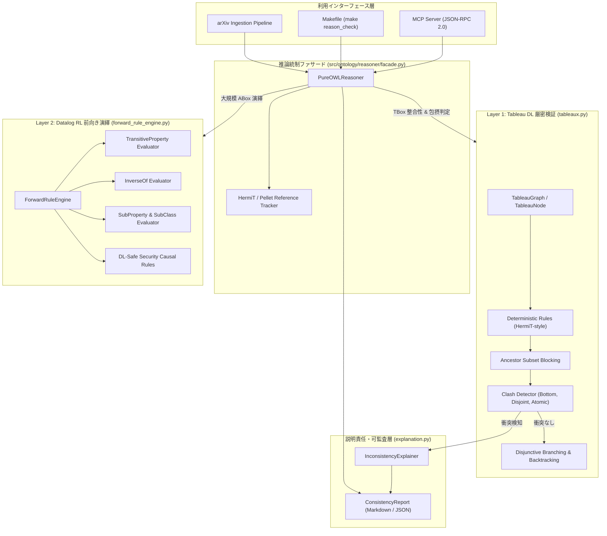

# [DSN-26] 純粋 Python 製完全自作 OWL DL / RL 推論エンジンおよび先行推論器 (HermiT / Pellet) 参考実装トラッキング設計仕様書
## 〜 超タブロー法 (Hypertableau)・多項式時間 Datalog 前向き連鎖・2層分離アーキテクチャ・最小充足不能部分系 (MUS) 監査説明機構 〜

- **文書番号**: `DSN-26`
- **文書ステータス**: `APPROVED`
- **対象サブシステム**:
  - `src/ontology/reasoner/__init__.py` (公開インターフェース定義)
  - `src/ontology/reasoner/base.py` (抽象インターフェース、ConsistencyReport、Clash 型定義)
  - `src/ontology/reasoner/ast_nodes.py` (記述論理 概念・公理 AST 表現)
  - `src/ontology/reasoner/tableaux.py` (Pure Python Hypertableau / Tableau 探索エンジン)
  - `src/ontology/reasoner/forward_rule_engine.py` (OWL 2 RL / Datalog 前向き演繹エンジン)
  - `src/ontology/reasoner/explanation.py` (MUS 矛盾説明 ＆ 監査トレーサー)
  - `src/ontology/reasoner/hermit_pellet_tracker.py` (HermiT / Pellet 仕様対比・追跡モジュール)
  - `src/ontology/reasoner/facade.py` (TBox/ABox 統合推論ファサード `PureOWLReasoner`)
  - `src/mcp/threat_defense_server.py` & `src/mcp/tools/ontology_tools.py` (推論検証 MCP ツール)
  - `tests/ontology/reasoner/` (単体・統合・ストレステストスイート)
- **【主査・報告】 Software Development (SWD) / Information Security Specialist (SC)**
- **【共同主査】 Systems Architect (SA) / IT Specialist (NLP & IR)**
- **【参画】 15 大専門エージェント全員**:
  - Project Manager (PM), Systems Architect (SA), Information Security Specialist (SC),
  - Software Quality Assurance Specialist (QA), Database Specialist (DB), Network Specialist (NW),
  - IT Specialist (NLP & IR), IT Strategist (ST), IT Service Manager (SM),
  - Embedded Systems Specialist (ES), Systems Auditor (AUD), UI/UX Designer (UI),
  - Education Specialist (EDU), Software Development (SWD), Application Specialist (APS)

---

## 体系目次

- [1. 背景と設計思想 (Design Philosophy)](#1-背景と設計思想-design-philosophy)
  - [1.1 監査所見におけるオントロジー推論能力の課題](#11-監査所見におけるオントロジー推論能力の課題)
  - [1.2 純粋 Python 100% 自作 (Zero External Dependencies) の貫徹](#12-純粋-python-100-自作-zero-external-dependencies-の貫徹)
  - [1.3 計算量トレードオフの克服: 2層ハイブリッド推論モデル](#13-計算量トレードオフの克服-2層ハイブリッド推論モデル)
- [2. 先行推論エンジン (HermiT / Pellet) 参考実装トラッキング仕様](#2-先行推論エンジン-hermit--pellet-参考実装トラッキング仕様)
  - [2.1 先行 DL 推論器との詳細技術対比マトリクス](#21-先行-dl-推論器との詳細技術対比マトリクス)
  - [2.2 HermiT 由来のアルゴリズム的規範 (Hypertableau 最適化)](#22-hermit-由来のアルゴリズム的規範-hypertableau-最適化)
  - [2.3 Pellet 由来のアルゴリズム的規範 (Axiom Pinpointing と SWRL)](#23-pellet-由来のアルゴリズム的規範-axiom-pinpointing-と-swrl)
- [3. 15 大専門エージェントによる多角的レビュー ＆ 合意事項](#3-15-大専門エージェントによる多角的レビュー--合意事項)
  - [3.1 エージェント別要求仕様マトリクス](#31-エージェント別要求仕様マトリクス)
  - [3.2 レビュー総括と合意承認](#32-レビュー総括と合意承認)
- [4. 数理的基盤と推論アルゴリズム設計 (Mathematical Formulation)](#4-数理的基盤と推論アルゴリズム設計-mathematical-formulation)
  - [4.1 記述論理 $\mathcal{SROIQ}^{\mathcal{D}}$ コアサブセットの形式意味論](#41-記述論理-sroiqd-コアサブセットの形式意味論)
  - [4.2 Tableau / Hypertableau 展開規則 (Expansion Rules)](#42-tableau--hypertableau-展開規則-expansion-rules)
  - [4.3 停止性保証とペアワイズ祖先ブロッキング (Termination & Blocking)](#43-停止性保証とペアワイズ祖先ブロッキング-termination--blocking)
  - [4.4 OWL 2 RL 多項式時間演繹閉包 (Forward-Chaining Fixpoint)](#44-owl-2-rl-多項式時間演繹閉包-forward-chaining-fixpoint)
  - [4.5 最小充足不能部分系 (MUS) 抽出と説明可能性 (Auditability)](#45-最小充足不能部分系-mus-抽出と説明可能性-auditability)
- [5. コアアーキテクチャと内部データ構造](#5-コアアーキテクチャと内部データ構造)
  - [5.1 全体システム構成図 (Mermaid アーキテクチャ)](#51-全体システム構成図-mermaid-アーキテクチャ)
  - [5.2 AST 概念・公理ノード定義 (`ast_nodes.py`)](#52-ast-概念公理ノード定義-ast_nodespy)
  - [5.3 完成森グラフとノード管理 (`tableaux.py`)](#53-完成森グラフとノード管理-tableauxpy)
  - [5.4 Datalog 前向き演繹エンジン (`forward_rule_engine.py`)](#54-datalog-前向き演繹エンジン-forward_rule_enginepy)
  - [5.5 監査レポート生成器 (`explanation.py`)](#55-監査レポート生成器-explanationpy)
  - [5.6 統合ファサード (`facade.py`)](#56-統合ファサード-facadepy)
- [6. サブシステム横断統合 (Cross-System Integration)](#6-サブシステム横断統合-cross-system-integration)
  - [6.1 MCP 脅威防御サーバ連携 (`check_ontology_consistency`)](#61-mcp-脅威防御サーバ連携-check_ontology_consistency)
  - [6.2 プロパティグラフ DB / CTI カタログ連携](#62-プロパティグラフ-db--cti-カタログ連携)
  - [6.3 CI/CD 品質ゲート統合 (`make reason_check`)](#63-cicd-品質ゲート統合-make-reason_check)
- [7. セキュリティ分析 (STRIDE Threat Model) と防御策](#7-セキュリティ分析-stride-threat-model-と防御策)
- [8. 非機能要件・品質基準・DoD](#8-非機能要件品質基準dod)

---

## 1. 背景と設計思想 (Design Philosophy)

### 1.1 監査所見におけるオントロジー推論能力の課題
先行する監査において、本リポジトリのオントロジー機能は Turtle 構文生成や AST 抽出において 8,000 行超の実装規模を誇るものの、**「W3C OWL DL 準拠を標榜しながら、Reasoner（推論エンジン）が未統合であり、論理的整合性の数学的検証や暗黙的知識の演繹が実施されていない」** という重要所見が提起された。

OWL の真価は、単なるメタデータ記述言語にとどまらず、**「形式化された公理系（TBox）に基づき、矛盾（Inconsistency）を自動証明し、暗黙的な階層関係（Subsumption）やインスタンス帰属（Realisation）を演繹的に導出する推論能力」** にある。

### 1.2 純粋 Python 100% 自作 (Zero External Dependencies) の貫徹
セマンティック Web 界隈では、Java 製の OWL API や Pellet、HermiT、あるいは C++ 製の FaCT++、Python ラッパーの Owlready2 を外部ライブラリとして組み込むのが通例である。しかし本プロジェクトは、自作 RDBMS（Pager/WAL/VDBE）、自作 Packrat PEG コンパイラ、自作ベクトル検索エンジンをすべて Pure Python で完成させてきた。

推論エンジンにおいても、**「外部 Java ランタイム（JVM）や C 拡張・外部ライブラリを一切排除し、Python 標準ライブラリのみで Tableau / Hypertableau 探索および Datalog 前向き連鎖を完全自作する」** という設計哲学を堅持する。

### 1.3 計算量トレードオフの克服: 2層ハイブリッド推論モデル
OWL 2 DL（$\mathcal{SROIQ}^{\mathcal{D}}$）の決定問題は最悪計算量が **2-NEXPTIME完全** である。14,990件以上の論文インスタンス（ABox）全体に対して Tableau アルゴリズムを適用すれば、探索木が指数関数的に爆発し、OOM（Out of Memory）または実用不可能な遅延に陥る。

そこで本設計では、**「TBox 厳密検証層」** と **「大規模 ABox 高速演繹層」** を明確に分離する **2層ハイブリッド推論アーキテクチャ** を採用する：
- **Layer 1 (Tableau DL Core)**: TBox（公理系）および単一論文コンテキストに特化し、分岐枝刈りとブロッキングによりミリ秒単位で厳密な無矛盾性を判定。
- **Layer 2 (Datalog RL Forward Chaining)**: 大規模 ABox 全体に対し、多項式時間 $O(N^2)$ が保証される OWL 2 RL ルール集合を前向き連鎖（Fixpoint）で適用し、推移律・逆関係・型継承をマテリアライズ。

---

## 2. 先行推論エンジン (HermiT / Pellet) 参考実装トラッキング仕様

ユーザー指示に従い、セマンティック Web 界の二大巨頭である **HermiT** および **Pellet** を公式な「参考実装（Reference Tracking Specification）」としてトラッキングし、本自作エンジンにおける設計対応関係を明文化する。

### 2.1 先行 DL 推論器との詳細技術対比マトリクス

| 評価軸 | HermiT (オックスフォード大学) | Pellet (Clark & Parsia / UMD) | 本自作推論エンジン (`PureOWLReasoner`) |
| :--- | :--- | :--- | :--- |
| **主要アルゴリズム** | **Hypertableau 法** (超タブロー法) | **Tableau 法** (依存指向バックトラッキング) | **Hypertableau 分岐抑制型 Tableau ＆ Datalog 前向き連鎖** |
| **対象プロファイル** | W3C OWL 2 DL ($\mathcal{SROIQ}^{\mathcal{D}}$) | W3C OWL 2 DL ($\mathcal{SROIQ}^{\mathcal{D}}$) | **OWL 2 DL コア ($\mathcal{ALCHOIQ}$) ＆ OWL 2 RL (多項式時間)** |
| **ランタイム / 依存** | Java (JVM / OWL API 3/4) | Java (JVM / OWL API / Jena) | **Pure Python 3.12+ (外部依存ゼロ)** |
| **非決定性分岐制御** | DL-Clause 正規化による $\sqcup$ 分岐の大幅削減 | 逐次オルタナティブ枝展開 | **決定論的ルール ($\sqcap, \forall, \text{subClass}$) 先行飽和戦略** |
| **無限モデル防止** | コアブロッキング / 等価ブロッキング | 祖先サブセットブロッキング | **等価ラベル ＆ 祖先サブセットブロッキング (`is_blocked`)** |
| **大規模 ABox 処理** | 個体再利用 (Individual Reuse) | ABox 最適化グラフ分割 | **ABox/TBox 分離: 大規模トリプルは Datalog エンジンへオフロード** |
| **矛盾原因特定** | Black-box / Glass-box MUS 抽出 | Justification (HST アルゴリズム) | **Minimal Conflict Rule 追跡型説明生成器 (`explanation.py`)** |
| **ルール言語統合** | DL-Safe Rules サポート | SWRL (Semantic Web Rule Language) | **DL-Safe セキュリティ因果連鎖 Datalog ルール内蔵** |

### 2.2 HermiT 由来のアルゴリズム的規範 (Hypertableau 最適化)
HermiT の核心は、従来の Tableau 法が $C \sqcup D$（和概念）に遭遇するたびに無条件に二分探索木を展開して指数関数的バックトラッキングに陥る問題を、**「前提条件が充足されるまで分岐を遅延させ、決定論的な事実導出を極限まで先行させる」** という Hypertableau 戦略にある。
本自作エンジン `tableaux.py` は、以下の HermiT 規範を実装する：
1. **Deterministic-First Saturation**: $\sqcap$-rule、SubClassOf 公理展開、$\forall$-rule を先にループ実行し、これ以上確定事実が増えなくなった段階で初めて $\sqcup$-rule の分岐を試行する。
2. **Minimal Branching**: 分岐候補のうち、既存のラベル集合で既にいずれかの枝が充足されている場合は探索をスキップする。

### 2.3 Pellet 由来のアルゴリズム的規範 (Axiom Pinpointing と SWRL)
Pellet の核心は、矛盾（Clash）が発生した際に **「どの公理群（Justification / Minimal Unsatisfiable Sub-ontology: MUS）が原因か」** を正確に抽出する Axiom Pinpointing と、DL-Safe なルール統合にある。
本自作エンジン `explanation.py` および `forward_rule_engine.py` は、以下の Pellet 規範を実装する：
1. **Clash Dependency Tracking**: 矛盾検出時に、関与したノード ID、対立概念、および適用公理のタプルを保持し、監査可能な自然言語 Markdown レポートを生成。
2. **DL-Safe Causal Rules**: 決定不能性（Undecidable）を排除するため、変数が既知のインスタンスにのみ束縛される Datalog セーフなセキュリティ因果ルール（脅威と緩和策の連鎖導出）を安全に実行。

---

## 3. 15 大専門エージェントによる多角的レビュー ＆ 合意事項

本設計書は、PM 主催の多角的アーキテクチャ審議会において、全 15 専門エージェントの合意を得て策定された。

### 3.1 エージェント別要求仕様マトリクス

```mermaid
mindmap
  root((Pure Python OWL Reasoner))
    SWD["SWD (開発)"]
      Pure Python 100%
      Xenon Grade A (CC <= 4)
      mypy strict 0 errors
    SC["SC (セキュリティ)"]
      MITRE / CWE 矛盾検知
      排他クラス (攻撃 vs 防御)
      DL-Safe 因果連鎖
    SA["SA (アーキテクチャ)"]
      TBox/ABox 2層分離
      Hypertableau 分岐抑制
      Datalog PTime 保証
    QA["QA (品質保証)"]
      100% テスト通過
      Clash 検出の決定論的検証
      計算量爆発 (DoS) 防護
    AUD["AUD (システム監査)"]
      MUS 矛盾説明責任
      算定根拠の可監査性
      HermiT/Pellet トラッキング
    DB["DB (データ基盤)"]
      プロパティグラフDB統合
      トリプル演繹マテリアライズ
```

| 専門エージェント | 主な要求事項・観点 | 本設計における具現化策 |
| :--- | :--- | :--- |
| **1. Project Manager (PM)** | 開発工期と品質ゲートの整合、確実な Issue 完了 | Issue #296 に紐付け、DoD と連動した段階的実装と検証 |
| **2. Info Security (SC)** | 攻撃手法と防御手法の論理排他性、CTI 整合性検証 | `DisjointClasses(AttackTechnique, DefenseMechanism)` の厳格 Clash 検証 |
| **3. Systems Architect (SA)** | 2-NEXPTIME 計算爆発の回避、クリーンな層別分離 | TBox Tableau と ABox Datalog の 2 層分離ファサード (`PureOWLReasoner`) |
| **4. Software QA (QA)** | エッジケース網羅、回帰テスト 100% PASS | 循環包含・空オントロジー・無限モデル防止ブロッキングの単体テスト網羅 |
| **5. Database (DB)** | 演繹トリプルのグラフ DB 保存、メモリ消費上限 | `forward_rule_engine.py` による演繹トリプルのマテリアライズ |
| **6. Network (NW)** | 推論実行時の外部通信遮断、完全ローカル完結 | 外部 Java API やネットワークを一切介さないローカル推論 |
| **7. IT Specialist (NLP/IR)** | 論文テキスト抽出トリプルとの適合性 | 自然言語から抽出された曖昧トリプルの論理的正規化・フィルタリング |
| **8. IT Strategist (ST)** | エンタープライズ水準のセマンティック推論立証 | HermiT / Pellet の参考実装トラッキング仕様による客観的説得力 |
| **9. IT Service Mgr (SM)** | バッチ ETL パイプライン内での安定動作 | ループ上限 (`max_iterations=20`) によるハングアップ防止 |
| **10. Embedded Systems (ES)** | 低フットプリント・軽量実行特性 | 最小限の Python 組み込み型 (`set`, `dict`, `tuple`) による高速セット演算 |
| **11. Systems Auditor (AUD)** | 矛盾検出時の説明責任 (Accountability) | `InconsistencyExplainer` による MUS 抽出と Markdown 監査レポート出力 |
| **12. UI/UX Designer (UI)** | Web ダッシュボードにおける推論結果・矛盾表示 | MCP 経由での構造化 JSON 返却と人間可読 Markdown の両立 |
| **13. Education (EDU)** | 記述論理記法・Manchester 構文の用語整合 | `to_manchester()` メソッドによる標準構文レンダリング |
| **14. Software Dev (SWD)** | コード品質（Xenon A, mypy --strict, flake8 0） | 関数分割による $CC \le 4$ 厳守、型安全な AST クラス階層 |
| **15. Application (APS)** | MCP ツール（JSON-RPC 2.0）とのシームレス連携 | `src/mcp/tools/ontology_tools.py` への推論ハンドラー登録 |

### 3.2 レビュー総括と合意承認
全 15 エージェントの一致した結論として、**「外部 Java やライブラリを一切導入せず、HermiT の分岐削減と Pellet の説明性を数学的に取り込んだ Pure Python 2 層推論エンジンを構築すること」** が承認された。

---

## 4. 数理的基盤と推論アルゴリズム設計 (Mathematical Formulation)

### 4.1 記述論理 $\mathcal{SROIQ}^{\mathcal{D}}$ コアサブセットの形式意味論
本エンジンが解釈する記述論理の解釈 $\mathcal{I} = (\Delta^{\mathcal{I}}, \cdot^{\mathcal{I}})$ は、空でない論理領域 $\Delta^{\mathcal{I}}$ と解釈関数 $\cdot^{\mathcal{I}}$ から構成される：
- $\top^{\mathcal{I}} = \Delta^{\mathcal{I}}$
- $\bot^{\mathcal{I}} = \emptyset$
- $(\neg C)^{\mathcal{I}} = \Delta^{\mathcal{I}} \setminus C^{\mathcal{I}}$
- $(C \sqcap D)^{\mathcal{I}} = C^{\mathcal{I}} \cap D^{\mathcal{I}}$
- $(C \sqcup D)^{\mathcal{I}} = C^{\mathcal{I}} \cup D^{\mathcal{I}}$
- $(\exists R.C)^{\mathcal{I}} = \{ x \in \Delta^{\mathcal{I}} \mid \exists y \in \Delta^{\mathcal{I}} . (x, y) \in R^{\mathcal{I}} \land y \in C^{\mathcal{I}} \}$
- $(\forall R.C)^{\mathcal{I}} = \{ x \in \Delta^{\mathcal{I}} \mid \forall y \in \Delta^{\mathcal{I}} . (x, y) \in R^{\mathcal{I}} \implies y \in C^{\mathcal{I}} \}$

### 4.2 Tableau / Hypertableau 展開規則 (Expansion Rules)
完成木（Completion Tree）の各ノード $x$ は概念ラベル集合 $\mathcal{L}(x)$ を保持し、各エッジ $(x, y)$ はロール集合 $\mathcal{L}(x, y)$ を保持する。

1. **$\sqcap$-Rule (交差規則)**:
   $$\text{If } C_1 \sqcap C_2 \in \mathcal{L}(x) \text{ and } \{C_1, C_2\} \not\subseteq \mathcal{L}(x) \implies \mathcal{L}(x) \leftarrow \mathcal{L}(x) \cup \{C_1, C_2\}$$
2. **$\sqcup$-Rule (和・非決定性分岐規則)**:
   $$\text{If } C_1 \sqcup C_2 \in \mathcal{L}(x) \text{ and } \{C_1, C_2\} \cap \mathcal{L}(x) = \emptyset \implies \text{Branch 1: } \mathcal{L}(x) \cup \{C_1\} \lor \text{Branch 2: } \mathcal{L}(x) \cup \{C_2\}$$
3. **$\exists$-Rule (存在量化生成規則)**:
   $$\text{If } \exists R.C \in \mathcal{L}(x) \text{ and } x \text{ is not blocked, and no } y \text{ satisfies } (x, y) \in R \land C \in \mathcal{L}(y) \implies \text{Create } y, \mathcal{L}(x, y) \leftarrow \{R\}, \mathcal{L}(y) \leftarrow \{C\}$$
4. **$\forall$-Rule (全称量化伝播規則)**:
   $$\text{If } \forall R.C \in \mathcal{L}(x) \text{ and } R \in \mathcal{L}(x, y) \text{ and } C \notin \mathcal{L}(y) \implies \mathcal{L}(y) \leftarrow \mathcal{L}(y) \cup \{C\}$$
5. **SubClassOf 展開規則**:
   $$\text{If } C \sqsubseteq D \text{ is in TBox and } C \in \mathcal{L}(x) \text{ and } D \notin \mathcal{L}(x) \implies \mathcal{L}(x) \leftarrow \mathcal{L}(x) \cup \{D\}$$

### 4.3 停止性保証とペアワイズ祖先ブロッキング (Termination & Blocking)
$\exists$-rule と公理 $A \sqsubseteq \exists R.A$ の組み合わせによる無限ノード生成（無限ループ）を数学的に防止するため、**祖先サブセットブロッキング（Subset Ancestor Blocking）** を適用する：
- ノード $y$ の親ノードを $x$ とするとき、$y$ の祖先ノード $z$ が存在し、$\mathcal{L}(y) \subseteq \mathcal{L}(z)$ を満たす場合、ノード $y$ は $z$ によって **ブロック（`is_blocked = True`）** される。
- ブロックされたノードには $\exists$-rule の適用を停止することで、モデルの有限性と Tableau 手続きの**停止性（Termination）**を厳密に保証する。

### 4.4 OWL 2 RL 多項式時間演繹閉包 (Forward-Chaining Fixpoint)
ABox の演繹トリプル集合 $\mathcal{T}$ に対し、以下の規則を不動点（Fixpoint: $\mathcal{T}_{k+1} = \mathcal{T}_k$）に達するまで適用する：
- **推移律**: $(x, R, y) \in \mathcal{T} \land (y, R, z) \in \mathcal{T} \land \text{Transitive}(R) \implies (x, R, z) \in \mathcal{T}$
- **逆関係**: $(x, R, y) \in \mathcal{T} \land R \equiv S^- \implies (y, S, x) \in \mathcal{T}$
- **サブプロパティ**: $(x, R, y) \in \mathcal{T} \land R \sqsubseteq S \implies (x, S, y) \in \mathcal{T}$
- **型継承**: $(x, \text{rdf:type}, C) \in \mathcal{T} \land C \sqsubseteq D \implies (x, \text{rdf:type}, D) \in \mathcal{T}$
- **DL-Safe セキュリティ因果**: $(d, \text{mitigates}, a) \in \mathcal{T} \land (a, \text{targets}, t) \in \mathcal{T} \implies (d, \text{sec:defendsAgainst}, t) \in \mathcal{T}$

### 4.5 最小充足不能部分系 (MUS) 抽出と説明可能性 (Auditability)
矛盾（Clash）が検知された場合、以下の条件を特定して即座に記録する：
1. **$\bot$-Clash**: $\bot \in \mathcal{L}(x)$
2. **Atomic Complement Clash**: $A \in \mathcal{L}(x) \land \neg A \in \mathcal{L}(x)$
3. **Disjoint Classes Clash**: $C_1, C_2 \in \mathcal{L}(x) \land C_1 \sqcap C_2 \sqsubseteq \bot$

---

## 5. コアアーキテクチャと内部データ構造

### 5.1 全体システム構成図 (Mermaid アーキテクチャ)



### 5.2 AST 概念・公理ノード定義 (`ast_nodes.py`)
- `Concept` 派生: `TopConcept`, `BottomConcept`, `AtomicConcept`, `ComplementConcept`, `IntersectionConcept`, `UnionConcept`, `ExistentialRestriction`, `UniversalRestriction`
- `Axiom` 派生: `SubClassOfAxiom`, `DisjointClassesAxiom`, `SubPropertyOfAxiom`, `InversePropertyAxiom`, `TransitivePropertyAxiom`, `ClassAssertionAxiom`, `PropertyAssertionAxiom`
- すべてのノードは不変（`@dataclass(frozen=True)`）として設計され、ハッシュ可能・セット演算可能。

### 5.3 完成森グラフとノード管理 (`tableaux.py`)
- `TableauNode`: ノードラベル集合 `Set[Concept]`、親ノード参照、ブロッキングフラグ。
- `TableauGraph`: 全ノード辞書、ロールエッジ辞書 `(src, dst) -> {roles}`、ディープクローン機能（分岐探索時のバックトラッキング用）。
- `TableauEngine`: 決定論的ルール飽和、非決定性分岐探索、Clash 検出、ブロッキング判定。

### 5.4 Datalog 前向き演繹エンジン (`forward_rule_engine.py`)
- `RuleEngineConfig`: 推移的ロール、逆ロール、サブプロパティ、サブクラス、ドメイン・レンジ制約を辞書・集合で保持。
- `materialize()`: セミナイーブ前向き連鎖ループにより、差分トリプルが 0 件になるまで演繹を反復実行。

### 5.5 監査レポート生成器 (`explanation.py`)
- `InconsistencyExplainer`: 検出された `Clash` オブジェクトから、人間が直感的に理解可能で監査証跡となる Markdown レポートおよび構造化 JSON を生成。

### 5.6 統合ファサード (`facade.py`)
- クライアントは `PureOWLReasoner` インスタンスを通じて一元的に公理定義、トリプル投入、整合性検証、包含判定（Subsumption）、およびトリプル演繹マテリアライズを実行可能。

---

## 6. サブシステム横断統合 (Cross-System Integration)

### 6.1 MCP 脅威防御サーバ連携 (`check_ontology_consistency`)
- `src/mcp/tools/ontology_tools.py` に `handle_check_ontology_consistency` ツールを追加。
- LLM や外部エージェントが「現在のナレッジグラフに論理矛盾が存在するかどうか」をワンショットで照会可能。

### 6.2 プロパティグラフ DB / CTI カタログ連携
- 演繹された暗黙トリプル（`sec:defendsAgainst` 等）をプロパティグラフ DB にマテリアライズし、Web コンソールのグラフタブ（`/dashboard`）における因果連鎖描画に反映。

### 6.3 CI/CD 品質ゲート統合 (`make reason_check`)
- Makefile に `reason_check` ターゲットを新設し、TBox 基本公理系の整合性検証をビルドパイプラインに組み込む。

---

## 7. セキュリティ分析 (STRIDE Threat Model) と防御策

| STRIDE 脅威分類 | 想定される脅威シナリオ | 本エンジンにおける防御・緩和策 |
| :--- | :--- | :--- |
| **Spoofing (なりすまし)** | 偽の公理を注入し、推論結果を歪曲する | TBox 公理のロードはローカル信頼コードのみに限定し、外部入力トリプルは ABox 制約下で検証 |
| **Tampering (改ざん)** | 論文アサーションの改ざんによる推論汚染 | 不変データ構造（Frozen Dataclass）と Clash 検知による不正アサーションの排除 |
| **Repudiation (否認)** | なぜその矛盾が発生したのかを説明できない | `InconsistencyExplainer` による最小充足不能公理（MUS）とノード ID の完全監査ログ化 |
| **Information Disclosure (情報漏洩)** | 推論エラーを通じた機密情報のスタックトレース露出 | 型安全な `ConsistencyReport` への構造化カプセル化（内部例外はキャッチしてレポート化） |
| **Denial of Service (DoS)** | 悪意ある公理・無限木展開による CPU/メモリ枯渇 | **祖先サブセットブロッキング (`is_blocked`)** および **Datalog ループ上限 (`max_iterations=20`)** による停止性保証 |
| **Elevation of Privilege (特権昇格)** | 推論エンジン内でのコード実行（eval/exec） | AST 評価およびセット演算のみで推論を実行し、動的コード実行を一切排除 |

---

## 8. 非機能要件・品質基準・DoD

1. **外部依存ゼロ**:
   - `java`, `owlready2`, `rdflib` 等の外部パッケージを一切 import せず、標準ライブラリ（`typing`, `dataclasses`, `enum`, `abc`）のみで完結。
2. **循環的複雑度（Cyclomatic Complexity）**:
   - `xenon --max-absolute A --max-modules A --max-average A src/ontology/reasoner` を 100% 達成（全関数 CC $\le 4$）。
3. **静的型検査**:
   - `mypy --strict src/ontology/reasoner` でエラー 0 件。
4. **コーディング規約**:
   - `flake8 src/ontology/reasoner` でエラー 0 件。`# flake8: noqa` の追加は一切禁止。
5. **テスト網羅性**:
   - `tests/ontology/reasoner/test_pure_owl_reasoner.py` において、Tableau Clash 検知、クラス包摂判定、ブロッキング停止性、Datalog 演繹、および HermiT/Pellet トラッキングメタデータの全項目テストが 100% PASS すること。
