# [DSN-27] モジュール型 Web フロントエンド・フレームワーク ＆ クライアントアーキテクチャ設計仕様書
## 〜 yuzora frameworks 統合・5大共通コンポーネント集約・src/core/ データ構造移植（HSM, DisjointSet, RadixTrie, ARCCache, PEG）による高凝縮・イベント駆動フロントエンド刷新 〜

- **文書番号**: `DSN-27`
- **文書ステータス**: `APPROVED`
- **対象サブシステム**:
  - `site/js/frameworks/` (軽量フレームワーク・共通コンポーネント・移植データ構造群)
  - `site/app.js` (エンタープライズ統合コンソール クライアントロジック)
  - `site/dashboard.html` (CTI ナレッジグラフ専用ワークスペース Canvas)
  - `site/externs.js` (Google Closure Compiler 型・インターフェース定義)
  - `Makefile` (`build_js` バンドルパイプライン)
  - `tests/web/` (フロントエンド自動回帰テストスイート)
- **関連設計書**:
  - `DSN-01` (High-Level Architecture)
  - `DSN-09` (Web Gateway & Presentation)
  - `DSN-14` (Graph Engineering Dashboard)
  - `DSN-21` (Enterprise Design System & Unified Console)
  - `DSN-23` (Hierarchical State Machine & Lifecycle Governance)
  - `DSN-25` (Packrat PEG Parser Engine)
- **【主査・報告】 UI/UX & Documentation Designer (UI) / Application Specialist (APS)**
- **【共同主査】 Systems Architect (SA) / Software Development (SWD)**
- **【参画・協調】 15 大専門エージェント全員**

---

## 体系目次

- [1. 背景と設計思想 (Executive Summary & Philosophy)](#1-背景と設計思想-executive-summary--philosophy)
- [2. 15 大専門エージェントによる要求分析マトリクス](#2-15-大専門エージェントによる要求分析マトリクス)
- [3. フロントエンド全体アーキテクチャ (Global Architecture)](#3-フロントエンド全体アーキテクチャ-global-architecture)
- [4. yuzora frameworks 基盤レイヤー (Foundation Layer)](#4-yuzora-frameworks-基盤レイヤー-foundation-layer)
- [5. 共通化・高凝縮 5 大コンポーネント仕様 (Consolidated Components)](#5-共通化高凝縮-5-大コンポーネント仕様-consolidated-components)
  - [5.1 ApiClient (統合 HTTP 通信・エラーハンドリング)](#51-apiclient-統合-http-通信エラーハンドリング)
  - [5.2 SSEStreamManager (ストリーミング・指数バックオフ再接続)](#52-ssestreammanager-ストリーミング指数バックオフ再接続)
  - [5.3 ModalController (アクセシブル・モーダル＆ドロワー)](#53-modalcontroller-アクセシブルモーダルドロワー)
  - [5.4 StateStore (Pub/Sub 連動型リアクティブ状態ストア)](#54-statestore-pubsub-連動型リアクティブ状態ストア)
  - [5.5 GraphCanvasEngine (力学モデル・Canvas 描画コア)](#55-graphcanvasengine-力学モデルcanvas-描画コア)
- [6. src/core/ からのデータ構造・機能移植仕様 (Core Porting Specs)](#6-srccore-からのデータ構造機能移植仕様-core-porting-specs)
  - [6.1 HierarchicalStateMachine (HSM: UI & ストリーム状態遷移)](#61-hierarchicalstatemachine-hsm-ui--ストリーム状態遷移)
  - [6.2 DisjointSet (Union-Find: 最大連結成分 LCC 高速計算)](#62-disjointset-union-find-最大連結成分-lcc-高速計算)
  - [6.3 RadixTrie (基数木: 0ms インクリメンタルオートコンプリート)](#63-radixtrie-基数木-0ms-インクリメンタルオートコンプリート)
  - [6.4 ARCCache (適応型置換キャッシュ: 論文詳細・メタデータ)](#64-arccache-適応型置換キャッシュ-論文詳細メタデータ)
  - [6.5 QueryValidator (PEG サブセット: リアルタイム検索クエリ構文検証)](#65-queryvalidator-peg-サブセット-リアルタイム検索クエリ構文検証)
- [7. セキュリティ・パフォーマンス・Closure Compiler 適合仕様](#7-セキュリティパフォーマンスclosure-compiler-適合仕様)
- [8. 段階的マイグレーション計画と Issue マッピング](#8-段階的マイグレーション計画と-issue-マッピング)

---

## 1. 背景と設計思想 (Executive Summary & Philosophy)

### 1.1 現状の技術的負債
- `site/app.js`（約 1,800 行）および `site/dashboard.html`（約 2,900 行のインラインスクリプト）は、プロトタイプ期からの機能追加により、DOM 操作・状態管理・ネットワーク通信・力学モデル計算・グラフ描画が単一ファイル内に混在するモノリス構造となっていた。
- `setTimeout(..., 50)` 等のマジックディレイによる描画同期、URL GET パラメータとハッシュルーティングの二重実装、散発的な `fetch` 呼び出し、手動フラグ管理（15 個以上の真偽値フラグ）による状態不整合が頻発していた。

### 1.2 設計原則 (Guiding Principles)
1. **Zero External Framework Dependencies**: React/Vue 等の重量級フレームワークを導入せず、バニラ JS + Closure Compiler 最適化を貫徹する。
2. **Event-Driven Decoupling**: 全ての UI 間通信・データ通信は `Publisher` (Pub/Sub) を経由し、直接的な DOM 相互参照を根絶する。
3. **Formal State & Algorithmic Rigor**: 複雑な状態遷移には `HSM` を適用し、グラフ計算や検索補助には `src/core/` で実績のある数理的データ構造（`DisjointSet`, `RadixTrie`, `ARCCache`）を忠実にブラウザへ移植する。

---

## 2. 15 大専門エージェントによる要求分析マトリクス

| エージェント | 要求事項・着眼点 | 本アーキテクチャ (DSN-27) での解決策 |
| :--- | :--- | :--- |
| **PM (Chair)** | 段階的リリースと既存機能（検索・グラフ・SSE）の無停止 | Issue 339〜348 に 1 モジュール 1 Issue 単位で分割し、完全下位互換を維持。 |
| **SA (Architecture)** | モジュール境界の明確化と単一責任の原則 (SRP) | frameworks/ 配下を「基盤層」「共通コンポーネント」「移植データ構造」の3層に定義。 |
| **SWD (Development)** | Closure Compiler (SIMPLE_OPTIMIZATIONS) との完全親和 | 全クラスに JSDoc 型アノテーションおよび `site/externs.js` 厳格定義を徹底。 |
| **QA (Testing)** | 自動テストカバレッジと回帰防止ラチェット | `tests/web/test_frontend_frameworks.py` を基軸とし、Python+pytest でバンドル整合性を自動検証。 |
| **Sec (Security)** | Zero-XSS、Prototype Pollution 対策、DoS 防御 | Router/QueryValidator の完全サニタイズ、Timing/Scheduler によるイベントループ保護。 |
| **UI/UX Designer** | アナリストの思考を止めない 0ms レスポンスと滑らかな描画 | RadixTrie によるインクリメンタルサジェスト、DOMUtils.afterReflow による 60fps 同期。 |
| **NLP & IR** | 検索バーにおける Boolean 構文の即時妥当性フィードバック | `peg.py` のクエリ文法を移植した `QueryValidator` による入力時リアルタイム検証。 |
| **DB Specialist** | 4大データベースインスペクターとの通信・キャッシュ効率化 | `ApiClient` の統一化と `ARCCache` によるスキーマ/テーブルメタデータの適応的キャッシュ。 |
| **SM (Service Mgmt)** | SSE 接続断時の確実な自動復帰とリソースリーク防止 | `SSEStreamManager` による指数バックオフと `visibilitychange` 連動切断・再接続。 |

---

## 3. フロントエンド全体アーキテクチャ (Global Architecture)

```mermaid
graph TD
    subgraph "Application Layer (Presentation & Shell)"
        AppShell["site/app.js (Console Shell)"]
        DashboardShell["site/dashboard.html (Graph Workspace)"]
        Scenes["Scene Implementations (SearchScene, GraphScene, SystemScene, etc.)"]
    end

    subgraph "Component & State Layer"
        Store["StateStore (Reactive State)"]
        ModalCtrl["ModalController (Accessible Modals)"]
        GraphEngine["GraphCanvasEngine (Physics & Render)"]
        ApiClient["ApiClient (HTTP Client)"]
        SSEMgr["SSEStreamManager (SSE Lifecycle)"]
    end

    subgraph "Core Data Structures Layer (Ported from src/core/)"
        HSM["HierarchicalStateMachine (State Governance)"]
        DisjointSet["DisjointSet (Union-Find / LCC)"]
        RadixTrie["RadixTrie (Prefix Search / 0ms Suggest)"]
        ARCCache["ARCCache (Recency + Frequency Cache)"]
        QueryValidator["QueryValidator (PEG Query AST Validator)"]
    end

    subgraph "Yuzora Foundation Framework Layer (site/js/frameworks/)"
        Locator["Locator (Service Registry)"]
        Publisher["Publisher & AppEventTarget (Pub/Sub Hub)"]
        Router["Router (Hash SPA)"]
        SceneManager["SceneManager (Lifecycle)"]
        Scheduler["TaskScheduler (Time-Slicing)"]
        DOMUtils["DOMUtils (afterReflow / RAF)"]
        Timing["Timing (Debounce / Throttle)"]
        AnimationUtils["AnimationUtils (Transitions)"]
    end

    AppShell --> Scenes
    DashboardShell --> Scenes
    Scenes --> Store
    Scenes --> ModalCtrl
    Scenes --> GraphEngine

    GraphEngine --> DisjointSet
    Scenes --> RadixTrie
    ApiClient --> ARCCache
    AppShell --> QueryValidator
    SSEMgr --> HSM

    Store --> Publisher
    ApiClient --> Locator
    SSEMgr --> Locator
    Scenes --> SceneManager
    SceneManager --> Router
    GraphEngine --> Scheduler
    GraphEngine --> DOMUtils
    ModalCtrl --> AnimationUtils
    AppShell --> Timing
```

---

## 4. yuzora frameworks 基盤レイヤー (Foundation Layer)

既存の 9 モジュールは、上位コンポーネントおよび移植データ構造の共通ランタイムとして機能する。

1. **`Locator`**: 全ての共通サービス（`ApiClient`, `SSEStreamManager`, `StateStore`, `ARCCache` 等）をシングルトンまたはプロバイダとして登録し、コンポーネント間の疎結合を実現。
2. **`Publisher` & `AppEventTarget`**: イベントハブ。トピック（`tab:changed`, `search:query`, `paper:select`, `sse:telemetry`, `graph:node_selected`）に基づく Pub/Sub。
3. **`Router` & `SceneManager`**: URL ハッシュ（`#/search`, `#/dashboard`, `#/system` 等）と画面 Scene を一対一で同期し、`enter()` / `exit()` ライフサイクルを強制。
4. **`DOMUtils` & `Timing` & `TaskScheduler`**: ブラウザレンダリング同期（`afterReflow`）、イベントレートリミット（`debounce`, `throttle`）、重い計算のメインスレッド協調分割（`yieldToMainThread`）。
5. **`AnimationUtils`**: CSS アニメーション・トランジション完了の Promise 化と安全なフォールバックタイマー。

---

## 5. 共通化・高凝縮 5 大コンポーネント仕様 (Consolidated Components)

### 5.1 ApiClient (統合 HTTP 通信・エラーハンドリング)
- **ファイル**: `site/js/frameworks/api-client.js`
- **クラス**: `ApiClient`
- **責務**:
  - `fetch` のラッパーとして、統一的なベース URL、タイムアウト（デフォルト 10s）、`AbortController` によるキャンセルを管理。
  - HTTP 4xx/5xx レスポンスおよびネットワーク障害時のエラーオブジェクト正規化。
  - 冪等な GET リクエストに対する自動リトライ（最大 2 回、ジッター付き指数バックオフ）。
- **主要 API**:
  - `get(endpoint, params = {}, options = {}): Promise<any>`
  - `post(endpoint, body = {}, options = {}): Promise<any>`
  - `abort(endpoint): void`

### 5.2 SSEStreamManager (ストリーミング・指数バックオフ再接続)
- **ファイル**: `site/js/frameworks/sse-manager.js`
- **クラス**: `SSEStreamManager`
- **責務**:
  - `/api/stream` に対する `EventSource` の接続ライフサイクルを包括管理。
  - 切断時の指数バックオフ（1s, 2s, 4s, 最大 30s）による安全な自動再接続。
  - `document.visibilitychange` と連動し、タブ非アクティブ時の切断と復帰時の自動再接続。
  - 受信イベントを `Publisher` のトピック（`sse:top_metrics`, `sse:log_tail`, `sse:system_events`）へ自動ディスパッチ。

### 5.3 ModalController (アクセシブル・モーダル＆ドロワー)
- **ファイル**: `site/js/frameworks/modal.js`
- **クラス**: `ModalController`
- **責務**:
  - 論文詳細モーダル（`#paperModal`）、ヘルプドロワー（`#helpDrawer`）、エクスポートポップアップの開閉制御。
  - フォーカストラップ（Tab キー循環）と `Escape` キー押下による自動クローズ。
  - 開閉時の背景スクロールロック（`body { overflow: hidden }`）。
  - `AnimationUtils.waitForTransition` と連携した完全なフェードイン・フェードアウト完了同期。

### 5.4 StateStore (Pub/Sub 連動型リアクティブ状態ストア)
- **ファイル**: `site/js/frameworks/store.js`
- **クラス**: `StateStore`
- **責務**:
  - フロントエンド全体の共有状態（選択中タブ、検索クエリ、アクティブフィルタ、選択中 DB スコープ）を一元保持。
  - `set(key, value)` 実行時に前回の値とシャロー比較を行い、変更があった場合のみ `Publisher.publish("state:" + key, { newValue, oldValue })` を自動発行。

### 5.5 GraphCanvasEngine (力学モデル・Canvas 描画コア)
- **ファイル**: `site/js/frameworks/graph-canvas.js`
- **クラス**: `GraphCanvasEngine`
- **責務**:
  - `site/dashboard.html` 内の約 2,500 行に及ぶ力学シミュレーション（Coulomb 反発力、Hooke バネ力、減衰オイラー積分）を完全外出し・カプセル化。
  - 高 DPI (Retina) ディスプレイ対応のスケーリング、ズーム・パン行列変換、物理境界クランプ。
  - ノード・エッジのヒットテスト（ホバー・クリック選択判定）と視覚エフェクト。
  - `TaskScheduler.yieldToMainThread` と連携し、大規模トポロジー（2,000+ ノード）計算時のフレーム落ちを防止。

---

## 6. src/core/ からのデータ構造・機能移植仕様 (Core Porting Specs)

### 6.1 HierarchicalStateMachine (HSM: UI & ストリーム状態遷移)
- **移植元**: `src/core/hsm/engine.py`, `src/core/hsm/tree.py`
- **移植先**: `site/js/frameworks/hsm.js`
- **クラス**: `HierarchicalStateMachine`
- **仕様**:
  - 複合状態（Composite State）および履歴状態（History State）をサポートする純粋 JS 製ステートマシン。
  - イベントディスパッチ時の親状態へのバブリング、状態遷移に伴う `exit` / `entry` アクションの厳密な順序実行。
  - **適用先**: `SSEStreamManager`（接続状態管理）および `GraphCanvasEngine`（`Idle` / `Panning` / `DraggingNode` / `Inspecting` モード管理）。

### 6.2 DisjointSet (Union-Find: 最大連結成分 LCC 高速計算)
- **移植元**: `src/core/structures/disjoint_set.py`
- **移植先**: `site/js/frameworks/disjoint-set.js`
- **クラス**: `DisjointSet`
- **仕様**:
  - 経路圧縮（Path Compression）およびランクによる結合（Union by Rank）を完全実装。
  - ノード数 $V$、エッジ数 $E$ に対し、アッカーマン逆関数 $\alpha$ を用いた $O(E \cdot \alpha(V))$ 線形時間での連結成分分割。
  - **適用先**: ナレッジグラフにおける「最大連結成分（LCC）」および「孤立ノード群（Research Gaps）」のクライアント側瞬時フィルタリング。

### 6.3 RadixTrie (基数木: 0ms インクリメンタルオートコンプリート)
- **移植元**: `src/core/structures/radix_trie.py`
- **移植先**: `site/js/frameworks/radix-trie.js`
- **クラス**: `RadixTrie`
- **仕様**:
  - 共通接頭辞を圧縮するコンパクトな基数木構造。
  - プレフィックス一致検索（`searchPrefix(prefix, limit = 10)`）による高速候補抽出。
  - **適用先**: `#searchInput` および `#globalSearchInput`。MITRE ATT&CK テクニック ID（`T1059` 等）、CVE/CWE 番号、カテゴリタグ（`cryptography` 等）の 0ms クライアント補完。

### 6.4 ARCCache (適応型置換キャッシュ: 論文詳細・メタデータ)
- **移植元**: `src/core/structures/arc_cache.py`
- **移植先**: `site/js/frameworks/arc-cache.js`
- **クラス**: `ARCCache`
- **仕様**:
  - 2組の LRU リスト（$T_1, B_1, T_2, B_2$）を用い、Recency（直近性）と Frequency（頻度）のターゲットサイズ $p$ を自己適応的に調整。
  - スキャン耐性（大規模一覧取得時に頻出アイテムが追い出されない特性）を保証。
  - **適用先**: 論文モーダル表示用 OKF Markdown、およびノード詳細インスペクター用メタデータのインメモリキャッシュ（容量 100 件上限）。

### 6.5 QueryValidator (PEG サブセット: リアルタイム検索クエリ構文検証)
- **移植元**: `src/core/structures/peg.py` (search_query.peg の文法定義)
- **移植先**: `site/js/frameworks/query-validator.js`
- **クラス**: `QueryValidator`
- **仕様**:
  - Lucene 風検索クエリ（`term`, `"phrase"`, `tag:value`, `AND`, `OR`, `NOT`, `( ... )`）の軽量 Packrat PEG パーサー。
  - 未完了のクォーテーションや括弧の不一致、無効な演算子配置を構文解析し、エラー位置（オフセット）と期待されるトークンを特定。
  - **適用先**: 検索入力欄直下のリアルタイム構文エラー通知およびサジェストガイダンス。

---

## 7. セキュリティ・パフォーマンス・Closure Compiler 適合仕様

1. **Zero-XSS レンダリング**:
   - `Router` のハッシュ値、`RadixTrie` のサジェスト文字列、`QueryValidator` のエラーメッセージを DOM に反映する際は、必ず既存の `escapeHtml()` を経由するか `textContent` を使用する。
2. **Prototype Pollution 防御**:
   - `StateStore`, `Locator`, `RadixTrie` の内部辞書には `Object.create(null)` または `Map` を使用し、`__proto__` 経由の汚染を構造的に遮断。
3. **Closure Compiler 型厳格性**:
   - 全ての新規モジュールは `site/externs.js` にインターフェース・クラスシグネチャを宣言し、`make build_js` の `SIMPLE_OPTIMIZATIONS` / `VERBOSE` モードで警告 0 件を達成する。

---

## 8. 段階的マイグレーション計画と Issue マッピング

本設計書の完遂に向け、10 の独立した高凝縮 Issue を起票し、順次実装・検証を行う。

| Phase | Issue ID | タイトル | 主対象モジュール |
| :---: | :---: | :--- | :--- |
| **Phase 1 (基礎通信・状態)** | **339** | `ApiClient`: 統一 HTTP 通信クライアント基盤の実装 | `site/js/frameworks/api-client.js` |
| | **340** | `SSEStreamManager`: SSE 接続・指数バックオフ再接続マネージャーの実装 | `site/js/frameworks/sse-manager.js` |
| | **341** | `ModalController`: アクセシブル・モーダル＆ドロワー制御コンポーネントの実装 | `site/js/frameworks/modal.js` |
| | **342** | `StateStore`: Pub/Sub 連動型軽量リアクティブ状態ストアの実装 | `site/js/frameworks/store.js` |
| **Phase 2 (アルゴリズム移植)** | **343** | `HierarchicalStateMachine (HSM)`: `src/core/hsm/` の JS 移植と状態管理統合 | `site/js/frameworks/hsm.js` |
| | **344** | `DisjointSet`: `src/core/structures/disjoint_set.py` の JS 移植と LCC 計算 | `site/js/frameworks/disjoint-set.js` |
| | **345** | `RadixTrie`: `src/core/structures/radix_trie.py` の JS 移植と 0ms 検索サジェスト | `site/js/frameworks/radix-trie.js` |
| | **346** | `ARCCache`: `src/core/structures/arc_cache.py` の JS 移植と適応型キャッシュ | `site/js/frameworks/arc-cache.js` |
| | **347** | `QueryValidator`: `src/core/structures/peg.py` クエリ構文の JS 移植と構文検証 | `site/js/frameworks/query-validator.js` |
| **Phase 3 (巨大モジュール分離)** | **348** | `GraphCanvasEngine`: `site/dashboard.html` からの力学モデル・Canvas 描画の完全分離 | `site/js/frameworks/graph-canvas.js` |
