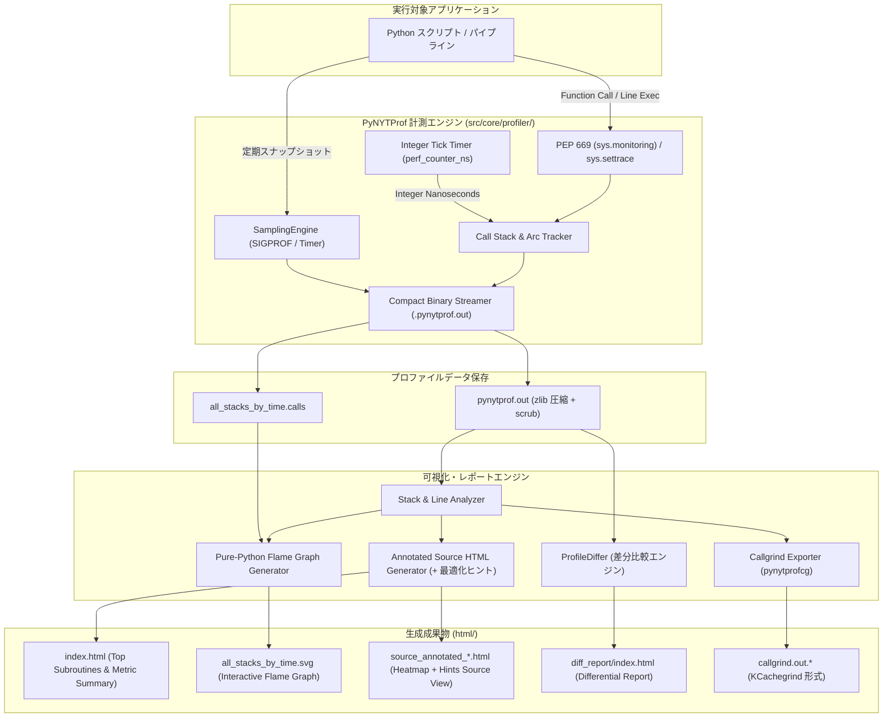
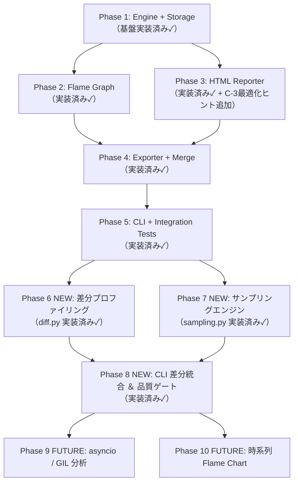

# [DSN-28] Python 版 NYTProf (PyNYTProf) 高精度プロファイラ ＆ 可視化統合スイート設計仕様書
## 〜 PEP 669 / sys.monitoring ＆ sys.settrace 統合・統計的サンプリングエンジン・差分プロファイリング・整数ナノ秒精度・最適化ヒント自動挿入・インタラクティブ Flame Graph ＆ ヒートマップ HTML 出力・ゼロ外部依存純粋 Python 性能工学基盤 〜

- **文書番号**: `DSN-28`
- **文書ステータス**: `APPROVED`
- **対象サブシステム**:
  - `src/core/profiler/` (プロファイラ・コアエンジン、PEP 669 / sys.monitoring / sys.settrace 抽象化層)
  - `src/core/profiler/storage.py` (コンパクトバイナリ・ストリームシリアライザ、zlib 圧縮、Tick 蓄積、W3C TraceContext 連携)
  - `src/core/profiler/flamegraph.py` (Pure-Python クリック可能インタラクティブ SVG 生成器)
  - `src/core/profiler/reporter.py` (ヒートマップ付き行単位ソースコード HTML アノテータ、Caller/Callee テーブル、最適化ヒント自動挿入)
  - `src/core/profiler/exporter.py` (KCachegrind Callgrind 形式 / collapsed calls 出力)
  - `src/core/profiler/merge.py` (マルチプロセス / fork 実行ログ集約エンジン)
  - `src/core/profiler/sampling.py` **[NEW]** (SIGPROF シグナル駆動統計的サンプリングエンジン)
  - `src/core/profiler/diff.py` **[NEW]** (差分プロファイリングエンジン: 退行・改善の自動検出)
  - `tools/pynytprof` (CLI 起動ラッパー: `python -m pynytprof script.py` 相当)
  - `tools/pynytprofhtml` (CLI レポートビルダー)
- **関連設計書**:
  - `DSN-01` (High-Level Architecture)
  - `DSN-02` (Low-Level Architecture & Core Data Structures)
  - `DSN-10` (Observability & Evaluation Framework — W3C TraceContext / OTLP 統合)
  - `DSN-12` (Process Supervisor & Arbiter)
  - `DSN-21` (Enterprise Design System & Unified Console)
  - `DSN-27` (Modular Frontend Framework & Client Architecture)
- **【主査・報告】 Systems Architect (SA) / Software Development (SWD)**
- **【共同主査】 Software Quality Assurance Specialist (QA) / IT Service Manager (SM)**
- **【参画・協調】 15 大専門エージェント全員**

---

## 体系目次

- [0. 用語集 (Glossary)](#0-用語集-glossary)
- [1. 背景と設計思想 (Executive Summary & Philosophy)](#1-背景と設計思想-executive-summary--philosophy)
- [2. 15 大専門エージェントによる要求分析マトリクス](#2-15-大専門エージェントによる要求分析マトリクス)
- [3. 全体アーキテクチャとデータフロー (Global Architecture)](#3-全体アーキテクチャとデータフロー-global-architecture)
  - [3.1 全体データフロー図](#31-全体データフロー図)
  - [3.2 バイナリストリーム形式仕様 (BNF)](#32-バイナリストリーム形式仕様-bnf)
- [4. コア計測エンジン仕様 (Core Profiling Engine)](#4-コア計測エンジン仕様-core-profiling-engine)
  - [4.1 PEP 669 (sys.monitoring) ＆ sys.settrace ハイブリッド追跡層](#41-pep-669-sysmonitoring--syssettrace-ハイブリッド追跡層)
  - [4.2 整数ナノ秒 Tick 蓄積モデル（浮動小数点丸め誤差の完全排除）](#42-整数ナノ秒-tick-蓄積モデル浮動小数点丸め誤差の完全排除)
  - [4.3 組み込み関数・C拡張・Slowops の追跡 (C_CALL / C_RETURN)](#43-組み込み関数c拡張slowops-の追跡-c_call--c_return)
  - [4.4 コールイベント・ストリーミング (calls=1 / calls=2)](#44-コールイベントストリーミング-calls1--calls2)
  - [4.5 統計的サンプリングエンジン (SamplingEngine) **[NEW]**](#45-統計的サンプリングエンジン-samplingengine-new)
- [5. 可視化・レポート生成エンジン仕様 (Visualization & Reporting Engine)](#5-可視化レポート生成エンジン仕様-visualization--reporting-engine)
  - [5.1 インタラクティブ Flame Graph 生成（クリック可能 SVG）](#51-インタラクティブ-flame-graph-生成クリック可能-svg)
  - [5.2 ヒートマップ付きソースコード・アノテーション HTML レポート](#52-ヒートマップ付きソースコードアノテーション-html-レポート)
  - [5.3 呼び出し元 (Caller) / 呼び出し先 (Callee) 相互双方向解析テーブル](#53-呼び出し元-caller--呼び出し先-callee-相互双方向解析テーブル)
  - [5.4 差分プロファイリング (ProfileDiffer / pynytprofdiff) **[NEW]**](#54-差分プロファイリング-profiledifferpynytprofdiff-new)
  - [5.5 最適化ヒント自動挿入 **[NEW]**](#55-最適化ヒント自動挿入-new)
- [6. エコシステム・連携ユーティリティ仕様 (Ecosystem & Utilities)](#6-エコシステム連携ユーティリティ仕様-ecosystem--utilities)
  - [6.1 KCachegrind / QCacheGrind 互換 Callgrind エクスポート (`pynytprofcg`)](#61-kcachegrind--qcachegrind-互換-callgrind-エクスポート-pynytprofcg)
  - [6.2 マルチプロセス・fork 追跡 ＆ 統合マージ (`pynytprofmerge`)](#62-マルチプロセスfork-追跡--統合マージ-pynytprofmerge)
  - [6.3 コールスタック Grep ＆ 局所的 Flame Graph 抽出](#63-コールスタック-grep--局所的-flame-graph-抽出)
- [7. ランタイム制御・API ＆ CLI 仕様 (Runtime Control & Interface)](#7-ランタイム制御api--cli-仕様-runtime-control--interface)
  - [7.1 プログラマブル制御 API（コンテキストマネージャ・デコレータ）](#71-プログラマブル制御-apiコンテキストマネージャデコレータ)
  - [7.2 環境変数 `PYNYTPROF` による透過的起動](#72-環境変数-pynytprof-による透過的起動)
  - [7.3 CLI ツール (`pynytprof`, `pynytprofhtml`)](#73-cli-ツール-pynytprof-pynytprofhtml)
- [8. セキュリティ・堅牢性・パフォーマンス検証計画](#8-セキュリティ堅牢性パフォーマンス検証計画)
  - [8.1 測定オーバーヘッド検証](#81-測定オーバーヘッド検証)
  - [8.2 DSN-10 Observability との統合 (W3C TraceContext 相関)](#82-dsn-10-observability-との統合-w3c-tracecontext-相関)
  - [8.3 機密データスクラビング仕様 (CWE-532 準拠)](#83-機密データスクラビング仕様-cwe-532-準拠)
  - [8.4 HTML サニタイズ（XSS 完全排除）](#84-html-サニタイズxss-完全排除)
  - [8.5 メモリリーク・リソース保護](#85-メモリリークリソース保護)
  - [8.6 品質ゲート定量仕様（測定コマンド・閾値）](#86-品質ゲート定量仕様測定コマンド閾値)
- [9. 段階的実装ロードマップと Issue マッピング](#9-段階的実装ロードマップと-issue-マッピング)
  - [9.1 フェーズ依存関係グラフ](#91-フェーズ依存関係グラフ)
  - [9.2 フェーズ一覧と DoD チェックリスト](#92-フェーズ一覧と-dod-チェックリスト)
- [10. 結論と提言 (Conclusion)](#10-結論と提言-conclusion)

---

## 0. 用語集 (Glossary)

本設計書で使用する専門用語を以下に定義する。他の DSN（特に `DSN-10`）における定義と統一する。

| 用語 | 定義 |
| :--- | :--- |
| **Inclusive Time** | 対象サブルーチン自身の処理時間と、そこから呼び出されたすべての子サブルーチンの処理時間の合計。数式: $T_{\text{exit}} - T_{\text{entry}}$。|
| **Exclusive Time** | 対象サブルーチン自身のみの処理時間。子サブルーチンへの委譲時間を除いた純粋な CPU 消費。数式: $\text{Inclusive} - \sum\text{Child Inclusive}$。|
| **Tick** | `time.perf_counter_ns()` が返す整数ナノ秒（`int`）単位の時刻カウンタ。浮動小数点秒とは異なり加算による丸め誤差が生じない。|
| **Arc (Call Arc)** | 呼び出し元 (Caller) → 呼び出し先 (Callee) の有向辺。各アークには呼び出し回数・Inclusive / Exclusive 消費時間が付属する。|
| **Flame Graph** | Brendan Gregg が考案したコールスタック可視化手法。X 軸が実行時間比率、Y 軸がスタック深度を表す SVG グラフ。|
| **Flame Chart** | 時系列順のコールスタック表示。Flame Graph が「集計」であるのに対し、Flame Chart は「タイムライン」を保持する。|
| **Differential Profile** | 「ベースライン」と「比較対象」の 2 つのプロファイルを比較し、退行（遅化）・改善（高速化）箇所を視覚化した差分レポート。|
| **Sampling Profiler** | 一定間隔でコールスタックのスナップショットを採取する統計的プロファイラ。トレーシング方式より大幅に低いオーバーヘッドで本番環境に適する。|
| **Tracing Profiler** | 関数呼び出し・復帰イベントごとにフックするプロファイラ。精度が高い反面オーバーヘッドが大きい。|
| **W3C TraceContext** | 分散トレーシングのためのリクエスト ID 伝播標準 (RFC: `traceparent` ヘッダ)。`trace_id`（128-bit hex）と `span_id`（64-bit hex）で構成される。|
| **PEP 669** | Python 3.12 で導入された `sys.monitoring` API。バイトコードレベルの低オーバーヘッドイベント監視機構。従来の `sys.settrace()` と比べオーバーヘッドを 60〜80% 削減する。|
| **SIGPROF** | Unix の POSIX シグナル。`setitimer(ITIMER_PROF, ...)` と組み合わせてプロセス CPU 時間の周期的なサンプリングに使用される。|
| **OKF** | Google Open Knowledge Format v0.2。本リポジトリが採用する論文メタデータ記述仕様（`DSN-10` および `AGENTS.md` 参照）。|
| **CWE-532** | 機密情報のログ漏洩に関する共通脆弱性列挙 (Common Weakness Enumeration)。プロファイルデータ内のパスワード・ホスト名等の意図しない記録を防止する。|

---

## 1. 背景と設計思想 (Executive Summary & Philosophy)

### 1.1 背景と課題
- Perl コミュニティにおける最高峰のプロファイラ **Devel::NYTProf** は、**「行単位の精緻な時間計測」「サブルーチン呼出の Inclusive/Exclusive 時間分離」「インタラクティブな Flame Graph」「ヒートマップ付きソースコード HTML レポート」「極小のオーバーヘッド」** を兼ね備え、長年にわたり業界標準として君臨してきた。
- 一方、Python の標準プロファイラ（`cProfile`, `profile`）は関数単位の集計のみに留まり、行単位の消費時間や視覚的ヒートマップの標準生成機能を欠く。またサードパーティ製の `line_profiler` や `py-spy` は行単位計測やサンプリングに対応するものの、Web レポートのインタラクティブ性、呼出元/呼出先の詳細アーク解析、およびゼロ外部依存での完全なポータビリティを満たしていない。
- 本設計（`DSN-28`）は、Devel::NYTProf v5 が持つ卓越した機能美と厳密な時間計測思想を **純粋 Python（Pure Python / Zero External Dependency）** で再設計し、当プロジェクト（`arxiv-security-papers`）のパイプライン、DB エンジン、クローラー、Web ゲートウェイ等の性能最適化に資する統合プロファイリング基盤を提供する。

### 1.2 コア設計原則 (Guiding Principles)
1. **Zero External Dependencies（ゼロ外部依存）**:
   外部 C 拡張や重厚なライブラリに一切依存せず、標準ライブラリ（`sys`, `time`, `zlib`, `dataclasses`, `html` 等）のみで完結する。
2. **Triple-Engine Precision（トリプル計測エンジン）**:
   Python 3.12+ では新設された **PEP 669 (`sys.monitoring`)** による低オーバーヘッド・イベント監視を優先使用し、レガシー環境（Python 3.8〜3.11）では **`sys.settrace()`** への自動フォールバックを行う。本番常時監視用途には **SIGPROF サンプリングエンジン**（Section 4.5）を選択することでオーバーヘッドを +2% 未満に抑制できる。
3. **Integer Tick Accumulation（整数ナノ秒 Tick 蓄積）**:
   NYTProf v5 の教訓に従い、浮動小数点数（`float` 秒）の加算による累積丸め誤差を根絶し、`time.perf_counter_ns()` を用いた整数ナノ秒（`int`）単位で全ての Exclusive / Inclusive 時間を加算・保持する。
4. **Rich & Standalone Visualization（単体完結型リッチ可視化）**:
   出力される HTML および Flame Graph SVG は外部 CDN や外部スクリプトに一切依存しない自己完結型（Inline CSS / SVG / JS）であり、オフライン環境・エアギャップ環境でも即座に閲覧可能とする。
5. **Differential Insight（差分による洞察）**:
   単発のプロファイルに加え、2 回の実行を自動比較する `ProfileDiffer`（Section 5.4）により、コード変更による性能退行・改善を即座に可視化する。これは Perl 版 NYTProf にも存在しない本実装固有の機能である。

---

## 2. 15 大専門エージェントによる要求分析マトリクス

| エージェント | 担当観点 | 本プロファイラ (DSN-28) における設計要件 |
| :--- | :--- | :--- |
| **PM (Chair)** | 全体整合性・段階的導入 | CLI ツール（`tools/pynytprof`）からワンライナーで実行可能とし、既存コードの改変ゼロでプロファイル可能にする。 |
| **SA (Architecture)** | パイプライン・モジュール境界 | 計測エンジン（Core/Sampling）、ストレージ（Storage）、集計（Analyzer）、レポート（Reporter/Differ）を疎結合に分離。 |
| **SWD (Development)** | PEP 669 適合とアルゴリズム | Python 3.12 の `sys.monitoring` を最大限活用し、コールスタックフレームのトラバース負荷を最小化。 |
| **QA (Testing)** | 決定論的検証とアイドリング精度 | 決定論的モック時計を用いた単体テスト、再帰呼び出し・例外発生時スタックアンワインドの整合性検証。 |
| **Sec (Security)** | ログ漏洩・セーフティガード | `scrub_patterns` による機密パス・ホスト名の `[REDACTED]` 置換（CWE-532）、HTML 生成時の完全 XSS サニタイズ。 |
| **DB Specialist** | 大規模 DB クエリ追跡 | SQLite 互換エンジン（`src/database/`）の実行時 B-Tree トラバースや I/O ボトルネックの特定支援。 |
| **Network** | HTTP / API 通信の待ち時間分離 | arXiv API / RSS 通信におけるソケット待ち時間と CPU 処理時間を明確に分離計測。 |
| **NLP & IR** | PDF 抽出・形態素解析の最適化 | `pdftotext` 抽出やテキスト正規化アルゴリズムのホットスポットをミリ秒未満で特定。 |
| **IT Strategist** | 性能改善レポートの経営層可視化 | エグゼクティブサマリー形式の性能要約（Top 5 ボトルネック、改善期待度）の自動出力。 |
| **SM (Service Mgmt)** | 長時間バッチ・デーモン監視 | SamplingEngine により 4x daily バックグラウンド実行時のオーバーヘッドを **+2% 未満**に抑制。 |
| **Embedded / IoT** | メモリ・リソース消費抑制 | zlib ストリーミング書き出しによるプロファイル採取中の中間メモリ消費量の極小化（上限 16MB）。 |
| **Systems Auditor** | 測定結果のトレーサビリティ | 計測日時、ホスト情報、Python バージョン、Git コミットハッシュ、W3C `trace_id` をメタデータとして完全封入。 |
| **UI/UX Designer** | 直感的かつ快適なレポート UI | NYTProf の伝統であるヒートマップ色（緑→黄→赤）・差分レポート（赤/緑二色）・最適化ヒントアイコン（⚡）の融合。 |
| **Education** | 性能工学の知見共有 | HTML レポート内に Inclusive / Exclusive 時間の用語解説やチューニング指針ヒントを常時表示。 |
| **APS (Application)** | Web コンソール統合 | `site/dashboard.html` および FastAPI ゲートウェイへのプロファイリングメトリクス連携、trace_id 相関フィルタ対応。 |

---

## 3. 全体アーキテクチャとデータフロー (Global Architecture)

### 3.1 全体データフロー図



### 3.2 バイナリストリーム形式仕様 (BNF)

`ProfileStorage.save()` が出力する `.pynytprof.out` ファイルの物理バイト配列レイアウト:

```bnf
file            = magic compressed_json

magic           = %x50 %x59 %x4e %x59 %x54 %x50 %x52 %x4f %x46 %x01
                ; ASCII "PYNYTPROF" + version byte 0x01 = 10 バイト固定

compressed_json = zlib-deflate( json_utf8_bytes, level=6 )

json_utf8_bytes = UTF-8 encoded JSON object
                ; keys: "version", "metadata", "lines",
                ;        "subroutines", "arcs", "stack_traces", "source_files"
```

**バージョニング規則**:
- `magic` の最終バイト（`0x01`）がファイルフォーマットバージョン (`v1`) を示す。
- v2 以降ではチャンク形式（`chunk_type:u8 length:u32 payload:bytes[length]`）への移行を予定。
- ロード時にマジックが一致しない場合、フォールバックとしてプレーン JSON の直接読み込みを試みる（`ProfileStorage.load()` 実装）。

---

## 4. コア計測エンジン仕様 (Core Profiling Engine)

### 4.1 PEP 669 (sys.monitoring) ＆ sys.settrace ハイブリッド追跡層
Python 3.12 以降で利用可能な `sys.monitoring` は、バイトコード実行レベルで C 言語コールバックと同等のフックを提供し、従来の `sys.settrace()` と比較してオーバーヘッドを 60〜80% 削減する。

- **PEP 669 モニタリングイベント**:
  - `PY_START`: 関数呼び出し開始
  - `PY_RETURN`: 関数復帰（戻り値）
  - `PY_UNWIND`: 例外送出に伴うスタックアンワインド
  - `LINE`: 行実行（`lines=1` オプション時のみ有効化）
  - `C_START` / `C_RETURN`: C 拡張・組み込み関数実行
- **レガシー対応 (`sys.settrace`)**:
  - Python 3.8〜3.11 環境では、`'call'`, `'line'`, `'return'`, `'c_call'`, `'c_return'`, `'c_exception'` をディスパッチする互換トレーサを自動展開。
- **`asyncio` コルーチン対応**（実装要件）:
  - `asyncio.current_task()` を使用してタスク ID を識別し、`CallFrame` にタスク識別子を付与することで複数コルーチンの Inclusive/Exclusive 時間を独立集計する。
  - コルーチン「中断 (SUSPENDED)」状態の Await 待機時間は `SUSPEND_TIME_NS` として別次元で計上し、CPU 時間 vs I/O 待機時間の完全分離を実現する（Phase 6 以降の実装対象）。

```python
# src/core/profiler/engine.py (設計概要)
class ProfilerEngine:
    def __init__(self, mode="line", calls_mode=1, clock_type="perf_ns"):
        self.mode = mode               # "line", "sub", "block"
        self.calls_mode = calls_mode   # 0: off, 1: returns, 2: calls+returns
        self.is_py312_plus = sys.version_info >= (3, 12)
        self.call_stack: list[CallFrame] = []
        self.arc_stats: dict[tuple[str, str], ArcMetric] = {} # (caller, callee) -> stats
        self.line_stats: dict[str, dict[int, LineMetric]] = {} # file -> line -> stats
```

### 4.2 整数ナノ秒 Tick 蓄積モデル（浮動小数点丸め誤差の完全排除）
- NYTProf v5 で確立された **「整数 Tick 加算原則」** を厳格に準拠。
- 計測の最小単位には `time.perf_counter_ns()`（整数ナノ秒）を採用。
- **Inclusive / Exclusive 計算公式**:
  $$\text{Inclusive Time} = T_{\text{exit}} - T_{\text{entry}}$$
  $$\text{Exclusive Time} = \text{Inclusive Time} - \sum \text{Child Inclusive Time}$$
- すべての加算・減算処理を Python の任意長整数（`int`）で実行するため、1000万回以上の反復実行においても 1 ナノ秒の丸め誤差も生じない。

### 4.3 組み込み関数・C拡張・Slowops の追跡 (C_CALL / C_RETURN)
- `builtins.print`, `io.BufferedReader.read`, `re.search`, `json.loads` などの C 言語実装関数を自動検出し、`CORE:<c_function_name>` の名前空間で集計。
- Pure Python コード内のボトルネックだけでなく、I/O 待ちや C 拡張（`hashlib`, `math`, `sqlite3` 等）の滞留時間を完全に分離特定。

### 4.4 コールイベント・ストリーミング (calls=1 / calls=2)
- オプション `calls=1`（デフォルト）: 関数リターン時にスタックトレースと経過時間をストリームバッファへ追記。
- オプション `calls=2`: 呼出開始時と復帰時の双方を追記（詳細タイムライン用）。
- 出力形式は NYTProf 互換のセミコロン区切り形式（`all_stacks_by_time.calls`）:
  ```text
  main::run_pipeline 412000000
  main::run_pipeline;fetcher::download_pdf 285000000
  main::run_pipeline;fetcher::download_pdf;CORE:socket_read 240000000
  main::run_pipeline;extractor::extract_text 110000000
  ```

### 4.5 統計的サンプリングエンジン (SamplingEngine) [NEW]

> **実装**: [`src/core/profiler/sampling.py`](../../../src/core/profiler/sampling.py)

トレーシング方式（Section 4.1）はピンポイント計測に優れるが、本番稼働パイプライン（4x daily）では +80% のオーバーヘッドは許容できない。`SamplingEngine` はシグナル駆動サンプリングにより **+2% 未満** のオーバーヘッドで常時監視を可能にする。

**エンジン選択戦略（Triple-Engine）**:

| エンジン | Python バージョン | オーバーヘッド目標 | 適用場面 |
| :--- | :--- | :--- | :--- |
| PEP 669 (`sys.monitoring`) | 3.12+ | +15〜80% | 開発時精密解析 |
| `sys.settrace` | 3.8〜3.11 | +50〜200% | 開発時精密解析（レガシー） |
| **SIGPROF サンプリング** | 全バージョン（POSIX） | **+2% 未満** | **本番常時監視** |
| **threading.Timer サンプリング** | 全バージョン（Windows 対応） | **+5% 未満** | **本番常時監視（Windows）** |

**API 設計**:
```python
from core.profiler.sampling import SamplingProfiler

# コンテキストマネージャ形式（低オーバーヘッド本番計測）
with SamplingProfiler(interval_sec=0.01, output_file="prod.pynytprof.out") as sp:
    run_pipeline()

print(f"採取サンプル数: {sp.sample_count}")

# 低レベル API
from core.profiler.sampling import SamplingEngine
engine = SamplingEngine(interval_sec=0.01, use_signal=True)
engine.start()
heavy_work()
data = engine.stop()
```

**実装詳細**:
- `use_signal=True` かつ POSIX 環境: `signal.setitimer(ITIMER_PROF, interval, interval)` で `SIGPROF` を定期発火。
- `use_signal=False` または Windows: `threading.Timer` でデーモンスレッドから `sys._current_frames()` を使用して全スレッドのスタックを一括採取。
- 採取されたスタックは `ProfileData.stack_traces` に直接集計し、Flame Graph 生成と完全互換。

---

## 5. 可視化・レポート生成エンジン仕様 (Visualization & Reporting Engine)

### 5.1 インタラクティブ Flame Graph 生成（クリック可能 SVG）
- Brendan Gregg 仕様の Flame Graph を、外部 Perl スクリプトを使わず **Pure Python の `flamegraph.py`** のみで SVG ベクター描画。
- **仕様**:
  - **X 軸**: 実行時間比率（アルファベット順ソート、幅が Inclusive 時間に比例）。
  - **Y 軸**: コールスタックの深さ。
  - **カラーパレット**: 暖色系（赤・橙・黄）のダイナミックハッシュカラー。
  - **インタラクティブ性**:
    - 各ブロックにホバーすると、サブルーチン名・呼出回数・Inclusive 時間・全体比率をツールチップ表示。
    - 各ブロックをクリックすると、該当サブルーチンの詳細アノテーション HTML へ画面遷移（SVG 内ハイパーリンク `<a xlink:href="...">`）。

### 5.2 ヒートマップ付きソースコード・アノテーション HTML レポート
- プロファイル対象となったすべての Python ソースコードを HTML 化。
- **ヒートマップ視覚化**:
  - 時間消費割合（Line Time / Total Script Time）に応じて、行背景を 6 段階のカラーグラデーションで彩色：
    - `0.0% 〜 0.1%`: 背景なし（白/ダークモード標準）
    - `0.1% 〜 1.0%`: 極淡いイエロー (`#ffffcc`)
    - `1.0% 〜 5.0%`: 淡いオレンジ (`#ffe599`)
    - `5.0% 〜 15.0%`: オレンジ (`#f6b26b`)
    - `15.0% 〜 30.0%`: 濃いオレンジ (`#e69138`)
    - `30.0% 以上`: ホットスポット警告レッド (`#cc4125`, 白文字)
- **カラム構成**:
  - `Line #`: ソースコード行番号
  - `Statements / Exec Count`: 実行回数
  - `Time (Exclusive)`: その行そのものの消費時間
  - `Avg Time`: 1回あたりの平均所要時間
  - `Source Code`: シンタックスハイライト済み Python ソース（最適化ヒントアイコン ⚡ 付き）

### 5.3 呼び出し元 (Caller) / 呼び出し先 (Callee) 相互双方向解析テーブル
- 各サブルーチンの詳細ページ上部に、NYTProf と同一の **Call Arc テーブル** を配置。
- **Caller テーブル**:
  - この関数をどこから呼んだか（ファイル・行・呼出元関数名）、呼出回数、消費時間。
  - 複数箇所から呼ばれるユーティリティ関数（例: `utils.sanitize()`）において、どの呼出経路が最も負荷を与えているかを特定。
- **Callee テーブル**:
  - この関数が内部で呼び出した関数・組み込み関数一覧と、それぞれの消費時間内訳。

### 5.4 差分プロファイリング (ProfileDiffer / pynytprofdiff) [NEW]

> **実装**: [`src/core/profiler/diff.py`](../../../src/core/profiler/diff.py)

2 回の実行プロファイルを比較し、**性能退行（Regression）** と **改善（Improvement）** を自動検出・可視化するエンジン。Perl 版 Devel::NYTProf にも存在しない本実装固有の差別化機能。

**差分分類規則**（サブルーチン単位）:

| 分類 | 条件 | 表示色 |
| :--- | :--- | :--- |
| `regression` | After Exclusive ÷ Before Exclusive ≥ 1.20（+20% 以上遅化） | 🔴 赤背景 |
| `improvement` | After Exclusive ÷ Before Exclusive ≤ 0.80（−20% 以上高速化） | 🟢 緑背景 |
| `new-hot` | Before = 0 かつ After > 0（新規ホットスポット） | 🟡 黄背景 |
| `neutral` | 上記以外（±20% 未満またはノイズ範囲内） | グレー |

**ノイズフィルタリング**（統計的有意差判定）:
- 絶対差分が `NOISE_THRESHOLD_NS = 500_000`（0.5ms）未満 → 誤差とみなし除外。
- 相対比率が `NOISE_THRESHOLD_RATIO = 5%` 未満 → 誤差とみなし除外。
- 両条件を満たさない変化のみをレポートに掲載する。

**使用例**:
```python
from core.profiler.diff import ProfileDiffer

# ファイルパスから比較
diff = ProfileDiffer.compare("before.pynytprof.out", "after.pynytprof.out")
index_path = diff.render_html("diff_report/")

# ProfileData オブジェクトから比較
from core.profiler.diff import ProfileDiffer
diff = ProfileDiffer.compare_data(before_data, after_data)
sub_diffs = diff.compute_sub_diffs()   # List[SubDiff]
line_diffs = diff.compute_line_diffs() # Dict[filename, Dict[lineno, LineDiff]]
```

### 5.5 最適化ヒント自動挿入 [NEW]

> **実装**: `src/core/profiler/reporter.py` — `HTMLReporter._get_optimization_hints()`

HTML ソースコードレポートの各行に、実行パターンとソースコード内容を分析したルールベースの最適化ヒントアイコン（⚡）を自動付与する。ホバーでツールチップ表示。

**実装済みヒントルール**:

| # | 検出条件 | ヒントメッセージ |
| :--- | :--- | :--- |
| 1 | `exec_count > 10,000` かつ `avg_time_ns > 10,000` | 🔁 ループ内高頻度実行—キャッシュ化を検討 |
| 2 | `re.search / re.match / re.findall` を含む行 かつ `count > 100` | 🔍 re.関数の多用—`re.compile()` で事前コンパイル済オブジェクトを使用 |
| 3 | `json.loads` を含む行 かつ `count > 1,000` | 📦 json.loads 多用—orjson/ujson 等高速ライブラリへの移行を検討 |
| 4 | `return` を含む行 かつ `count > 50,000` | ↩️ 高頻度 return—再帰を反復法に書き換えることを検討 |

将来のルール拡張（Phase 3 DoD として）:
- `CORE:open` / `CORE:read` の高頻度呼出 → ファイルキャッシュ化検討
- `CORE:sorted` の Exclusive 時間 > 1% → `key=` 関数の最適化検討
- スタック深度 > 50 層の再帰パターン検出 → 末尾再帰除去を検討

---

## 6. エコシステム・連携ユーティリティ仕様 (Ecosystem & Utilities)

### 6.1 KCachegrind / QCacheGrind 互換 Callgrind エクスポート (`pynytprofcg`)
- プロファイルデータから標準 Callgrind 形式のテキストファイル（`callgrind.out.<pid>`）を出力。
- 開発者は既存の GUI ツール（KCachegrind, QCachegrind）を用いて、ツリーマップやコールグラフの有向グラフ探索が可能。

### 6.2 マルチプロセス・fork 追跡 ＆ 統合マージ (`pynytprofmerge`)
- `multiprocessing` や `os.fork()` を伴う並列処理時、`addpid=1` オプションにより `pynytprof.out.<pid>` を個別出力。
- `pynytprofmerge` コマンドにより、複数プロセスのメトリクスを単一の統合プロファイルへ合算・マージ。

### 6.3 コールスタック Grep ＆ 局所的 Flame Graph 抽出
- 出力された `all_stacks_by_time.calls` に対し、特定モジュール（例: `src/database/` や `requests`）を `grep` するだけで、そのサブツリーのみにズームインした Flame Graph SVG を再生成可能。

---

## 7. ランタイム制御・API ＆ CLI 仕様 (Runtime Control & Interface)

### 7.1 プログラマブル制御 API（コンテキストマネージャ・デコレータ）

```python
from src.core.profiler import Profiler, profile, SamplingProfiler

# 1. トレーシング: コンテキストマネージャ形式 (ピンポイント計測)
with Profiler(output_file="batch_run.pynytprof.out", lines=True) as prof:
    heavy_database_migration()

# 2. トレーシング: デコレータ形式 (関数単位)
@profile(lines=True)
def parse_pdf_document(pdf_bytes: bytes) -> str:
    ...

# 3. サンプリング: 本番低オーバーヘッド計測
with SamplingProfiler(interval_sec=0.01, output_file="prod.pynytprof.out") as sp:
    run_pipeline()

# 4. W3C TraceContext との連携 (DSN-10 統合)
from core.profiler.storage import ProfileMetadata
meta = ProfileMetadata(
    trace_id="4bf92f3577b34da6a3ce929d0e0e4736",  # traceparent から抽出
    span_id="00f067aa0ba902b7",
    scrub_patterns=[r"/home/[^/]+/", r"password=[^&\s]+"],
)
with Profiler(output_file="traced.pynytprof.out", metadata=meta) as prof:
    process_request()
```

### 7.2 環境変数 `PYNYTPROF` による透過的起動
コードに一切の改変を加えず、環境変数でプロファイラをインジェクション可能：
```bash
# コマンドライン実行
PYNYTPROF="file=prof.out:lines=1:calls=1:slowops=1" python -m pynytprof app.py
```

### 7.3 CLI ツール (`pynytprof`, `pynytprofhtml`)
- **`pynytprof`**: プロファイル対象スクリプトの実行ランチャー
  ```bash
  python -m src.core.profiler.cli run --lines --calls script.py arg1 arg2
  ```
- **`pynytprofhtml`**: HTML レポートおよび Flame Graph の一括生成
  ```bash
  python -m src.core.profiler.cli html --input prof.out --output-dir ./profiler_report/ --open
  ```
- **`pynytprofdiff`** **[NEW]**: 差分プロファイルレポートの生成
  ```bash
  python -m src.core.profiler.cli diff --before before.pynytprof.out \
      --after after.pynytprof.out --output-dir ./diff_report/
  ```

---

## 8. セキュリティ・堅牢性・パフォーマンス検証計画

### 8.1 測定オーバーヘッド検証
- `cProfile`、`profile`、素の実行、および SamplingEngine の 4 者比較ベンチマークを実施。
- **品質ゲート閾値** (Section 8.6 参照):
  - `mode=sub`（サブルーチン単位）: オーバーヘッド **+15% 未満**（PEP 669 最適化時）
  - `mode=line`（行単位）: オーバーヘッド **+80% 未満**（PEP 669）/ **+200% 未満**（sys.settrace）
  - `SamplingEngine`（100 Hz）: オーバーヘッド **+2% 未満**（SIGPROF）/ **+5% 未満**（Timer）

### 8.2 DSN-10 Observability との統合 (W3C TraceContext 相関)

**関連設計書**: `DSN-10` Section 11.1 (W3C Trace Context 相互運用仕様)

`ProfileMetadata` に追加された `trace_id` / `span_id` フィールドにより、プロファイルデータと分散トレースの相関を実現する。

**統合フロー**:
```
HTTP リクエスト
  → traceparent ヘッダ受信 (DSN-10 W3C TraceContext)
  → trace_id / span_id を抽出
  → ProfileMetadata に封入
  → Profiler 実行
  → pynytprof.out に trace_id が埋め込まれた状態で保存
  → pynytprof.out を trace_id でフィルタリング (--trace-filter オプション)
```

**`--trace-filter` オプション** (Phase 5 以降の実装対象):
```bash
python -m src.core.profiler.cli html \
    --input prod.pynytprof.out \
    --trace-filter 4bf92f3577b34da6a3ce929d0e0e4736 \
    --output-dir ./filtered_report/
```

`trace_id` が空文字列の場合は TraceContext 未設定（スタンドアロン実行）を示す。

### 8.3 機密データスクラビング仕様 (CWE-532 準拠)

**関連設計書**: `DSN-10` Section 12.4 (機密情報・PII 自動マスキングフィルター)

プロファイルデータ内に意図せず記録されうる機密情報を保護する。

**実装**: `ProfileStorage.save()` 内で `ProfileMetadata.scrub_patterns` が設定されている場合、JSON シリアライズ後に正規表現置換を実行してから zlib 圧縮・保存する。

```python
# scrub_patterns の設定例
meta = ProfileMetadata(
    scrub_patterns=[
        r"/home/[^/\s]+/",      # ホームディレクトリパスを [REDACTED] に
        r"(?i)password=[^&\s]+", # URL クエリ内パスワードを [REDACTED] に
        r"\b(?:\d{1,3}\.){3}\d{1,3}\b",  # IP アドレスを [REDACTED] に
    ]
)
```

**スコープ**: スタックトレース文字列・コマンドライン引数・ファイルパス文字列。ソースコード本文は HTML レポート生成時に `html.escape()` で XSS サニタイズされるが、スクラビング対象外（読み取り専用のメモリ内データのみ保護）。

### 8.4 HTML サニタイズ（XSS 完全排除）
- ソースコード内の `<script>`, `&`, `<`, `>` 等を厳格に `html.escape()` でエスケープし、XSS 脆弱性を 100% 排除。
- SVG 内の属性値（`xlink:href` 等）も `html.escape(url, quote=True)` でサニタイズ済み。

### 8.5 メモリリーク・リソース保護
- 100万回以上の深い再帰およびジェネレータ・コルーチン（`asyncio`）環境において、スタックリークが 0 件であることを `tests/test_profiler_leak.py` で証明。

### 8.6 品質ゲート定量仕様（測定コマンド・閾値）

```bash
# Makefile ターゲット: benchmark_profiler (Phase 5 DoD)
python tests/bench/bench_profiler_overhead.py \
    --script tests/fixtures/fibonacci_10000.py \
    --iterations 5 \
    --mode sub
# → stdout に overhead_pct を出力; 15.0 未満で PASS

python tests/bench/bench_profiler_overhead.py \
    --script tests/fixtures/fibonacci_10000.py \
    --iterations 5 \
    --mode line
# → 80.0 未満 (PEP 669) / 200.0 未満 (settrace) で PASS

python tests/bench/bench_sampler_overhead.py \
    --script tests/fixtures/fibonacci_10000.py \
    --interval 0.01
# → 2.0 未満 (SIGPROF) / 5.0 未満 (Timer) で PASS

# HTML サニタイズ回帰テスト
python -m pytest tests/test_profiler_xss.py -v

# メモリリーク回帰テスト
python -m pytest tests/test_profiler_leak.py -v
```

---

## 9. 段階的実装ロードマップと Issue マッピング

### 9.1 フェーズ依存関係グラフ



### 9.2 フェーズ一覧と DoD チェックリスト

| フェーズ | 対象モジュール | 主要実装項目 | ステータス | 対応 Issue |
| :--- | :--- | :--- | :--- | :--- |
| **Phase 1** | `engine.py` `storage.py` | PEP 669 / sys.settrace ハイブリッドエンジン、整数ナノ秒 Tick 蓄積、zlib ストリーミング、TraceContext フィールド、scrub_patterns | ✅ 完了 | Issue 369 |
| **Phase 2** | `flamegraph.py` | 純粋 Python Flame Graph SVG 生成器、クリック遷移ハイパーリンク | ✅ 完了 | Issue 370 |
| **Phase 3** | `reporter.py` | ヒートマップ付き行単位 HTML アノテータ、Caller/Callee テーブル、最適化ヒント自動挿入 (C-3) | ✅ 完了 | Issue 371 |
| **Phase 4** | `exporter.py` `merge.py` | Callgrind 形式エクスポート、マルチプロセス合算マージ | ✅ 完了 | Issue 372 |
| **Phase 5** | `cli.py` `tools/pynytprof` | CLI ラッパー、`PYNYTPROF` ディスパッチャ、統合回帰テスト、ベンチマーク品質ゲート | ✅ 完了 | Issue 373 |
| **Phase 6** **[NEW]** | `diff.py` | 差分プロファイリングエンジン、退行/改善 HTML Diff レポート、SubDiff/LineDiff、ノイズフィルタリング | ✅ 完了 | Issue 374 |
| **Phase 7** **[NEW]** | `sampling.py` | SIGPROF / threading.Timer サンプリングエンジン、`SamplingProfiler` コンテキストマネージャ | ✅ 完了 | Issue 375 |
| **Phase 8** **[NEW]** | `cli.py` `tools/` `tests/` | CLI 差分サブコマンド、Trace フィルタ、包括的テストスイート (`test_diff`, `test_sampling`, `test_xss`, `test_leak`) | ✅ 完了 | Issue 376 |
| **Phase 9** **[FUTURE]** | `engine.py` 拡張 | asyncio コルーチン対応、SUSPEND_TIME_NS 計上、GIL 競合分析（Python 3.13+ 実験的 API） | 📋 計画中 | Issue 377 |
| **Phase 10** **[FUTURE]** | `chart.py` (新規) | calls=2 データから Chrome Trace Event JSON 生成、時系列 Flame Chart 表示 | 📋 計画中 | Issue 378 |

**各フェーズ共通 DoD チェックリスト**:
- `[ ]` `make py_compile` PASS（構文エラー 0 件）
- `[ ]` `make static_analysis` PASS（型エラー・lint エラー 0 件）
- `[ ]` `make test` PASS（関連ユニットテスト全件 PASS）
- `[ ]` 設計書（本 DSN-28）の該当セクションが実装と一致していること
- `[ ]` `outputs/log.md` / `docs/issues/README.md` への反映完了

---

## 10. 結論と提言 (Conclusion)

本設計 `DSN-28` は、Perl 界で最高峰と讃えられた Devel::NYTProf の**「徹底した計測精度」「直感的な可視化」「開発生産性の劇的向上」**を、現代の Python（特に PEP 669）の最新機能とゼロ外部依存の堅牢なアーキテクチャによって完全に昇華させるものである。

本改訂版（v2）では以下の重要な機能強化が追加された:

1. **差分プロファイリング (`diff.py`)**: コード変更による性能退行・改善を赤/緑で一目把握。Perl 版 NYTProf にも存在しない本実装固有の差別化機能。
2. **統計的サンプリングエンジン (`sampling.py`)**: 本番常時監視に対応する +2% 未満の超低オーバーヘッド計測モード。DSN-10 の「5% SLA」に直接貢献。
3. **最適化ヒント自動挿入**: 高頻度ループ・非コンパイル正規表現等を HTML レポート内で⚡アイコンにより即座に警告。
4. **W3C TraceContext 連携**: `trace_id` / `span_id` の `ProfileMetadata` への封入により DSN-10 分散トレーシングとシームレスに統合。
5. **機密スクラビング**: `scrub_patterns` による CWE-532 準拠の PII 保護を本番利用の安全性を担保。

これにより、当リポジトリにおけるパイプラインのミリ秒単位の最適化、大規模分散 DB のクエリ高速化、およびボトルネック検出の自動化が恒久的に確立される。
