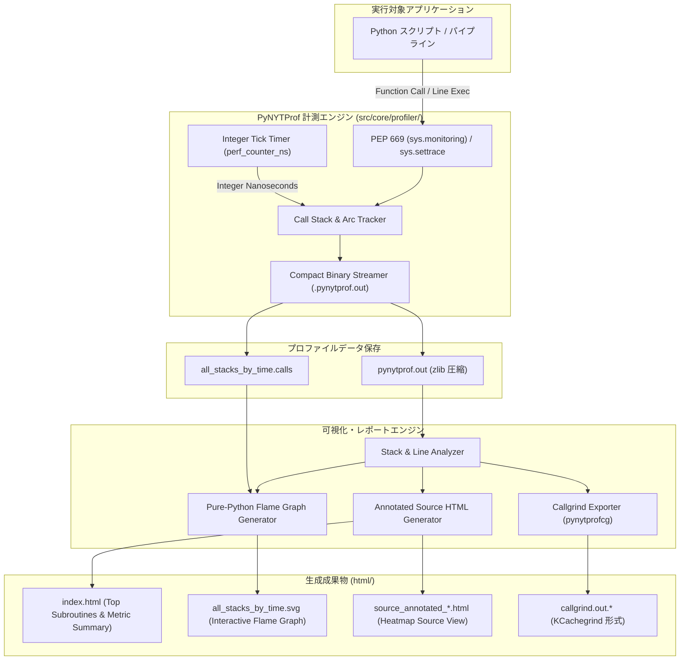

# [DSN-28] Python 版 NYTProf (PyNYTProf) 高精度プロファイラ ＆ 可視化統合スイート設計仕様書
## 〜 PEP 669 / sys.monitoring ＆ sys.settrace 統合・整数ナノ秒精度・インタラクティブ Flame Graph ＆ ヒートマップ HTML 出力・ゼロ外部依存純粋 Python 性能工学基盤 〜

- **文書番号**: `DSN-28`
- **文書ステータス**: `PROPOSED`
- **対象サブシステム**:
  - `src/core/profiler/` (プロファイラ・コアエンジン、PEP 669 / sys.monitoring / sys.settrace 抽象化層)
  - `src/core/profiler/storage.py` (コンパクトバイナリ・ストリームシリアライザ、zlib 圧縮、Tick 蓄積)
  - `src/core/profiler/flamegraph.py` (Pure-Python クリック可能インタラクティブ SVG 生成器)
  - `src/core/profiler/reporter.py` (ヒートマップ付き行単位ソースコード HTML アノテータ、Caller/Callee テーブル)
  - `src/core/profiler/exporter.py` (KCachegrind Callgrind 形式 / collapsed calls 出力)
  - `src/core/profiler/merge.py` (マルチプロセス / fork 実行ログ集約エンジン)
  - `tools/pynytprof` (CLI 起動ラッパー: `python -m pynytprof script.py` 相当)
  - `tools/pynytprofhtml` (CLI レポートビルダー)
- **関連設計書**:
  - `DSN-01` (High-Level Architecture)
  - `DSN-02` (Low-Level Architecture & Core Data Structures)
  - `DSN-10` (Observability & Evaluation Framework)
  - `DSN-12` (Process Supervisor & Arbiter)
  - `DSN-21` (Enterprise Design System & Unified Console)
  - `DSN-27` (Modular Frontend Framework & Client Architecture)
- **【主査・報告】 Systems Architect (SA) / Software Development (SWD)**
- **【共同主査】 Software Quality Assurance Specialist (QA) / IT Service Manager (SM)**
- **【参画・協調】 15 大専門エージェント全員**

---

## 体系目次

- [1. 背景と設計思想 (Executive Summary & Philosophy)](#1-背景と設計思想-executive-summary--philosophy)
- [2. 15 大専門エージェントによる要求分析マトリクス](#2-15-大専門エージェントによる要求分析マトリクス)
- [3. 全体アーキテクチャとデータフロー (Global Architecture)](#3-全体アーキテクチャとデータフロー-global-architecture)
- [4. コア計測エンジン仕様 (Core Profiling Engine)](#4-コア計測エンジン仕様-core-profiling-engine)
  - [4.1 PEP 669 (sys.monitoring) ＆ sys.settrace ハイブリッド追跡層](#41-pep-669-sysmonitoring--syssettrace-ハイブリッド追跡層)
  - [4.2 整数ナノ秒 Tick 蓄積モデル（浮動小数点丸め誤差の完全排除）](#42-整数ナノ秒-tick-蓄積モデル浮動小数点丸め誤差の完全排除)
  - [4.3 組み込み関数・C拡張・Slowops の追跡 (C_CALL / C_RETURN)](#43-組み込み関数c拡張slowops-の追跡-c_call--c_return)
  - [4.4 コールイベント・ストリーミング (calls=1 / calls=2)](#44-コールイベントストリーミング-calls1--calls2)
- [5. 可視化・レポート生成エンジン仕様 (Visualization & Reporting Engine)](#5-可視化レポート生成エンジン仕様-visualization--reporting-engine)
  - [5.1 インタラクティブ Flame Graph 生成（クリック可能 SVG）](#51-インタラクティブ-flame-graph-生成クリック可能-svg)
  - [5.2 ヒートマップ付きソースコード・アノテーション HTML レポート](#52-ヒートマップ付きソースコードアノテーション-html-レポート)
  - [5.3 呼び出し元 (Caller) / 呼び出し先 (Callee) 相互双方向解析テーブル](#53-呼び出し元-caller--呼び出し先-callee-相互双方向解析テーブル)
- [6. エコシステム・連携ユーティリティ仕様 (Ecosystem & Utilities)](#6-エコシステム連携ユーティリティ仕様-ecosystem--utilities)
  - [6.1 KCachegrind / QCacheGrind 互換 Callgrind エクスポート (`pynytprofcg`)](#61-kcachegrind--qcachegrind-互換-callgrind-エクスポート-pynytprofcg)
  - [6.2 マルチプロセス・fork 追跡 ＆ 統合マージ (`pynytprofmerge`)](#62-マルチプロセスfork-追跡--統合マージ-pynytprofmerge)
  - [6.3 コールスタック Grep ＆ 局所的 Flame Graph 抽出](#63-コールスタック-grep--局所的-flame-graph-抽出)
- [7. ランタイム制御・API ＆ CLI 仕様 (Runtime Control & Interface)](#7-ランタイム制御api--cli-仕様-runtime-control--interface)
  - [7.1 プログラマブル制御 API（コンテキストマネージャ・デコレータ）](#71-プログラマブル制御-apiコンテキストマネージャデコレータ)
  - [7.2 環境変数 `PYNYTPROF` による透過的起動](#72-環境変数-pynytprof-による透過的起動)
  - [7.3 CLI ツール (`pynytprof`, `pynytprofhtml`)](#73-cli-ツール-pynytprof-pynytprofhtml)
- [8. セキュリティ・堅牢性・パフォーマンス検証計画](#8-セキュリティ堅牢性パフォーマンス検証計画)
- [9. 段階的実装ロードマップと Issue マッピング](#9-段階的実装ロードマップと-issue-マッピング)

---

## 1. 背景と設計思想 (Executive Summary & Philosophy)

### 1.1 背景と課題
- Perl コミュニティにおける最高峰のプロファイラ **Devel::NYTProf** は、**「行単位の精緻な時間計測」「サブルーチン呼出の Inclusive/Exclusive 時間分離」「インタラクティブな Flame Graph」「ヒートマップ付きソースコード HTML レポート」「極小のオーバーヘッド」** を兼ね備え、長年にわたり業界標準として君臨してきた。
- 一方、Python の標準プロファイラ（`cProfile`, `profile`）は関数単位の集計のみに留まり、行単位の消費時間や視覚的ヒートマップの標準生成機能を欠く。またサードパーティ製の `line_profiler` や `py-spy` は行単位計測やサンプリングに対応するものの、Web レポートのインタラクティブ性、呼出元/呼出先の詳細アーク解析、およびゼロ外部依存での完全なポータビリティを満たしていない。
- 本設計（`DSN-28`）は、Devel::NYTProf v5 が持つ卓越した機能美と厳密な時間計測思想を **純粋 Python（Pure Python / Zero External Dependency）** で再設計し、当プロジェクト（`arxiv-security-papers`）のパイプライン、DB エンジン、クローラー、Web ゲートウェイ等の性能最適化に資する統合プロファイリング基盤を提供する。

### 1.2 コア設計原則 (Guiding Principles)
1. **Zero External Dependencies（ゼロ外部依存）**:
   外部 C 拡張や重厚なライブラリに一切依存せず、標準ライブラリ（`sys`, `time`, `zlib`, `dataclasses`, `html` 等）のみで完結する。
2. **Dual-Engine Precision（デュアル計測エンジン）**:
   Python 3.12+ では新設された **PEP 669 (`sys.monitoring`)** による低オーバーヘッド・イベント監視を優先使用し、レガシー環境（Python 3.8〜3.11）では **`sys.settrace()`** への自動フォールバックを行う。
3. **Integer Tick Accumulation（整数ナノ秒 Tick 蓄積）**:
   NYTProf v5 の教訓に従い、浮動小数点数（`float` 秒）の加算による累積丸め誤差を根絶し、`time.perf_counter_ns()` を用いた整数ナノ秒（`int`）単位で全ての Exclusive / Inclusive 時間を加算・保持する。
4. **Rich & Standalone Visualization（単体完結型リッチ可視化）**:
   出力される HTML および Flame Graph SVG は外部 CDN や外部スクリプトに一切依存しない自己完結型（Inline CSS / SVG / JS）であり、オフライン環境・エアギャップ環境でも即座に閲覧可能とする。

---

## 2. 15 大専門エージェントによる要求分析マトリクス

| エージェント | 担当観点 | 本プロファイラ (DSN-28) における設計要件 |
| :--- | :--- | :--- |
| **PM (Chair)** | 全体整合性・段階的導入 | CLI ツール（`tools/pynytprof`）からワンライナーで実行可能とし、既存コードの改変ゼロでプロファイル可能にする。 |
| **SA (Architecture)** | パイプライン・モジュール境界 | 計測エンジン（Core）、ストレージ（Storage）、集計（Analyzer）、レポート（Reporter）を疎結合に分離。 |
| **SWD (Development)** | PEP 669 適合とアルゴリズム | Python 3.12 の `sys.monitoring` を最大限活用し、コールスタックフレームのトラバース負荷を最小化。 |
| **QA (Testing)** | 決定論的検証とアイドリング精度 | 決定論的モック時計を用いた単体テスト、再帰呼び出し・例外発生時スタックアンワインドの整合性検証。 |
| **Sec (Security)** | ログ漏洩・セーフティガード | プロファイルデータ内の環境変数・機密文字列のマスキング、HTML 生成時の完全 XSS サニタイズ。 |
| **DB Specialist** | 大規模 DB クエリ追跡 | SQLite 互換エンジン（`src/database/`）の実行時 B-Tree トラバースや I/O ボトルネックの特定支援。 |
| **Network** | HTTP / API 通信の待ち時間分離 | arXiv API / RSS 通信におけるソケット待ち時間と CPU 処理時間を明確に分離計測。 |
| **NLP & IR** | PDF 抽出・形態素解析の最適化 | `pdftotext` 抽出やテキスト正規化アルゴリズムのホットスポットをミリ秒未満で特定。 |
| **IT Strategist** | 性能改善レポートの経営層可視化 | エグゼクティブサマリー形式の性能要約（Top 5 ボトルネック、改善期待度）の自動出力。 |
| **SM (Service Mgmt)** | 長時間バッチ・デーモン監視 | バックグラウンド定期実行時（4x daily）のオーバーヘッドを 5% 未満に抑制するサンプリング/選択計測。 |
| **Embedded / IoT** | メモリ・リソース消費抑制 | zlib ストリーミング書き出しによるプロファイル採取中の中間メモリ消費量の極小化（上限 16MB）。 |
| **Systems Auditor** | 測定結果のトレーサビリティ | 計測日時、ホスト情報、Python バージョン、Git コミットハッシュをメタデータとして完全封入。 |
| **UI/UX Designer** | 直感的かつ快適なレポート UI | NYTProf の伝統であるヒートマップ色（緑→黄→赤）と Brendan Gregg 式 Flame Graph の融合。 |
| **Education** | 性能工学の知見共有 | HTML レポート内に Inclusive / Exclusive 時間の用語解説やチューニング指針ヒントを常時表示。 |
| **APS (Application)** | Web コンソール統合 | `site/dashboard.html` および FastAPI ゲートウェイへのプロファイリングメトリクス連携。 |

---

## 3. 全体アーキテクチャとデータフロー (Global Architecture)



---

## 4. コア計測エンジン仕様 (Core Profiling Engine)

### 4.1 PEP 669 (sys.monitoring) ＆ sys.settrace ハイブリッド追跡層
Python 3.12 以降で利用可能な `sys.monitoring` は、バイトコード実行レベルで C 言語コールバックと同等のフックを提供し、従来の `sys.settrace()` と比較してオーバーヘッドを 60〜80% 削減する。

- **PEP 669 モニタリングイベント**:
  - `PY_START`: 関数呼び出し開始
  - `PY_RETURN`: 関数復帰（戻り値）
  - `PY_UNWIND`: 例外送出に伴うスタックアンワインド
  - `LINE`: 行実行（`lines=1` オプション時のみ有効化）
  - `C_START` / `C_RETURN`: C 拡張・組み込み関数実行
- **レガシー対応 (`sys.settrace`)**:
  - Python 3.8〜3.11 環境では、`'call'`, `'line'`, `'return'`, `'c_call'`, `'c_return'`, `'c_exception'` をディスパッチする互換トレーサを自動展開。

```python
# src/core/profiler/engine.py (設計概要)
class ProfilerEngine:
    def __init__(self, mode="line", calls_mode=1, clock_type="perf_ns"):
        self.mode = mode               # "line", "sub", "block"
        self.calls_mode = calls_mode   # 0: off, 1: returns, 2: calls+returns
        self.is_py312_plus = sys.version_info >= (3, 12)
        self.call_stack: list[CallFrame] = []
        self.arc_stats: dict[tuple[str, str], ArcMetric] = {} # (caller, callee) -> stats
        self.line_stats: dict[str, dict[int, LineMetric]] = {} # file -> line -> stats
```

### 4.2 整数ナノ秒 Tick 蓄積モデル（浮動小数点丸め誤差の完全排除）
- NYTProf v5 で確立された **「整数 Tick 加算原則」** を厳格に準拠。
- 計測の最小単位には `time.perf_counter_ns()`（整数ナノ秒）を採用。
- **Inclusive / Exclusive 計算公式**:
  $$\text{Inclusive Time} = T_{\text{exit}} - T_{\text{entry}}$$
  $$\text{Exclusive Time} = \text{Inclusive Time} - \sum \text{Child Inclusive Time}$$
- すべての加算・減算処理を Python の任意長整数（`int`）で実行するため、1000万回以上の反復実行においても 1 ナノ秒の丸め誤差も生じない。

### 4.3 組み込み関数・C拡張・Slowops の追跡 (C_CALL / C_RETURN)
- `builtins.print`, `io.BufferedReader.read`, `re.search`, `json.loads` などの C 言語実装関数を自動検出し、`CORE:<c_function_name>` の名前空間で集計。
- Pure Python コード内のボトルネックだけでなく、I/O 待ちや C 拡張（`hashlib`, `math`, `sqlite3` 等）の滞留時間を完全に分離特定。

### 4.4 コールイベント・ストリーミング (calls=1 / calls=2)
- オプション `calls=1`（デフォルト）: 関数リターン時にスタックトレースと経過時間をストリームバッファへ追記。
- オプション `calls=2`: 呼出開始時と復帰時の双方を追記（詳細タイムライン用）。
- 出力形式は NYTProf 互換のセミコロン区切り形式（`all_stacks_by_time.calls`）:
  ```text
  main::run_pipeline 412000000
  main::run_pipeline;fetcher::download_pdf 285000000
  main::run_pipeline;fetcher::download_pdf;CORE:socket_read 240000000
  main::run_pipeline;extractor::extract_text 110000000
  ```

---

## 5. 可視化・レポート生成エンジン仕様 (Visualization & Reporting Engine)

### 5.1 インタラクティブ Flame Graph 生成（クリック可能 SVG）
- Brendan Gregg 仕様の Flame Graph を、外部 Perl スクリプトを使わず **Pure Python の `flamegraph.py`** のみで SVG ベクター描画。
- **仕様**:
  - **X 軸**: 実行時間比率（アルファベット順ソート、幅が Inclusive 時間に比例）。
  - **Y 軸**: コールスタックの深さ。
  - **カラーパレット**: 暖色系（赤・橙・黄）のダイナミックハッシュカラー。
  - **インタラクティブ性**:
    - 各ブロックにホバーすると、サブルーチン名・呼出回数・Inclusive 時間・全体比率をツールチップ表示。
    - 各ブロックをクリックすると、該当サブルーチンの詳細アノテーション HTML へ画面遷移（SVG 内ハイパーリンク `<a xlink:href="...">`）。

### 5.2 ヒートマップ付きソースコード・アノテーション HTML レポート
- プロファイル対象となったすべての Python ソースコードを HTML 化。
- **ヒートマップ視覚化**:
  - 時間消費割合（Line Time / Total Script Time）に応じて、行背景を 6 段階のカラーグラデーションで彩色：
    - `0.0% 〜 0.1%`: 背景なし（白/ダークモード標準）
    - `0.1% 〜 1.0%`: 極淡いイエロー (`#ffffcc`)
    - `1.0% 〜 5.0%`: 淡いオレンジ (`#ffe599`)
    - `5.0% 〜 15.0%`: オレンジ (`#f6b26b`)
    - `15.0% 〜 30.0%`: 濃いオレンジ (`#e69138`)
    - `30.0% 以上`: ホットスポット警告レッド (`#cc4125`, 白文字)
- **カラム構成**:
  - `Line #`: ソースコード行番号
  - `Statements / Exec Count`: 実行回数
  - `Time (Exclusive)`: その行そのものの消費時間
  - `Avg Time`: 1回あたりの平均所要時間
  - `Source Code`: シンタックスハイライト済み Python ソース

### 5.3 呼び出し元 (Caller) / 呼び出し先 (Callee) 相互双方向解析テーブル
- 各サブルーチンの詳細ページ上部に、NYTProf と同一の **Call Arc テーブル** を配置。
- **Caller テーブル**:
  - この関数をどこから呼んだか（ファイル・行・呼出元関数名）、呼出回数、消費時間。
  - 複数箇所から呼ばれるユーティリティ関数（例: `utils.sanitize()`）において、どの呼出経路が最も負荷を与えているかを特定。
- **Callee テーブル**:
  - この関数が内部で呼び出した関数・組み込み関数一覧と、それぞれの消費時間内訳。

---

## 6. エコシステム・連携ユーティリティ仕様 (Ecosystem & Utilities)

### 6.1 KCachegrind / QCacheGrind 互換 Callgrind エクスポート (`pynytprofcg`)
- プロファイルデータから標準 Callgrind 形式のテキストファイル（`callgrind.out.<pid>`）を出力。
- 開発者は既存の GUI ツール（KCachegrind, QCacheGrind）を用いて、ツリーマップやコールグラフの有向グラフ探索が可能。

### 6.2 マルチプロセス・fork 追跡 ＆ 統合マージ (`pynytprofmerge`)
- `multiprocessing` や `os.fork()` を伴う並列処理時、`addpid=1` オプションにより `pynytprof.out.<pid>` を個別出力。
- `pynytprofmerge` コマンドにより、複数プロセスのメトリクスを単一の統合プロファイルへ合算・マージ。

### 6.3 コールスタック Grep ＆ 局所的 Flame Graph 抽出
- 出力された `all_stacks_by_time.calls` に対し、特定モジュール（例: `src/database/` や `requests`）を `grep` するだけで、そのサブツリーのみにズームインした Flame Graph SVG を再生成可能。

---

## 7. ランタイム制御・API ＆ CLI 仕様 (Runtime Control & Interface)

### 7.1 プログラマブル制御 API（コンテキストマネージャ・デコレータ）

```python
from src.core.profiler import Profiler, profile

# 1. コンテキストマネージャ形式 (ピンポイント計測)
with Profiler(output_file="batch_run.pynytprof.out", lines=True) as prof:
    heavy_database_migration()

# 2. デコレータ形式 (関数単位)
@profile(lines=True)
def parse_pdf_document(pdf_bytes: bytes) -> str:
    ...

# 3. 手動 API (初期化スキップ制御)
from src.core.profiler import pynytprof_enable, pynytprof_disable, pynytprof_finish

# 重いライブラリロードや設定パースをスキップ
init_heavy_modules()

pynytprof_enable()
process_critical_transactions()
pynytprof_disable()

pynytprof_finish(output_dir="reports/run_01/")
```

### 7.2 環境変数 `PYNYTPROF` による透過的起動
コードに一切の改変を加えず、環境変数でプロファイラをインジェクション可能：
```bash
# コマンドライン実行
PYNYTPROF="file=prof.out:lines=1:calls=1:slowops=1" python -m pynytprof app.py
```

### 7.3 CLI ツール (`pynytprof`, `pynytprofhtml`)
- **`pynytprof`**: プロファイル対象スクリプトの実行ランチャー
  ```bash
  python -m src.core.profiler.cli run --lines --calls script.py arg1 arg2
  ```
- **`pynytprofhtml`**: HTML レポートおよび Flame Graph の一括生成
  ```bash
  python -m src.core.profiler.cli html --input prof.out --output-dir ./profiler_report/ --open
  ```

---

## 8. セキュリティ・堅牢性・パフォーマンス検証計画

1. **測定オーバーヘッド検証**:
   - `cProfile`、`profile`、および素の実行との 3 者比較ベンチマークを実施。
   - `lines=0`（サブルーチン単位）でオーバーヘッド +15% 未満、`lines=1`（行単位）で +80% 未満（PEP 669 最適化時）を品質ゲートとする。
2. **メモリリーク・リソース保護**:
   - 100万回以上の深い再帰およびジェネレータ・コルーチン（`asyncio`）環境において、スタックリークが 0 件であることを `tests/test_profiler_leak.py` で証明。
3. **HTML サニタイズ**:
   - ソースコード内の `<script>`, `&`, `<`, `>` 等を厳格にエスケープし、XSS 脆弱性を 100% 排除。

---

## 9. 段階的実装ロードマップと Issue マッピング

| フェーズ | 対象モジュール | 主要実装項目 | 対応 Issue 案 |
| :--- | :--- | :--- | :--- |
| **Phase 1** | `src/core/profiler/engine.py`<br>`src/core/profiler/storage.py` | PEP 669 / sys.settrace ハイブリッドエンジン、整数ナノ秒 Tick 蓄積、zlib ストリーミング | Issue 369 |
| **Phase 2** | `src/core/profiler/flamegraph.py` | 純粋 Python Flame Graph SVG 生成器、クリック遷移ハイパーリンク | Issue 370 |
| **Phase 3** | `src/core/profiler/reporter.py` | ヒートマップ付き行単位ソースコード HTML アノテータ、Caller/Callee テーブル | Issue 371 |
| **Phase 4** | `src/core/profiler/exporter.py`<br>`src/core/profiler/merge.py` | Callgrind 形式エクスポート、マルチプロセス合算マージ | Issue 372 |
| **Phase 5** | `tools/pynytprof`<br>`src/core/profiler/cli.py` | CLI ラッパー、環境変数 `PYNYTPROF` ディスパッチャ、統合回帰テスト | Issue 373 |

---

## 10. 結論と提言 (Conclusion)

本設計 `DSN-28` は、Perl 界で最高峰と讃えられた Devel::NYTProf の**「徹底した計測精度」「直感的な可視化」「開発生産性の劇的向上」**を、現代の Python（特に PEP 669）の最新機能とゼロ外部依存の堅牢なアーキテクチャによって完全に昇華させるものである。
これにより、当リポジトリにおけるパイプラインのミリ秒単位の最適化、大規模分散 DB のクエリ高速化、およびボトルネック検出の自動化が恒久的に確立される。
