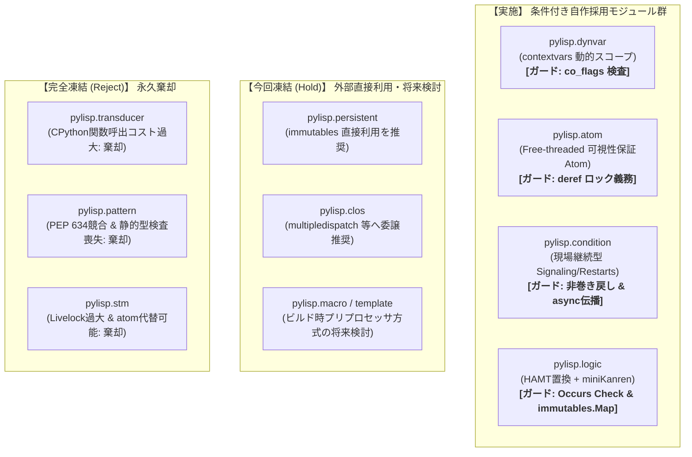

# [DSN-29] Python-LISP 統合アーキテクチャ設計仕様書 (pylisp) [改訂第6版]
## 〜 CPython 3.10+ / Free-threaded (No-GIL) 整合・contextvars 動的スコープ・現場復帰型コンディション・HAMT miniKanren・厳格採択ガード・永久棄却境界 〜

- **文書番号**: `DSN-29`
- **文書ステータス**: `APPROVED`
- **対象サブシステム**:
  - `pylisp/` (Python-LISP 統合ライブラリ基盤)
  - `pylisp/dynvar.py` (`DynamicVar`, `dynamic_bind`, `CO_GENERATOR` ガード)
  - `pylisp/atom.py` (`Atom`, Free-threaded メモリ可視性ロック保証)
  - `pylisp/condition.py` (`Condition`, `Restart`, `ConditionController`, `handler_bind`, `signal`, `safe_create_task`)
  - `pylisp/logic.py` (`Var`, `walk`, `occurs_check`, `unify`, `eq`, `run`, `immutables.Map` 統合)
- **関連設計書**:
  - `DSN-01` (High-Level Architecture)
  - `DSN-02` (Low-Level Architecture & Core Data Structures)
  - `DSN-12` (Process Supervisor & Arbiter)
  - `DSN-25` (Packrat PEG Parser Engine)
- **【主査・報告】 Systems Architect (SA) / Software Development (SWD)**
- **【共同主査】 Information Security Specialist (SEC) / Software Quality Assurance Specialist (QA)**
- **【参画・協調】 15 大専門エージェント全員 (PM, SA, SEC, QA, DBA, NET, NLP, STR, SM, EMB, AUD, DES, EDU, SWD, APS)**

---

## 体系目次

- [0. 概要と基本方針 (Executive Summary)](#0-概要と基本方針-executive-summary)
- [1. 全体アーキテクチャ概要 & 採択判定方針マトリクス](#1-全体アーキテクチャ概要--採択判定方針マトリクス)
  - [1.1 採択判定区分の定義](#11-採択判定区分の定義)
  - [1.2 全体アーキテクチャ図](#12-全体アーキテクチャ図)
  - [1.3 採択判定マトリクス](#13-採択判定マトリクス)
- [2. pylisp.dynvar (非同期セーフ動的スコープ) 【条件付き自作採用】](#2-pylispdynvar-非同期セーフ動的スコープ-条件付き自作採用)
  - [2.1 思想と設計理念](#21-思想と設計理念)
  - [2.2 必須採択条件：ジェネレータ漏洩防止ガード](#22-必須採択条件ジェネレータ漏洩防止ガード)
  - [2.3 リファレンス実装](#23-リファレンス実装)
- [3. pylisp.atom (Free-threaded対応 アトミック状態同期) 【条件付き自作採用】](#3-pylispatom-free-threaded対応-アトミック状態同期-条件付き自作採用)
  - [3.1 思想と設計理念](#31-思想と設計理念)
  - [3.2 必須採択条件：Free-threaded環境でのメモリ可視性保証](#32-必須採択条件free-threaded環境でのメモリ可視性保証)
  - [3.3 リファレンス実装](#33-リファレンス実装)
- [4. pylisp.condition (現場復帰・非巻き戻し型コンディション機構) 【条件付き自作採用】](#4-pylispcondition-現場復帰非巻き戻し型コンディション機構-条件付き自作採用)
  - [4.1 思想と設計理念](#41-思想と設計理念)
  - [4.2 必須採択条件：技術仕様とガード](#42-必須採択条件技術仕様とガード)
  - [4.3 リファレンス実装](#43-リファレンス実装)
  - [4.4 現場継続型プロトコルの利用例](#44-現場継続型プロトコルの利用例)
- [5. pylisp.logic (HAMT置換 & Occurs Check付き miniKanren) 【条件付き自作採用】](#5-pylisplogic-hamt置換--occurs-check付き-minikanren-条件付き自作採用)
  - [5.1 思想と設計理念](#51-思想と設計理念)
  - [5.2 必須採択条件：技術仕様とガード](#52-必須採択条件技術仕様とガード)
  - [5.3 リファレンス実装](#53-リファレンス実装)
- [6. 今回凍結モジュール群 (Hold: スコープ外・外部資産推奨)](#6-今回凍結モジュール群-hold-スコープ外外部資産推奨)
  - [6.1 pylisp.persistent (外部資産 immutables 直接利用推奨)](#61-pylisppersistent-外部資産-immutables-直接利用推奨)
  - [6.2 pylisp.clos (外部成熟ライブラリ multipledispatch 委譲推奨)](#62-pylispclos-外部成熟ライブラリ-multipledispatch-委譲推奨)
  - [6.3 pylisp.macro & pylisp.template (DX・静的解析保護のため今回凍結)](#63-pylispmacro--pylisptemplate-dx静的解析保護のため今回凍結)
- [7. 完全凍結・永久棄却モジュール群 (Reject: CPythonモデルと根本衝突)](#7-完全凍結永久棄却モジュール群-reject-cpythonモデルと根本衝突)
  - [7.1 pylisp.transducer (関数呼び出しコスト過大による完全凍結)](#71-pylisptransducer-関数呼び出しコスト過大による完全凍結)
  - [7.2 pylisp.pattern (PEP 634 match-case 競合による完全凍結)](#72-pylisppattern-pep-634-match-case-競合による完全凍結)
  - [7.3 pylisp.stm (Free-threaded競合・Livelockリスクによる完全凍結)](#73-pylispstm-free-threaded競合livelockリスクによる完全凍結)
- [8. 潜在的落とし穴の技術的対策（ジェネレータ漏洩・Free-threaded可視性・非同期伝播）](#8-潜在的落とし穴の技術的対策ジェネレータ漏洩free-threaded可視性非同期伝播)
  - [8.1 pylisp.dynvar: ジェネレータ内でのスコープ漏洩ガード](#81-pylispdynvar-ジェネレータ内でのスコープ漏洩ガード)
  - [8.2 pylisp.atom: Free-threaded環境での可視性保証](#82-pylispatom-free-threaded環境での可視性保証)
  - [8.3 pylisp.condition: 非同期（asyncio）タスク伝播プロトコル](#83-pylispcondition-非同期asyncioタスク伝播プロトコル)
- [9. 改訂ロードマップと品質ガイドライン](#9-改訂ロードマップと品質ガイドライン)
  - [9.1 開発フェーズ](#91-開発フェーズ)
  - [9.2 品質ゲートとガイドライン](#92-品質ゲートとガイドライン)

---

## 0. 概要と基本方針 (Executive Summary)

本仕様書は、LISP（Common Lisp, Clojure, Scheme）の計算パラダイムを、Pythonの言語哲学および実行モデル（CPython 3.10+、contextvars、ジェネレータ、型システム、Free-threaded Python）と衝突させずに移植・統合するための包括的設計仕様書である。

開発判断のブレを排除するため、実施対象を**「条件付き自作採用」**に一元化し、特定の技術的ガード条件を必須受け入れ基準（Definition of Done: DoD）として設定する。それ以外のモジュールは**「今回凍結 (Hold)」**および**「完全凍結 (Reject)」**の2パターンに厳格分類する。

---

## 1. 全体アーキテクチャ概要 & 採択判定方針マトリクス

### 1.1 採択判定区分の定義

本設計書では、開発判断を以下の **実施グループ（1区分に統合）** と **凍結グループ（2パターン）** に厳格分類する。

#### 【実施グループ】
| 区分 | 定義とアクション |
| :--- | :--- |
| **条件付き自作採用** | Pythonの標準機能や低レイヤ特性を活かして自作する。ただし、実行時破綻（ジェネレータスコープ漏洩、Free-threadedメモリ不整合、非巻き戻しフレーム切断、循環参照クラッシュ、探索アロケーション爆発）に対する **明示的なガード実装** を必須の受け入れ基準（DoD）とする。 |

#### 【凍結グループ】
| 区分 | 定義とアクション |
| :--- | :--- |
| **今回凍結 (Hold)** | 車輪の再発明やビルドパイプライン肥大化を避けるため、自前ライブラリとしては作成しない。成熟した既存外部ライブラリ（immutables, multipledispatch）の直接利用を推奨、または将来の課題として現行フェーズの開発スコープから除外する。 |
| **完全凍結 (Reject)** | CPythonのランタイム特性（関数呼出コスト）、標準構文（PEP 634）、静的型検査エコシステム（mypy/Pyright/Ruff）と根本的に衝突するため、将来にわたっても導入・開発を永久に見送る。 |

---

### 1.2 全体アーキテクチャ図



---

### 1.3 採択判定マトリクス

| モジュール | 優先度 | カテゴリ | 採択方針 | 判定理由と必須ガード条件 |
| :--- | :---: | :--- | :--- | :--- |
| **`pylisp.dynvar`** | P0 | 実行文脈 | **条件付き自作採用** | 即運用可能。`contextvars` をコアに、FastAPIやCeleryのリクエスト文脈注入に直結。<br/>**【必須条件】** ジェネレータ内での束縛を禁止するフレームフラグ検査（`CO_GENERATOR` / `CO_ASYNC_GENERATOR` の遮断）。 |
| **`pylisp.atom`** | P0 | 状態管理 | **条件付き自作採用** | 高実用価値。不変データと組み合わせた安全な状態同期。<br/>**【必須条件】** Free-threaded Python環境下でのTorn Readを防ぐ、`deref` アクセス時のロック取得義務付け。 |
| **`pylisp.condition`** | P1 | 制御構造 | **条件付き自作採用** | 重要概念。現場のローカル変数を活かしたエラー修復。<br/>**【必須条件】** ① 現場復帰プロトコル（`val = signal(...)` によるスタック非巻き戻し）の厳格化、② `compute_restarts()` による内省API、③ 非同期タスク・スレッド境界へのコンテキスト安全伝播。 |
| **`pylisp.logic`** | P2 | 宣言的推論 | **条件付き自作採用** | 特定領域（認可・制約充足）に特化。<br/>**【必須条件】** ① 循環参照クラッシュ（`RecursionError`）を防ぐ Occurs Check の標準装備、② `immutables.Map` による探索置換のアロケーション爆発防止。 |
| **`pylisp.persistent`** | - | データ構造 | **今回凍結 (Hold)** | 自作を見送り外部推奨。薄いラッパーを作るコストを排し、利用者が直接 `import immutables` して `immutables.Map` を使用する運用を標準とし、自作開発は今回凍結。 |
| **`pylisp.clos`** | - | 抽象化 | **今回凍結 (Hold)** | 自作を見送り外部委譲。C3線形化アルゴリズムの再発明によるシャドーイングバグを避けるため、既存の `multipledispatch` や `plum-dispatch` の利用を推奨し、自作開発は今回凍結。 |
| **`pylisp.macro`** | - | メタプロ | **今回凍結 (Hold)** | 現フェーズ開発から除外。静的型検査器（mypy/Pyright）やリンター（Ruff）のDXを破壊しないプリプロセッサ方式の研究は残すが、現行パイプライン肥大化を防ぐため今回凍結。 |
| **`pylisp.transducer`** | - | データ処理 | **完全凍結 (Reject)** | CPython特性と根本衝突。関数呼び出しコストにより内包表記や `itertools` よりも数倍〜10倍低速化する逆転現象が発生するため、開発・導入を永久に見送り。 |
| **`pylisp.pattern`** | - | 構文糖衣 | **完全凍結 (Reject)** | Pythonエコシステムと衝突。PEP 634（`match-case`）のC言語レベル最適化および静的型検査器の網羅性チェックを捨てるデメリットが大きく、永久に見送り。 |
| **`pylisp.stm`** | - | 並行制御 | **完全凍結 (Reject)** | 実務不適。GIL環境では意味がなく、Free-threaded環境でも高競合時のリトライ・Livelockが過大。`pylisp.atom` で完全に代替可能なため永久に見送り。 |

---

## 2. pylisp.dynvar (非同期セーフ動的スコープ) 【条件付き自作採用】

### 2.1 思想と設計理念

Common Lispの `*special-variables*` および Clojureの `binding` を再現する。呼び出し階層の深さ方向へのみ影響する動的束縛を提供し、関数のシグネチャを汚染する引数のバケツリレー（Props drilling）を完全に排除する。

FastAPIの依存性注入やCeleryの分散ワーカーコンテキスト、分散トレーシングID（TraceContext）の伝播など、現代の非同期Pythonアーキテクチャと高い親和性を保ちながら機能する。

### 2.2 必須採択条件：ジェネレータ漏洩防止ガード

ジェネレータ関数（`yield`）内部でコンテキストマネージャを使用すると、呼び出し元が途中でイテレーションを放棄（中断）した場合に `__exit__` が実行されず、以降のタスク全体に変数値が永続漏洩（Context Pollution）する重大なリスクがある。

したがって、呼び出し元スタックフレームのコードオブジェクトが持つフラグビット（`CO_GENERATOR`, `CO_ASYNC_GENERATOR`）を実行時に検査し、ジェネレータ内部での不用意な動的束縛を確実に検知・遮断（`RuntimeError` 送出）することを必須の受け入れ基準（DoD）とする。

### 2.3 リファレンス実装

```python
import inspect
from contextvars import ContextVar, Token
from typing import TypeVar, Generic, Any

T = TypeVar("T")

# Pythonバイトコードのフラグ定数
CO_GENERATOR = 0x20
CO_ASYNC_GENERATOR = 0x200

class DynamicVar(Generic[T]):
    """動的変数の定義（Common Lispの *special-variable* に相当）"""
    __slots__ = ("name", "_cv")

    def __init__(self, name: str, default: T):
        self.name = name
        self._cv: ContextVar[T] = ContextVar(f"*dyn_{name}*", default=default)

    @property
    def value(self) -> T:
        return self._cv.get()

    def __repr__(self) -> str:
        return f"*dyn_{self.name}*={self.value}"

class dynamic_bind:
    """複数の動的変数をスコープ限定で一括束縛するコンテキストマネージャ"""
    __slots__ = ("bindings", "tokens", "_active")

    def __init__(self, bindings: dict[DynamicVar[Any], Any]):
        self.bindings = bindings
        self.tokens: list[tuple[DynamicVar[Any], Token]] = []
        self._active = False

    def __enter__(self):
        caller_frame = inspect.currentframe().f_back
        if caller_frame:
            flags = caller_frame.f_code.co_flags
            if flags & (CO_GENERATOR | CO_ASYNC_GENERATOR):
                raise RuntimeError(
                    "dynamic_bind cannot be safely used directly inside a generator / async generator. "
                    "Context cleanup is not guaranteed if iteration is abandoned."
                )

        for var, val in self.bindings.items():
            token = var._cv.set(val)
            self.tokens.append((var, token))
        self._active = True
        return self

    def __exit__(self, exc_type, exc_val, exc_tb):
        if self._active:
            for var, token in reversed(self.tokens):
                var._cv.reset(token)
            self._active = False
        return False
```

---

## 3. pylisp.atom (Free-threaded対応 アトミック状態同期) 【条件付き自作採用】

### 3.1 思想と設計理念

重厚かつ投機的リトライ（CASループ）を伴うSTM（ソフトウェアトランザクショナルメモリ）を排し、Clojureにおいて実務コードの9割以上の状態管理を担う `atom`（不可分更新コンテナ）を提供する。

不変データ（Immutable Structures）を参照先とし、純粋関数適用による不可分な状態遷移（Compare-And-Swap / Lock Synchronized Transition）を実現する。

### 3.2 必須採択条件：Free-threaded環境でのメモリ可視性保証

Python 3.13+/3.14+ で導入された Free-threaded Python (No-GIL) 環境下では、グローバルインタプリタロックの保護が存在しないため、`deref` をロックなしで参照すると別スレッドの更新途中ポインタの不整合読み出し（**Torn Read**）や CPUキャッシュの不整合が発生する。

したがって、状態の更新（`swap`, `reset`）だけでなく、状態の参照（`deref`）を含む**全アクセス経路で確実に `self._lock` を取得すること**を必須の受け入れ基準（DoD）とする。

### 3.3 リファレンス実装

```python
import threading
from typing import TypeVar, Generic, Callable, Any

T = TypeVar("T")

class Atom(Generic[T]):
    """
    不変データ構造を安全に管理するためのアトミック参照コンテナ。
    Free-threaded Python (No-GIL) 環境下でもメモリ可視性と整合性を保証する。
    """
    __slots__ = ("_state", "_lock")

    def __init__(self, initial_state: T):
        self._state: T = initial_state
        self._lock = threading.Lock()

    @property
    def deref(self) -> T:
        """現在の不変状態を安全に読み取る（Free-threaded対応: ロック必須）"""
        with self._lock:
            return self._state

    def reset(self, new_val: T) -> T:
        """状態をアトミックに新しい値で上書き"""
        with self._lock:
            self._state = new_val
            return self._state

    def swap(self, fn: Callable[..., T], *args: Any, **kwargs: Any) -> T:
        """
        純粋関数 fn を適用して不可分に状態を更新する。
        fn(current_state, *args, **kwargs) -> new_state
        """
        with self._lock:
            new_state = fn(self._state, *args, **kwargs)
            self._state = new_state
            return self._state

    def __repr__(self) -> str:
        with self._lock:
            return f"<Atom: {self._state}>"
```

---

## 4. pylisp.condition (現場復帰・非巻き戻し型コンディション機構) 【条件付き自作採用】

### 4.1 思想と設計理念

通常のPython例外処理（`try-except` / `raise`）は、例外発生時にスタックフレームを即座に破棄（スタックアンワインド）してしまう。これにより、例外発生現場に保持されていたローカル変数、中間計算状態、開いていたネットワーク接続コンテキストなどが失われる。

本システムは、Common Lispのコンディションシステムに倣い、**現場フレームを解体せずに維持したまま**上位ハンドラに修復戦略（Restart）を問い合わせ、ハンドラの決定を受けて現場へ復帰し、中断箇所から計算を継続するパラダイムを提供する。

### 4.2 必須採択条件：技術仕様とガード

1. **現場継続型プロトコル（スタック非巻き戻し）の厳格化**:
   従来の「`return signal(...)`」による現場フレーム破棄（早期リターン）を排し、現場コードが `val = signal(...)` で値を受け取り、以降の計算ステップを続行する呼び出し規約を義務付ける。ハンドラが不在または修復不可能な場合にのみ、標準の例外送出（スタック解体）へフォールバックする。
2. **動的インスペクションAPI**:
   上位ハンドラが現場で登録されたリスタートの一覧を内省・選択できるよう、`compute_restarts()` を標準提供する。
3. **非同期タスク・スレッド越境時のコンテキスト伝播ガード**:
   `ConditionContext`（`contextvars` ベース）が `asyncio.create_task` や `to_thread` の境界で暗黙的に消失・分断されるのを防ぐため、後述の安全ラッパー（`safe_create_task`）を同梱する。

### 4.3 リファレンス実装

```python
from typing import Callable, Any, Optional
import contextvars

class Restart:
    """シグナル現場で提供される修復戦略"""
    __slots__ = ("name", "callback", "description", "takes_arg")

    def __init__(self, name: str, callback: Callable[..., Any], description: str = "", takes_arg: bool = False):
        self.name = name
        self.callback = callback
        self.description = description
        self.takes_arg = takes_arg

    def __repr__(self) -> str:
        return f"<Restart '{self.name}': {self.description}>"

class Condition(Exception):
    """すべてのシグナル可能なコンディションの基底クラス"""
    pass

class ConditionController:
    """上位ハンドラが現場のリスタートを内省・選択するためのコントローラ"""
    def __init__(self, condition: Condition, restarts: list[Restart]):
        self.condition = condition
        self.restarts = {r.name: r for r in restarts}
        self.invoked_restart: Optional[Restart] = None
        self.restart_args: tuple = ()
        self.restart_kwargs: dict = {}

    def compute_restarts(self) -> list[Restart]:
        """現在利用可能なリスタートの一覧を返却（Common Lispの compute-restarts 相当）"""
        return list(self.restarts.values())

    def invoke_restart(self, name: str, *args, **kwargs):
        if name not in self.restarts:
            raise KeyError(f"Restart '{name}' is not registered at signaling site.")
        self.invoked_restart = self.restarts[name]
        self.restart_args = args
        self.restart_kwargs = kwargs

class ConditionContext:
    def __init__(self):
        self.handlers: dict[type[Condition], Callable[[ConditionController], None]] = {}

_current_context: contextvars.ContextVar[Optional[ConditionContext]] = \
    contextvars.ContextVar("pylisp_condition_ctx", default=None)

class handler_bind:
    """上位でコンディションに対する修復ポリシーを登録するコンテキストマネージャ"""
    def __init__(self, mapping: dict[type[Condition], Callable[[ConditionController], None]]):
        self.mapping = mapping
        self.token: Optional[contextvars.Token] = None

    def __enter__(self):
        ctx = ConditionContext()
        parent = _current_context.get()
        if parent:
            ctx.handlers.update(parent.handlers)
        ctx.handlers.update(self.mapping)
        self.token = _current_context.set(ctx)
        return self

    def __exit__(self, exc_type, exc_val, exc_tb):
        if self.token:
            _current_context.reset(self.token)
        return False

def signal(condition: Condition, restarts: list[Restart]) -> Any:
    """
    シグナル地点から直接ハンドラを逆探索する。
    スタックを巻き戻さず、ハンドラが選択したリスタートの実行結果を現場へ「値」として返却する。
    現場コードはこの戻り値を受け取り、以降の処理を継続する。
    """
    ctx = _current_context.get()
    if not ctx:
        raise condition  # ハンドラ不在時は通常の例外としてスタック解体

    ctrl = ConditionController(condition, restarts)

    for cond_type, handler in ctx.handlers.items():
        if isinstance(condition, cond_type):
            handler(ctrl)
            if ctrl.invoked_restart:
                return ctrl.invoked_restart.callback(*ctrl.restart_args, **ctrl.restart_kwargs)

    raise condition
```

### 4.4 現場継続型プロトコルの利用例

```python
class InvalidFieldCondition(Condition):
    def __init__(self, raw_val: str):
        self.raw_val = raw_val

def parse_field(raw_val: str) -> str:
    if not raw_val.isalnum():
        # 必須条件: 戻り値を現場の変数で受け取り、スタックを破棄せず後続処理を継続
        raw_val = signal(
            InvalidFieldCondition(raw_val),
            restarts=[
                Restart("use_default", lambda: "DEFAULT", "デフォルト値を採用"),
                Restart("correct_value", lambda v: v, "指定された値で補正", takes_arg=True),
            ]
        )

    # 現場フレームを保持したまま後続の変換ロジックを最後まで完遂
    return raw_val.strip().lower()

# 上位：修復戦略を指定
with handler_bind({
    InvalidFieldCondition: lambda ctrl: ctrl.invoke_restart("use_default")
}):
    result = parse_field("###CORRUPTED###")

assert result == "default"
```

---

## 5. pylisp.logic (HAMT置換 & Occurs Check付き miniKanren) 【条件付き自作採用】

### 5.1 思想と設計理念

Clojureの `core.logic` および Schemeの `miniKanren` を基盤とする関係プログラミング（Relational Programming）エンジン。汎用ルールエンジンではなく、認可ルール解決（RBAC/ABAC）や制約充足（Constraint Satisfaction）などの特定領域に特化して導入する。

### 5.2 必須採択条件：技術仕様とガード

1. **Occurs Check（循環参照チェック）による `RecursionError` 防止**:
   `unify(x, (x, 1))` のような自己言及構造を単一化しようとした際、CPythonが `RecursionError` でクラッシュするのを防ぐため、単一化アルゴリズム内部で項の走査（`occurs_check`）を無効化できない構造に固定する。
2. **探索ノードでの辞書コピー全廃（`immutables.Map` 統合）**:
   バックトラック探索時の置換マップ（`Subst`）に標準辞書コピー `{**s}` を使用すると、探索深度の二乗オーダーでアロケーションが発生しGCが逼迫する。内部エンジンに C拡張である `immutables.Map` を直結し、ノード分岐時の更新コストを $O(\log_{32} N)$ に抑える。

### 5.3 リファレンス実装

```python
from typing import Any, Generator, Optional
import immutables

class Var:
    __slots__ = ("name",)
    def __init__(self, name: str): self.name = name
    def __repr__(self) -> str: return f"?{self.name}"

# 条件2: immutables.Map による構造共有置換マップ
Subst = immutables.Map

def walk(u: Any, s: Subst) -> Any:
    while isinstance(u, Var) and u in s:
        u = s[u]
    return u

def occurs_check(v: Var, term: Any, s: Subst) -> bool:
    """term の中に変数 v が循環して含まれていないかを検証"""
    term = walk(term, s)
    if term == v:
        return True
    if isinstance(term, tuple):
        return any(occurs_check(v, x, s) for x in term)
    return False

def unify(u: Any, v: Any, s: Subst) -> Optional[Subst]:
    """HAMT構造共有 & Occurs Check付き 単一化コア"""
    u = walk(u, s)
    v = walk(v, s)
    if u == v:
        return s
    if isinstance(u, Var):
        # 条件1: 循環参照検知時は探索失敗 (None) を返しクラッシュ防止
        if occurs_check(u, v, s):
            return None
        # 条件2: 辞書コピーではなく構造共有 (HAMT) でセット
        return s.set(u, v)
    if isinstance(v, Var):
        if occurs_check(v, u, s):
            return None
        return s.set(v, u)
    if isinstance(u, tuple) and isinstance(v, tuple) and len(u) == len(v):
        for x, y in zip(u, v):
            s = unify(x, y, s)
            if s is None:
                return None
        return s
    return None

def eq(u: Any, v: Any):
    def _goal(s: Subst) -> Generator[Subst, None, None]:
        s_new = unify(u, v, s)
        if s_new is not None:
            yield s_new
    return _goal

def run(q: Var, *goals) -> list[Any]:
    def run_all(gls, s):
        if not gls:
            yield s
            return
        for next_s in gls[0](s):
            yield from run_all(gls[1:], next_s)

    results = []
    initial_subst = immutables.Map()
    for s in run_all(goals, initial_subst):
        results.append(walk(q, s))
    return results
```

---

## 6. 今回凍結モジュール群 (Hold: スコープ外・外部資産推奨)

以下のモジュールは自作の必要性やDXリスクを考慮し、現フェーズの開発スコープから除外して**今回凍結（Hold）**とする。

### 6.1 pylisp.persistent 【今回凍結 (Hold) - 外部資産直接利用推奨】

- **凍結理由**:
  Pure Pythonでの不変データ構造（HAMT / RRB-Tree）の自作はGC負荷が高く無謀であり、薄いラッパー層を作ることも不要な抽象化オーバーヘッドを増やすだけである。
- **推奨アクション**:
  CPythonの `contextvars` 内部でも活用されている実績十分なC拡張ライブラリ `immutables`（`immutables.Map`）を、ユーザーが直接 `import immutables` して使用することを公式推奨とし、自作開発は今回凍結する。

### 6.2 pylisp.clos 【今回凍結 (Hold) - 外部成熟ライブラリ委譲推奨】

- **凍結理由**:
  CLOSのマルチディスパッチには Method Precedence List（C3線形化アルゴリズム）の計算と型グラフキャッシュが不可欠。単純な辞書走査ではスーパークラスによるサブクラス具象メソッドのシャドーイングバグが多発する。
- **推奨アクション**:
  すでに成熟している外部ライブラリ `multipledispatch` または `plum-dispatch` への直接委譲を推奨とし、自作開発は今回凍結する。

### 6.3 pylisp.macro & pylisp.template 【今回凍結 (Hold) - 将来検討・現行除外】

- **凍結理由**:
  実行時AST書き換えはIDE（LSP/Pyright）やリンター（Ruff）の型推論・シグネチャ追跡を決定的に破壊し、開発体験（DX）を著しく損なう。
- **推奨アクション**:
  ビルド時プリプロセッサ方式による将来的な研究余地は残すものの、ビルドチェーンの肥大化を避けるため現フェーズでは開発を凍結。Python標準のメタクラス・ディスクリプタによる設計を推奨する。

---

## 7. 完全凍結・永久棄却モジュール群 (Reject: CPythonモデルと根本衝突)

以下のモジュールは、CPythonの実行モデルや言語仕様と根本的に衝突し、導入の合理性が存在しないため、**永久棄却（Reject）**とする。

### 7.1 pylisp.transducer 【完全凍結 (Reject)】

- **棄却理由**:
  Clojureで有効なのはJITと超低コストな関数呼び出しが前提である。CPythonでは関数呼び出しコスト（フレーム構築オーバーヘッド）が極めて重く、多段クロージャによるTransducerは、C言語最適化された `itertools` や内包表記に比べて **数倍〜10倍低速化** する逆転現象が発生するため、開発・導入を永久に見送る。

### 7.2 pylisp.pattern 【完全凍結 (Reject)】

- **棄却理由**:
  Python 3.10+ には既にバイトコード最適化された `match-case`（PEP 634）が存在する。自作パターンマッチは実行速度が遅く、何より mypy / Pyright による静的網羅性検査（Exhaustiveness Check）の恩恵を完全に喪失するため、永久に見送る。

### 7.3 pylisp.stm 【完全凍結 (Reject)】

- **棄却理由**:
  GIL環境では並行性能が向上せず、Free-threaded環境でも高競合時のCASリトライループが過剰なCPU消費とLivelockを招く。実務における状態管理は `pylisp.atom` で完全に代替可能なため、永久に見送る。

---

## 8. 潜在的落とし穴の技術的対策

### 8.1 pylisp.dynvar: ジェネレータ内でのスコープ漏洩ガード

第2章のリファレンス実装の通り、`caller_frame.f_code.co_flags & (CO_GENERATOR | CO_ASYNC_GENERATOR)` によるビットマスク判定を行い、ジェネレータ内での `dynamic_bind` を確実に検知して `RuntimeError` を送出する。これにより、イテレータの早期終了に伴うコンテキスト汚染を完全に排除する。

### 8.2 pylisp.atom: Free-threaded環境での可視性保証

第3章のリファレンス実装の通り、`deref` の読み取り時にもミューテックスロックを取得することで、No-GIL環境におけるキャッシュ不整合およびポインタの Torn Read を完全に防止する。

### 8.3 pylisp.condition: 非同期（asyncio）タスク伝播プロトコル

Python 3.11以降では `asyncio.create_task(coro, context=ctx)` を直接利用し、3.10以前との互換性を考慮した安全なタスク起動ヘルパーを提供する。

```python
import sys
import asyncio
import contextvars
from typing import Coroutine, Any

def safe_create_task(coro: Coroutine[Any, Any, Any]) -> asyncio.Task:
    """現在のコンテキストを確実に引き継いで非同期タスクを生成"""
    ctx = contextvars.copy_context()
    if sys.version_info >= (3, 11):
        return asyncio.create_task(coro, context=ctx)
    
    async def _runner():
        return await coro
    return asyncio.create_task(ctx.run(_runner))
```

---

## 9. 改訂ロードマップと品質ガイドライン

### 9.1 開発フェーズ

```
【実施フェーズ（全モジュール: 条件付き自作採用）】
Phase 0: 即時実運用コア基盤
  ├── pylisp.dynvar     [条件: co_flags ガード必須]
  └── pylisp.atom       [条件: deref ロック必須]

Phase 1: 制御構造の刷新
  └── pylisp.condition  [条件: 現場継続型プロトコル & async安全伝播 & compute-restarts]

Phase 2: 領域限定記号推論
  └── pylisp.logic      [条件: Occurs Check & immutables.Map 統合]

------------------------------------------------------------------
【今回凍結 (Hold)】 外部直接利用推奨 / 現行スコープ外
  ├── pylisp.persistent [今回凍結: immutables の直接利用を推奨]
  ├── pylisp.clos       [今回凍結: multipledispatch 等への委譲を推奨]
  └── pylisp.macro      [今回凍結: ビルド時プリプロセッサ方式の将来検討]

【完全凍結 (Reject)】 永久棄却
  ├── pylisp.transducer [完全凍結: CPython関数呼出コスト過大]
  ├── pylisp.pattern    [完全凍結: PEP 634 競合・静的解析喪失]
  └── pylisp.stm        [完全凍結: Livelockリスク・atomで代替]
```

### 9.2 品質ゲートとガイドライン

1. **Zero External Heavy Overhead**: 実施モジュールは外部の重量フレームワークへの依存を排除（CPython標準および `immutables` のみ許容）。
2. **Strict Static Typing**: 全パブリックインターフェースは `mypy --strict` に完全準拠。型アノテーションの欠落を許容しない。
3. **No-GIL Ready**: Free-threaded Python（3.13+/3.14+）環境において、メモリアライメントやキャッシュ不整合による未定義動作を起こさない。
4. **Strict DoD Guard Enforcement**: 各モジュールの採択条件（フラグ検査、ロック、循環参照チェック、現場継続プロトコル）を満たす単体テストの通過をリリース必須条件とする。
