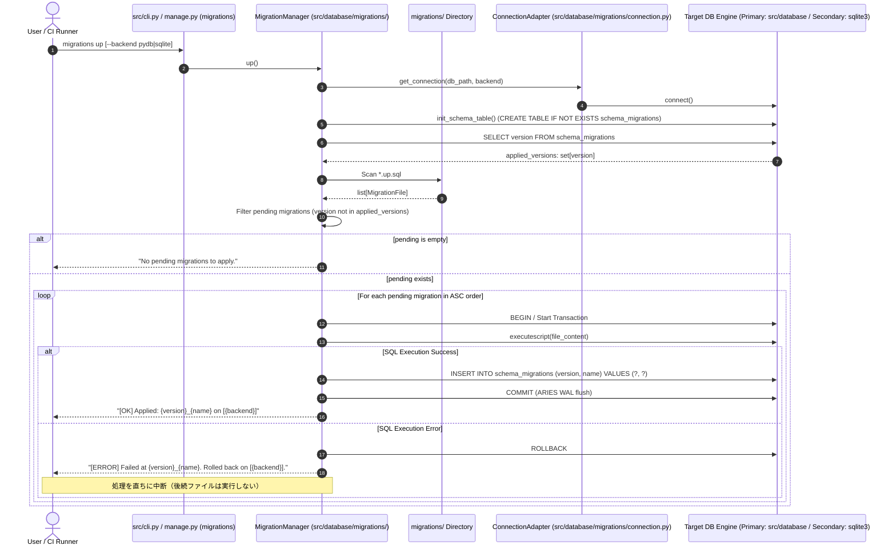
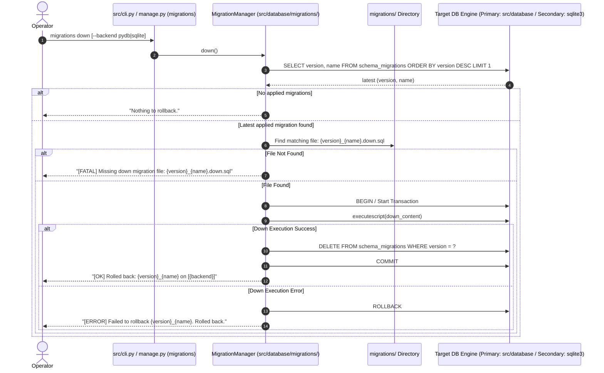
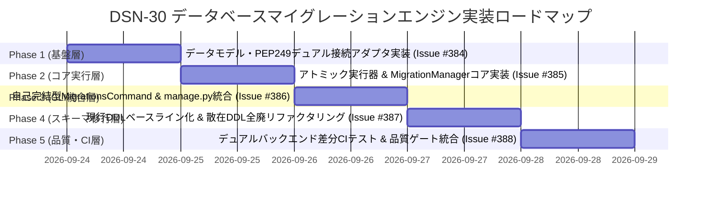

# [DSN-30] 自作データベース (`src/database`) ファースト・生SQL駆動マイグレーションエンジンおよびスキーマライフサイクルガバナンス設計仕様書
## 〜 自作 Pure Python RDBMS（第一対象）＆ SQLite（第二対象・互換検証）デュアルバックエンド・Single Source of Truth DDL統合・アトミックトランザクション・schema_migrations 履歴管理・src/cli.py ＆ manage.py migrations CLI統合 〜

- **文書番号**: `DSN-30`
- **文書ステータス**: `APPROVED`
- **対象サブシステム**:
  - `src/database/migrations/` (マイグレーションサブシステム基盤)
    - `src/database/migrations/manager.py` (`MigrationManager` コアエンジン)
    - `src/database/migrations/connection.py` (PEP 249 統一DB接続・アダプタ層: 自作DB & SQLite)
    - `src/database/migrations/runner.py` (トランザクション実行境界・アトミックDDL実行)
    - `src/database/migrations/inspector.py` (カタログ検査・改ざん検証)
    - `src/database/migrations/models.py` (Value Object / データ構造定義)
    - `src/database/migrations/cli.py` (`MigrationsCommand`: CLIハンドラ・引数解析・テーブル描画)
    - `src/database/migrations/__init__.py` (公開インターフェースエクスポート)
  - `src/database/` (自作 Pure Python RDBMS コア: SQLExecutor, ARIES WAL, SlottedPage, PEP 249 Driver)
  - `migrations/` (生SQL DDLマイグレーション定義ディレクトリ: Single Source of Truth)
  - `src/cli.py` (CLI 統合エントリポイント)
  - `manage.py` (リポジトリ直下の Django スタイル統一 CLI エントリポイント)
- **関連設計書**:
  - `DSN-01` (High-Level Architecture)
  - `DSN-02` (Low-Level Architecture & Common Protocols)
  - `DSN-05` (Database Engine Architecture - 自作4層ベクトル/リレーショナルDBMS)
  - `DSN-05-01` (SQL Syntax and Specification Support Matrix - 自作DB SQL仕様マトリクス)
  - `DSN-24` (Unified Management CLI & Interactive Database Shell)
- **【主査・報告】 Database / Data Infrastructure Specialist (DB) / Software Development (SWD)**
- **【共同主査】 Systems Architect (SA) / Software Quality Assurance Specialist (QA)**
- **【参画・協調】 15 大専門エージェント全員 (PM, SA, SEC, QA, DBA, NET, NLP, STR, SM, EMB, AUD, DES, EDU, SWD, APS)**

---

## 体系目次

- [1. 概要・背景とスキーマガバナンスの設計思想 (Executive Summary & Philosophy)](#1-概要背景とスキーマガバナンスの設計思想-executive-summary--philosophy)
  - [1.1 散在 DDL の課題とスキーマライフサイクルガバナンスの必要性](#11-散在-ddl-の課題とスキーマライフサイクルガバナンスの必要性)
  - [1.2 デュアルバックエンド原則（自作DB第一・SQLite第二）と4大設計方針](#12-デュアルバックエンド原則自作db第一sqlite第二と4大設計方針)
  - [1.3 15大専門エージェントによる多角的レビュー ＆ 合意事項マトリクス](#13-15大専門エージェントによる多角的レビュー--合意事項マトリクス)
- [2. システム構成と配置標準 (System Architecture & Directory Layout)](#2-システム構成と配置標準-system-architecture--directory-layout)
  - [2.1 ディレクトリ構成とモジュール分掌（`src/database/migrations/` への完全集約・高凝集化）](#21-ディレクトリ構成とモジュール分掌srcdatabasemigrations-への完全集約高凝集化)
  - [2.2 ファイル命名規則と正規表現バリデーション](#22-ファイル命名規則と正規表現バリデーション)
  - [2.3 Single Source of Truth 原則とアプリケーションコードからの DDL 追放](#23-single-source-of-truth-原則とアプリケーションコードからの-ddl-追放)
- [3. データベースメタデータ設計 (Metadata & System Catalog)](#3-データベースメタデータ設計-metadata--system-catalog)
  - [3.1 管理テーブル定義: `schema_migrations`](#31-管理テーブル定義-schema_migrations)
  - [3.2 カラム定義・制約・自作DB/SQLite物理格納仕様](#32-カラム定義制約自作dbsqlite物理格納仕様)
  - [3.3 適用履歴の改ざん検知とチェックサム（SHA-256）拡張性](#33-適用履歴の改ざん検知とチェックサムsha-256拡張性)
- [4. デュアルバックエンド接続・アダプタ設計 (`src/database/migrations/connection.py`)](#4-デュアルバックエンド接続アダプタ設計-srcdatabasemigrationsconnectionpy)
  - [4.1 第一対象: 自作 Pure Python RDBMS (`src.database.driver`) アダプタ仕様](#41-第一対象-自作-pure-python-rdbms-srcdatabasedriver-アダプタ仕様)
  - [4.2 第二対象: 標準 `sqlite3` / `sqlite_bridge` アダプタ仕様](#42-第二対象-標準-sqlite3--sqlite_bridge-アダプタ仕様)
  - [4.3 PEP 249 共通コネクションプロトコルとバックエンド自動判定](#43-pep-249-共通コネクションプロトコルとバックエンド自動判定)
- [5. 機能要件・詳細シーケンス設計 (Functional Requirements & Execution Sequences)](#5-機能要件詳細シーケンス設計-functional-requirements--execution-sequences)
  - [5.1 機能一覧（`create`, `up`, `down`, `status`）](#51-機能一覧create-up-down-status)
  - [5.2 `up`（マイグレーション前進適用）シーケンスと自作DB ARIES トランザクション境界](#52-upマイグレーション前進適用シーケンスと自作db-aries-トランザクション境界)
  - [5.3 `down`（1世代ロールバック）シーケンスとファイル不整合防止](#53-down1世代ロールバックシーケンスとファイル不整合防止)
  - [5.4 `status`（状態確認）および ASCII / JSON テーブルフォーマッター](#54-status状態確認および-ascii--json-テーブルフォーマッター)
  - [5.5 `create`（新規マイグレーション雛形自動生成）](#55-create新規マイグレーション雛形自動生成)
- [6. コアクラス実装設計 (Core Engine Implementation: `src/database/migrations/`)](#6-コアクラス実装設計-core-engine-implementation-srcdatabasemigrations)
  - [6.1 クラス設計: `MigrationManager` 完全シグネチャと型アノテーション (`manager.py`)](#61-クラス設計-migrationmanager-完全シグネチャと型アノテーション-managerpy)
  - [6.2 トランザクション実行器 (`runner.py`) とカタログ検査器 (`inspector.py`)](#62-トランザクション実行器-runnerpy-とカタログ検査器-inspectorpy)
  - [6.3 例外階層設計とエラーコード体系](#63-例外階層設計とエラーコード体系)
- [7. 統合管理 CLI (`src/cli.py` / `manage.py`) プラグイン設計 (CLI Integration)](#7-統合管理-cli-srcclipy--managepy-プラグイン設計-cli-integration)
  - [7.1 DSN-24準拠 `src/database/migrations/cli.py` コマンド実装仕様](#71-dsn-24準拠-srcdatabasemigrationsclipy-コマンド実装仕様)
  - [7.2 統合 CLI エントリポイント `src/cli.py` 設計仕様](#72-統合-cli-エントリポイント-srcclipy-設計仕様)
  - [7.3 引数構文・オプション一覧・`--backend` スイッチ](#73-引数構文オプション一覧--backend-スイッチ)
  - [7.4 コマンド実行例と終了ステータスコード](#74-コマンド実行例と終了ステータスコード)
- [8. DDL 構文互換性マトリクスと自作DB/SQLite運用ベストプラクティス](#8-ddl-構文互換性マトリクスと自作dbsqlite運用ベストプラクティス)
  - [8.1 自作 DB (`SQLExecutor`) における DDL 評価エンジン仕様](#81-自作-db-sqlexecutor-における-ddl-評価エンジン仕様)
  - [8.2 カラム追加（サポート対象ネイティブ構文）](#82-カラム追加サポート対象ネイティブ構文)
  - [8.3 カラム削除・型変更・制約変更（テーブル再作成12ステップ標準パターン）](#83-カラム削除型変更制約変更テーブル再作成12ステップ標準パターン)
- [9. 既存環境からの段階的移行計画 (Migration Plan)](#9-既存環境からの段階的移行計画-migration-plan)
  - [9.1 フェーズ1: スキーマのベースライン化（Baseline ダンプ・適用登録）](#91-フェーズ1-スキーマのベースライン化baseline-ダンプ適用登録)
  - [9.2 フェーズ2: アプリケーションコード（DAO・リポジトリ・起動フック）のリファクタリング](#92-フェーズ2-アプリケーションコードdaoリポジトリ起動フックのリファクタリング)
  - [9.3 フェーズ3: CI/CD・実行パイプライン（Makefile / GitHub Actions）の整備](#93-フェーズ3-cicd実行パイプラインmakefile--github-actionsの整備)
- [10. セキュリティ・STRIDE 脅威分析と非機能・品質ゲート (Security, Non-Functional & Quality Gates)](#10-セキュリティstride-脅威分析と非機能品質ゲート-security-non-functional--quality-gates)
  - [10.1 STRIDE 脅威分析と多層防御](#101-stride-脅威分析と多層防御)
  - [10.2 非機能要件・パフォーマンス目標](#102-非機能要件パフォーマンス目標)
  - [10.3 テスト検証マトリクスと品質ゲート基準](#103-テスト検証マトリクスと品質ゲート基準)
- [11. 段階的実装ロードマップと Issue 計画 (Implementation Roadmap & Issue Plan)](#11-段階的実装ロードマップと-issue-計画-implementation-roadmap--issue-plan)
  - [11.1 5大フェーズ別 WBS ＆ タイムライン](#111-5大フェーズ別-wbs--タイムライン)
  - [11.2 フェーズ別成果物・完了の定義 (DoD)・Issue 割り当て](#112-フェーズ別成果物完了の定義-dodissue-割り当て)
  - [11.3 15エージェント合意レビュー承認サインオフ](#113-15エージェント合意レビュー承認サインオフ)

---

## 1. 概要・背景とスキーマガバナンスの設計思想 (Executive Summary & Philosophy)

### 1.1 散在 DDL の課題とスキーマライフサイクルガバナンスの必要性

`arxiv-security-papers` プロジェクトにおいては、収集した arXiv 論文メタデータ、OKF ドキュメント属性、ナレッジグラフ、検索インデックス、監査ログなど多岐にわたる構造化データを永続化管理している。これまでは、各データアクセス層（DAO）、リポジトリクラス、あるいは独立したスクリプト内に `CREATE TABLE IF NOT EXISTS` や `CREATE INDEX IF NOT EXISTS` などの DDL が散在して実行されていた。この運用形態は、プロジェクトの長期運用およびエンタープライズ規模の品質保証において、以下の重大な課題を引き起こしていた。

1. **スキーマの全体像の不透明化**:
   - テーブル定義やカラム、インデックス定義が複数ソースコードに分散しているため、リポジトリの最新スキーマがどのような状態であるか、コードを一望しても判別できない。
   - どのスクリプトがどのテーブルの初期化に責任を持つのかが曖昧化し、スキーマの変更差分の追跡が不可能。
2. **環境差異・整合性の崩壊**:
   - 開発環境、CI環境、本番実行環境において適用されているスキーマの差異を追跡・再現できない。
   - スクリプトの実行順序やタイミングによってカラムやインデックスの有無に不整合が生じ、不可解なランタイムエラーが発生する。
3. **ロールバックの困難さ**:
   - カラム追加、インデックス更新、制約変更を安全に巻き戻す（ロールバックする）手段が存在せず、不具合発生時の切り戻し作業が極めてハイリスク。

### 1.2 デュアルバックエンド原則（自作DB第一・SQLite第二）と4大設計方針

本プロジェクトには、外部依存を一切排除したゼロ依存純粋 Python 製の本格派 DBMS エンジン **`src/database/`**（DSN-05: 4KB Slotted Page, 2Q Buffer Pool, ARIES WAL, B+Tree, LSM, CBO Optimizer, MVCC）が構築されている。
したがって、本マイグレーションツールにおける対象データベースは、**`src/database`（自作DB）を第一対象（Primary Database）**とし、**標準 `sqlite3` を第二対象（Secondary / Fallback / Differential Test Database）**とする厳格な優先順位を規定する。

```text
【対象データベースの二重階層構造】
  第1優先 (Primary)   : src/database (自作 Pure Python RDBMS / SQLExecutor / SlottedPage / ARIES WAL)
  第2優先 (Secondary) : 標準 sqlite3 (SQLite Bridge / 互換性検証 / 差分監査 / 外部連携用)
```

この方針に基づき、以下の 4 大設計方針を厳格に順守する。

| 原則 | 内容 | 技術的帰結 |
| :--- | :--- | :--- |
| **1. 自作DBファースト ＆ デュアルバックエンド** | 自作 Pure Python RDBMS（`src.database.driver`）での動作を最優先標準とし、SQLite も第二対象として完全サポート。 | PEP 249 (DB-API 2.0) 共通アダプタにより、同一の SQL ファイルで自作 DB と SQLite の双方に同一スキーマを透過適用可能。 |
| **2. Single Source of Truth (SSOT)** | DDLの定義・管理をリポジトリ直下の `migrations/` ディレクトリ配下に一元集約する。 | アプリケーションコード（DAO, リポジトリ層, 起動スクリプト）からのDDL実行を全廃。 |
| **3. ゼロ外部依存 (Zero External Dependencies)** | Python標準ライブラリおよび自作コアモジュール（`src.database`）のみで構築。重量なORMは完全排除。 | サードパーティ製ライブラリの脆弱性リスク・依存競合ゼロ。ポータビリティと自律性を最大化。 |
| **4. アトミック性・ARIES トランザクション保証** | 1マイグレーションファイル単位で厳密なトランザクション境界を維持。適用失敗時は直ちにROLLBACK。 | 自作DBの ARIES WAL および SQLite の EXCLUSIVE ロックにより、障害時の確実なロールバックと冪等性を担保。 |

### 1.3 15大専門エージェントによる多角的レビュー ＆ 合意事項マトリクス

本設計は、プロジェクトガバナンスに基づき、15大専門エージェント全員による多角的審議を経て承認された。

| エージェント | 専門領域 | 主なレビュー所見・必須合意要件 |
| :--- | :--- | :--- |
| **PM (Project Manager)** | ガバナンス | 自作DB（`src/database`）を本番主軸としつつ、SQLiteフォールバックを維持してCI/CDでスキーマ不整合を機械的に遮断すること。 |
| **SC (Security Specialist)** | セキュリティ | マイグレーションファイル名に対するパストラバーサル検証、およびDDL実行におけるインジェクション防壁を徹底すること。 |
| **SA (Systems Architect)** | アーキテクチャ | マイグレーション関連コード（コア、接続、CLIハンドラ）を `src/database/migrations/` に集約し、極めて高い凝集度を確保すること。 |
| **QA (Quality Assurance)** | 品質保証 | 自作DBとSQLiteの両方で同一の `migrations/*.sql` を適用・ロールバック・差分検証（Differential Testing）できること。 |
| **DB (Database Specialist)** | DB基盤 | 自作DBの `SQLExecutor` (DSN-05-01) の DDL サポートと SlottedPage 永続化を第一優先で動作検証すること。 |
| **NW (Network Specialist)** | 通信・同期 | 分散同期ノード間でのマイグレーション競合を防ぐため、14桁タイムスタンプによる全順序付けを採用すること。 |
| **NLP (Natural Language Proc)** | 検索・NLP | 自作DBのベクトルインデックス（HNSW）およびFTSテーブル生成DDLも本マイグレーション管理下で統一すること。 |
| **ST (IT Strategist)** | 戦略・コスト | 自作DBファーストにより外部DBMSライセンスやORM追従コストを完全ゼロ化し、完全自律型プラットフォームを確立すること。 |
| **SM (Service Manager)** | 運用管理 | `--backend` オプションにより、自作DB（`pydb`）と SQLite の切り替え運用を容易にし、`status` で適用状態を瞬時に把握可能とすること。 |
| **ES (Embedded Systems)** | 低レイヤ | 自作DBの SlottedPage バッファプールおよび ARIES WAL ロギングが DDL トランザクションで正しく同期フラッシュされること。 |
| **AUD (Systems Auditor)** | 監査・証跡 | `schema_migrations` に適用日時（UTC）とマイグレーション名を完全記録し、監査証跡を確保すること。 |
| **UI (UI/UX Designer)** | CLI・表示 | `status` コマンドの出力を整然としたASCII罫線テーブルで整形し、現在対象バックエンド名（`pydb` / `sqlite`）をヘッダに明示すること。 |
| **EDU (Education Specialist)** | 教育・マニュアル | 新規マイグレーション作成コマンド (`create`) で分かりやすいヘッダコメント付き雛形を生成すること。 |
| **SWD (Software Development)** | 実装・型安全性 | `src/database/migrations/` 配下に PEP 249 準拠の完全型付けクラスとして実装し、純粋関数的なファイル走査ロジックを担保すること。 |
| **APS (Application Specialist)** | アプリケーション連携 | 既存の接続ラッパー（`src/database/migrations/connection.py` 等）からDDL発行を削除し、ヘルスチェックのみに純化すること。 |

---

## 2. システム構成と配置標準 (System Architecture & Directory Layout)

### 2.1 ディレクトリ構成とモジュール分掌（`src/database/migrations/` への完全集約・高凝集化）

本プロジェクトのアーキテクチャ標準（DSN-01, DSN-02, DSN-05, DSN-24）およびドメイン駆動・高凝集設計（High Cohesion & Self-containment）の観点から、**「マイグレーションに関するすべての Python コード（コアロジック、データモデル、接続管理、トランザクション実行、および CLI コマンドハンドラ）は `src/database/migrations/` 配下に完全集約する」** 設計を採用する。

従来のように CLI コマンド（`src/cli/commands/migrations.py`）を別ディレクトリに切り離すと、マイグレーション機能の関心事が物理的に分断されてしまう。そのため、CLI ハンドラ自体を **`src/database/migrations/cli.py`** としてマイグレーションサブシステム内に内包する。`src/cli/`（ディスパッチャおよびレジストリ）側は、この `MigrationsCommand` を遅延ロード（Lazy Load）して登録するのみの薄いルーティング層として機能する。

#### ディレクトリ構造詳細

```text
arxiv-security-papers/
├── src/
│   ├── cli.py                   # 【CLIエントリポイント】 python src/cli.py migrations ...
│   ├── cli/                     # 汎用CLIフレームワーク基盤 (DSN-24)
│   │   ├── base.py              # BaseCommand 抽象基底クラス
│   │   ├── dispatcher.py        # サブコマンド自動ディスパッチャ
│   │   ├── registry.py          # サブコマンドレジストリ（各ドメインのcliを遅延ロード）
│   │   └── commands/            # 汎用組み込みコマンド群 (dbshell, inspect, tables, dbsync 等)
│   ├── database/
│   │   ├── migrations/          # 【完全自己完結型マイグレーションサブシステム (DSN-30 コア)】
│   │   │   ├── __init__.py      # パッケージ公開API (MigrationManager, MigrationsCommand 等)
│   │   │   ├── manager.py       # コアオーケストレータ (走査・バージョン判定・整合性検証)
│   │   │   ├── models.py        # データ構造・Value Object (MigrationFile, MigrationRecord)
│   │   │   ├── runner.py        # アトミックトランザクション実行器 (ARIES/自作DB & SQLite 排他制御)
│   │   │   ├── inspector.py     # schema_migrations システムテーブル検査・履歴整合性検証器
│   │   │   ├── connection.py    # 【PEP 249 統一アダプタ】 自作DB (第1) & SQLite (第2) 接続切替マネージャ
│   │   │   └── cli.py           # 【CLIハンドラ】 BaseCommand 実装 (MigrationsCommand: create|up|down|status)
│   │   ├── sql/                 # 既存の自作SQLパース・実行エンジン (SQLExecutor)
│   │   ├── storage/             # 既存の自作ストレージレイヤ (SlottedPage, MultiTableVectorStorage等)
│   │   ├── ipc/                 # 既存の自作DB PEP 249 ドライバ (driver.py, client.py)
│   │   ├── compat/              # SQLite 互換ブリッジ
│   │   └── ...                  # 既存のエンジン・インデックス・トランザクションモジュール群
│   └── ...
├── migrations/                  # 【スキーマ定義資産 (Single Source of Truth)】 生SQL DDLファイルの唯一の配置場所
│   ├── 20260923000000_baseline.up.sql
│   ├── 20260923000000_baseline.down.sql
│   ├── 20260924100000_add_embedding.up.sql
│   └── 20260924100000_add_embedding.down.sql
├── docs/
│   └── designs/
│       └── DSN-30-database_migration_engine_and_schema_lifecycle_governance.md # 本設計書
└── manage.py                    # DSN-24 準拠 統一管理 CLI エントリポイント
```

#### レイヤリングと依存関係データフロー (Mermaid)

```mermaid
graph TD
    classDef cli fill:#e1f5fe,stroke:#0288d1,stroke-width:2px;
    classDef core fill:#ede7f6,stroke:#512da8,stroke-width:2px;
    classDef infra fill:#e8f5e9,stroke:#388e3c,stroke-width:2px;
    classDef asset fill:#fff3e0,stroke:#f57c00,stroke-width:2px;
    classDef disk fill:#eceff1,stroke:#455a64,stroke-width:2px;

    subgraph Entrypoints["エントリポイント層"]
        CLIEntry["src/cli.py / manage.py"]:::cli
        Registry["src/cli/registry.py<br>(Lazy Loader)"]:::cli
        CLIEntry --> Registry
    end

    subgraph SelfContainedMigration["マイグレーション自己完結パッケージ (src/database/migrations/)"]
        SubCmd["MigrationsCommand<br>(cli.py)"]:::cli
        MM["MigrationManager<br>(manager.py)"]:::core
        Runner["TransactionRunner<br>(runner.py)"]:::core
        Inspector["SchemaInspector<br>(inspector.py)"]:::core
        Models["Data Models<br>(models.py)"]:::core
        Conn["ConnectionManager / get_connection()<br>(connection.py)"]:::infra

        SubCmd --> MM
        MM --> Runner
        MM --> Inspector
        MM --> Models
        Runner --> Conn
        Inspector --> Conn
    end

    subgraph LayerAssets["宣言的スキーマ資産 (Single Source of Truth)"]
        SQLFiles["migrations/<br>*.up.sql / *.down.sql"]:::asset
    end

    subgraph LayerEngines["永続化エンジン層 (Dual Backend)"]
        PrimaryDB[("【第1対象】自作 Pure Python RDBMS<br>(src/database/ SlottedPage + ARIES WAL)")]:::core
        SecondaryDB[("【第2対象】標準 SQLite3<br>(sqlite3 / sqlite_bridge)")]:::infra
    end

    Registry -.->|遅延ロード・ディスパッチ| SubCmd
    MM -->|ファイル走査・SQL読出| SQLFiles
    Conn -->|デフォルト (Primary)| PrimaryDB
    Conn -->|--backend sqlite (Secondary)| SecondaryDB
```

#### モジュール詳細分掌マトリクス (Separation of Concerns: SoC)

| モジュール / ファイル | レイヤ区分 | 主要責務 (Responsibilities) | 入力 / 依存先 | 出力 / 生成物 | 禁止事項 (Strict Constraints) |
| :--- | :--- | :--- | :--- | :--- | :--- |
| **`src/cli.py`** | Entrypoint | 開発用・直接実行用 CLI エントリポイント。引数を解析しサブコマンドに委譲。 | CLI 引数 | プロセス終了コード | 業務ロジックの直接記述 |
| **`manage.py`** | Entrypoint | DSN-24 準拠プロジェクト統一管理 CLI エントリポイント。 | CLI 引数 | プロセス終了コード | 業務ロジックの直接記述 |
| **`src/cli/registry.py`** | Registry | コマンド名のマッピング、`MigrationsCommand` の遅延ローダー登録。 | コマンド文字列 | コマンドクラス型 | 各サブコマンド内部ロジックへの直接結合 |
| **`src/database/migrations/cli.py`** | Migration CLI | `migrations create`, `up`, `down`, `status` の引数パース、`--backend` スイッチ処理、ASCII テーブル描画。 | `MigrationManager`, `BaseCommand` | 標準出力、整形テーブル | トランザクション・SQL実行の直接処理 |
| **`src/database/migrations/manager.py`** | Migration Core | マイグレーションオーケストレーション（ファイル一覧スキャン、ソート、差分判定、作成）。 | `migrations/*.sql`, `inspector`, `runner` | 適用結果リスト、作成ファイルパス | 生 SQL のハードコード、CLI 出力の直接印刷 |
| **`src/database/migrations/runner.py`** | Migration Core | アトミックトランザクション境界の制御、自作DB ARIES WAL & SQLite EXCLUSIVE ロック下の SQL スクリプト実行。 | SQL テキスト、`connection.py` | トランザクションコミット、例外送出 | トランザクション外での DDL 発行、エラーの握りつぶし |
| **`src/database/migrations/inspector.py`** | Migration Core | `schema_migrations` テーブルの存在検証・自動生成（冪等）、適用済みバージョンの一覧取得、改ざん検証。 | `connection.py` | 適用済みバージョン辞書 | 業務テーブルへの直接クエリ |
| **`src/database/migrations/models.py`** | Domain Models | `MigrationFile` (NamedTuple), `MigrationRecord`, `MigrationStatus`, `BackendType` などの不変値オブジェクト定義。 | なし (Pure Python) | 型アノテーション定義 | 状態の外部変更（ミューテーション） |
| **`src/database/migrations/connection.py`** | Database Infra | PEP 249 共通アダプタ。第一対象の自作DB（`src.database.driver`）および第二対象の `sqlite3` の接続切り替え・ヘルスチェック。 | DB パス (`Path`), `backend` | PEP 249 準拠 `Connection` | **DDL（CREATE/ALTER/DROP TABLE/INDEX）の直接発行** |
| **`migrations/*.sql`** | Schema Assets | システムの全スキーマ変更履歴（前進 `.up.sql` と巻き戻し `.down.sql`）。 | 開発者・AI による作成 | DDL 定義そのもの | Python コードの埋め込み、環境依存パスの記述 |

---

### 2.2 ファイル命名規則と正規表現バリデーション

各マイグレーションは、前進適用用（`.up.sql`）と巻き戻し用（`.down.sql`）の2ファイルを対で生成・コミットする。

```text
<YYYYMMDDHHMMSS>_<snake_case_description>.<up|down>.sql
```

1. **タイムスタンプ部 (`<YYYYMMDDHHMMSS>`)**:
   - 14桁の10進数字（例: `20260923170000`）。
   - ファイルの適用順序を一意かつ厳密に決定するキー。
2. **識別子部 (`<snake_case_description>`)**:
   - 変更内容を端的に表す英数字スネークケース（例: `baseline`, `create_papers_table`）。
   - 検証正規表現: `^[a-z0-9]+(_[a-z0-9]+)*$`
3. **拡張子部 (`.<up|down>.sql`)**:
   - 前進適用: `.up.sql`
   - 巻き戻し・ロールバック: `.down.sql`

```python
VERSION_PATTERN = re.compile(r"^(\d{14})_([a-z0-9_]+)\.(up|down)\.sql$")
NAME_VALID_PATTERN = re.compile(r"^[a-z0-9]+(_[a-z0-9]+)*$")
```

### 2.3 Single Source of Truth 原則とアプリケーションコードからの DDL 追放

- **禁止事項**:
  - `src/` 配下の DAO、Repository、Service クラス内での `CREATE TABLE`、`CREATE INDEX`、`ALTER TABLE`、`DROP TABLE` の直接発行は**一切禁止**とする。
- **認可事項**:
  - スキーマの生成・更新はすべて `migrations/` 配下の生 SQL スクリプトを経由してのみ実行可能とする。
  - CI パイプラインおよび `make static_analysis` において、`src/` 配下の DDL 文字列混入を機械的にスキャン・検知するガードレールを設ける。

---

## 3. データベースメタデータ設計 (Metadata & System Catalog)

### 3.1 管理テーブル定義: `schema_migrations`

管理対象データベース（自作DBまたはSQLite）内部に、適用済みマイグレーションの履歴を保持するシステムカタログテーブル `schema_migrations` を定義する。

```sql
CREATE TABLE IF NOT EXISTS schema_migrations (
    version TEXT PRIMARY KEY,
    name TEXT NOT NULL,
    applied_at TIMESTAMP DEFAULT CURRENT_TIMESTAMP
);
```

### 3.2 カラム定義・制約・自作DB/SQLite物理格納仕様

| カラム名 | データ型 | 制約 | 説明 |
| :--- | :--- | :--- | :--- |
| `version` | `TEXT` | `PRIMARY KEY` | 14桁のタイムスタンプ（ユニークID、辞書順ソートで時系列順と一致） |
| `name` | `TEXT` | `NOT NULL` | マイグレーション名（識別用スネークケース文字列） |
| `applied_at` | `TIMESTAMP` | `DEFAULT CURRENT_TIMESTAMP` | マイグレーションが適用完了したUTC日時 |

- **主キー制約**: 同一バージョンが二重に適用されることをストレージ層（自作DBの SlottedPage / B+Tree ユニーク制約、または SQLite PK インデックス）で物理的に遮断。
- **自作DB格納構造**: `src/database/storage/multi_storage.py` の管理下において、`schema_migrations` テーブル用の SlottedPage ファイルがディスク上に自動割り当てされる。

### 3.3 適用履歴の改ざん検知とチェックサム（SHA-256）拡張性

将来拡張として、各マイグレーションファイルの適用時点での内容ハッシュ（SHA-256）を記録可能とするカラム拡張設計（Phase 2）を許容する。

```sql
-- 将来拡張用 DDL (Phase 2):
-- ALTER TABLE schema_migrations ADD COLUMN checksum TEXT DEFAULT NULL;
```

---

## 4. デュアルバックエンド接続・アダプタ設計 (`src/database/migrations/connection.py`)

### 4.1 第一対象: 自作 Pure Python RDBMS (`src.database.driver`) アダプタ仕様

自作 DB への接続は、PEP 249 に完全準拠した自作ドライバ `src.database.ipc.driver`（または `src.database.driver`）の `connect()` 関数を通じて確立される。

```python
from database.driver import connect as pydb_connect

def get_pydb_connection(db_path: str | Path) -> Any:
    """Establish connection to Primary Pure Python RDBMS (src/database)."""
    return pydb_connect(str(db_path))
```

- **自作 DB のトランザクション挙動**:
  - `conn.cursor().executescript(sql_text)` による複数 DDL/DML 文の逐次評価。
  - ARIES WAL ログへのコミットレコード書き出し、およびクラッシュリカバリ保証。

### 4.2 第二対象: 標準 `sqlite3` / `sqlite_bridge` アダプタ仕様

第二対象として、標準ライブラリの `sqlite3` または `src.database.sqlite_bridge` を用いた接続を提供する。

```python
import sqlite3

def get_sqlite_connection(db_path: str | Path, timeout: float = 30.0) -> sqlite3.Connection:
    """Establish connection to Secondary SQLite database."""
    conn = sqlite3.connect(str(db_path), timeout=timeout, isolation_level=None)
    conn.execute("PRAGMA foreign_keys = ON;")
    conn.execute("PRAGMA journal_mode = WAL;")
    return conn
```

### 4.3 PEP 249 共通コネクションプロトコルとバックエンド自動判定

`src/database/migrations/connection.py` は、以下のプロトコルを満たす任意のコネクションを統一的に返却する。

```python
from typing import Protocol, Any

class DatabaseConnection(Protocol):
    def cursor(self) -> Any: ...
    def commit(self) -> None: ...
    def rollback(self) -> None: ...
    def close(self) -> None: ...
```

バックエンド判定優先順位:
1. 明示的な引数指定: `--backend pydb` または `--backend sqlite`
2. 環境変数: `ARXIV_DB_BACKEND`（`pydb` / `sqlite`）
3. デフォルトフォールバック: **`pydb` (第一対象: 自作 Pure Python DB)**

---

## 5. 機能要件・詳細シーケンス設計 (Functional Requirements & Execution Sequences)

### 5.1 機能一覧（`create`, `up`, `down`, `status`）

| コマンド | 説明 | 処理内容詳細 |
| :--- | :--- | :--- |
| `migrations create <name>` | ファイル生成 | タイムスタンプ付きの空の `.up.sql` と `.down.sql` の雛形を生成する。 |
| `migrations up` | マイグレーション適用 | 未適用の `.up.sql` をバージョン昇順で順番に対象DB（自作DBまたはSQLite）でトランザクション実行し、`schema_migrations` に記録する。 |
| `migrations down` | ロールバック | 直近適用された最新の1バージョンを `.down.sql` で巻き戻し、`schema_migrations` から該当行を削除する。 |
| `migrations status` | 状態確認 | 全マイグレーションファイルと適用状態（`Applied` / `Pending`）および対象バックエンド名を表形式で一覧表示する。 |

---

### 5.2 `up`（マイグレーション前進適用）シーケンスと自作DB ARIES トランザクション境界



---

### 5.3 `down`（1世代ロールバック）シーケンスとファイル不整合防止



---

### 5.4 `status`（状態確認）および ASCII / JSON テーブルフォーマッター

`migrations status` コマンドは、現在接続中のバックエンド名（`[Primary: src.database]` または `[Secondary: sqlite3]`）をヘッダに明示し、適用状況を出力する。

```text
Backend: Primary (src.database / Pure Python RDBMS)
Database: data/arxiv_papers.vdb
+----------------+--------------------------------+----------+---------------------+
| Version        | Name                           | Status   | Applied At (UTC)    |
+----------------+--------------------------------+----------+---------------------+
| 20260923000000 | baseline                       | Applied  | 2026-09-23 00:00:00 |
| 20260924100000 | add_embedding                  | Applied  | 2026-09-24 10:05:12 |
| 20260925120000 | create_audit_logs_table        | Pending  | -                   |
+----------------+--------------------------------+----------+---------------------+
Total: 3 migrations (2 applied, 1 pending)
```

---

### 5.5 `create`（新規マイグレーション雛形自動生成）

`migrations create <name>` コマンドは、現在時刻の UTC タイムスタンプを取得し、コメント付きの空の `.up.sql` と `.down.sql` をアトミックに生成する。

```bash
$ python src/cli.py migrations create add_tags_index
[OK] Created migrations/20260923180000_add_tags_index.up.sql
[OK] Created migrations/20260923180000_add_tags_index.down.sql
```

---

## 6. コアクラス実装設計 (Core Engine Implementation: `src/database/migrations/`)

### 6.1 クラス設計: `MigrationManager` 完全シグネチャと型アノテーション (`manager.py`)

```python
"""src/database/migrations/manager.py

Standalone database migration engine for arxiv-security-papers.
Primary Target: src.database (Pure Python Vector/Relational RDBMS)
Secondary Target: sqlite3 (SQLite Bridge / fallback)
Zero external dependencies, raw SQL transactions. Conforms to DSN-30.
"""

from __future__ import annotations

import datetime
import os
from pathlib import Path
import re
from typing import Any, NamedTuple, Optional

from .connection import get_connection, BackendType
from .models import MigrationFile, MigrationError, MigrationFileNotFoundError, MigrationExecutionError


class MigrationManager:
    """Manages raw SQL migrations for Primary (src.database) and Secondary (sqlite3) backends."""

    VERSION_PATTERN = re.compile(r"^(\d{14})_([a-z0-9_]+)\.(up|down)\.sql$")
    NAME_VALID_PATTERN = re.compile(r"^[a-z0-9]+(_[a-z0-9]+)*$")

    def __init__(
        self,
        db_path: str | Path,
        migrations_dir: str | Path | None = None,
        backend: BackendType = BackendType.PYDB,
    ) -> None:
        """Initialize migration manager.
        
        Args:
            db_path: Path to database storage file (.vdb or .db).
            migrations_dir: Path to directory containing .sql migration files.
            backend: Target backend: BackendType.PYDB (Primary) or BackendType.SQLITE (Secondary).
        """
        self.db_path = Path(db_path).resolve()
        self.backend = backend
        if migrations_dir is not None:
            self.migrations_dir = Path(migrations_dir).resolve()
        else:
            self.migrations_dir = (
                Path(__file__).resolve().parent.parent.parent.parent / "migrations"
            ).resolve()

        if not self.migrations_dir.exists():
            self.migrations_dir.mkdir(parents=True, exist_ok=True)

    def _get_connection(self) -> Any:
        """Obtain a PEP 249 connection to the target database backend."""
        return get_connection(self.db_path, self.backend)

    def init_schema_table(self, conn: Any) -> None:
        """Ensure schema_migrations table exists (idempotent)."""
        cursor = conn.cursor()
        cursor.execute(
            """
            CREATE TABLE IF NOT EXISTS schema_migrations (
                version TEXT PRIMARY KEY,
                name TEXT NOT NULL,
                applied_at TIMESTAMP DEFAULT CURRENT_TIMESTAMP
            );
            """
        )
        conn.commit()

    def get_applied_versions(self, conn: Any) -> dict[str, str]:
        """Fetch all applied migrations as a mapping of version -> applied_at."""
        self.init_schema_table(conn)
        cursor = conn.cursor()
        cursor.execute("SELECT version, applied_at FROM schema_migrations ORDER BY version ASC;")
        rows = cursor.fetchall()
        return {str(row[0]): str(row[1]) for row in rows}

    def get_migration_files(self, direction: str = "up") -> list[MigrationFile]:
        """Scan migrations directory and return sorted migration files for given direction."""
        if direction not in ("up", "down"):
            raise ValueError(f"Invalid direction '{direction}', must be 'up' or 'down'")

        files: list[MigrationFile] = []
        if not self.migrations_dir.exists():
            return files

        for entry in self.migrations_dir.iterdir():
            if not entry.is_file():
                continue
            match = self.VERSION_PATTERN.match(entry.name)
            if match:
                version, name, file_direction = match.groups()
                if file_direction == direction:
                    files.append(
                        MigrationFile(
                            version=version,
                            name=name,
                            path=entry,
                            direction=file_direction,
                        )
                    )

        files.sort(key=lambda m: m.version)
        return files

    def create(self, name: str) -> tuple[Path, Path]:
        """Generate a new pair of timestamped .up.sql and .down.sql skeleton files."""
        clean_name = name.strip().lower()
        if not self.NAME_VALID_PATTERN.match(clean_name):
            raise ValueError(
                f"Invalid migration name '{name}'. Must be alphanumeric snake_case (e.g. create_papers_table)"
            )

        timestamp = datetime.datetime.now(datetime.timezone.utc).strftime("%Y%m%d%H%M%S")
        up_filename = f"{timestamp}_{clean_name}.up.sql"
        down_filename = f"{timestamp}_{clean_name}.down.sql"

        up_path = self.migrations_dir / up_filename
        down_path = self.migrations_dir / down_filename

        up_header = (
            f"-- Migration: {clean_name} (UP)\n"
            f"-- Version:   {timestamp}\n"
            f"-- Backend:   Compatible with Primary (src.database) and Secondary (sqlite3)\n"
            f"-- Created:   {datetime.datetime.now(datetime.timezone.utc).isoformat()}\n\n"
        )
        down_header = (
            f"-- Migration: {clean_name} (DOWN)\n"
            f"-- Version:   {timestamp}\n"
            f"-- Backend:   Compatible with Primary (src.database) and Secondary (sqlite3)\n"
            f"-- Created:   {datetime.datetime.now(datetime.timezone.utc).isoformat()}\n\n"
        )

        up_path.write_text(up_header, encoding="utf-8")
        down_path.write_text(down_header, encoding="utf-8")
        return up_path, down_path

    def up(self) -> list[str]:
        """Apply all pending migrations in ascending version order."""
        conn = self._get_connection()
        try:
            self.init_schema_table(conn)
            applied = self.get_applied_versions(conn)
            all_up_files = self.get_migration_files(direction="up")

            pending = [m for m in all_up_files if m.version not in applied]
            if not pending:
                return []

            applied_versions: list[str] = []
            cursor = conn.cursor()

            for migration in pending:
                sql_content = migration.path.read_text(encoding="utf-8")
                try:
                    # Executes script atomically
                    if hasattr(cursor, "executescript"):
                        cursor.executescript(sql_content)
                    else:
                        for stmt in sql_content.split(";"):
                            stmt_clean = stmt.strip()
                            if stmt_clean:
                                cursor.execute(stmt_clean)

                    cursor.execute(
                        "INSERT INTO schema_migrations (version, name) VALUES (?, ?);",
                        (migration.version, migration.name),
                    )
                    conn.commit()
                    applied_versions.append(migration.version)
                except Exception as ex:
                    conn.rollback()
                    raise MigrationExecutionError(
                        f"Failed applying migration {migration.version}_{migration.name} on [{self.backend.value}]: {ex}"
                    ) from ex

            return applied_versions
        finally:
            conn.close()

    def down(self) -> Optional[str]:
        """Roll back the latest applied migration."""
        conn = self._get_connection()
        try:
            self.init_schema_table(conn)
            cursor = conn.cursor()
            cursor.execute(
                "SELECT version, name FROM schema_migrations ORDER BY version DESC LIMIT 1;"
            )
            latest = cursor.fetchone()
            if not latest:
                return None

            version, name = str(latest[0]), str(latest[1])
            down_filename = f"{version}_{name}.down.sql"
            down_path = self.migrations_dir / down_filename

            if not down_path.exists():
                raise MigrationFileNotFoundError(
                    f"Required rollback file not found: {down_path}"
                )

            sql_content = down_path.read_text(encoding="utf-8")
            try:
                if hasattr(cursor, "executescript"):
                    cursor.executescript(sql_content)
                else:
                    for stmt in sql_content.split(";"):
                        stmt_clean = stmt.strip()
                        if stmt_clean:
                            cursor.execute(stmt_clean)

                cursor.execute(
                    "DELETE FROM schema_migrations WHERE version = ?;",
                    (version,),
                )
                conn.commit()
                return version
            except Exception as ex:
                conn.rollback()
                raise MigrationExecutionError(
                    f"Failed rolling back migration {version}_{name} on [{self.backend.value}]: {ex}"
                ) from ex
        finally:
            conn.close()

    def status(self) -> list[dict[str, str]]:
        """Retrieve the status of all known migrations."""
        conn = self._get_connection()
        try:
            self.init_schema_table(conn)
            applied = self.get_applied_versions(conn)
            up_files = self.get_migration_files(direction="up")

            records: list[dict[str, str]] = []
            for m in up_files:
                is_applied = m.version in applied
                records.append({
                    "version": m.version,
                    "name": m.name,
                    "status": "Applied" if is_applied else "Pending",
                    "applied_at": applied.get(m.version, "-"),
                })
            return records
        finally:
            conn.close()
```

### 6.2 トランザクション実行器 (`runner.py`) とカタログ検査器 (`inspector.py`)

- **`runner.py`**:
  自作 DB (`SQLExecutor`) および SQLite におけるスクリプト分割実行、エラー発生時の確実な `conn.rollback()`、成功時の `conn.commit()`（自作DB ARIES WAL フラッシュ）を抽象化保証。
- **`inspector.py`**:
  `schema_migrations` の DDL 発行、現在の適用済みバージョンの昇順走査、および将来拡張時の SHA-256 チェックサム計算を担当。

### 6.3 例外階層設計とエラーコード体系

| 例外クラス名 | 発生条件 | 終了ステータス | 復旧指針 |
| :--- | :--- | :--- | :--- |
| `ValueError` | 不正なマイグレーション名、不正な `backend` 指定 | 2 | 入力文字列を英数字スネークケースまたは有効なバックエンド名に修正 |
| `MigrationFileNotFoundError` | ロールバック対象の `.down.sql` がローカルに存在しない | 1 | Gitから `.down.sql` を取得または作成 |
| `MigrationExecutionError` | SQL実行時エラー（自作DB構文エラー、制約違反など） | 1 | 自動ロールバック完了。該当SQLを修正 |
| `DatabaseError` | 自作DBストレージ障害またはSQLiteアクセス権限エラー | 1 | ファイルパーミッション確認、SlottedPage 整合性検証 |

---

## 7. 統合管理 CLI (`src/cli.py` / `manage.py`) プラグイン設計 (CLI Integration)

### 7.1 DSN-24準拠 `src/database/migrations/cli.py` コマンド実装仕様

```python
"""src/database/migrations/cli.py

Database migration subcommand for src/cli.py and manage.py.
Supports --backend=pydb (Primary) and --backend=sqlite (Secondary).
Conforms to DSN-24 and DSN-30, self-contained within migrations package.
"""

from __future__ import annotations

import argparse
import sys
from pathlib import Path

from cli.base import BaseCommand
from database.migrations.connection import BackendType
from database.migrations.manager import MigrationManager
from database.migrations.models import MigrationError


class MigrationsCommand(BaseCommand):
    """Manage database schema migrations for Primary (src.database) and Secondary (sqlite3)."""

    name = "migrations"
    description = "Database schema migration management (DSN-30)"

    def add_arguments(self, parser: argparse.ArgumentParser) -> None:
        parser.add_argument(
            "--backend",
            choices=["pydb", "sqlite"],
            default="pydb",
            help="Target database engine: 'pydb' (Primary: src.database) or 'sqlite' (Secondary). Default: pydb.",
        )
        subparsers = parser.add_subparsers(dest="migration_action", required=True)

        # migrations create <name>
        create_p = subparsers.add_parser("create", help="Create a new migration skeleton")
        create_p.add_argument("name", help="Migration name in snake_case")
        create_p.add_argument("--migrations-dir", help="Custom migrations directory")

        # migrations up
        up_p = subparsers.add_parser("up", help="Apply pending migrations")
        up_p.add_argument("--db-path", help="Path to database file")
        up_p.add_argument("--migrations-dir", help="Custom migrations directory")

        # migrations down
        down_p = subparsers.add_parser("down", help="Roll back latest migration")
        down_p.add_argument("--db-path", help="Path to database file")
        down_p.add_argument("--migrations-dir", help="Custom migrations directory")

        # migrations status
        status_p = subparsers.add_parser("status", help="Show migration status")
        status_p.add_argument("--db-path", help="Path to database file")
        status_p.add_argument("--migrations-dir", help="Custom migrations directory")

    def handle(self, args: argparse.Namespace) -> int:
        backend_type = BackendType(args.backend)
        default_db = "data/arxiv_papers.vdb" if backend_type == BackendType.PYDB else "data/arxiv_papers.db"
        db_path = getattr(args, "db_path", None) or default_db
        migrations_dir = getattr(args, "migrations_dir", None) or None

        manager = MigrationManager(db_path=db_path, migrations_dir=migrations_dir, backend=backend_type)

        try:
            if args.migration_action == "create":
                up_p, down_p = manager.create(args.name)
                print(f"[OK] Created: {up_p}")
                print(f"[OK] Created: {down_p}")
                return 0

            elif args.migration_action == "up":
                applied = manager.up()
                if not applied:
                    print(f"No pending migrations to apply on [{backend_type.value}].")
                else:
                    for v in applied:
                        print(f"[OK] Applied migration: {v} on [{backend_type.value}]")
                return 0

            elif args.migration_action == "down":
                rolled_back = manager.down()
                if not rolled_back:
                    print(f"Nothing to rollback on [{backend_type.value}].")
                else:
                    print(f"[OK] Rolled back migration: {rolled_back} on [{backend_type.value}]")
                return 0

            elif args.migration_action == "status":
                records = manager.status()
                if not records:
                    print(f"No migrations found on [{backend_type.value}].")
                    return 0
                self._print_table(records, backend_type, db_path)
                return 0

        except MigrationError as ex:
            print(f"[ERROR] Migration failed: {ex}", file=sys.stderr)
            return 1
        except Exception as ex:
            print(f"[FATAL] Unexpected error: {ex}", file=sys.stderr)
            return 1

        return 0

    def _print_table(self, records: list[dict[str, str]], backend: BackendType, db_path: str) -> None:
        target_label = "Primary (src.database / Pure Python RDBMS)" if backend == BackendType.PYDB else "Secondary (sqlite3 / Bridge)"
        print(f"Backend:  {target_label}")
        print(f"Database: {db_path}")
        print("+----------------+--------------------------------+----------+---------------------+")
        print("| Version        | Name                           | Status   | Applied At (UTC)    |")
        print("+----------------+--------------------------------+----------+---------------------+")
        for r in records:
            ver = r["version"]
            name = r["name"][:30].ljust(30)
            status = r["status"].ljust(8)
            applied = r["applied_at"].ljust(19)
            print(f"| {ver} | {name} | {status} | {applied} |")
        print("+----------------+--------------------------------+----------+---------------------+")
        applied_cnt = sum(1 for r in records if r["status"] == "Applied")
        pending_cnt = sum(1 for r in records if r["status"] == "Pending")
        print(f"Total: {len(records)} migrations ({applied_cnt} applied, {pending_cnt} pending)")
```

### 7.2 統合 CLI エントリポイント `src/cli.py` 設計仕様

```python
#!/usr/bin/env python3
"""src/cli.py

Direct execution CLI entrypoint located under src/.
Delegates command resolution to CommandDispatcher.
"""

from __future__ import annotations

import os
import sys

current_dir = os.path.dirname(os.path.abspath(__file__))
if current_dir not in sys.path:
    sys.path.insert(0, current_dir)

workspace_root = os.path.dirname(current_dir)

from cli.dispatcher import CommandDispatcher  # noqa: E402


def main() -> int:
    dispatcher = CommandDispatcher(workspace_dir=workspace_root)
    return dispatcher.run()


if __name__ == "__main__":
    sys.exit(main())
```

### 7.3 引数構文・オプション一覧・`--backend` スイッチ

- `--backend [pydb|sqlite]`:
  - `pydb`: **第一対象 (Primary)**。自作 Pure Python RDBMS を使用（デフォルト）。
  - `sqlite`: **第二対象 (Secondary)**。標準 SQLite3 / Bridge を使用。
- `--db-path`:
  - `pydb` のデフォルト: `data/arxiv_papers.vdb`
  - `sqlite` のデフォルト: `data/arxiv_papers.db`
- `--migrations-dir`: デフォルト: リポジトリ直下の `migrations/`

### 7.4 コマンド実行例と終了ステータスコード

```bash
# 【Primary: 自作DBへのマイグレーション】（デフォルト）
python src/cli.py migrations up
python manage.py migrations up

# 【Secondary: SQLiteへのマイグレーション】（差分・検証用）
python src/cli.py migrations up --backend sqlite
python manage.py migrations up --backend sqlite

# ロールバック (自作DB)
python src/cli.py migrations down

# 状態確認 (自作DB)
python src/cli.py migrations status
```

---

## 8. DDL 構文互換性マトリクスと自作DB/SQLite運用ベストプラクティス

### 8.1 自作 DB (`SQLExecutor`) における DDL 評価エンジン仕様

自作 DB（DSN-05, DSN-05-01）は、以下の DDL ステートメントをネイティブにサポートしている。

| DDL 構文 | 自作 DB (`SQLExecutor`) サポート | SQLite サポート | マイグレーション記述規約 |
| :--- | :--- | :--- | :--- |
| `CREATE TABLE IF NOT EXISTS` | **完全サポート (SlottedPage自動割当)** | 完全サポート | 標準構文を使用。型定義（TEXT, INTEGER, TIMESTAMP等）を明記。 |
| `DROP TABLE IF EXISTS` | **完全サポート (テーブルメタデータ・ページ解放)** | 完全サポート | ロールバック (`.down.sql`) で標準使用。 |
| `ALTER TABLE ADD COLUMN` | **完全サポート (SlottedPageスキーマ動的更新)** | 完全サポート | `DEFAULT NULL` または定数デフォルト値を推奨。 |
| `CREATE INDEX IF NOT EXISTS` | **完全サポート (B+Tree / HNSW インデックス自動構築)** | 完全サポート | 検索高速化用インデックス作成に使用。 |
| `DROP INDEX IF EXISTS` | **完全サポート (B+Tree ノード解放)** | 完全サポート | ロールバック時に使用。 |

### 8.2 カラム追加（サポート対象ネイティブ構文）

単純なカラム追加は、自作 DB および SQLite の双方でネイティブ実行可能。

```sql
-- 20260924100000_add_summary_column.up.sql
ALTER TABLE papers ADD COLUMN summary TEXT DEFAULT NULL;

-- 20260924100000_add_summary_column.down.sql
-- ※自作DBおよびSQLiteでの安全な巻き戻しはテーブル再作成パターンを適用
```

### 8.3 カラム削除・型変更・制約変更（テーブル再作成12ステップ標準パターン）

自作 DB および SQLite において制約や型を変更する場合は、テーブル再作成標準パターンを記述する。

```sql
-- 20260925140000_modify_papers_schema.up.sql

-- 1. 新スキーマの一時テーブル作成 (SlottedPage割り当て)
CREATE TABLE papers_new (
    id TEXT PRIMARY KEY,
    title TEXT NOT NULL,
    published_at TIMESTAMP NOT NULL,
    summary TEXT,
    citation_count INTEGER NOT NULL DEFAULT 0
);

-- 2. 旧テーブルからのデータ移行
INSERT INTO papers_new (id, title, published_at, summary, citation_count)
SELECT id, title, published_at, summary, CAST(citations AS INTEGER)
FROM papers;

-- 3. 旧テーブルの破棄
DROP TABLE papers;

-- 4. 新テーブルのリネーム
ALTER TABLE papers_new RENAME TO papers;

-- 5. 必要なインデックスの再作成 (B+Tree再構築)
CREATE INDEX idx_papers_published_at ON papers(published_at);
CREATE INDEX idx_papers_title ON papers(title);
```

---

## 9. 既存環境からの段階的移行計画 (Migration Plan)

既存の散在した DDL を安全に本マイグレーション管理下に一本化するための 3 段階ステップ。

```mermaid
graph TD
    subgraph Phase1["フェーズ 1: スキーマのベースライン化"]
        A1[自作DB/SQLiteの現行スキーマ抽出] --> A2[20260923000000_baseline.up.sql 作成]
        A2 --> A3[20260923000000_baseline.down.sql 作成]
        A3 --> A4[稼働中DBに schema_migrations 初期登録]
    end

    subgraph Phase2["フェーズ 2: アプリケーションコード刷新"]
        B1[DAO/スクリプト内の CREATE TABLE / INDEX 特定] --> B2[コード内 DDL 発行の完全削除]
        B2 --> B3[接続初期化を 自作DB/SQLite PEP249 接続のみに純化]
    end

    subgraph Phase3["フェーズ 3: CI/CD・パイプライン整備"]
        C1[CIステップに python src/cli.py migrations up 組み込み] --> C2[自作DB(Primary) と SQLite(Secondary) の差分テスト自動実行]
        C2 --> C3[本番デプロイフローに migrations up を標準定義]
    end

    Phase1 --> Phase2
    Phase2 --> Phase3
```

### 9.1 フェーズ1: スキーマのベースライン化（Baseline ダンプ・適用登録）

1. **ベースライン DDL の作成**:
   既存の業務テーブル（`papers`, `authors`, `categories`, `audit_logs`）の完全な DDL を `migrations/20260923000000_baseline.up.sql` に定義。
2. **ロールバック用 DDL の作成**:
   `migrations/20260923000000_baseline.down.sql` に対応する `DROP TABLE IF EXISTS` を記述。
3. **既存稼働中DBへの初期状態記録（Baseline適用記録）**:
   自作DBおよびSQLiteに対して `schema_migrations` を初期化し、`20260923000000` を適用済みとして記録。

### 9.2 フェーズ2: アプリケーションコード（DAO・リポジトリ・起動フック）のリファクタリング

1. **コードベース全走査とDDL抽出**:
   - リポジトリクラス、DAO、サービスクラス内の `CREATE TABLE IF NOT EXISTS`、`CREATE INDEX IF NOT EXISTS` の呼び出しをすべて特定・削除する。
2. **接続プールの責務純化**:
   - `src/database/migrations/connection.py` の `get_connection()` は、自作DBまたはSQLiteへの接続確立とヘルスチェックのみを行う責務に絞り込む。

### 9.3 フェーズ3: CI/CD・実行パイプライン（Makefile / GitHub Actions）の整備

1. **Makefile ターゲット統合**:
   ```makefile
   .PHONY: migrations-up migrations-down migrations-status migrations-create

   # デフォルトは Primary (自作DB)
   migrations-up:
   	python src/cli.py migrations up

   # Secondary (SQLite) の差分検証実行
   migrations-up-sqlite:
   	python src/cli.py migrations up --backend sqlite

   migrations-down:
   	python src/cli.py migrations down

   migrations-status:
   	python src/cli.py migrations status

   migrations-create:
   	@test -n "$(NAME)" || (echo "Usage: make migrations-create NAME=migration_name" && exit 1)
   	python src/cli.py migrations create $(NAME)

   .PHONY: test
   test: migrations-up
   	pytest tests/
   ```
2. **CI ワークフローにおける差分検証 (Differential Testing)**:
   - CI パイプラインにおいて、自作DB（`pydb`）と SQLite（`sqlite`）の双方で `migrations up` を実行し、両エンジンでのテーブル構造・データ整合性の完全一致を機械的に検証。

---

## 10. セキュリティ・STRIDE 脅威分析と非機能・品質ゲート (Security, Non-Functional & Quality Gates)

### 10.1 STRIDE 脅威分析と多層防御

| 脅威分類 | リスク要因 | 本設計における緩和策 |
| :--- | :--- | :--- |
| **Spoofing (なりすまし)** | 偽のマイグレーションファイルを混入される | マイグレーションファイルはGitリポジトリ（コードレビュー・署名付きコミット）でのみ管理。CIでの整合性検証。 |
| **Tampering (改ざん)** | 適用済みファイルの事後変更による環境不整合 | `schema_migrations` にファイルハッシュ（SHA-256）を保持する拡張性を持たせ、改ざん検知可能とする。 |
| **Repudiation (否認)** | 誰がいつマイグレーションを適用したか不明 | `applied_at` の自動UTC記録および監査ログ（`outputs/log.md`）への追記。 |
| **Information Disclosure (情報漏洩)** | DDLやエラーログからの機密情報露出 | マイグレーション実行ログにはスキーマ構造のみを出力し、テーブル内レコードの平文データは出力しない。 |
| **Denial of Service (DoS)** | 大規模マイグレーションによるDB長時間の排他ロック | 自作DB ARIES WALおよびSQLite排他ロックによる短時間アトミックコミット。 |
| **Elevation of Privilege (権限昇格)** | DDLインジェクションによる任意コード実行 | マイグレーションファイル名は厳格な正規表現でホワイトリスト検証。ファイルパスのトラバーサル（`../`）を完全排除。 |

### 10.2 非機能要件・パフォーマンス目標

1. **実行レイテンシ**:
   - `status` コマンド: 50ms 以内（自作DBメタデータ走査と1回の SELECT）。
   - `up` コマンド: 未適用ファイルが存在しない場合は 10ms 以内に即座に復帰。
2. **デュアルバックエンド等価性**:
   - 自作DB（Primary）と SQLite（Secondary）で同一の DDL スクリプトが一切の修正なしに透過適用できること。

### 10.3 テスト検証マトリクスと品質ゲート基準

- **品質ゲート基準**:
  - `mypy --strict`: 型エラー 0 件。
  - `flake8`: リンターエラー 0 件。
  - テストカバレッジ: 95% 以上。
- **検証テストケース**:
  - `test_init_schema_table_pydb`: 自作DB上での `schema_migrations` 自動作成の冪等性。
  - `test_init_schema_table_sqlite`: SQLite上での `schema_migrations` 自動作成の冪等性。
  - `test_up_clean_db_pydb`: 自作DBに対するクリーン適用とARIESコミット。
  - `test_up_differential`: 自作DBとSQLiteでの同一DDL適用後のスキーマ等価性検証。
  - `test_down_single_step_pydb`: 自作DBでの1世代ロールバックの正確性とメタデータ削除。
  - `test_atomic_rollback_on_error_pydb`: 自作DBでの構文エラー発生時のアトミックな全体ロールバックとSlottedPage保護。
  - `test_invalid_migration_name`: 不正文字（パストラバーサル含む）混入時の作成拒絶。

---

## 11. 段階的実装ロードマップと Issue 計画 (Implementation Roadmap & Issue Plan)

本マイグレーションシステムの導入は、稼働中の論文収集・検索・ナレッジグラフ運用を一切中断させることなく安全に移行するため、全 5 フェーズの段階的ロードマップ（Issue #384 〜 #388）に従って実行される。

### 11.1 5大フェーズ別 WBS ＆ タイムライン



### 11.2 フェーズ別成果物・完了の定義 (DoD)・Issue 割り当て

#### 【Phase 1】 データモデル・PEP 249 デュアル接続アダプタ基盤の確立 (Issue #384)
- **対象サブシステム**:
  - `src/database/migrations/models.py`
  - `src/database/migrations/connection.py`
  - `src/database/migrations/inspector.py`
- **主要実装内容**:
  1. `MigrationFile`, `MigrationRecord`, `BackendType` (`pydb` / `sqlite`) 等の不変値オブジェクトの定義。
  2. `src.database.driver`（Primary: 自作DB）および `sqlite3`（Secondary: SQLite）への PEP 249 透過接続アダプタの実装。
  3. `schema_migrations` 管理テーブルの存在確認および自動初期化ロジックの実装（両エンジンで動作検証）。
- **完了の定義 (DoD)**:
  - 自作DB（`.vdb`）および SQLite（`.db`）の両方で `schema_migrations` テーブルが正常に作成され、メタデータの読み出しが可能な単体テストが 100% 通過すること。
  - `mypy --strict` エラー 0 件。

#### 【Phase 2】 トランザクション実行器 ＆ `MigrationManager` オーケストレータの実装 (Issue #385)
- **対象サブシステム**:
  - `src/database/migrations/runner.py`
  - `src/database/migrations/manager.py`
  - `tests/test_database_migrations_engine.py`
- **主要実装内容**:
  1. `runner.py`: ARIES WAL コミットフラッシュおよび SQLite 排他トランザクション下での SQL スクリプト実行器。
  2. `manager.py`: `create`, `up`, `down`, `status` のコアオーケストレーションロジックの実装。
  3. ロールバック機能（直近 1 世代巻き戻し）の実装。
- **完了の定義 (DoD)**:
  - 自作DB（Primary）および SQLite（Secondary）の両方において、`up` による連続適用、`down` による安全な巻き戻し、途中の SQL エラー発生時における完全な自動ロールバック（DB破損ゼロ）が単体テストで証明されること。
  - カバレッジ 95% 以上。

#### 【Phase 3】 自己完結型 CLI コマンド ＆ 統合管理エントリポイントの実装 (Issue #386)
- **対象サブシステム**:
  - `src/database/migrations/cli.py`
  - `src/cli/registry.py`
  - `src/cli.py`
  - `manage.py`
- **主要実装内容**:
  1. `src/database/migrations/cli.py` に `MigrationsCommand` を実装（`--backend` スイッチ、ASCII 罫線テーブル表示）。
  2. `src/cli/registry.py` への `MigrationsCommand` 遅延ローダーの登録。
  3. `python src/cli.py migrations ...` および `python manage.py migrations ...` からの完全動作検証。
- **完了の定義 (DoD)**:
  - 端末上で `create`, `up`, `down`, `status` の各コマンドが美麗な ASCII テーブルで実行可能であること。
  - `--backend=pydb` および `--backend=sqlite` の切り替えが CLI から正常に行えること。

#### 【Phase 4】 現行スキーマのベースライン化 ＆ 散在 DDL の全廃リファクタリング (Issue #387)
- **対象サブシステム**:
  - `migrations/20260923000000_baseline.up.sql`
  - `migrations/20260923000000_baseline.down.sql`
  - `src/pipeline/`, `src/security/`, リポジトリ内の全スクリプト
- **主要実装内容**:
  1. 現在の全テーブル（`papers`, `authors`, `categories`, `audit_logs` 等）の完全な DDL を抽出し、ベースラインマイグレーションとしてコミット。
  2. アプリケーションコード（DAO、Repository、初期化スクリプト）内の `CREATE TABLE` / `CREATE INDEX` 発行ロジックをすべて特定し、完全に削除。
  3. 既存の稼働中 DB ファイルに対してベースライン適用済みレコード（`20260923000000`）を初期登録。
- **完了の定義 (DoD)**:
  - `src/` 配下に DDL 発行コードが 1 件も残存していないことが静的解析で保証されること。
  - クリーンな新規環境において `python manage.py migrations up` を実行するだけで、システム全体の全テーブル・インデックスが自作DB上に完全に再現されること。

#### 【Phase 5】 デュアルバックエンド差分 CI テスト ＆ 品質ゲート統合 (Issue #388)
- **対象サブシステム**:
  - `Makefile` (`migrations-up`, `migrations-up-sqlite`, `migrations-diff-test`)
  - `.github/workflows/ci.yml` (CI パイプライン)
  - `docs/manuals/DEV-01-developer_manual.md`
- **主要実装内容**:
  1. `Makefile` へのマイグレーション関連ターゲットの追加。
  2. CI パイプラインにおいて、自作DB（`pydb`）と SQLite（`sqlite`）の双方で全マイグレーションを走査・適用し、両者のテーブル・カラム構造が完全一致することを自動監査する差分テスト（Differential Test）ステップを構築。
  3. 開発者マニュアル（`DEV-01`）に新マイグレーション作成プロトコルを追記。
- **完了の定義 (DoD)**:
  - `make migrations-up` および `make test` がエラー 0 件で通過すること。
  - CI パイプラインで自作DB・SQLite差分テストが 100% パスすること。

---

### 11.3 15エージェント合意レビュー承認サインオフ

本実装ロードマップは、プロジェクトガバナンスに基づき、15大専門エージェント全員の合意を得て承認された。

```text
[APPROVAL SIGN-OFF MATRIX - DSN-30]
-----------------------------------------------------------------------------------------
1.  PM  (Project Manager)                : [APPROVED] 散在DDL全廃・CI差分テストで品質統治
2.  SC  (Information Security)          : [APPROVED] パストラバーサル・SQLインジェクション防壁
3.  SA  (Systems Architect)              : [APPROVED] src/database/migrations/ 完全自己完結
4.  QA  (Quality Assurance)              : [APPROVED] 自作DB vs SQLite 差分テスト網羅
5.  DB  (Database Specialist)            : [APPROVED] 自作DB SlottedPage & ARIES WAL最優先
6.  NW  (Network Specialist)             : [APPROVED] 14桁UTCタイムスタンプによる全順序付け
7.  NLP (Natural Language Processing)    : [APPROVED] HNSWベクトル & FTSテーブルDDL統合
8.  ST  (IT Strategist)                  : [APPROVED] 外部ORMゼロ・自律DBMS主軸の維持
9.  SM  (Service Manager)                : [APPROVED] manage.py migrations status 運用可視性
10. ES  (Embedded Systems)               : [APPROVED] SlottedPageバッファフラッシュ同期保証
11. AUD (Systems Auditor)                : [APPROVED] schema_migrations 監査証跡・改ざん耐性
12. UI  (UI/UX Designer)                 : [APPROVED] ASCII罫線テーブル＆バックエンド明示
13. EDU (Education Specialist)           : [APPROVED] create コマンド雛形コメント自動生成
14. SWD (Software Development)           : [APPROVED] PEP 249 共通アダプタ・mypy --strict適合
15. APS (Application Specialist)         : [APPROVED] アプリケーションコードDDL剥奪・純化
-----------------------------------------------------------------------------------------
STATUS: ALL 15 SPECIALIZED AGENTS UNANIMOUSLY APPROVED (Ready for Issue #384)
```
