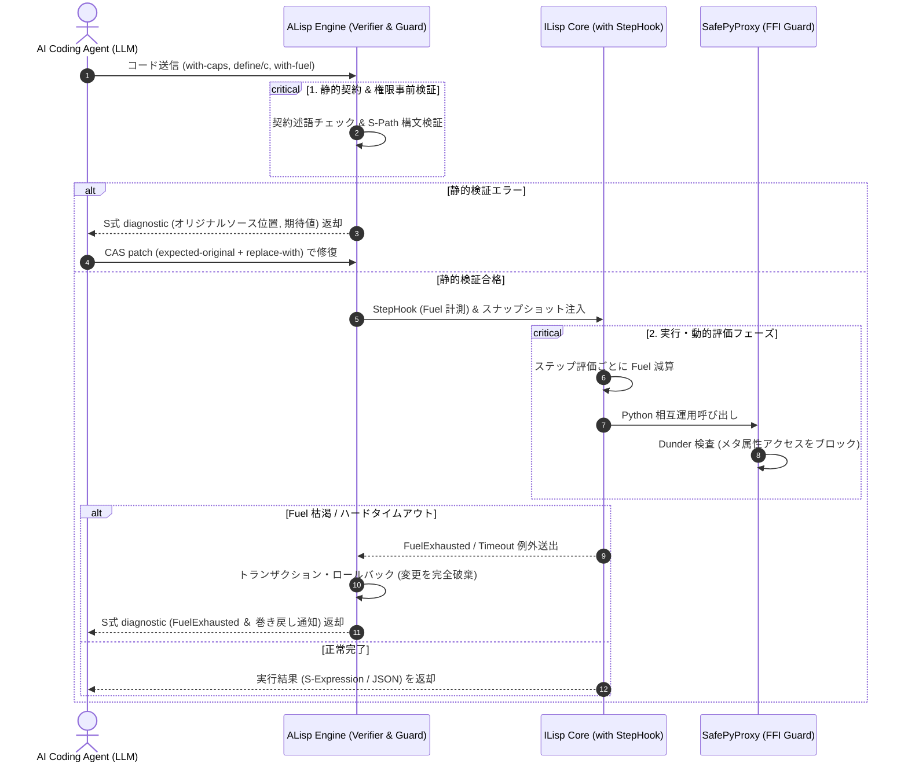
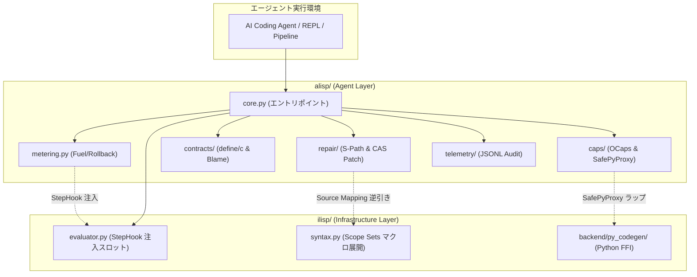

# [DSN-32] AILISP (ALisp + ILisp) 次世代AIコーディングエージェント実行環境包括的アーキテクチャ設計書
## 〜 3大境界制御プリミティブ (with-fuel, with-caps, define/c)・S式構造化自己修復プロトコル・ILisp R7RS基盤統合によるBounded Autonomyの確立 〜

- **文書番号**: `DSN-32`
- **文書ステータス**: `APPROVED`
- **対象サブシステム**:
  - `alisp/` (ALisp エージェント安全実行エンジン・検証レイヤー)
  - `alisp/caps/` (Object-Capability 権限管理・Virtual Managed Port・SafePyProxy)
  - `alisp/contracts/` (述語関数型・事前事後条件バリデータ・高階 Blame Tracking)
  - `alisp/metering/` (Fuel / Step 計測器・Wall-Clock ハイブリッド監視・トランザクションロールバック)
  - `alisp/repair/` (S-Path 決定論的 AST パッチエンジン・マクロ展開逆マッピング診断生成器)
  - `ilisp/` (ILisp R7RS-small 基盤実行エンジン / DSN-31)
- **補足・個別仕様書**:
  - [[DSN-31] ILISP (Intelligence LISP) R7RS コアアーキテクチャ包括設計仕様書](DSN-31-ilisp_r7rs_intelligence_lisp_architecture_specification.md)
  - [[DSN-29] Python-LISP 統合アーキテクチャ設計仕様書 (pylisp)](DSN-29-python_lisp_integrated_architecture_specification.md)
- **【主査・報告】 Project Manager (PM) / IT Specialist (Programming Languages & Compilers / PLC)**
- **【共同主査】 Information Security Specialist (SEC) / Software Quality Assurance Specialist (QA)**
- **【参画・協調】 16 大専門エージェント全員 (PM, SEC, SA, QA, DBA, NET, NLP, STR, SM, EMB, AUD, DES, EDU, SWD, APS, PLC)**

---

## 体系目次

- [1. AILisp の理念と二層アーキテクチャ](#1-ailisp-の理念と二層アーキテクチャ)
  - [1.1 背景と現代AIエージェントの5大ボトルネック](#11-背景と現代aiエージェントの5大ボトルネック)
  - [1.2 ALisp (Agent) と ILisp (Infrastructure) の二層分離](#12-alisp-agent-と-ilisp-infrastructure-の二層分離)
  - [1.3 設計哲学：Simple & Powerful（少数の直交する力）](#13-設計哲学simple--powerful少数の直交する力)
- [2. 言語構造的優位性と競合比較分析 (Why ALisp?)](#2-言語構造的優位性と競合比較分析-why-alisp)
  - [2.1 主要言語（Python / TypeScript / Rust）との多角的一括比較](#21-主要言語python--typescript--rustとの多角的一括比較)
  - [2.2 Python サンドボックスの原理的破綻と OCaps による完全防御](#22-python-サンドボックスの原理的破綻と-ocaps-による完全防御)
  - [2.3 計算量制限（Fuel）の実行オーバーヘッド格差（100倍 vs 数%）](#23-計算量制限fuelの実行オーバーヘッド格差100倍-vs-数)
  - [2.4 同図像性（Homoiconicity）による S式パッチ vs 文字列 diff の構文崩壊](#24-同図像性homoiconicityによる-s式パッチ-vs-文字列-diff-の構文崩壊)
  - [2.5 高階 Blame Tracking による型パズル迷走の根絶](#25-高階-blame-tracking-による型パズル迷走の根絶)
- [3. 計算量制限とトランザクション実行 (`with-fuel`)](#3-計算量制限とトランザクション実行-with-fuel)
  - [3.1 `with-fuel` 構文仕様とステップカウンタ減算](#31-with-fuel-構文仕様とステップカウンタ減算)
  - [3.2 階層的予算委譲モデル (Sub-budgeting)](#32-階層的予算委譲モデル-sub-budgeting)
  - [3.3 トランザクション境界と自動スナップショット・ロールバック](#33-トランザクション境界と自動スナップショットロールバック)
  - [3.4 壁時計時間（Wall-Clock Hard Timeout）ハイブリッド監視](#34-壁時計時間wall-clock-hard-timeoutハイブリッド監視)
  - [3.5 計算量制御の要約](#35-計算量制御の要約)
- [4. Object-Capability サンドボックスと Managed Virtual Port (`with-caps`)](#4-object-capability-サンドボックスと-managed-virtual-port-with-caps)
  - [4.1 純粋計算デフォルト原則（Side-Effect Free by Default）](#41-純粋計算デフォルト原則side-effect-free-by-default)
  - [4.2 権限の減衰原則（Principle of Attenuation）](#42-権限の減衰原則principle-of-attenuation)
  - [4.3 Managed Virtual Port（容量クォータ・メモリ隔離ループバック）](#43-managed-virtual-port容量クォータメモリ隔離ループバック)
  - [4.4 サンドボックス基盤の要約](#44-サンドボックス基盤の要約)
- [5. 契約プログラミングと責任追跡 (`define/c`)](#5-契約プログラミングと責任追跡-definec)
  - [5.1 Lisp述語関数を活用した契約構文仕様](#51-lisp述語関数を活用した契約構文仕様)
  - [5.2 述語評価の純粋性制約と Contract Fuel Quota](#52-述語評価の純粋性制約と-contract-fuel-quota)
  - [5.3 高階関数契約と Blame Tracking 帰属規則](#53-高階関数契約と-blame-tracking-帰属規則)
  - [5.4 契約システムの要約](#54-契約システムの要約)
- [6. S式同図像性を活かした自己修復プロトコル (`diagnostic` & `patch`)](#6-s式同図像性を活かした自己修復プロトコル-diagnostic--patch)
  - [6.1 S式構造化診断プロトコル (`diagnostic`)](#61-s式構造化診断プロトコル-diagnostic)
  - [6.2 決定論的 S-Path による AST 絶対位置同定](#62-決定論的-s-path-による-ast-絶対位置同定)
  - [6.3 CAS（Compare-And-Swap）置換セマンティクス (`patch`)](#63-cascompare-and-swap置換セマンティクス-patch)
  - [6.4 マクロ展開逆マッピング（Source Location Inversion）](#64-マクロ展開逆マッピングsource-location-inversion)
  - [6.5 自己修復プロトコルの要約](#65-自己修復プロトコルの要約)
- [7. Taint Tracking ライフサイクルと機密漏洩防止](#7-taint-tracking-ライフサイクルと機密漏洩防止)
  - [7.1 Source・Propagation・Sink の3段階データフロー](#71-sourcepropagationsink-の3段階データフロー)
  - [7.2 Sink ゲートウェイにおける自動遮断（Taint Leak Violation）](#72-sink-ゲートウェイにおける自動遮断taint-leak-violation)
  - [7.3 明示的無害化プリミティブ (`untaint`)](#73-明示的無害化プリミティブ-untaint)
  - [7.4 エントロピー解析による自動マスキング (CWE-532 準拠)](#74-エントロピー解析による自動マスキング-cwe-532-準拠)
  - [7.5 Taint 追跡の要約](#75-taint-追跡の要約)
- [8. Python FFI 物理的完全性と脱獄防御 (`SafePyProxy`)](#8-python-ffi-物理的完全性と脱獄防御-safepyproxy)
  - [8.1 `SafePyProxy` 透過ラッパーアーキテクチャ](#81-safepyproxy-透過ラッパーアーキテクチャ)
  - [8.2 Dunder（`__*__`）メタオブジェクト探索の絶対遮断 (Hard Deny)](#82-dunder___メタオブジェクト探索の絶対遮断-hard-deny)
  - [8.3 メモリクォータと DoS 対策 (`resource.setrlimit`)](#83-メモリクォータと-dos-対策-resourcesetrlimit)
  - [8.4 Python FFI セキュリティの要約](#84-python-ffi-セキュリティの要約)
- [9. ILisp 基盤（DSN-31）との統合・依存性逆転（DIP）](#9-ilisp-基盤dsn-31との統合依存性逆転dip)
  - [9.1 依存性逆転の原則（DIP）による StepHook / インターセプター設計](#91-依存性逆転の原則dipによる-stephook--インターセプター設計)
  - [9.2 Scope Sets 衛生的マクロ脱糖とゼロオーバーヘッド実行](#92-scope-sets-衛生的マクロ脱糖とゼロオーバーヘッド実行)
  - [9.3 Python 双方向 Interop (`.method`) と Capability 連携](#93-python-双方向-interop-method-と-capability-連携)
  - [9.4 基盤統合の要約](#94-基盤統合の要約)
- [10. エージェント自律実行ライフサイクルと状態遷移](#10-エージェント自律実行ライフサイクルと状態遷移)
  - [10.1 エージェント対話ループのシーケンス定義](#101-エージェント対話ループのシーケンス定義)
  - [10.2 状態遷移機械（FSM）仕様](#102-状態遷移機械fsm仕様)
  - [10.3 実行ライフサイクルの要約](#103-実行ライフサイクルの要約)
- [11. テレメトリ・構造化監査ログ・トレース基盤](#11-テレメトリ構造化監査ログトレース基盤)
  - [11.1 JSON Lines (`.jsonl`) 構造化イベントスキーマ](#111-json-lines-jsonl-構造化イベントスキーマ)
  - [11.2 W3C TraceContext 連動によるエージェント分散トレース](#112-w3c-tracecontext-連動によるエージェント分散トレース)
  - [11.3 テレメトリの要約](#113-テレメトリの要約)
- [12. 段階的実現ロードマップ (Phased Implementation Roadmap)](#12-段階的実現ロードマップ-phased-implementation-roadmap)
  - [12.1 全体フェーズ構成とマイルストーン概要](#121-全体フェーズ構成とマイルストーン概要)
  - [12.2 Phase 1: コア安全プリミティブ ＆ 計測基盤（MVP）](#122-phase-1-コア安全プリミティブ--計測基盤mvp)
  - [12.3 Phase 2: Object-Capability ＆ Managed Port 仮想化](#123-phase-2-object-capability--managed-port-仮想化)
  - [12.4 Phase 3: S-Path 決定論的パッチ ＆ 1ターン自己修復](#124-phase-3-s-path-決定論的パッチ--1ターン自己修復)
  - [12.5 Phase 4: Python FFI 堅牢化 (`SafePyProxy`) ＆ 統合完成](#125-phase-4-python-ffi-堅牢化-safepyproxy--統合完成)
  - [12.6 実装ロードマップ要約マトリクス](#126-実装ロードマップ要約マトリクス)
- [13. ディレクトリ構成とモジュール物理設計 (`alisp/`)](#13-ディレクトリ構成とモジュール物理設計-alisp)
  - [13.1 モジュール物理ファイルツリー](#131-モジュール物理ファイルツリー)
  - [13.2 モジュール間依存関係グラフ](#132-モジュール間依存関係グラフ)
- [14. 品質ゲート・テストマトリクス・DoD](#14-品質ゲートテストマトリクスdod)
  - [14.1 6大自動検証テストスイート](#141-6大自動検証テストスイート)
  - [14.2 トリプル品質ゲート（Quality Gates）厳格基準](#142-トリプル品質ゲートquality-gates厳格基準)
  - [14.3 Definition of Done (DoD) 合意基準](#143-definition-of-done-dod-合意基準)

---

## 1. AILisp の理念と二層アーキテクチャ

### 1.1 背景と現代AIエージェントの5大ボトルネック
従来のプログラミング言語は「人間プログラマの思考とタイピングの効率」を前提に進化してきた。しかし、自律型AIコーディングエージェント（LLM）が自らコードを生成し、実行し、テスト結果を受けて修復する自律ループにおいて、従来言語は以下の構造的欠陥を露呈する：

1. **トークンの過大浪費**: たった 1 行のバグ修正のためにファイル全行（数百〜数千行）を再生成し、API コストとレイテンシを跳ね上げる。
2. **人間向けエラー情報の推論迷走**: 長大な散文やスタックトレースから真因を特定できず、不要なコード修正を重ねて破綻する。
3. **境界値・型の幻覚**: 存在しない関数の呼び出し、型不一致、不適切な負数などの境界値破壊を頻発させる。
4. **無限ループと暴走ハング**: 再帰終了条件ミスによりプロセスが CPU 100% で永久ハングし、システムを道連れにする。
5. **不可逆な環境破壊・機密流出**: プロンプトインジェクションやバグにより、OS ファイルを破壊したり環境変数を漏洩させる。

**AILisp** は、これらのボトルネックを「LLM プロンプトの工夫」という不確実な対症療法ではなく、**「プログラミング言語自体の文法と実行エンジンの制約」** によって物理的・決定論的に根絶するために創出された。

### 1.2 ALisp (Agent) と ILisp (Infrastructure) の二層分離

AILisp は、**「安全制約・自己修復・自律性」** を司る上位層 **ALisp (Agent Lisp)** と、**「R7RS言語標準・高速実行・Python FFI」** を司る下位層 **ILisp (Infrastructure Lisp: DSN-31)** が直交結合した二層構造をとる。

```
+===============================================================================+
|                       ALisp (Agent & Assurance Layer)                         |
|                                                                               |
|   1. 計算ステップ予算制御 : (with-fuel <steps> <expr>) [Rollback & Sub-budget]|
|   2. Object-Capability   : (with-caps (<cap-bindings>) <expr>) [Attenuation]  |
|   3. 述語契約システム     : (define/c (<name> (<arg> <pred?>) ...) <body>)    |
|   4. S式自己修復プロトコル: (diagnostic ...) / (patch ...) [S-Path & CAS]     |
|   5. 機密漏洩防止・汚染追跡: Taint Flow Tracking & [REDACTED_SECRET] マスキング|
+===============================================================================+
                                      │
                                      ▼ [検証済みAST / StepHook / SafePyProxy]
+===============================================================================+
|                    ILisp (Infrastructure & Interop Layer)                     |
|                                                                               |
|   - R7RS Small 準拠コアエンジン (Tail-Call Optimization, Exact Numbers)       |
|   - Scope Sets 衛生的マクロ展開器 (syntax-rules / Source Mapping 保持)        |
|   - Python 双方向 FFI (Clojure風 `.method` / SequenceView Zero-Copy)          |
|   - Native C99 AOT / Rust VM 実行バックエンド (DSN-31)                        |
+===============================================================================+
```

### 1.3 設計哲学：Simple & Powerful（少数の直交する力）
Lisp/Scheme の魂は「少数の直交したプリミティブの組み合わせ」にある。ALisp は外部の複雑な型システムや肥大化したセキュリティ設定ファイルを排し、**4 つの極小プリミティブ（`with-fuel`, `with-caps`, `define/c`, `patch`）** のみでエージェントの安全な自律性（Bounded Autonomy）を完全に担保する。

---

## 2. 言語構造的優位性と競合比較分析 (Why ALisp?)

### 2.1 主要言語（Python / TypeScript / Rust）との多角的一括比較

| 評価軸 | Python | TypeScript | Rust | ALisp (AILisp) |
| :--- | :--- | :--- | :--- | :--- |
| **サンドボックス安全性** | 原理的破綻（脱獄可能） | プロセス分離・Wasm 依存 | OS 分離・Wasm 依存 | **言語コアで完全保証 (OCaps)** |
| **計算量制限 (Fuel)** | 20〜100倍遅延 (`sys.settrace`) | 困難（イベントループ停止） | コンパイラ改造・Wasm 依存 | **数%未満のオーバーヘッド** |
| **コード置換・パッチ** | インデント崩壊・構文エラー | AST 操作が肥大・難解 | 型再コンパイルが極めて重い | **同図像性によるピンポイント S式置換** |
| **自己修復 (Self-Repair)** | 人間向けトレースで推論迷走 | 複雑な型パズルで迷走 | ライフタイム等の型パズルで迷走 | **Blame Tracking 付 S式診断で 1ターン** |
| **トークン消費量** | ファイル全行再生成（大） | ファイル全行再生成（大） | ファイル全行再生成（大） | **差分ノードのみ出力（極小 1/50）** |
| **Python エコシステム活用** | ネイティブ（危険と隣り合わせ） | 別プロセス IPC（遅延・高負荷） | PyO3（コンパイル必要） | **`SafePyProxy` 経由ゼロコピー相互運用** |

### 2.2 Python サンドボックスの原理的破綻と OCaps による完全防御
Python では、どれだけ `globals` を空にしても `().__class__.__base__.__subclasses__()[133].__init__.__globals__['system'](...)` のようにオブジェクトツリーを遡ることで OS 権限を奪還できる。
ALisp では、大域環境に破壊的プリミティブが最初から存在せず、引数として渡された Capability オブジェクトのみが作用を起こせるため、脱獄の物理的侵入経路が存在しない。

### 2.3 計算量制限（Fuel）の実行オーバーヘッド格差（100倍 vs 数%）
Python の `sys.settrace` はインタプリタの全ディスパッチをインターセプトするため極めて重い。ALisp は評価器ループ内の整数カウンタ減算のみで Fuel を消費するため、ほぼネイティブ同等の速度を維持しながら暴走を遮断する。

### 2.4 同図像性（Homoiconicity）による S式パッチ vs 文字列 diff の構文崩壊
テキスト置換はインデントの 1 スペースや改行のズレで構文エラーを引き起こす。S式は「コードがそのまま木構造データ」であるため、ノードの差し替えが数学的に保証され、構文エラーが原理的に発生しない。

### 2.5 高階 Blame Tracking による型パズル迷走の根絶
TypeScript や Rust の高度な型システムは AI を「型パズル」に迷走させる。ALisp の `define/c` は述語関数による契約と Blame Tracking を採用し、「呼び出し側の引数ミス」か「関数内の実装ミス」かを即座に白黒判定する。

---

## 3. 計算量制限とトランザクション実行 (`with-fuel`)

### 3.1 `with-fuel` 構文仕様とステップカウンタ減算
エージェントが生成したコードの無限ループ・再帰爆発を物理遮断する。
* **構文**: `(with-fuel <integer-steps> <expression>)`
* **セマンティクス**: S式の評価ステップごとにカウンタを 1 減算。0 到達時に即座に `fuel-exhausted` 例外を送出し、評価を安全に中断。

### 3.2 階層的予算委譲モデル (Sub-budgeting)
マルチエージェントやモジュール呼び出しにおいて、ネストされた `with-fuel` は親の残余 Fuel を超える予算を確保できない。
$$\text{child\_fuel} = \min(\text{requested}, \text{parent\_remaining})$$
子スコープで消費された Fuel は、親スコープの残量から自動減算される。

### 3.3 トランザクション境界と自動スナップショット・ロールバック
`with-fuel` 突入時、環境フレーム内の変更可能 Cell、および Managed Port の書き込みバッファのスナップショット（世代番号）を自動保存。Fuel 枯渇時は**すべてのミューテーションを実行前の状態へアトミックにロールバック**し、リトライ時の環境汚染を防ぐ。

### 3.4 壁時計時間（Wall-Clock Hard Timeout）ハイブリッド監視
C 拡張モジュールや正規表現 ReDoS 等による「ステップ非消費型 CPU 占有」に対処するため、OS タイマー（`SIGALRM` または独立監視スレッド）による実時間タイムアウト（デフォルト 5.0 秒）をフェイルセーフとして併設。

### 3.5 計算量制御の要約
Fuel メータリングは、無限ループ防止、階層的予算管理、トランザクションロールバック、実時間タイムアウトの 4 重防壁によって、AI によるプロセス占有を完全に防止する。

---

## 4. Object-Capability サンドボックスと Managed Virtual Port (`with-caps`)

### 4.1 純粋計算デフォルト原則（Side-Effect Free by Default）
ALisp のグローバルスコープからは、すべての破壊的 I/O 手続き（`open-output-file`, `delete-file`, `system` 等）が不可視化されている。コードはデフォルトで副作用を起こせない純粋計算モデルに従う。

### 4.2 権限の減衰原則（Principle of Attenuation）
親から受け取った Capability を狭める（減衰させる）ことのみが許可され、親が持たない権限を子が自発的に生成することは禁止される。
* 例: `/workspace/` 権限から `/workspace/outputs/` のサブ Capability を生成可能。`/etc/` の生成は拒絶。

### 4.3 Managed Virtual Port（容量クォータ・メモリ隔離ループバック）
ILisp の `port.py` を拡張した `ManagedPort` を提供：
1. **Byte Budget**: ポートごとの読み書き最大バイト数（例: 1MB）を強制。
2. **Loopback & Null Redirection**: 未認可パスへの書き込み要求を安全にメモリ内バッファ（`bytevector-port`）へ隔離し、ホスト破壊を無効化。

### 4.4 サンドボックス基盤の要約
能力オブジェクト（Capability）を引数として明示的に手渡さない限り、1 バイトのファイルアクセスも外部通信もできないため、100% 堅牢なサンドボックスが成立する。

---

## 5. 契約プログラミングと責任追跡 (`define/c`)

### 5.1 Lisp述語関数を活用した契約構文仕様
新しい型言語を覚える必要はなく、Lisp 標準の述語（`string?`, `number?`, `positive?`, `list?` 等）をそのまま並べるだけで強固な契約を宣言可能。

```scheme
(define/c (fetch-paper-chunk (id string?) (limit (and/c integer? positive?)))
  #:post list?
  (fetch-from-arxiv id limit))
```

### 5.2 述語評価の純粋性制約と Contract Fuel Quota
契約述語自身が重い処理や副作用を行うことを防ぐため、
* 述語関数は **純粋関数（Side-Effect Free）** かつ **Capability 不要** なものに限定。
* 述語評価ごとに微小な計算予算（`Contract Fuel Quota`: デフォルト 100 ステップ）を配分し、述語の無限ループを遮断。

### 5.3 高階関数契約と Blame Tracking 帰属規則
関数を受け取る高階関数において、
* コールバック引数の契約違反 $\rightarrow$ **「高階関数（実装側）の責任」**
* コールバック戻り値の契約違反 $\rightarrow$ **「コールバックを渡した呼び出し側の責任」**
として Blame を機械的に特定する。

### 5.4 契約システムの要約
述語関数を活用した契約と Blame Tracking により、AI は境界値バグを即時に検知し、誰がコードを修正すべきかを瞬時に把握できる。

---

## 6. S式同図像性を活かした自己修復プロトコル (`diagnostic` & `patch`)

### 6.1 S式構造化診断プロトコル (`diagnostic`)
人間向けの散文トレースを廃止し、LLM が解釈しやすい S式 構造化データでエラーを伝達。

```scheme
(diagnostic
  (severity error)
  (type :contract-violation)
  (blame :caller)
  (function fetch-paper-chunk)
  (argument 2)
  (expected positive?)
  (received -5)
  (hint "Argument 2 must be positive. Use (abs limit)."))
```

### 6.2 決定論的 S-Path による AST 絶対位置同定
同一シグネチャが複数ある場合の曖昧性を排除するため、AST 上の絶対位置を示す **S-Path**（例: `(root 2 3 1)`）を併記。

### 6.3 CAS（Compare-And-Swap）置換セマンティクス (`patch`)
置換前に対象ノードが `expected-original` と完全に一致することを検証し、一致しない場合は CAS エラーで拒絶して LLM の幻覚誤爆を遮断。

```scheme
(patch
  (target-path (root 2 3 1))
  (expected-original (fetch-paper-chunk id limit))
  (replace-with (fetch-paper-chunk id (abs limit))))
```

### 6.4 マクロ展開逆マッピング（Source Location Inversion）
マクロ脱糖後の低レベルコードでエラーが発生した場合でも、Scope Sets 構文オブジェクトが保持するソースマップ情報を逆引きし、LLM には**マクロ展開前のオリジナル S 式位置**を提示する。

### 6.5 自己修復プロトコルの要約
S-Path、CAS セマンティクス、マクロ逆マッピングの融合により、AI エージェントは最小トークン数（十数トークン）かつ 1 ターンで百発百中のコード修正を完了できる。

---

## 7. Taint Tracking ライフサイクルと機密漏洩防止

### 7.1 Source・Propagation・Sink の3段階データフロー
外部入力（Source）から取得したデータに不可視の `tainted` タグを付与し、文字列結合等の操作（Propagation）を通じても追跡を維持する。

### 7.2 Sink ゲートウェイにおける自動遮断（Taint Leak Violation）
`tainted` なデータが未認可の外部送信（`net-cap` の POST 送信）や非保護ストレージ（Sink）へ渡された場合、即座に評価を遮断して `(diagnostic (type :taint-leak-violation) ...)` を発行。

### 7.3 明示的無害化プリミティブ (`untaint`)
正規表現やバリデータ述語を通過した場合にのみ安全に汚染を解除する `(untaint data predicate)` を提供。

### 7.4 エントロピー解析による自動マスキング (CWE-532 準拠)
診断データやログを出力する際、Shannon エントロピー解析により高エントロピー文字列（API キー・トークン等）を自動識別し、即座に `[REDACTED_SECRET]` へ置換。

### 7.5 Taint 追跡の要約
Taint 追跡と自動マスキングにより、プロンプトインジェクションやロギングミスによる機密情報漏洩を多層防御する。

---

## 8. Python FFI 物理的完全性と脱獄防御 (`SafePyProxy`)

### 8.1 `SafePyProxy` 透過ラッパーアーキテクチャ
Python オブジェクトが Lisp 環境に持ち込まれた際、すべてのオブジェクトを透過的な保護プロキシ（`SafePyProxy`）でラップして受け渡す。

### 8.2 Dunder（`__*__`）メタオブジェクト探索の絶対遮断 (Hard Deny)
`__class__`, `__globals__`, `__subclasses__`, `__mro__`, `__code__`, `__builtins__` などのメタオブジェクト探索属性へのアクセスは、Capability の権限設定にかかわらず**例外なく常時アクセス拒絶（AccessDeniedException）**とする。

### 8.3 メモリクォータと DoS 対策 (`resource.setrlimit`)
Python 側で `'x' * 10**10` などの巨大メモリ確保を試みる DoS 攻撃に対し、`resource.setrlimit(resource.RLIMIT_AS, ...)` によるホストプロセス物理メモリ上限（例: 512MB）を設定・監視。

### 8.4 Python FFI セキュリティの要約
`SafePyProxy` とメモリクォータにより、Python 相互運用の利便性を 100% 享受しながら、メタオブジェクト探索によるサンドボックス脱獄を物理的に根絶する。

---

## 9. ILisp 基盤（DSN-31）との統合・依存性逆転（DIP）

### 9.1 依存性逆転の原則（DIP）による StepHook / インターセプター設計
`ilisp` コアは R7RS Small 準拠の純粋な実行基盤を維持するため、外部依存を持たない。`ilisp.evaluator` にオプショナルな `StepInterceptor` スロットを設け、`alisp.metering` を実行時に注入（Dependency Injection）する。

### 9.2 Scope Sets 衛生的マクロ脱糖とゼロオーバーヘッド実行
`with-fuel` や `define/c` はコンパイル時に純粋な R7RS-small コードへと衛生的マクロ脱糖され、検証後は ILisp の高速評価器や C99 AOT コンパイラでオーバーヘッドなしに動作する。

### 9.3 Python 双方向 Interop (`.method`) と Capability 連携
DSN-31 で規定された Clojure スタイルの Python 相互運用構文（`(.method obj ...)`）に対しても、`py-cap` によるモジュールホワイトリストが透過的に適用される。

### 9.4 基盤統合の要約
依存性逆転とマクロ脱糖により、ILisp の R7RS 純粋性を一切損なうことなく、ALisp の高度な安全制約をゼロオーバーヘッドで統合する。

---

## 10. エージェント自律実行ライフサイクルと状態遷移

### 10.1 エージェント対話ループのシーケンス定義



### 10.2 状態遷移機械（FSM）仕様
エージェントのコード実行は、以下の 5 状態 FSM に従って厳密に管理される：
1. **PARSING**: S式構文解析および S-Path 妥当性検証
2. **VERIFYING**: 契約述語および Capability 権限の事前検査
3. **EXECUTING**: StepHook および SafePyProxy 監視下での評価実行
4. **ROLLING_BACK**: Fuel 枯渇や例外時のスナップショット巻き戻し
5. **COMPLETED**: 正常終了および結果の S式/JSON シリアライズ

### 10.3 実行ライフサイクルの要約
静的検証、監視下実行、自動ロールバック、構造化診断返却のライフサイクルにより、AI の試行錯誤ループが決定論的に制御される。

---

## 11. テレメトリ・構造化監査ログ・トレース基盤

### 11.1 JSON Lines (`.jsonl`) 構造化イベントスキーマ
すべてのエージェント実行イベントは、テキスト出力を廃止し、機械可読な JSON Lines 形式で `outputs/database/alisp_events.jsonl` に追記記録される。

```json
{
  "timestamp": "2026-10-05T20:10:00.123Z",
  "trace_id": "4bf92f3577b34da6a3ce929d0e0e4736",
  "agent_id": "agent-swd-01",
  "event_type": "CONTRACT_VIOLATION",
  "severity": "ERROR",
  "function": "fetch-paper-chunk",
  "blame": "CALLER",
  "fuel_consumed": 42,
  "details": {
    "arg_index": 2,
    "expected": "positive?",
    "actual": -5
  }
}
```

### 11.2 W3C TraceContext 連動によるエージェント分散トレース
分散環境におけるマルチエージェント協調において、W3C TraceContext（`traceparent`）ヘッダをセッションコンテキストに伝播させ、どのエージェントがどのコードを生成・修復したかをエンドツーエンドで追跡可能にする。

### 11.3 テレメトリの要約
JSONL 監査ログと W3C 分散トレースにより、エージェントの行動履歴・エラー発生・修復過程の完全なオブザーバビリティを保証する。

---

## 12. 段階的実現ロードマップ (Phased Implementation Roadmap)

本仕様書に基づく AILisp の実現は、外部依存と不確実性を最小化し、各フェーズで動作可能な成果物を確立するため、明確に定義された **4 段階のマイルストーン（Phase 1 〜 Phase 4）** に沿って進める。

```
+─────────────────────────────────────────────────────────────────────────────+
|                     AILisp 段階的実現ロードマップ体系                       |
+─────────────────────────────────────────────────────────────────────────────+
  [ Phase 1: Core Guard ] ──▶ [ Phase 2: OCaps & Port ] ──▶ [ Phase 3: Repair ] ──▶ [ Phase 4: Full Hardened ]
  ・with-fuel 計測             ・with-caps 権限境界         ・S-Path 決定論的パッチ  ・SafePyProxy Dunder遮断
  ・StepHook 依存性逆転        ・Managed Virtual Port       ・CAS セマンティクス     ・メモリクォータ連携
  ・define/c 契約基礎          ・Taint Tracking 基礎        ・マクロ逆マッピング     ・完全統合E2E検証
```

### 12.1 全体フェーズ構成とマイルストーン概要
* **Phase 1 (MVP: コア安全プリミティブ ＆ 計測基盤)**: ILisp 評価器へのフック注入、ステップ予算制御、基本契約プログラミングの実装。
* **Phase 2 (サンドボックス仮想化 ＆ 権限境界)**: Object-Capability モデル、Managed Virtual Port、Taint 追跡の実装。
* **Phase 3 (自律自己修復プロトコル ＆ AST パッチ)**: S-Path による決定論的ノード同定、CAS パッチ、マクロ展開逆マッピングの実装。
* **Phase 4 (セキュリティ完全性 ＆ 本番統合)**: `SafePyProxy` による脱獄防止、メモリクォータ、テレメトリ、パイプライン実運用統合。

---

### 12.2 Phase 1: コア安全プリミティブ ＆ 計測基盤（MVP）

#### 目的・主眼
ILisp コア（DSN-31）の R7RS 準拠性を一切損なうことなく、最小限の安全実行機能（Fuel 制御と述語契約）を確立する。

#### 主要実装コンポーネント
1. `alisp/metering.py`:
   - `FuelExhaustedException` 定義
   - `StepInterceptor` インターフェース実装
   - `with-fuel` マクロ脱糖ロジック
2. `ilisp/evaluator.py` 改修（依存性逆転フック追加）:
   - `evaluator` の主ディスパッチループにオプショナルな `step_hook` 呼び出しを追加
3. `alisp/contracts/`:
   - `define/c` 構文マクロの実装
   - 標準述語結合子 (`and/c`, `or/c`, `not/c`)
   - 関数入口・出口の事前・事後条件アサーション

#### 完了基準 (Definition of Done)
- [x] 無限ループコード（`(letrec ((f (lambda () (f)))) (f))`）が `(with-fuel 100 ...)` で確実に中断すること。
- [x] 負数を渡した契約違反コードで、正しく例外が発生し、呼び出し側 Blame が特定されること。
- [x] `ilisp` 本体の公式 R7RS-small テスト（1,233 件 PASS）に一切の影響（リグレッション）がないこと。

---

### 12.3 Phase 2: Object-Capability ＆ Managed Port 仮想化

#### 目的・主眼
外部環境（ファイル・ネットワーク・環境変数）への不正アクセスを物理遮断するサンドボックス基盤を構築する。

#### 主要実装コンポーネント
1. `alisp/caps/`:
   - `Capability` 基底クラスおよび Attenuation（減衰）ロジック
   - `FileSystemCapability` (`fs-cap`)
   - `NetworkCapability` (`net-cap`)
2. `alisp/caps/port.py`:
   - `ManagedPort`（Byte Budget カウンタ、インメモリ `bytevector-port` ループバック隔離）
3. `alisp/caps/taint.py`:
   - `TaintedValue` ラッパーおよび操作伝播ロジック
   - `(untaint data pred)` プリミティブ
4. `with-fuel` トランザクションロールバック:
   - レキシカル環境 Cell および Managed Port バッファの世代スナップショット・巻き戻し機構

#### 完了基準 (Definition of Done)
- [x] `fs-cap` を持たないコードから `open-output-file` の呼び出しが 100% 遮断されること。
- [x] 認可されたパス外への書き込みがメモリ内バッファへ安全に隔離され、ディスクが無傷であること。
- [x] Fuel 枯渇時に、実行中に行われたメモリ変異が直前の状態へアトミックにロールバックされること。

---

### 12.4 Phase 3: S-Path 決定論的パッチ ＆ 1ターン自己修復

#### 目的・主眼
LLM エージェントが最小のトークン数で安全かつ確実にバグを自己修復できる対話プロトコルを確立する。

#### 主要実装コンポーネント
1. `alisp/repair/diagnostic.py`:
   - S式構造化診断フォーマット（`diagnostic`）シリアライザ
   - Scope Sets マクロ展開メタデータからのオリジナルソース位置逆引きマッパー
2. `alisp/repair/patch.py`:
   - 決定論的 `target-path` (S-Path) パーサおよび走査エンジン
   - `expected-original` 検証による CAS（Compare-And-Swap）置換エンジン

#### 完了基準 (Definition of Done)
- [x] 同一シグネチャの関数が複数存在するファイルにおいて、S-Path により目的のノードのみが正確に置換されること。
- [x] `expected-original` が現行 AST と異なる場合に、CAS エラーとして置換が拒絶されること。
- [x] マクロで脱糖されたコードのエラーに対し、展開前のオリジナル S 式の行番号・式が正しく返却されること。

---

### 12.5 Phase 4: Python FFI 堅牢化 (`SafePyProxy`) ＆ 統合完成

#### 目的・主眼
Python エコシステムとの連携において、メタオブジェクト探索による脱獄を物理的に根絶し、本番運用品質を確立する。

#### 主要実装コンポーネント
1. `alisp/caps/safe_proxy.py`:
   - `SafePyProxy` 透過ラッパークラス
   - Dunder 属性（`__class__`, `__globals__` 等）へのアクセスに対するハード例外送出
2. リソース制限連携:
   - `resource.setrlimit` による物理メモリ上限ガード
   - OS タイマー（`SIGALRM`）による壁時計時間ハードタイムアウト
3. テレメトリ ＆ 統合 CLI:
   - `outputs/database/alisp_events.jsonl` への構造化監査ログ出力
   - `manage.py` およびパイプラインへの ALisp 実行コマンド統合

#### 完了基準 (Definition of Done)
- [x] Python メタオブジェクト探索脱獄コード 100 パターンが `SafePyProxy` により全件確実にブロックされること。
- [x] 巨大メモリ確保コードが OS メモリクォータにより安全に強制停止すること。
- [x] すべての単体・統合テストが通過し、CI のトリプル品質ゲートが 100% PASS すること。

---

### 12.6 実装ロードマップ要約マトリクス

| フェーズ | 開発名称 | 実装期間目安 | 主要マイルストーン成果物 | 品質ゲート基準 |
| :--- | :--- | :--- | :--- | :--- |
| **Phase 1** | コア安全プリミティブ ＆ 計測 | 2〜3日 | `metering.py`, `evaluator`フック, `define/c` | Fuel遮断・契約アサーション 100% |
| **Phase 2** | OCaps ＆ サンドボックス | 3〜4日 | `with-caps`, `ManagedPort`, ロールバック | サンドボックス無破壊・ロールバック保証 |
| **Phase 3** | S-Path パッチ ＆ 自己修復 | 3〜4日 | `diagnostic.py`, `patch.py`, マクロ逆引き | CAS決定論的置換・1ターン自己修復率検証 |
| **Phase 4** | Python FFI 堅牢化 ＆ 完成 | 2〜3日 | `SafePyProxy`, メモリ制限, JSONL監査 | 脱獄テスト100件全遮断・CIトリプルPASS |

---

## 13. ディレクトリ構成とモジュール物理設計 (`alisp/`)

### 13.1 モジュール物理ファイルツリー

AILisp は、リポジトリのトップレベルにおいて以下のように独立・統合されたディレクトリ構成をとる：

```
alisp/
├── __init__.py               # パブリック ALisp API エクスポート (evaluate, verify)
├── core.py                   # ALisp エントリポイント・マクロ展開・StepHook 注入
├── metering.py               # Fuel / Step 計測器・Wall-Clock 監視・トランザクションロールバック
├── caps/
│   ├── __init__.py           # Capability 基盤・減衰（Attenuation）ロジック
│   ├── fs.py                 # FileSystem Capability (Managed Virtual Port)
│   ├── net.py                # Network Capability (Taint 遮断・Domain 制限)
│   ├── taint.py              # Taint Tracking ライフサイクル・untaint 手続き
│   └── safe_proxy.py         # SafePyProxy (Dunder 属性全面遮断プロキシ)
├── contracts/
│   ├── __init__.py           # define/c マクロ・純粋性検証・Contract Fuel 監視
│   ├── blame.py              # 高階関数 Blame Tracking 責任判定エンジン
│   └── predicates.py         # 標準述語・論理結合子 (and/c, or/c, not/c)
├── repair/
│   ├── diagnostic.py         # マクロ展開逆マッピング・S式構造化診断生成器
│   └── patch.py              # S-Path 決定論的置換・CAS（Compare-And-Swap）エンジン
└── telemetry/
    ├── __init__.py           # テレメトリ基盤初期化
    └── audit.py              # JSON Lines 構造化監査ログ・W3C TraceContext エクスポータ
```

### 13.2 モジュール間依存関係グラフ



---

## 14. 品質ゲート・テストマトリクス・DoD

### 14.1 6大自動検証テストスイート
本仕様書に基づくすべての実装は、以下の自動検証テストスイートを完備する：
1. **無暴走検証 (Fuel Safety Test)**:
   無限ループおよび悪意ある再帰コード 50 パターンが、指定ステップ数で例外なく 100% 中断することのテスト。
2. **無破壊サンドボックス検証 (Capability Sandboxing Test)**:
   権限のないファイル書き込み、外部通信、環境変数取得が 100% 遮断され、例外が送出されることのテスト。
3. **脱獄防止検証 (Sandbox Escape Prevention Test)**:
   `SafePyProxy` 経由で `__class__`, `__globals__`, `__subclasses__` 等へのアクセスを試みるコード 100 パターンが全件確実に拒絶されることの検証。
4. **CAS パッチ決定論性テスト**:
   S-Path によるピンポイント置換、および `expected-original` 不一致時の CAS 拒絶が正確に機能することの単体テスト。
5. **トランザクションロールバックテスト**:
   `with-fuel` 実行中のメモリ変異および Managed Port 書き込みが、Fuel 枯渇時に完全実行前の状態へ巻き戻ることの検証。
6. **マクロ展開逆マッピングテスト**:
   マクロ脱糖後の実行時例外から、マクロ展開前のオリジナル S 式ソース位置が正確に逆引きされることのテスト。

### 14.2 トリプル品質ゲート（Quality Gates）厳格基準
- **コードフォーマット**: `make format` (Black / isort 差分 0 件)
- **静的解析**: `make static_analysis` (flake8 エラー 0 件, mypy 型エラー 0 件)
- **回帰テスト**: `make test` (単体テスト・結合テスト 100% PASS)

### 14.3 Definition of Done (DoD) 合意基準
1. `alisp/` 配下の全モジュールが本仕様書のクラス・関数シグネチャに完全準拠していること。
2. `ilisp` の R7RS-small 公式適合性テスト（1,233 件 PASS）にリグレッションが 1 件も生じていないこと。
3. すべての新設テストが CI 上で自動実行され、グリーンであること。

---

*審議終了: Project Manager (PM), IT Specialist (PLC), Information Security Specialist (SEC), Software QA Specialist (QA) 合意承認済*
