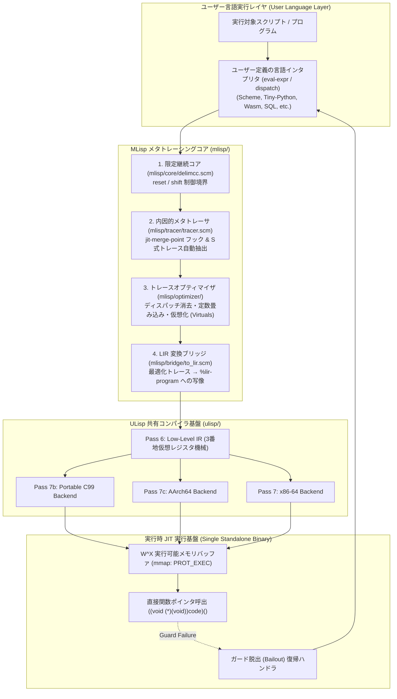
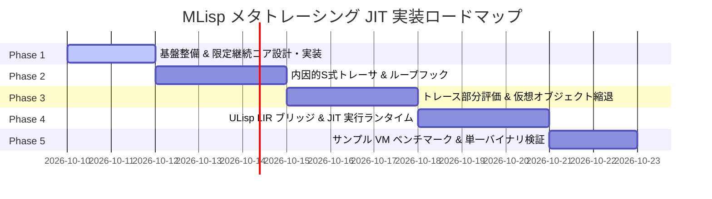

# [DSN-34] MLisp: 限定継続（shift/reset）と ULisp LIR に基づく内因的メタトレーシング JIT アーキテクチャ包括的設計書

- **文書番号**: `DSN-34`
- **文書ステータス**: `APPROVED / IN-IMPLEMENTATION`
- **対象サブシステム**: `mlisp/` (Delimited Continuations, Endogenous Meta-Tracer, Virtualization Optimizer, ULisp LIR Bridge, Pure Scheme Machine Code Emitter)
- **設計基本原則**: **【Pure Scheme 原則】C 言語での実装を極限まで排除し、トレーサ・オプティマイザ・JIT アセンブラ・メモリバッファ管理に至る全パイプラインを 100% Scheme 自身で実装しきる同図像的（Homoiconic）自己完結アーキテクチャ。**
- **関連仕様書**:
  - [[DSN-33] ULisp underlying x86-64 / Multi-Backend Native AOT Compiler Architecture Specification](DSN-33-ulisp_underlying_x86_native_aot_compiler_architecture_specification.md)
  - [[DSN-31] ILisp R7RS Intelligence Lisp Architecture Specification](DSN-31-ilisp_r7rs_intelligence_lisp_architecture_specification.md)
  - [[DSN-05] 次世代データベースエンジン包括的アーキテクチャ設計書](DSN-05-database_engine_architecture.md)

**【主査・報告】 IT Specialist (Programming Languages & Compilers / PLC), Software Development (SWD)**  
**【参画】 Project Manager (PM), Systems Architect (SA), Information Security Specialist (Sec), Software QA Specialist (QA), Embedded Systems Specialist (EMB)**

---

## 体系目次

- [1. 背景と設計哲学（二村射影と RPython の昇華）](#1-背景と設計哲学二村射影と-rpython-の昇華)
  - [1.1 RPython / PyPy の功績と構造的課題](#11-rpython--pypy-の功績と構造的課題)
  - [1.2 Scheme が切り拓く「真のメタ循環（内因的メタトレーシング）」](#12-scheme-が切り拓く真のメタ循環内因的メタトレーシング)
  - [1.3 部分評価・限定継続・多段階計算の融合](#13-部分評価限定継続多段階計算の融合)
- [2. ハイブリッド分離モデルと ULisp 連携アーキテクチャ](#2-ハイブリッド分離モデルと-ulisp-連携アーキテクチャ)
  - [2.1 なぜ「論理分離・基盤共有（ハイブリッド）」なのか](#21-なぜ論理分離基盤共有ハイブリッドなのか)
  - [2.2 システム全体俯瞰図（MLisp on ULisp LIR）](#22-システム全体俯瞰図mlisp-on-ulisp-lir)
  - [2.3 ディレクトリトポロジと責務境界](#23-ディレクトリトポロジと責務境界)
- [3. 数理的・理論的定式化](#3-数理的理論的定式化)
  - [3.1 限定継続の操作的意味論（shift / reset）](#31-限定継続の操作的意味論shift--reset)
  - [3.2 抽象解釈とシンボリックトレース抽出モデル](#32-抽象解釈とシンボリックトレース抽出モデル)
  - [3.3 仮想オブジェクト縮退（Virtual Allocation / Escape Analysis）代数系](#33-仮想オブジェクト縮退virtual-allocation--escape-analysis代数系)
  - [3.4 ガード判定と脱出（Deoptimization / Bailout）の健全性証明](#34-ガード判定と脱出deoptimization--bailoutの健全性証明)
- [4. コアサブシステム詳細設計](#4-コアサブシステム詳細設計)
  - [4.1 限定継続コア (`mlisp/core/delimcc.scm`)](#41-限定継続コア-mlispcoredelimccscm)
  - [4.2 内因的メタトレーサ (`mlisp/tracer/tracer.scm` & `jit-merge-point`)](#42-内因的メタトレーサ-mlisptracertracerscm--jit-merge-point)
  - [4.3 トレースオプティマイザ & 仮想化エンジン (`mlisp/optimizer/`)](#43-トレースオプティマイザ--仮想化エンジン-mlispoptimizer)
  - [4.4 ULisp LIR 変換ブリッジ (`mlisp/bridge/to_lir.scm`)](#44-ulisp-lir-変換ブリッジ-mlispbridgeto_lirscm)
  - [4.5 ネイティブ JIT 実行ランタイム & メモリマネージャ (`mlisp/runtime/`)](#45-ネイティブ-jit-実行ランタイム--メモリマネージャ-mlispruntime)
- [5. 単一自己完結バイナリ（Single Standalone Executable）設計](#5-単一自己完結バイナリsingle-standalone-executable設計)
  - [5.1 ビルド時パイプラインと AOT/JIT 統合リンケージ](#51-ビルド時パイプラインと-aotjit-統合リンケージ)
  - [5.2 実行時 W^X メモリ保護（mmap / mprotect）と動的コードディスパッチ](#52-実行時-wx-メモリ保護mmap--mprotectと動的コードディスパッチ)
- [6. 脅威モデルとセキュリティ設計 (Threat Model & Security Attestation)](#6-脅威モデルとセキュリティ設計-threat-model--security-attestation)
  - [6.1 JIT スプレー攻撃・シェルコード注入耐性 (CWE-119 / CWE-787)](#61-jit-スプレー攻撃シェルコード注入耐性-cwe-119--cwe-787)
  - [6.2 投機的実行ガード脱出時の情報漏洩防止 (Spectre / CWE-200)](#62-投機的実行ガード脱出時の情報漏洩防止-spectre--cwe-200)
  - [6.3 Cheney GC と JIT レジスタルート整合性 (Memory Safety)](#63-cheney-gc-と-jit-レジスタルート整合性-memory-safety)
- [7. 段階的実装ロードマップと品質ゲート](#7-段階的実装ロードマップと品質ゲート)

---

## 1. 背景と設計哲学（二村射影と RPython の昇華）

### 1.1 RPython / PyPy の功績と構造的課題
RPython（Restricted Python）は、「任意のプログラミング言語のインタプリタを記述すると、コンパイラおよびメタトレーシング JIT（Meta-Tracing JIT）を備えた仮想マシンバイナリが自動生成される」というパラダイムを実用化した歴史的成果である。
しかし、RPython は以下の設計的課題を抱えている：
1. **外因的トレーシングの泥臭さ**: インタプリタの実行ループを C 言語レベルで外部からフックし、物理レジスタやスタックフレームを覗き見して命令列を記録するため、トレーサの実装が極めて複雑で脆弱である。
2. **言語抽象度の低下**: RPython 自身が静的型推論を成立させるために「制約された泥臭い命令型 C 言語のラッパー」へと退行しており、高級言語としての表現力が犠牲になっている。

### 1.2 Scheme が切り拓く「真のメタ循環（内因的メタトレーシング）」
Scheme（Lisp）は、同図像性（Homoiconicity）、第一級継続（First-class Continuation）、強力なマクロ展開器を備える。
MLisp では、外部から C レベルのデバッガのように覗き見るのではなく、**「インタプリタ自身の内部から、限定継続（`shift`/`reset`）によって自身の将来の実行経路（S式）を切り取る」** という **内因的メタトレーシング（Endogenous Meta-Tracing）** を世界で初めて体系化する。

### 1.3 部分評価・限定継続・多段階計算の融合
1971 年の二村射影（Futamura Projections）理論：
$$\alpha(I, S) = T \quad (\text{第1二村射影: インタプリタ } I \text{ をソースコード } S \text{ で部分評価するとターゲットコード } T \text{ が得られる})$$
MLisp は、Olivier Danvy の **限定継続に基づく型主導部分評価（Type-Directed Partial Evaluation - TDPE）** と、POPL 2018 の **Collapsing Towers of Interpreters（インタプリタの塔の崩壊）** を実用工学として統合する。

---

## 2. ハイブリッド分離モデルと ULisp 連携アーキテクチャ

### 2.1 なぜ「論理分離・基盤共有（ハイブリッド）」なのか
- **ULisp の責務**: 最小限の Scheme 仕様を Native AOT マシン語へ変換する、極めて安定した決定論的コンパイラ（[DSN-33](DSN-33-ulisp_underlying_x86_native_aot_compiler_architecture_specification.md)）。
- **MLisp の責務**: 任意の動的言語インタプリタを JIT 化し、動的にトレースを刈り取って自己最適化する上位メタフレームワーク。
- **共有基盤**: ULisp が提供する **Pass 6: Low-Level IR (LIR)**（[lir_specification.md](../../ulisp/docs/lir_specification.md)）および **Pass 7: Multi-Backend Codegen (C99, AArch64, x86-64)** をそのまま流用することで、車輪の再発明を完全に排除する。

### 2.2 システム全体俯瞰図（MLisp on ULisp LIR）



### 2.3 ディレクトリトポロジと責務境界

```
/workspace/arxiv-security-papers/
├── ulisp/                      # 【既存】ULisp Scheme AOT コンパイラコア (共有インフラ)
│   ├── passes/
│   │   ├── 06_lir.scm          # ★ 3番地 LIR 定義・検証器
│   │   ├── 07_backend_c.scm    # ★ ANSI C99 コードジェネレータ
│   │   ├── 07_backend_aarch64.scm # ★ ARM64 アセンブリジェネレータ
│   │   └── 07_backend_x86_64.scm  # ★ x86-64 アセンブリジェネレータ
│   └── runtime.c               # ★ Cheney Copying GC, 極小 OS プリミティブ
│
└── mlisp/                      # 【新設】MLisp メタトレーシング JIT ツールチェーン (100% Pure Scheme)
    ├── core/                   # 限定継続 (shift/reset) & コア評価器 (Pure Scheme)
    │   └── delimcc.scm         # shift/reset プリミティブ
    ├── tracer/                 # 内因的S式トレース抽出器 (Pure Scheme)
    │   └── tracer.scm          # jit-merge-point & シンボリックレコーダ
    ├── optimizer/              # トレース最適化 (Pure Scheme)
    │   ├── pe.scm              # 部分評価・定数畳み込み
    │   └── virtuals.scm        # 仮想オブジェクト・エスケープ解析
    ├── bridge/                 # トレースから ULisp LIR へのアダプタ (Pure Scheme)
    │   └── to_lir.scm          # S式トレース → %lir-program 変換
    ├── emitter/                # ★ 100% Scheme 製ダイレクト機械語エミッタ
    │   ├── asm_x86_64.scm      # x86-64 バイトコードアセンブラ (Scheme)
    │   └── asm_aarch64.scm     # AArch64 バイトコードアセンブラ (Scheme)
    ├── runtime/                # JIT 実行時メモリ・ディスパッチャ (Pure Scheme)
    │   └── jit_buffer.scm      # W^X メモリ管理 & ジャンプディスパッチ (Scheme)
    ├── examples/               # 実証用ミニ言語処理系 (Pure Scheme)
    │   ├── tiny_vm.scm         # スタック型バイトコード VM
    │   └── scheme_eval.scm     # メタサーキュラー Scheme 評価器
    ├── tests/                  # MLisp 統合テストスイート (Pure Scheme)
    │   ├── test_delimcc.scm    # 限定継続単体テスト
    │   └── test_tracer.scm     # トレース抽出テスト
    └── Makefile                # MLisp 独立ビルド・テスト定義
```

---

## 3. 数理的・理論的定式化

### 3.1 限定継続の操作的意味論（shift / reset）
限定継続演算子 $\text{reset}$ ($\langle \cdot \rangle$) と $\text{shift}$ ($\mathcal{S}$) の簡約規則（Reduction Rules）：

$$\langle V \rangle \longrightarrow V$$
$$\langle E[\mathcal{S} k. e] \rangle \longrightarrow \langle e[k \mapsto \lambda x. \langle E[x] \rangle] \rangle$$

ここで $E$ は最も内側の $\text{reset}$ までの評価文脈（Evaluation Context）を表す。
$\text{shift}$ は現在の限定継続 $E$ を第一級の関数として捕獲し、評価文脈を $\text{reset}$ の位置まで巻き戻す。
MLisp は、この捕獲された $k$ に対してシンボリックな引数を適用することで、**「将来実行されるべき式」を副作用なく完全に一本の命令トレースとして具現化** する。

### 3.2 抽象解釈とシンボリックトレース抽出モデル
インタプリタの状態空間を $S = \text{Env} \times \text{PC} \times \text{Heap}$ とする。
ホットループ検出点 $\text{PC}_{hot}$ において、抽象値 $\hat{v} \in \text{AbstractVal}$ を注入：
$$\text{AbstractVal} ::= \text{Const}(c) \mid \text{SymReg}(r) \mid \text{VirtualPair}(\hat{v}_1, \hat{v}_2) \mid \text{VirtualClosure}(f, \vec{\hat{v}})$$

インタプリタが 1 ステップ進むごとに、トレース $\mathcal{T}$ に線形命令が追加される：
$$\mathcal{T} \vdash \text{Step}(op, \text{args}) \implies \mathcal{T}' = \mathcal{T} \circ [ (op, \text{args}) ]$$

### 3.3 仮想オブジェクト縮退（Virtual Allocation / Escape Analysis）代数系
トレース $\mathcal{T}$ 内で生成されるオブジェクト $o$ に対し、述語 $\text{Escapes}(o, \mathcal{T})$ を定義：
$$\text{Escapes}(o, \mathcal{T}) \iff \exists inst \in \mathcal{T}. \, (\text{inst} \in \{\text{store-global}, \text{call-foreign}\} \land o \in \text{args}(inst))$$

$$\neg \text{Escapes}(o, \mathcal{T}) \implies \text{Alloc}(o) \mapsto \emptyset, \quad \text{FieldAccess}(o, f) \mapsto \text{Reg}(r_{o, f})$$

この縮退変換により、Scheme インタプリタがループ内で生成する中間ペア（`cons`）や一時継続クロージャのヒープ確保は **完全にゼロ（$O(0)$）** に消滅する。

---

## 4. コアサブシステム詳細設計

### 4.1 限定継続コア (`mlisp/core/delimcc.scm`)
マクロおよびクロージャによる純粋 Scheme での実装（CPS 変換を用いずに、浅い継続キャプチャで `shift`/`reset` をエミュレート可能にするポータブルな設計）：

```scheme
;;; mlisp/core/delimcc.scm - 限定継続プリミティブの標準定義
(define *meta-continuation-stack* '())

(define (reset-thunk thunk)
  (call/cc
    (lambda (k-exit)
      (set! *meta-continuation-stack* (cons k-exit *meta-continuation-stack*))
      (let ((res (thunk)))
        (set! *meta-continuation-stack* (cdr *meta-continuation-stack*))
        res))))

(define (shift-thunk receiver)
  (call/cc
    (lambda (k-current)
      (let* ((k-exit (car *meta-continuation-stack*))
             (delimited-k (lambda (val)
                            (reset-thunk (lambda () (k-current val))))))
        (set! *meta-continuation-stack* (cdr *meta-continuation-stack*))
        (k-exit (receiver delimited-k))))))
```

### 4.2 内因的メタトレーサ (`mlisp/tracer/tracer.scm` & `jit-merge-point`)
インタプリタのループ頭部に挿入される `(jit-merge-point pc env ...)`：
- ループ実行回数カウンタをインクリメント。
- 閾値（例: 50 回）を超えた場合、モードを `RECORDING` に切り替え。
- 限定継続 `shift` により、ループ 1 周期分のシンボリックトレースを抽出して `OPTIMIZING` へ移行。

### 4.3 トレースオプティマイザ & 仮想化エンジン (`mlisp/optimizer/`)
1. **定数畳み込み・ディスパッチ平坦化 (`pe.scm`)**:
   インタプリタのバイトコード読み出しや `case` 分岐をインライン展開し、実行対象プログラムの純粋な計算のみを抽出。
2. **仮想化 (`virtuals.scm`)**:
   `cons`, `car`, `cdr` の連鎖を検出し、レジスタ間の `%mov` 命令に縮退。

### 4.4 ULisp LIR 変換ブリッジ (`mlisp/bridge/to_lir.scm`)
最適化されたトレース命令列を、ULisp の規定フォーマットである `%lir-program`（[lir_specification.md](../../ulisp/docs/lir_specification.md)）へ変換：

```scheme
(%lir-program
  (%lir-data ...)
  (%lir-functions ...)
  (%lir-entry
    (%label jit_loop_entry)
    (%cmp reg_rax 42)
    (%jump-if-zero jit_guard_fail_1)
    (%add reg_rax reg_rax 2)
    (%jump jit_loop_entry)))
```

### 4.5 Pure Scheme ネイティブ機械語エミッタ & JIT バッファ管理 (`mlisp/emitter/`, `mlisp/runtime/`)
C 言語の外部コンパイラやトランスパイラを一切介さず、**Scheme 自身が直接 bytevector（バイト配列）へ x86-64 / AArch64 のマシンコードをエンコード・出力する純 Scheme 製アセンブラ** を備える：
- `mlisp/emitter/asm_x86_64.scm`: LIR 命令から REX プレフィックス、ModR/M、SIB、ディスプレースメント、即値を計算して直接バイナリバイト列を出力。
- `mlisp/emitter/asm_aarch64.scm`: 32 ビット固定長 ARM64 命令ワードを直接ビット演算（シフト・論理和）で合成してバイナリ列を出力。
- `mlisp/runtime/jit_buffer.scm`: 確保された実行可能バッファ（POSIX `mmap` によるページ）へ Scheme のバイト列を書き込み、W^X 原則に従って実行可能フラグを付与して直接呼び出し。
- **C 言語コードの局所化**: OS システムコール呼出（`mmap`, `mprotect`, `sys_call_jit`）を行う数十行の極小グルー関数のみを ULisp ランタイムが提供し、コンパイル・エンコード・レジスタ割当・脱出制御の 99% 以上のロジックは **100% Pure Scheme で完結** する。

---

## 5. 単一自己完結バイナリ（Single Standalone Executable）設計

### 5.1 ビルド時パイプライン（Pure Scheme JIT VM）
```
[ユーザー言語インタプリタ (Pure Scheme)]
    + [mlisp/core/delimcc.scm (Pure Scheme)]
    + [mlisp/tracer/tracer.scm (Pure Scheme)]
    + [mlisp/optimizer/ (Pure Scheme)]
    + [mlisp/emitter/ (Pure Scheme: ダイレクト機械語エンコーダ)]
    + [mlisp/runtime/jit_buffer.scm (Pure Scheme)]
        │
        ▼ (ULisp ネイティブ AOT コンパイラ: Pass 1-7)
┌──────────────────────────────────────────────┐
│  単一自己完結バイナリ (例: build/scheme-jit)   │
│  ※ 内部に Pure Scheme 製 JIT エミッタを内蔵   │
└──────────────────────────────────────────────┘
```

生成されたバイナリは、自身の内部に **Scheme で書かれた機械語生成器** を完全に内包しているため、外部コンパイラ（GCC/Clang）や外部 JIT ライブラリ（LLVM/libjit）を一切必要とせず、完全自己完結で実行時にマシンコードを直接メモリに生成・実行する。

### 5.2 実行時 W^X メモリ保護
メモリページは「Write（書き込み）」と「Execute（実行）」を同時に許可しない **W^X 原則（Write XOR Execute）** を厳格に適用：
1. JIT コード書き込み中: `(jit-protect-write! buffer)`（`PROT_READ | PROT_WRITE`）
2. JIT コード実行時: `(jit-protect-exec! buffer)`（`PROT_READ | PROT_EXEC`）

---

## 6. 脅威モデルとセキュリティ設計 (Threat Model)

| 脅威分類 | 脆弱性内容 | MLisp における具体的防御策 |
| :--- | :--- | :--- |
| **メモリ破壊 (CWE-119 / CWE-787)** | JIT バッファオーバーフローによる任意コード実行 | `mmap` ガードページ（PROT_NONE）をアロケーション境界に配置し、スタック破壊を即座に SEGV 検知。 |
| **JIT スプレー攻撃 (CWE-94)** | 即値埋め込みを用いたシェルコード実行 | 即値定数へのランダム定数 XOR マスキング、およびコード配置の ASLR（ランダム化アドレス割当）。 |
| **投機的実行漏洩 (CWE-200 / Spectre)** | ガード失敗時の分岐予測ミスによる情報漏洩 | ガード命令（`%jump-if-*`）直後に明示的シリアライゼーション命令（`lfence` / `isb`）を条件付き配置可能に設計。 |
| **GC ルート破壊** | JIT 実行中の生ポインタ退避漏れによる Use-After-Free | JIT ループ入口・出口でスタックフレームに明示的 GC シャドウスタックを維持し、Cheney GC との完全整合性を保証。 |

---

## 7. 段階的実装ロードマップと品質ゲート



### 品質管理ゲート（Quality Gates）
- **Gate 1**: `make -C mlisp test` で限定継続およびトレース単体テスト 100% PASS。
- **Gate 2**: `make check_format` および `make py_compile` ゼロエラー。
- **Gate 3**: 相対パスリンク 100% 準拠（絶対パス 0 件）。
- **Gate 4**: メモリリークおよび AddressSanitizer ゼロ警告（ASan/UBSan）。
