# [FEAT/ENH] `src/fetcher/` の ETL 3層（`ingestion` / `transformer` / `reporter`）アーキテクチャ分離 (ID: 031)

## 1. 概要 / Summary

現在 `src/fetcher/arxiv_okf_fetcher.py` は、arXiv API / RSS からのネットワーク取得、PDF ダウンロード、`pdftotext` 全文抽出、日本語要約・翻訳、MITRE / STRIDE タグ抽出、Google OKF v0.2 シリアライズ、および 01〜05 の 5 階層エグゼクティブサマリー集計まで、多岐にわたる責務を一手に担っています。

本 Issue では、単一責務の原則（SRP）に基づき、これを **ETL（Extract - Transform - Load/Report）パイプライン** として 3 つの独立モジュールに分離・再構築します。

```mermaid
graph LR
    subgraph Ingestion["1. src/ingestion/ (Extract)"]
        API[arXiv API / RSS Client]
        PDF[PDF Downloader]
        TXT[pdftotext Extractor]
    end

    subgraph Transformer["2. src/transformer/ (Transform)"]
        NLP[日本語翻訳 / 要約エンジン]
        Taxonomy[MITRE / STRIDE タガー]
        OKF[OKF v0.2 Serializer]
    end

    subgraph Reporter["3. src/reporter/ (Load & Report)"]
        Run[01_per_run]
        Daily[02_daily]
        Trend[03_monthly ~ 05_annual]
        Mermaid[Mermaid グラフ生成]
    end

    Ingestion --> Transformer --> Reporter
```

---

## 2. トレーサビリティ / Traceability

- 関連資料:
  - [AGENTS.md](../../.agents/AGENTS.md) (Google OKF v0.2 仕様 & 5層サマリー規定)
  - [DSN-01-okf-system-architecture.md](../designs/DSN-01-okf-system-architecture.md)

---

## 3. 影響範囲と関連ファイル / Scope and Affected Files

- [ ] [src/fetcher/arxiv_okf_fetcher.py](../../src/fetcher/arxiv_okf_fetcher.py) (リファクタリング・ディスパッチャ化)
- [ ] `src/ingestion/` (arXiv API/RSS クライアント、レート制限リトライ、PDF/TXT 抽出)
- [ ] `src/transformer/` (NLP 和訳・セキュリティ特徴語抽出・MITRE/STRIDE タギング・OKF v0.2 シリアライザ)
- [ ] `src/reporter/` (01〜05 階層エグゼクティブサマリー自動生成・Mermaid 動的グラフ生成)
- [ ] `tests/fetcher/` -> `tests/ingestion/`, `tests/transformer/`, `tests/reporter/`

---

## 4. 実装方針 / Implementation Plan

Target Branch: `feat/031-fetcher-etl-pipeline-architecture`

1. **`src/ingestion/` の抽出**:
   - ネットワーク通信、指数バックオフリトライ、PDF ダウンロードおよび `pdftotext` 抽出を純粋な Ingestion パッケージとしてカプセル化。
2. **`src/transformer/` の構築**:
   - ネットワーク依存を完全排除し、生テキスト・メタデータから Google OKF v0.2 Markdown を生成する純粋関数・変換パイプラインを確立。
3. **`src/reporter/` の構築**:
   - 01_per_run, 02_daily, 03_monthly, 04_quarterly, 05_annual の 5 階層サマリー集計および Mermaid グラフ生成を独立化。過去ログからの再集計 CLI を提供。
4. **テストスイートの 1:1 分割**:
   - 各パッケージに対応する単体テストを `tests/` 下に配置し、通信モックによる高速かつ安定したテスト環境を整備。

---

## 5. 完了条件 / Success Criteria (DoD)

- [ ] `src/ingestion/`, `src/transformer/`, `src/reporter/` の 3 パッケージに責務が完全分離されていること
- [ ] 実通信を行わずに `src/transformer/` および `src/reporter/` の単体テストが 100% 実行・PASS すること
- [ ] 過去のログ・OKF データから月次・四半期・年次サマリーをスタンドアロンで再生成可能であること
- [ ] 既存の `make run`, `make backfill` パイプラインとの後方互換性が維持されていること
- [ ] `make test`, `make static_analysis` がエラー 0 件で通過すること
