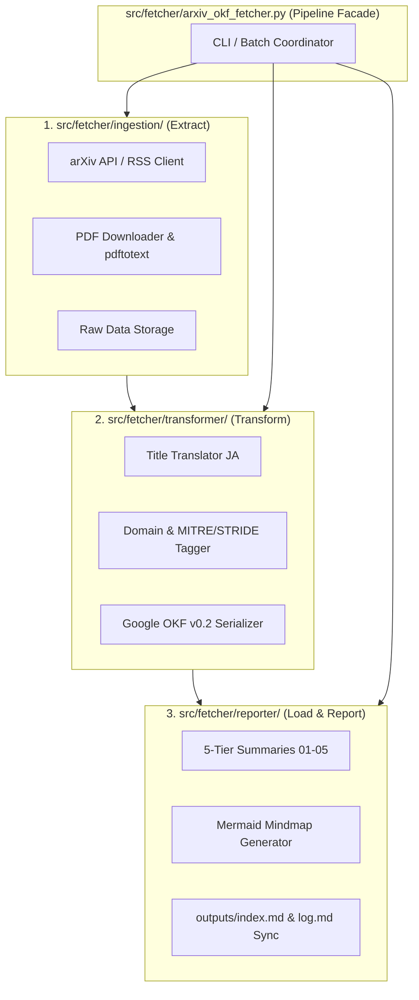

# [FEAT/ENH] `src/fetcher/` の ETL 3層（`ingestion` / `transformer` / `reporter`）アーキテクチャ分離 (ID: 031)

## 1. 概要 / Summary

現在 `src/fetcher/arxiv_okf_fetcher.py`（1,500行超）は、単一ファイル内に以下の多岐にわたる責務が混在しています：
1. **Extract (Ingestion)**: arXiv API (cs.CR) XML取得、RSSフォールバック、レート制限バックオフリトライ、PDF並列ダウンロード、`pdftotext` 全文抽出、Rawデータ（JSON/TXT/PDF）永続化
2. **Transform (Transformer)**: セキュリティ論文タイトルの日本語化、セキュリティドメイン分類（Cryptography, Web, AI Security等）、MITRE ATT&CK / STRIDE 脅威タグ抽出、Google OKF v0.2 YAMLフロントマター付きMarkdown生成
3. **Report (Reporter)**: 01_per_run (実行時), 02_daily (日次), 03_monthly (月次), 04_quarterly (四半期), 05_annual (通期) の 5 階層エグゼクティブサマリー自動集計、Mermaid マインドマップ生成、`outputs/index.md` & `outputs/log.md` 追跡更新

本 Issue では、単一責務の原則（SRP）およびパイプラインアーキテクチャに基づき、`src/fetcher/` 内部を **ETL 3 層（`ingestion` / `transformer` / `reporter`）** に完全分離し、テスト容易性、保守性、およびサマリー再生成の柔軟性を最大化します。

---

## 2. トレーサビリティ / Traceability

- 関連資料:
  - [AGENTS.md](../../.agents/AGENTS.md) (Google OKF v0.2 仕様 & 5層サマリー規定)
  - [DSN-01-okf-system-architecture.md](../designs/DSN-01-okf-system-architecture.md)

---

## 3. 影響範囲と関連ファイル / Scope and Affected Files

- [ ] `src/fetcher/ingestion/__init__.py`: Ingestion パッケージ公開エントリ
- [ ] `src/fetcher/ingestion/arxiv_client.py`: arXiv API / RSS クライアント、レート制限リトライ、Atom XML パーサー
- [ ] `src/fetcher/ingestion/pdf_extractor.py`: PDF ダウンロード、`pdftotext` 全文抽出、Raw データファイル保存
- [ ] `src/fetcher/transformer/__init__.py`: Transformer パッケージ公開エントリ
- [ ] `src/fetcher/transformer/translator.py`: タイトル日本語翻訳、キーワード置換
- [ ] `src/fetcher/transformer/tagger.py`: セキュリティドメイン分類、MITRE ATT&CK / STRIDE 脅威タグ抽出
- [ ] `src/fetcher/transformer/okf_serializer.py`: Google OKF v0.2 YAML フロントマターおよび Markdown 生成
- [ ] `src/fetcher/reporter/__init__.py`: Reporter パッケージ公開エントリ
- [ ] `src/fetcher/reporter/summary_generator.py`: 01_per_run 〜 05_annual の 5 階層サマリー生成
- [ ] `src/fetcher/reporter/diagram_generator.py`: Mermaid マインドマップおよびカテゴリ分布図生成
- [ ] `src/fetcher/reporter/index_updater.py`: `outputs/index.md` & `outputs/log.md` 更新同期
- [ ] `src/fetcher/arxiv_okf_fetcher.py`: ETL パイプラインオーケストレータ / ファサード（全既存関数の互換性維持）
- [ ] `src/fetcher/__init__.py`: パッケージ公開シンボルの再エクスポート
- [ ] `tests/fetcher/test_ingestion.py`: Ingestion 単体テスト（XML パース、API モック、リトライ）
- [ ] `tests/fetcher/test_transformer.py`: Transformer 単体テスト（翻訳、タグ付け、OKF v0.2 生成）
- [ ] `tests/fetcher/test_reporter.py`: Reporter 単体テスト（5層サマリー、Mermaid 図、Index更新）
- [ ] `tests/fetcher/test_fetcher.py`: 統合パイプライン回帰テスト
- [ ] `Makefile`: `PYTHON_SRCS` に新規モジュール追加

---

## 4. 実装方針 / Implementation Plan

Target Branch: `feat/031-fetcher-etl-pipeline-architecture`

### Step 1: `src/fetcher/ingestion/` (Extract 層) の構築
- `arxiv_client.py`: `parse_arxiv_entry`, `fetch_arxiv_papers`, `fetch_arxiv_rss_fallback` を移行。HTTP 429/503 指数バックオフをカプセル化。
- `pdf_extractor.py`: `fetch_single_pdf_and_text`, `save_raw_paper_data`, `fetch_missing_raw_assets_for_paper` を移行。

### Step 2: `src/fetcher/transformer/` (Transform 層) の構築
- `translator.py`: `clean_text`, `translate_title_ja` を移行。
- `tagger.py`: `classify_domain`, `determine_security_tags`, `extract_mitre_and_stride` を純粋関数として実装。
- `okf_serializer.py`: `build_okf_from_raw`, `generate_japanese_executive_summary` を移行。Google OKF v0.2 仕様に準拠した YAML フロントマター生成を保証。

### Step 3: `src/fetcher/reporter/` (Report/Load 層) の構築
- `summary_generator.py`: `generate_per_run_summary`, `generate_all_daily_summaries`, `generate_monthly_summary`, `generate_quarterly_summary`, `generate_annual_summary`, `build_summary_table_md` を移行。
- `diagram_generator.py`: `generate_mermaid_mindmap` を移行。
- `index_updater.py`: `update_index_and_log` を移行。

### Step 4: `src/fetcher/arxiv_okf_fetcher.py` のファサード統合
- 各層（Ingestion, Transformer, Reporter）を組み合わせたクリーンな `run_pipeline()` および `backfill_historical_papers()` オーケストレーションを実装。
- 既存の全公開関数をインポート・再エクスポートし、既存コードやテスト・Makefile との 100% 後方互換性を担保。

### Step 5: テストスイートの 1:1 分割と検証
- `tests/fetcher/test_ingestion.py`, `test_transformer.py`, `test_reporter.py`, `test_fetcher.py` を整備。
- ネットワーク通信なしで Transformer/Reporter の高速単体テストを実行可能にする。
- `make py_compile`, `make static_analysis`, `make test` の Triple Quality Gate をパス。

---

## 5. 完了条件 / Success Criteria (DoD)

- [ ] `src/fetcher/ingestion/`, `src/fetcher/transformer/`, `src/fetcher/reporter/` の 3 サブパッケージに責務が完全分離されていること
- [ ] `src/fetcher/arxiv_okf_fetcher.py` がクリーンなオーケストレータとして機能しつつ、後方互換性を 100% 維持していること
- [ ] `tests/fetcher/` 内で各層の単体テストおよびパイプライン結合テストが 100% PASS すること
- [ ] `outputs/okf_papers/` の Google OKF v0.2 仕様および 01〜05 階層エグゼクティブサマリーの完全性が維持されていること
- [ ] `make static_analysis` (mypy) において 0 エラーであること
- [ ] フォアグラウンドにて Conventional Commit を実施し、Issue 031 をクローズ・アーカイブすること
