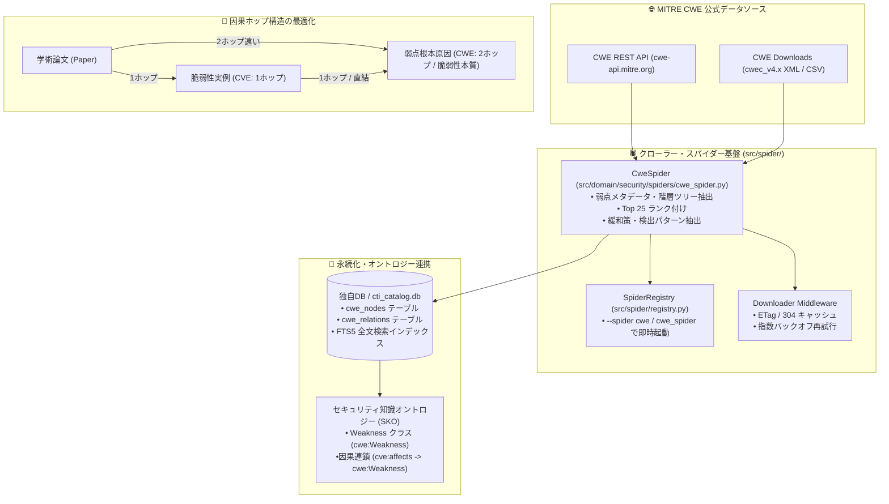

# [FEAT/CTI] MITRE CWE 公式カタログ自動インジェスト用 CweSpider の実装と DB / オントロジー連携基盤の確立 (ID: 222)

## 1. 概要 / Summary

サイバーセキュリティ学術論文分析（`arxiv-security-papers`）において、論文（Paper）と根本原因である弱点分類（CWE）との関係は、論文が個別具体的な脆弱性実例（CVE）やエクスプロイト実証を取り扱う場合が多く、因果グラフ上で「Paper ➔ CVE ➔ CWE」と2ホップ離れるケースが存在する。
しかしながら、**脆弱性に関する構造分析・根本原因分析・防御策（Mitigation）の観点においては、CWE は「1ホップ（CVE ➔ CWE）」または「脆弱性の本質そのもの」** であり、脅威モデリングや自動パッチ合成、セキュアコーディング指導において極めて決定的な重要性を持つ。

現在、本リポジトリでは NVD CVE スパイダーが収集する CVE レコード内の `weaknesses` 配列から CWE-ID を抽出するか、`src/domain/security/taxonomy/cwe.py` に代表的な弱点定義を静的辞書として保持しているのみにとどまっている。

本 Issue では、MITRE の公式データソース（CSV / XML または REST API `cwe-api.mitre.org`）から **CWE 全カタログ（約 1,000 種類以上の弱点ツリー、抽象度区分、親子関係、プラットフォーム、緩和策）および CWE Top 25** を自動取得・インジェストする専用スパイダー `CweSpider` (`src/domain/security/spiders/cwe_spider.py` および `src/spider/spiders/cwe_spider.py`) を実装し、純粋Python独自データベース（`.vdb` / SQLite `cti_catalog.db`）および W3C セキュリティ知識オントロジーナレッジグラフへ永続化・定期更新する基盤を確立する。

あわせて、関連するアーキテクチャ設計仕様書（`DSN-06` 分散スパイダー基盤設計書、`DSN-20` 外部セキュリティ知識統合インジェスト基盤設計書）を最新の実態に合わせて改訂・同期する。

---

## 2. トレーサビリティ / Traceability

- **MITRE CWE (Common Weakness Enumeration)**:
  - 公式ポータル: `https://cwe.mitre.org/`
  - 公式ダウンロード: `https://cwe.mitre.org/data/downloads.html`
  - 公式 REST API: `https://cwe-api.mitre.org/`
- **リポジトリ内設計仕様書 (DSN)**:
  - `docs/designs/DSN-06-distributed_spider_and_crawler.md` (分散スパイダー＆クローラー包括設計書)
  - `docs/designs/DSN-20-external_security_knowledge_ingestion_and_catalog_architecture.md` (外部知識統合インジェスト・カタログ基盤設計仕様書)
  - `docs/designs/DSN-17-security_knowledge_ontology.md` (セキュリティ知識オントロジー設計書)
- **関連 Issue**:
  - Issue 205 (CISA KEV および NVD CVE Spider の実装)
  - Issue 208 (CTI データに対応した OKF Item Pipeline の多態化)
  - Issue 218 (cti_catalog.db の独自データベース移行)

---

## 3. 影響範囲と関連ファイル / Scope and Affected Files

### 1. スパイダー実装・登録
- [ ] [NEW] `src/domain/security/spiders/cwe_spider.py`: MITRE CWE 公式 API / データ取得用スパイダー
- [ ] [NEW] `src/spider/spiders/cwe_spider.py`: スパイダー基盤用シンボリックインポートラッパー
- [ ] [MODIFY] `src/spider/registry.py`: `cwe_spider` のビルトイン登録および自動遅延ロード対応
- [ ] [MODIFY] `src/spider/spiders/__init__.py`: `CweSpider` のエクスポート定義

### 2. データ永続化・カタログ連携
- [ ] [MODIFY] `src/domain/security/taxonomy/cwe.py`: 静的辞書と動的カタログの透過的ハイブリッド参照
- [ ] [MODIFY] `src/ontology/seeder.py`: CWE ノードおよび CVE ➔ CWE 因果エッジのインジェスト強化

### 3. 設計書改訂
- [ ] [MODIFY] `docs/designs/DSN-06-distributed_spider_and_crawler.md`: ドメインスパイダー体系および Phase 6 (CWE Spider) の追記
- [ ] [MODIFY] `docs/designs/DSN-20-external_security_knowledge_ingestion_and_catalog_architecture.md`: CWE プロバイダとスパイダー連携、2ホップ/1ホップ因果関係の反映

### 4. 台帳・テスト
- [ ] [MODIFY] `docs/issues/README.md`: Issue 222 の登録
- [ ] [NEW] `tests/spider/test_cwe_spider.py`: CWE スパイダーのパース・契約検証テスト

---

## 4. 実装方針 / Implementation Plan

Target Branch: `feat/222-implement-mitre-cwe-spider-and-catalog-ingestion`

### Step 1: 設計仕様書（DSN-06, DSN-20）の先行改訂
1. `DSN-06` に `CweSpider` の仕様、Politeness（ダウンロード遅延制御）、allowed_domains (`cwe.mitre.org`, `cwe-api.mitre.org`) を追記。
2. `DSN-20` の Phase 2 (CWE プロバイダ) をスパイダー連携仕様として具体化し、論文（2ホップ）と脆弱性分析（1ホップ/直結）の因果グラフ位置づけを明文化。

### Step 2: `CweSpider` の実装
1. ゼロ外部依存（Pure Python、`urllib`/`json`/`xml.etree.ElementTree`）にて実装。
2. MITRE CWE REST API (`https://cwe-api.mitre.org/api/v1/cwe/weaknesses`) または公式 JSON/XML を取得。
3. 取得データから Weakness ID、名称、抽象度（Class/Base/Variant）、説明、Top 25 該否、Mitigations、関連 CVE/CAPEC を構造化 `ScrapedItem` として抽出。
4. `SpiderRegistry` (`src/spider/registry.py`) に登録し、CLI (`--spider cwe`) から単体実行可能にする。

### Step 3: カタログ永続化・オントロジー連携
1. 取得した CWE アイテムを `cti_catalog.db` のテーブル群へバッチインサート。
2. オントロジーシード処理において、脆弱性（CVE）ノードから弱点（CWE）ノードへの `cve:affects_weakness` エッジを構築。

### Step 4: 総合検証と品質ゲート
1. `make test` によるスパイダー契約・パース単体テストの全件通過。
2. `make static_analysis` (Black, isort, Flake8, Xenon Grade A, `mypy --strict`) の 100% 適合。

---

## 5. 完了条件 / Success Criteria (DoD)

- [ ] `CweSpider` が `src/domain/security/spiders/cwe_spider.py` に実装され、ゼロ外部依存で動作すること。
- [ ] `src/spider/registry.py` に `cwe_spider` が登録され、`--spider cwe` で実行可能であること。
- [ ] CWE の Weakness ID、名称、抽象度、Top 25 該否、緩和策が正しく `ScrapedItem` にマッピングされること。
- [ ] `DSN-06` および `DSN-20` が実態に合わせて更新され、CWE スパイダーのアーキテクチャが明記されていること。
- [ ] `make static_analysis` (`xenon` Grade A CC<=4, `mypy --strict`) に 100% 適合すること。
- [ ] `docs/issues/README.md` に Issue 222 が登録されていること。
