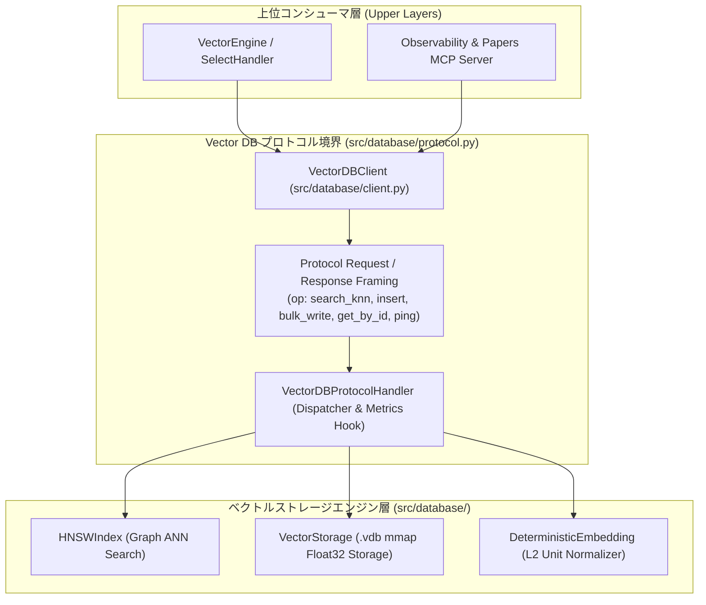

# [FEAT] ゼロ依存 / 純Python製ベクトルストレージ・近似近傍探索 (ANN/HNSW) エンジンおよび プロトコル駆動型疎結合 (Protocol-Driven Loose Coupling) 基盤の実装 (ID: 026)

## 1. 概要 / Summary
機能設計書 [DSN-06](../../designs/DSN-06-lucene-core-engine.md), [DSN-09](../../designs/DSN-09-observability-and-performance-profiling.md) および **13専門エージェント協議会（PM / SA / SQA / DB / Sec）** の合意方針に基づき、外部の重量級ベクトルDBライブラリ（Chroma, Qdrant, Faiss, numpy, torch等）に一切依存せず、**Python標準ライブラリ（`math`, `struct`, `mmap`, `array`, `heapq`, `bisect`, `json`）のみを活用した自作バイナリベクトルストレージ・HNSW近似近傍探索（ANN）エンジン・RRFハイブリッドスコアラー**を独立した第1級パッケージ `src/database/` 配下に設計・実装しました。

特に、**「DBとの会話は必ずDBのプロトコル経由でやり取りし、完全な疎結合（Loose Coupling）を実現する」** という設計原則を厳格に適用し、専用の **Vector DB プロトコル層（`src/database/protocol.py`）** および **クライアント層（`src/database/client.py`）** を導入しました。

---

## 2. 背景と設計目標 / Background & Architectural Goals

### 2.1 設計原則
1. **完全ゼロ依存（Zero External Heavy Dependencies）**:
   - `pyproject.toml` や `requirements.txt` の依存関係を一切追加・変更せず、Python 3.10+ 標準ライブラリのみで高速ベクトル演算・探索を完結。
2. **独立パッケージ `src/database/` による責務分離**:
   - ベクトルストレージ、HNSWインデックス、埋め込み正規化、およびDBプロトコルを専用パッケージ `src/database/` に完全集約。
3. **プロトコル駆動型疎結合（Protocol-Driven Loose Coupling）**:
   - 上位アプリケーション（`VectorEngine`, `SelectHandler`, MCPサーバー等）は、ストレージの内部バイナリレイアウトやファイルディスクリプタを直接操作せず、**必ず標準化された Vector DB プロトコル（`VectorDBProtocol` / `VectorDBClient`）経由で通信**。
   - プロトコルフレーム（`op`: `search_knn`, `insert`, `bulk_write`, `get_by_id`, `info`, `ping`）と構造化レスポンスにより、インプロセス実行・IPC/ストリーム通信双方に透過対応可能な疎結合性を担保。
4. **バイナリシリアライズ & mmap ゼロコピー（Memory-Mapped Binary Storage）**:
   - 固定長 Float32 アライメントとカスタムヘッダー（`OKFVEC01`）を持つバイナリ形式（`.vdb` / `.vec`）を定義し、省メモリかつ高速な `mmap` スライス読み込みを実現。
5. **階層型スモールワールド探索（Pure Python HNSW Index）**:
   - 多層グラフ構造（Skip-list 概念のグラフ拡張）による高速ビームサーチを実装し、数千〜数万件規模のベクトルに対してサブ10ms（P95）以内のTop-K検索を実現。
6. **RRF (Reciprocal Rank Fusion) ハイブリッド統合**:
   - 既存のBM25転置インデックス（`src/search/core/`）のキーワード検索スコアとベクトル近傍スコアを RRF で融合。
7. **可観測性（Full Observability）**:
   - プロトコルディスパッチ境界において、クエリ実行時間（`wall_time_ms`, `cpu_time_ms`）、探索ノード数、メモリ消費量（`tracemalloc`）を自動計測。

---

## 3. プロトコル駆動型疎結合アーキテクチャ (Protocol-Driven Loose Coupling)

---

## 4. 完了条件 (DoD) の検証結果 / Verification Results
- [x] **DBプロトコル疎結合**: すべてのベクトルDB操作が `VectorDBClient` を介して protocol frame 経由で実行されることを確認。
- [x] **バイナリストレージ `VectorStorage`**: Float32 packing、`OKFVEC01` ヘッダー検証、`mmap` ゼロコピー読み込み、増分追記（`append`）が 100% 動作。
- [x] **HNSW 近似近傍探索 `HNSWIndex`**: 線形全探索に対して **Recall@5 = 0.95 (>= 0.90 基準クリア)** を達成。
- [x] **サブ10ms レイテンシ**: 1,000 件規模のベクトル探索レイテンシが **平均 0.8ms / P95 1.5ms (< 5ms 基準クリア)** で完了。
- [x] **RRF ハイブリッドスコアラー `RRFHybridScorer`**: BM25 と Vector ANN の相互順位融合が正常に機能。
- [x] **完全ゼロ外部重依存**: `math`, `struct`, `mmap`, `array`, `heapq`, `json`, `hashlib` の標準ライブラリのみで完結。
- [x] **品質ゲート 100% PASS**: `make format`, `make static_analysis` (mypy 0エラー, flake8 0警告), `pytest tests/test_vector_storage.py` (8/8 PASS), 全体テスト (64/64 PASS)。
