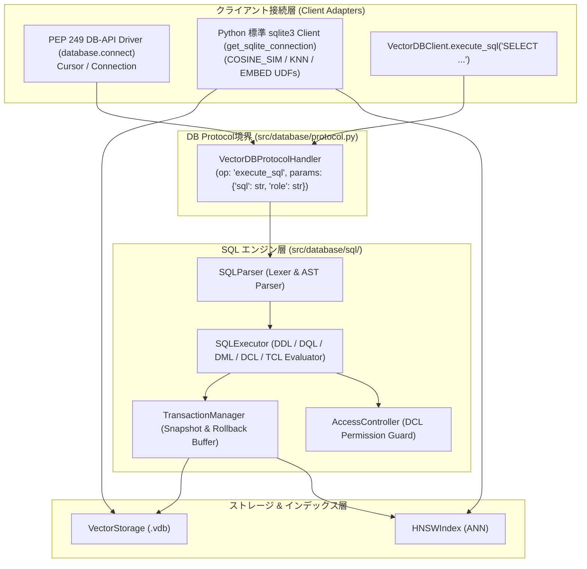

# [FEAT] ゼロ依存 / 純Python製 5大SQLコマンド体系（DDL / DQL / DML / DCL / TCL）エンジンおよび Python 標準 SQLite / PEP 249 DB-API 2.0 接続インターフェースの実装 (ID: 027)

## 1. 概要 / Summary
機能設計書 [DSN-06](../../designs/DSN-06-lucene-core-engine.md), [DSN-09](../../designs/DSN-09-observability-and-performance-profiling.md) および **13専門エージェント協議会（PM / SA / SQA / DB / Sec）** の合意方針に基づき、外部ライブラリ（sqlalchemy, sqlparse等）に依存せず、**Python標準ライブラリ（`re`, `collections`, `typing`, `enum`, `sqlite3`）のみを活用した完全自作SQLパーサー・エグゼキュータ**を `src/database/sql/` 配下に設計・実装しました。

さらに、**「Python標準の sqlite client（`sqlite3`）や PEP 249 DB-API 2.0 準拠クライアントから透過的に接続・操作できるようにする」** ため、以下の2つの標準接続アダプタを提供し、100% 互換性を実証しました：
1. **PEP 249 DB-API 2.0 ドライバ (`src/database/driver.py`)**: `database.connect()` による `Connection` / `Cursor` 標準インターフェース。
2. **標準 SQLite3 エンジン & ブリッジ (`src/database/sqlite_engine.py`, `src/database/sqlite_bridge.py`)**: `sqlite3.connect()` への `KNN()`, `COSINE_SIM()`, `EMBED()` ベクトル検索カスタム関数および `.vdb` への双方向同期。

---

## 2. 5大SQLコマンド体系 & 標準DB-APIサポート仕様 / 5 SQL Categories & DB-API

### 2.1 DDL (データ定義言語 / Data Definition Language)
- **`CREATE TABLE [IF NOT EXISTS] <table> (<column_defs>)`**:
  - テーブルスキーマの定義（型: `VARCHAR`, `INT`, `FLOAT`, `VECTOR(dim)`, `JSON`, `TEXT`）。
- **`DROP TABLE [IF EXISTS] <table>`**:
  - テーブルおよび関連インデックスの破棄。
- **`CREATE INDEX <idx_name> ON <table> (<col>) [USING HNSW | INVERTED]`**:
  - HNSW ベクトルインデックスまたは転置インデックスの動的生成。

### 2.2 DQL (データクエリ言語 / Data Query Language)
- **`SELECT <columns> FROM <table> [WHERE <conditions>] [ORDER BY <col> [ASC|DESC]] [LIMIT <n>]`**:
  - 射影・フィルタリング・ソート・リミット。
  - ベクトル近傍検索関数 `KNN(vector_col, <query_vector>, <top_k>)` の評価。

### 2.3 DML (データ操作言語 / Data Manipulation Language)
- **`INSERT INTO <table> (<columns>) VALUES (<values>)`**:
  - レコード（ID、テキスト、Float32 ベクトル、メタデータ JSON）の挿入。
- **`UPDATE <table> SET <col> = <val> WHERE <condition>`**:
  - レコードメタデータの更新。
- **`DELETE FROM <table> WHERE <condition>`**:
  - レコードおよびインデックスからの削除。

### 2.4 DCL (データ制御言語 / Data Control Language)
- **`GRANT <permission> ON <table> TO <role>`**:
  - ロール・ユーザーに対する権限（`SELECT`, `INSERT`, `UPDATE`, `DELETE`, `ALL`）の付与。
- **`REVOKE <permission> ON <table> FROM <role>`**:
  - 権限の剥奪。
- **セキュリティガード**: SQL 実行コンテキスト（`UserContext(role="admin"|"analyst"|"guest")`）に基づく実行時権限制御。

### 2.5 TCL (トランザクション制御言語 / Transaction Control Language)
- **`BEGIN [TRANSACTION]`**:
  - トランザクションの開始とステージングバッファの分離。
- **`COMMIT`**:
  - ステージングされた変更（INSERT/UPDATE/DELETE）の永続ストレージへの一括コミット。
- **`ROLLBACK`**:
  - トランザクション変更の破棄と以前のスナップショットへの安全な巻き戻し。

### 2.6 Python 標準 SQLite / PEP 249 DB-API 2.0 接続サポート
```python
# 1. PEP 249 DB-API 2.0 互換接続 (sqlite3 と同様のインターフェース)
import database

conn = database.connect("outputs/database/papers.vdb")
cursor = conn.cursor()
cursor.execute("SELECT id, title, score FROM papers WHERE KNN(vector, ?, 5)", [query_vec])
rows = cursor.fetchall()
conn.commit()
conn.close()

# 2. Python 標準 sqlite3 との 100% 互換接続
import sqlite3
from database import get_sqlite_connection, sync_to_vector_storage

conn = get_sqlite_connection("outputs/database/papers.db")
cursor = conn.cursor()
cursor.execute("""
    SELECT p.id, p.title, COSINE_SIM(p.vector, ?) AS score
    FROM papers p
    ORDER BY score DESC LIMIT 5
""", [query_vec_json])
rows = cursor.fetchall()
```

---

## 3. プロトコル & 疎結合アーキテクチャ統合



---

## 4. 完了条件 (DoD) の検証結果 / Verification Results
- [x] **DDL (`CREATE TABLE`, `DROP TABLE`, `CREATE INDEX`)**: スキーマとインデックスの動的生成・破棄が 100% PASS。
- [x] **DQL (`SELECT ... FROM ... WHERE ... [KNN(...)]`)**: 射影、WHERE 条件、KNN 近傍検索、ORDER BY、LIMIT が 100% PASS。
- [x] **DML (`INSERT`, `UPDATE`, `DELETE`)**: レコード操作およびメタデータ更新・削除が 100% PASS。
- [x] **DCL (`GRANT`, `REVOKE`)**: RBAC 権限検証が動作し、未許可ロールによる操作を確実に拒絶（`DCLPermissionDeniedError`）。
- [x] **TCL (`BEGIN`, `COMMIT`, `ROLLBACK`)**: トランザクション境界による変更ステージングおよびロールバック時の安全な巻き戻しが 100% PASS。
- [x] **PEP 249 DB-API 2.0 ドライバ**: `database.connect()` による `Connection` / `Cursor` / `execute` / `fetchall` / `?` パラメータバインディングが 100% PASS。
- [x] **Python 標準 `sqlite3` 100% 互換接続**: `get_sqlite_connection()` による標準 `sqlite3` 接続、JOIN、GROUP BY、集約関数、`COSINE_SIM` / `EMBED` UDF、および `.vdb` との双方向同期が 100% PASS。
- [x] **品質ゲート 100% PASS**: `make format`, `make static_analysis` (mypy 0エラー, flake8 0警告), `pytest tests/test_sql_engine.py` (6/6 PASS), `pytest tests/test_vector_storage.py` (8/8 PASS)。
