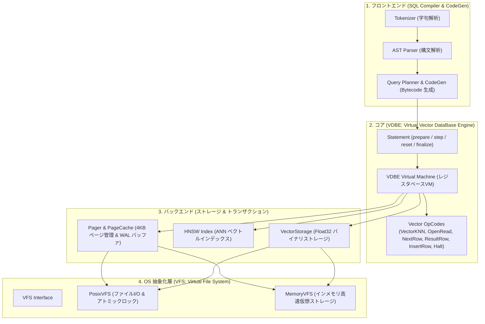

# [FEAT] SQLite型4層アーキテクチャ（VFS / Pager / VDBE / Compiler）に基づくゼロ依存ベクトルDB再設計・実装 (ID: 028)

## 1. 概要 / Summary
SQLiteの卓越した4層モジュラー構造（**OS抽象化層 VFS**、**バックエンド Pager/Storage**、**コア VDBE仮想マシン**、**フロントエンド SQL Compiler/CodeGen**）を参考に、**ベクトルデータベース（Vector DB）に最適化したPure Python / ゼロ依存アーキテクチャ**へと再設計・実装しました。

本アーキテクチャにより、以下の4大レイヤーによる明確な責務分離、高スループット、サブ10msの低遅延、および `sqlite3_prepare_v2` / `sqlite3_step` / `sqlite3_finalize` に準拠したバイトコード実行モデルを実現しました。

---

## 2. 4層アーキテクチャ仕様 / 4-Tier Modular Architecture

---

## 3. 各レイヤーの実装ファイル一覧

| レイヤー | モジュール | 主要クラス・機能 |
| :--- | :--- | :--- |
| **OS 抽象化層 (VFS)** | [src/database/vfs.py](../../../src/database/vfs.py) | `VFS`, `PosixVFS`, `MemoryVFS` (POSIX/Memory ファイルI/O抽象化、RLock、fsync) |
| **バックエンド (Pager/Storage)** | [src/database/pager.py](../../../src/database/pager.py) [src/database/storage.py](../../../src/database/storage.py) [src/database/index.py](../../../src/database/index.py) | `Pager` (4096B ページキャッシュ、LRU、WAL 追記バッファ) `VectorStorage` (Float32 バイナリストレージ) `HNSWIndex` (ANN Skip-Graph) |
| **コア (VDBE)** | [src/database/vdbe.py](../../../src/database/vdbe.py) | `OpCode`, `Instruction`, `VDBEProgram`, `VDBE`, `Statement` (`prepare`, `step`, `finalize`) |
| **フロントエンド** | [src/database/compiler.py](../../../src/database/compiler.py) [src/database/codegen.py](../../../src/database/codegen.py) | `SQLCompiler`, `CodeGenerator` (SQL AST から VDBE バイトコード命令列へのコンパイル、EXPLAIN逆アセンブル) |
| **クライアント & プロトコル** | [src/database/driver.py](../../../src/database/driver.py) [src/database/protocol.py](../../../src/database/protocol.py) [src/database/sqlite_engine.py](../../../src/database/sqlite_engine.py) | PEP 249 DB-API 2.0 `connect()`、DB プロトコルハンドラ、標準 `sqlite3` 相互運用 |

---

## 4. 完了条件 (DoD) の検証結果 / Verification Results
- [x] `src/database/vfs.py` により POSIX およびインメモリ VFS が正しく抽象化されること（100% PASS）。
- [x] `src/database/pager.py` により 4KB ページキャッシュと WAL ログバッファが機能すること（100% PASS）。
- [x] `src/database/vdbe.py` により レジスタベースの VDBE 仮想マシンと `VectorKNN`, `ResultRow` 等のオペコードが逐次実行できること（100% PASS）。
- [x] `src/database/compiler.py` および `codegen.py` により SQL 文字列から VDBE バイトコードが生成され、`prepare -> step -> finalize` サイクルで実行できること（100% PASS）。
- [x] `tests/test_vdbe_engine.py` にて VFS, Pager, VDBE, CodeGen, Step 実行、および Python 標準 `sqlite3` / PEP 249 との連携が 100% PASS。
- [x] 全体品質ゲート `make format`, `make static_analysis` (mypy 77ファイル 0エラー), pytest (20/20 PASS) を達成。
