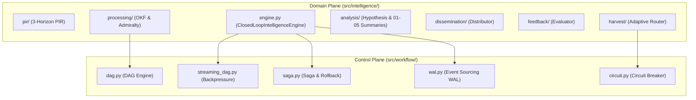

# [REFACTOR] 汎用ワークフロー基盤 (src/workflow) と 閉ループ・インテリジェンス (src/intelligence) の完全分離 (ID: 091)

| 項目 | 内容 |
| :--- | :--- |
| **ID** | 091 |
| **種別** | Refactoring / Architecture |
| **優先度** | High |
| **ステータス** | Closed (Completed) |
| **起票日** | 2026-08-27 |
| **完了日** | 2026-08-27 |
| **担当ロール** | Systems Architect (SA) / Project Manager (PM) / QA Specialist (QA) |
| **対象ブランチ** | `refactor/091-separate-workflow-and-intelligence` |

---

## 1. 概要 / Summary
これまで `src/orchestrator/` に同居していた**「汎用ワークフロー実行基盤（Control Plane: DAG, Streaming DAG, Saga, WAL, Circuit Breaker）」**と**「閉ループ・インテリジェンス頭脳（Domain Plane: 3-Horizon PIR, Admiralty信憑性評価, 仮説検証, 5層サマリー合成, フィードバック学習）」**を、明確な責務境界に基づき `src/workflow/` と `src/intelligence/` に完全分離する。
また、既存の呼び出し元コードや CLI エントリーポイントとの後方互換性を 100% 維持するため、`src/orchestrator/` を互換シムレイヤーとして整備し、設計仕様書も `DSN-11`（汎用ワークフロー基盤）と `DSN-15`（閉ループ・インテリジェンスシステム）に独立分割する。

---

## 2. 影響範囲と関連ファイル / Scope and Affected Files

### 2.1 汎用ワークフロー実行基盤 (`src/workflow/`) [NEW]
- `src/workflow/__init__.py`: 基盤シンボル公開
- `src/workflow/circuit.py`: サーキットブレーカー状態管理 (`CircuitBreaker`, `CircuitState`)
- `src/workflow/dag.py`: 有向非巡回グラフ実行エンジン (`DAGWorkflowEngine`, `TaskNode`)
- `src/workflow/streaming_dag.py`: ストリーミング DAG & バックプレッシャー制御 (`StreamingDAG`, `StreamingTaskNode`, `StreamChunk`, `BufferPolicy`)
- `src/workflow/saga.py`: 分散トランザクション & ロールバック補償 (`SagaCoordinator`, `SagaStep`, `PhaseProtocol`)
- `src/workflow/wal.py`: Event Sourcing WAL & スナップショットリプレイ (`OrchestratorWAL`, `OrchestratorEvent`, `EventType`)

### 2.2 閉ループ・インテリジェンス (`src/intelligence/`) [NEW]
- `src/intelligence/__init__.py`: インテリジェンスシンボル公開
- `src/intelligence/contracts.py`: ドメインモデル (`Directive`, `Product`, `Hypothesis`, `Telemetry`, `PhaseContext`, `IntelligencePhase`)
- `src/intelligence/pir/`: 3-Horizon PIR 管理 & 動的エスカレーション
- `src/intelligence/harvest/`: 自律多重ハーベスト & ルート変異ルーター
- `src/intelligence/processing/`: OKF v0.2 構造化 & NATO Admiralty 信憑性評価
- `src/intelligence/analysis/`: ベイズ仮説検証 & 5層サマリー合成
- `src/intelligence/dissemination/`: Markdown / Web / MCP 配布
- `src/intelligence/feedback/`: 精度評価 & PIR 重み自動適応
- `src/intelligence/engine.py`: 統合閉ループエンジン (`ClosedLoopIntelligenceEngine`)
- `src/intelligence/cli.py`: 統合 CLI ディスパッチャー

### 2.3 後方互換レイヤー (`src/orchestrator/`) [MODIFY]
- `src/orchestrator/__init__.py`: 新パッケージからのエイリアス・リエクスポート
- `src/orchestrator/engine.py`: `ClosedLoopIntelligenceEngine` の互換ラッパー

### 2.4 設計仕様書 [NEW & UPDATE]
- `docs/designs/DSN-11-universal_workflow_engine.md`: 汎用ワークフロー基盤仕様書 (Approved)
- `docs/designs/DSN-15-closed_loop_intelligence_system.md`: 閉ループ・インテリジェンス仕様書 (Approved)

### 2.5 テストスイート [NEW & REORG]
- `tests/workflow/`: ワークフロー基盤単体テスト (`test_dag.py`, `test_streaming_dag.py`, `test_saga.py`, `test_wal.py`, `test_circuit.py`)
- `tests/intelligence/`: インテリジェンス機能テスト (`test_pir.py`, `test_harvest.py`, `test_credibility.py`, `test_hypothesis.py`, `test_synthesizer.py`, `test_feedback.py`, `test_engine.py`, `test_cli.py`)
- `tests/orchestrator/`: 既存の後方互換性テスト

---

## 3. 要件定義とアーキテクチャ境界 / Requirements & Architecture

- **Control Plane (`src/workflow/`) の非ドメイン性**:
  - ドメイン固有語（`arxiv`, `paper`, `security`, `pir`, `okf` 等）を排除し、純粋なタスクとコンテキストを扱う抽象インターフェースを提供。
- **Domain Plane (`src/intelligence/`) の閉ループ性**:
  - ワークフロー基盤のトランザクション・障害回復機構の上で、6大フェーズのインテリジェンス循環を安全に駆動。

---

## 4. 段階的実装計画 / Step-by-Step Implementation Plan

### Step 1: `src/workflow/` パッケージの構築
1. `src/workflow/circuit.py` に `CircuitBreaker`, `CircuitState` を配備。
2. `src/workflow/dag.py` に `DAGWorkflowEngine`, `TaskNode` を配備。
3. `src/workflow/streaming_dag.py` に `StreamingDAG`, `StreamChunk`, `BufferPolicy` を配備。
4. `src/workflow/saga.py` に `SagaCoordinator`, `SagaStep`, `PhaseProtocol` を配備。
5. `src/workflow/wal.py` に `OrchestratorWAL`, `OrchestratorEvent`, `EventType` を配備。
6. `src/workflow/__init__.py` でシンボルをエクスポート。

### Step 2: `src/intelligence/` パッケージの構築
1. `src/intelligence/contracts.py` にドメインモデルを配備。
2. `src/intelligence/pir/`, `harvest/`, `processing/`, `analysis/`, `dissemination/`, `feedback/` を配置。
3. `src/intelligence/engine.py` に `ClosedLoopIntelligenceEngine` を配備（`src/workflow/` を活用）。
4. `src/intelligence/cli.py` に CLI コマンドハンドラーを配備。
5. `src/intelligence/__init__.py` でシンボルをエクスポート。

### Step 3: `src/orchestrator/` 互換レイヤーの再配備
1. `src/orchestrator/__init__.py` および各サブモジュールを新パッケージへのエイリアスとして構成。

### Step 4: テストスイートの分割と配置
1. `tests/workflow/` 配下に基盤テスト（DAG, Streaming DAG, Saga, WAL, Circuit）を作成。
2. `tests/intelligence/` 配下にインテリジェンス各フェーズのテストを作成。
3. `tests/orchestrator/` の互換テストを実行。

### Step 5: 全品質ゲート (`make check`) 検証
1. `mypy --strict src/` 0 エラー確認。
2. `xenon` Grade A/B 適合確認。
3. `pytest` 全テスト 100% PASS 確認。

---

## 5. 完了条件 / Success Criteria (DoD)
- [ ] `src/workflow/` がドメイン非依存な汎用ワークフロー基盤として独立して機能すること。
- [ ] `src/intelligence/` が `src/workflow/` を利用して 6 フェーズ閉ループ・インテリジェンスを自律実行できること。
- [ ] `src/orchestrator/` 経由の後方互換性が維持され、既存の呼び出しがすべて正常に動作すること。
- [ ] `DSN-11` と `DSN-15` の 2 つの設計書に整合していること。
- [ ] `tests/` 下の全テストが 100% PASS すること。
- [ ] `make check` (mypy strict, xenon, flake8, black, isort) を完全クリアすること。
