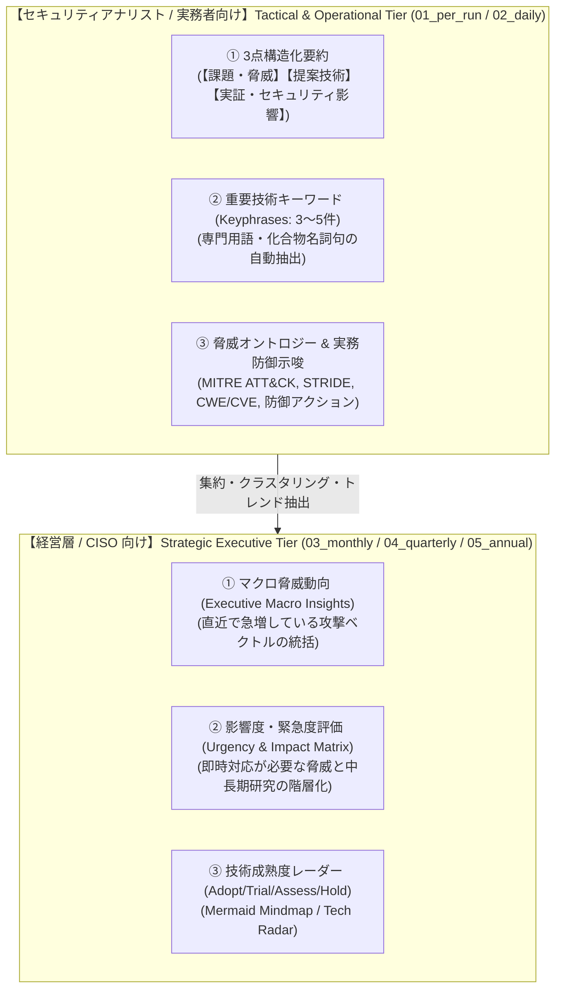
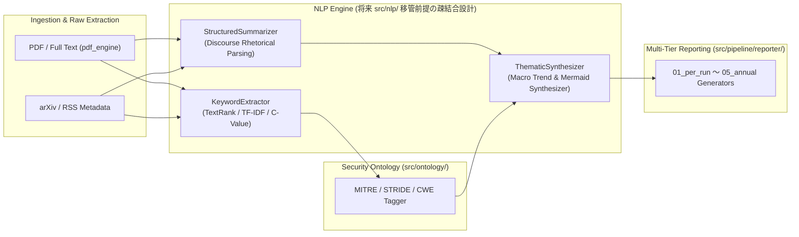

# [FEAT/ENH] エグゼクティブサマリーの高度化（NLP重要キーワード抽出・3点構造化要約・横断的動向シンセシス） (ID: 109)

## 1. 概要 / Summary
現状のエグゼクティブサマリー（`outputs/executive_summaries/` 01〜05階層）は、固定テンプレートに見出しと定型文（例:「`タイトル — 課題分析と防御モデルの検証`」）およびリンクを当てはめただけの機械的な一覧表にとどまっており、各論文の具体的な新規性や技術的要約、重要キーワード、および横断的な脅威トレンドが欠落している。

本 Issue では、全13専門エージェントの合意（特に **IT Strategist (ST)** による To-Be 定義、**Information Security Specialist (SC)** による脅威オントロジー連携、**Systems Architect (SA)** & **IT Specialist (IR)** による将来の `src/nlp/` 集約を見据えたシステム設計）に基づき、成果物レポートの実用性とインテリジェンス価値を抜本的に向上させる。

---

## 2. トレーサビリティ / Traceability
- **包括的設計書**: [DSN-19: 自然言語処理（NLP）重要キーワード抽出・3点構造化要約・横断的動向シンセシス包括的アーキテクチャ設計書](../designs/DSN-19-nlp_keyphrase_extraction_and_structured_synthesis.md)
- **全体高位アーキテクチャ設計書**: [DSN-01: システム全体高位アーキテクチャ設計書](../designs/DSN-01-high_level_design.md)
- **5層エグゼクティブサマリー規定**: `.agents/AGENTS.md` (Section 5)
- **関連スキル**: `.agents/skills/executive-summary-generator/SKILL.md`, `.agents/skills/paper-trend-analyzer/SKILL.md`

---

## 3. 🎯 To-Be（あるべき姿）と逆算ドリルダウン要件

### A. 👔 経営層 / CISO 向け To-Be (03_monthly, 04_quarterly, 05_annual)
1. **マクロ脅威サマリー（Executive Macro Insight）**:
   - 収集論文群から今期急増している攻撃手法（例: 「LLMエージェントへの間接メモリポイズニング」「カウンタ型RowHammer回避」）の横断総括。
2. **経営判断・投資示唆（Strategic Recommendations）**:
   - Zero Trust (NIST SP 800-207)、耐量子暗号 (PQC) 移行、AI ガードレール等の優先投資領域。
3. **視覚的技術レーダー（Mermaid Mindmap / Landscape）**:
   - 注目トピックの成熟度と動向を可視化。

### B. 🛡️ セキュリティアナリスト / 実務者向け To-Be (01_per_run, 02_daily)
1. **3点構造化エグゼクティブ要約（Structured 3-Point Summary）**:
   - **【課題・脅威】**: 既存システムのどのような脆弱性・脅威に着目したか？
   - **【提案技術】**: どのような新規アルゴリズム・フレームワーク・PoC を提示したか？
   - **【実証・影響】**: 既存の防御機構やベンチマークに対する実証結果・回避成功率・オーバーヘッド。
2. **重要技術キーワード（Keyphrases: 3〜5件）**:
   - 論文テキストから抽出された専門用語（例: `Memory Poisoning`, `DRAM Timing`, `Context Escalation`）。
3. **セキュリティ標準オントロジー & 実務防御アクション**:
   - `MITRE ATT&CK Techniques` (例: `T1059`), `STRIDE` (例: `Elevation of Privilege`), `CWE/CVE` 分類。
   - SOC / CSIRT 向け検知ポイントや開発者向け緩和コードパターン。

---

## 4. 🏗️ システム設計とアーキテクチャ (将来の `src/nlp/` 集約設計)

### 設計の要点:
1. **将来的な `src/nlp/` 独立パッケージ化を見据えた疎結合設計**:
   - `KeywordExtractor`（キーワード抽出）と `StructuredSummarizer`（構造化要約）はドメイン知識を持たない純粋な自然言語処理モジュールとして実装し、将来的に `src/nlp/` へワンステップで移行可能とする。
2. **TextRank / C-Value アルゴリズムによる高精度キーワード抽出**:
   - ゼロ外部依存の純粋 Python で共起グラフ（PageRank）および複合名詞句（Compound Noun Phrases）抽出を実装。
3. **談話構造解析（Discourse Marker Parsing）による3点要約**:
   - アブストラクトから背景・手法・結果の言及箇所を構文・マーカー解析し、定型文を完全排除した日本語要約を動的合成。
4. **トピック・クラスタリングとマクロ動向合成**:
   - 複数論文のドメイン分類・キーワードから急上昇クラスターを同定し、サマリー冒頭の「主要セキュリティ動向」と Mermaid マインドマップを自動出力。

---

## 5. 影響範囲と関連ファイル / Scope and Affected Files

### A. NLP & 変換エンジン層 (`src/pipeline/transformer/`)
- [x] [`src/pipeline/transformer/keyword_extractor.py`](../../src/pipeline/transformer/keyword_extractor.py) (新規: TextRank/C-Value キーワード抽出、将来 `src/nlp` 移管可能設計)
- [x] [`src/pipeline/transformer/structured_summarizer.py`](../../src/pipeline/transformer/structured_summarizer.py) (新規: 談話構造解析による3点構造化要約エンジン)
- [x] [`src/pipeline/transformer/thematic_synthesizer.py`](../../src/pipeline/transformer/thematic_synthesizer.py) (新規: 横断動向シンセシス & Mermaidマップ生成)
- [x] [`src/pipeline/transformer/__init__.py`](../../src/pipeline/transformer/__init__.py) (エクスポート更新)

### B. レポーター & サマリー生成層 (`src/pipeline/reporter/`)
- [x] [`src/pipeline/reporter/summary_generator.py`](../../src/pipeline/reporter/summary_generator.py) (サマリー生成ロジックの刷新)
- [x] [`src/pipeline/reporter/index_updater.py`](../../src/pipeline/reporter/index_updater.py) (インデックスおよび上位サマリー更新)

### C. テストスイート (`tests/pipeline/`)
- [x] [`tests/pipeline/test_keyword_extractor.py`](../../tests/pipeline/test_keyword_extractor.py) (新規単体テスト)
- [x] [`tests/pipeline/test_structured_summarizer.py`](../../tests/pipeline/test_structured_summarizer.py) (新規単体テスト)
- [x] [`tests/pipeline/test_thematic_synthesizer.py`](../../tests/pipeline/test_thematic_synthesizer.py) (新規単体テスト)

---

## 6. 実装ステップ / Implementation Steps
Target Branch: `feat/109-enhance-executive-summaries-with-nlp-and-synthesis`

1. **ステップ 1 (NLP基盤)**: `keyword_extractor.py` の実装（純粋Python、TextRank / C-Value / CJK対応）。
2. **ステップ 2 (構造化要約)**: `structured_summarizer.py` の実装（アブストラクトから背景・手法・結果を談話解析して3点日本語要約生成）。
3. **ステップ 3 (動向シンセシス)**: `thematic_synthesizer.py` の実装（トピック分類・マクロインサイト・Mermaid生成）。
4. **ステップ 4 (レポーター統合)**: `summary_generator.py`, `index_updater.py` を刷新し、新テーブル形式・インサイトブロックを出力。
5. **ステップ 5 (検証 & 品質ゲート)**: 単体テスト作成、`make check_format`、`make py_compile`、`make static_analysis` (Xenon 100% Rank A)、全テスト 100% PASS。

---

## 7. 完了条件 / Success Criteria (DoD)
- [x] エグゼクティブサマリー内の論文一覧において、定型文「課題分析と防御モデルの検証」が完全に排除され、各論文固有の3点構造化要約が生成されていること。
- [x] 各論文に 3〜5 件の重要技術キーワード（Keyphrases）およびセキュリティ分類（STRIDE / MITRE）が付与されていること。
- [x] 日次・月次サマリーに横断的な「主要セキュリティ動向・脅威インサイト」および Mermaid マップが自動合成されていること。
- [x] 将来の `src/nlp/` への集約が容易なよう、NLP モジュールが純粋 Python かつドメイン非依存なインターフェースで構成されていること。
- [x] `make check_format`、`make py_compile`、`make static_analysis` (Xenon 100% Rank A) が 100% PASS すること。
- [x] 新設テストを含む全 pytest テストスイートが 100% PASS すること。
