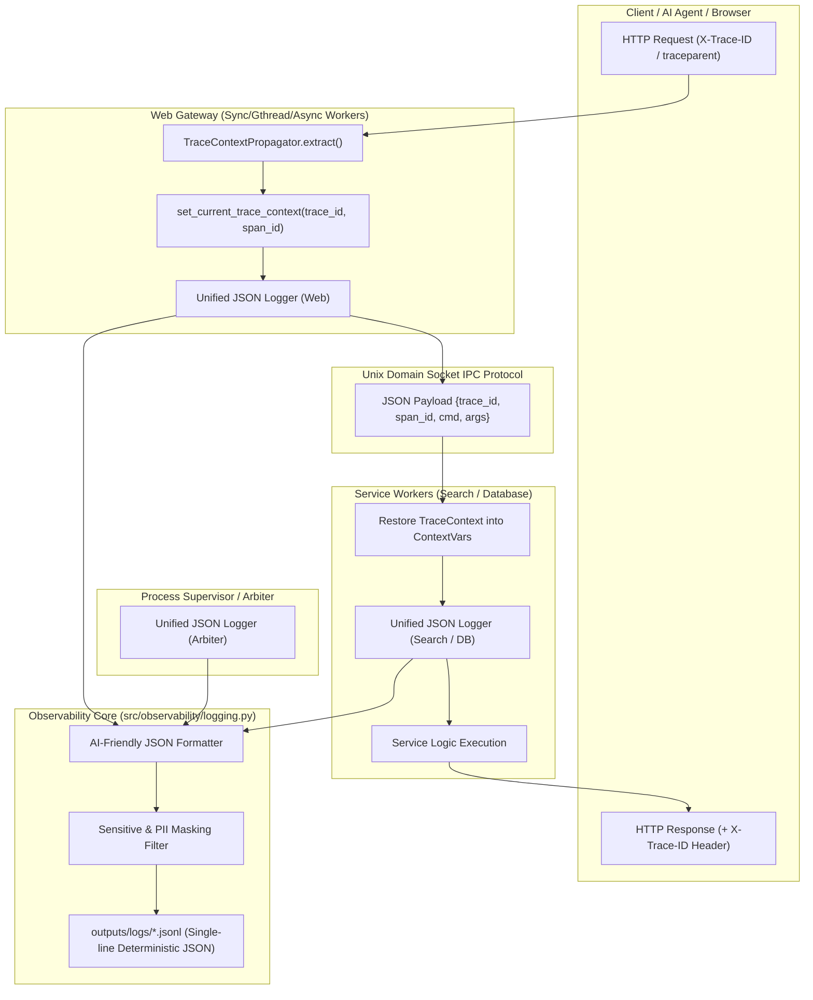

# [FEAT/ENH] AIフレンドリー統一構造化JSONログ基盤(Unified JSON Logger)・Trace ID分散追跡・機密情報マスキングフィルターの実装 (ID: 115)

## 1. 概要 / Summary
システムの運用性・可観測性（Observability）・セキュリティコンプライアンス・および **AIエージェントによる自動障害分析（AI-Assisted Root Cause Analysis）の容易性** を飛躍的に向上させるため、リポジトリ全体のロギング基盤を標準化・刷新する。

### 解決する課題
1. **非構造化プレーンテキスト混在の排除**:
   - `outputs/supervisor/supervisor.log` や `outputs/logs/web_server.log` に `print()` 由来のタイムスタンプなしテキスト、独自絵文字プレフィックス、非構造化スタックトレースが混在し、ログ集約ツール（Datadog/CloudWatch）や AI エージェントによる機械パースが極めて困難であった。
2. **リクエスト横断追跡（Trace ID）の欠落**:
   - Web Gateway $\rightarrow$ Search / Database サービスワーカー（IPC）$\rightarrow$ Supervisor 間の処理が分断されており、1つのリクエストに起因する障害をエンドツーエンドで追跡できなかった。
3. **AIフレンドリー設計・分析容易性の欠如**:
   - エラー発生時のスタックトレースがトークン消費の激しい生文字列のままであり、エラー原因（`cause`）や修復サジェスト（`remediation_hint`）などのセマンティック構造化情報がなかった。
4. **機密情報・PII 漏洩リスク**:
   - 検索クエリや MCP 引数、ヘッダーにパスワードやトークン、個人情報（PII）が含まれた場合の自動マスキング機構が存在しなかった。

---

## 2. アーキテクチャ設計と AI フレンドリー仕様



### AIフレンドリー & 高分析性 JSON ログスキーマ定義
各ログ行は厳格な 1行完結の JSON（JSON Lines / `.jsonl`）形式とし、OpenTelemetry および Elastic Common Schema (ECS) に準拠した決定論的キー構造を採用する：

```json
{
  "timestamp": "2026-09-02T21:45:00.123456Z",
  "level": "ERROR",
  "trace_id": "c4b8e8f289a14e76b99d3f0e8a719c2a",
  "span_id": "9a14e76b99d3f0e8",
  "service": "search",
  "logger": "search.engine.vector",
  "module": "vector_index",
  "func": "search_knn",
  "line": 142,
  "pid": 11625,
  "event": {
    "category": "search",
    "action": "query_execution",
    "outcome": "failure"
  },
  "message": "Vector index search failed due to dimension mismatch",
  "http": {
    "method": "POST",
    "path": "/api/search",
    "status_code": 500,
    "latency_ms": 42.15,
    "client_ip": "127.0.0.1"
  },
  "error": {
    "class": "ValueError",
    "message": "Expected vector dimension 768, got 512",
    "stacktrace": [
      "File \"src/search/engine.py\", line 142, in search_knn",
      "File \"src/search/vector.py\", line 88, in compute_cosine"
    ]
  },
  "diagnostic": {
    "cause": "DIMENSION_MISMATCH",
    "affected_subsystem": "vector_engine",
    "remediation_hint": "Check model embedding configuration in config/search.toml",
    "is_transient": false
  }
}
```

---

## 3. トレーサビリティ / Traceability
- **関連設計書**:
  - [DSN-12: 汎用プロセススーパーバイザー & 調停基盤包括的アーキテクチャ設計書](../designs/DSN-12-process_supervisor_and_arbiter.md)
  - [DSN-13: 分散オブザーバビリティ基盤設計書](../designs/DSN-13-distributed_observability.md)
- **関連標準規約**:
  - W3C Trace Context Recommendation (2021)
  - OpenTelemetry Log Data Model v1.26
  - CWE-532: Insertion of Sensitive Information into Log File

---

## 4. 影響範囲と関連ファイル / Scope and Affected Files

### 1. オブザーバビリティ & ロギング基盤層
- [ ] [src/observability/logging.py](../../src/observability/logging.py) `[NEW/MODIFY]`:
  - `StructuredJsonFormatter`: ISO 8601 UTC 時刻、OTel 準拠フィールド、診断情報、スタックトレース配列化。
  - `ContextVarsTraceFilter`: `contextvars` から `trace_id` / `span_id` を自動抽出し `LogRecord` に付与。
  - `SensitiveMaskingFilter`: パスワード、JWT、Bearer トークン、API キー、メールアドレス、カード番号の正規表現マスキング。
  - `configure_logging(service_name, log_level, log_dir)`: 共通ロギング初期化関数。
- [ ] [src/observability/masking.py](../../src/observability/masking.py) `[NEW]`:
  - 高速正規表現コンパイル済みマスキングルール（`mask_sensitive_data`, `mask_dict_payload`）。
- [ ] [src/observability/propagation.py](../../src/observability/propagation.py):
  - `contextvars` 対応ヘルパー（`get_current_trace_id`, `set_current_trace_context`）の提供。

### 2. Web Gateway & サーバー層
- [ ] [src/web/gateway/handlers.py](../../src/web/gateway/handlers.py):
  - HTTP リクエスト受信時に `TraceContextPropagator.extract()` で `trace_id` を設定。
  - レスポンスヘッダーに `X-Trace-ID` を付加。
  - リクエスト完了時に構造化 HTTP アクセスログ（`level: INFO`, レイテンシ ms）を出力。
- [ ] [src/web/server.py](../../src/web/server.py):
  - レガシーな標準出力 `print` や Apache 風ログ出力を廃止し、統一ロガーへ移行。

### 3. Search & Database サービスワーカー層
- [ ] [src/search/server/service.py](../../src/search/server/service.py):
  - IPC メッセージから `trace_id` を復元してコンテキストに設定。
  - クエリ実行ログ（`query_log.jsonl`）を共通スキーマに統一。
- [ ] [src/database/service.py](../../src/database/service.py):
  - SQL 実行および WAL フラッシュログを構造化 JSON で出力。

### 4. Supervisor & Arbiter 層
- [ ] [src/supervisor/arbiter.py](../../src/supervisor/arbiter.py):
  - `print` によるログ出力を `logging.getLogger("supervisor.arbiter")` に切り替え。
  - ワーカー起動、停止、シグナル配送、ヘルスチェック異常、クラッシュリカバリを構造化 JSON ログで記録。
- [ ] [src/supervisor/workers/base.py](../../src/supervisor/workers/base.py):
  - ワーカープロセスの標準ロガー初期化。

### 5. CLI & AI 解析ツール
- [ ] [src/supervisor/cli.py](../../src/supervisor/cli.py):
  - `supervisor logs [--tail N] [--service NAME] [--level LEVEL] [--trace-id ID] [--compact]` サブコマンドの実装（AI エージェント / 運用者向けの高速ログ抽出・要約 CLI）。

### 6. テスト
- [ ] [tests/observability/test_logging.py](../../tests/observability/test_logging.py) `[NEW]`:
  - 構造化 JSON スキーマ検証、ISO 8601 時刻、スタックトレース配列化テスト。
  - パスワード・JWT・PII マスキング精度テスト。
  - Trace ID の `contextvars` 伝播テスト。
- [ ] [tests/supervisor/test_structured_logging.py](../../tests/supervisor/test_structured_logging.py) `[NEW]`:
  - Supervisor デーモン起動時の JSON ログ生成検証。

---

## 5. 実装方針 / Implementation Plan
Target Branch: `feat/115-implement-unified-structured-json-logging-and-trace-id-tracking`

### Step 1: マスキングエンジンおよび JSON フォーマッタの実装 (`src/observability/`)
1. `src/observability/masking.py`:
   - `MASK_PATTERNS`:
     - Authorization ヘッダー / Bearer トークン: `r"(?i)(bearer|token|authorization)\s*[:=]\s*['\"]?([a-zA-Z0-9_\-\.]{8,})['\"]?"`
     - パスワード / シークレット: `r"(?i)(password|secret|api[_-]?key|passwd)\s*[:=]\s*['\"]?([^'\",\s]+)['\"]?"`
     - メールアドレス (PII): `r"\b[A-Za-z0-9._%+-]+@[A-Za-z0-9.-]+\.[A-Z|a-z]{2,}\b"`
     - クレジットカード (PAN): `r"\b(?:\d{4}[- ]?){3}\d{4}\b"`
   - `mask_text(text: str) -> str` および `mask_data(obj: Any) -> Any` を実装。
2. `src/observability/logging.py`:
   - `StructuredJsonFormatter(logging.Formatter)`:
     - 各 `LogRecord` を辞書化し、ISO 8601 UTC 時刻、`trace_id`、`span_id`、`event`、`error`、`diagnostic` を構築。
     - `json.dumps(..., ensure_ascii=False)` で 1行出力。

### Step 2: Trace ID コンテキストと伝播機構の整備
1. `src/observability/propagation.py`:
   - `current_trace_id_var = ContextVar("current_trace_id", default="")`
   - `current_span_id_var = ContextVar("current_span_id", default="")`
   - `get_current_trace_id() -> str`, `set_current_trace_context(trace_id: str, span_id: str)`
2. `logging.Filter` 継承の `TraceContextFilter` でログレコードへ自動注入。

### Step 3: Web Gateway への統合
1. `src/web/gateway/handlers.py`:
   - リクエスト受信時: `TraceContextPropagator.extract(environ)` または `generate_trace_id()` で `trace_id` を確定。
   - `set_current_trace_context(trace_id, span_id)` を呼び出し。
   - レスポンスヘッダーに `("X-Trace-ID", trace_id)` を追加。
   - リクエスト終了時に `logger.info("HTTP Request Completed", extra={"http": {...}})` を出力。

### Step 4: Search / Database サービスワーカー IPC 連携
1. IPC メッセージプロトコルに `trace_id` フィールドを追加。
2. ワーカー側で受信時に `set_current_trace_context(trace_id, span_id)` を適用。
3. `query_log.jsonl` や SQL 実行ログに同一の `trace_id` を付与。

### Step 5: Supervisor Arbiter / Worker ログの統一
1. `src/supervisor/arbiter.py` の `print()` 出力をすべて `logging.getLogger("supervisor.arbiter")` 経由に変更。
2. `outputs/supervisor/supervisor.log` を `.jsonl` 形式で出力（または設定によりコンソール用ハイライト表示とファイル用 JSON を自動分岐）。

### Step 6: AI 解析用 CLI (`supervisor logs`) の実装
1. `src/supervisor/cli.py` に `logs` サブコマンドを追加。
2. 指定した `trace_id` に紐づく全サービスのイベントを時系列（ウォーターフォール）で一覧出力する機能を提供。

### Step 7: 品質ゲート検証
- `pytest tests/observability/ tests/supervisor/`
- `xenon --max-absolute A --max-modules A --max-average A src/` (全モジュール CC $\le 5$)
- `flake8 src/ tests/`
- `mypy --strict src/observability`

---

## 6. セキュリティ脅威モデルと対策 / Threat Model & Mitigations
- **脅威 1 (CWE-532 ログへの機密情報混入)**:
  - 攻撃者が検索クエリやパラメータに悪意あるペイロード（トークンや個人情報）を注入し、ログファイルを介した情報漏洩を狙う。
  - *対策*: `SensitiveMaskingFilter` により、ログ文字列化前に再帰的にマスキングを実施。
- **脅威 2 (Log Injection / CRLF 改行インジェクション)**:
  - クエリ内に改行文字（`\r\n`）を混入させて偽のログ行を偽造する。
  - *対策*: JSON 文字列エスケープ処理（`json.dumps`）により改行は `\n` にエスケープされ、1行1レコードの完全性を保証。
- **脅威 3 (ログフラッドによる DoS / ディスク枯渇)**:
  - 大量のエラーリクエストによるログディスク容量圧迫。
  - *対策*: スタックトレースの最大深度制限および冗長ログのサンプリング。

---

## 7. 完了条件 / Success Criteria (DoD)
- [ ] すべてのログが ISO 8601 UTC タイムスタンプ・ログレベル・発生場所・メッセージ・Trace ID を含む JSON Lines (`.jsonl`) 形式で出力されること。
- [ ] Web リクエストから Search / Database ワーカーの IPC 処理まで同一の `trace_id` で横断追跡可能であること。
- [ ] 認証トークン、パスワード、クレジットカード、メールアドレス等の機密情報がログ出力時に確実に `***MASKED***` されること。
- [ ] エラーログに構造化 `error`（配列型スタックトレース）および AI 向け `diagnostic`（原因と修復ヒント）が付与されること。
- [ ] `supervisor logs` CLI で `trace_id` による横断検索・フィルタリングができること。
- [ ] 全単体・統合テストが 100% PASS すること。
- [ ] Xenon 循環的複雑度 Grade A (CC $\le 5$) を維持すること。
