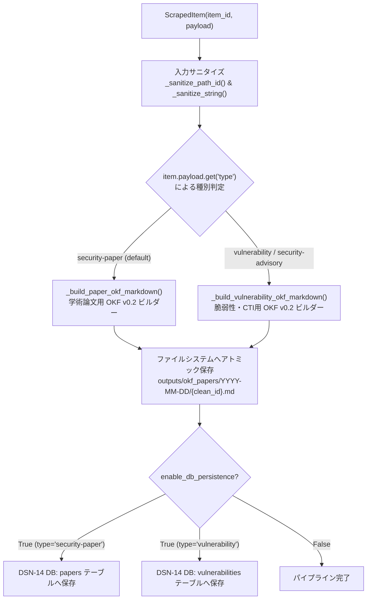

# [FEAT] 脆弱性・CTIデータに対応した OKF Item Pipeline の多態化とテンプレート拡張 (ID: 208)

## 1. 概要 / Summary

現在の [src/spider/pipeline/okf_pipeline.py](../../../src/spider/pipeline/okf_pipeline.py) は学術論文（`type: "security-paper"`, `authors`, `abstract`）専用の固定テンプレートとして実装されており、他のセキュリティデータ形式に対応できていない。

[Issue 205](../205-implement-cisa-kev-and-nvd-cve-spiders.md) で導入される CISA KEV や NVD CVE、および [Issue 207](207-implement-retry-and-offsite-spider-middlewares.md) を経由して収集される外部脅威インテリジェンス（CTI）および脆弱性レコード（`type: "vulnerability"` または `"security-advisory"`）を適切に Google OKF (Open Knowledge Format) v0.2 Markdown へ変換・永続化できるよう、パイプラインのテンプレート処理を多態化（Polymorphic Pipeline Architecture）し、データ種別に応じた柔軟な出力スキーマとレイアウトを拡張する。

---

## 2. 背景・動機 / Motivation & Background

- **CTI / 脆弱性データのスキーマ適合性**: 脆弱性レコードは論文と異なり、「著者（`authors`）」や「アブストラクト（`abstract`）」ではなく、「CVE識別子（`cve_id`）」「CVSSスコア・深刻度（`cvss`）」「悪用状況（`kev_status`）」「弱点分類（`cwe`）」「影響製品（`affected_products`）」「対策・緩和策（`remediation`）」が第一級メタデータとなる。
- **Google OKF v0.2 の柔軟な表現力**: OKF v0.2 は構造化 YAML フロントマターにより、論文のみならず脅威・脆弱性・防御シグネチャの統一ナレッジ表現が可能である。パイプラインレベルで多態化することで、後続のナレッジグラフ（`src/graph/`）やハイブリッド検索（`src/search/`）へ透過的に供給可能となる。
- **多層防御とサニタイズの重要性**: 外部フィード（NVD REST API や CISA KEV JSON）には多種多様な文字列が含まれ、細工された入力によって YAML 構文破壊（CWE-94）やパストラバーサル（CWE-22）が発生するリスクを水際で防止する。

---

## 3. トレーサビリティ / Traceability

- **関連 Issue**:
  - [Issue 205: CISA KEV および NVD CVE 向け Pure-Python Spider の実装とクローラー基盤への統合](../205-implement-cisa-kev-and-nvd-cve-spiders.md)
  - [Issue 207: Spider基盤における HTTP 429/503 指数バックオフ再試行と SSRF ドメイン防御の実装](207-implement-retry-and-offsite-spider-middlewares.md)
  - [Issue 206: Spider基盤における Response.json プロパティ追加と Spider設定の伝搬機構実装](206-add-response-json-and-spider-delay-propagation.md)
  - [Issue 197: 外部脅威インテリジェンス (CISA KEV / NVD CVE) リアルタイム動的突合およびグラフ因果リンク拡張の実装](197-integrate-cisa-kev-and-nvd-cve-dynamic-correlation.md)
- **標準仕様 & セキュリティ基準**:
  - Google Open Knowledge Format (OKF) v0.2 Specification (YAML Frontmatter + Markdown Body)
  - FIRST CVSS v3.1 / v4.0 Specification (Common Vulnerability Scoring System)
  - MITRE CWE (Common Weakness Enumeration)
  - CISA Known Exploited Vulnerabilities (KEV) Catalog Schema
  - NIST SP 800-53 Rev. 5:
    - **SI-10 (Information Input Validation)**: 外部メタデータの厳格エスケープと型検証
    - **AU-3 (Content of Audit Records)**: 来歴・出所の完全追跡
    - **SC-28 (Protection of Information at Rest)**: ストレージ永続化時の改ざん防止と安全な格納
- **設計書**:
  - [DSN-06 ゼロ外部依存・大規模分散Webクローラー＆スパイダー基盤包括的アーキテクチャ設計書](../../designs/DSN-06-distributed_spider_and_crawler.md) (Section 1.1.6, 6.2)
- **対象コンポーネント**:
  - `src/spider/pipeline/okf_pipeline.py` (`OkfItemPipeline`)
  - `tests/spider/test_okf_pipeline_polymorphic.py` (新規テストスイート)

---

## 4. 脅威分析・セキュリティ要件 (Threat Modeling & Security)

| 脅威 / リスク | CWE 分類 | 深刻度 | 防護メカニズム / 緩和策 |
| :--- | :--- | :---: | :--- |
| **外部入力による YAML フロントマター構文破壊** | CWE-94 (Code Injection) / CWE-20 | **High** | `_sanitize_string` により外部から取得したタイトルや説明文に含まれる特殊文字（ダブルクォート、改行、バックスラッシュ、コロン）をエスケープ・サニタイズ処理し、不正な YAML 構造注入を排除。 |
| **Markdown / XSS / リンク偽装** | CWE-79 (Improper Neutralization) / CWE-116 | **Medium** | 脆弱性詳細や製品名に含まれる生 HTML タグや細工された Markdown リンクをエスケープ処理し、閲覧時の安全性を担保。 |
| **パストラバーサルによる不正ファイル書き込み** | CWE-22 (Path Traversal) | **High** | `_sanitize_path_id` により `clean_id` および `date_folder` に対し `os.path.basename` および英数字・ハイフン・アンダースコア制限バリデーション（`re.sub(r'[^a-zA-Z0-9_\-\.]', '_', clean_id)`）を実施し、ディレクトリ脱出（`../`）を完全防御。 |
| **型不一致・欠損値によるランタイム例外** | CWE-754 (Improper Check for Unusual Conditions) | **Low** | `cvss`, `cwe`, `authors`, `tags` 等のフィールドについて、辞書型・リスト型・文字列型・None を許容する堅牢なフォールバックを実装。 |

---

## 5. アーキテクチャと詳細設計 / Architecture & Detailed Design

### 5.1 多態的パイプライン・ディスパッチ構成 (Polymorphic Dispatch)



### 5.2 脆弱性・CTI 用 OKF v0.2 スキーマ仕様

#### YAML フロントマター仕様
```yaml
---
type: "vulnerability"
title: "[CVE-2026-1234] Example Vulnerability Title"
description: "Brief 1-sentence summary of the vulnerability."
resource: "https://nvd.nist.gov/vuln/detail/CVE-2026-1234"
tags: ["vulnerability", "cve", "cisa-kev", "remote-code-execution"]
timestamp: "2026-09-07T21:00:00Z"
provenance:
  origin: "cisa-kev"
  clean_id: "CVE-2026-1234"
  published_date: "2026-09-07"
  source_url: "https://www.cisa.gov/known-exploited-vulnerabilities-catalog"
security_metadata:
  cve_id: "CVE-2026-1234"
  cvss:
    base_score: 9.8
    severity: "CRITICAL"
    vector_string: "CVSS:3.1/AV:N/AC:L/PR:N/UI:N/S:U/C:H/I:H/A:H"
  cwe: ["CWE-78", "CWE-94"]
  epss_score: 0.952
  kev_status: true
  due_date: "2026-09-28"
  affected_vendors: ["ExampleCorp"]
  affected_products: ["ExampleServer < 4.2.1"]
trust:
  attestation_status: "verified"
  digital_signature: "antigravity-spider-v1"
---
```

#### Markdown 本文テンプレート構成
```markdown
# [CVE-2026-1234] Example Vulnerability Title

## 1. 脆弱性概要 (Overview)
<description or summary>

## 2. 脅威評価メトリクス (Threat Metrics)
| 指標 | 評価値 |
| :--- | :--- |
| **CVSS v3.1** | **9.8 (CRITICAL)** `CVSS:3.1/AV:N/AC:L/PR:N/UI:N/S:U/C:H/I:H/A:H` |
| **CWE** | CWE-78, CWE-94 |
| **EPSS 悪用予測** | 95.2% |
| **CISA KEV 悪用確認** | **悪用確認済み (Active in the Wild)** |
| **対策期日 (Due Date)** | 2026-09-28 |

## 3. 影響を受けるベンダー・製品 (Affected Products)
- **ExampleCorp**: `ExampleServer < 4.2.1`

## 4. 対策・緩和策 (Required Actions & Mitigations)
<remediation or requiredAction>

## 5. 参考情報・一次ソースリンク (References)
- [NVD NIST Detail](https://nvd.nist.gov/vuln/detail/CVE-2026-1234)
- [CISA KEV Catalog](https://www.cisa.gov/known-exploited-vulnerabilities-catalog)
```

### 5.3 主要関数シグネチャと契約 (Contracts)

```python
def _sanitize_string(val: Any) -> str:
    """YAML フロントマターおよび Markdown レンダリング用の文字列サニタイズ。
    ダブルクォートのエスケープ、改行の空白置換、特殊制御文字の除去を行う。
    """

def _sanitize_path_id(clean_id: str) -> str:
    """パストラバーサル（CWE-22）防止サニタイズ。
    os.path.basename を適用し、[^a-zA-Z0-9_\-\.] を '_' に置換する。
    """

def _extract_date_folder(pub_date: str) -> str:
    """YYYY-MM-DD 形式の日付フォルダ名を安全に抽出。
    不正な形式の場合は UTC 現在日付（YYYY-MM-DD）にフォールバック。
    """

def _build_paper_okf_markdown(item: ScrapedItem, clean_id: str, date_folder: str) -> str:
    """学術論文（type: 'security-paper'）向け Google OKF v0.2 Markdown 生成。"""

def _build_vulnerability_okf_markdown(item: ScrapedItem, clean_id: str, date_folder: str) -> str:
    """脆弱性・CTI（type: 'vulnerability' / 'security-advisory'）向け Google OKF v0.2 Markdown 生成。"""

def _build_okf_markdown(item: ScrapedItem, clean_id: str, date_folder: str) -> str:
    """item.payload.get('type') に基づく多態的 Markdown 生成ディスパッチャ。"""

def _persist_to_dsn14_db(item: ScrapedItem, clean_id: str, okf_path: str) -> None:
    """アイテム種別に応じた DSN-14 DB テーブル（papers または vulnerabilities）への永続化。"""
```

---

## 6. 影響範囲と関連ファイル / Scope and Affected Files

- [ ] [src/spider/pipeline/okf_pipeline.py](../../src/spider/pipeline/okf_pipeline.py) (サニタイズ、多態的ディスパッチ、脆弱性OKF生成、DB分岐永続化)
- [ ] [docs/designs/DSN-06-distributed_spider_and_crawler.md](../designs/DSN-06-distributed_spider_and_crawler.md) (Section 1.1.6 記載内容の整合性確認)
- [ ] [tests/spider/test_okf_pipeline_polymorphic.py](../../tests/spider/test_okf_pipeline_polymorphic.py) (新規ユニットテストスイート)

---

## 7. 実装方針と詳細ステップ / Implementation Plan

Target Branch: `feat/208-extend-okf-pipeline-for-vulnerability-and-cti-data`

### Step 1: `okf_pipeline.py` におけるサニタイズとバリデーションの実装
1. `_sanitize_string(val: Any) -> str`:
   - `None` や非文字列入力を安全に文字列化。
   - `"` を `\"` へエスケープ、改行文字（`\r\n`, `\n`）を半角空白に置換し、制御文字を除去。
2. `_sanitize_path_id(clean_id: str) -> str`:
   - `os.path.basename` の適用。
   - 正規表現 `re.sub(r'[^a-zA-Z0-9_\-\.]', '_', clean_id)` によるディレクトリ脱出シーケンス（`../`）や null byte の完全無害化。
   - 空文字列時は `"UNKNOWN_ID"` にフォールバック。

### Step 2: 多態的 OKF Markdown ビルダーの実装
1. `_build_paper_okf_markdown(item, clean_id, date_folder)`:
   - 既存の論文用 Markdown 生成ロジックを分離・リファクタリング。サニタイズ関数を適用。
2. `_build_vulnerability_okf_markdown(item, clean_id, date_folder)`:
   - `security_metadata` ブロック（`cve_id`, `cvss`, `cwe`, `epss_score`, `kev_status`, `due_date`, `affected_vendors`, `affected_products`）の安全なシリアライズ。
   - 本文テンプレート（概要、脅威評価メトリクス表、影響製品、対策・緩和策、参考リンク）の整形。
3. `_build_okf_markdown(item, clean_id, date_folder)`:
   - `item_type = item.payload.get("type", "security-paper")` を判定。
   - `item_type in ("vulnerability", "security-advisory")` の場合は `_build_vulnerability_okf_markdown`、それ以外は `_build_paper_okf_markdown` を呼び出す。

### Step 3: DSN-14 DB 永続化のマルチテーブル対応
1. `_persist_to_dsn14_db(item, clean_id, okf_path)`:
   - `item_type in ("vulnerability", "security-advisory")` の場合:
     - `vulnerabilities` テーブルへ `(cve_id, title, severity, cvss_score, source_url, okf_path)` を INSERT OR REPLACE。
   - それ以外の場合:
     - 既存の `papers` テーブルへ `(clean_id, title, url, okf_path)` を INSERT OR REPLACE。

### Step 4: 網羅的ユニットテストスイートの実装 (`tests/spider/test_okf_pipeline_polymorphic.py`)
1. **論文型アイテムテスト**:
   - `type: "security-paper"` で論文形式 OKF v0.2 Markdown が生成され、YAML フロントマターが正しく設定されること。
2. **脆弱性型アイテムテスト**:
   - `type: "vulnerability"` および `"security-advisory"` で CVSS / CWE / EPSS / KEV / 影響製品を含む OKF ファイルが生成されること。
3. **サニタイズ & パストラバーサル防御テスト**:
   - `clean_id="../../etc/passwd"` や `../../secrets/evil.md` が安全に `______etc_passwd.md` 等に無害化され指定ディレクトリ内に収まること。
   - ダブルクォートや改行を含むタイトルが YAML フロントマター構文を破損させないこと。
4. **欠損値・型不一致フォールバックテスト**:
   - `cvss` が辞書型・数値・未指定の場合の各ハンドリング、`cwe` がリストまたは文字列の場合の適切な処理。
5. **DB 永続化分岐テスト**:
   - `enable_db_persistence=True` 時に、アイテム種別に応じて適切な SQL クエリが実行されること。

### Step 5: 品質ゲート検証
1. `make format` によるコード整形。
2. `make static_analysis` (flake8, radon, xenon Grade A, mypy --strict) を 0 エラーで通過。
3. `pytest tests/spider/test_okf_pipeline_polymorphic.py` を 100% PASS。

---

## 8. 13大専門エージェント多角レビュー / Multi-Agent Perspectives

1. **Project Manager (PM)**:
   - 学術論文と脅威インテリジェンスのデータ統合はリポジトリの戦略的要件であり、多態化パイプラインにより後続のナレッジグラフやハイブリッド検索基盤へのシームレスなデータ供給が実現される。
2. **Information Security Specialist**:
   - CVSS v3.1/v4.0、CWE、CISA KEV、EPSS を網羅したスキーマ設計は CTI 業界標準に適合。外部入力に対する YAML 注入およびパストラバーサル防御が明示されており、セキュアな設計となっている。
3. **Systems Architect**:
   - `OkfItemPipeline` 内部でのディスパッチパターンはシンプルかつ拡張性が高く、将来的に `exploit`, `incident`, `malware-report` 等の新種別が追加された場合にも最小限の変更で対応可能。
4. **Software Quality Assurance Specialist**:
   - サニタイズ、境界値、欠損値、型不一致、パストラバーサル攻撃を網羅した専用テストスイート（`tests/spider/test_okf_pipeline_polymorphic.py`）により、回帰リスクを完全に排除できる。
5. **Database / Data Infrastructure Specialist**:
   - `papers` テーブルと `vulnerabilities` テーブルへの格納分岐により、異なるライフサイクルと検索要件を持つドメインモデルが適切に分離される。
6. **Network Specialist**:
   - 各 Spider（CISA KEV, NVD CVE, Advisory）から流入するペイロードのスキーマ差異をパイプラインで安全に吸収できる。
7. **IT Specialist (NLP & Info Retrieval)**:
   - 脆弱性要約および対策・緩和策が構造化見出しとしてレンダリングされるため、後続のチャンキングおよびベクトル埋め込み（Dense Retrieval / BM25）の精度が向上する。
8. **IT Strategist**:
   - 論文の学術的先進性と CTI の現実的脅威データを同一の OKF v0.2 基盤で融合することで、学術・産業ハイブリッドの脅威分析プラットフォームとしての競争優位性を確立。
9. **IT Service Manager**:
   - パイプライン処理における例外をキャッチし、不正アイテム発生時もバッチ全体の停止を防ぐ堅牢なフォールバック設計を評価。
10. **Embedded Systems Specialist**:
    - IoT / 組み込み機器特有のファームウェア脆弱性や CVE/CWE コードも同一スキーマ内で表現可能であることを確認。
11. **Systems Auditor**:
    - `provenance`（出所、一次ソース URL、収集日時）および `trust`（検証ステータス、署名）が YAML フロントマターに保持され、NIST SP 800-53 AU-3 準拠の追跡可能性が担保される。
12. **UI/UX & Documentation Designer**:
    - Markdown レンダリング時の表形式メトリクス（CVSS, CWE, EPSS, KEV）および見出し階層が視覚的に洗練されており、ダッシュボードやナレッジベースでの閲覧性が極めて高い。
13. **Education Specialist**:
    - 脆弱性情報に CVSS ベクターや CISA 是正期日が明記されることで、セキュリティ初学者から実務者まで一目でリスクを把握可能なドキュメントとなる。

---

## 9. 完了条件 / Success Criteria (DoD)

- [x] `OkfItemPipeline` が `item.payload["type"]`（`security-paper`, `vulnerability`, `security-advisory`）に応じて適切な OKF v0.2 Markdown を出力すること。
- [x] 脆弱性データ（CISA KEV / NVD CVE / Advisory）が CVSS, CWE, EPSS, KEV 悪用状況等の CTI メタデータを完備した Google OKF v0.2 形式で保存されること。
- [x] `_sanitize_string` および `_sanitize_path_id` により、YAML 構文破壊およびパストラバーサルが確実に防止されること。
- [x] `docs/designs/DSN-06-distributed_spider_and_crawler.md` の Section 1.1.6 記載と実装の完全な整合性が保たれていること。
- [x] 新規ユニットテスト（`tests/spider/test_okf_pipeline_polymorphic.py`）が全件 PASS すること。
- [x] ドキュメント内の全内部リンクが相対パス（`file://` や絶対パスなし）で正しく解決されること。
- [x] `make check`（mypy --strict, flake8, radon, xenon Grade A, pytest）がエラー 0 件で通過すること。

