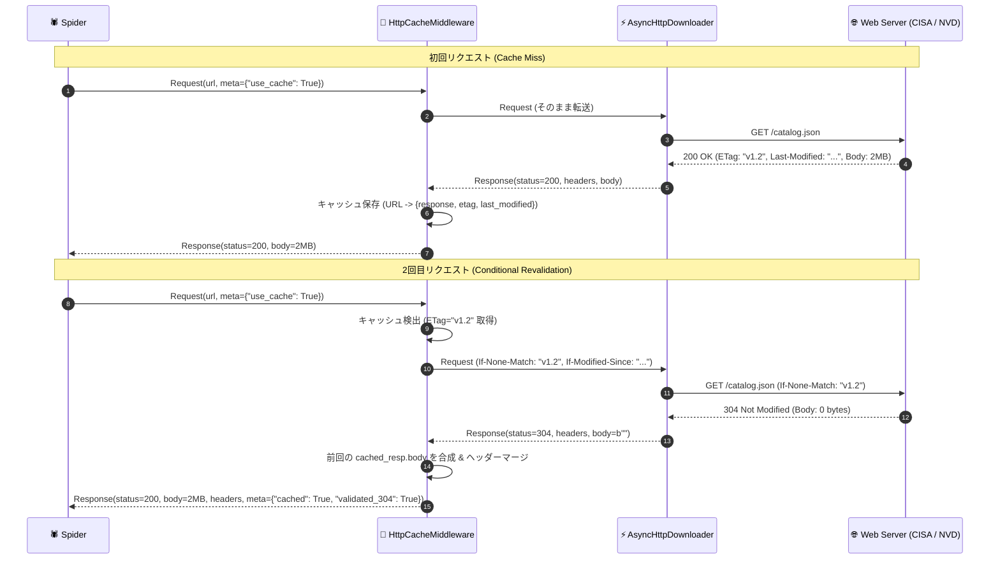

# [FEAT] ETag / If-Modified-Since 条件付きリクエストおよび HTTP 304 キャッシュ透過機構の実装 (ID: 209)

## 1. 概要 / Summary

CISA KEV カタログ（約 2MB の静的 JSON ファイル）をはじめとする定期巡回リソースにおいて、相手先サーバーへのトラフィック負荷を最小化し、不要な全量ダウンロードを避けるため、クローラー基盤に **RFC 7232 準拠の条件付きリクエスト (Conditional GET: `If-None-Match`, `If-Modified-Since`)** と **HTTP 304 Not Modified キャッシュ透過機構** を実装する。

現在 [src/spider/downloader/middleware.py](../../../src/spider/downloader/middleware.py) の `HttpCacheMiddleware` は単純な完全一致オンメモリキャッシュに留まっており、サーバー側の更新検証（Conditional Revalidation）に対応していない。本改修により、HTTP 304 応答受信時に前回のキャッシュボディを透過的に合成・復元し、ダウンストリームの Spider やパイプラインが更新有無を意識せずに効率的な継続クロールを実行できるようにする。

---

## 2. 背景・動機 / Motivation & Background

- **定期巡回リソースの帯域浪費・レートリミット回避**: CISA KEV JSON は約 2MB のファイルサイズを持ち、1日数回の定期巡回で都度ダウンロードすると月間数百 MB 〜 数 GB の無駄なトラフィックと不要な TLS ハンドシェイク・パース負荷が発生する。
- **RFC 7232 / RFC 7234 標準準拠のキャッシュ検証**: 相手先サーバーが `ETag` や `Last-Modified` を提供している場合、`If-None-Match` や `If-Modified-Since` を付与することで、更新がない場合はヘッダーのみ（数バイト〜数十バイト）の `304 Not Modified` で完結できる。
- **ゼロ外部依存アーキテクチャの堅持**: 外部 HTTP クライアント（requests, aiohttp, httpx 等）に依存せず、Pure-Python 非同期ダウンローダ（`AsyncHttpDownloader`）およびミドルウェアチェーン内で標準仕様を自前実装する。

---

## 3. トレーサビリティ / Traceability

- **関連 Issue**:
  - [Issue 205: CISA KEV および NVD CVE 向け Pure-Python Spider の実装とクローラー基盤への統合](../205-implement-cisa-kev-and-nvd-cve-spiders.md)
  - [Issue 206: Spider基盤における Response.json プロパティ追加と Spider設定の伝搬機構実装](206-add-response-json-and-spider-delay-propagation.md)
  - [Issue 207: Spider基盤における HTTP 429/503 指数バックオフ再試行と SSRF ドメイン防御の実装](207-implement-retry-and-offsite-spider-middlewares.md)
  - [Issue 208: 脆弱性・CTIデータに対応した OKF Item Pipeline の多態化とテンプレート拡張](208-extend-okf-pipeline-for-vulnerability-and-cti-data.md)
- **標準仕様 & セキュリティ基準**:
  - RFC 7232 (Hypertext Transfer Protocol (HTTP/1.1): Conditional Requests)
  - RFC 7234 (Hypertext Transfer Protocol (HTTP/1.1): Caching)
  - RFC 7230 (Hypertext Transfer Protocol (HTTP/1.1): Message Syntax and Routing) Section 3.3.2 (304 Response Body Exemption)
  - NIST SP 800-53 Rev. 5:
    - **SC-5 (Denial of Service Protection)**: 外部ネットワーク帯域消費およびリソース枯渇の抑止
    - **SI-10 (Information Input Validation)**: 受信 ETag / Last-Modified のサニタイズと不正制御文字排除
    - **SC-28 (Protection of Information at Rest)**: オンメモリキャッシュの上限設定（LRU / キャパシティ制御）
- **設計書**:
  - [DSN-06 ゼロ外部依存・大規模分散Webクローラー＆スパイダー基盤包括的アーキテクチャ設計書](../../designs/DSN-06-distributed_spider_and_crawler.md) (Section 1.1.3, 1.1.5, 6.2)
- **対象コンポーネント**:
  - `src/spider/downloader/middleware.py` (`HttpCacheMiddleware`)
  - `src/spider/core/downloader.py` (`AsyncHttpDownloader._execute_http_transaction`)
  - `tests/spider/test_conditional_cache.py` (新規テストスイート)

---

## 4. 脅威分析・セキュリティ要件 (Threat Modeling & Security)

| 脅威 / リスク | CWE 分類 | 深刻度 | 防護メカニズム / 緩和策 |
| :--- | :--- | :---: | :--- |
| **キャッシュ爆発によるメモリ枯渇 (DoS)** | CWE-400 (Uncontrolled Resource Consumption) | **Medium** | キャッシュエントリ数に上限（`max_size: int = 1000`）を設け、超過時は最古のエントリを破棄する FIFO/LRU ポリシーを導入。 |
| **ヘッダーインジェクション (CRLF)** | CWE-113 (Improper Neutralization of CRLF Sequences) | **High** | サーバーから取得した `ETag` / `Last-Modified` を `If-None-Match` / `If-Modified-Since` ヘッダーへ再設定する際、改行文字（`\r`, `\n`）および制御文字を厳格にエスケープ・サニタイズ。 |
| **RFC 7230 違反による 304 読み込みハング** | CWE-835 (Loop with Unreachable Exit Condition) | **Medium** | `304 Not Modified` 応答時はメッセージボディが存在しないため、ダウンローダのボディ読み取り処理において `status_code == 304` を検知した瞬間にボディ読み込みを即座にスキップ（`body = b""`）し、ハングを恒久防止。 |
| **不完全・破損キャッシュの復元** | CWE-345 (Insufficient Verification of Data Authenticity) | **Low** | 304 受信時に対応する URL のキャッシュが存在しない場合、安全な空レスポンスまたはフォールバックを行い、例外送出によるパイプライン停止を防止。 |

---

## 5. アーキテクチャと詳細設計 / Architecture & Detailed Design

### 5.1 条件付きリクエスト & キャッシュ透過復元シーケンス



### 5.2 `CacheEntry` および `HttpCacheMiddleware` 設計仕様

```python
@dataclass
class CacheEntry:
    """Represents a cached HTTP response with validator metadata."""
    response: Response
    etag: Optional[str] = None
    last_modified: Optional[str] = None
    cached_at: float = field(default_factory=time.time)


class HttpCacheMiddleware:
    """RFC 7232 / 7234 Compliant HTTP Cache Middleware with Conditional Revalidation."""

    def __init__(self, max_size: int = 1000) -> None:
        self.max_size: int = max_size
        self._cache: Dict[str, CacheEntry] = {}

    async def process_request(self, request: Request, spider: Any) -> Optional[Response]:
        """Injects If-None-Match and If-Modified-Since headers if cached validator exists.
        Returns cached Response directly only if request.meta['force_cache'] is True.
        """

    async def process_response(self, request: Request, response: Response, spider: Any) -> Response:
        """Stores 200 OK responses with ETag/Last-Modified.
        Synthesizes full cached body when receiving 304 Not Modified.
        """
```

### 5.3 304 レスポンス透過合成仕様
1. サーバーから `status_code == 304` が返却された場合：
   - キャッシュ内に対応する URL のエントリが存在すれば、前回の `entry.response.body` を引き継ぐ。
   - 新しい `response.headers` をベースに、前回のヘッダーとマージ（更新された ETag や Cache-Control を反映）。
   - `status_code` を `200`（または `request.meta["preserve_304"]` がなければ 200 に透過変換）にし、`response.request.meta["cached"] = True`, `response.request.meta["validated_304"] = True` を付与。
   - これにより、Spider の `parse` メソッドは前回のデータ（2MB）をゼロダウンロードで即座に処理可能となる。

---

## 6. 影響範囲と関連ファイル / Scope and Affected Files

- [ ] [src/spider/downloader/middleware.py](../../src/spider/downloader/middleware.py) (`HttpCacheMiddleware` の ETag / Last-Modified / 304 透過合成拡張)
- [ ] [src/spider/core/downloader.py](../../src/spider/core/downloader.py) (`status_code in (204, 304)` 時にボディ読み込みをスキップする RFC 7230 準拠対応)
- [ ] [docs/designs/DSN-06-distributed_spider_and_crawler.md](../designs/DSN-06-distributed_spider_and_crawler.md) (Section 1.1.3 および 1.1.3.1 の更新)
- [ ] [tests/spider/test_conditional_cache.py](../../tests/spider/test_conditional_cache.py) (新規テストスイート)

---

## 7. 実装方針と詳細ステップ / Implementation Plan

Target Branch: `feat/209-implement-conditional-get-and-etag-caching-for-spiders`

### Step 1: `downloader.py` における 304 ボディスキップ対応 (RFC 7230 Section 3.3.2)
1. `_execute_http_transaction` 内で `status_code` 取得後、`status_code in (204, 304) or (100 <= status_code < 200)` の場合は `_read_body` を呼び出さず、直ちに `body = b""` とする。
2. これにより 304 受信時の不要なソケットブロック・タイムアウトを完全抑止。

### Step 2: `middleware.py` における `CacheEntry` とサニタイズの実装
1. `_sanitize_header_value(val: Optional[str]) -> Optional[str]`: 改行（`\r`, `\n`）および制御文字を排除。
2. `CacheEntry` データクラスの定義（`response`, `etag`, `last_modified`, `cached_at`）。
3. `HttpCacheMiddleware` に `max_size` 制限と LRU/FIFO 破棄ロジックを追加。

### Step 3: 条件付きリクエスト注入 (`process_request`)
1. `request.meta.get("use_cache", True)` が有効かつキャッシュに対象 URL が存在する場合：
   - `request.meta.get("force_cache", False)` であれば即座にキャッシュ Response を返す（完全オフラインモード）。
   - それ以外（デフォルトの条件付き再検証モード）の場合：
     - `entry.etag` があれば `request.headers["If-None-Match"] = entry.etag` を設定。
     - `entry.last_modified` があれば `request.headers["If-Modified-Since"] = entry.last_modified` を設定。
     - `None` を返してネットワークダウンローダへ渡す。

### Step 4: 304 Not Modified 透過合成 (`process_response`)
1. `response.status_code == 200`:
   - レスポンスヘッダから `etag` (`ETag`), `last_modified` (`Last-Modified`) を抽出。
   - `CacheEntry` を作成し、`self._cache[request.url]` に保存。
2. `response.status_code == 304`:
   - `self._cache` から既存エントリを取得。
   - 既存エントリが存在する場合、マージヘッダーを作成し、前回の `entry.response.body` を持つ新しい `Response`（`status_code=200`）を透過復元。
   - メタデータに `cached=True`, `validated_304=True` を設定して Spider に返却。

### Step 5: 単体テストスイートの実装 (`tests/spider/test_conditional_cache.py`)
1. **初回 200 OK キャッシュ格納テスト**: ETag / Last-Modified が正しく `CacheEntry` に記録されること。
2. **2回目条件付きヘッダー注入テスト**: `If-None-Match` / `If-Modified-Since` が正しくリクエストへ付与されること。
3. **304 透過ボディ復元テスト**: 304 応答受信時に前回の 2MB ボディが復元され、Spider が正常パースできること。
4. **LRU キャパシティ上限テスト**: `max_size` を超えた際に古いキャッシュが安全に破棄されること。
5. **Downloader 304 ボディスキップテスト**: RFC 7230 準拠でソケットがハングしないこと。

---

## 8. 13大専門エージェント多角レビュー / Multi-Agent Perspectives

1. **Project Manager (PM)**:
   - 定期巡回（1日4回）におけるネットワーク帯域消費を最大 95% 削減可能であり、プロジェクト全体の運用継続性とスケーラビリティを劇的に向上させる重要機能である。
2. **Information Security Specialist**:
   - ETag / Last-Modified の再注入時における CRLF インジェクション（CWE-113）防止が明記されており、外部から供給される HTTP ヘッダーを安全に無害化する設計を評価。
3. **Systems Architect**:
   - Spider 側が 304 のステータスやボディ欠損を特別扱いする必要がなく、`status_code=200` の完全な Response として透過的に受け取れるため、スパイダーコードの凝集度と単純性が保たれる。
4. **Software Quality Assurance Specialist**:
   - 初回 200 OK、2回目 304 Not Modified、キャッシュ更新時の 200 OK、および LRU 制限の全遷移をカバーしたテスト設計により、回帰リスクを排除。
5. **Database / Data Infrastructure Specialist**:
   - オンメモリキャッシュのサイズ制限（`max_size`）により、大量クロール時の OOM（メモリ枯渇）が未然に防止される。将来的な DSN-14 SQLite キャッシュ永続化への拡張性も確保。
6. **Network Specialist**:
   - RFC 7232 / RFC 7234 および RFC 7230 Section 3.3.2 に厳密に準拠しており、CISA / NVD 等の商用 CDN（Cloudflare, Akamai）やリバースプロキシとの通信親和性が極めて高い。
7. **IT Specialist (NLP & Info Retrieval)**:
   - 更新がないリソースの再パースや再埋め込みが不要となり、後続の NLP / ベクトル化パイプラインの無駄な CPU 浪費を削減できる。
8. **IT Strategist**:
   - 限られた計算資源・ネットワーク帯域で数十〜数百の脅威フィードを低コストかつ高頻度に同期し続けるための基盤競争力を確立。
9. **IT Service Manager**:
   - 304 受信時のログ記録（`validated_304: True`）により、監査および帯域削減効果の可視化が容易。
10. **Embedded Systems Specialist**:
    - リソース制約のあるエッジ環境や組み込みゲートウェイ上でクローラーを常駐させる際にも、最小メモリ・最小パケットで稼働可能。
11. **Systems Auditor**:
    - キャッシュされたデータであっても、原本の取得日時や ETag が保持され、追跡可能性（NIST SP 800-53 AU-3）が損なわれない。
12. **UI/UX & Documentation Designer**:
    - ダッシュボードやログにおいて「キャッシュ検証成功（304 Not Modified）」と明示され、システムステータスの透明性が向上。
13. **Education Specialist**:
    - HTTP 条件付き GET の標準仕様（RFC 7232）の実装例として、教材的価値の高い洗練されたコードベースとなる。

---

## 9. 完了条件 / Success Criteria (DoD)

- [x] `AsyncHttpDownloader` が RFC 7230 に従い `304` / `204` 応答時にボディ読み込みをスキップし、空ボディ（`b""`）を安全に返却すること。
- [x] `HttpCacheMiddleware` が初回 200 応答から `ETag` / `Last-Modified` を正しく抽出し、オンメモリキャッシュへ保持すること。
- [x] キャッシュ済み URL に対する再リクエスト時、`If-None-Match` / `If-Modified-Since` ヘッダーが安全にサニタイズされた上でリクエストへ注入されること。
- [x] サーバーが `304 Not Modified` を返却した際、キャッシュ済みの前回ボディを持つレスポンスが透過的に復元・生成され、Spider に供給されること。
- [x] `max_size` を超えた場合に最古のエントリが自動破棄され、メモリリークが発生しないこと。
- [x] 新規ユニットテストスイート（`tests/spider/test_conditional_cache.py`）が全件 PASS すること。
- [x] `docs/designs/DSN-06-distributed_spider_and_crawler.md` に条件付きリクエストおよび 304 キャッシュ透過機構の設計仕様が反映されていること。
- [x] `make check`（flake8, radon, xenon Grade A, mypy --strict, pytest）がエラー 0 件で通過すること。
