# [BUG/SEC] CTICatalogStorage および sqlite_engine における :memory: 物理ファイル生成バグの改修とインメモリ多層防御の実装 (ID: 219)

## 1. 概要 / Summary

[Issue 212](closed/212-support-in-memory-database-mode.md) において、ゼロ外部依存・純粋Pythonデータベース基盤（`src/database/`）における `":memory:"` インメモリ接続（ディスク I/O ゼロ、ファイル生成ゼロ）がサポートされた。

しかし、Issue 218 で CTI カタログが `.vdb` へ移行された際、`src/domain/security/cti/storage.py` の `CTICatalogStorage.__init__` において `self.db_path = os.path.abspath(db_path or self.DEFAULT_DB_PATH)` が無条件に実行される実装となっていた。これにより、呼び出し側（`tests/domain/security/test_kev_correlation.py` 等）がインメモリモードを意図して `db_path=":memory:"` を指定した場合であっても、文字列が絶対パス `/workspace/arxiv-security-papers/:memory:` に変換されてしまう。

さらに、`src/database/compat/sqlite_engine.py` の `_open_raw_sqlite_connection` では `if db_path in (":memory:", ""):` という完全一致判定のみを行っていたため、絶対パス化された `/workspace/arxiv-security-papers/:memory:` がフォールスルーし、通常の物理ファイルパスとして処理され、リポジトリルートに **77,824 バイト（約76KB）の `:memory:` 実ファイルが作成される** という重大な不具合・ファイルシステム汚染が発生していた。

加えて、`CTICatalogStorage` は都度 `with self._connection() as conn:` でコネクションを開閉する構造となっているため、真に `":memory:"` を適用した場合にコネクション終了とともにメモリ内テーブルが破棄されるライフサイクル課題も内包している。

本 Issue では、`CTICatalogStorage`（および `AnalyticsStorage`）のインメモリライフサイクルを正しく実装するとともに、`sqlite_engine.py` および VFS 層に多層防御ガードを導入し、いかなる場合も `:memory:` 物理ファイルがディスク上に作成されない堅牢な基盤を確立する。

```mermaid
graph TD
    subgraph BugFlow["不具合発生フロー (Bug Flow)"]
        Test["test_kev_correlation.py<br/>CTICatalogStorage(db_path=':memory:')"]
        Abspath["os.path.abspath(':memory:')<br/>-> /workspace/.../:memory:"]
        EnginePass["_open_raw_sqlite_connection<br/>db_path in (':memory:', '') is FALSE"]
        DiskCreate["sqlite3.connect(abs_path)<br/>-> 76KB :memory: 物理ファイル生成！"]
        Test --> Abspath --> EnginePass --> DiskCreate
    end

    subgraph FixedFlow["多層防御対策フロー (Mitigated Defense Flow)"]
        CleanCall["CTICatalogStorage(db_path=':memory:')"]
        StorageGuard{"db_path in (':memory:', '') or<br/>basename == ':memory:'"}
        MemConn["self._mem_conn = get_sqlite_connection(':memory:')<br/>Persistent in-memory connection"]
        EngineGuard{"sqlite_engine.py<br/>basename == ':memory:'"}
        PureMem["sqlite3.connect(':memory:')<br/>Zero Disk I/O & No File Created!"]
        VfsGuard["PosixVFSFile Guard<br/>Raises ValueError on :memory:"]

        CleanCall --> StorageGuard
        StorageGuard -->|True| MemConn --> EngineGuard --> PureMem
        StorageGuard -.->|Direct sqlite_engine call| EngineGuard
        EngineGuard -.->|Accidental PosixVFS call| VfsGuard
    end
```



### 再現手順 / Steps to Reproduce
1. カレントディレクトリに `:memory:` ファイルが存在しないことを確認する（`rm -f :memory:`）。
2. 以下の Python コマンドを実行する：
   ```bash
   PYTHONPATH=src .venv/bin/python3 -c "
   import os
   from domain.security.cti.storage import CTICatalogStorage
   s = CTICatalogStorage(db_path=':memory:')
   print('File exists:', os.path.exists(':memory:'))
   "
   ```
3. `File exists: True` と出力され、カレントディレクトリに約76KBの `:memory:` ファイルが作成される。
4. `PYTHONPATH=src .venv/bin/pytest tests/domain/security/test_kev_correlation.py` を実行した場合も同様に `:memory:` ファイルが生成される。

### 再現環境 / Environment
- OS / Env: Linux (WSL Ubuntu 24.04), Python 3.14.7
- Files: `src/domain/security/cti/storage.py`, `src/database/compat/sqlite_engine.py`

---

## 2. トレーサビリティ / Traceability

- **設計仕様書**:
  - [DSN-14 ゼロ外部依存・純粋Python SQLite互換＆分散ベクトルデータベース基盤包括的アーキテクチャ設計書](../designs/DSN-14-pure_python_sqlite_and_distributed_vector_db.md) (Section 2.1 VFS層, Section 5.1 PEP 249)
  - [DSN-05 次世代データベースエンジン包括的アーキテクチャ設計書](../designs/DSN-05-database_engine_architecture.md) (Chapter 19 単一 .vdb マルチテーブルコンテナ & PEP 249 sqlite3 互換インターフェース)
  - [DSN-20 外部セキュリティ知識データセット統合インジェスト・ローカルカタログ管理基盤設計仕様書](../designs/DSN-20-external_security_knowledge_ingestion_and_catalog_architecture.md)
- **関連 Issue**:
  - [Issue 212: src/database における SQLite 準拠「:memory:」インメモリデータベースモードのサポート](closed/212-support-in-memory-database-mode.md)
  - [Issue 218: cti_catalog.db および analytics.db の src/database 独自データベース移行とデータマイグレーション](closed/218-migrate-cti-catalog-and-analytics-db-to-pure-database-engine.md)
  - [Issue 217: src/database からの具体的データベース指定・ファイルパス結合の完全排除と利用側一元定義（DI）の確立](closed/217-decouple-database-file-definitions-from-database-engine.md)
  - [Issue 214: src/database における単一 .vdb マルチテーブルコンテナ対応および sqlite3 (PEP 249) 互換インターフェースの実装](closed/214-support-multi-table-vdb-container-and-pep249-sqlite-interface.md)

---

## 3. 13大専門エージェント観点レビュー / Multi-Agent Review

1. **Project Manager (PM)**:
   - CI パイプラインおよび git status における謎の未追跡ファイル `?? :memory:` の発生を根本根絶し、ビルド再現性とリポジトリ清浄性を 100% 担保する。
2. **Systems Architect**:
   - 利用側ストレージ層（`CTICatalogStorage`, `AnalyticsStorage`）とコアDB層（`sqlite_engine.py`, `vfs.py`）の責務を整理。利用側でのインメモリコネクション生存期間管理と、コア側での多層防御（防御的正規化）を両輪で実装する。
3. **Information Security Specialist**:
   - テスト中や短命処理でインメモリを期待した機密データ（脆弱性情報やAPIトークン）が意図せず物理ファイルシステムに残存する情報漏洩リスク（CWE-200）および残存ファイルによる改ざんリスクを排除する。
4. **Software Quality Assurance (SQA) Specialist**:
   - 単に `rm -f :memory:` でごまかすのではなく、テスト実行前後で `:memory:`、`:memory:.tmp`、`:memory:.vdb-wal` が一切生成されないアサーションテストを整備し、リグレッションをゼロにする。
5. **Database / Data Infrastructure Specialist**:
   - `sqlite3` の仕様として、真の `:memory:` 接続はコネクションクローズ時に破棄される。ストレージクラスがコンテキストマネージャで都度コネクションを開閉するパターンであっても、インメモリ時はインスタンス内部で保持した単一コネクションを再利用することでスキーマ消失を防ぐ。
6. **Network Specialist**:
   - インメモリ接続の完全化により、テスト実行時のディスク I/O 遅延が削減され、高速なモックテスト実行を支援する。
7. **IT Specialist (NLP & Info Retrieval)**:
   - CTI カタログの FTS5 仮想テーブル（`cti_techniques_fts`）がインメモリ SQLite 上でも正常に生成・検索可能であることを確認する。
8. **IT Strategist**:
   - テストのクリーンネスと信頼性を回復し、開発者が安心して自動テストやバックフィルを実行できる環境を再構築する。
9. **IT Service Manager**:
   - 本番環境運用時にも、一時的なメモリ内分析でディスク書き込みが発生してディスク容量を圧迫（CWE-400）する事故を未然に防止する。
10. **Embedded Systems Specialist**:
    - フラッシュストレージの書き込み寿命制約がある組み込み環境において、インメモリ指定時の不要なディスク書き込みを厳密に排除する。
11. **Systems Auditor**:
    - 本バグの発生原因（Issue 218 移行時の `os.path.abspath` 無条件適用）と対策の経緯を RCA として完全に記録し、トレーサビリティを確立する。
12. **UI/UX & Documentation Designer**:
    - 本修正による Web UI やコンソール側への破壊的変更はゼロであり、透明性を維持する。
13. **Education Specialist**:
    - SQLite の `":memory:"` 接続における `conn.close()` ライフサイクルと `os.path.abspath` によるパス変質の落とし穴をドキュメント化し、ナレッジとして共有する。

---

## 4. セキュリティ脅威分析と多層防御設計 (Threat Modeling & Security Mitigations)

| 脅威分類 (STRIDE / CWE) | 潜在的リスク | 本 Issue における対策・多層防御 |
| :--- | :--- | :--- |
| **CWE-200 (Information Exposure)** | インメモリ処理を意図したデータ（脆弱性カタログや機密情報）がリポジトリルートに物理ファイルとして残留し、git commit 等で漏洩するリスク | ストレージ層および DB エンジン層の双方で `:memory:` の実ファイル化を完全遮断し、メモリ内のみで完結。 |
| **CWE-400 (Uncontrolled Resource Consumption)** | 大量テストや短命処理の並行実行時にディスクへの書き込みが多発し、I/O 枯渇や容量圧迫を招くリスク | 完全インメモリ（`io.BytesIO` / `sqlite3.connect(":memory:")`）で動作させ、ディスク I/O ゼロを保証。 |
| **CWE-22 (Path Traversal / Path Normalization Defect)** | `":memory:"` という特殊キーワードが `os.path.abspath` や `os.path.join` によって通常のファイルパスに正規化・変質してしまう不具合 | `db_path in (":memory:", "")` に加え、`os.path.basename(db_path) == ":memory:"` のフォールバック検知ガードを実装。 |
| **Fail-Closed 原則違反** | 万一上位レイヤのすり抜けが発生した場合に物理ファイルが暗黙に作成されてしまう | `PosixVFSFile` において `os.path.basename(path) == ":memory:"` を即座に拒否（`ValueError` 送出）するハードフェイルセーフを配置。 |

---

## 5. 詳細実装方針とアーキテクチャ設計 / Implementation Plan

Target Branch: `fix/219-fix-in-memory-database-leak-and-disk-creation`

### Step 1: `CTICatalogStorage` のインメモリ最適化 (`src/domain/security/cti/storage.py`)
1. **`__init__` の修正**:
   ```python
   def __init__(self, db_path: Optional[str] = None) -> None:
       if db_path in (":memory:", "") or (db_path and os.path.basename(db_path) == ":memory:"):
           self.db_path = ":memory:"
           self._mem_conn: Optional[SQLiteConnection] = get_sqlite_connection(
               ":memory:", init_schema=False, enable_wal=False, timeout=30.0
           )
       else:
           self.db_path = os.path.abspath(db_path or self.DEFAULT_DB_PATH)
           os.makedirs(os.path.dirname(self.db_path), exist_ok=True)
           self._mem_conn = None
       self._init_schema()
   ```
2. **`_connection` の修正**:
   - `self._mem_conn is not None` の場合は `yield self._mem_conn`（閉じずに再利用）。
   - それ以外（物理ファイル）の場合は従来通り都度 `get_sqlite_connection` を開閉。
3. **`close()` & `__del__()` の追加**:
   - `close()` メソッドを新設し、`self._mem_conn` が存在する場合はクローズして `None` に設定。

### Step 2: `AnalyticsStorage` のインメモリ対応強化 (`src/analytics/storage.py`)
1. **`__init__` の修正**:
   - `db_name in (":memory:", "")` または `os.path.basename(db_name) == ":memory:"` の場合、`self.db_path = ":memory:"`, `self.analytics_dir = ":memory:"` とし、`_ensure_dir()` をスキップ。
   - `self._mem_conn` を保持。
2. **`_get_connection` の修正**:
   - `self._mem_conn` が存在する場合はそれを yield。
3. **`close()` メソッドの追加**:
   - `self._mem_conn` を安全に解放。

### Step 3: `sqlite_engine.py` の多層防御ガード (`src/database/compat/sqlite_engine.py`)
1. **`_open_raw_sqlite_connection`**:
   ```python
   def _open_raw_sqlite_connection(
       db_path: str, read_only: bool, timeout: float
   ) -> sqlite3.Connection:
       if db_path in (":memory:", "") or os.path.basename(db_path) == ":memory:":
           return sqlite3.connect(":memory:", timeout=timeout)
       abs_path = os.path.abspath(db_path)
       if read_only:
           return sqlite3.connect(f"file:{abs_path}?mode=ro", uri=True, timeout=timeout)
       os.makedirs(os.path.dirname(abs_path), exist_ok=True)
       return sqlite3.connect(abs_path, timeout=timeout)
   ```
2. **`_configure_wal_pragma`**:
   - `if db_path not in (":memory:", "") and os.path.basename(db_path) != ":memory:":` に更新。
3. **`_is_vdb_container_path`**:
   - `path.endswith(".vdb") and path not in (":memory:", "") and os.path.basename(path) != ":memory:"` に更新。

### Step 4: VFS / Pager / VectorStorage の多層防御ハードガード
1. **`src/database/storage/vfs.py`**:
   - `PosixVFSFile.__init__` にて `if path == ":memory:" or os.path.basename(path) == ":memory:": raise ValueError("Cannot open :memory: using PosixVFSFile.")` を追加。
2. **`src/database/storage/storage.py`**:
   - `VectorStorage.__init__` にて `self.is_memory = file_path == ":memory:" or os.path.basename(file_path) == ":memory:"` を適用。
3. **`src/database/storage/pager.py`**:
   - `_resolve_vfs_instance` にて `os.path.basename(file_path) == ":memory:"` の場合も `target_name = "memory"` を選択。

### Step 5: テストスイート拡充と品質ゲート検証
1. **`tests/domain/security/test_kev_correlation.py`**:
   - テストフィクスチャまたは各テストで実行前後に `assert not os.path.exists(":memory:")` を検証。
2. **`tests/database/test_in_memory_mode.py`**:
   - `os.path.abspath(":memory:")` や `"/tmp/:memory:"` を渡した場合でも物理ファイルが作成されず、正常にインメモリ動作することを確認するテストケースを追加。
3. **品質ゲート一括実行**:
   - `make check_format` (isort, black, flake8)
   - `make static_analysis` (mypy --strict, xenon Grade A CC <= 5)
   - `pytest` 全件 PASS

---

## 6. 完了条件 / Success Criteria (DoD)

- [x] `CTICatalogStorage(db_path=":memory:")` をインスタンス化して操作しても、ディスク上に `:memory:` 物理ファイルが一切生成されないこと。
- [x] `CTICatalogStorage(db_path=":memory:")` 上でテーブル作成・レコード挿入・ルックアップが正常に機能すること（インメモリコネクションの永続性）。
- [x] `tests/domain/security/test_kev_correlation.py` の全テストが PASS し、テスト終了後に `:memory:` ファイルが存在しないこと。
- [x] `sqlite_engine.py` に `os.path.abspath(":memory:")` 等の正規化後パスが渡された場合でも、物理ファイルを作成せず安全にインメモリモードとして処理されること。
- [x] `AnalyticsStorage` においても `:memory:` インメモリモードが安全に動作すること。
- [x] `PosixVFSFile` に `:memory:` が渡された場合に即座に例外を送出するハードガードが機能すること。
- [x] `tests/domain/` および `tests/database/` の全テストが PASS すること。
- [x] `make check_format` および `make static_analysis`（mypy --strict, xenon Grade A）が警告・エラー 0 件で通過すること。

---

## 7. 検証手順 / Verification Commands

### 1. 再現テスト（修正前の実ファイル生成が阻止されることの確認）
```bash
rm -f :memory:
PYTHONPATH=src .venv/bin/python3 -c "
import os
from domain.security.cti.storage import CTICatalogStorage
s = CTICatalogStorage(db_path=':memory:')
assert not os.path.exists(':memory:'), 'Error: :memory: file was created!'
print('PASS: No :memory: file created.')
"
```

### 2. CTI 相関テストスイートの実行と残存ファイル検証
```bash
rm -f :memory:
PYTHONPATH=src .venv/bin/pytest tests/domain/security/test_kev_correlation.py -v
test ! -f :memory: && echo "PASS: :memory: was not created during test_kev_correlation"
```

### 3. インメモリモード網羅テストの実行
```bash
PYTHONPATH=src .venv/bin/pytest tests/database/test_in_memory_mode.py -v
```

### 4. 品質ゲート一括検証
```bash
make check_format
make static_analysis
```
