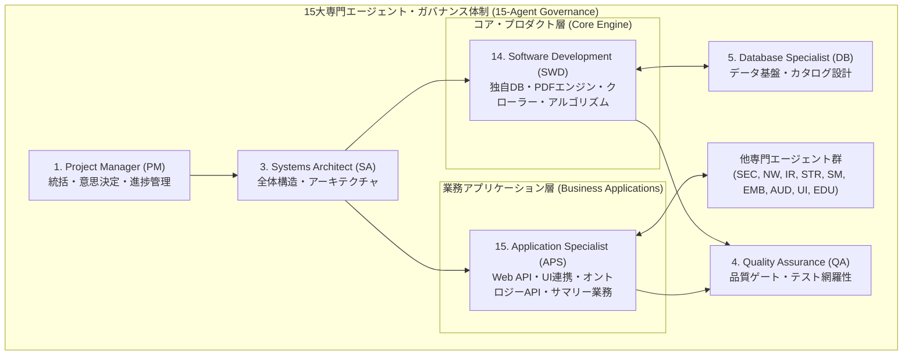

# [FEAT/ENH] .agents/agents/ への ITSS V3「ソフトウェアデベロップメント」および「アプリケーションスペシャリスト」エージェント定義の追加 (ID: 220)

## 1. 概要 / Summary

経済産業省・IPA（独立行政法人情報処理推進機構）が策定する「ITスキル標準（ITSS: IT Skill Standard）V3 2011」の職種・専門分野定義に基づき、本リポジトリの自律型マルチエージェント基盤（`.agents/agents/`）に以下の2つの専門エージェントを新規追加する。

1. **ソフトウェアデベロップメント (Software Development / SWD)**:
   - ソフトウェア製品（基本ソフト・ミドルソフト・応用ソフト）の仕様策定、内部構造設計、アルゴリズム実装、テスト、品質担保およびライフサイクル保守を担当する専門家。
   - `arxiv-security-papers` においては、ゼロ外部依存の独自データベース基盤（`src/database/`：B-tree、WAL、LRU Pager、ARIES、VectorStorage）、PDF 解析エンジン（`src/pdf/`）、およびクローラーコア（`src/spider/`）など、低レイヤ〜ミドルウェア・基盤アルゴリズム開発を所管する。
2. **アプリケーションスペシャリスト (Application Specialist / APS)**:
   - 業務要件（セキュリティ論文分析、CTI脅威インテリジェンス、オントロジー因果追跡、エグゼクティブサマリー自動生成等）に基づき、業務アプリケーション（Webコンソール、APIゲートウェイ、バッチ処理パイプライン等）の設計、実装、導入、テスト、および保守を担当する専門家。
   - `arxiv-security-papers` においては、Web ゲートウェイ（`src/web/gateway/`）、プレゼンテーション／UI（`src/web/presentation/`、`index.html`）、オントロジーAPI・エクスポート（`src/ontology/`、`src/domain/security/`）、および 5 階層エグゼクティブサマリー生成パイプライン等、業務機能・エンドユーザー接点アプリケーションを所管する。

併せて、`.agents/AGENTS.md` のガバナンス枠組み（13大専門エージェントから15大専門エージェントへの拡張）および関連エージェント設定・ルールとの整合を図る。

---

## 2. トレーサビリティ / Traceability

- **IPA ITスキル標準（ITSS）V3 2011 公式ポータル**:
  `https://www.ipa.go.jp/jinzai/skill-standard/plus-it-ui/itss/download_v3_2011.html`
- **ソフトウェアデベロップメント 職種の概要と達成度指標**:
  `https://www.ipa.go.jp/archive/jinzai/skill-standard/itss/qv6pgp000000btn8-att/000009993.pdf`
  （V3 2011: `https://www.ipa.go.jp/jinzai/skill-standard/plus-it-ui/itss/ps6vr70000004x60-att/000024986.pdf`）
- **ソフトウェアデベロップメント スキル領域とスキル熟達度・知識項目**:
  `https://www.ipa.go.jp/jinzai/skill-standard/plus-it-ui/itss/ps6vr70000004x60-att/000024988.pdf`
- **アプリケーションスペシャリスト 職種の概要と達成度指標**:
  `https://www.ipa.go.jp/jinzai/skill-standard/plus-it-ui/itss/ps6vr70000004x60-att/000024960.pdf`
- **アプリケーションスペシャリスト スキル領域とスキル熟達度・知識項目**:
  `https://www.ipa.go.jp/jinzai/skill-standard/plus-it-ui/itss/ps6vr70000004x60-att/000024962.pdf`
- **リポジトリ内ガバナンス規則**:
  - `.agents/AGENTS.md`

---

## 3. 15大専門エージェント多角的レビュー

1. **Project Manager (PM)**:
   - コア基盤アルゴリズム開発（SWD）とユーザー向け業務機能（APS）の責任分界が明確化され、Issueの主担当アサインと権責が大幅に向上する。
2. **Systems Architect (SA)**:
   - システム境界（`src/database`, `src/pdf`, `src/spider` の基盤層）と（`src/web`, `src/ontology`, `src/analytics` の業務層）がITSSの職種分類と1対1で整合し、ADRや設計議論が円滑化される。
3. **Software Development (SWD) [新設]**:
   - ゼロ外部依存のデータ構造、アルゴリズム計算量最適化、排他制御・トランザクション復元など、低レイヤソフトウェア工学の観点から最高品質のコード実装を主導する。
4. **Application Specialist (APS) [新設]**:
   - セキュリティ研究者やCTIアナリストが直接利用するWeb画面、API、オントロジー因果グラフ、サマリー出力の業務適合度・実用性を最大化する。
5. **Software Quality Assurance Specialist (QA)**:
   - SWDに対しては単体テスト・計算量・複雑度（Grade A CC<=4）、APSに対してはE2E・結合テスト・業務シナリオ網羅性の品質ゲートを各々適用可能となる。
6. **Information Security Specialist (SEC)**:
   - エージェント定義ファイル内の委譲先スキルに `run-security-scanner`, `threat-modeling`, `securecoder-persona` を適切に配置し、権限逸脱を防ぐ。
7. **Database / Data Infrastructure Specialist (DB)**:
   - SWDと連携して `.vdb` コンテナや B-tree/WAL/ARIES の低レベル実装を推進し、APSと連携して高レベルクエリやオントロジー永続化を行う。
8. **Network Specialist (NW)**:
   - SWDのクローラー基盤（Socket/HTTPパーサー）とAPSの外部API連携（arXiv API/CISA KEV）を分担支援。
9. **IT Specialist (NLP & IR)**:
   - SWDのPDFテキスト抽出コアとAPSの論文検索・ハイブリッド探索業務を分担連携。
10. **IT Strategist (STR)**:
    - ITSS V3 準拠の体系的な人材モデル導入により、組織的・技術的成熟度を対外的に証明可能となる。
11. **IT Service Manager (SM)**:
    - 運用バッチ・ログ監査・障害対応においてAPS（業務影響把握）およびSWD（根本バグ改修）との連携体制が整う。
12. **Embedded Systems Specialist (EMB)**:
    - SWDの低メモリフットプリント・ビット演算・バイナリ処理における専門知見を提供。
13. **Systems Auditor (AUD)**:
    - エージェント定義ファイルのトレーサビリティ（IPA ITSS V3 URL、相対パスリンク）を厳格に監査。
14. **UI/UX & Documentation Designer (UI)**:
    - APSと緊密に連携し、Webコンソールやマークダウンサマリーの視覚的優美さと直感的操作性を担保。
15. **Education Specialist (EDU)**:
    - ITSSの用語定義、達成度指標、レベル基準（レベル1〜7）を正確にドキュメントへ反映。

---

## 4. 脅威モデル分析とセキュリティ設計

- **エージェント定義とスキル委譲の権限境界**:
  - エージェントプロンプトにおいて、任意コマンドの無制限実行や安全保護規約のバイパスが指示されないよう、委譲先スキルを既存の管理スキル（`refine-existing-feature`, `verify-quality-gates`, `create-issue` 等）に限定。
  - セキュリティバイデザインの原則を各エージェントの行動規範に明記（SWD: 入力サニタイズ・バッファ境界検証、APS: SSRF防御・CORS/XSS/CSRF対策）。
- **絶対パス汚染の防止**:
  - 新規エージェントファイルおよびドキュメント内の全リンクは相対パス（`file:///` 等の絶対パス不使用）を徹底。

---

## 5. 影響範囲と関連ファイル / Scope and Affected Files

- [ ] [NEW] `.agents/agents/software-development.agent.md`
- [ ] [NEW] `.agents/agents/application-specialist.agent.md`
- [ ] [MODIFY] `.agents/AGENTS.md`（エージェント一覧・ガバナンスフレームワークの更新：13エージェント → 15エージェント）
- [ ] [MODIFY] `docs/issues/README.md`（Issue台帳のステータス更新）

---

## 6. 実装方針 / Implementation Plan

Target Branch: `feat/220-add-itss-v3-software-development-and-application-specialist-agents`

### Step 1: `.agents/agents/software-development.agent.md` の策定
- **メタデータ**: `name: Software Development`, `description: ...`
- **根拠規程**: 経済産業省・IPA「ITスキル標準（ITSS）V3 2011」（略号：SWD / 英語名称：Software Development）
- **業務・対象者像・期待水準**:
  - 専門分野: 基本ソフト、ミドルソフト、応用ソフト
  - 対象業務: ソフトウェア製品の企画、内部構造設計、アルゴリズム実装、テスト、最適化、リファクタリング
  - リポジトリ内担当: `src/database/`, `src/pdf/`, `src/spider/`
- **スキル委譲マッピング**:
  - コード実装・機能改善: `refine-existing-feature`
  - 品質ゲート一括検証: `verify-quality-gates`
  - 依存性検証: `scan_dependencies`
  - 脆弱性検証: `run-security-scanner`, `run-poc`
  - Issue 起票・洗練: `create-issue` → `polish-issue`
- **行動規範 & 応答プロトコル**:
  - ゼロ外部依存の維持、サイクロマティック複雑度 Grade A（CC<=4）、型安全性（`mypy --strict`）
  - 日本語応答、構造化されたコード・設計解説

### Step 2: `.agents/agents/application-specialist.agent.md` の策定
- **メタデータ**: `name: Application Specialist`, `description: ...`
- **根拠規程**: 経済産業省・IPA「ITスキル標準（ITSS）V3 2011」（略号：APS / 英語名称：Application Specialist）
- **業務・対象者像・期待水準**:
  - 専門分野: 業務システム、業務パッケージ
  - 対象業務: 業務要件分析、Web API/WSGI設計、DB連携、オントロジーAPI、サマリー生成パイプライン
  - リポジトリ内担当: `src/web/`, `src/ontology/`, `src/domain/security/`, `outputs/executive_summaries/`
- **スキル委譲マッピング**:
  - 5階層サマリー生成: `executive-summary-generator`
  - トレンド分析: `paper-trend-analyzer`
  - OKFデータ精緻化: `refine-okf-data`
  - 脅威モデルタグ付け: `threat-model-tagger`
  - Web セキュリティ規約: `mandatory-secure-web-skills`
- **行動規範 & 応答プロトコル**:
  - 業務要件適合とエンドユーザー体験最大化、100%日本語サマリー規約、Markdown表形式準拠
  - 日本語応答、業務要件とAPI・UI連携フローの明確な提示

### Step 3: `.agents/AGENTS.md` の更新
- ガバナンス構成表に SWD（14）および APS（15）を追加し、15大専門エージェント体制として改定。

### Step 4: 検証と品質ゲート
- `make check_format` および `verify-quality-gates` による相対パスリンク、OKF整合性、マークダウンフォーマットの検証。

---

## 7. 完了条件 / Success Criteria (DoD)

- [x] `.agents/agents/software-development.agent.md` が IPA ITSS V3 準拠の形式で作成されていること。
- [x] `.agents/agents/application-specialist.agent.md` が IPA ITSS V3 準拠の形式で作成されていること。
- [x] 両エージェント定義ファイルにおいて、責務・専門分野・委譲スキル・行動規範・応答スタイルが既存エージェントと同等以上の粒度で網羅されていること。
- [x] `.agents/AGENTS.md` のエージェント一覧が15大専門エージェントに更新されていること。
- [x] ドキュメント内の全リンクが相対パス（`file:///` 等の絶対パス不使用）で統一されていること。
- [x] `docs/issues/README.md` において Issue 220 が登録されていること。

