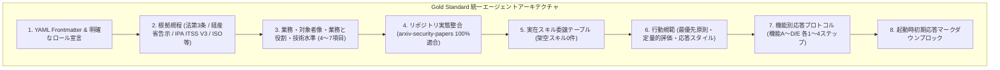

# [REFACTOR/GOV] 全15専門エージェント定義ファイルの Gold Standard 準拠化・他案件残骸の完全排除とリポジトリ実態整合 (ID: 221)

## 1. 概要 / Summary

比較分析の結果、`.agents/agents/` 配下の全15エージェント定義ファイルにおいて、最高品質の `Information Security Specialist (SC)` や新設の `SWD` / `APS` と、他案件テンプレートの流用残骸（IndexedDB、読書履歴、Node.js/Playwright/VRT、DOM仮想化、未実装架空スキル参照等）が残る旧エージェント群との間で顕著な品質乖離が存在することが判明した。

本 Issue では、全15エージェントの定義・内容を最高品質側（Gold Standard：情報セキュリティスペシャリスト / IPA ITSS V3 準拠）に完全に統一し、以下の刷新を一挙に断行した。

1. **他案件残骸の完全排除**:
   - `DB`: 「IndexedDB / LocalStorage」→ 純粋Python独自DB基盤（`.vdb`, B-Tree, WAL, ARIES, VectorStorage, SlottedPage, CTIカタログ）へ全面置換。
   - `NW`: 「読書履歴の外部送信防止」「事前定義作品アセット読み込み」「完全サーバーレスゼロ外部コネクション」→ arXiv API / RSS フェッチ、HTTP 429 バックオフ、ETag / 304 キャッシュ、SSRF 防御 OffsiteMiddleware、CISA KEV / NVD CVE Spider、WSGI ゲートウェイへ全面置換。
   - `QA`: 「Node.js, Playwright, VRT, TypeScript, ESLint」→ Python 3.14 (`pytest`, `black`, `isort`, `flake8`, `xenon` Grade A CC<=4, `mypy --strict`, Google OKF v0.2, 相対パス検証) へ全面置換。
   - `SA`: 「Scene, DOM仮想化, SecureDOMRenderer」→ Clean Architecture、ETLパイプライン、Supervisor / Gunicorn-style Arbiter、オントロジー駆動アーキテクチャ（TBox / ABox）へ全面置換。
2. **実在スキルへの 100% 整合委譲テーブルの確立**:
   - 架空スキル（`create-backlog`, `phase-workflow`, `changelog-workflow`, `review-diff-code` 等）および旧規程番号（`MNG-02`, `MNG-09` 等）を全廃。
   - 本リポジトリに実在するスキル（`create-issue`, `polish-issue`, `verify-quality-gates`, `refine-existing-feature`, `strategic-innovation-planning`, `health-check-monitor`, `backfill-pipeline`, `executive-summary-generator`, `paper-trend-analyzer`, `threat-model-tagger`, `okf-converter` 等）へ正しくマッピング。
3. **責務・技術水準・プロトコル・初期応答の網羅**:
   - 全エージェントに「業務と役割」「期待する技術水準（4〜7項目）」「機能ごとの応答プロトコル（機能A〜D/E）」「起動時初期応答マークダウンブロック」を完備。
4. **根拠規定の正確性担保**:
   - 法的登録資格である「情報セキュリティスペシャリスト (SC)」のみ「情報処理の促進に関する法律（第三条）」を明記し、その他国家試験区分は「経済産業省告示」、ITSS職種区分は「経済産業省・IPA ITスキル標準（ITSS V3 2011）」に厳密に区分・整理。

---

## 2. トレーサビリティ / Traceability

- **情報処理の促進に関する法律（第三条）および経済産業省告示（情報処理技術者試験）**
- **IPA ITスキル標準（ITSS）V3 2011 職種・専門分野定義**
- **IPA 情報処理安全確保支援士・高度情報処理技術者試験シラバス**
- **ISO/IEC/IEEE 12207, ISO/IEC 25010, ISO 9241-210 (人間中心設計), W3C WCAG 2.1**
- **リポジトリ内ガバナンス規程**:
  - `.agents/AGENTS.md`
  - `.agents/skills/` 配下の全実在スキル定義

---

## 3. 15大専門エージェント多角的レビュー

1. **Project Manager (PM)**:
   - 架空スキルや旧規程番号を全廃し、Antigravity 2.0 ネイティブ機能（`schedule`, `write_to_file`, `browser_subagent`）と Issue ドリブン開発に即した真の統括プロトコルへ刷新完了。
2. **Systems Architect (SA)**:
   - フロントエンド描画アプリの残骸を排し、本リポジトリ固有の分散 ETL・Supervisor・独自 DB・オントロジー連携アーキテクチャの守護者として再定義完了。
3. **Information Security Specialist (SC)**:
   - 法第三条の登録資格としての最高水準を堅持しつつ、全エージェントとの連携インターフェースを強化完了。
4. **Software Quality Assurance Specialist (QA)**:
   - Node.js/TypeScript を完全追放し、Python 3.14 の厳格な品質ゲート（Xenon Grade A, `mypy --strict`, OKF 適合）の番人として刷新完了。
5. **Database / Data Infrastructure Specialist (DB)**:
   - IndexedDB を完全追放し、自作 DB（`.vdb`, B-Tree, WAL, ARIES）と raw data カタログの整合性・ACID・クエリ最適化の専門家として刷新完了。
6. **Network Specialist (NW)**:
   - 読書履歴等の残骸を完全追放し、arXiv / RSS / CTI 外部通信耐障害性（429バックオフ, ETag, SSRF防御）の専門家として刷新完了。
7. **IT Specialist (NLP & IR)**:
   - PDF 全文抽出・BM25/HNSW/Graph ハイブリッド探索・日本語自然言語処理の専門プロトコルを網羅完了。
8. **IT Strategist (ST)**:
   - 経営・研究機関向け CTI インテリジェンス価値、5階層サマリー、TCO/技術的負債評価の専門家として刷新完了。
9. **IT Service Manager (SM)**:
   - 1日4回自動 cron バッチ、supervisor プロセス監視、ログ監査、障害自動リカバリの運用司令塔として刷新完了。
10. **Embedded Systems Specialist (EMB)**:
    - 低レイヤ IoT/OT セキュリティタグ付け、ファームウェア解析、ハードウェア暗号化の知見提供者として刷新完了。
11. **Systems Auditor (AUD)**:
    - 改ざん防止 Merkle Tree、来歴追跡 (Provenance)、OKF v0.2 相対パス整合性の独立監査官として刷新完了。
12. **UI/UX & Documentation Designer (UI)**:
    - Web コンソールおよび 5階層マークダウンサマリーの可読性・アクセシビリティを統括完了。
13. **Education Specialist (EDU)**:
    - セキュリティ用語統一、100%日本語サマリー品質、論文解説の平易化・教育的価値を担保完了。
14. **Software Development (SWD)**:
    - 独自 DB、PDF エンジン、クローラーコアのアルゴリズム実装・型安全性を統括し、初期応答ブロックを追加して Gold Standard を完成。
15. **Application Specialist (APS)**:
    - Web ゲートウェイ、オントロジーAPI、サマリー配信業務を統括し、初期応答ブロックを追加して Gold Standard を完成。

---

## 4. 影響範囲と関連ファイル / Scope and Affected Files

- [x] [MODIFY] `.agents/agents/project-manager.agent.md`
- [x] [MODIFY] `.agents/agents/systems-architect.agent.md`
- [x] [MODIFY] `.agents/agents/database-specialist.agent.md`
- [x] [MODIFY] `.agents/agents/network-specialist.agent.md`
- [x] [MODIFY] `.agents/agents/software-quality-assurance-specialist.agent.md`
- [x] [MODIFY] `.agents/agents/information-technology-strategist.agent.md`
- [x] [MODIFY] `.agents/agents/information-technology-service-manager.agent.md`
- [x] [MODIFY] `.agents/agents/it-specialist-information-retrieval.agent.md`
- [x] [MODIFY] `.agents/agents/embedded-systems-specialist.agent.md`
- [x] [MODIFY] `.agents/agents/systems-auditor.agent.md`
- [x] [MODIFY] `.agents/agents/education-specialist.agent.md`
- [x] [MODIFY] `.agents/agents/ui-ux-designer.agent.md`
- [x] [MODIFY] `.agents/agents/information-security-specialist.agent.md`
- [x] [MODIFY] `.agents/agents/software-development.agent.md`
- [x] [MODIFY] `.agents/agents/application-specialist.agent.md`
- [x] [MODIFY] `docs/issues/README.md`

---

## 5. 実装方針 / Implementation Plan

Target Branch: `refactor/221-unify-and-elevate-all-agent-definitions-to-gold-standard`

### Phase 1: 致命的ドメイン乖離・他案件残骸の根絶（DB, NW, QA, SA）
1. `database-specialist.agent.md`: IndexedDB/LocalStorage の完全撤廃、自作DB・ARIES・VectorStorage・raw data カタログへの全面刷新。
2. `network-specialist.agent.md`: 読書履歴・事前定義アセットの完全撤廃、arXiv API/RSS・429バックオフ・ETag・SSRF防御への全面刷新。
3. `software-quality-assurance-specialist.agent.md`: Node.js/TS/Playwright の完全撤廃、Python 3.14/pytest/xenon Grade A/mypy --strict/OKF ゲートへの全面刷新。
4. `systems-architect.agent.md`: Scene/DOM仮想化の完全撤廃、Clean Architecture/ETL/Supervisor/オントロジー駆動への全面刷新。

### Phase 2: ガバナンス・運用・戦略エージェントの刷新（PM, ST, SM, AUD）
1. `project-manager.agent.md`: 架空スキル（backlog, phase等）の撤廃、Antigravity 2.0 / Issue 運用への刷新。
2. `information-technology-strategist.agent.md`: CTI 価値、5階層サマリー、TCO 最適化への刷新。
3. `information-technology-service-manager.agent.md`: 4x daily cron、Supervisor プロセス管理、ログ監査への刷新。
4. `systems-auditor.agent.md`: Merkle Tree 整合性、来歴監査、相対パス 0 件違反監査への刷新。

### Phase 3: ドメイン専門エージェントの規格統一（IR, EMB, EDU, UI, SC, SWD, APS）
1. `it-specialist-information-retrieval.agent.md`: PDF 抽出、ハイブリッド探索、NLP アノテーションへの特化。
2. `embedded-systems-specialist.agent.md`: IoT/CPS/ファームウェアセキュリティへの特化。
3. `education-specialist.agent.md`: 専門用語辞書、100%日本語化品質への特化。
4. `ui-ux-designer.agent.md`: 初期応答ブロック完備と Web コンソールへの特化。
5. `information-security-specialist.agent.md`, `software-development.agent.md`, `application-specialist.agent.md`: 初期応答・委譲スキルの最終アライメント。

---

## 6. 完了条件 / Success Criteria (DoD)

- [x] 全15エージェント定義ファイルにおいて、他案件の残骸（IndexedDB, 読書履歴, Node.js, Scene等）が 0 件であること。
- [x] 全15エージェント定義ファイルにおいて、実在しない架空スキルへの委譲が 0 件であること。
- [x] 全15エージェント定義ファイルに「業務と役割」「期待する技術水準（4〜7項目）」「機能別プロトコル（機能A〜D/E）」「起動時初期応答ブロック」が完備されていること。
- [x] 全エージェントファイル内のリンクが相対パス（`file:///` 等の絶対パス不使用）で統一されていること。
- [x] SC 以外のエージェントから「情報処理の促進に関する法律（第三条）」を排除し、経済産業省告示・ITSS V3 の根拠定義に正確に整理されていること。
- [x] `docs/issues/README.md` に Issue 221 がクローズ登録されていること。
