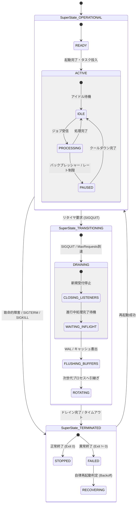

# [FEAT/ARCH] ゼロ外部依存・階層型ステートマシン (HSM) コアエンジンの実装およびシステム全域ライフサイクル統制の確立 (ID: 224)

## 1. 概要 / Summary

現在の `src/supervisor` およびシステム各層（クローラー、ワークフロー、DBMS、PDF、Web 通信）における状態管理は、1 次元のフラットな Enum や手続き型の条件分岐に依存している。
この結果、以下の深刻なアーキテクチャ上の課題が顕在化している：

1. **状態爆発と例外処理の重複 ($O(N^2)$ 複雑度)**:
   - 状態数 $N$ に対して、シグナル（`SIGTERM`/`SIGQUIT`）や致命的例外（OOM/クラッシュ）発生時の共通脱出遷移を各状態で重複記述する必要があり、未定義遷移やゾンビプロセスの原因となる。
2. **状態の二重性・曖昧性 (Semantic Ambiguity)**:
   - `ACTIVE` 状態であっても、「外部通信待機（IDLE）」なのか「巨大論文処理中（BUSY）」なのか「429 バックオフ待機中」なのか外部から識別不能。
3. **障害復元時の決定論的順序保証の欠如 (Non-deterministic Recovery)**:
   - ARIES リカバリや Saga トランザクション、通信ドレイン時において、どのサブフェーズで中断されたかの階層的コンテキストが失われやすい。

本 Issue では、David Harel の Statecharts 理論に基づく **ゼロ外部依存（Pure Python 標準ライブラリのみ、約150行〜250行）の階層型ステートマシン（Hierarchical State Machine / HSM）コアエンジン（`src/core/hsm/`）** を実装し、包括的設計仕様書 `DSN-23` に基づいて `src/supervisor` およびシステム全域（Spider, Workflow, Database, PDF, Web）のライフサイクル統制を段階的に確立する。

---

## 2. トレーサビリティ / Traceability

- **リポジトリ内設計仕様書 (DSN)**:
  - `docs/designs/DSN-23-hierarchical_state_machine_and_lifecycle_governance.md` (包括的設計仕様書: APPROVED)
  - `docs/designs/DSN-12-process_supervisor_and_arbiter.md` (プロセススーパーバイザー設計書)
  - `docs/designs/DSN-06-distributed_spider_and_crawler.md` (分散スパイダー＆クローラー包括設計書)
  - `docs/designs/DSN-11-universal_workflow_engine.md` (汎用ワークフロー設計書)
  - `docs/designs/DSN-05-database_engine_architecture.md` (自作 DBMS・ARIES リカバリ設計書)
- **関連 Issue**:
  - Issue 223 (`src/spider` 常駐型デーモン化および Supervisor / Workflow 統合)
  - Issue 222 (MITRE CWE 公式カタログ自動インジェスト用 CweSpider の実装)
  - Issue 069 (Gunicorn スタイル Process Supervisor & Arbiter の実装)
  - Issue 078 (DSN-12 DAG Boot & One-shot Task 制御の実装)

---

## 3. 脅威モデル分析とセキュリティ要件 (STRIDE Analysis & Security Controls)

新規アーキテクチャ基盤の導入に伴い、STRIDE 脅威分析に基づき以下のセキュリティ要件を策定・実装する：

| STRIDE 分類 | 具体的な脅威シナリオ | 従来の脆弱性 / 影響 | 本設計 (`DSN-23`) による HSM 緩和策 |
| :--- | :--- | :--- | :--- |
| **Spoofing (なりすまし)** | 外部または他プロセスからの未認可な状態変更シグナル注入 | 不正シグナルによる Arbiter / Worker の不正停止・異常遷移 | イベント発火元を `EventContext` にて検証。プロセス内部イベントキューおよび認可された IPC コマンド経由でのみ遷移を受理。 |
| **Tampering (改ざん)** | メモリ上の `current_state` フラグの直接書き換えによる保護状態のバイパス | ガード条件をすり抜けた未初期化・未認可処理の強制作動 | 状態ノード・遷移ルールをイミュータブル化。状態変更は `send_event()` 経由の LCCA / Entry / Exit 実行を必須化し、直接書き換えを型とカプセル化で物理遮断。 |
| **Repudiation (否認)** | 障害停止時やクラッシュ時の原因状態および遷移履歴の消失 | プロセス死因・クラッシュ元サブフェーズの事後調査不能 | 状態遷移イベント（タイムスタンプ, 旧状態パス, 新状態パス, トリガー理由）を構造化 JSON Lines で記録し、監査来歴保証と連携。 |
| **Information Disclosure (情報漏えい)** | ドレイン未完了でのソケット切断やバッファ解放によるメモリ残存 | メモリ内の未コミットトランザクションや認証トークンの漏洩 | `DRAINING.FLUSHING_BUFFERS` 状態におけるリソース・バッファ完全フラッシュとゼロ化クリアを決定論的に保証。 |
| **Denial of Service (DoS)** | ゾンビプロセスの蓄積、未定義遷移によるループ、終了処理のハングアップ | プロセス数上限超過・FD/ポート枯渇によるサービス全面停止 | 親状態 `TRANSITIONING` レベルでの強制タイムアウト（`graceful_timeout`）による `TERMINATED` 脱出遷移、および LCCA 探索ループ防止（循環検出）。 |
| **Elevation of Privilege (権限昇格)** | 例外発生時のフォールスルーによるエラー状態での業務ロジック継続 | 不完全な初期化状態での特権リクエスト処理 | **Fail-Secure 原則**: 遷移アクション・ガード評価時の例外発生時は、即座に安全側親状態（`TERMINATED.FAILED`）へ強制エスケープ。 |

---

## 4. 影響範囲と関連ファイル / Scope and Affected Files

### 1. HSM コアエンジン基盤 (`src/core/hsm/`)
- [x] [NEW] `src/core/hsm/__init__.py`: パブリックファサード（`HierarchicalStateMachine`, `StateNode`, `TransitionRule`, `EventContext`, `find_lcca` のエクスポート）
- [x] [NEW] `src/core/hsm/contracts.py`: コアデータモデル（`EventContext`, `TransitionRule`, `StateNode`, `GuardCondition`, `ActionCallback`）
- [x] [NEW] `src/core/hsm/engine.py`: LCCA 探索、決定論的 Exit/Action/Entry 実行、イベントバブルアップ、Fail-Secure 例外トラップ
- [x] [NEW] `src/core/hsm/tree.py`: 階層ノードツリー構築ユーティリティ、ドットパス解決、深さ・循環検証

### 2. Supervisor ライフサイクル刷新 (Phase 1 対象)
- [x] [MODIFY] `src/supervisor/contracts.py`:
  - `ServiceState` を階層パス対応および 100% 後方互換性（`.value`, 既存テスト互換）を維持した設計へ拡充
  - `ManagedPool` への HSM インスタンスバインディング
  - 親状態定義（`OPERATIONAL`, `TRANSITIONING`, `TERMINATED`）とマッピング定義
- [x] [MODIFY] `src/supervisor/arbiter.py`:
  - `Arbiter.state` の HSM 化および決定論的シグナル・障害遷移（LCCA 脱出）
  - `ManagedPool` のタスク完了・リトライ・恒久失敗遷移の HSM イベントディスパッチ化
- [x] [MODIFY] `src/supervisor/workers/base.py`:
  - ワーカー内部ライフサイクル（IDLE/BUSY/PAUSED/DRAINING）の階層ステータス管理
  - ハートビートパルスへの階層状態パス（`status_path`）の構造化出力
- [x] [MODIFY] `src/supervisor/workers/service_worker.py`:
  - `ServiceWorker` の setup/health_check/drain/teardown の HSM 状態遷移適合

### 3. 台帳・テスト
- [x] [MODIFY] `docs/issues/README.md`: Issue 224 を `Open (In Progress)` として更新
- [x] [NEW] `tests/core/test_hsm_engine.py`: HSM 階層遷移、LCCA 計算、Entry/Exit 順序、Guard 拒絶、Action 例外、イベントバブルアップの 100% 単体テスト
- [x] [NEW] `tests/supervisor/test_supervisor_hsm.py`: Supervisor プロセス・プール状態遷移網羅テスト、後方互換性テスト

---

## 5. 実装方針 / Implementation Plan

Target Branch: `feat/224-implement-hierarchical-state-machine-engine`

### Phase 1: `src/core/hsm/` コアエンジンの実装 (Zero-Dependency Pure Python)

1. **データモデル仕様 (`src/core/hsm/contracts.py`)**:
   - `EventContext`: `event_name: str`, `payload: Dict[str, Any]`, `timestamp: float` (frozen dataclass)。
   - `TransitionRule`: `source_name: str`, `event_name: str`, `target_name: str`, `guard: Optional[Callable[[EventContext], bool]]`, `action: Optional[Callable[[EventContext], None]]`。
   - `StateNode`: `name: str`, `parent: Optional[StateNode]`, `initial_child: Optional[str]`, `on_entry`, `on_exit`, `children: Dict[str, StateNode]`, `transitions: Dict[str, List[TransitionRule]]`。
   - ユーティリティメソッド: `get_path()` (ドット表記 `OPERATIONAL.ACTIVE.IDLE`), `get_ancestors()`, `is_leaf()`, `depth`。

2. **LCCA 探索アルゴリズム (`src/core/hsm/tree.py` または `engine.py`)**:
   - `find_lcca(source: StateNode, target: StateNode) -> Optional[StateNode]` を実装。
   - 木の最大深さ $D \le 4$ により、探索計算量は厳密に $O(1)$（$< 10\mu s$）。
   - 自己遷移（Self Transition）時の LCCA は親ノードとして正しく Exit ➔ Entry を発火させる。

3. **決定論的実行パス (`src/core/hsm/engine.py`)**:
   - `HierarchicalStateMachine`:
     - 初期状態の設定とルートノードからの初期再帰下降（`initial_child` を辿り最深リーフノードまで `on_entry` 実行）。
     - `send_event(event_name: str, payload: Optional[Dict[str, Any]] = None) -> bool`:
       1. 現在の状態ノードから親ノード方向へ合致する `TransitionRule` をバブルアップ検索。
       2. ガード条件（`rule.guard(context)`）を評価。False の場合はさらに親状態の同名イベントを探索。
       3. LCCA（最下位共通先祖）を特定。
       4. **Exit パス**: `current_state` から LCCA 直前ノードまで下から上（Bottom-Up）へ `on_exit(context)` を実行。
       5. **Action 実行**: `rule.action(context)` を実行。
       6. **Entry パス**: LCCA 直下ノードから `target` まで上から下（Top-Down）へ `on_entry(context)` を実行。
       7. **初期子ノード解決**: `target` が複合状態（Composite State）の場合、`initial_child` を再帰的に辿りリーフノードまで `on_entry` を実行。
       8. `current_state` を確定新状態へ更新。

4. **Fail-Secure 例外トラップと安全脱出**:
   - ガード評価やアクション実行、Entry/Exit ハンドラ内で予期せぬ例外が発生した場合、もみ消さずに親ノード（またはルート）に定義されたフェイルセキュア脱出遷移を発火。
   - リソース解放ハンドラを実行しながら安全に最小権限終了状態（`TERMINATED.FAILED`）へ遷移。

### Phase 2: `src/supervisor` のプロセス状態管理刷新

1. **後方互換性を担保した階層型 `ServiceState` (`src/supervisor/contracts.py`)**:
   - 既存の Enum 値（`INITIALIZING`, `READY`, `ACTIVE`, `DRAINING`, `STOPPED`, `FAILED`, `COMPLETED`）の `.value` および比較互換性を 100% 維持。
   - 階層フルパス（`super_state.sub_state`）の参照プロパティおよび HSM ノードビルダー関数 `build_supervisor_state_tree()` を追加。
   - `ManagedPool` に `hsm: HierarchicalStateMachine` を統合。

2. **Arbiter のイベント駆動ライフサイクル制御 (`src/supervisor/arbiter.py`)**:
   - `Arbiter` の起動・停止・シグナルハンドリングを HSM イベント（`EVENT_BOOT`, `EVENT_DRAIN`, `EVENT_TERMINATE`, `EVENT_FAIL`）として送信。
   - ONESHOT タスクの完了（`COMPLETED`）およびリトライ・上限到達失敗（`FAILED`）を HSM 遷移ルールとして宣言。
   - `SIGQUIT`（Graceful Drain）受信時:
     - `DRAINING.CLOSING_LISTENERS` ➔ `WAITING_INFLIGHT` ➔ `FLUSHING_BUFFERS` の決定論的順序で実行。
     - タイムアウト到達時は親状態 `TRANSITIONING` の脱出遷移により確実に `TERMINATED.FAILED` または `STOPPED` へ着地し、ゾンビプロセスを完全根絶。

3. **ワーカー内部状態とハートビート連携 (`src/supervisor/workers/`)**:
   - `BaseWorker` および `ServiceWorker` にて、`pulse()` 送信時に `status_path`（例: `OPERATIONAL.ACTIVE.PROCESSING`）をハートビートメタデータへ付与。
   - Web コンソールや `top.py` 監視ツールで親状態・子状態の複合バッジ表示が可能なデータ形式を担保。

### Phase 3: テストスイートの実装と検証

1. **単体テスト (`tests/core/test_hsm_engine.py`)**:
   - 単純遷移、階層遷移、親状態へのイベントバブルアップ、LCCA 境界テスト。
   - Entry/Exit 実行順序（Bottom-Up Exit ➔ Action ➔ Top-Down Entry）の完全検証。
   - ガード条件による遷移拒絶、Fail-Secure 例外脱出テスト。
   - 深さ・循環参照の防止テスト。

2. **Supervisor 統合テスト (`tests/supervisor/test_supervisor_hsm.py`)**:
   - `Arbiter` によるプールライフサイクル制御の HSM 動作検証。
   - 既存の `tests/supervisor/` 全 96 件のテストが一切回帰なく 100% PASS することの確認。

3. **品質ゲート適合**:
   - `make format` (Black, isort, Flake8)
   - `make static_analysis` (Radon CC, Xenon Grade A CC $\le 4$, `mypy --strict`, `py_compile`)

---

## 6. 完了条件 / Success Criteria (DoD)

- [x] `src/core/hsm/` にゼロ外部依存（Pure Python 3.14 標準ライブラリのみ）の HSM エンジン（`contracts.py`, `engine.py`, `tree.py`, `__init__.py`）が新規実装されていること。
- [x] LCCA（最下位共通先祖）探索アルゴリズムが実装され、Bottom-Up Exit ➔ Action ➔ Top-Down Entry ➔ Recursive Initial Child の決定論的順序が保証されていること。
- [x] 子ノードで処理できないイベントが親ノードへ自動バブルアップ（振る舞いの継承）され、共通例外・シグナル脱出が機能すること。
- [x] フェイルセキュア例外トラップが実装され、ハンドラ例外時に未定義状態とならず安全終了状態へ強制遷移すること。
- [x] `src/supervisor/contracts.py` の `ServiceState` が階層状態に対応しつつ、既存の Enum 値（`.value == "READY"` 等）の後方互換性が 100% 維持されていること。
- [x] `src/supervisor/arbiter.py` のライフサイクル制御が HSM 駆動で動作し、Graceful Drain およびタイムアウト脱出が決定論的に実行されること。
- [x] 状態遷移の計算量が $O(1)$（実測 $< 10\mu s$）であり、メモリフットプリントが $\le 10\text{KB}$ / インスタンスであること。
- [x] `tests/core/test_hsm_engine.py` の単体テストカバレッジが 100% を達成していること。
- [x] 既存の `tests/supervisor/` 全 96 件のテストが 1 件の失敗もなく PASS すること（回帰ゼロ）。
- [x] `make static_analysis`（`xenon` Grade A CC $\le 4$, `mypy --strict`, `py_compile`）に 100% 適合すること。
- [x] `docs/issues/README.md` の Issue 224 ステータスが `Open (In Progress)` に更新されていること。
