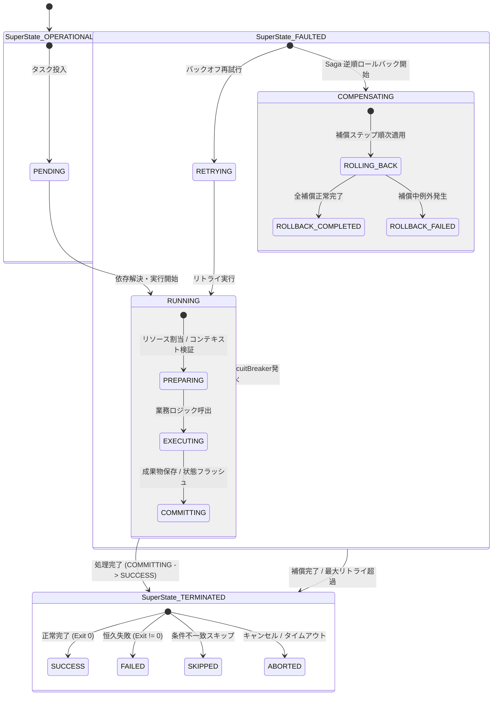

# [FEAT/ARCH] src/workflow における Task 実行ライフサイクルおよび Saga 補償トランザクションの HSM 統制 (ID: 225)

## 1. 概要 / Summary

現在、`src/workflow`（DAG ワークフロー実行、Saga 補償トランザクション、定期スケジューラー）におけるタスク状態および補償実行管理は、手続き型のフラグ管理や例外キャッチブロックに依存している。
この結果、以下のアーキテクチャ上の課題が存在している：

1. **タスク実行コンテキストの曖昧性**:
   - DAG タスクが実行中（`RUNNING`）であっても、「前処理中（PREPARING）」なのか「実処理中（EXECUTING）」なのか「コミット中（COMMITTING）」なのか識別不能。
2. **Saga 補償トランザクションの中断・リカバリ不能性**:
   - 障害発生時の逆順補償ステップ（Rollback）の実行途中で例外が発生した場合、どのステップまで補償が完了し、どこで停止したかの階層的状態コンテキストが失われる。
3. **スケジューラーのバックプレッシャー制御の未統制**:
   - `WorkflowScheduler` において、下流ワーカーの過負荷やキュー飽和時に「待機」「ディスパッチ」「バックプレッシャー一時停止」の決定論的遷移が統一管理されていない。

本 Issue では、DSN-23（階層型ステートマシン包括設計書）Phase 2 後半のロードマップに基づき、`src/core/hsm` を用いて `src/workflow/` の DAG Task、Saga Coordinator、および WorkflowScheduler のライフサイクルを HSM 駆動へ刷新する。

---

## 2. トレーサビリティ / Traceability

- **リポジトリ内設計仕様書 (DSN)**:
  - `docs/designs/DSN-23-hierarchical_state_machine_and_lifecycle_governance.md` (包括的設計仕様書: APPROVED - Phase 2.2)
  - `docs/designs/DSN-11-universal_workflow_engine.md` (汎用ワークフロー設計書)
  - `docs/designs/DSN-12-process_supervisor_and_arbiter.md` (プロセススーパーバイザー設計書)
- **関連 Issue**:
  - Issue 224 (HSM コアエンジンの実装および Supervisor ライフサイクル刷新)
  - Issue 223 (Spider 常駐デーモン化および Supervisor / Workflow 統合)

---

## 3. 脅威モデル分析とセキュリティ要件 (STRIDE Analysis & Security Controls)

| STRIDE 分類 | 具体的な脅威シナリオ | 従来の脆弱性 / 影響 | 本設計 (`DSN-23`) による HSM 緩和策 |
| :--- | :--- | :--- | :--- |
| **Spoofing (なりすまし)** | 未認可コンテキストからのタスク完了/スキップ偽装イベント注入 | 偽の SUCCESS 遷移による未完了タスクの次工程進行 | `EventContext` でタスクIDおよびトークンを検証。認可された実行エンジンからのみ遷移を受理。 |
| **Tampering (改ざん)** | Saga 補償ログの直接改ざんによるロールバック未実行化 | 不完全なロールバックによるデータ不整合の放置 | 補償ステップをイミュータブルリストとして保持。LCCA 経由でのみ補償アクションを順次トリガー。 |
| **Repudiation (否認)** | 補償失敗・タスク中断の原因ステップ不明 | 補償エラーのサイレント握りつぶし | `ROLLBACK_FAILED` 遷移時に失敗ステップ名と例外スタックトレースを構造化 JSON ログへ完全記録。 |
| **Information Disclosure (情報漏えい)** | 補償例外オブジェクトを通じた機密情報露出 | コンテキスト内のシークレットや認証情報のログ露出 | `_record_execution_error` 時のペイロードマスキングを徹底。 |
| **Denial of Service (DoS)** | 失敗タスクの無限リトライによるワーカー・CPU 枯渇 | リソース枯渇によるスケジューラー全体停止 | 親状態 `FAULTED` での最大リトライ回数ガード（`max_retries`）および指数バックオフ待機。 |
| **Elevation of Privilege (権限昇格)** | 補償失敗状態での業務処理継続（部分コミット） | トランザクション未達状態での後続高特権処理 | Fail-Secure 原則: 補償失敗時は即座に `TERMINATED.ABORTED` へ強制遷移し、DAG を安全停止。 |

---

## 4. 影響範囲と関連ファイル / Scope and Affected Files

- [x] [NEW] `src/workflow/contracts.py`:
  - `TaskState` 階層ステートツリー (`build_task_state_tree()`)
  - `SagaState` 階層ステートツリー (`build_saga_state_tree()`)
  - `SchedulerState` 階層ステートツリー (`build_scheduler_state_tree()`)
  - 共通イベント定義 (`EVENT_START`, `EVENT_SUCCESS`, `EVENT_FAIL`, `EVENT_RETRY`, `EVENT_COMPENSATE`, `EVENT_ABORT`)
- [x] [MODIFY] `src/workflow/dag.py`:
  - `TaskNode` への HSM バインディング
  - `DAGWorkflowEngine` のタスク実行時における `PREPARING` $\to$ `EXECUTING` $\to$ `COMMITTING` $\to$ `SUCCESS` 遷移の厳格化
- [x] [MODIFY] `src/workflow/saga.py`:
  - `SagaCoordinator` への HSM 補償トランザクション統合
  - フォワード実行成功・失敗時の `COMPENSATING.ROLLING_BACK` 遷移および逆順補償ステップの決定論的実行
- [x] [MODIFY] `src/workflow/scheduler.py`:
  - `WorkflowScheduler` の `IDLE` $\leftrightarrow$ `DISPATCHING` $\leftrightarrow$ `PAUSED` HSM ライフサイクル統制
- [x] [MODIFY] `src/workflow/__init__.py`:
  - 新規コントラクトおよびファクトリ関数の公開
- [x] [NEW] `tests/workflow/test_workflow_hsm.py`:
  - DAG Task 階層ライフサイクル、Saga 補償トランザクション HSM、スケジューラー状態遷移の 100% カバレッジテスト
- [x] [MODIFY] `docs/issues/README.md`:
  - Issue 台帳への登録

---

## 5. 実装方針 / Implementation Plan

Target Branch: `feat/225-implement-workflow-task-and-saga-hsm-governance`

### 1. `src/workflow/contracts.py` の新規作成
- ゼロ外部依存の `src/core/hsm` をインポートし、以下の HSM ツリービルダーを実装：
  - `build_task_state_tree()`:
    - `OPERATIONAL.PENDING`, `OPERATIONAL.RUNNING` (`PREPARING`, `EXECUTING`, `COMMITTING`)
    - `FAULTED.RETRYING`, `FAULTED.COMPENSATING` (`ROLLING_BACK`, `ROLLBACK_COMPLETED`, `ROLLBACK_FAILED`)
    - `TERMINATED` (`SUCCESS`, `FAILED`, `SKIPPED`, `ABORTED`)
  - `build_saga_state_tree()`:
    - `FORWARD.EXECUTING_STEP`, `FORWARD.STEP_SUCCESS`
    - `COMPENSATING.ROLLING_BACK`, `COMPENSATING.ROLLBACK_COMPLETED`, `COMPENSATING.ROLLBACK_FAILED`
    - `TERMINATED.COMMITTED`, `TERMINATED.ABORTED`
  - `build_scheduler_state_tree()`:
    - `OPERATIONAL.IDLE`, `OPERATIONAL.DISPATCHING`, `OPERATIONAL.BACKPRESSURE_PAUSED`
    - `TRANSITIONING.DRAINING`
    - `TERMINATED.STOPPED`, `TERMINATED.FAILED`

### 2. `src/workflow/dag.py` の HSM 統合
- `TaskNode` に `hsm: HierarchicalStateMachine` を保持。
- タスク実行ライフサイクルを `send_event` 経由で段階的に進行。
- 実行例外発生時、親状態 `FAULTED` へエスカレーション。

### 3. `src/workflow/saga.py` の HSM 統合
- `SagaCoordinator` に `hsm: HierarchicalStateMachine` を保持。
- フォワードステップ実行ごとに `FORWARD.EXECUTING_STEP` へ遷移。
- エラー検知時、`EVENT_COMPENSATE` を発火し `COMPENSATING.ROLLING_BACK` 状態へ移行。逆順補償を実行。
- 全補償完了時に `ROLLBACK_COMPLETED` ➔ `TERMINATED.ABORTED` へ着地。
- 既存の `PhaseProtocol` および `execute_phase_safely()` のインターフェース・戻り値後方互換性を 100% 維持。

### 4. `src/workflow/scheduler.py` の HSM 統制
- `WorkflowScheduler` に `hsm: HierarchicalStateMachine` をバインド。
- 定期実行ループ（`run_pending()`）において、タスクなし時は `IDLE`、ディスパッチ中は `DISPATCHING`、エラー発生時は安全に `IDLE` または `FAILED` へ着地。

---

## 6. 完了条件 / Success Criteria (DoD)

- [x] `src/workflow/contracts.py` に Task、Saga、Scheduler の 3 大 HSM 状態ツリー定義が実装されていること。
- [x] `TaskNode` の実行ライフサイクルが `PREPARING` $\to$ `EXECUTING` $\to$ `COMMITTING` $\to$ `SUCCESS` の決定論的順序で統制されていること。
- [x] `SagaCoordinator` が HSM 駆動で逆順補償ステップを安全に実行し、補償中断・失敗時も状態が失われないこと。
- [x] 既存の `tests/workflow/`（`test_circuit.py`, `test_dag.py`, `test_saga.py`, `test_spider_operator.py`, `test_streaming_dag.py`, `test_wal.py`）が一切回帰なく 100% PASS すること。
- [x] `tests/workflow/test_workflow_hsm.py` にて新規 HSM 状態遷移および補償動作が網羅検証されていること。
- [x] `make check_format` および `make static_analysis`（Xenon Grade A / CC $\le 4$, `mypy --strict`, `py_compile`）に 100% PASS すること。
- [x] `docs/issues/README.md` の Issue 台帳が更新されていること。

