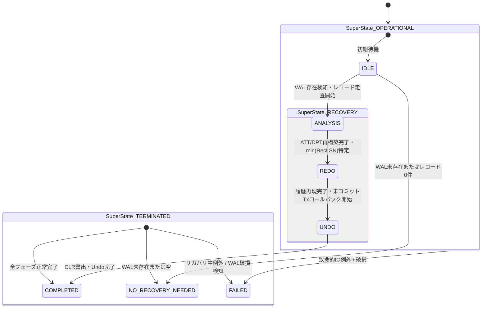

# [FEAT/ARCH] src/database における ARIES クラッシュリカバリプロトコルの HSM 統制およびカオス障害耐性の確立 (ID: 226)

## 1. 概要 / Summary

現在、`src/database/transaction/recovery.py`（および `src/database/recovery.py`）の `ARIESRecoveryManager` は、Analysis（分析）、Redo（履歴再現）、Undo（未コミットロールバック＆CLR書き込み）の 3 フェーズによる ARIES クラッシュリカバリプロトコルを提供している。
しかし、現状の実装には以下のアーキテクチャ上の課題が存在している：

1. **リカバリ実行コンテキストの階層的追跡不能性**:
   - `run_recovery()` が同期関数としてフラットに実行され、どのフェーズ（Analysis / Redo / Undo）のどのサブステップで実行中なのか、外部のスーパーバイザーやモニタリング層から階層的に状態を把握できない。
2. **リカバリ中再クラッシュ時のフェイルセキュア性**:
   - リカバリ処理の最中に電源断やプロセス強制終了（SIGKILL / OSクラッシュ）が発生した場合、中断されたフェーズの追跡と安全脱出遷移（Fail-Secure）が状態機械として形式化されていない。
3. **カオス耐性（Chaos VFS）の決定論的保証**:
   - DSN-23 Phase 3 仕様に基づき、HSM 駆動の決定論的フェーズ進行と例外トラップにより、障害復元中の堅牢性を数学的・形式的に保証する必要がある。

本 Issue では、DSN-23 Phase 3 ロードマップに基づき、`src/core/hsm` を用いて `src/database/transaction/recovery.py` の ARIES クラッシュリカバリライフサイクルを HSM 統制下に統合する。

---

## 2. トレーサビリティ / Traceability

- **リポジトリ内設計仕様書 (DSN)**:
  - `docs/designs/DSN-23-hierarchical_state_machine_and_lifecycle_governance.md` (包括的設計仕様書: APPROVED - Phase 3)
  - `docs/designs/DSN-05-database_engine_architecture.md` (自作 DBMS・ARIES リカバリ包括設計書)
  - `docs/designs/DSN-12-process_supervisor_and_arbiter.md` (プロセススーパーバイザー設計書)
- **関連 Issue**:
  - Issue 225 (Workflow Task & Saga 補償トランザクション HSM 統制)
  - Issue 224 (HSM コアエンジン実装 & Supervisor ライフサイクル統制)
  - Issue 194 (自作DB カオスVFS・電源断耐性証明)

---

## 3. 脅威モデル分析とセキュリティ要件 (STRIDE Analysis & Security Controls)

| STRIDE 分類 | 具体的な脅威シナリオ | 従来の脆弱性 / 影響 | 本設計 (`DSN-23`) による HSM 緩和策 |
| :--- | :--- | :--- | :--- |
| **Spoofing (なりすまし)** | リカバリ完了を偽装する不正イベントの注入 | 未完了状態でのDBオープンによるデータ不整合 | `EventContext` でリカバリセッションIDとスレッドIDを検証。認可されたマネージャーからのみ遷移を受理。 |
| **Tampering (改ざん)** | リカバリ中の中間メモリ状態（ATT/DPT）の改ざん | 不正なトランザクションがコミット扱いされるデータ破壊 | ATT/DPT を各フェーズ開始時に HSM ペイロードとイミュータブル分離。 |
| **Repudiation (否認)** | リカバリ中断・失敗時の原因フェーズ不明 | リカバリ失敗原因のサイレント化 | 状態遷移イベント（タイムスタンプ, from_state, to_state, record_count, error）を構造化 JSON ログへ完全記録。 |
| **Information Disclosure (情報漏えい)** | リカバリ例外ログへの機密テーブルデータの露出 | WAL 内容の機密テキスト漏洩 | エラー記録時のレコード生データマスキングを徹底。 |
| **Denial of Service (DoS)** | 破損 WAL によるリカバリ処理の無限ループ・ハング | DB 起動不能によるサービス停止 | 各フェーズ最大処理レコード数およびタイムアウトガードを HSM 親状態レベルで設置。 |
| **Elevation of Privilege (権限昇格)** | リカバリ失敗状態での読み書き可能オープン | 破損データに対する権限昇格操作 | Fail-Secure 原則: 失敗時は即座に `TERMINATED.FAILED` へ遷移し、DB を安全に Read-Only/Locked 状態に隔離。 |

---

## 4. 影響範囲と関連ファイル / Scope and Affected Files

- [x] [NEW] `src/database/transaction/contracts.py`:
  - ARIES リカバリ HSM 状態ツリー定義 (`build_aries_recovery_state_tree()`)
  - 共通イベント定数 (`EVENT_START_RECOVERY`, `EVENT_ANALYSIS_DONE`, `EVENT_REDO_DONE`, `EVENT_UNDO_DONE`, `EVENT_NO_RECOVERY`, `EVENT_FAIL`)
- [x] [MODIFY] `src/database/transaction/recovery.py`:
  - `ARIESRecoveryManager` に HSM インスタンスをバインド
  - 各フェーズ（Analysis $\to$ Redo $\to$ Undo）進行時に HSM イベントを発火
  - 例外発生時の安全脱出（`TERMINATED.FAILED`）
- [x] [MODIFY] `src/database/transaction/__init__.py` & `src/database/recovery.py`:
  - 新規コントラクトのエクスポートおよび互換性維持
- [x] [NEW] `tests/database/transaction/test_recovery_hsm.py`:
  - 正常リカバリ、空WAL、部分クラッシュ、例外トラップの HSM 状態遷移単体テスト
- [x] [MODIFY] `docs/issues/README.md`:
  - Issue 台帳への登録

---

## 5. 実装方針 / Implementation Plan

Target Branch: `feat/226-implement-database-aries-recovery-hsm-governance`

### 1. `src/database/transaction/contracts.py` の新規作成
- ゼロ外部依存の `src/core/hsm` を用いて、ARIES リカバリライフサイクルの HSM ツリービルダーを実装：
  - `ROOT`
    - `OPERATIONAL` (初期子: `IDLE`)
      - `IDLE`: リカバリ待機
      - `RECOVERY` (複合状態, 初期子: `ANALYSIS`)
        - `ANALYSIS`: ATT / DPT 再構築
        - `REDO`: Repeating History
        - `UNDO`: ロールバック & CLR 書き込み
    - `TERMINATED` (初期子: `COMPLETED`)
      - `COMPLETED`: リカバリ完全終了
      - `NO_RECOVERY_NEEDED`: WAL なし / 空
      - `FAILED`: 致命的エラー / WAL 破損
  - 遷移ルール:
    - `IDLE` + `EVENT_START_RECOVERY` ➔ `OPERATIONAL.RECOVERY.ANALYSIS`
    - `IDLE` + `EVENT_NO_RECOVERY` ➔ `TERMINATED.NO_RECOVERY_NEEDED`
    - `ANALYSIS` + `EVENT_ANALYSIS_DONE` ➔ `OPERATIONAL.RECOVERY.REDO`
    - `REDO` + `EVENT_REDO_DONE` ➔ `OPERATIONAL.RECOVERY.UNDO`
    - `UNDO` + `EVENT_UNDO_DONE` ➔ `TERMINATED.COMPLETED`
    - `OPERATIONAL` + `EVENT_FAIL` ➔ `TERMINATED.FAILED`

### 2. `src/database/transaction/recovery.py` の HSM 統合
- `ARIESRecoveryManager` に `self.hsm: HierarchicalStateMachine = build_aries_recovery_state_tree()` を追加。
- `run_recovery()` 内で各フェーズの境界で `self.hsm.send_event(...)` を発行。
- 既存の戻り値 `Tuple[int, int]` (redo_count, undo_count) および全メソッドシグネチャの完全後方互換性を保証。
- 例外発生時は `self.hsm.send_event(EVENT_FAIL, {"error": str(exc)})` を発行した上で再送出。

### 3. 単体テストの実装
- `tests/database/transaction/test_recovery_hsm.py` を作成：
  - 正常リカバリ時の `IDLE` $\to$ `ANALYSIS` $\to$ `REDO` $\to$ `UNDO` $\to$ `COMPLETED` 遷移検証。
  - WAL 未存在時の `NO_RECOVERY_NEEDED` 遷移検証。
  - 破損 WAL や例外発生時の `FAILED` 安全脱出検証。
  - 既存の全テスト（`test_wal_recovery.py`, `test_scenario_04_aries_crash_recovery.py` 等）の回帰ゼロ保証。

---

## 6. 完了条件 / Success Criteria (DoD)

- [x] `src/database/transaction/contracts.py` に ARIES リカバリ HSM 状態ツリービルダーが実装されていること。
- [x] `ARIESRecoveryManager` が HSM 駆動で Analysis $\to$ Redo $\to$ Undo の決定論的順序で統制されていること。
- [x] WAL なし・空 WAL 時に `TERMINATED.NO_RECOVERY_NEEDED` へ正しく遷移すること。
- [x] リカバリ例外時に `TERMINATED.FAILED` へ安全脱出すること。
- [x] 既存の `tests/database/transaction/test_wal_recovery.py` および `tests/database/scenarios/test_scenario_04_aries_crash_recovery.py` が一切回帰なく 100% PASS すること。
- [x] 新規単体テスト `tests/database/transaction/test_recovery_hsm.py` が 100% PASS すること。
- [x] `make check_format` および `make static_analysis`（Xenon Grade A / CC $\le 4$, `mypy --strict`, `py_compile`）に 100% PASS すること。
- [x] `docs/issues/README.md` の Issue 台帳が更新されていること。

