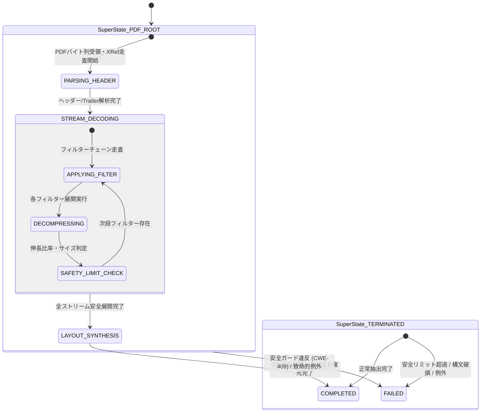

# [FEAT/SEC] src/pdf_engine におけるストリームデコード・安全ガード HSM ライフサイクル統制と Decompression Bomb 防御の実装 (ID: 227)

## 1. 概要 / Summary

自作 Pure-Python PDF エンジン（`src/pdf_engine/`）は、ISO 32000-1 準拠のパーサー、XRef 解決器、多重フィルターデコーダー（Flate, LZW, CCITT, JBIG2, ASCIIHex, ASCII85）、および 2D 空間レイアウトエンジンを備えている。
しかし、[DSN-23 §4.5 / §8.5 (Phase 4)](../../designs/DSN-23-hierarchical_state_machine_and_lifecycle_governance.md) に照らし、以下のセキュリティおよびアーキテクチャ上の課題が存在している：

1. **ストリーム展開時の安全ガード欠落（Decompression Bomb / Zip Bomb 脅威: CWE-409）**:
   - `StreamDecompressor.decompress()` は、入力ストリームの伸長比率（expansion ratio）や最大バイト数、ネストされたフィルター段数の制限を持たない。悪意ある PDF ストリーム（高圧縮率の null バイト列等）によりメモリ枯渇（OOM DoS）を引き起こす脆弱性がある。
2. **パース・ストリームデコード・合成フェーズのライフサイクル未統制**:
   - PDF 処理ライフサイクル（ヘッダー・XRef 解析 ➔ ストリーム多重展開 ➔ 安全検査 ➔ 空間レイアウト合成）が手続き型で実行され、どのフェーズで障害や時間超過が発生したかの階層的追跡ができない。
3. **フェイルセキュア脱出（Fail-Secure Escape）の未形式化**:
   - フィルター適用中や展開サイズ制限超過時に、ステートマシンレベルで安全側（`TERMINATED.FAILED`）へ強制脱出・リソース解放する統一的な例外トラップ機構が存在しない。

本 Issue では、DSN-23 Phase 4 ロードマップに基づき、`src/core/hsm` を用いて `src/pdf_engine/` のストリームデコード・安全ガードライフサイクルを HSM 統制下に統合し、CWE-409 防御を確立した。

---

## 2. トレーサビリティ / Traceability

- **リポジトリ内設計仕様書 (DSN)**:
  - `docs/designs/DSN-23-hierarchical_state_machine_and_lifecycle_governance.md` (包括的設計仕様書: APPROVED - Phase 4)
  - `docs/designs/DSN-01-high_level_design.md` (全体アーキテクチャ)
- **関連 Issue**:
  - Issue 224 (HSM コアエンジン & Supervisor 統制 - Phase 1)
  - Issue 225 (Workflow Task & Saga 補償トランザクション HSM 統制 - Phase 2)
  - Issue 226 (Database ARIES クラッシュリカバリ HSM 統制 - Phase 3)

---

## 3. 影響範囲と関連ファイル / Scope and Affected Files

- `src/pdf_engine/contracts.py`: `SafetyLimitConfig`, `PdfSafetyLimitExceededError`, `build_pdf_stream_hsm()`, イベント定数群
- `src/pdf_engine/decompress.py`: `StreamDecompressor.decompress()` の HSM & 安全ガード統合
- `src/pdf_engine/extractor.py`: `PurePdfTextExtractor` の HSM ライフサイクル統制統合
- `src/pdf_engine/image_extractor.py`: `PdfImageExtractor` の安全例外トラップ統合
- `src/pdf_engine/navigator.py`: `PageTreeNavigator` の HSM & ガード伝搬
- `src/pdf_engine/__init__.py`: 公開 API エクスポート
- `tests/pdf_engine/test_hsm_governance.py`: 単体・結合テストスイート
- `docs/issues/README.md`: Issue 台帳

---

## 4. 実装方針 / Implementation Plan

- **対象ブランチ**: `feat/227-implement-pdf-engine-stream-decoding-safety-guard-hsm-governance`

### Step 1: データ構造と HSM 状態ツリー構築
- `SafetyLimitConfig`:
  - `max_decompressed_bytes`: 32 MiB (デフォルト)
  - `max_expansion_ratio`: 1000.0 (デフォルト)
  - `max_filter_depth`: 5 (デフォルト)
- `build_pdf_stream_hsm(config)`:
  - `PDF_ROOT` 直下に `PARSING_HEADER`, `STREAM_DECODING` (複合状態), `LAYOUT_SYNTHESIS`, `TERMINATED` (`COMPLETED`, `FAILED`) を構築。
  - 親状態脱出（`EVENT_SAFETY_VIOLATION`, `EVENT_FAIL`）により `TERMINATED.FAILED` へ即座に安全脱出。

### Step 2: StreamDecompressor への安全ガード・HSM 統合
- フィルター適用前に深度チェック。
- フィルター適用ごとに `EVENT_DECOMPRESS` ➔ 展開 ➔ `EVENT_CHECK_SAFETY`。
- 比率超過・バイト上限超過時に `EVENT_SAFETY_VIOLATION` 発火 ➔ `PdfSafetyLimitExceededError` 送出。

### Step 3: PurePdfTextExtractor へのライフサイクル統合
- ドキュメント抽出開始から完了まで HSM で状態追跡。
- 例外時は `EVENT_FAIL` で確実にフェイルセキュア終了。

### Step 4: テスト & 品質ゲート
- Decompression Bomb 検証（比率超過・サイズ超過）。
- 多重フィルター深度超過検証。
- 破損入力時のフェイルセキュア検証。
- `make check_format`, `make static_analysis` (CC <= 4, mypy --strict) 適合。

---

## 5. 完了条件 / Definition of Done (DoD)

1. [x] `SafetyLimitConfig`, `PdfSafetyLimitExceededError`, `build_pdf_stream_hsm()` が `src/pdf_engine/contracts.py` に実装されていること。
2. [x] `StreamDecompressor.decompress()` が展開サイズ、伸長比率、フィルター深度を検証し、超過時に `PdfSafetyLimitExceededError` を送出すること。
3. [x] `PurePdfTextExtractor` が HSM 統制下で動作し、例外時に `TERMINATED.FAILED` に遷移すること。
4. [x] 単体テスト (`tests/pdf_engine/test_hsm_governance.py`) が全件パスすること。
5. [x] 既存の PDF エンジン全テスト (`tests/pdf_engine/`) が後方互換で全件パスすること。
6. [x] `make check_format` および `make static_analysis` (Xenon CC $\le 4$ Grade A, mypy strict) がパスすること。
