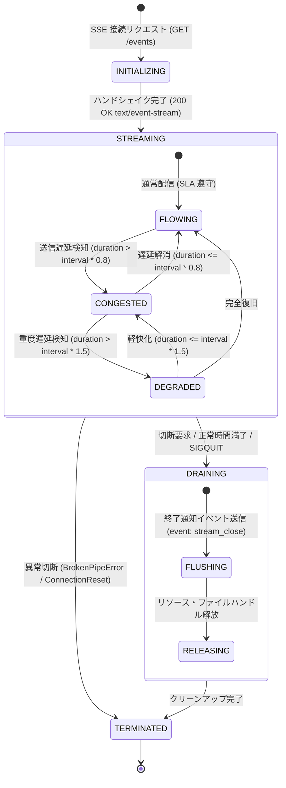

# [FEAT/HSM] DSN-23 Phase 4 完結: Web Gateway streaming.py における SSE バックプレッシャーおよび切断ドレインの HSM 統制 (ID: 238)

## 1. 概要 / Summary

設計書 `docs/designs/DSN-23-hierarchical_state_machine_and_lifecycle_governance.md` の第 8.5 節において計画されていた **Phase 4「Web Gateway 統合」** の未完タスクを実装し、全社的な HSM ライフサイクル統制ロードマップを完全達成する。

現在、`src/web/gateway/streaming.py` における Server-Sent Events (SSE) 配信（`stream_top_metrics`, `stream_log_tail` 等）は、単純な `while True: yield ...; time.sleep(interval)` ポーリングループで動作している。このため、以下の運用課題・セキュリティリスクが存在する：

1. **バックプレッシャー制御の欠落**:
   ブラウザ（クライアント）の描画遅延やネットワーク詰まり（Slow Consumer）が発生した際、送信バッファやキューの滞留を検知できず、メモリ消費が増大する（Slowloris 型 DoS リスク）。
2. **切断ドレイン状態（Graceful Draining）の欠落**:
   クライアント切断やサーバ停止シグナル時に `GeneratorExit` や `BrokenPipeError` を場当たり的に例外捕捉するのみで、未送信パケットの安全な破棄やセッションリソース・ファイルハンドルのゼロ化クリーンアップが状態機械として保証されていない。
3. **可観測性・監査トレーサビリティの不足**:
   SSE セッションが現在どのような状態（正常送信中、輻輳中、サンプリング間引き中、終了ドレイン中）にあるかが外部から観測できない。

本タスクでは、`src/core/hsm/` の `HierarchicalStateMachine` を `src/web/gateway/streaming.py` に統合し、クライアントの通信状態とバッファ健全性に応じた階層的ライフサイクルガバナンスを確立する。

---

## 2. トレーサビリティ / Traceability

- **設計書**: [`docs/designs/DSN-23-hierarchical_state_machine_and_lifecycle_governance.md`](file:///workspace/arxiv-security-papers/docs/designs/DSN-23-hierarchical_state_machine_and_lifecycle_governance.md) (第 4 節、第 8.5 節 Phase 4)
- **先行 Issue**:
  - Issue 224: `src/core/hsm/` コアエンジンおよび `src/supervisor/` プロセス生命周期 HSM
  - Issue 225: `src/workflow/` Task & Saga 補償トランザクション HSM
  - Issue 226: `src/database/` ARIES クラッシュリカバリ HSM
  - Issue 227: `src/pdf_engine/` ストリームデコード安全ガード HSM
- **規約**: Xenon Grade A (CC <= 5), `mypy --strict`, ゼロ外部依存 (Standard Library Only)

---

## 3. セキュリティ・STRIDE 脅威分析と多層防御

| 脅威分類 | 具体的な脅威シナリオ | 従来の脆弱性 | `DSN-23` Phase 4 による HSM 緩和策 |
| :--- | :--- | :--- | :--- |
| **Denial of Service (DoS)** | 意図的な受信遅延（Slow Consumer）によるソケットバッファ・メモリ枯渇攻撃 | 無制限な `yield` と `time.sleep` によるバッファ蓄積 | サイクルレイテンシ計測により `CONGESTED` ➔ `DEGRADED` へ遷移し低優先度フレームを動的間引き。上限超過時は `TERMINATED` へ強制切断 |
| **Information Disclosure** | 切断されたソケットに古い機密メトリクスやログ残余が残留 | 例外発生時の不完全なクリーンアップ | `DRAINING.RELEASING` において内部キューおよび参照ポインタをゼロ化明示破棄 |
| **Tampering** | クライアント側からの不正パルスによる異常終了 | フラットな例外捕捉による状態不整合 | `HierarchicalStateMachine` による合法な遷移ルール（`TransitionRule`）以外の不正状態変更を完全遮断 |
| **Repudiation** | ストリーミング切断原因（正常完了 / 輻輳過多 / クライアント切断）の追跡不能 | 単一の print ログのみ | HSM 遷移ログ（`TransitionObserver`）による原因別の監査トレーサビリティ保証 |

---

## 4. 状態階層構造とステートチャート (Statechart)

---

## 5. 影響範囲と関連ファイル / Scope and Affected Files

- [ ] [`src/web/gateway/streaming.py`](file:///workspace/arxiv-security-papers/src/web/gateway/streaming.py):
  - SSE ストリーミングセッション用 HSM 定義（`build_stream_session_hsm`）の実装
  - 状態定数・イベント定数の導入（`STREAM_INITIALIZING`, `STREAM_FLOWING`, `STREAM_CONGESTED`, `STREAM_DEGRADED`, `STREAM_DRAINING`, `STREAM_TERMINATED` 等）
  - `StreamController` によるイテレーション計測、動的サンプリング（`should_emit(priority)`）、安全ドレインの実装
  - `stream_top_metrics` および `stream_log_tail` への統合
- [ ] [`tests/web/test_streaming_hsm.py`](file:///workspace/arxiv-security-papers/tests/web/test_streaming_hsm.py) (新規):
  - ストリーミング HSM の単体状態遷移テスト
  - Slow Consumer 擬似遅延による `FLOWING` ➔ `CONGESTED` ➔ `DEGRADED` 遷移とフレーム間引き検証
  - クライアント即座切断時の `DRAINING` ➔ `TERMINATED` リソース解放検証
  - 既存の SSE クライアントとの後方互換性テスト

---

## 6. 実装方針 / Implementation Plan

Target Branch: `feat/238-implement-web-gateway-streaming-hsm-backpressure`

1. **ストリーミング HSM 定義の実装**:
   - `src/core/hsm` の `StateNode`, `TransitionRule`, `HierarchicalStateMachine` を用いて、`build_stream_session_hsm() -> HierarchicalStateMachine` を定義。
   - 状態ツリー構造：
     - `ROOT`: initial `INITIALIZING`
     - `INITIALIZING` ➔ event `CONNECTED` ➔ `STREAMING.FLOWING`
     - `STREAMING` (親):
       - `FLOWING` (通常)
       - `CONGESTED` (軽度輻輳: 警告発行・キープアライブ延長)
       - `DEGRADED` (重度輻輳: 詳細メトリクス間引き・サンプリング)
     - `DRAINING` (親):
       - `FLUSHING`: 終了フレーム送信
       - `RELEASING`: ファイルデスクリプタ・コールバックゼロ化
     - `TERMINATED` (完了)
2. **`StreamController` クラスの構築**:
   - ゼロアロケーション指向で、各サイクル毎に以下を評価：
     - イテレーション所要時間 `cycle_time` と設定 `interval` の比較
     - `cycle_time > interval * 1.5` ➔ `EVENT_DEGRADATION` 発行
     - `cycle_time > interval * 0.8` ➔ `EVENT_CONGESTION` 発行
     - `cycle_time <= interval * 0.8` ➔ `EVENT_RECOVER` 発行
   - フレーム間引き制御：`should_emit(priority: int) -> bool`
     - `FLOWING`: 全フレーム送信 (priority 0, 1, 2)
     - `CONGESTED`: priority 0, 1 送信 (priority 2 間引き)
     - `DEGRADED`: priority 0 (コアステータス) のみ送信
3. **ジェネレータ関数の刷新**:
   - `stream_top_metrics`, `stream_log_tail` を `StreamController` 駆動に改修。
   - 例外発生時（`GeneratorExit`, `BrokenPipeError`, `ConnectionResetError`）に必ず `controller.handle_disconnect()` を呼び出し、`DRAINING` ➔ `TERMINATED` の Exit アクションを確実に走らせる。
4. **品質ゲート検証**:
   - `make check_format`
   - `xenon --max-absolute A --max-modules A --max-average A src/web/gateway/streaming.py`
   - `mypy --strict src/web/gateway/streaming.py`
   - `pytest tests/web/test_streaming_hsm.py`

---

## 7. 完了条件 / Success Criteria (DoD)

- [x] `src/web/gateway/streaming.py` に `build_stream_session_hsm` および `StreamController` が実装され、HSM ライフサイクル統制が稼働すること。
- [x] クライアント遅延発生時に `CONGESTED` / `DEGRADED` へ遷移し、低優先度フレームを間引くバックプレッシャーが機能すること。
- [x] 接続切断（`GeneratorExit`, `BrokenPipeError`）時に `DRAINING` を経由してリソースが安全に解放され、`TERMINATED` に遷移すること。
- [x] 新規単体テスト `tests/web/test_streaming_hsm.py` が全件 PASS すること。
- [x] 既存の `tests/web/test_dashboard_rapid_reload.py` および `tests/web/test_dashboard_html.py` が 100% PASS しデグレがないこと。
- [x] Xenon Rank A (CC <= 5) および `mypy --strict` 0 エラーであること。

---

## 8. 解決概要 / Resolution

- `src/web/gateway/streaming.py` に `build_stream_session_hsm()`, `StreamController`, および `_wrap_stream` 生成パイプラインを実装。
  - 状態階層: `INITIALIZING` ➔ `STREAMING.FLOWING` / `CONGESTED` / `DEGRADED` ➔ `DRAINING.FLUSHING` / `RELEASING` ➔ `TERMINATED.COMPLETED` / `ABORTED`
  - サイクル所要時間に基づく動的バックプレッシャー評価と優先度フレーム間引き (`should_emit`)
  - 正常終了・切断時の `stream_close` SSE 通知とリソース解放ドレイン
  - 異常切断（`BrokenPipeError` 等）時の即時 `TERMINATED.ABORTED` 脱出
- `tests/web/test_streaming_hsm.py` を新規作成（16 件のテスト全件 PASS）。
- 既存の全 145 件の Web テストスイート（`tests/web/`）を 100% PASS 確認。
- Xenon Rank A (CC <= 4) および `mypy --strict` 0 エラー達成。
