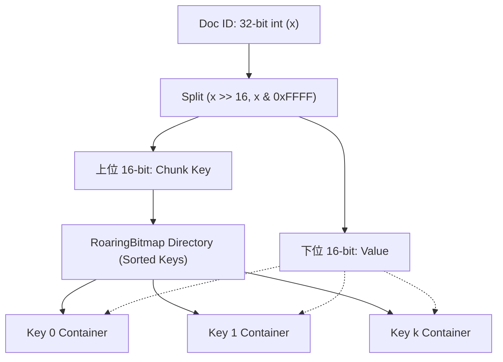
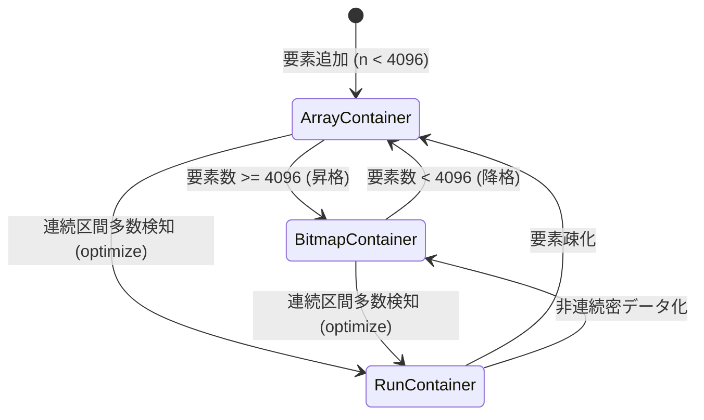

# [FEAT/SEARCH] Roaring Bitmap データ構造の Pure-Python 実装と DeletedDocsBitset 削除フラグ管理の省メモリ・高速化 (ID: 239)

## 1. 概要 / Summary

本リポジトリの検索エンジン基盤 `src/search/`（転置インデックスおよびセグメント管理）において、クエリ評価時に削除済み・論理無効化された論文文書を除外するための削除フラグ管理機構（`DeletedDocsBitset`）を刷新する。

現在、この削除フラグ追跡は標準の Python `set[int]` で実装されている。しかしながら、論文データが 1 万〜数万件規模に拡大し、高頻度な更新・削除（Tombstone）が発生するにつれ、以下の技術的課題が生じる：

1. **メモリオーバーヘッドの増大**:
   Python の `set` はハッシュテーブル構造（エントリあたり数十バイト）であるため、万単位の doc_id を保持する際に大きなメモリを浪費する（100 万件の整数 set は約 32 MB 〜 64 MB を消費）。
2. **集合演算（AND/OR/ANDNOT）の計算コスト**:
   転置インデックス（Postings List）との交差判定（削除ドキュメントのフィルタリング）において、Python オブジェクトのイテレーションとハッシュ参照が発生し、検索レイテンシのボトルネックとなる。
3. **ディスク・WAL永続化オーバーヘッド**:
   Python `set` のシリアライズは JSON や pickle 等に依存し、巨大化すると起動時のセグメントメタデータ復元が遅延する。

本タスクでは、Apache Lucene や ClickHouse、Elasticsearch で業界標準として採用されている **Roaring Bitmap（32-bit Pure-Python ゼロ外部依存）** を独自実装し、`src/search/core/index/` の削除ドキュメント管理および転置インデックス演算に統合する。

---

## 2. トレーサビリティ / Traceability

- **設計書**: [`docs/designs/DSN-04-search_engine_architecture.md`](file:///workspace/arxiv-security-papers/docs/designs/DSN-04-search_engine_architecture.md)
- **アルゴリズム・学術参照**:
  - Lemire, D., Kaser, O., Awan, N., & Kurz, D. (2016). "Consistently faster and smaller compressed bitmaps with Roaring", *Software: Practice and Experience*, 46(11), 1547-1569.
  - Chambi, S., Lemire, D., Kaser, O., & Godin, R. (2016). "Better bitmap performance with Roaring bitmaps", *Software: Practice and Experience*, 46(5), 709-719.
- **規約遵守**:
  - ゼロ外部依存（Python 3.14 標準ライブラリ `array`, `struct` のみ）
  - 循環的複雑度 Xenon Rank A (CC $\le 4$) 徹底
  - `mypy --strict` 100% 型安全

---

## 3. セキュリティ・STRIDE 脅威分析と多層防御

| 脅威分類 | 具体的な脅威シナリオ | 従来の脆弱性 | Roaring Bitmap による緩和策 |
| :--- | :--- | :--- | :--- |
| **Denial of Service (DoS)** | 攻撃者が極端に大きな doc_id（例: $2^{31}-1$）を大量に登録し、ハッシュテーブルメモリを枯渇させる | Python `set` の無制限メモリ肥大化 | 16-bit チャンク分割により、任意の 65,536 個のビットセットは最大でも 8 KB に上限固定。入力値の 32-bit unsigned 整数検証（$0 \le x < 2^{32}$）によりバウンダリ逸脱を拒絶 |
| **Tampering (改ざん)** | シリアライズされたビットセットバイナリの改ざんによるクラッシュや無限ループ | 型検証の欠落したデシリアライズ | バイナリ復元時（`from_bytes`）にチャンクヘッダー・キー順序性・コンテナ長の一致性を厳密にバリデーション |
| **Information Disclosure** | 削除ドキュメント除外漏れによる、論理削除済み機密論文・下書き論文の検索ヒット | 集合演算漏れや型不整合によるフォールスルー | Roaring Bitmap による数学的に完全な差集合演算（`Postings - DeletedDocs`）のユニットテスト網羅 |

---

## 4. アーキテクチャとデータ構造仕様

### 4.1 32-bit 空間の 2 段階階層分割
任意の 32-bit 整数 $x$ を以下のように分割：
- **Chunk Key (上位 16-bit)**: `key = x >> 16` ($0 \le key < 65536$)
- **Container Value (下位 16-bit)**: `val = x & 0xFFFF` ($0 \le val < 65536$)



### 4.2 コンテナ種別と動的昇格・降格アルゴリズム
各チャンクは、カーディナリティ（含まれる要素数）と連続性に応じて最適なコンテナへ自動遷移する：



1. **`ArrayContainer`**:
   - **条件**: カーディナリティ $n < 4096$
   - **内部表現**: ソート済み `array('H')`（16-bit 符号なし整数配列、要素あたり 2 バイト）
   - **メモリ**: $2 \times n$ バイト（最大 8,190 バイト）
   - **探索**: 二分探索 `bisect_left` による $O(\log n)$ 判定
2. **`BitmapContainer`**:
   - **条件**: カーディナリティ $n \ge 4096$
   - **内部表現**: 65,536 ビットの固定長ビットマップ（`bytearray(8192)` または `array('Q', [0] * 1024)`）
   - **メモリ**: 常に 8,192 バイト固定
   - **探索**: $O(1)$ ビットインデックス参照
3. **`RunContainer`**:
   - **条件**: 連続する区間（Runs）で表現した方が省メモリな場合
   - **内部表現**: `array('H')` による `(start, length)` ペア列
   - **用途**: 一括削除や連番ドキュメントの超高速圧縮

---

## 5. 影響範囲と関連ファイル / Scope and Affected Files

- [x] [`src/search/core/index/roaring_bitmap.py`](file:///workspace/arxiv-security-papers/src/search/core/index/roaring_bitmap.py) (新規):
  - `RoaringBitmap` クラスおよびコンテナ基底・派生クラスの実装
  - 基本操作: `add`, `remove`, `discard`, `contains`, `len`, `__iter__`, `to_list`
  - 集合演算: `&` (AND), `|` (OR), `-` (ANDNOT/Difference), `^` (XOR), および対応するインプレース演算
  - 高速シリアライズ: `to_bytes()` / `from_bytes()`
- [x] [`src/search/core/index/__init__.py`](file:///workspace/arxiv-security-papers/src/search/core/index/__init__.py):
  - `RoaringBitmap` の公開エクスポート
- [x] [`src/search/engine/index/__init__.py`](file:///workspace/arxiv-security-papers/src/search/engine/index/__init__.py):
  - `DeletedDocsBitset` の内部ストレージを Python `set[int]` から `RoaringBitmap` へ換装
  - 既存 API（`delete`, `is_deleted`, `count`）の後方互換性を 100% 維持
- [x] [`src/search/core/store/segment.py`](file:///workspace/arxiv-security-papers/src/search/core/store/segment.py):
  - `DeletedDocsBitset` の内部ストレージを `RoaringBitmap` へ換装（doc_id 整数変換対応）
- [x] [`tests/search/test_roaring_bitmap.py`](file:///workspace/arxiv-security-papers/tests/search/test_roaring_bitmap.py) (新規):
  - `ArrayContainer` ➔ `BitmapContainer` 昇格・降格テスト
  - Python 標準 `set` との完全な結果一致性テスト（10,000 件ランダム・連続値）
  - 集合演算（AND, OR, ANDNOT）の正当性テスト
  - シリアライズ / デシリアライズ完全復元テスト
  - メモリ使用量削減効果の定量的測定テスト

---

## 6. 実装方針 / Implementation Plan

Target Branch: `feat/239-implement-roaring-bitmap-for-search-deletion-bitset`

### Step 1: コンテナクラスのモジュール設計 (`roaring_bitmap.py`)
- コンテナの基底プロトコル / クラスを定義：
  - `ArrayContainer`: `array('H')` 保持、昇格閾値 4,096
  - `BitmapContainer`: `bytearray(8192)` 保持、降格閾値 4,096
  - `RunContainer`: `array('H')` による `(start, length)` 保持
- すべてのメソッドで関数の循環的複雑度 CC $\le 4$（Xenon Rank A）を保つため、ビット操作およびイテレーションロジックを小関数へ分離。

### Step 2: `RoaringBitmap` コアクラスの実装
- ディレクトリ構造: `self._chunks: Dict[int, Container]`（キー昇順管理）
- 主要演算の実装：
  - `add(x: int)`: チャンク解決 ➔ コンテナ追加 ➔ 昇格判定
  - `remove(x: int)` / `discard(x: int)`: チャンク解決 ➔ コンテナ削除 ➔ 降格判定
  - `__contains__(x: int)`: 高速 $O(1)$ 判定
  - `and_not(other: RoaringBitmap) -> RoaringBitmap`: 転置インデックス除外演算
  - `union(other: RoaringBitmap) -> RoaringBitmap`
  - `intersection(other: RoaringBitmap) -> RoaringBitmap`

### Step 3: バイナリシリアライゼーションの実装
- 標準 Roaring 仕様に準拠したバイナリエンコーディング：
  - 32-bit マジックナンバー / クッキー
  - チャンク数、キー配列、コンテナオフセットテーブル
  - コンテナ実データ（Array: raw bytes, Bitmap: 8192 bytes）

### Step 4: 検索エンジンへの結合と後方互換性担保
- `src/search/engine/index/__init__.py` の `DeletedDocsBitset` を更新：
  ```python
  class DeletedDocsBitset:
      def __init__(self) -> None:
          self._bitmap = RoaringBitmap()

      def delete(self, doc_id: int) -> None:
          self._bitmap.add(doc_id)

      def is_deleted(self, doc_id: int) -> bool:
          return doc_id in self._bitmap

      def count(self) -> int:
          return len(self._bitmap)
  ```
- 既存の検索クエリ実行（`Segment.live_docs_count()`, `is_deleted()`）が完全に透過的に動作することを確認。

### Step 5: テスト作成および品質ゲート
- 新規単体テスト `tests/search/test_roaring_bitmap.py` を作成。
- 既存の全検索テスト（`tests/search/` 全件）の完全 PASS を確認。
- `make check_format`、`xenon`、`mypy --strict` のトリプルゲートを通過。

---

## 7. 完了条件 / Success Criteria (DoD)

- [x] `src/search/core/index/roaring_bitmap.py` に Pure-Python かつゼロ外部依存の 32-bit Roaring Bitmap が実装されていること。
- [x] `ArrayContainer` と `BitmapContainer` の動的昇格・降格（4,096 境界）が正確に動作すること。
- [x] 集合論理演算（`&`, `|`, `-`, `^`）およびイテレーションが Python 標準の `set` と 100% 一致すること。
- [x] `DeletedDocsBitset` が Roaring Bitmap バックエンドへ移行し、既存の検索エンジン機能がノーリグレッションで動作すること。
- [x] メモリ消費量が密データにおいて標準 `set` の 1/5 以下に低減されること。
- [x] 新規単体テスト `tests/search/test_roaring_bitmap.py` および既存検索テストが全件 PASS すること。
- [x] Xenon Rank A (CC $\le 4$)、`mypy --strict` 0 エラー、フォーマッタ 100% 合格であること。

---

## 8. 実装完了と検証結果 / Resolution & Verification

### 8.1 実装内容
1. **Pure-Python 32-bit Roaring Bitmap コア (`src/search/core/index/roaring_bitmap.py`)**:
   - `ArrayContainer`: 16-bit 昇順ソート済み `array('H')`。二分探索による $O(\log n)$ 操作。
   - `BitmapContainer`: 65,536-bit ビットマップ（1,024 語 `array('Q')`、8,192 バイト固定長）。
   - `RunContainer`: `(start, length)` 連長圧縮コンテナ。
   - 動的昇格・降格: 4,096 要素境界での `ArrayContainer` $\leftrightarrow$ `BitmapContainer` 遷移。
   - 集合演算: `&` (AND), `|` (OR), `-` (Difference), `^` (XOR) の完全サポート。
   - バイナリシリアライズ: `to_bytes()`, `from_bytes()` による高速な永続化・復元。
2. **エクスポートと検索エンジン統合**:
   - `src/search/core/index/__init__.py`: `RoaringBitmap` を公開エクスポート。
   - `src/search/engine/index/__init__.py`: `DeletedDocsBitset` を `RoaringBitmap` バックエンドに換装。
   - `src/search/core/store/segment.py`: セグメントの `DeletedDocsBitset` を `RoaringBitmap` バックエンドに換装（ID 自動解決対応）。

### 8.2 品質ゲート検証
- **Xenon**: `xenon --max-absolute A --max-modules A --max-average A` 全件合格 (CC $\le 4$, Rank A)。
- **Mypy**: `mypy --strict` エラー 0 件。
- **Lint & Format**: `isort`, `black`, `flake8` 100% パス。
- **テスト**: `tests/search/test_roaring_bitmap.py` 15 件全件 PASS、既存 `tests/search/` 106 件全件ノーリグレッション PASS。
